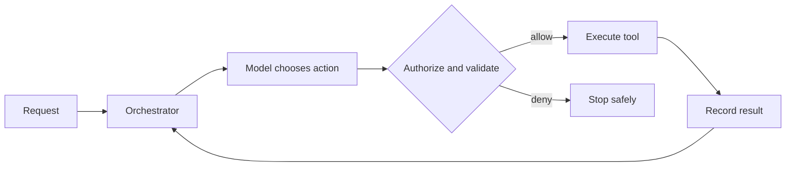

Tool selection, controlled execution, agent loops and the boundary between agents and workflows.

## Core Flow

## Revision Map

### How do you implement tool/function calling in Spring AI?

@Tool, tool registration, arguments, execution, results form a controlled end-to-end capability rather than a set of independent features.

- **Key areas:** @Tool, tool registration, arguments, execution, results.
- **How it works:** Define what enters each boundary, what transformation or decision occurs, and what invariant must hold before the result moves forward.
- **Production:** In production, make limits and failure behavior explicit and measure quality, latency, security and cost across the complete path.

### How does Spring AI handle the interaction between the LLM and tools?

Tool definitions → model selection → tool call → Java execution → tool result → model form a controlled end-to-end capability rather than a set of independent features.

- **Key areas:** Tool definitions → model selection → tool call → Java execution → tool result → model.
- **How it works:** Define what enters each boundary, what transformation or decision occurs, and what invariant must hold before the result moves forward.
- **Production:** In production, make limits and failure behavior explicit and measure quality, latency, security and cost across the complete path.

### How do you secure Spring AI tools?

Treat Authentication, authorization, RBAC, input validation, tool allow-list as deterministic controls enforced at the application, retrieval and tool boundaries.

- **Key areas:** Authentication, authorization, RBAC, input validation, tool allow-list.
- **How it works:** Identity, tenant scope and permissions must come from authenticated server context, never from prompt text or model output.
- **Production:** Apply least privilege, validate every requested action and preserve an audit trail across fallback and retry paths.

### What is an AI Agent? How is it different from a traditional RAG application?

Reasoning, planning, tool selection, action, observation, iteration form a controlled end-to-end capability rather than a set of independent features.

- **Key areas:** Reasoning, planning, tool selection, action, observation, iteration.
- **How it works:** Define what enters each boundary, what transformation or decision occurs, and what invariant must hold before the result moves forward.
- **Production:** In production, make limits and failure behavior explicit and measure quality, latency, security and cost across the complete path.

### Walk me through the complete execution flow of an AI Agent.

Separate the design into explicit components for User → LLM → tool selection → tool execution → result → LLM → next action/final answer, with a clear contract and owner for each boundary.

- **Key areas:** User → LLM → tool selection → tool execution → result → LLM → next action/final answer.
- **How it works:** Show how authenticated context, state and evidence move through the system, and where deterministic policy constrains model decisions.
- **Production:** Then explain bottlenecks, partial failures, recovery, scaling signals and the metrics that prove the complete task works.

### What is tool/function calling?

Tool schema, function name, parameters, model-generated tool call, application execution form a controlled end-to-end capability rather than a set of independent features.

- **Key areas:** Tool schema, function name, parameters, model-generated tool call, application execution.
- **How it works:** Define what enters each boundary, what transformation or decision occurs, and what invariant must hold before the result moves forward.
- **Production:** In production, make limits and failure behavior explicit and measure quality, latency, security and cost across the complete path.

### How does the LLM decide which tool to call?

Tool descriptions, schemas, model capability, context, prompt/instructions form a controlled end-to-end capability rather than a set of independent features.

- **Key areas:** Tool descriptions, schemas, model capability, context, prompt/instructions.
- **How it works:** Define what enters each boundary, what transformation or decision occurs, and what invariant must hold before the result moves forward.
- **Production:** In production, make limits and failure behavior explicit and measure quality, latency, security and cost across the complete path.

### How do you define tools in Spring AI?

@Tool, tool methods, descriptions, parameters, registration form a controlled end-to-end capability rather than a set of independent features.

- **Key areas:** @Tool, tool methods, descriptions, parameters, registration.
- **How it works:** Define what enters each boundary, what transformation or decision occurs, and what invariant must hold before the result moves forward.
- **Production:** In production, make limits and failure behavior explicit and measure quality, latency, security and cost across the complete path.

### How do you decide which operations should become Agent tools?

Business value, determinism, security, side effects, idempotency, authorization form a controlled end-to-end capability rather than a set of independent features.

- **Key areas:** Business value, determinism, security, side effects, idempotency, authorization.
- **How it works:** Define what enters each boundary, what transformation or decision occurs, and what invariant must hold before the result moves forward.
- **Production:** In production, make limits and failure behavior explicit and measure quality, latency, security and cost across the complete path.

### How do you secure AI Agent tools?

Treat Authentication, authorization, RBAC, allow-list, input validation, tenant isolation as deterministic controls enforced at the application, retrieval and tool boundaries.

- **Key areas:** Authentication, authorization, RBAC, allow-list, input validation, tenant isolation.
- **How it works:** Identity, tenant scope and permissions must come from authenticated server context, never from prompt text or model output.
- **Production:** Apply least privilege, validate every requested action and preserve an audit trail across fallback and retry paths.

### How do you handle tools that modify data?

Confirmation, authorization, idempotency, transaction boundaries, audit trail form a controlled end-to-end capability rather than a set of independent features.

- **Key areas:** Confirmation, authorization, idempotency, transaction boundaries, audit trail.
- **How it works:** Define what enters each boundary, what transformation or decision occurs, and what invariant must hold before the result moves forward.
- **Production:** In production, make limits and failure behavior explicit and measure quality, latency, security and cost across the complete path.

### How do you control the number of tools exposed to an LLM?

Tool allow-list, context size, domain-specific tools, dynamic tool selection form a controlled end-to-end capability rather than a set of independent features.

- **Key areas:** Tool allow-list, context size, domain-specific tools, dynamic tool selection.
- **How it works:** Define what enters each boundary, what transformation or decision occurs, and what invariant must hold before the result moves forward.
- **Production:** In production, make limits and failure behavior explicit and measure quality, latency, security and cost across the complete path.

### What is the difference between an Agent, Workflow, and Orchestrator?

Separate the design into explicit components for Autonomous decision-making vs deterministic flow vs coordination, with a clear contract and owner for each boundary.

- **Key areas:** Autonomous decision-making vs deterministic flow vs coordination.
- **How it works:** Show how authenticated context, state and evidence move through the system, and where deterministic policy constrains model decisions.
- **Production:** Then explain bottlenecks, partial failures, recovery, scaling signals and the metrics that prove the complete task works.

### When should you NOT use an AI Agent?

Start from the deterministic alternative and identify exactly where interpretation or dynamic action is required.

- **Key areas:** Deterministic business logic, strict compliance, predictable workflows, latency-sensitive operations.
- **How it works:** Evaluate Deterministic business logic, strict compliance, predictable workflows, latency-sensitive operations against latency, compliance, predictability and operating cost.
- **Production:** Use an agent only when measured task-quality improvement outweighs its additional nondeterminism and failure surface.

### When would you choose multi-agent over a single agent?

Complexity, domain separation, independent capabilities, parallelism vs overhead form a controlled end-to-end capability rather than a set of independent features.

- **Key areas:** Complexity, domain separation, independent capabilities, parallelism vs overhead.
- **How it works:** Define what enters each boundary, what transformation or decision occurs, and what invariant must hold before the result moves forward.
- **Production:** In production, make limits and failure behavior explicit and measure quality, latency, security and cost across the complete path.

### Design a production Agentic AI architecture using Java 21 + Spring AI.

Separate the design into explicit components for All components + security + observability + resilience + scaling, with a clear contract and owner for each boundary.

- **Key areas:** All components + security + observability + resilience + scaling.
- **How it works:** Show how authenticated context, state and evidence move through the system, and where deterministic policy constrains model decisions.
- **Production:** Then explain bottlenecks, partial failures, recovery, scaling signals and the metrics that prove the complete task works.

### Walk me through the complete Agent execution flow.

Separate the design into explicit components for Reason → tool → result → next action, with a clear contract and owner for each boundary.

- **Key areas:** Reason → tool → result → next action.
- **How it works:** Show how authenticated context, state and evidence move through the system, and where deterministic policy constrains model decisions.
- **Production:** Then explain bottlenecks, partial failures, recovery, scaling signals and the metrics that prove the complete task works.

### How does an LLM decide which tool to call?

Function/tool calling form a controlled end-to-end capability rather than a set of independent features.

- **Key areas:** Function/tool calling.
- **How it works:** Define what enters each boundary, what transformation or decision occurs, and what invariant must hold before the result moves forward.
- **Production:** In production, make limits and failure behavior explicit and measure quality, latency, security and cost across the complete path.

### How do you secure Agent tools?

Treat IAM/RBAC/authorization as deterministic controls enforced at the application, retrieval and tool boundaries.

- **Key areas:** IAM/RBAC/authorization.
- **How it works:** Identity, tenant scope and permissions must come from authenticated server context, never from prompt text or model output.
- **Production:** Apply least privilege, validate every requested action and preserve an audit trail across fallback and retry paths.

### A tool call times out. What happens next?

Retry, idempotency, unknown state form a controlled end-to-end capability rather than a set of independent features.

- **Key areas:** Retry, idempotency, unknown state.
- **How it works:** Define what enters each boundary, what transformation or decision occurs, and what invariant must hold before the result moves forward.
- **Production:** In production, make limits and failure behavior explicit and measure quality, latency, security and cost across the complete path.

## Interview Lens

Keep probabilistic interpretation separate from authorization, policy, transactions and recovery. Explain trade-offs with evidence: task quality, latency, resilience, security, operating cost and auditability.
