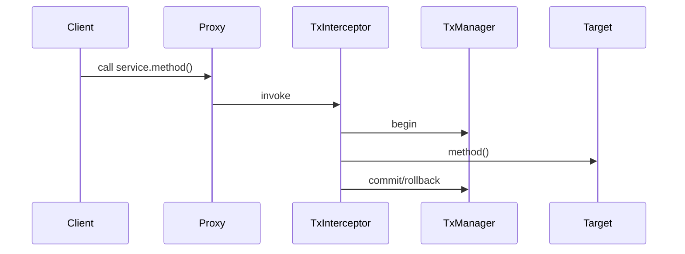

## How does @Transactional work?

**Difficulty:** Hard  
**Expected Answer Time:** 3 min

### Short Answer

Spring creates a JDK or CGLIB proxy around the bean; `TransactionInterceptor` opens/commits/rolls back a `PlatformTransactionManager` transaction around the method.

### Detailed Explanation

At startup, `InfrastructureAdvisorAutoProxyCreator` wraps `@Transactional` beans. On invoke: `TransactionAspectSupport` gets transaction attribute (propagation, isolation, timeout), calls `transactionManager.getTransaction()`, proceeds, commits or rolls back on exception policy. Default: `PROPAGATION_REQUIRED`, rollback on unchecked exceptions only.

### Internal Working

Self-invocation (`this.method()`) bypasses proxy — no transaction. Fix: inject self, move to another bean, or `AopContext.currentProxy()`.

### Production Notes

Keep transactions short — no HTTP calls inside. Use `readOnly=true` on queries for Hibernate optimization hint.

### Common Mistakes

`@Transactional` on controller — wrong layer. `@Transactional` on private method — ignored (proxy doesn't intercept).

### Follow-up Questions

- Which TransactionManager for JPA?
- How does rollbackFor work?

---
## What is the N+1 problem?

**Difficulty:** Hard  
**Expected Answer Time:** 3 min

### Short Answer

One query loads N parent rows; lazy loading triggers N additional queries when accessing each child collection.

### Detailed Explanation

Occurs with `FetchType.LAZY` and iterating associations in service or (worse) open session in view. Fixes: `JOIN FETCH` in JPQL, `@EntityGraph`, DTO projection (`@Query` constructor expression), `batch_size` hint, or `hibernate.default_batch_fetch_size`.

### Internal Working

Hibernate Session first-level cache deduplicates within persistence context. Second-level cache (EhCache, Redis via Hibernate) caches entity data across sessions — requires careful invalidation.

### Production Notes

Set `spring.jpa.open-in-view=false` in production. Use `@Transactional(readOnly=true)` on read services.

### Common Mistakes

Enabling OSIV to 'fix' LazyInitializationException in controllers. Eager fetch everything — cartesian product explosions.

### Follow-up Questions

- Explain first-level vs second-level cache?
- When is `@Modifying` required?

---
## Lazy vs Eager loading?

**Difficulty:** Medium  
**Expected Answer Time:** 1 min

### Short Answer

Lazy (default for collections): load on access within session. Eager: load immediately with parent — risks over-fetching.

### Detailed Explanation

`@ManyToOne` defaults EAGER in JPA spec (Hibernate same) — often change to LAZY explicitly. Lazy requires active persistence context or join fetch in query.

### Internal Working

Lazy collections use bytecode enhancement or `PersistentBag` placeholders.

### Production Notes

Default LAZY on `@OneToMany`. Fetch joins in repository for known access paths.

### Common Mistakes

Serializing lazy entities to JSON — triggers lazy load or `LazyInitializationException`.

### Follow-up Questions

- Bytecode enhancement?
- DTO vs entity in API?

---
## Optimistic vs pessimistic locking?

**Difficulty:** Medium  
**Expected Answer Time:** 1 min

### Short Answer

Optimistic: `@Version` column — detect conflict at flush. Pessimistic: DB row/page lock via `@Lock(LockModeType.PESSIMISTIC_WRITE)`.

### Detailed Explanation

Optimistic suits low contention — `OptimisticLockException` on stale version. Pessimistic: `SELECT FOR UPDATE` — deadlocks possible, holds DB connections. `PESSIMISTIC_READ` vs `WRITE` depends on DB.

### Internal Working

Spring Data: `@Lock` on query method. Timeout via `javax.persistence.lock.timeout` hint.

### Production Notes

Retry optimistic conflicts with exponential backoff. Use pessimistic for financial debit/credit short transactions.

### Common Mistakes

No version field on hot concurrent entity. Long-held pessimistic locks under load.

### Follow-up Questions

- What is SKIP LOCKED?
- Saga vs local transaction?

---
## Transaction propagation and isolation?

**Difficulty:** Hard  
**Expected Answer Time:** 3 min

### Short Answer

Propagation defines how methods join existing TX (`REQUIRED`, `REQUIRES_NEW`, `NESTED`, etc.). Isolation maps to JDBC isolation levels.

### Detailed Explanation

`REQUIRES_NEW` suspends outer TX — use for audit log that must commit independently. `NESTED` uses savepoints — not all drivers support. Isolation: `READ_COMMITTED` default on PostgreSQL; `REPEATABLE_READ` prevents non-repeatable reads; `SERIALIZABLE` strongest, most contention.

### Internal Working

`AbstractPlatformTransactionManager` delegates to `Connection.setTransactionIsolation`.

### Production Notes

Match isolation to business — don't default SERIALIZABLE. `readOnly=true` doesn't guarantee read replica routing without extra config.

### Common Mistakes

Nested `@Transactional` with wrong propagation causing partial commits. Remote calls inside REQUIRED transaction.

### Follow-up Questions

- Does `@Transactional` work on self call?
- Distributed transactions without 2PC?

---
## Query optimization in Spring Data JPA?

**Difficulty:** Medium  
**Expected Answer Time:** 1 min

### Short Answer

Derived queries for simple paths; `@Query` JPQL for explicit joins; projections for read models; pagination at DB; indexes on filter/sort columns.

### Detailed Explanation

Native SQL for CTEs/window functions — bypasses change tracking. `@EntityGraph` on `findById`. Specifications for dynamic predicates. Hibernate statistics or `datasource-proxy` for slow query detection.

### Internal Working

Query derivation parsed into `PartTreeJpaQuery`.

### Production Notes

Explain analyze in staging. Avoid `select *` entity loads when 2 columns needed.

### Common Mistakes

`findAll()` without pagination. Native query returning entities with wrong column order.

### Follow-up Questions

- Blaze Persistence?
- When native over JPQL?

---

## See Also

- [Previous: REST API](/spring-boot/rest-api-design/)
- [Next: Security](/spring-boot/security/)
- [Cache & Perf](/spring-boot/caching-performance/)
- [100+ Interview Questions](/spring-boot/interview-questions/)
- [Spring Boot Handbook Index](/spring-boot/)
- [Java Engineering](/java-engineering/)
- [Microservices Playbook](/microservices/) — Saga, Outbox, CQRS, API Gateway
- [Kafka Handbook](/kafka-handbook/)
- [Security Architecture](/security-architecture/)
