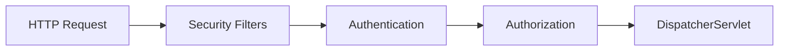

## Explain the Spring Security filter chain.

**Difficulty:** Hard  
**Expected Answer Time:** 3 min

### Short Answer

A chain of `Filter` beans runs before `DispatcherServlet`; `SecurityFilterChain` `@Bean` configures `HttpSecurity` — authn, authz, CSRF, headers, OAuth2 resource server.

### Detailed Explanation

Boot 3: no `WebSecurityConfigurerAdapter`. Multiple chains possible with `@Order`. Key filters: `SecurityContextHolderFilter`, `LogoutFilter`, `BearerTokenAuthenticationFilter` (JWT), `AuthorizationFilter`. `SecurityContext` stored in `ThreadLocal` (or `SecurityContextHolderStrategy` for reactive).

### Internal Working

### Production Notes

Permit `/actuator/health` explicitly. Separate chain for actuator with mTLS or IP allowlist.

### Common Mistakes

Disabling CSRF on session cookies without understanding risk. `permitAll()` on `/**` by mistake.

### Follow-up Questions

- Filter order customization?
- SecurityContext in async threads?

---
## Authentication vs Authorization?

**Difficulty:** Easy  
**Expected Answer Time:** 30 sec

### Short Answer

Authentication: who you are (`Authentication` principal). Authorization: what you're allowed (`AccessDecisionManager`, `@PreAuthorize`).

### Detailed Explanation

Authn produces `Authentication` with credentials and authorities. Authz checks roles/scopes before method or URL access. 401 unauthenticated; 403 authenticated but denied.

### Internal Working

`ProviderManager` delegates to `AuthenticationProvider` list.

### Production Notes

Don't leak 404 for unauthorized resources if policy requires hiding existence.

### Common Mistakes

Confusing 401 vs 403 in API clients.

### Follow-up Questions

- How are roles mapped from JWT?
- Method security vs URL security?

---
## JWT validation flow in Spring Boot?

**Difficulty:** Hard  
**Expected Answer Time:** 3 min

### Short Answer

Resource server receives Bearer token → `NimbusJwtDecoder` fetches JWK set from issuer → validates signature, `exp`, `iss`, `aud` → builds `JwtAuthenticationToken`.

### Detailed Explanation

Configure `spring.security.oauth2.resourceserver.jwt.issuer-uri` or `jwk-set-uri`. Custom `JwtAuthenticationConverter` maps `scope`/`roles` claims to `GrantedAuthority`. For local validation without network: static public key PEM.

### Internal Working

`BearerTokenAuthenticationFilter` extracts token from `Authorization` header.

### Production Notes

Short access token TTL; rotate refresh tokens. Validate audience for multi-tenant IdPs. Clock skew tolerance.

### Common Mistakes

Trusting unsigned JWTs. Parsing without signature verification. Logging full token.

### Follow-up Questions

- Opaque token vs JWT?
- How to propagate JWT to downstream calls?

---
## Method security and RBAC?

**Difficulty:** Medium  
**Expected Answer Time:** 1 min

### Short Answer

`@EnableMethodSecurity` + `@PreAuthorize("hasRole('ADMIN')")` or `@PostAuthorize` enforces fine-grained authz on service methods.

### Detailed Explanation

SpEL in annotations — `hasAuthority`, `hasPermission` with custom `PermissionEvaluator`. RBAC: roles in JWT → `ROLE_*` prefix convention. Prefer permission-based over role explosion.

### Internal Working

AOP proxy around secured methods — same self-invocation caveat as `@Transactional`.

### Production Notes

Deny by default. Centralize role constants. Test security with `@WithMockUser` / `@WithJwt`.

### Common Mistakes

Securing only controllers — service layer callable internally bypasses URL security.

### Follow-up Questions

- `@PreFilter` for collections?
- OAuth2 scopes vs roles?

---

## See Also

- [Previous: Data & TX](/spring-boot/data-and-transactions/)
- [Next: Cache & Perf](/spring-boot/caching-performance/)
- [Observability](/spring-boot/observability/)
- [100+ Interview Questions](/spring-boot/interview-questions/)
- [Spring Boot Handbook Index](/spring-boot/)
- [Java Engineering](/java-engineering/)
- [Microservices Playbook](/microservices/) — Saga, Outbox, CQRS, API Gateway
- [Kafka Handbook](/kafka-handbook/)
- [Security Architecture](/security-architecture/)
