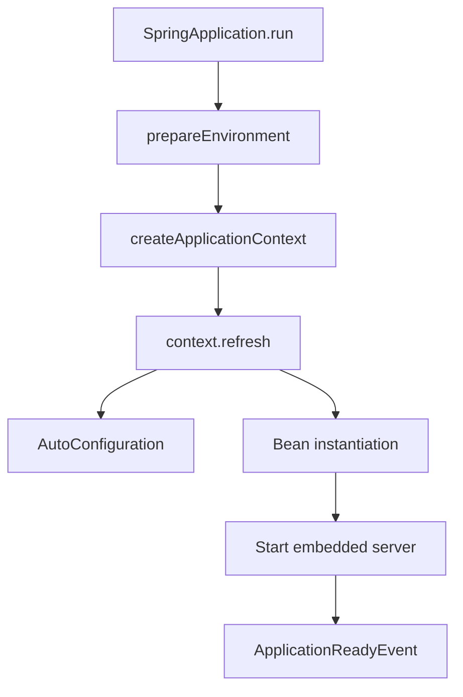

## How does Spring Boot startup work?

**Difficulty:** Hard  
**Expected Answer Time:** 3 min

### Short Answer

`SpringApplication.run` builds an `ApplicationContext`, loads environment, applies auto-configuration, refreshes beans, starts embedded web server, then runs `ApplicationRunner`/`CommandLineRunner`.

### Detailed Explanation

Phases: (1) create `SpringApplication` — infer web app type, load `ApplicationContextInitializer` and `ApplicationListener`; (2) `prepareEnvironment` — property sources, profiles; (3) `printBanner`; (4) `createApplicationContext`; (5) `prepareContext` — post-processors, `ApplicationArguments` bean; (6) `refresh` — bean definition loading, `BeanFactoryPostProcessor`, bean instantiation; (7) `callRunners`; (8) publish `ApplicationReadyEvent`. Fail-fast on missing beans or circular dependencies.

### Internal Working

Auto-config classes load from `META-INF/spring/org.springframework.boot.autoconfigure.AutoConfiguration.imports` (Boot 3). Each `@AutoConfiguration` class uses `@ConditionalOnClass`, `@ConditionalOnProperty`, `@ConditionalOnMissingBean` to register beans only when classpath and config match.

### Production Notes

Use `spring-boot-starter-actuator` + `startup` endpoint to profile slow auto-config. Exclude unused auto-config (`@SpringBootApplication(exclude = ...)`) to cut startup time in lambdas/scale-to-zero.

### Common Mistakes

Assuming startup is instant — cold start matters for K8s HPA and serverless. Ignoring `ApplicationContext` refresh failures buried in nested causes.

### Follow-up Questions

- What runs first — `@PostConstruct` or `ApplicationRunner`?
- How does lazy initialization affect startup?

---
## How does auto-configuration work?

**Difficulty:** Hard  
**Expected Answer Time:** 3 min

### Short Answer

Classpath-triggered conditional `@Configuration` classes register beans when `@Conditional*` predicates pass; user `@Bean` wins via `@ConditionalOnMissingBean`.

### Detailed Explanation

Spring Boot imports hundreds of auto-config entries. Each class is a `@Configuration` guarded by conditions: e.g. `DataSourceAutoConfiguration` requires JDBC on classpath and no existing `DataSource` bean. Ordering uses `@AutoConfigureBefore` / `@AutoConfigureAfter`. Debugging: `--debug` logs positive/negative matches. Custom starters ship their own `AutoConfiguration.imports`.

### Internal Working

Boot 2 used `META-INF/spring.factories`; Boot 3 uses `AutoConfiguration.imports` — faster, no duplicate parsing. `spring.autoconfigure.exclude` property disables entries globally.

### Production Notes

Trim starters — each pulls transitive auto-config. Use `spring-context-indexer` for large apps.

### Common Mistakes

Thinking auto-config replaces understanding bean wiring. Using `@ComponentScan` on wrong package and wondering why beans missing.

### Follow-up Questions

- Difference between `@Import` and auto-config?
- How to write a custom starter?

---
## Explain the Spring bean lifecycle.

**Difficulty:** Medium  
**Expected Answer Time:** 1 min

### Short Answer

Instantiation → dependency injection → `BeanPostProcessor` before → `@PostConstruct` / `InitializingBean` → BPP after → bean ready → `@PreDestroy` / `DisposableBean` on shutdown.

### Detailed Explanation

Singleton beans created during context refresh (unless `@Lazy`). Prototype beans created per `getBean` / injection point. `BeanPostProcessor` can wrap beans in proxies (AOP, `@Transactional`). `SmartLifecycle` beans start/stop with context. Graceful shutdown invokes destroy callbacks in reverse dependency order.

### Internal Working

CGLIB subclasses for `@Configuration` class enhancement — `@Bean` methods intercepted for singleton semantics. `@Scope("request")` beans need scoped proxy when injected into singleton.

### Production Notes

Long `@PostConstruct` blocks startup — defer to `ApplicationRunner` or async init. Always implement destroy for resources holding native handles.

### Common Mistakes

Using `@PostConstruct` for remote calls without timeout. Assuming prototype beans are destroyed by container (they are not, except scoped).

### Follow-up Questions

- When is CGLIB vs JDK proxy used?
- What is `BeanFactoryPostProcessor`?

---
## IoC vs Dependency Injection?

**Difficulty:** Easy  
**Expected Answer Time:** 30 sec

### Short Answer

IoC: container controls object creation and wiring. DI: specific pattern where dependencies are supplied (constructor preferred) rather than looked up.

### Detailed Explanation

Inversion of Control means your code doesn't `new` collaborators — the `ApplicationContext` manages lifecycle and graph. DI is how IoC is implemented in Spring: constructor, setter, or field injection. Constructor injection makes dependencies explicit, enables `final` fields, and simplifies unit tests without Spring.

### Internal Working

`DefaultListableBeanFactory` holds bean definitions; `AutowiredAnnotationBeanPostProcessor` resolves `@Autowired` / constructor injection points.

### Production Notes

Prefer constructor injection; use `@RequiredArgsConstructor` (Lombok) or explicit constructor. One constructor = no `@Autowired` needed.

### Common Mistakes

Field injection in services — untestable without reflection. Service locator anti-pattern inside domain code.

### Follow-up Questions

- Why does Spring prefer constructor injection since 4.3?
- Circular dependency — how does Spring resolve it?

---
## Constructor vs field injection?

**Difficulty:** Easy  
**Expected Answer Time:** 30 sec

### Short Answer

Constructor: immutable, required deps, testable. Field: legacy, hides dependencies, needs Spring test context or reflection.

### Detailed Explanation

Constructor injection documents required dependencies in the signature. Optional dependencies: `@Autowired(required = false)` on setter or `ObjectProvider<T>`. For many optional deps, constructor with `ObjectProvider` avoids null checks.

### Internal Working

Single constructor auto-wired since Spring 4.3. Kotlin primary constructor supported.

### Production Notes

Never `@Autowired` fields in new code. Use package-private constructor + `@Test` direct instantiation.

### Common Mistakes

Mixing field and constructor injection on same class.

### Follow-up Questions

- What is `ObjectProvider`?
- How to inject `List<Strategy>` of all implementations?

---
## @Primary vs @Qualifier?

**Difficulty:** Medium  
**Expected Answer Time:** 1 min

### Short Answer

`@Primary`: default bean when multiple candidates share a type. `@Qualifier`: select by name or custom qualifier annotation.

### Detailed Explanation

When two `PaymentGateway` beans exist, injection point without qualifier fails unless one is `@Primary`. `@Qualifier("stripe")` or custom `@interface StripeGateway` disambiguates. Prefer qualifier annotations over string names for refactor safety.

### Internal Working

Resolution order: exact type match → `@Qualifier` → `@Primary` → bean name match by parameter name (with `-parameters` compiler flag).

### Production Notes

Document `@Primary` usage — surprising default in large codebases. Prefer interface segregation over many qualifiers.

### Common Mistakes

Two `@Primary` beans of same type — startup failure.

### Follow-up Questions

- What is `@Resource`?
- How does `@ConditionalOnMissingBean` interact with custom beans?

---
## How does component scan work?

**Difficulty:** Medium  
**Expected Answer Time:** 1 min

### Short Answer

`@ComponentScan` registers `@Component`, `@Service`, `@Repository`, `@Controller`, `@Configuration` in base packages; `@SpringBootApplication` scans the declaring class package by default.

### Detailed Explanation

Classpath scanning uses ASM to read class metadata without loading classes. Filters: `@ComponentScan(excludeFilters = ...)`. `@SpringBootApplication` = `@Configuration` + `@EnableAutoConfiguration` + `@ComponentScan` on self package — moving main class changes scan root.

### Internal Working

`@Indexed` + `spring-context-indexer` generates `META-INF/spring.components` for faster startup.

### Production Notes

Explicit `@ComponentScan("com.acme.app")` when main class is in parent package. Don't scan entire corporate root — pulls accidental beans.

### Common Mistakes

Placing `@SpringBootApplication` in `com.acme` but code in `com.acme.orders` — beans not found.

### Follow-up Questions

- Difference between `@Bean` and `@Component`?
- Can you scan without annotations?

---

## See Also

- [Next: Config](/spring-boot/configuration/)
- [Security](/spring-boot/security/)
- [100+ Interview Questions](/spring-boot/interview-questions/)
- [Spring Boot Handbook Index](/spring-boot/)
- [Java Engineering](/java-engineering/)
- [Microservices Playbook](/microservices/) — Saga, Outbox, CQRS, API Gateway
- [Kafka Handbook](/kafka-handbook/)
- [Security Architecture](/security-architecture/)
