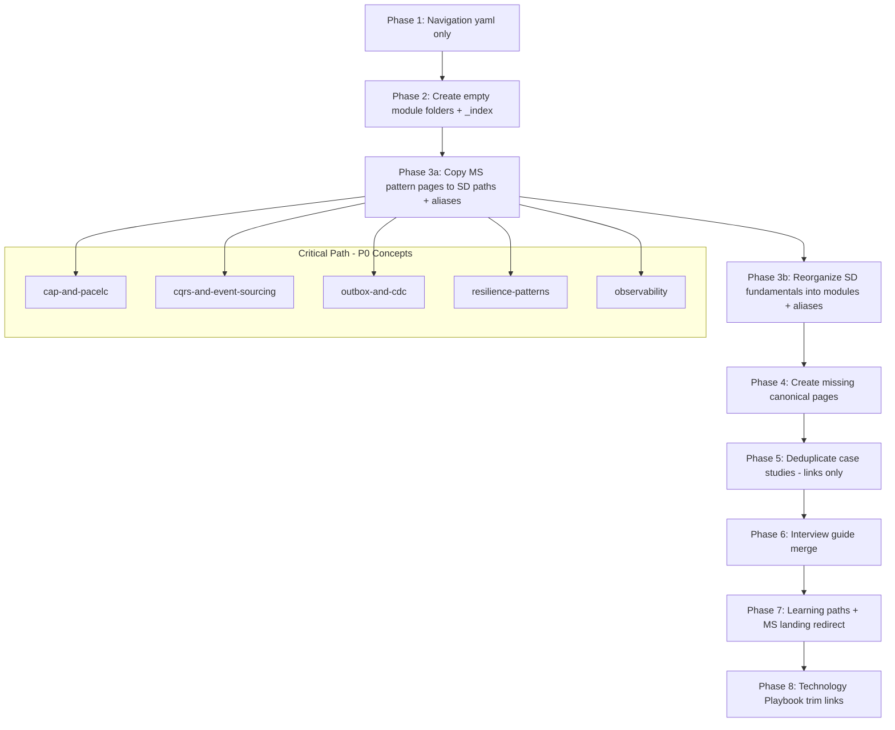

# Phase B — Restructure Plan

**Status:** Planning only — **DO NOT EXECUTE** without explicit approval after Phase A review.

**Objective:** Define the target folder structure, migration sequencing, dependencies, effort, and risks for converging `microservices/` into a unified `system-design/` architect curriculum.

---

## 1. Target Folder Structure

```
content/system-design/
├── _index.md                          # Unified curriculum landing
├── _meta/                             # Planning artifacts (draft: true)
│
├── 01-foundations/
│   ├── _index.md
│   ├── networking-essentials.md       # ← networking-essentials-ip-dns-firewalls
│   ├── transport-tcp-udp.md
│   ├── http-quic-websockets.md
│   ├── architecture-decision-records.md    # ← MS production playbook
│   └── architecture-review-checklist.md
│
├── 02-distributed-systems/
│   ├── _index.md
│   ├── cap-and-pacelc.md              # ← MS (canonical)
│   ├── consistent-hashing.md          # ← MS (canonical)
│   ├── concurrency-control.md         # ← merge MS + database-transactions-and-acid-isolation
│   └── crdt-conflict-resolution.md    # ← trim from crdts-and-multi-master (link-heavy)
│
├── 03-data-management/
│   ├── _index.md
│   ├── database-per-service.md        # ← MS
│   ├── cqrs-and-event-sourcing.md     # ← MS (canonical)
│   ├── saga-pattern.md                # ← MS
│   ├── outbox-and-cdc.md              # ← MS; trim cdc-based-cache-invalidation
│   ├── database-decomposition.md      # ← MS migration
│   ├── relational-storage-internals.md # ← relational-database-fundamentals
│   └── [case-study links only for applied CQRS/outbox]
│
├── 04-communication/
│   ├── _index.md
│   ├── rest-vs-grpc.md                # ← application-layer-protocols-rest-grpc
│   ├── proxy-forward-reverse.md
│   ├── ingress-routing.md             # ← layer4-layer7
│   ├── api-gateway-and-bff.md         # ← MS
│   ├── service-discovery.md           # ← MS
│   └── communication-topologies.md    # ← MS
│
├── 05-scalability/
│   ├── _index.md
│   ├── load-balancing.md              # ← load-balancers-and-routing-algorithms
│   ├── caching-fundamentals.md        # ← merge caching-and-cdns + eviction
│   ├── cache-stampede.md
│   ├── caching-patterns.md            # ← MS
│   ├── scalability-patterns.md          # ← MS; merge replication-lag + sharding fundamentals
│   └── sharding-routing.md            # ← database-sharding-provisioning (deep link from scalability)
│
├── 06-reliability/
│   ├── _index.md
│   ├── resilience-patterns.md         # ← MS (circuit breaker, bulkhead, retry, timeout, fallback)
│   ├── redundancy-and-spof.md
│   ├── multi-region-topologies.md
│   ├── deployment-strategies.md       # ← MS
│   ├── zero-downtime-deployments.md   # ← MS
│   ├── reliability-engineering.md     # ← MS
│   └── failure-scenarios.md           # ← MS
│
├── 07-observability/
│   ├── _index.md
│   └── observability.md               # ← MS (metrics, logs, traces, three pillars)
│
├── 08-architecture-styles/
│   ├── _index.md
│   ├── architecture-styles.md         # ← MS (monolith, modular, microservices, SOA)
│   ├── strangler-pattern.md           # ← MS
│   └── monolith-decomposition.md      # ← MS
│
├── 09-microservices-patterns/
│   ├── _index.md
│   ├── event-driven-architecture.md   # ← MS
│   ├── messaging-streaming-patterns.md
│   ├── sidecar-and-service-mesh.md    # ← MS
│   └── kubernetes-patterns.md         # ← MS (architect lens; link K8s HB)
│
├── 10-case-studies/
│   ├── _index.md
│   ├── url-shortener.md               # Aliases: /system-design/urlshortner/
│   ├── distributed-rate-limiter.md
│   ├── email-delivery.md
│   ├── ... (29 case studies — slugs preserved via aliases)
│   └── collaborative-editor.md
│
├── 11-interview-guide/
│   ├── _index.md
│   ├── top-300-system-design-questions.md  # ← merge MS top-300 + future SD patterns
│   ├── architect-questions.md
│   ├── scalability-questions.md
│   ├── reliability-questions.md
│   ├── troubleshooting-questions.md
│   ├── observability-questions.md
│   └── case-studies/                  # ← 19 existing *-interview-questions.md
│       ├── url-shortener-questions.md
│       └── ...
│
└── 12-learning-paths/
    ├── _index.md
    ├── senior-engineer-path.md        # ← MS
    ├── lead-engineer-path.md
    ├── architect-path.md
    └── interview-revision-path.md
```

### 1.1 Estimated Final Page Count

| Module | New canonical pages | Migrated from SD flat | Migrated from MS | Aliases only (case studies) |
| :--- | :---: | :---: | :---: | :---: |
| 01 Foundations | 5 | 4 | 2 | 0 |
| 02 Distributed Systems | 4 | 2 | 3 | 0 |
| 03 Data Management | 7 | 2 | 5 | 0 |
| 04 Communication | 6 | 3 | 3 | 0 |
| 05 Scalability | 6 | 5 | 2 | 0 |
| 06 Reliability | 7 | 2 | 5 | 0 |
| 07 Observability | 1 | 0 | 1 | 0 |
| 08 Architecture Styles | 3 | 0 | 3 | 0 |
| 09 Microservices Patterns | 4 | 0 | 4 | 0 |
| 10 Case Studies | 29 | 29 | 0 | 29 flat aliases |
| 11 Interview Guide | 6 + 19 | 19 | 6 | 0 |
| 12 Learning Paths | 4 | 0 | 4 | 0 |
| **Section _index** | 12 | — | — | — |
| **TOTAL** | **~86 topic pages** | **~48** | **~38** | **29 alias stubs** |

**Net new canonical pages after deduplication:** ~**72–78** (some SD fundamentals merge into single pages).

---

## 2. Migration Order (Dependency Graph)



### 2.1 Ordered Migration Waves

| Wave | Pages | Depends on | Rationale |
| :---: | :--- | :--- | :--- |
| **W0** | Navigation yaml | — | Zero content risk |
| **W1** | P0 concepts (8 pages) | W0 | Highest duplication ROI |
| **W2** | Communication + data (9 pages) | W1 | Case studies reference these |
| **W3** | Scalability + reliability fundamentals | W1 | Merge SD flat fundamentals |
| **W4** | Architecture + MS patterns | W2 | Styles reference communication |
| **W5** | Production playbook pages | W3 | ADR, failures, checklist |
| **W6** | Case study link pass | W1–W4 | No file moves |
| **W7** | Interview + learning paths | W1–W5 | Question deep-links |
| **W8** | MS section deprecation | W7 | User communication |

---

## 3. Dependency Graph (Content)

| Page | Blocks | Blocked by |
| :--- | :--- | :--- |
| `cqrs-and-event-sourcing.md` | hotel-booking, proximity-search dedup | — |
| `outbox-and-cdc.md` | email-delivery, stock-broker, cdc-cache dedup | database-handbook link |
| `resilience-patterns.md` | rate-limiter, payment-gateway dedup | — |
| `consistent-hashing.md` | LRU cache, collaborative-editor dedup | — |
| `observability.md` | All case study §10 observability tables | — |
| `api-gateway-and-bff.md` | layer4-layer7, proxy pages merge decision | ingress-routing |
| `scalability-patterns.md` | replication-lag, sharding fundamentals merge | consistent-hashing |
| `top-300-system-design-questions.md` | architect subsets | All W1–W4 canonical paths |

---

## 4. Data / Hugo Configuration Changes (Planned)

| File | Change |
| :--- | :--- |
| `data/system_design_modules.yaml` | **Create** — 12 modules |
| `data/system_design_order.yaml` | **Replace** — module-ordered topic list |
| `data/curriculum_sidebar.yaml` | `system-design`: add `modules: system_design_modules` |
| `data/microservices_modules.yaml` | Phase 8: deprecate or stub |
| `data/curriculum_sections.yaml` | Phase 8: MS description → "See System Design" |
| `layouts/system-design/` | Verify nested path resolution (same as microservices/kafka) |

---

## 5. Estimated Effort

| Workstream | Effort | Person-weeks (architect + author) |
| :--- | :--- | :---: |
| Navigation + folder scaffold | Low | 0.5 |
| MS → SD copy + aliases (38 pages) | Medium | 1.5 |
| SD fundamentals re-module (19 pages) | Medium | 2.0 |
| Canonical page creation (gaps) | Low | 0.5 |
| Case study dedup pass (29 pages, links only) | Medium | 2.0 |
| Interview merge (300 + 19×50 Q) | High | 2.5 |
| Learning paths rewrite | Low | 0.5 |
| Technology Playbook trim (links) | Low | 1.0 |
| QA: Hugo build + link crawl | Medium | 1.0 |
| **Total** | | **~11.5 person-weeks** |

**Calendar estimate:** 6–8 weeks with 2 maintainers (parallel W1–W4).

---

## 6. Risk Assessment

| Risk | Likelihood | Impact | Mitigation |
| :--- | :---: | :---: | :--- |
| Broken URLs / SEO loss | Medium | High | Hugo aliases on every move; never delete without alias |
| Sidebar / prev-next breakage | Medium | Medium | Update `system_design_order.yaml` atomically; hugo build CI |
| Duplicate content during transition | High | Medium | `draft: true` on new paths until dedup complete; canonical banners |
| Case study template regression | Low | High | Do not change case study files in W1–W4; link-only in W6 |
| MS + SD both in sidebar (confusion) | High | Medium | Phase 8 MS landing redirect; interim banner on MS `_index` |
| Technology Playbook broken links | Medium | Low | TP pages become selection stubs linking to SD canonical |
| Interview deep-link rot | Medium | Medium | Top 300 `Deep Dive` column uses SD paths only after W7 |
| Curriculum yaml drift | Medium | Medium | Single generator script `phase_c_system_design_curriculum.py` |
| Scope creep (full rewrite) | High | High | **Rule:** link-only dedup for case studies; no 11-section rewrites |

---

## 7. Rollback Strategy (Per Wave)

| Wave | Rollback |
| :--- | :--- |
| W0 Navigation | Revert yaml commit; flat order still works |
| W1–W5 Content copy | New SD paths are additive; remove files + aliases commit |
| W6 Dedup links | Revert link-only commits on case studies |
| W7 Interview | Keep old MS interview URLs via aliases |
| W8 MS deprecation | Restore `microservices_modules.yaml` from git |

**Golden rule:** Every migration commit must pass `hugo --minify` and alias count audit (no 404 on legacy URL list).

---

## 8. What NOT to Do

- Do not delete `content/microservices/` until 90-day alias bake period  
- Do not merge case study templates with architect playbook template  
- Do not move case studies into numbered folders without aliases on old slugs  
- Do not duplicate Kafka/Redis/Postgres internals into SD  
- Do not rewrite Technology Playbook in same release as SD migration  

---

**Phase B planning complete. Awaiting approval before any implementation.**
