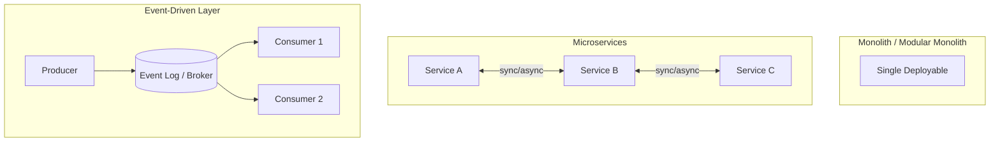

## Overview

An **architecture style** defines how you decompose a system into deployable units, how teams own boundaries, and how components communicate. The five styles architects compare most often in interviews and production reviews are:

1. **Monolith** — single deployable, shared codebase and usually shared database
2. **Modular monolith** — monolith with strict internal module boundaries
3. **SOA** — service-oriented integration (often central ESB era)
4. **Microservices** — independently deployable services with decentralized data
5. **Event-driven architecture (EDA)** — async, event-first integration (often combined with other styles)

This page is the System Design **overview** and comparison hub. Deep decomposition triggers and production patterns live in Microservices; **when to adopt** each style is covered in Technology Playbook ADRs.

---

## Why It Matters

| Wrong style choice | Cost |
| :--- | :--- |
| Microservices for a 5-person startup | Years of platform tax before product-market fit |
| Monolith past team/scale limits | Deploy bottlenecks, coupling incidents |
| SOA-style ESB brain | Single point of orchestration failure |
| Sync-only under write spikes | Cascading latency; missed decoupling wins |

**Conway's Law:** Architecture tends to mirror org structure. Match style to **team autonomy**, **consistency needs**, and **operational maturity** — not industry hype.

---

## Core Concepts

### Architecture comparison matrix

| Dimension | Monolith | Modular Monolith | SOA | Microservices | Event-Driven |
| :--- | :--- | :--- | :--- | :--- | :--- |
| **Deploy unit** | One | One (logical modules) | Multiple services | Many small services | Producers + consumers (async) |
| **Team fit** | 1–2 teams | 2–4 squads, one repo | Enterprise integration | Autonomous product teams | Teams decoupled by event contracts |
| **Data model** | Shared DB | Shared DB, module schemas | Often shared enterprise model | Database per service | Event-carried state; projections |
| **Consistency** | ACID in-process | ACID in-process | Varies; ESB orchestration | Distributed; sagas/outbox | Eventual; idempotent consumers |
| **Deploy independence** | Low | Low (one binary) | Medium | High | Medium (schema evolution) |
| **Operational tax** | Low | Low–medium | High (ESB governance) | High (mesh, tracing, K8s) | Medium–high (brokers, lag) |
| **Network chatter** | None internal | None internal | High (SOAP/ESB) | High (sync + async) | Dominated by async |
| **Best when** | MVP, small team | Growing product, not ready to split | Legacy enterprise integration | Scale teams & deploy cadence | Write spikes, fan-out, decoupling |
| **Interview red flag** | “Always start here” without scale plan | Modules leak into spaghetti | Central ESB owns all logic | 50 services day one | Events with no ordering/idempotency plan |

### Style summaries

#### Monolith

Single process, single deployment pipeline. **Pros:** simple debugging, ACID transactions, fast local refactors. **Cons:** scaling is all-or-nothing; one bug can take down everything.

**Select when:** small team, unclear domain, need speed. **ADR:** [Technology Playbook — Monolith](/technology-playbook/monolith-architecture/)

#### Modular monolith

Enforce package/module boundaries inside one deployable (domain modules, clear APIs, no cross-module DB access). **Pros:** boundaries without network tax; stepping stone to extract services. **Cons:** discipline required — boundaries erode without tooling/reviews.

**Select when:** multiple squads, one product, not ready for distributed ops. **ADR:** [Modular Monolith](/technology-playbook/modular-monolith-architecture/)

#### SOA (service-oriented architecture)

Enterprise services integrated through shared contracts; classic pattern used **central ESB** for routing and transformation. **Pros:** standardized integration in large enterprises. **Cons:** ESB becomes god-object; slow change approval.

Modern teams often prefer **microservices + events** over heavyweight SOA. **ADR:** [SOA Architecture](/technology-playbook/soa-architecture/)

#### Microservices

Independently deployable services aligned to **bounded contexts**; smart endpoints, dumb pipes; typically **database per service**. **Pros:** team autonomy, isolated failure domains, polyglot stacks. **Cons:** distributed transactions, observability, deployment complexity.

**Select when:** org scale, clear domain boundaries, platform/SRE maturity. **ADR:** [Microservices Architecture](/technology-playbook/microservices-architecture/)

#### Event-driven architecture (EDA)

Components communicate through **events** (pub/sub, log streaming) rather than only sync RPC. Often **combined** with monolith, modular monolith, or microservices — it is an **interaction style**, not always a separate deploy topology.

**Pros:** decouples producers/consumers, absorbs write spikes, enables replay. **Cons:** eventual consistency, debugging complexity, schema evolution.

**Application example:** [Distributed Message Queue](/system-design/distributed-message-queue/) case study. **ADR:** [Event-Driven Architecture](/technology-playbook/event-driven-architecture/)

### Decomposition triggers (when to evolve)

| Signal | Consider moving toward |
| :--- | :--- |
| Deploy queue blocks all teams | Microservices or modular monolith first |
| One module’s CPU dominates | Extract hot path service |
| Different scaling profiles per feature | Split read/write paths; EDA for fan-out |
| Regulatory boundary (PCI zone) | Service + network isolation |
| Org adds autonomous business units | Bounded context → service ownership |

### Style + pattern combinations (common in production)

| Base style | Often paired with |
| :--- | :--- |
| Microservices | API gateway, service mesh, EDA for side effects |
| Modular monolith | Domain modules; extract one service when proven |
| Monolith | EDA only at integration edge (webhooks, queues) |
| EDA | Outbox, idempotent consumers, schema registry |

---

## Architect Perspective

### Interview framework: “Monolith vs microservices?”

1. **Clarify scale** — team count, deploy frequency, traffic
2. **State consistency needs** — ledger vs feed
3. **Operational maturity** — K8s, tracing, on-call?
4. **Default recommendation** — modular monolith or monolith until triggers fire
5. **Name migration path** — strangler, extract hottest service first (link MS migration when discussing production)

### Mapping styles to NFRs

Use [Non-Functional Requirements](/system-design/non-functional-requirements/) to justify choice:

| NFR priority | Favors |
| :--- | :--- |
| Time to market | Monolith / modular monolith |
| Independent team deploy | Microservices |
| Strong cross-aggregate ACID | Monolith or careful saga design |
| Write burst absorption | Event-driven |

### Sync vs async boundary

| Use sync (HTTP/gRPC) | Use events |
| :--- | :--- |
| User-facing read path | Notifications, analytics, side effects |
| Query/aggregate now | Fan-out to many subscribers |
| Strong immediate feedback | Retryable background work |

See [REST vs gRPC](/system-design/application-layer-protocols-rest-grpc/) and [Distributed Message Queue](/system-design/distributed-message-queue/).

---

## Common Mistakes

| Mistake | Reality |
| :--- | :--- |
| “Microservices = cloud native” | Distribution is an org problem, not a checkbox |
| EDA everywhere with no ordering plan | Partition keys and idempotency required |
| Modular monolith without enforcement | Becomes big ball of mud — same as monolith |
| Ignoring data ownership on split | Shared database prevents true service autonomy |
| Choosing style before requirements | Start from [System Design Process](/system-design/system-design-process/) |

---

## Interview Questions

1. **When would you choose a monolith over microservices?**
2. **What is a modular monolith and how does it differ from a monolith?**
3. **Compare SOA and microservices — what replaced the ESB?**
4. **Is event-driven architecture a replacement for microservices?**
5. **Your team has 8 squads and weekly releases block each other — what do you recommend?**
6. **How does Conway’s Law affect architecture decisions?**
7. **Design the communication style for an e-commerce order flow — sync vs events?**

---

## Related Topics

- [System Design Process](/system-design/system-design-process/) — step 5 high-level design
- [What Is System Design?](/system-design/what-is-system-design/)
- [CAP & PACELC](/system-design/cap-and-pacelc/) — consistency drives style constraints
- [Notification System](/system-design/notification-system/) — multi-channel async case study
- [Payment Gateway](/system-design/payment-gateway-orchestration/) — sync + resilience case study

---

## Deep Dive References

| Topic | Location |
| :--- | :--- |
| Architecture styles (PRIMARY) | [Microservices — Architecture Styles](/microservices/01-architecture-styles/architecture-styles/) |
| Event-driven production patterns | [Microservices — Event-Driven Architecture](/microservices/06-event-driven/event-driven-architecture/) |
| Messaging & streaming | [Microservices — Messaging Patterns](/microservices/06-event-driven/messaging-and-streaming-patterns/) |

### Technology Playbook — selection ADRs

| Style | ADR page |
| :--- | :--- |
| Monolith | [Monolith Architecture](/technology-playbook/monolith-architecture/) |
| Modular monolith | [Modular Monolith Architecture](/technology-playbook/modular-monolith-architecture/) |
| SOA | [SOA Architecture](/technology-playbook/soa-architecture/) |
| Microservices | [Microservices Architecture](/technology-playbook/microservices-architecture/) |
| Event-driven | [Event-Driven Architecture](/technology-playbook/event-driven-architecture/) |
| Pattern catalog | [Module Architecture Patterns](/technology-playbook/module-architecture-patterns/) |

**Reliability:** [Availability & Nines](/system-design/availability-and-nines/) · [Reliability vs Availability](/system-design/reliability-vs-availability/) · [Resilience Patterns Overview](/system-design/resilience-patterns-overview/)

**Observability:** [Observability Fundamentals](/system-design/observability-fundamentals/)
