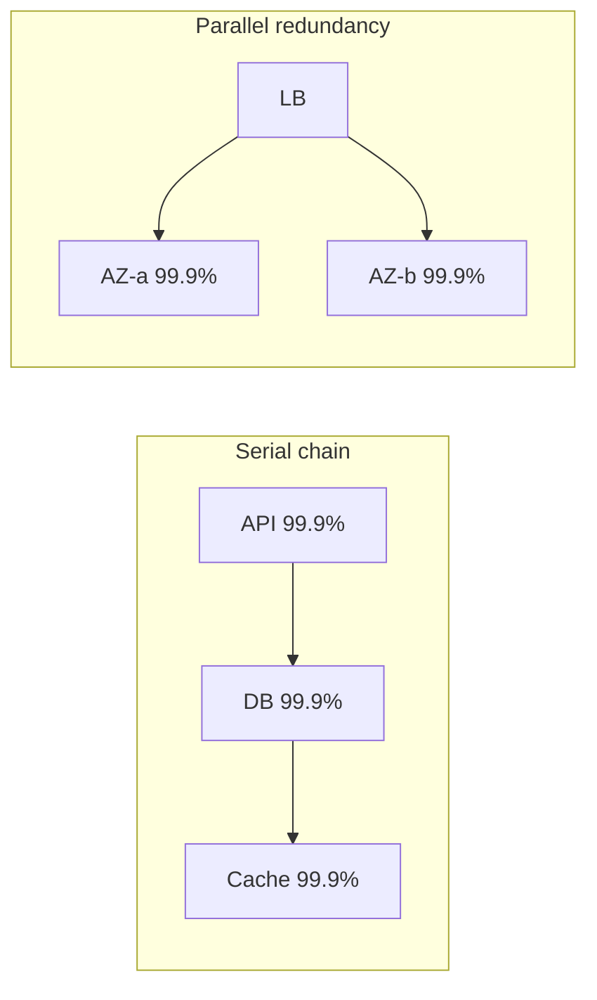

## Overview

**Availability** is the fraction of time a system correctly serves requests — often expressed as **nines**: 99.9% (three nines), 99.99% (four nines), 99.999% (five nines).

Architects translate nines into **downtime budgets** (minutes per year), design **redundancy** to meet targets, and multiply **dependency availability** to expose hidden weak links.

This page is the System Design **overview**. SLO programs, error budgets, and on-call practice live in Microservices **Reliability Engineering**.

---

## Why It Matters

| Vague target | Problem |
| :--- | :--- |
| “Highly available” | No measurable budget |
| 99.99% without dependency math | One 99.9% dependency caps the chain |
| Same target for all features | Over-engineering low-risk paths |
| Ignoring planned maintenance | Eats downtime budget |

Link targets to [Non-Functional Requirements](/system-design/non-functional-requirements/) before sizing infrastructure.

---

## Core Concepts

### Nines reference table

| Availability | Downtime / year | Downtime / month | Common label |
| :--- | :--- | :--- | :--- |
| 99% | 3.65 days | 7.2 hours | Two nines |
| 99.9% | 8.76 hours | 43.8 minutes | Three nines |
| 99.99% | 52.6 minutes | 4.38 minutes | Four nines |
| 99.999% | 5.26 minutes | 26.3 seconds | Five nines |

**Interview shortcut:** 99.9% ≈ **8.76 hours/year**; 99.99% ≈ **52 minutes/year**.

### Downtime budget

```
Budget = (1 - availability_target) × total_time_in_period
```

Example: 99.99% monthly → 0.0001 × 30 × 24 × 60 ≈ **4.3 minutes** unplanned downtime allowed.

Use the budget to decide:
- How many deploys can fail per month
- Whether multi-AZ is mandatory
- Error budget policy (see MS reliability engineering)

### Serial vs parallel availability

**Serial (all must work):**

```
A_total = A₁ × A₂ × A₃
```

Three components at 99.9% each: 0.999³ ≈ **99.7%** — worse than any single part.

**Parallel (redundant paths, one suffices):**

```
A_total = 1 - (1 - A₁) × (1 - A₂)
```

Two 99.9% nodes in active-passive: ≈ **99.9999%** theoretical — if failover is instant and tested.



### Dependency multiplication (interview favorite)

| Chain | Calculation | Result |
| :--- | :--- | :--- |
| API × DB × Auth | 0.999 × 0.999 × 0.999 | 99.7% |
| API + dual DB (parallel) | 1 - (0.001)² for DB leg | DB leg ≈ 99.9999% |

**Lesson:** Eliminate serial dependencies or add redundancy at the weakest link — [SPOF & Redundancy](/system-design/single-point-of-failure-elimination-redundancy/).

### Availability vs latency SLO

A system can be “up” but unusable. Pair availability with [Latency vs Throughput](/system-design/latency-vs-throughput/) — e.g. 99.99% uptime with p99 > 5s fails the product NFR.

### Multi-region and AZ

| Topology | Availability lever |
| :--- | :--- |
| Single AZ | AZ outage = full outage |
| Multi-AZ | Survives AZ failure |
| Multi-region active-active | Survives region failure |

See [Multi-Region Topologies](/system-design/multi-region-topologies-and-availability-zones/) and [Failure Patterns Overview](/system-design/failure-patterns-overview/).

---

## Architect Perspective

### Interview answer template

1. **Define availability** — uptime / (uptime + downtime)
2. **State target in nines** — and convert to minutes/year
3. **Draw dependency chain** — multiply serial availabilities
4. **Propose redundancy** — parallel paths, multi-AZ
5. **Distinguish from reliability** — [Reliability vs Availability](/system-design/reliability-vs-availability/)

### When to stop adding nines

| Factor | Cost of next nine |
| :--- | :--- |
| Multi-region sync data | Complexity, latency |
| 24/7 staffed on-call | Organizational |
| Chaos testing program | Engineering time |

Match nines to business impact — payment auth vs internal admin tool.

---

## Common Mistakes

| Mistake | Fix |
| :--- | :--- |
| Quoting vendor SLA as your SLA | You inherit weakest dependency |
| No failover drills | Redundancy untested = SPOF |
| 99.99% without monitoring | Can't prove you met it |
| Conflating availability with reliability | Separate definitions |
| Ignoring partial outages | Degraded ≠ available |

---

## Interview Questions

1. **How much downtime per year is 99.99% availability?**
2. **Three serial services at 99.9% each — what is end-to-end availability?**
3. **How does active-passive failover improve availability?**
4. **When is multi-region required vs multi-AZ?**
5. **What is an error budget and how does it relate to availability?**

---

## Related Topics

- [Reliability vs Availability](/system-design/reliability-vs-availability/)
- [Resilience Patterns Overview](/system-design/resilience-patterns-overview/)
- [SPOF & Redundancy](/system-design/single-point-of-failure-elimination-redundancy/)
- [Multi-Region Topologies](/system-design/multi-region-topologies-and-availability-zones/)
- [Non-Functional Requirements](/system-design/non-functional-requirements/)

---

## Deep Dive References

| Topic | Location |
| :--- | :--- |
| SLOs, error budgets, reliability engineering (PRIMARY) | [Microservices — Reliability Engineering](/microservices/10-production-playbook/reliability-engineering/) |
| Failure scenarios & drills | [Microservices — Failure Scenarios](/microservices/10-production-playbook/failure-scenarios/) |

**Observability:** [Observability Fundamentals](/system-design/observability-fundamentals/)
