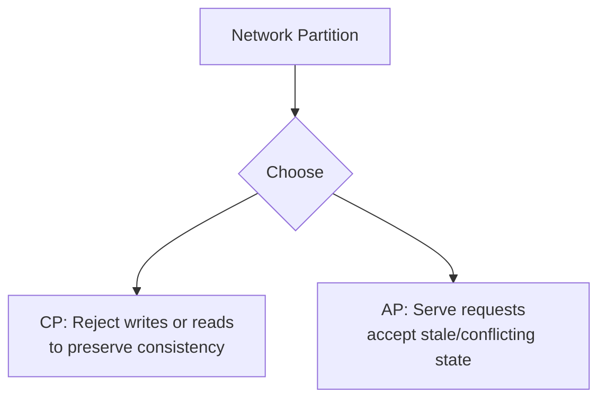

## Overview

The **CAP theorem** states that during a **network partition**, a distributed datastore can provide at most two of: **Consistency**, **Availability**, and **Partition tolerance**. Since partitions are unavoidable at scale, the real choice is **CP** (consistency over availability) vs **AP** (availability over consistency).

**PACELC** extends this: in the **absence** of partition, there is still a trade-off between **Latency** and **Consistency** — even when the network is healthy.

This page is the System Design **overview** for interviews. Production framework depth lives in Microservices.

---

## Why It Matters

| Decision | Driven by |
| :--- | :--- |
| Bank ledger vs social feed | CP vs AP under partition |
| Read-your-writes on replicas | PACELC latency vs consistency |
| Multi-region active-active | CAP + conflict resolution ([CRDTs](/system-design/crdts-and-multi-master-conflict-resolution/)) |
| Cache vs database on read | Eventual consistency acceptance |

Interviewers use CAP/PACELC to test whether you **match datastore behavior to product NFRs**, not whether you recite definitions.

---

## Core Concepts

### CAP during partition

| Mode | Behavior | Example systems | Use when |
| :--- | :--- | :--- | :--- |
| **CP** | Unavailable rather than wrong | ZooKeeper, etcd, traditional RDBMS primary | Financial ledger, inventory locks |
| **AP** | Available; reconcile later | Dynamo-style KV, Cassandra (tunable) | Social feeds, metrics, carts |

**Partition tolerance (P)** is not optional in distributed systems — you are always choosing between C and A during a partition.

### PACELC in normal operation

| Letter | Meaning |
| :--- | :--- |
| **PA** | If **P**artition → choose **A** or **C** (CAP) |
| **EL** | **E**lse → choose **L**atency or **C**onsistency |

| Choice | Trade-off | Example |
| :--- | :--- | :--- |
| **PC/EL** | Consistent when possible; favor latency when healthy | Many SQL + sync replication |
| **PA/EC** | Available under partition; favor consistency when healthy | Strict quorum reads |

### Common misconceptions

| Myth | Reality |
| :--- | :--- |
| “Pick two of three forever” | CAP applies **during partition** only |
| “Microservices must be AP” | Each datastore/service chooses independently |
| “Eventual consistency is free” | Application must handle stale reads and conflicts |
| “CAP replaces isolation levels” | Orthogonal — see [Consistency Models](/system-design/consistency-models/) |

### System examples (interview table)

| System | Partition behavior | Normal-op bias |
| :--- | :--- | :--- |
| PostgreSQL (single primary) | CP — primary partition blocks writes | Low latency strong reads on primary |
| Cassandra | Tunable (QUORUM) | PA/EL or EC depending on CL |
| Redis (single primary) | CP for strong setups | Low latency |
| Multi-master + CRDT | AP with merge | Conflict-free convergence |

---

## Architect Perspective

### Interview one-liners

- **“Under partition, do we prefer wrong answers or no answers?”** → AP vs CP
- **“When healthy, can reads be stale for speed?”** → PACELC EL vs EC
- **“Who resolves conflicts?”** → App merge, CRDT, or last-writer-wins

### Linking CAP to NFRs

Map product language from [Non-Functional Requirements](/system-design/non-functional-requirements/):

| NFR statement | CAP/PACELC lens |
| :--- | :--- |
| “Always show the feed” | AP |
| “Never double-charge” | CP + strong consistency |
| “Sub-10ms reads globally” | EL — accept replica lag |

---

## Common Mistakes

| Mistake | Fix |
| :--- | :--- |
| Declaring “we use CAP” without partition context | Specify **when** partition happens |
| Ignoring PACELC | Discuss replica lag in steady state |
| Same choice for all data | Polyglot persistence — ledger CP, cache AP |
| Confusing consistency with ACID | ACID is transactional; CAP is distributed |

---

## Interview Questions

1. **Explain CAP in one minute. When does it apply?**
2. **Is a bank account CP or AP? What about a Like counter?**
3. **What does PACELC add beyond CAP?**
4. **How does quorum read (e.g. Cassandra) map to CAP?**
5. **Your multi-region DB loses WAN link — what happens to writes?**

---

## Related Topics

- [Consistency Models](/system-design/consistency-models/) — strong, eventual, causal
- [CRDTs & Multi-Master](/system-design/crdts-and-multi-master-conflict-resolution/) — AP convergence
- [Non-Functional Requirements](/system-design/non-functional-requirements/) — consistency NFR
- [Database Transactions & ACID](/system-design/database-transactions-and-acid-isolation/) — single-node consistency
- [Distributed KV Store](/system-design/distributed-kv-store/) — case study applying partitioning

---

## Deep Dive References

| Topic | Location |
| :--- | :--- |
| CAP & PACELC framework (PRIMARY) | [Microservices — CAP & PACELC](/microservices/04-distributed-systems/cap-and-pacelc/) |
| Concurrency & isolation | [Microservices — Concurrency Control](/microservices/04-distributed-systems/concurrency-control/) |

**Reliability:** [Availability & Nines](/system-design/availability-and-nines/) · [Reliability vs Availability](/system-design/reliability-vs-availability/)
