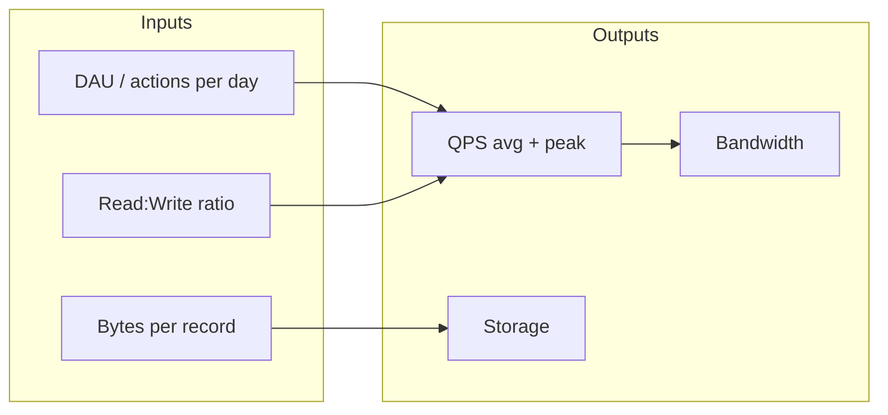

## Overview

**Capacity estimation** is back-of-envelope math that turns product scale (users, actions per day) into **requests per second**, **storage**, and **bandwidth** — before you size caches, databases, or brokers. Architects use it in interviews to justify components and in production to avoid order-of-magnitude outages.

Precision to ±2× is sufficient. Interviewers want **structured reasoning**, not exact arithmetic.

---

## Why It Matters

| Without estimation | With estimation |
| :--- | :--- |
| “We’ll use Redis” with no size | Cache RAM sized from working set |
| Single DB for 100K WPS | Shard count and replica plan |
| Undersized brokers | Partition count from peak RPS |
| Surprise cloud bills | Cost-aware architecture |

Every case study in this curriculum includes a capacity section — this page teaches the **reusable formulas** applied there.

---

## Core Concepts

### Powers of two (architect cheat sheet)

| Power | Value | Mnemonic |
| :---: | :---: | :--- |
| 2^10 | ~1 thousand | 1 KB |
| 2^20 | ~1 million | 1 MB |
| 2^30 | ~1 billion | 1 GB |
| 2^40 | ~1 trillion | 1 TB |

**Seconds per day:** 86,400 ≈ **100K** (use 10^5 for quick math).

### Core formulas

| Metric | Formula | Notes |
| :--- | :--- | :--- |
| **Average RPS** | `events_per_day / 86,400` | Use daily volume first |
| **Peak RPS** | `avg_RPS × peak_multiplier` | Typically 3×–20× |
| **Read RPS** | `write_RPS × read_write_ratio` | Ratio is reads per write |
| **Storage (total)** | `records × bytes_per_record` | Include indexes (+30–100%) |
| **Storage / day** | `new_records_per_day × bytes_per_record` | For retention planning |
| **Bandwidth** | `RPS × payload_bytes` | Separate ingress/egress |
| **Cache size** | `hot_working_set × bytes_per_item` | Often 20% of data gets 80% traffic |

### Read/write ratio

| Pattern | Typical ratio | Example |
| :--- | :--- | :--- |
| Read-heavy | 10:1 – 1000:1 | URL redirect, feed read |
| Balanced | 1:1 – 10:1 | CRUD APIs |
| Write-heavy | 1:10 – 1:100 | Logging, notifications, telemetry |

Ratio drives cache hit value, replica count, and whether write path partitioning dominates.

### Growth and peak planning

| Planning horizon | Approach |
| :--- | :--- |
| **MVP** | 12-month volume + 3× headroom |
| **Peak events** | Super Bowl, Black Friday — apply 10×–50× on hot paths |
| **10-year storage** | Linear growth assumption; note compaction/archival |

Always state **assumptions** explicitly in interviews.

---

## Worked Example 1 — URL Shortener

*Full design: [URL Shortener](/system-design/urlshortner/)*

| Input | Value |
| :--- | :--- |
| URL creations / day | 1 million |
| Read : write ratio | 100 : 1 |
| Record size | ~500 bytes |
| Horizon | 1 billion URLs (~10 years) |

| Calculation | Result |
| :--- | :--- |
| Avg write RPS | 1M / 86,400 ≈ **12 WPS** |
| Avg read RPS | 12 × 100 ≈ **1,200 RPS** |
| Peak read RPS (10×) | ≈ **12,000 RPS** |
| Total storage | 1B × 500 B ≈ **500 GB** |
| Peak read bandwidth | 12K × 1 KB ≈ **12 MB/s** |

**Architect takeaway:** Read-heavy → CDN + cache + read replicas; write path is modest.

---

## Worked Example 2 — Notification System

*Full design: [Notification System](/system-design/notification-system/)*

| Input | Value |
| :--- | :--- |
| Notifications / minute | 1,000,000 |
| Record size | ~500 bytes |
| Peak multiplier | 5× |

| Calculation | Result |
| :--- | :--- |
| Notifications / day | 1M × 1,440 ≈ **1.44 billion** |
| Avg ingestion RPS | 1.44B / 86,400 ≈ **16,700 RPS** |
| Peak ingestion RPS | 16,700 × 5 ≈ **83,500 RPS** |
| Storage / day | 1.44B × 500 B ≈ **720 GB/day** |
| Peak inbound bandwidth | 83,500 × 500 B ≈ **42 MB/s** |

**Architect takeaway:** Write-heavy → partitioned queues (Kafka), async workers, priority lanes for OTP; storage retention and archival are first-class.



---

## Architect Perspective

### Architect cheat sheet (copy for interviews)

```
1. Get daily volume (or DAU × actions/user/day)
2. ÷ 86,400 → average RPS
3. × read/write ratio → read and write RPS
4. × peak factor (3–20×) → peak RPS
5. records × bytes → storage
6. peak_RPS × payload → bandwidth
7. Sanity-check: 1 server ≈ 1K–10K RPS (app dependent)
```

### From estimation to architecture

| Estimate reveals | Design response |
| :--- | :--- |
| High read RPS | Cache, CDN, replicas |
| High write RPS | Sharding, async ingestion |
| Large storage / day | Tiering, archival, columnar |
| Skewed keys | Consistent hashing — [Consistent Hashing](/system-design/consistent-hashing/) |
| Strict tail latency | Fewer hops, sync path optimization — [Latency vs Throughput](/system-design/latency-vs-throughput/) |

---

## Common Mistakes

| Mistake | Fix |
| :--- | :--- |
| Using average RPS for sizing | Size for **peak** |
| Forgetting index overhead | Add 50–100% to raw row size |
| Ignoring fan-out | 1 write → N notifications = multiply WPS |
| Wrong ratio direction | Confirm reads **per** write |
| False precision | Round; state assumptions |

---

## Interview Questions

1. **Estimate QPS for 10M DAU, each user posting 2 times per day.**
2. **How much storage for 5 years of tweets at 500M tweets/day, 300 bytes each?**
3. **A system handles 50K RPS peak — how many app servers at 2K RPS each?**
4. **Why does read/write ratio change your caching strategy?**
5. **Walk through capacity estimation for the notification system at 1M messages/minute.**

---

## Related Topics

- [System Design Process](/system-design/system-design-process/) — step 4 in interview framework
- [Non-Functional Requirements](/system-design/non-functional-requirements/) — scale and latency targets
- [URL Shortener](/system-design/urlshortner/) — read-heavy worked design
- [Notification System](/system-design/notification-system/) — write-heavy worked design
- [Latency vs Throughput](/system-design/latency-vs-throughput/) — SLOs from peak RPS estimates
- [Caching & CDNs](/system-design/caching-and-cdns-hierarchical-arrays/) — sizing cache from working set

---

## Deep Dive References

| Topic | Location |
| :--- | :--- |
| Hot-key mitigation, horizontal scale | [Microservices — Scalability Patterns](/microservices/10-production-playbook/scalability-patterns/) |
| Database selection | [Technology Playbook — How to Choose a Database](/technology-playbook/how-to-choose-database/) |

**Scalability:** [Latency vs Throughput](/system-design/latency-vs-throughput/) · [Scaling Strategies Overview](/system-design/scaling-strategies-overview/)

**Data patterns:** [CQRS Overview](/system-design/cqrs-overview/) · [Transactional Outbox Overview](/system-design/transactional-outbox-overview/)

**Distributed Systems:** [Consistent Hashing](/system-design/consistent-hashing/) · [CAP & PACELC](/system-design/cap-and-pacelc/)
