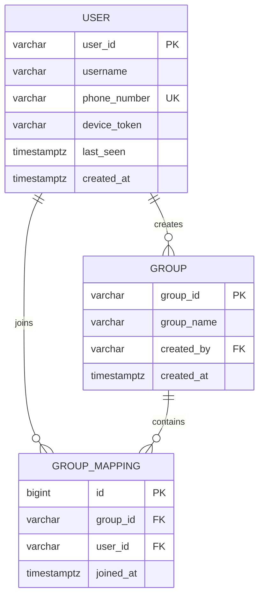
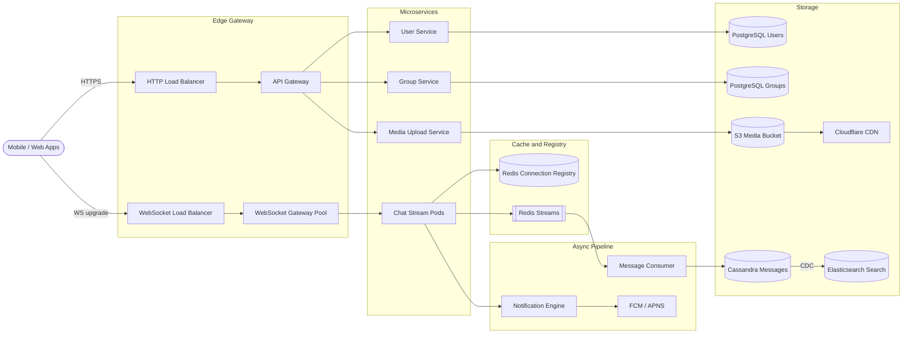
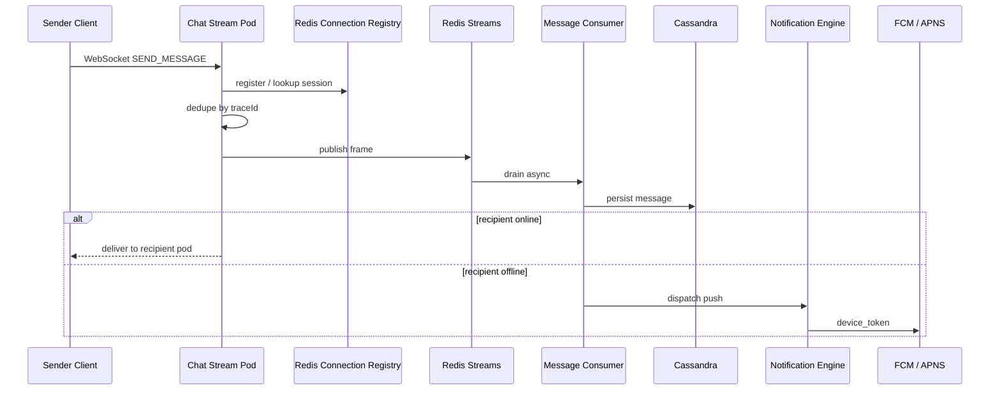
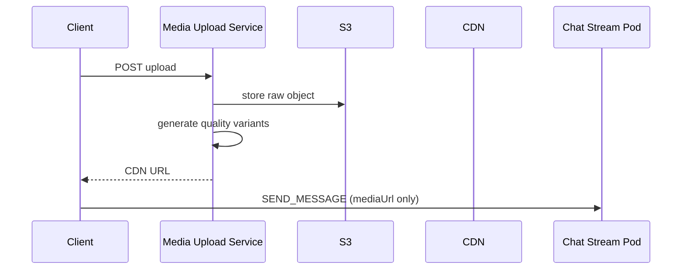
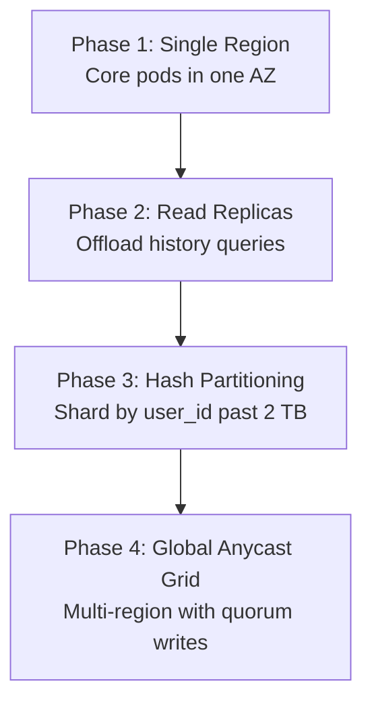

A chat application connects billions of users through near real-time one-to-one and group messaging, delivery receipts, media attachments, and presence indicators. At scale it is **write-heavy, latency-sensitive, and connection-dense**: every active user holds a long-lived WebSocket, message ordering must be strict per conversation, and the system must guarantee zero message loss while targeting sub-300ms delivery for online recipients.

This post walks through the full design — requirements, capacity math, API contracts, data modeling, WebSocket gateway topology, technology trade-offs, caching, infrastructure sizing, and failure modes. For 50 senior-level interview follow-ups, see [Chat Application Interview Questions](/system-design/chat-application-interview-questions/).

---

## 1. Requirements and Goals

### Functional Requirements (MVP)

| Requirement | Description |
| :--- | :--- |
| **User onboarding** | Sign up / log in via verified phone number or email. |
| **One-to-one messaging** | Near real-time text delivery between two individual users. |
| **Group messaging** | Create groups, add/remove members, broadcast text to all active members (up to **1,000** members per group). |
| **Delivery ecosystem** | Atomic message states: **Sent** (single tick), **Delivered** (double tick), **Read** (blue tick). |
| **Media support** | Send/receive rich media (images, videos) via standard attachment workflows — decoupled from the duplex channel. |
| **Conversation history** | Retrieve historical messages on-demand with cursor-based pagination. |
| **Presence tracking** | Real-time online/offline status and absolute **Last Seen** timestamp. |

### Clarifying Assumptions

| Question | Assumption |
| :--- | :--- |
| End-to-end encryption? | Server-parsed/stored for cloud sync; schema includes PKI extension fields for future E2EE. |
| Max group size? | **1,000 members** — optimize fan-out without degrading latency. |
| Multi-device sync? | **One active primary session** per user for this phase; session store structured for multi-device routing keys later. |

### Non-Functional Requirements

| NFR | Target |
| :--- | :--- |
| **Scale** | **1B DAU**; **100 messages/user/day** → **100B messages/day** |
| **Latency** | End-to-end delivery **< 300 ms** for active users |
| **Availability** | **99.999%** uptime — AP-leaning (users can always open the app and write) |
| **Reliability** | **Zero message loss** — persist until recipient device acknowledges |
| **Ordering** | Strict chronological sequence per conversation across all client devices |
| **Read / Write ratio** | ~**1 : 2** (writes + receipt updates vs delivery fetches/pushes) |

### Constraints

- WebSockets must drop cleanly when inactive to protect OS file descriptors across server pools.
- Rich media transfers are decoupled from persistent bi-directional duplex channels.

---

## 2. Back-of-the-Envelope Calculations

### Traffic Estimates

| Metric | Calculation | Result |
| :--- | :--- | :--- |
| DAU | Given | **1 × 10⁹ users** |
| Messages / day | 1B × 100 | **100 billion / day** |
| Average RPS | 100B ÷ 86,400 s | **~1,157,407 RPS** |
| Peak write RPS (2.5×) | 1.16M × 2.5 | **~2,893,518 RPS** |

### Storage

| Assumption | Calculation | Result |
| :--- | :--- | :--- |
| Bytes per message record | Metadata + body | **~1 KB** |
| Storage / day | 100B × 1 KB | **~100 TB / day** |
| Storage / year | 100 TB × 365 | **~36.5 PB / year** |

### Bandwidth

| Metric | Calculation | Result |
| :--- | :--- | :--- |
| Average ingress | 1.16M msg/s × 1 KB | **~1.15 GB/s** |
| Peak ingress | 2.89M RPS × 1 KB | **~2.89 GB/s (~23 Gbps)** |

### In-Memory Session Cache

| Assumption | Calculation | Result |
| :--- | :--- | :--- |
| Peak connected users | 20% of DAU | **200M connections** |
| Bytes per registry entry | userId + serverIp + meta | **~128 B** |
| Base footprint | 200M × 128 B | **~25.6 GB** |
| With 3× safety overhead | 25.6 GB × 3 | **~76.8 GB RAM** |

---

## 3. API Design

| # | Method | Path | Purpose |
| :---: | :--- | :--- | :--- |
| 1 | POST | `/api/v1/auth/register` | User Registration |
| 2 | POST | `/api/v1/groups` | Create Group |
| 3 | GET | `/api/v1/chats/{chatId}/messages?cursor=msg-177291-a81d&limit=50` | Fetch Chat History (Cursor Pagination) |



```json
{
  "phoneNumber": "+919876543210",
  "deviceToken": "fcm_token_xyz123",
  "clientOS": "ANDROID"
}
```



```json
{
  "userId": "usr-88392-f02a",
  "registeredAt": "2026-06-26T15:33:12Z",
  "authToken": "eyJhbGciOiJIUzI1NiIsInR5c..."
}
```

| Status | Condition |
| :--- | :--- |
| `400 Bad Request` | Invalid phone format |
| `409 Conflict` | Number already registered |





```json
{
  "groupName": "Architecture Core",
  "members": ["usr-88392-f02a", "usr-11029-b82d"]
}
```



```json
{
  "groupId": "grp-9910-c01b",
  "createdAt": "2026-06-26T15:34:00Z"
}
```



{{< api-endpoint method="GET" path="/api/v1/chats/{chatId}/messages?cursor=msg-177291-a81d&limit=50" desc="Fetch Chat History (Cursor Pagination)" >}}

```json
{
  "messages": [
    {
      "messageId": "msg-177290-a70c",
      "senderId": "usr-11029-b82d",
      "content": "Production deployment verified.",
      "timestamp": "2026-06-26T15:30:15Z"
    }
  ],
  "nextCursor": "msg-177232-z99e"
}
```



### WebSocket — Full-Duplex Chat Channel

**`WS /ws/v1/chat`**

Inbound frame (client → server):

```json
{
  "action": "SEND_MESSAGE",
  "traceId": "tx-99201-abc",
  "recipientId": "usr-11029-b82d",
  "recipientType": "INDIVIDUAL",
  "body": "System design criteria finalized.",
  "mediaUrl": null
}
```

Outbound frame (server → client):

```json
{
  "event": "MESSAGE_RECEIVED",
  "messageId": "msg-992811-001d",
  "senderId": "usr-88392-f02a",
  "body": "System design criteria finalized.",
  "timestamp": "2026-06-26T15:33:15Z"
}
```

Receipt acknowledgment (bi-directional):

```json
{
  "action": "UPDATE_RECEIPT",
  "messageId": "msg-992811-001d",
  "status": "READ",
  "updatedBy": "usr-11029-b82d"
}
```

### Idempotency

Clients attach a unique deterministic **`traceId`** to every message frame. The Chat Gateway deduplicates within a sliding window before hitting storage — preventing duplicate messages from network retries.
---

## 4. Data Model



### PostgreSQL — User & Group Metadata

**`users`**

```sql
CREATE TABLE users (
    user_id VARCHAR(64) PRIMARY KEY,
    username VARCHAR(100) NOT NULL,
    phone_number VARCHAR(24) UNIQUE NOT NULL,
    device_token VARCHAR(256),
    last_seen TIMESTAMP WITH TIME ZONE DEFAULT NOW(),
    created_at TIMESTAMP WITH TIME ZONE DEFAULT NOW()
);
CREATE INDEX idx_users_phone ON users(phone_number);
```

**`groups`**

```sql
CREATE TABLE groups (
    group_id VARCHAR(64) PRIMARY KEY,
    group_name VARCHAR(128) NOT NULL,
    created_by VARCHAR(64) REFERENCES users(user_id),
    created_at TIMESTAMP WITH TIME ZONE DEFAULT NOW()
);
```

**`group_mappings`**

```sql
CREATE TABLE group_mappings (
    id BIGSERIAL PRIMARY KEY,
    group_id VARCHAR(64) REFERENCES groups(group_id) ON DELETE CASCADE,
    user_id VARCHAR(64) REFERENCES users(user_id) ON DELETE CASCADE,
    joined_at TIMESTAMP WITH TIME ZONE DEFAULT NOW()
);
CREATE UNIQUE INDEX idx_group_user_uniq ON group_mappings(group_id, user_id);
CREATE INDEX idx_group_mappings_user_id ON group_mappings(user_id);
```

Relational storage handles **strong consistency** for membership, authentication, and profile integrity.

### Cassandra — Message Timeline (Denormalized)

```sql
CREATE TABLE messages (
    chat_id text,
    bucket_id text,
    message_id timeuuid,
    sender_id text,
    receiver_id text,
    message_body text,
    msg_type text,
    delivery_status text,
    PRIMARY KEY ((chat_id, bucket_id), message_id)
) WITH CLUSTERING ORDER BY (message_id DESC);
```

| Design choice | Rationale |
| :--- | :--- |
| Partition key `(chat_id, bucket_id)` | `bucket_id` (e.g. `2026-06`) bounds partition size — avoids 100 MB / 100K row limits |
| Clustering key `message_id` (TimeUUID) | Chronological on-disk ordering for fast lazy-load pagination |
| Append-mostly writes | Eliminates row-lock contention under massive write throughput |

Media URLs are stored in the message record; binary blobs live in **S3** behind a CDN.

---

## 5. High-Level Architecture



### Real-Time Message Path



### Media Path (Decoupled)



### Connection Registry (Low-Level)




```java
public class ConnectionRegistryRepository implements ChatConnectionManager {
    private final JedisCluster redisClient;
    private final Map<String, WebSocketSession> localSessionMap = new ConcurrentHashMap<>();

    @Override
    public void registerSession(String userId, String serverIp, WebSocketSession session) {
        localSessionMap.put(userId, session);
        redisClient.setex("user:session:" + userId, 60, serverIp);
    }

    @Override
    public void terminateSession(String userId) {
        localSessionMap.remove(userId);
        redisClient.del("user:session:" + userId);
    }
}
```




```go
// TODO: idiomatic Go equivalent — mirror the Java snippet above
```




- **Local `ConcurrentHashMap`** — lock-free reads for sessions on this pod.
- **Netty EventLoop** — non-blocking I/O prevents head-of-line blocking across thousands of sockets.
- **Transactions** scoped to PostgreSQL only; Cassandra writes are idempotent appends.

---

## 6. Message ID Generation and Ordering

| Strategy | Pros | Cons |
| :--- | :--- | :--- |
| **DB auto-increment** | Simple | Central locking; single-point bottleneck |
| **UUID (random)** | Decentralized | Poor index locality; no natural time ordering |
| **Snowflake (64-bit)** | Time-ordered; no central coordinator | Requires clock sync (NTP) |
| **TimeUUID (Cassandra)** | Collision-free; embedded timestamp; disk-sorted | Cassandra-specific |

**Recommended split:**

- **Snowflake** for user IDs, group IDs, and cross-service correlation.
- **TimeUUID** as Cassandra clustering key for per-conversation chronological ordering without secondary indexes.

**Ordering guarantee:** messages within a `(chat_id, bucket_id)` partition are sorted by `message_id DESC` on disk. Clients display using server-assigned IDs; out-of-order network delivery is resolved client-side by ID sort.

**Network drop recovery:** client keeps message in "pending" state; on reconnect, resends with original `traceId`; gateway dedup cache drops the duplicate.

---

## 7. Database Selection and Scaling

### Technology Comparison

| Store | Use case | Why choose | Why not |
| :--- | :--- | :--- | :--- |
| **PostgreSQL** | Users, groups, membership | ACID; strong consistency for membership mutations | Cannot absorb 2.9M write RPS for message bodies |
| **MongoDB** | — | Flexible JSON | Struggles with sustained write spikes |
| **Cassandra** | Message timeline | LSM-tree append-only; linear horizontal scale; sub-ms writes | Eventual consistency; no joins |
| **Redis Streams** | Live routing buffer | Sub-ms latency; persistent consumer groups | Not long-term storage — drained to Cassandra |
| **Elasticsearch** | Full-text search | Inverted index; fuzzy match | Fed via CDC — off hot path |

### Scaling Phases



| Phase | Trigger | Action |
| :--- | :--- | :--- |
| **1 — Single region** | < 10K concurrent WebSockets | Monolithic edge + single Cassandra ring |
| **2 — Read replicas** | History query load grows | PostgreSQL + Cassandra read replicas for pagination |
| **3 — Hash partitioning** | Single node > 2 TB | Consistent hashing on `user_id` / `chat_id` |
| **4 — Global grid** | Cross-region latency degrades UX | Anycast ingress; multi-DC Cassandra; data residency routing |

---

## 8. Caching Strategy

| Data | Pattern | TTL / Eviction |
| :--- | :--- | :--- |
| **User profiles** | Cache-aside | Invalidate on profile update event |
| **Group membership lists** | Cache-aside | Event-driven invalidation on add/remove |
| **Active sessions** | Write-back to Redis | **60s TTL** — client heartbeat renews |
| **Unread counters** | Redis Hash per user+chat | Increment on delivery; reset on READ receipt |
| **Dedup window** | In-memory per gateway pod | Sliding window for `traceId` |

**Session key sizing:** 200M keys × 128 B ≈ 25.6 GB base; plan **~77 GB** with replication and index overhead across **16 Redis shards** on memory-optimized instances.

**LRU eviction** on the Redis cluster removes stale session keys when memory pressure rises — safe because TTL + heartbeat already bounds live entries.

---

## 9. Capacity Planning

Target: **200M peak concurrent connections**

| Component | Metric | Calculation | Recommendation |
| :--- | :--- | :--- | :--- |
| **Chat Stream Pods** | Connections / pod | 200M ÷ 50K | **4,000 pods** |
| | Instance spec | 8 vCPU, 16 GB RAM | `c6i.2xlarge` equivalent |
| | Autoscale trigger | CPU > 65% for 3 min OR sockets > 80% capacity | Kubernetes HPA on custom metrics |
| **Redis Registry** | Memory | ~77 GB with overhead | **16 shards** on `r6g.xlarge` |
| **Redis Streams** | Peak ingest | ~2.9M frames/s | Consumer group autoscaling |
| **Cassandra** | Write throughput | ~2.9M writes/s peak | Multi-DC ring; RF=3 |
| **PostgreSQL** | Users + groups | Low write RPS relative to messages | Primary + 2 replicas |
| **S3 + CDN** | Media egress | Variable by attachment rate | Anycast CDN — ~95% edge cache hit on repeats |
| **Network** | Peak ingress | ~23 Gbps text metadata | Dedicated WS load balancer tier |

---

## 10. Key Design Decisions Summary

| Decision | Choice | Rationale |
| :--- | :--- | :--- |
| Real-time transport | WebSocket (not SSE) | True full-duplex; lower header overhead for bidirectional frames |
| Live routing buffer | Redis Streams (not Pub/Sub) | Persistent consumer groups — no fire-and-forget loss during spikes |
| Message store | Cassandra + time buckets | Append-only LSM writes at billions/day; bounded partitions |
| Metadata store | PostgreSQL | ACID membership mutations; prevent post-removal message delivery |
| Media | S3 + CDN (not DB blobs) | Keeps NoSQL rows small; edge-cached delivery |
| Session registry | Redis with 60s TTL | Fast cross-pod lookup; auto-expire stale connections |
| Receipt updates | Batched via stream | Avoid per-receipt DB write storm in 1,000-member groups |
| Presence | Pub/sub per chat view | Subscribe only to visible members — not global fan-out |
| Search | Elasticsearch via CDC | Decoupled from live message path |
| Auth | JWT with device binding | Stateless API validation at gateway |
| Encryption | TLS 1.3 in transit; AES-256 at rest | Standard; PKI fields reserved for future E2EE |
| Observability | OpenTelemetry + Grafana | `traceId` correlation; SLI: 99.99% delivery < 300ms |

### Production Enhancements Over a Baseline Design

| Enhancement | Why |
| :--- | :--- |
| **CDN in front of S3** | 95% repeat media served from edge; lower egress cost and latency |
| **Redis Streams over Pub/Sub** | Buffered, acked delivery — survives brief consumer outages |
| **Local SQLite on device** | Primary history store on client; cloud is transit buffer until ACK |
| **HPA on custom metrics** | Scale on connection density and queue depth, not just CPU |

---

## 11. Failure Modes and Mitigations

| Failure | Impact | Mitigation |
| :--- | :--- | :--- |
| **Redis registry loss** | Cross-pod routing breaks | Local broadcast fallback; client jittered exponential backoff reconnect |
| **Chat pod crash** | Active sockets drop | Client auto-reconnect; LB routes to healthy pod; re-register in Redis |
| **Cassandra node failure** | Reduced write capacity | Masterless ring redistributes; local quorum accepts writes |
| **Network partition** | Split-brain risk | PostgreSQL → read-only; Cassandra LWW conflict resolution |
| **Push service slow** | Backpressure on chat pods | Async queue (Kafka/RabbitMQ) in front of FCM/APNS |
| **Consumer lag spike** | Persistence delay | Autoscale message consumer daemons on stream depth |
| **Thundering herd reconnect** | LB overload after outage | Jittered exponential backoff on all clients |
| **Oversized WS frame** | Pod crash risk | Gateway validation interceptor; terminate offending socket |
| **Group deleted mid-send** | Orphan delivery attempt | Transactional delete + cache invalidation; sender gets error |
| **GDPR deletion** | Compliance | Async workflow: anonymize profile, purge shards by user_id |

### Disaster Recovery Targets

| Metric | Target |
| :--- | :--- |
| **RPO** (relational config) | < 5 minutes |
| **RPO** (Cassandra streams) | Near-zero (multi-DC replication) |
| **RTO** | < 30 seconds automated failover |

---

## Interview Highlights

Deep-dive questions interviewers ask after the whiteboard:

- Why TimeUUID over Snowflake inside Cassandra partitions?
- How to fan out a message to 1,000 online group members without melting the registry?
- How receipt batching prevents a write amplification storm?
- Why Cassandra beats CockroachDB for this write profile?
- How local device storage changes cloud storage economics?

Full answers: [Chat Application Interview Questions](/system-design/chat-application-interview-questions/).

---

## What's Next

Future posts in this series will cover multi-device session routing, end-to-end encryption integration, and cross-region data residency patterns for regulated markets.
