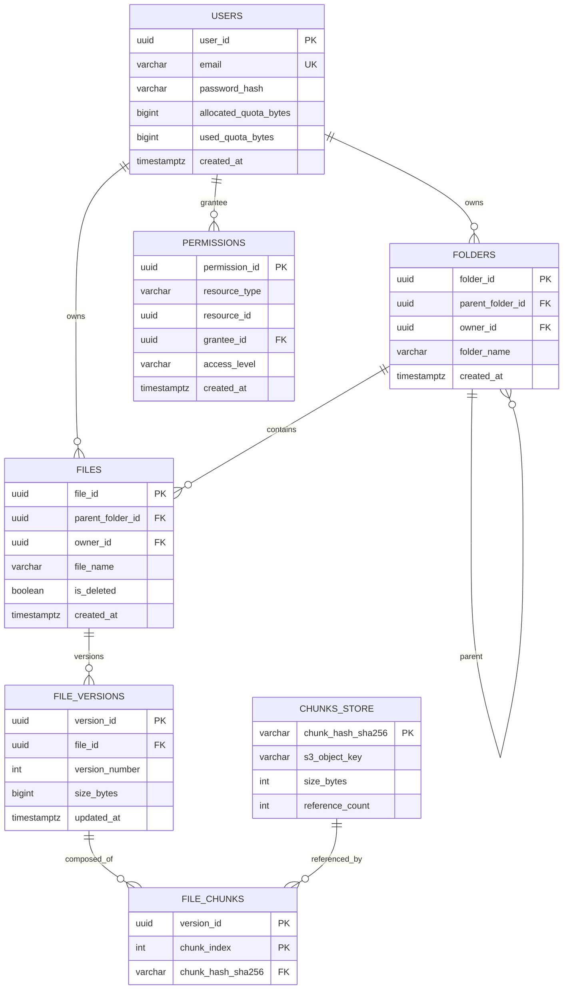
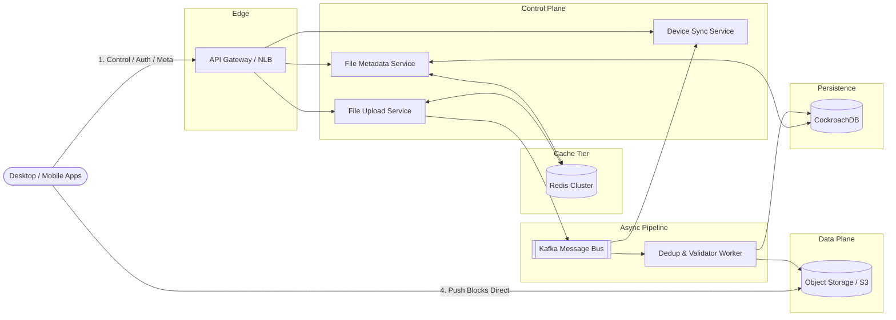
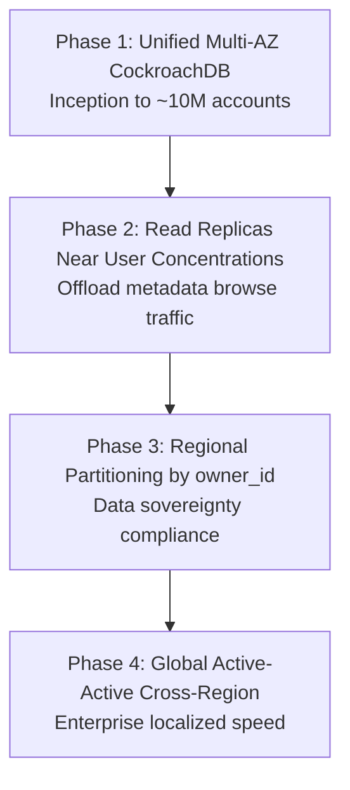
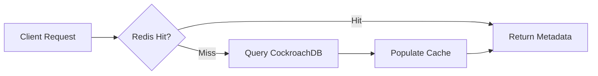

A cloud storage platform lets users store, organize, and synchronize files across devices while sharing folders with granular permissions. At production scale it is a **dual-plane system**: the metadata control plane is extremely read-heavy (directory browsing, sync polls, permission checks), while the file payload plane is read-intensive for downloads but must support resumable chunked uploads without routing raw bytes through application servers.

This post captures the full design — from requirements and capacity math through API contracts, relational schema, control/data plane separation, deduplication, caching, Kubernetes sizing, security, and failure runbooks.

---

## 1. Requirements and Goals

### Functional Requirements

| Requirement | Description |
| :--- | :--- |
| **Account management & quota** | Create accounts, authenticate, enforce a default **15 GB** free-tier storage quota. |
| **Directory structure (CRUD)** | Create, delete, rename, and navigate hierarchical folder/subfolder structures. |
| **File operations** | Chunked uploading, resuming interrupted uploads, downloading files of arbitrary size up to remaining quota. |
| **Device synchronization** | Automatically sync file and folder changes across all connected devices linked to an account. |
| **Sharing & permissions** | Share files or folders with granular permissions (**Viewer**, **Editor**). |

### Clarifying Assumptions (Interview Context)

| Question | Decision |
| :--- | :--- |
| Real-time document collaboration (OT/CRDT)? | **Out of scope** — binary file storage, directory virtualization, and block sync only. |
| Permission inheritance on folder moves? | Permissions **inherit down the tree** dynamically unless overridden at lower nodes. |
| Geographic data sovereignty? | Metadata routes to a unified global or regional shard; **file blocks persist inside designated regional object boundaries**. |

### Non-Functional Requirements

| NFR | Target |
| :--- | :--- |
| **Durability** | **11 nines** ($99.999999999\%$) — zero data loss is a hard constraint |
| **Availability** | **99.99%** for browsing and uploading |
| **Consistency** | Eventual consistency acceptable for device sync; **strict consistency** for metadata actions (sharing permissions) |
| **Sync latency** | File changes trigger sync alerts on connected devices within **< 1.5 seconds** under typical network conditions |
| **Storage efficiency** | Block/chunk-level deduplication to maximize storage utilization |
| **Scale** | **1 billion** total users; **100 million DAU**; **~100 files/folders per user** average |
| **Chunk size** | Fixed **4 MB** per block |
| **Constraints** | Max upload size capped by remaining quota; block-level sync to conserve bandwidth; **isolate data transport from control planes** |

---

## 2. Back-of-the-Envelope Calculations

### Traffic Estimates

| Metric | Calculation | Result |
| :--- | :--- | :--- |
| DAU | Given | **100 million** |
| Active uploaders/day | 1% × 100M | **1 million** |
| Total uploads/day | 1M × 2 uploads | **2 million files/day** |
| Active readers/day | 10% × 100M | **10 million** |
| Total downloads/day | 10M × 5 reads | **50 million files/day** |
| Metadata requests/day | 100M × 40 | **4 billion req/day** |

### Read/Write Ratios

| Plane | Ratio | Character |
| :--- | :--- | :--- |
| File payload | 50M : 2M = **25 : 1** | Read-intensive |
| Control/metadata | 4B : 2M = **2000 : 1** | Extremely read-heavy |

### Peak Requests Per Second

| Path | Average RPS | Peak RPS (2×) |
| :--- | :--- | :--- |
| Metadata | 4B ÷ 86,400 ≈ **46,296** | **~92,592** |
| File upload | 2M ÷ 86,400 ≈ **23.15** | **~46.3** |

### Storage Growth

| Metric | Calculation | Result |
| :--- | :--- | :--- |
| Raw ingress/day | 2M × 10 MB | **20 TB/day** |
| Raw ingress/year | 20 TB × 365 | **7.3 PB/year** |
| After 30% dedup factor | 7.3 PB × 0.7 | **~5.11 PB/year net** |

### Bandwidth

| Path | Average | Peak (2×) |
| :--- | :--- | :--- |
| Ingress (upload) | 20 TB ÷ 86,400 ≈ **231.5 MB/s (~1.85 Gbps)** | **~3.7 Gbps** |
| Egress (download) | 500 TB ÷ 86,400 ≈ **5.78 GB/s (~46.24 Gbps)** | **~92.48 Gbps** |

### Kafka Event Rate

| Event type | Calculation | Result |
| :--- | :--- | :--- |
| Upload pipeline | 2M × 5 msgs ÷ 86,400 | **~116 events/sec** |
| Sync fan-out peak | 116 × 3 devices × 2 | **~696 events/sec** |

### Cache Sizing

| Assumption | Calculation | Result |
| :--- | :--- | :--- |
| Active users (24h) | Given | **100 million** |
| Metadata per user | 20 records × 500 B | **~10 KB** |
| Total cache footprint | 100M × 10 KB | **~1 TB** |
| With 2× safety overhead | 1 TB × 2 | **~2 TB cluster target** |

---

## 3. API Design

### Initialize Upload Session

**`POST /api/v1/files/upload/init`**

Idempotency: clients transmit an `X-Client-File-Signature` header (hash of the complete file layout) to detect matching ongoing sessions.

Request:

```json
{
  "file_name": "quarterly_report.pdf",
  "file_size": 15728640,
  "parent_folder_id": "f83a-912b-409e",
  "total_chunks": 4
}
```

Response (`201 Created`):

```json
{
  "file_id": "b7c3-811a-4f2d",
  "upload_id": "upl-9012-acdf",
  "chunk_size_bytes": 4194304,
  "expected_chunk_hashes": [],
  "status": "INITIATED"
}
```

### Request Chunk Pre-signed URL

**`POST /api/v1/files/upload/chunk-url`**

Request:

```json
{
  "upload_id": "upl-9012-acdf",
  "chunk_index": 2,
  "chunk_hash_sha256": "e3b0c44298fc1c149afbf4c8996fb92427ae41e4649b934ca495991b7852b855"
}
```

Response (`200 OK`):

```json
{
  "upload_id": "upl-9012-acdf",
  "chunk_index": 2,
  "pre_signed_url": "https://storage.provider.com/blocks/upl-9012?partNumber=2&sig=ab73c..."
}
```

### Commit Upload Session

**`POST /api/v1/files/upload/commit`**

Request:

```json
{
  "upload_id": "upl-9012-acdf",
  "file_id": "b7c3-811a-4f2d",
  "chunk_signatures": [
    {"index": 0, "hash": "a8f3..."},
    {"index": 1, "hash": "39cd..."},
    {"index": 2, "hash": "e3b0..."},
    {"index": 3, "hash": "bc81..."}
  ]
}
```

Response (`202 Accepted`):

```json
{
  "file_id": "b7c3-811a-4f2d",
  "status": "PROCESSING",
  "message": "Asynchronous validation and deduplication engine triggered."
}
```

### HTTP Status Codes

| Code | Condition |
| :--- | :--- |
| `400 Bad Request` | Missing parameters or invalid hierarchy request |
| `401 Unauthorized` | Missing token, signature mismatch, or expired access context |
| `403 Forbidden` | Quota exceeded or sharing restriction |
| `409 Conflict` | Resource lock conflict or duplicate filename in target folder |

---

## 4. Data Model



### Key Schema Decisions

| Element | Rationale |
| :--- | :--- |
| `chunks_store.chunk_hash_sha256` as PK | Deduplication anchor — identical 4 MB blocks share one physical entry |
| `file_chunks` composite key `(version_id, chunk_index)` | Reconstructs file layout per version without mutating history |
| Partial index on `files` (`WHERE is_deleted = FALSE`) | Keeps active workspace searches fast |
| Normalized hierarchy via `parent_folder_id` | Move subtrees by mutating a single parent link inside a transaction |

### DDL (Core Tables)

```sql
CREATE TABLE users (
    user_id UUID PRIMARY KEY,
    email VARCHAR(255) UNIQUE NOT NULL,
    password_hash VARCHAR(255) NOT NULL,
    allocated_quota_bytes BIGINT DEFAULT 16106127360, -- 15 GB
    used_quota_bytes BIGINT DEFAULT 0,
    created_at TIMESTAMP WITH TIME ZONE DEFAULT NOW()
);

CREATE TABLE chunks_store (
    chunk_hash_sha256 VARCHAR(64) PRIMARY KEY,
    s3_object_key VARCHAR(512) NOT NULL,
    size_bytes INT NOT NULL,
    reference_count INT DEFAULT 1
);

CREATE TABLE file_chunks (
    version_id UUID NOT NULL REFERENCES file_versions(version_id),
    chunk_index INT NOT NULL,
    chunk_hash_sha256 VARCHAR(64) NOT NULL REFERENCES chunks_store(chunk_hash_sha256),
    PRIMARY KEY (version_id, chunk_index)
);

CREATE TABLE permissions (
    permission_id UUID PRIMARY KEY,
    resource_type VARCHAR(10) NOT NULL, -- 'FILE' or 'FOLDER'
    resource_id UUID NOT NULL,
    grantee_id UUID NOT NULL REFERENCES users(user_id),
    access_level VARCHAR(20) NOT NULL, -- 'VIEWER', 'EDITOR'
    created_at TIMESTAMP WITH TIME ZONE DEFAULT NOW()
);
CREATE INDEX idx_permissions_grantee ON permissions(grantee_id, resource_id);
```

---

## 5. High-Level Architecture



### Component Responsibilities

| Component | Role |
| :--- | :--- |
| **Client** | Local chunk splitting, directory watching, block-level sync, session resume |
| **API Gateway** | Auth, rate limiting, signature validation, load balancing |
| **File Upload Service** | Session coordination, quota checks, pre-signed URL issuance |
| **File Metadata Service** | Folder CRUD, sharing permissions, version history |
| **Object Storage (S3)** | Primary payload store — blocks addressed by cryptographic hash |
| **Redis Cluster** | Active upload session state, chunk progress, hot metadata cache |
| **CockroachDB** | Ownership, permissions, version ledger — strong transactional guarantees |
| **Kafka** | Decouples validation, dedup, virus scan, sync fan-out |
| **Dedup / Validator Worker** | Server-side hash verification, reference count updates, garbage collection |
| **Device Sync Service** | Long-poll / push notifications to connected clients |

### Upload Flow (Control/Data Plane Separation)

1. Client calls **`POST /upload/init`** — Upload Service validates quota and reserves space.
2. For each chunk, client requests a **pre-signed URL** and streams the block **directly to S3** (bypassing app servers).
3. Upload progress tracked in **Redis**; validation deferred until commit.
4. Client calls **`POST /upload/commit`** — triggers async pipeline via **Kafka**.
5. Worker verifies hashes, updates `chunks_store` reference counts, commits `file_versions` + `file_chunks` in a **single DB transaction**.
6. **Sync Service** fans out change events to connected devices.

### Download Flow

1. Client requests file metadata via Metadata Service (permission check via ABAC).
2. Service returns ordered chunk hash list from `file_chunks`.
3. Client fetches blocks from S3 (or CDN edge) using pre-signed GET URLs.
4. Public/viral links route through **CDN** to protect core egress.

---

## 6. Chunking, Deduplication, and ID Strategy

### Fixed 4 MB Chunking

| Approach | Pros | Cons |
| :--- | :--- | :--- |
| **Fixed-size (chosen)** | Predictable pre-signed URLs; simple index management; efficient for media/binaries | Suboptimal dedup when small edits shift block boundaries |
| **Variable-length (Rabin)** | Better dedup for edited documents | Complex indexing; unpredictable URL generation |

**Strategy pattern** selects upload engines by file size: inline direct upload for tiny files; multipart chunked upload for larger payloads.

### Deduplication Model

1. Client computes **SHA-256** per 4 MB block before upload.
2. On commit, worker checks `chunks_store` for existing hash.
3. **Hit** → increment `reference_count`; no new S3 write.
4. **Miss** → verify server-side hash against S3 object; insert new `chunks_store` row.
5. On file delete → decrement references; GC worker removes S3 objects when count reaches zero after safety window.

### Identifier Generation

| Strategy | Verdict |
| :--- | :--- |
| Auto-increment | Exposes volume; poor for distributed writes |
| Snowflake | Efficient but needs coordination cluster |
| **UUIDv7 (chosen)** | Time-ordered, locally generatable, database-friendly |

### Concurrency & Quota Rules

- Quota updates use atomic `UPDATE users SET used_quota_bytes = used_quota_bytes + :delta`.
- Upload init **provisionally reserves** max file size; excess released after commit.
- Version ledger protected by unique index on `(file_id, version_number)`.

---

## 7. Database Selection and Scaling

### Technology Comparison

| Store | Why choose | Why not |
| :--- | :--- | :--- |
| **CockroachDB (chosen)** | Horizontal scale + multi-row ACID for directory ops and permissions | Higher latency than single-node Postgres at small scale |
| **PostgreSQL shards** | Mature, strong consistency | Manual sharding complexity at 1B-user scale |
| **Cassandra** | Massive write throughput | No native multi-row transactions for folder moves |
| **MongoDB** | Flexible documents | Moving folders requires bulk document rewrites |

| Cache | Why choose | Why not |
| :--- | :--- | :--- |
| **Redis (chosen)** | Hashes, bitmaps for chunk tracking; sub-ms reads | Memory cost at 2 TB scale |
| **Memcached** | Simple | Lacks rich structures for upload session state |

| Messaging | Why choose | Why not |
| :--- | :--- | :--- |
| **Kafka (chosen)** | Replayable log; multiple independent consumers (scan, dedup, sync) | Operational overhead vs RabbitMQ |
| **RabbitMQ** | Simpler ops | Messages removed on ack — poor catch-up for reconnecting devices |

### Scaling Phases



| Phase | Trigger | Drawback |
| :--- | :--- | :--- |
| **1 — Single cluster** | < 10M accounts | Cross-continental metadata lag |
| **2 — Read replicas** | Browse latency spikes | Brief replica lag anomalies |
| **3 — Regional partitions** | Regulatory boundaries | Cross-region sharing lookups |
| **4 — Active-active** | Global enterprise scale | Complex shared-asset conflict rules |

### High Availability

- CockroachDB **Raft consensus** across 3+ regions — survives full regional outage.
- S3 **erasure coding** across AZs for 11-nines durability.
- Metadata: daily snapshots to isolated vaults; payload: cross-region object replication.

---

## 8. Caching Strategy

**Pattern:** cache-aside (lazy population) for metadata; Redis for active upload sessions.



| Cache target | TTL | Eviction |
| :--- | :--- | :--- |
| Folder structure | **12 hours** | `allkeys-lru` |
| Permission structures | **30 minutes** | `allkeys-lru` |
| Active upload sessions | **24 hours** | Explicit on commit or expiry |

**Invalidation:** any folder rename, file add, or permission change evicts the affected folder node immediately.

### Sizing

| Metric | Value |
| :--- | :--- |
| Active users (24h window) | 100 million |
| Per-user directory context | ~10 KB |
| Raw footprint | ~1 TB |
| With 2× index overhead | **~2 TB Redis cluster** |

---

## 9. Capacity Planning

| Component | Spec | Count | Notes |
| :--- | :--- | :--- | :--- |
| **File Upload Service** | 2 vCPU, 4 GB RAM | **60 pods** (3 regions) | Stateless; scales on CPU 70% / memory 80% |
| **Metadata Service** | 4 vCPU, 8 GB RAM | **150 pods** global | Handles ~93K peak metadata RPS |
| **Redis** | 256 GB / node | **16 nodes** (8 primary + 8 replica) | Sharded; 2 TB aggregate |
| **Kafka** | RF=3 | **12 brokers** (3 AZs) | ~696 peak sync fan-out eps |
| **CockroachDB** | Multi-region | 3+ region clusters | Raft groups per region |
| **Network ingress peak** | — | **~3.7 Gbps** | Upload path |
| **Network egress peak** | — | **~92.5 Gbps** | CDN offloads public/viral traffic |

### HPA Configuration

- Scale out when average CPU > **70%** or memory > **80%** over a rolling **3-minute** window.
- Pre-signed URL generators are fully stateless — horizontal scale without backend dependencies.

---

## 10. Key Design Decisions Summary

| Decision | Choice | Rationale |
| :--- | :--- | :--- |
| Control vs data plane | **Separated** | Heavy block transfers must not degrade metadata browsing |
| Upload path | **Pre-signed URLs → S3** | Eliminates app-server bottleneck; clients stream directly |
| Chunk validation | **Deferred to commit** | Per-block validation on hot path is too expensive at scale |
| Deduplication | **Reference-counted `chunks_store`** | Safe shared blocks; GC only when count = 0 |
| Chunk size | **Fixed 4 MB** | Predictable URLs and indexing |
| Primary metadata store | **CockroachDB** | ACID directory ops at global scale |
| Session state | **Redis** | Fast chunk progress tracking |
| Async processing | **Kafka event-driven** | Virus scan, dedup, thumbnails, sync off hot path |
| ID generation | **UUIDv7** | Time-ordered, distributed-friendly |
| Permission model | **Inheritance with overrides** | Folder moves update one parent link |
| Encryption | **TLS 1.3 in transit; AES-GCM-256 at rest** | Keys via KMS |
| AuthZ | **JWT + ABAC** | Granular per-resource access checks |
| Cold storage | **S3 lifecycle → Glacier** | Cost optimization for infrequently accessed blocks |
| Mobile sync | **FCM/APNs push** | Avoids battery-draining continuous long-poll |
| Observability | **W3C Trace Context → OpenTelemetry** | SLIs: upload < 500ms/block; sync < 1s; 99.99% metadata availability |

### Production Refinements Over Naive Designs

| Naive approach | Production approach |
| :--- | :--- |
| App server receives raw file bytes | Client uploads directly to S3 via pre-signed URLs |
| Validate every block during transfer | Track in Redis; validate once on commit |
| Combined metadata + payload path | Independent control and data planes |
| Conceptual dedup only | `chunks_store` with atomic reference counting |
| All blocks on hot S3 tier | Lifecycle rules move cold blocks to Glacier |

---

## 11. Failure Modes and Mitigations

| Failure | Impact | Mitigation |
| :--- | :--- | :--- |
| **Redis partition** | Cache miss storm on DB | Fall back to CockroachDB with gateway rate-limiters |
| **S3 block corruption** | Unreadable chunk | Erasure coding reconstruction; client re-upload on active session |
| **Network split (DB)** | Split-brain risk | Raft majority partition accepts writes; minority stops |
| **Kafka broker failure** | Delayed sync/validation | RF=3; in-sync replica promotion |
| **Commit fails after 9/10 chunks** | Incomplete file | Redis retains session 24h; client resumes missing chunks |
| **Concurrent quota updates** | Over-allocation | Provisional reservation at init; atomic delta on commit |
| **Hash spoofing** | Unauthorized block access | Server-side SHA-256 verification; hash ≠ permission |
| **Viral public download** | Egress saturation | CDN edge caching; per-IP/account rate limits |
| **Clock drift (CockroachDB)** | Transaction ordering risk | Hybrid Logical Clocks; nodes halt if drift > 500ms |
| **Reference count race** | Premature block deletion | Atomic `reference_count` updates in serializable transactions |
| **Regional S3 blackout** | Read unavailable in region | Redirect to replicated secondary region |
| **DDoS on download endpoints** | Service degradation | WAF + CDN + per-token transfer limits |

---

## What's Next

See the companion [Cloud Storage Interview Questions](/system-design/cloud-storage-interview-questions/) for 50 senior-level Q&A covering chunk resume, permission inheritance, dedup security, sync scaling, and chaos testing.
