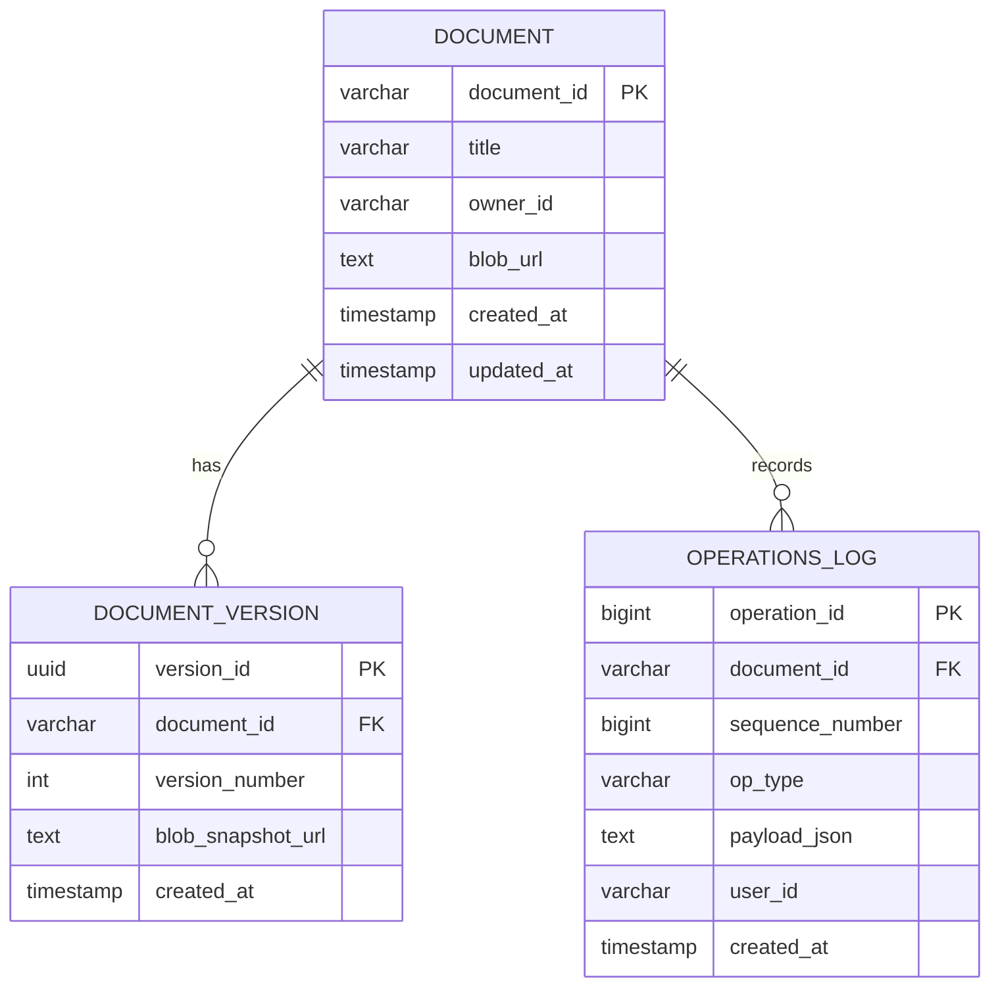
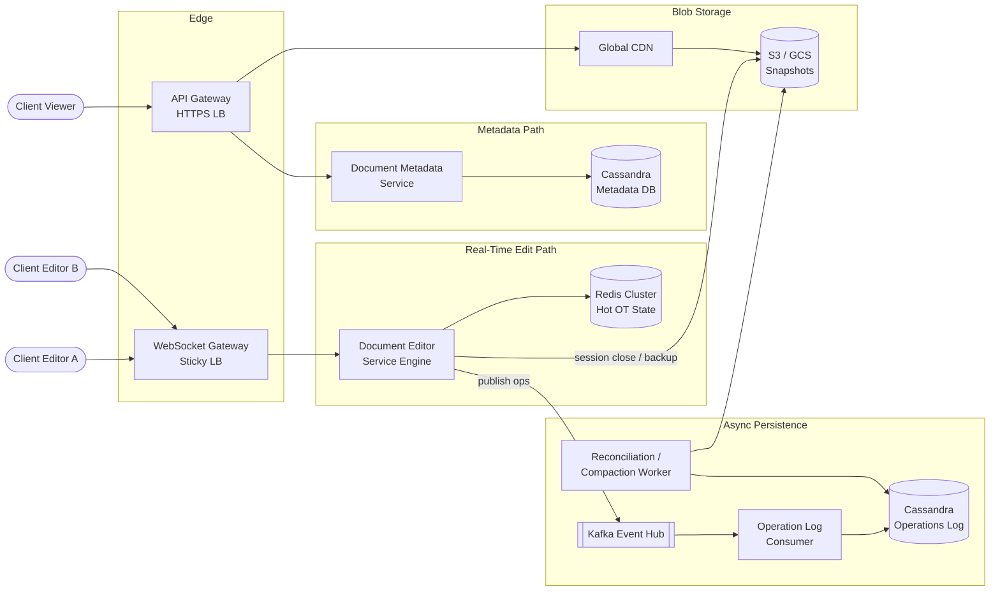
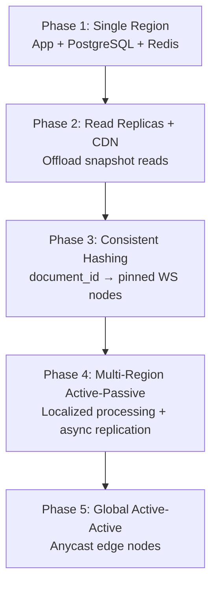

A real-time collaborative text editor lets multiple users edit the same document simultaneously — with live cursor presence, strict ordering of concurrent keystrokes, and durable version history. At scale it is **write-heavy, latency-sensitive, and stateful**: every active document pins a long-lived WebSocket session, server-side Operational Transformation (OT) must serialize concurrent edits in under 100 ms, and intermediate deltas must persist reliably before compaction into immutable snapshots.

This post walks through the full design — requirements, capacity math, REST and WebSocket API contracts, data modeling, architecture, OT concurrency model, technology trade-offs, caching, infrastructure sizing, and failure modes.

---

## 1. Requirements and Goals

### Functional Requirements (MVP)

| Requirement | Description |
| :--- | :--- |
| **Document CRUD** | Create, read, update, and delete documents. |
| **Real-time co-authoring** | Multiple concurrent editors collaborate on the same document simultaneously. |
| **Low-latency sync** | Changes from one editor broadcast to all other active editors in near real-time. |
| **Presence & cursors** | Display real-time cursor positions, selections, and active user presence per document. |
| **Document versioning** | Maintain change history (snapshots) and allow restoring to previous points in time. |

### Clarifying Assumptions

| Question | Assumption |
| :--- | :--- |
| Rich media attachments? | **Text and formatting metadata** for the core engine; media handled as separate blob references. |
| Offline editing? | Focus on **online real-time collaboration** with graceful disconnect and catch-up reconciliation. |
| History retention? | Retain infinite major version snapshots; clean intermediate operational deltas post-session via compaction. |

### Non-Functional Requirements

| NFR | Target |
| :--- | :--- |
| **Scale** | **50M DAU**; **1 billion** saved documents |
| **Concurrent editors / doc** | Average **2–5**; peak ceiling **1,000** on viral documents |
| **Latency** | End-to-end sync **≤ 100 ms** for seamless collaboration |
| **Availability vs. consistency** | High availability for standalone ops; **strict sequential consistency** within active editing sessions |
| **Durability** | Zero data loss for finalized text; intermediate edits persist via buffered async pipelines |
| **Read / Write ratio** | **1 : 1** within active sessions (every keystroke write → fan-out read); **10 : 1** for metadata browse |

### Constraints

- WebSocket connections are sticky per `document_id` — all editors on a document must route to the same stateful OT engine instance.
- Keystroke rate limiting applies per client session to mitigate abuse.

---

## 2. Back-of-the-Envelope Calculations

### Traffic Estimates

| Metric | Calculation | Result |
| :--- | :--- | :--- |
| DAU | Given | **50 million** |
| Peak concurrent editors | 10% of DAU editing simultaneously | **5 million** |
| Keystrokes / sec per active user | 1 char every 200 ms | **5 Hz** |
| Keystrokes per 30-min session | 1,800 s × 5 Hz | **9,000 events** |
| Total daily edit events | 5M users × 9,000 | **45 billion / day** |
| Peak edit RPS | 5M × 5 keystrokes/s | **25 million RPS** |

### Storage

| Assumption | Calculation | Result |
| :--- | :--- | :--- |
| Bytes per operation (JSON + metadata) | char, index, op type, user ID, vector clock | **~200 bytes** |
| Raw delta storage / day | 45B × 200 B | **~9 TB / day** |
| Compacted snapshots / day | 50M docs × 100 KB avg | **~5 TB / day** |
| Compacted storage / year | 5 TB × 365 | **~1.825 PB / year** |

### Bandwidth

| Path | Calculation | Result |
| :--- | :--- | :--- |
| Ingress peak | 25M ops/s × 200 B | **~5 GB/s (~40 Gbps)** |
| Egress peak (3× fan-out) | 40 Gbps × 3 | **~120 Gbps** |

### In-Memory Hot Document Cache

| Assumption | Calculation | Result |
| :--- | :--- | :--- |
| Active documents at peak | Given | **~2 million** |
| Footprint per document (text buffer + OT state) | Given | **~500 KB** |
| Total Redis footprint | 2M × 500 KB | **~1 TB** |

### Kafka Throughput

| Metric | Value |
| :--- | :--- |
| Peak events / sec | **25 million** (partitioned by `document_id`) |

---

## 3. API Design

| # | Method | Path | Purpose |
| :---: | :--- | :--- | :--- |
| 1 | POST | `/api/v1/documents` | Create Document |
| 2 | GET | `/api/v1/documents/{document_id}?version_id=41` | Get Document Snapshot |
| 3 | GET | `/api/v1/documents/{document_id}/edit/ws` | Collaborative session (WebSocket) |


Request headers: `X-Idempotency-Key: <UUIDv4>` (prevents duplicate creation on network retry).


```json
{
  "title": "Q3 Architecture Design",
  "owner_id": "usr_99831"
}
```



```json
{
  "document_id": "doc_7712a",
  "created_at": "2026-06-26T10:15:30Z"
}
```



{{< api-endpoint method="GET" path="/api/v1/documents/{document_id}?version_id=41" desc="Get Document Snapshot" >}}
Query parameter `version_id` is optional — omit to fetch the latest snapshot.


```json
{
  "document_id": "doc_7712a",
  "version_id": 41,
  "content_url": "https://storage.provider.com/buckets/doc_7712a_v41.txt",
  "title": "Q3 Architecture Design"
}
```



{{< api-endpoint method="GET" path="/api/v1/documents/{document_id}/edit/ws" desc="Collaborative session (WebSocket upgrade)" >}}

**Inbound operation (client → server):**

```json
{
  "event_type": "EDIT_OP",
  "client_version": 104,
  "user_id": "usr_99831",
  "operation": {
    "type": "INSERT",
    "character": "A",
    "position": 29
  }
}
```


**Outbound broadcast (server → connected clients):**

```json
{
  "event_type": "BROADCAST_OP",
  "server_version": 105,
  "user_id": "usr_99831",
  "operation": {
    "type": "INSERT",
    "character": "A",
    "position": 30
  }
}
```


| Status / Code | Condition |
| :--- | :--- |
| `409 Conflict` | Client version outside OT transformation sliding window — triggers client resynchronization |
| `429 Too Many Requests` | Keystroke rate limit exceeded per WebSocket session |


---

## 4. Data Model



### `documents` (Metadata)

| Column | Type | Key | Purpose |
| :--- | :--- | :--- | :--- |
| `document_id` | `VARCHAR(64)` | PK | Unique document identifier |
| `title` | `VARCHAR(255)` | — | Descriptive title |
| `owner_id` | `VARCHAR(64)` | Secondary index | Ownership for RBAC |
| `blob_url` | `TEXT` | — | Reference to latest snapshot in object storage |
| `created_at` | `TIMESTAMP` | — | Audit timestamp |
| `updated_at` | `TIMESTAMP` | — | Drives cache eviction policies |

### `document_versions` (Snapshot Control)

Partition key: `document_id` · Clustering key: `version_number DESC`

| Column | Type | Key | Purpose |
| :--- | :--- | :--- | :--- |
| `version_id` | `UUID` | PK | Immutable structural reference |
| `document_id` | `VARCHAR(64)` | Partition key | Groups snapshots per document |
| `version_number` | `INT` | Clustering key | Sequential ordering for rollbacks |
| `blob_snapshot_url` | `TEXT` | — | Path to immutable S3 artifact |
| `created_at` | `TIMESTAMP` | — | Snapshot creation time |

### `operations_log` (Granular Deltas)

| Column | Type | Key | Purpose |
| :--- | :--- | :--- | :--- |
| `operation_id` | `BIGINT` | PK | Monotonically increasing sequence |
| `document_id` | `VARCHAR(64)` | Partition key | Colocates ops per document |
| `sequence_number` | `BIGINT` | Clustering key | Total ordering for log replay |
| `op_type` | `VARCHAR` | — | `INSERT`, `DELETE`, etc. |
| `payload_json` | `TEXT` | — | Raw OT mutation parameters |
| `user_id` | `VARCHAR(64)` | — | Originating editor |
| `created_at` | `TIMESTAMP` | — | Operation timestamp |

**Schema note:** Denormalized Cassandra/ScyllaDB layout — all operations for a `document_id` live in one partition, eliminating cross-node joins during state reconstruction.

---

## 5. High-Level Architecture



### Real-Time Edit Path

1. Editors connect via **WebSocket Gateway** with sticky routing by `document_id` (consistent hashing).
2. **Document Editor Service** runs the server-side OT loop on a single-threaded actor per document.
3. Live document state is updated immediately in **Redis** (write-back cache).
4. Operations are published to **Kafka** for async persistence to the operations log.
5. Transformed operations are broadcast to all connected editors on the document.

### Metadata & Read Path

1. Viewers and cold opens use **REST** through the API Gateway.
2. **Document Metadata Service** serves document info and snapshot URLs from Cassandra.
3. Snapshot content is served from **CDN → S3** for low-latency global reads.

### Compaction Path

1. **Reconciliation Worker** scans uncompacted operations at regular intervals.
2. Reconciles deltas into a major text snapshot, writes to S3, records a new `document_versions` row.
3. Deletes processed operation records to reclaim storage.

---

## 6. Operational Transformation Engine

Concurrent edits at the same index are resolved server-side via **Operational Transformation (OT)** — not client-side last-write-wins.

### Core Class Structure

```
DocumentSession
├── documentId: String
├── activeUsers: List<String>
├── serverRevision: AtomicLong
├── applyClientOp(op): Operation
└── broadcastState(): void
        │
        ▼
OTEngine (interface)
└── transform(clientOp, serverOp): Operation
        │
        ▼
OperationalTransform
└── transform(clientOp, serverOp): Operation
```

### Concurrency Model

| Mechanism | Purpose |
| :--- | :--- |
| **Single-threaded actor per document** | Guarantees strict sequential correctness — each `document_id` is pinned to one execution thread (Akka Actor or hash-pinned `ScheduledThreadPoolExecutor`) |
| **AtomicLong server revision** | Memory-barrier-safe visibility of sequence numbers without lock contention |
| **Deterministic transform rules** | When two users insert at the same index, server arrival order (or user ID tie-break) shifts the later operation's position by +1 |

### OT vs. CRDT

| Approach | Pros | Cons |
| :--- | :--- | :--- |
| **OT (chosen)** | Single canonical server state; strict text-ordering; lower memory than CRDTs | Requires server-side transformation; reconnect catch-up logic |
| **CRDT** | Peer-to-peer merge without central ordering | Heavy per-character metadata; tombstone bloat; high mobile client overhead |

### Example: Simultaneous Insert at Index 29

1. User A's `INSERT "A" @ 29` arrives first → applied at position 29, `server_version = 105`.
2. User B's `INSERT "B" @ 29` is transformed → shifted to position 30 before apply and broadcast.
3. All clients converge on identical document text.

---

## 7. Database Selection and Scaling

### Technology Comparison

| Database | Why choose | Why not |
| :--- | :--- | :--- |
| **ScyllaDB / Cassandra** | Massive write throughput; partition by `document_id` avoids row contention; horizontal scale | No joins; eventual consistency outside partition; operational complexity |
| **PostgreSQL** | ACID, mature tooling, strong consistency | Row-level lock contention on viral single-document edits; sharding adds complexity |
| **MongoDB** | Flexible schema, horizontal sharding | Document-level locking bottleneck on hot documents |

### Decision

**ScyllaDB / Cassandra** for `operations_log` and `document_versions` — the write path generates billions of delta events per day, and colocating operations by `document_id` partition enables fast sequential replay without cross-node coordination.

Metadata (`documents` table) can start on Cassandra or PostgreSQL with sharding; migrate to Cassandra when write volume exceeds single-node limits.

### Sync Engine & Transport

| Decision | Choice | Rationale |
| :--- | :--- | :--- |
| Collaboration engine | **OT** | Canonical server state; less metadata than CRDTs |
| Real-time transport | **WebSockets** | Full-duplex; minimal header overhead vs. SSE + HTTP POST per keystroke |

### Scaling Strategy



| Phase | Trigger | Action |
| :--- | :--- | :--- |
| **1** | MVP | Single region, standalone DB + Redis |
| **2** | CPU / read bottleneck | Write-master + read replicas + CDN for snapshots |
| **3** | Write volume exceeds single DB | Consistent hashing on `document_id`; stateful WS node pinning |
| **4** | Cross-continental latency > 150 ms | Multi-region active-passive with async storage replication |
| **5** | DR + compliance | Global active-active with anycast routing |

**Sharding key:** `document_id` via consistent hashing — all WebSocket channels for a document route to the same runtime instance, enabling localized OT without cross-node locks.

---

## 8. Caching Strategy

Two cache patterns serve different paths:

| Pattern | Path | Behavior |
| :--- | :--- | :--- |
| **Write-back** | Real-time editing | Operations modify live state in Redis immediately; async flush to S3 on interval |
| **Cache-aside** | Historical document reads | Check cache → on miss, fetch snapshot URL from DB → serve from CDN/S3 |

### Write-Back Flow (Active Sessions)

```
Client Keystroke → Document Editor Engine
                         │
              (1) Update live state immediately
                         ▼
                  Redis Node (hot OT state)
                         │
              (2) Async compaction flush (~20s interval)
                         ▼
                  S3 Blob Object (immutable snapshot)
```

### Eviction Policy

| Policy | Setting |
| :--- | :--- |
| Algorithm | **LRU** + explicit **TTL** |
| Idle timeout | **30 minutes** — on expiry, flush state to S3 and evict from Redis |

### Sizing

| Assumption | Calculation | Result |
| :--- | :--- | :--- |
| Active documents at peak | Given | **~2 million** |
| Per-document footprint | text buffer + OT state tree | **~500 KB** |
| Total Redis memory | 2M × 500 KB | **~1 TB** |

Recommended: **16-shard Redis cluster**, 64 GB RAM per shard.

---

## 9. Capacity Planning

| Component | Metric | Calculation / Assumption | Recommendation |
| :--- | :--- | :--- | :--- |
| **Editor Service pods** | Concurrent WebSocket loops | ~20,000 per pod; 5M peak editors | **~150 pods globally** |
| | Memory per pod | OT state + local buffers | **8 GB RAM**, HPA at 70% CPU / 65% socket limits |
| **Redis Cluster** | Hot document memory | 2M × 500 KB ≈ 1 TB | **16 shards × 64 GB** |
| **Kafka Brokers** | Peak event rate | 25M events/sec | **30 high-throughput brokers**, partitioned by `document_id` |
| **Network ingress** | Peak edit traffic | 25M × 200 B | **~5 GB/s (~40 Gbps)** |
| **Network egress** | 3× fan-out | 40 Gbps × 3 | **~120 Gbps** |
| **S3 storage growth** | Compacted snapshots | 5 TB/day | Lifecycle policies; tier to cold storage for old versions |
| **Operations log** | Raw deltas before compaction | 9 TB/day | Compaction worker reclaims space post-snapshot |

### High Availability Targets

| Metric | Target |
| :--- | :--- |
| **RPO** (Recovery Point Objective) | **≤ 10 seconds** — bounded by Kafka multi-AZ buffering interval |
| **RTO** (Recovery Time Objective) | **≤ 5 seconds** — multi-pod deployment with automatic health-check failover |

---

## 10. Key Design Decisions Summary

| Decision | Choice | Rationale |
| :--- | :--- | :--- |
| Collaboration engine | Operational Transformation (OT) | Strict text ordering; single canonical server state; lower memory than CRDTs |
| Real-time transport | WebSockets | Full-duplex; minimal per-keystroke overhead vs. SSE + POST |
| WS routing | Consistent hashing on `document_id` | Pins all editors to one OT engine instance — avoids distributed locks |
| Concurrency model | Single-threaded actor per document | Sequential correctness without lock contention |
| Hot state cache | Redis write-back | Sub-ms state reads/writes during active sessions |
| Operations persistence | Kafka → Cassandra operations log | Decouples edit surge from DB write capacity |
| Snapshot storage | S3 + CDN | Cost-effective immutable version artifacts |
| Metadata / versions DB | ScyllaDB / Cassandra | Partition-scoped writes scale to billions of deltas/day |
| History retention | Infinite major versions; compact intermediate deltas | Balances audit needs with storage cost |
| Gateway separation | Stateless HTTP API + stateful WS cluster | Prevents long-lived connections from starving transactional endpoints |
| Security | JWT RBAC at API Gateway + TLS 1.3 + per-session rate limiting | Document-level READ/EDIT permissions; DoS mitigation |
| Observability SLO | 99.9% of sync broadcasts ≤ 100 ms | `X-Trace-ID` propagated through WS → engine → Kafka consumers |

---

## 11. Failure Modes and Mitigations

| Failure | Impact | Mitigation |
| :--- | :--- | :--- |
| **Redis shard node down** | Hot OT state temporarily inaccessible for documents on failed shard | Cache-miss handler replays uncompacted ops from operations log over last S3 snapshot; rebuild state on healthy shard |
| **Editor pod crash** | Active WebSocket sessions drop | Gateway detects broken sockets; clients reconnect via consistent hashing to healthy pod; reconstruct state from Redis or log replay |
| **Kafka unavailable** | Operations not persisted to log | Local buffer with back-pressure; Redis retains live state; replay buffer on recovery (RPO ≤ 10s) |
| **Client version mismatch (409)** | Client OT state diverged beyond sliding window | Client sends last known `server_version`; server replays and transforms gap operations; full resync if needed |
| **Network partition (client offline)** | Client continues local edits without server updates | On reconnect, client sends `client_version`; server transforms offline ops against live timeline and broadcasts catch-up |
| **Viral document (1,000 editors)** | Single actor thread becomes hot | Dedicated high-memory pod class; optional document-level rate shaping; monitor transform latency SLI |
| **Operations log growth** | Storage bloat; slower replay | Background compaction worker merges deltas into S3 snapshots and deletes processed records |
| **Cross-region latency spike** | Sync exceeds 100 ms SLO | Phase 4+ multi-region deployment; edge WS nodes co-located with user geography |

---

## What's Next

Future posts in this series will cover adjacent designs — CRDT-based alternatives for offline-first editors, end-to-end encryption for collaborative documents, and multi-region active-active conflict resolution at global scale.
