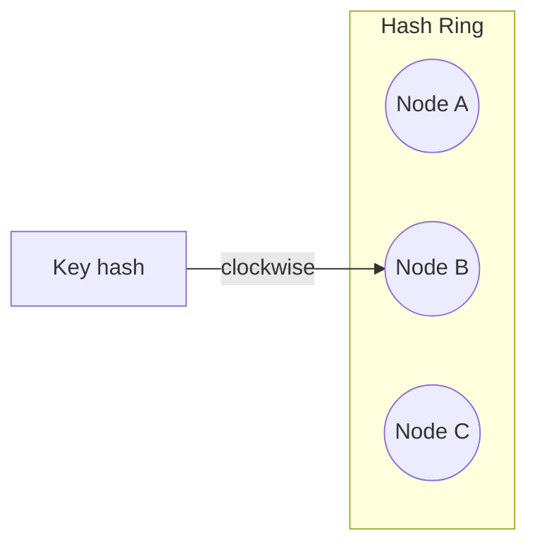

## Overview

**Consistent hashing** maps keys to nodes on a ring so that when nodes are added or removed, only a **fraction** of keys move — unlike `hash(key) % N`, which reshuffles almost everything. It is the standard routing primitive for **distributed caches**, **shards**, **gateways**, and **rate limiters**.

System Design owns the **interview-level** explanation; production ring tuning and sloppy quorum details live in Microservices.

---

## Why It Matters

| Without consistent hashing | With consistent hashing |
| :--- | :--- |
| Adding a cache node invalidates ~100% of keys | ~K/N keys remapped per node change |
| Rolling deploy causes cache stampede | Bounded key migration |
| Modulo hashing breaks session stickiness | Stable mapping for same key |

Used in: Memcached clusters, Dynamo-style KV, CDN origins, API rate-limit shards, Kafka partition assignment (conceptually related).

---

## Core Concepts

### Modulo vs consistent hashing

| Approach | Add 1 node to 10 | Problem |
| :--- | :--- | :--- |
| `hash(k) % 10` | Most keys remap | Mass cache miss / data move |
| **Consistent hash ring** | ~1/11 of keys move | Minimal disruption |

### Hash ring mechanics

1. Hash nodes and keys to 0..2^32-1 on a ring
2. Key maps to **first node ≥ key hash** (clockwise)
3. Add/remove node → only keys between neighbors move

### Virtual nodes (vnodes)

| Problem | Fix |
| :--- | :--- |
| Uneven key distribution | Each physical node owns **many** points on ring |
| Hot physical server | More vnodes improves statistical balance |

Typical: **100–200 vnodes** per physical node in large caches.

### Hot spots

| Cause | Mitigation |
| :--- | :--- |
| Low-cardinality keys | Salt key: `user:123` → `user:123#random(0..7)` |
| CGNAT / shared egress IP | Layer 7 cookie for stickiness — see [Load Balancers](/system-design/load-balancers-and-routing-algorithms/) |
| Celebrity key | Local combine / dedicated shard |

### Where consistent hashing appears

| System | Role |
| :--- | :--- |
| Distributed cache | Which memcached node holds key |
| Sharded DB router | Chunk → shard mapping |
| Rate limiter | Which Redis cell counts quota |
| DHT / KV store | Partition ownership |

**Case studies:** [Distributed KV Store](/system-design/distributed-kv-store/) · [Distributed LRU Cache](/system-design/distributed-lru-cache/) · [Distributed Rate Limiter](/system-design/distributed-rate-limiter/) · [Chat Application](/system-design/chat-application/)

---

## Architect Perspective

### Interview talking points

1. **Why not modulo?** — Rebalancing cost on scale events
2. **Virtual nodes** — Load balance across heterogeneous hardware
3. **Node failure** — Keys replicate to successor (replication factor)
4. **Hot key** — Application-layer sharding or read replicas for hot range

### Relation to sharding

Shard routers and config servers often use range + hash hybrid. See [Database Sharding](/system-design/database-sharding-provisioning-and-chunk-routing/) for chunk migration and metadata registry — consistent hashing is the **key→shard** function inside the router.

---

## Common Mistakes

| Mistake | Fix |
| :--- | :--- |
| Consistent hash without vnodes | Skewed load |
| Ignoring hot keys | Monitor per-key QPS; salt |
| Assuming stickiness = consistency | Stickiness is routing; consistency is separate |
| Rehash on every deploy without graceful drain | Drain + vnode migration plan |

---

## Interview Questions

1. **Why use consistent hashing instead of mod N?**
2. **What happens to keys when a node leaves the ring?**
3. **What are virtual nodes and why add them?**
4. **How would you handle a key with 100× traffic of others?**
5. **Design shard routing for a distributed cache with 20 nodes.**

---

## Related Topics

- [Capacity Estimation](/system-design/capacity-estimation/) — size shard count from QPS
- [Load Balancers & Routing](/system-design/load-balancers-and-routing-algorithms/) — L7 stickiness vs L4 hash
- [Database Sharding](/system-design/database-sharding-provisioning-and-chunk-routing/)
- [Caching & CDNs](/system-design/caching-and-cdns-hierarchical-arrays/)
- [CAP & PACELC](/system-design/cap-and-pacelc/) — partition behavior of distributed caches

---

## Deep Dive References

| Topic | Location |
| :--- | :--- |
| Consistent hashing implementation (Deep Dive) | [Microservices — Consistent Hashing](/microservices/04-distributed-systems/consistent-hashing/) |
| Scalability patterns & hot keys | [Microservices — Scalability Patterns](/microservices/10-production-playbook/scalability-patterns/) |

**Scalability:** [Horizontal vs Vertical Scaling](/system-design/horizontal-vs-vertical-scaling/) · [Scaling Strategies Overview](/system-design/scaling-strategies-overview/)
