Consistent hashing was invented to solve a painful scaling problem: when a distributed cache or storage cluster changes size, a naive hash function can move almost every key. The algorithm is less about drawing a circle and more about making membership changes survivable.

This guide starts with a Redis cache and the failure of `hash(key) % N`, then builds toward hash rings, virtual nodes, replication, sloppy quorum, hinted handoff, and production systems.

---

## 1. The Scaling Problem

Imagine a web application using **Redis as a distributed cache**. The application has 4 Redis cache servers:

| Server | Index |
| :--- | :---: |
| `redis-a` | `0` |
| `redis-b` | `1` |
| `redis-c` | `2` |
| `redis-d` | `3` |

The router chooses the cache server using:

```text
server = hash(key) % 4
```

Example key placement:

| Cache Key | Example `hash(key)` | `hash(key) % 4` | Server |
| :--- | ---: | ---: | :--- |
| `user:101` | `11` | `3` | `redis-d` |
| `user:102` | `18` | `2` | `redis-c` |
| `cart:77` | `24` | `0` | `redis-a` |
| `session:x9` | `29` | `1` | `redis-b` |
| `product:55` | `37` | `1` | `redis-b` |
| `feed:101` | `42` | `2` | `redis-c` |

This looks clean. Every request for `user:101` goes to `redis-d`. Every request for `cart:77` goes to `redis-a`.

Now traffic grows. You add a fifth Redis server:

| Server | Index |
| :--- | :---: |
| `redis-a` | `0` |
| `redis-b` | `1` |
| `redis-c` | `2` |
| `redis-d` | `3` |
| `redis-e` | `4` |

The router must now use:

```text
server = hash(key) % 5
```

The same keys are routed again:

| Cache Key | Example `hash(key)` | Old: `% 4` | Old Server | New: `% 5` | New Server | Moved? |
| :--- | ---: | ---: | :--- | ---: | :--- | :---: |
| `user:101` | `11` | `3` | `redis-d` | `1` | `redis-b` | Yes |
| `user:102` | `18` | `2` | `redis-c` | `3` | `redis-d` | Yes |
| `cart:77` | `24` | `0` | `redis-a` | `4` | `redis-e` | Yes |
| `session:x9` | `29` | `1` | `redis-b` | `4` | `redis-e` | Yes |
| `product:55` | `37` | `1` | `redis-b` | `2` | `redis-c` | Yes |
| `feed:101` | `42` | `2` | `redis-c` | `2` | `redis-c` | No |

Only one example key stayed on the same server. The data is still sitting in the old Redis nodes, but the application is now asking different Redis nodes for the same keys.

That creates a **cache miss storm**:

1. Application asks the new owner for `user:101`.
2. New owner does not have it.
3. Application falls back to the database.
4. Many hot keys miss at the same time.
5. Database traffic spikes.
6. Redis slowly warms back up, but the backend may already be overloaded.

The scaling action that was supposed to reduce load can temporarily make the system much worse.

---

## 2. Why Modulo Hashing Fails

Modulo hashing is fragile because changing `N` changes the meaning of almost every remainder.

For a key to stay on the same numbered server after moving from 4 servers to 5 servers, this must be true:

```text
hash(key) % 4 == hash(key) % 5
```

That equality is rare. With uniform hashes, the expected fraction of keys that stay in the same slot is roughly:

```text
1 / max(old_node_count, new_node_count)
```

So when moving from 4 to 5 servers:

```text
keys that stay    ~= 1 / 5 = 20%
keys that migrate ~= 80%
```

For larger clusters, adding one server still moves most keys:

| Change | Approx Keys That Stay | Approx Keys That Move |
| :--- | ---: | ---: |
| 4 -> 5 nodes | 20% | 80% |
| 10 -> 11 nodes | 9.1% | 90.9% |
| 100 -> 101 nodes | 0.99% | 99.01% |

The operational impact is severe:

| Impact | What Happens |
| :--- | :--- |
| Cache miss storm | Most lookups go to nodes that do not have the requested key. |
| Database overload | Misses fall through to the primary database or read replicas. |
| Latency spike | Requests wait on slower storage instead of memory. |
| Expensive rewarm | The cluster must reload hot data it already had elsewhere. |
| Risky deployments | Adding, removing, or replacing nodes becomes a production event. |

Modulo hashing is fine when the number of buckets is fixed forever. Distributed systems do not have that luxury.

---

## 3. Introducing Consistent Hashing

The real goal is not "spread keys evenly." Modulo hashing already does that.

The goal is:

> When a server is added or removed, move only the keys that must move.

Consistent hashing changes the mental model. Instead of saying "divide every key by the current number of servers," ask:

> What if servers and keys both lived on one circle?

If every key and every server has a stable position on that circle, a key can choose the next server after it. Adding a new server should only affect keys that now find that new server before their old server. Removing a server should only affect keys that were owned by the removed server.

That is the key invention: **ownership is local**, not global.

---

## 4. Hash Ring

A hash ring is a circular view of a fixed hash space.

### Hash Space

Choose a hash function such as MurmurHash, MD5, SHA-1, or CRC32. The hash output is treated as a number in a fixed range:

```text
0 ... 2^32 - 1
```

Because the range wraps around from the maximum value back to `0`, we draw it as a ring.

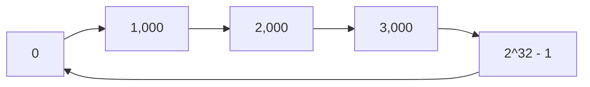

### Server Placement

Each server is hashed to a position on the ring:

```text
position = hash(server_id)
```

Example:

| Server | Hash Position |
| :--- | ---: |
| `redis-a` | `100` |
| `redis-b` | `350` |
| `redis-c` | `650` |
| `redis-d` | `900` |

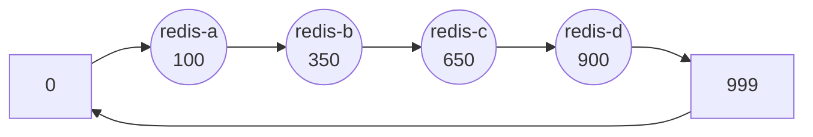

### Key Placement

Each key is also hashed to the same space:

```text
position = hash(cache_key)
```

Then the key walks clockwise until it finds the first server.

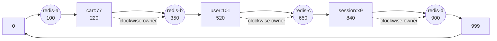

Ownership intervals:

| Server | Owns Keys In Range |
| :--- | :--- |
| `redis-a` | `(900, 100]` wrapping around through `0` |
| `redis-b` | `(100, 350]` |
| `redis-c` | `(350, 650]` |
| `redis-d` | `(650, 900]` |

The ring makes membership changes local. A new server only steals part of one neighbor's range.

---

## 5. Virtual Nodes

Plain consistent hashing has a problem: real servers may land unevenly on the ring.

### Without Virtual Nodes

Suppose 4 servers hash to these positions:

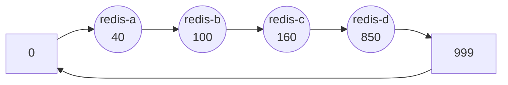

Ownership:

| Server | Range | Approx Share |
| :--- | :--- | ---: |
| `redis-a` | `(850, 40]` | 19% |
| `redis-b` | `(40, 100]` | 6% |
| `redis-c` | `(100, 160]` | 6% |
| `redis-d` | `(160, 850]` | 69% |

`redis-d` gets most of the traffic because it owns the largest arc.

### With Virtual Nodes

A **virtual node**, or vnode, is a point on the ring that maps back to a physical server.

Instead of hashing `redis-a` once, hash many labels:

```text
hash("redis-a#0")
hash("redis-a#1")
hash("redis-a#2")
...
```

Example mapping:

| Virtual Node | Physical Server |
| :--- | :--- |
| `a#0`, `a#1`, `a#2` | `redis-a` |
| `b#0`, `b#1`, `b#2` | `redis-b` |
| `c#0`, `c#1`, `c#2` | `redis-c` |
| `d#0`, `d#1`, `d#2` | `redis-d` |

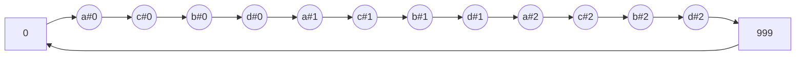

The physical server owns the union of all ranges owned by its vnodes:

| Physical Server | Owns Ranges Behind These Vnodes |
| :--- | :--- |
| `redis-a` | ranges ending at `a#0`, `a#1`, `a#2` |
| `redis-b` | ranges ending at `b#0`, `b#1`, `b#2` |
| `redis-c` | ranges ending at `c#0`, `c#1`, `c#2` |
| `redis-d` | ranges ending at `d#0`, `d#1`, `d#2` |

Virtual nodes improve balance because every physical server gets many small slices instead of one large slice. They also support heterogeneous hardware: a larger server can receive more vnodes than a smaller server.

---

## 6. Node Addition

Start with 4 physical Redis nodes:


Before adding a node:

| Key | Hash Position | Owner |
| :--- | ---: | :--- |
| `cart:77` | `220` | `redis-b` |
| `user:101` | `520` | `redis-c` |
| `feed:101` | `610` | `redis-c` |
| `session:x9` | `840` | `redis-d` |

Now add `redis-e` at position `550`:

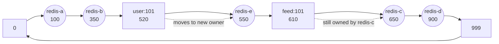

After adding the node:

| Key | Position | Old Owner | New Owner | Moved? |
| :--- | ---: | :--- | :--- | :---: |
| `cart:77` | `220` | `redis-b` | `redis-b` | No |
| `user:101` | `520` | `redis-c` | `redis-e` | Yes |
| `feed:101` | `610` | `redis-c` | `redis-c` | No |
| `session:x9` | `840` | `redis-d` | `redis-d` | No |

Only keys in the interval `(350, 550]` move from `redis-c` to `redis-e`. Keys outside that interval keep their owner.

With 5 equally balanced nodes, adding the new node should move about:

```text
1 / 5 = 20% of keys
```

That is the opposite of modulo hashing, where moving from 4 to 5 nodes moved about 80% of keys.

---

## 7. Node Failure

If a node dies, its keys move to the next clockwise node.

Before failure:

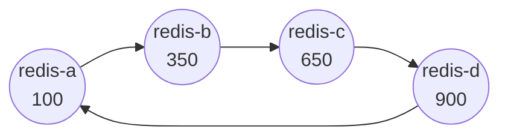

Ownership:

| Key | Position | Owner |
| :--- | ---: | :--- |
| `cart:77` | `220` | `redis-b` |
| `user:101` | `520` | `redis-c` |
| `feed:101` | `610` | `redis-c` |
| `session:x9` | `840` | `redis-d` |

Now `redis-c` fails:

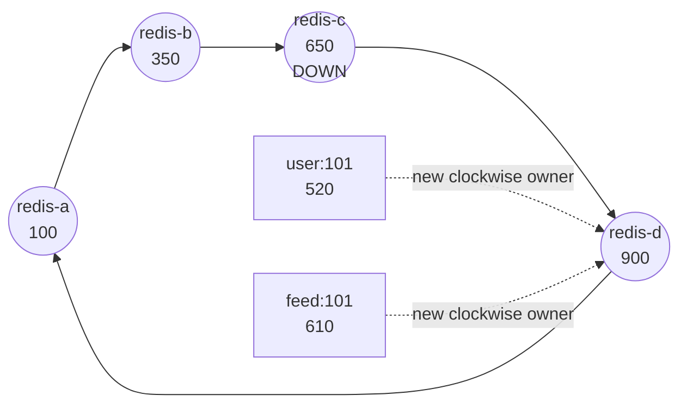

After failure:

| Key | Old Owner | New Owner | Moved? |
| :--- | :--- | :--- | :---: |
| `cart:77` | `redis-b` | `redis-b` | No |
| `user:101` | `redis-c` | `redis-d` | Yes |
| `feed:101` | `redis-c` | `redis-d` | Yes |
| `session:x9` | `redis-d` | `redis-d` | No |

Only the failed node's range moves. The rest of the ring is untouched.

---

## 8. Replication

Consistent hashing decides the **primary owner** of a key. Production storage systems usually also write replicas.

For replication factor `RF = 3`:

```text
primary replica   = first clockwise node
secondary replica = second clockwise node
tertiary replica  = third clockwise node
```

Example:

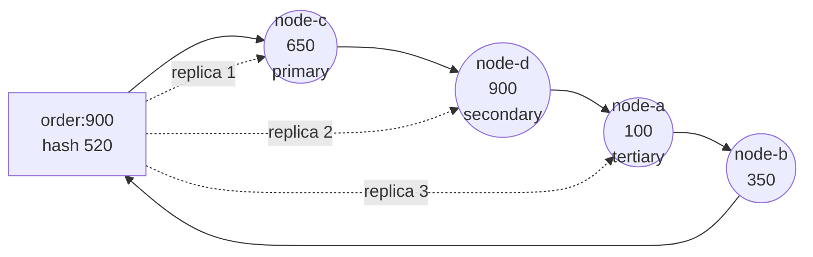

Systems inspired by Dynamo, including Cassandra and DynamoDB-style designs, use this idea with additional production rules:

| Concern | Production Behavior |
| :--- | :--- |
| Replication factor | Store each partition on `N` distinct nodes. |
| Availability zones | Avoid placing all replicas in the same rack or zone. |
| Reads and writes | Use quorum settings such as `R + W > N` when stronger consistency is needed. |
| Failures | Temporarily route around failed nodes using sloppy quorum and hinted handoff. |

Cassandra calls the hash-space intervals **token ranges**. Dynamo-style systems often call the selected replica set the **preference list**.

---

## 9. Sloppy Quorum

Sloppy quorum is a high-availability technique used when one of the normal replica nodes is down.

Production scenario:

| Setting | Value |
| :--- | :--- |
| Replication factor `N` | `3` |
| Write quorum `W` | `2` |
| Key | `order:900` |
| Normal replicas | `node-c`, `node-d`, `node-a` |
| Failure | `node-d` is unavailable |

Normal replica list:

```text
node-c -> node-d -> node-a
```

But `node-d` is down. Instead of failing the write, the coordinator writes to the next healthy node outside the normal replica set:

```text
node-c -> node-a -> node-b
```

Step-by-step:

1. Client sends `PUT order:900` to a coordinator.
2. Coordinator computes the normal replica set: `node-c`, `node-d`, `node-a`.
3. Coordinator detects that `node-d` is unreachable.
4. Coordinator writes to `node-c` and `node-a`.
5. Coordinator also writes a temporary copy to `node-b`.
6. Once two writes acknowledge, the coordinator returns success because `W = 2`.
7. `node-b` stores the write with metadata saying "this belongs to `node-d`."

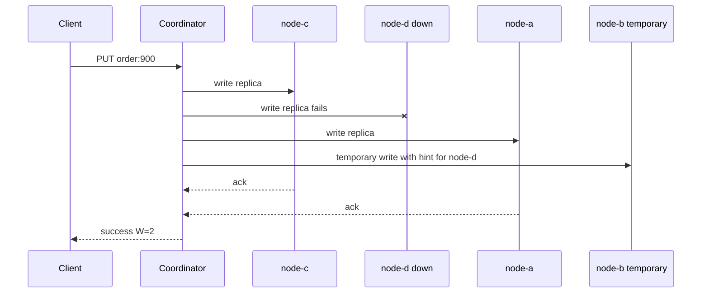

It is called "sloppy" because the write quorum is satisfied by healthy nodes, not necessarily by the exact nodes that would normally own the key.

---

## 10. Hinted Handoff

Hinted handoff completes the sloppy quorum story.

Scenario:

| Role | Node |
| :--- | :--- |
| Down node | `node-d` |
| Temporary owner | `node-b` |
| Key | `order:900` |

Complete flow:

1. `node-d` is down.
2. A write for `order:900` arrives.
3. `node-b` stores the write temporarily.
4. `node-b` records a hint: "replay this mutation to `node-d` later."
5. `node-d` recovers.
6. `node-b` detects recovery or is notified by membership gossip.
7. `node-b` replays the hinted write to `node-d`.
8. `node-d` acknowledges the replay.
9. `node-b` deletes the hint.

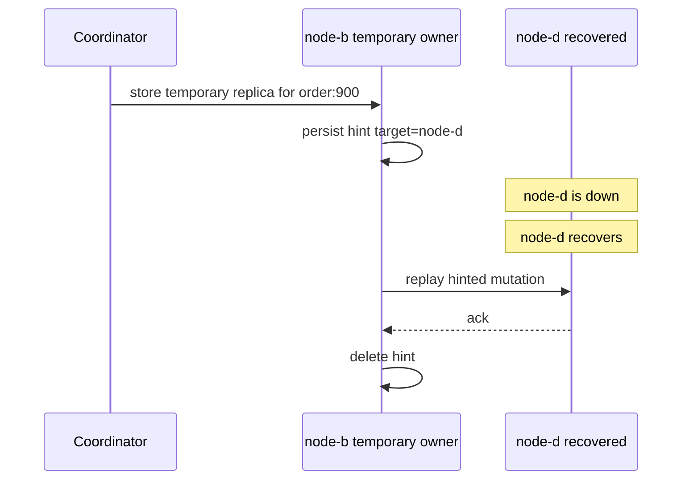

Hinted handoff improves availability, but it is not a replacement for repair. If a node is down for too long or hints expire, systems still need anti-entropy repair, read repair, or manual rebuild.

---

## 11. Production Systems

| System | How Consistent Hashing Applies |
| :--- | :--- |
| Cassandra | Uses token ranges over a partitioner hash space. Data is assigned to replica nodes based on token ownership, replication strategy, and topology rules such as racks and data centers. |
| DynamoDB | Inspired by Dynamo-style partitioning. AWS hides the ring, but the design lineage uses partition hashing, replication, quorum-style thinking, and automatic partition movement behind the service boundary. |
| Redis Cluster | Does **not** use a classic consistent hash ring. It uses `16,384` fixed hash slots. Each key maps to a slot, and slots are assigned to masters. Resharding moves slots, not arbitrary ring intervals. |
| Riak | Uses a Dynamo-style ring with partitions, preference lists, replication, sloppy quorum, and hinted handoff. |
| Kafka partitioning | Kafka does **not** use consistent hashing for broker ownership. Producers map records to partitions, commonly by hashing the message key modulo the partition count. Brokers host partition replicas assigned by cluster metadata. |

Kafka is often confused with consistent hashing because it hashes keys. The important difference is that Kafka's stable unit is the **partition**, not a moving hash-ring interval. Increasing topic partitions can change key-to-partition mapping for future writes, which is why partition count is a planning decision.

---

## 12. Decision Matrix

| Strategy | How It Works | Best For | Scaling Behavior | Main Risk |
| :--- | :--- | :--- | :--- | :--- |
| Modulo hashing | `hash(key) % N` chooses a node. | Small fixed clusters, toy routing, fixed bucket counts. | Adding/removing nodes remaps most keys. | Cache miss storms and mass data movement. |
| Consistent hashing | Keys and nodes are placed in a hash space; key goes to next clockwise node. | Distributed caches, Dynamo-style stores, shard routers, request routing. | Adding/removing one node moves only adjacent ranges. | Poor balance without enough virtual nodes. |
| Range partitioning | Split ordered key ranges such as `A-M`, `N-Z`, or timestamp ranges. | Range scans, ordered queries, time-series windows. | Can split hot ranges and move chunks. | Hot spots if traffic targets one range. |
| Directory-based sharding | Lookup service maps each key, tenant, or shard to a node. | Tenant-aware systems, custom placement, live migrations. | Very flexible; metadata drives routing. | Directory service becomes critical infrastructure. |

Architectural rule of thumb:

| Requirement | Prefer |
| :--- | :--- |
| Fixed bucket count | Modulo hashing |
| Low-disruption membership changes | Consistent hashing |
| Range queries | Range partitioning |
| Explicit tenant placement and migrations | Directory-based sharding |

---

## 13. Common Mistakes

| Mistake | Why It Hurts | Better Approach |
| :--- | :--- | :--- |
| Using too few virtual nodes | One physical node may own a huge part of the ring. | Use many vnodes per node and measure distribution. |
| Wrong replication factor | Too low loses availability; too high wastes capacity and write bandwidth. | Pick replication factor from durability, zone failure, and latency requirements. |
| Ignoring topology updates | Clients may route using stale ring metadata. | Version ring metadata and roll updates carefully. |
| Thinking Kafka uses consistent hashing | Kafka hashes keys to partitions, but broker placement is partition metadata, not a hash ring. | Explain Kafka as partitioned log routing. |
| Treating consistent hashing as load balancing | Hot keys can overload one owner even if the ring is balanced. | Add request coalescing, key salting, caching tiers, or special handling for hot keys. |
| Placing replicas on adjacent physical failures | Clockwise replicas may land in the same rack or zone without topology awareness. | Use rack-aware or zone-aware replica selection. |
| Rebuilding all data after a node change | That defeats the purpose of the algorithm. | Move only affected token ranges or vnode ranges. |

---

## 14. Top Interview Questions

### 1. Why was consistent hashing invented?

It was invented to avoid massive key movement when distributed systems change size. With `hash(key) % N`, changing `N` changes the route for most keys. In caches, that creates miss storms. In storage systems, it creates huge data migration. Consistent hashing keeps ownership local, so adding or removing one node only affects nearby ranges.

### 2. Why does modulo hashing move almost every key?

Because the remainder calculation changes for every key when the divisor changes. A key that mapped to `hash % 10 = 4` has no reason to map to the same physical node after the formula becomes `hash % 11`. For uniform hashes, only about `1 / new_node_count` keys keep the same slot during an add operation.

### 3. How does a hash ring assign a key?

Hash the key into the same numeric space as the nodes. Starting at the key's position, walk clockwise until the first node is found. That node is the primary owner. For replication, keep walking clockwise to choose additional distinct replica nodes.

### 4. What are virtual nodes?

Virtual nodes are multiple ring positions assigned to the same physical server. They smooth out uneven distribution because each machine owns many small ranges instead of one large range. They also let larger machines take more traffic by assigning them more vnodes.

### 5. What exactly moves when a node is added?

Only keys in the interval between the new node's predecessor and the new node move. Those keys used to belong to the new node's clockwise successor. All other keys keep the same owner.

### 6. What happens when a node fails?

The failed node's ranges move to the next clockwise healthy node or to the next eligible replica. If replication is enabled, reads and writes can continue against surviving replicas. The system may later repair or rebalance the failed ranges when the node returns.

### 7. How do replication and consistent hashing work together?

Consistent hashing picks an ordered list of candidate owners. The first node is the primary; the next distinct nodes are replicas. Production systems add topology rules so replicas do not all land in the same rack, availability zone, or failure domain.

### 8. What is sloppy quorum?

Sloppy quorum allows a write to succeed on healthy substitute nodes when one of the normal replica nodes is unavailable. The system meets the requested acknowledgment count, but not necessarily from the ideal replica set. It favors availability during failures.

### 9. What is hinted handoff?

Hinted handoff is the repair path after sloppy quorum. A temporary node stores a write on behalf of a down node, records a hint, and replays the mutation when the original node recovers. After successful replay, the hint is deleted.

### 10. Does Redis Cluster use consistent hashing?

Redis Cluster does not use a classic consistent hash ring. It uses fixed hash slots: each key maps to one of `16,384` slots, and each slot is assigned to a master. Resharding moves slots between masters.

### 11. Does Kafka use consistent hashing?

No. Kafka routes records to partitions, often by hashing the message key modulo the number of partitions. Broker ownership comes from partition assignment metadata. Kafka's unit of movement is a partition replica, not a consistent-hash ring range.

### 12. When should you choose range partitioning instead?

Choose range partitioning when range scans or ordered access are first-class requirements, such as querying events by time window or IDs by sorted order. Consistent hashing is great for point lookups and balanced distribution, but it destroys natural ordering.
