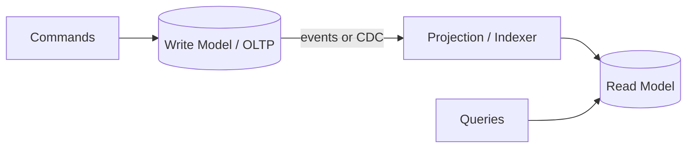

## Overview

**CQRS (Command Query Responsibility Segregation)** splits **writes** (commands) from **reads** (queries) into separate models, stores, or scaling paths. Writes optimize for consistency and business rules; reads optimize for latency, denormalization, and fan-out.

CQRS is often paired with event sourcing but does not require it. This page is the System Design **overview** — implementation patterns live in Microservices.

---

## Why It Matters

| Symptom | CQRS helps when |
| :--- | :--- |
| Read queries slow down write path | Reads hit replicas, search index, or cache |
| 100:1 read:write ratio | Independent read scaling |
| Complex reporting on OLTP schema | Separate read model / warehouse |
| Write spikes (telemetry) pollute search | Kafka buffer + dual engines |

**Cost:** eventual consistency on reads, sync complexity, more moving parts — do not apply by default.

---

## Core Concepts

### Command vs query

| Side | Responsibility | Typical store |
| :--- | :--- | :--- |
| **Command** | Mutate state, enforce invariants | OLTP database (PostgreSQL) |
| **Query** | Serve reads, no side effects | Replica, Elasticsearch, Redis, warehouse |

### When to use

| Good fit | Poor fit |
| :--- | :--- |
| Asymmetric read/write load | Simple CRUD, small team |
| Search + transactional core | Strong read-your-writes everywhere without design |
| Analytics off checkout DB | Single unified model is sufficient |

### Consistency

Reads may lag writes (replication lag, index refresh). Mitigate with:
- Read-your-writes pinning after mutation
- Version tokens on API responses
- User-facing delay tolerance (feeds vs ledger)

Link: [Consistency Models](/system-design/consistency-models/) · [Replication Lag](/system-design/replication-lag-read-replica-topology/)

### Applied in case studies

| Case study | CQRS application |
| :--- | :--- |
| [Proximity Search](/system-design/proximity-search/) | Telemetry write path vs geospatial read path |
| [Hotel Booking](/system-design/hotel-booking/) | PostgreSQL writes + Elasticsearch search |
| [Payment Gateway](/system-design/payment-gateway-orchestration/) | OLTP + read replicas / ClickHouse analytics |
| [E-Commerce](/system-design/ecommerce/) | OLTP checkout vs data lake reporting |

---

## Architect Perspective

### Interview answer

1. **Define CQRS** — separate read and write models
2. **State why** — different scale or shape of reads vs writes
3. **Name consistency cost** — eventual read freshness
4. **Draw two paths** — command to OLTP, query to index/replica
5. **When not to** — simple app, team cannot operate dual pipelines

---

## Common Mistakes

| Mistake | Reality |
| :--- | :--- |
| CQRS on day one | Start with single DB; split when metrics prove need |
| Ignoring projection lag | UX must tolerate or pin reads |
| Confusing with microservices | CQRS is data/path pattern, not deploy topology |
| Every read is a new model | One optimized read store is enough |

---

## Interview Questions

1. **What is CQRS and when would you use it?**
2. **How does CQRS differ from database read replicas?**
3. **What consistency trade-offs does CQRS introduce?**
4. **Would you use CQRS for a bank ledger? Why or why not?**
5. **How does proximity search apply CQRS?**

---

## Related Topics

- [Transactional Outbox Overview](/system-design/transactional-outbox-overview/) — reliable write-side events
- [CDC-Based Cache Invalidation](/system-design/cdc-based-cache-invalidation/) — read model refresh
- [Database Sharding](/system-design/database-sharding-provisioning-and-chunk-routing/)
- [CAP & PACELC](/system-design/cap-and-pacelc/)

---

## Deep Dive References

| Topic | Location |
| :--- | :--- |
| CQRS & event sourcing (PRIMARY) | [Microservices — CQRS & Event Sourcing](/microservices/03-data-management/cqrs-and-event-sourcing/) |
| Pattern selection ADR | [Technology Playbook — CQRS Pattern](/technology-playbook/cqrs-pattern/) |
