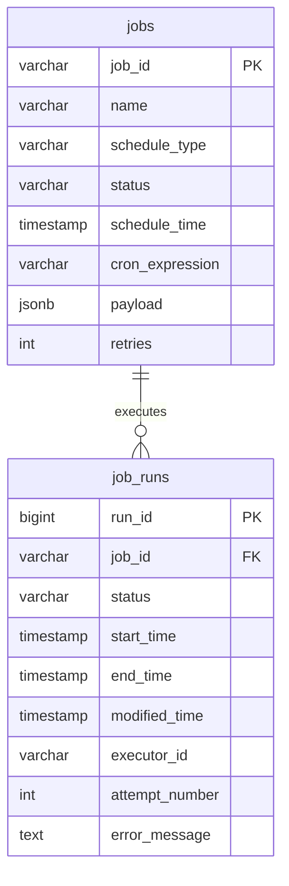
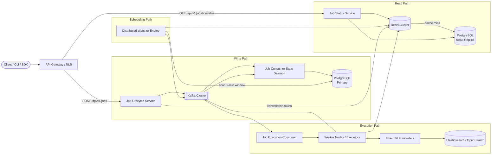
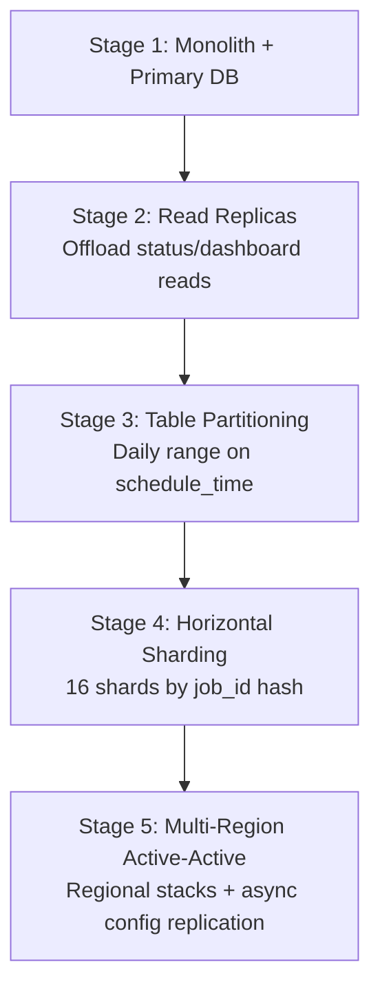

A distributed job scheduler orchestrates fine-grained, repetitive workloads — immediate triggers, future timestamps, and Cron expressions — across thousands of stateless executors. At production scale it is a **write-bursty, latency-sensitive control plane**: job creation must survive massive spikes without dropping events, while execution pickup must stay within a 2-second budget and guarantee at-least-once delivery.

This post captures the full design — from requirements and capacity math through API contracts, data modeling, the Watcher concurrency engine, caching, Kubernetes sizing, and failure runbooks.

---

## 1. Requirements and Goals

### Functional Requirements

| Requirement | Description |
| :--- | :--- |
| **Job creation & scheduling** | Create and schedule fine-grained, repetitive jobs. Support immediate triggers, future timestamps, and Cron expressions (second minute hour day month). |
| **Execution monitoring** | Real-time observability dashboard for execution logs, metadata, error traces, lifecycle state changes, and completion progress. |
| **Lifecycle interventions** | Ad-hoc operational controls: update schedules, hard-cancel running tasks, and "Run Now" manual overrides. |

### Job Payload Shape

Each job contains execution metadata, config parameters, and a pointer to an endpoint hook, Docker image tag, or lightweight Python/Shell executable.

| Execution profile | Share | Duration |
| :--- | :--- | :--- |
| Short-lived tasks | 80% | < 30 seconds |
| Long-running batch ingestion | 20% | Up to 1 hour |

**Out of scope:** Complex DAG dependency parsing — tasks are flat and independent, or orchestrated externally.

### Non-Functional Requirements

| NFR | Target |
| :--- | :--- |
| **Availability** | ≥ 99.99% for API job creation and status reads |
| **Durability** | Strict at-least-once execution; jobs never vanish on process failure |
| **Scheduling latency** | ≤ 2 seconds from designated epoch time to execution pickup |
| **Isolation** | Fault isolation across jobs — one misbehaved script cannot consume global compute |
| **Peak concurrency** | 10,000 active jobs scheduled/executing per second at peak |
| **Read / Write ratio** | **5 : 1** (heavy dashboard polling and health checks) |
| **Retry policy** | Configurable max retries; application layer handles idempotency via context IDs |

---

## 2. Back-of-the-Envelope Calculations

### Traffic Estimates

| Metric | Calculation | Result |
| :--- | :--- | :--- |
| Average execution RPS | Given | **~4,000 jobs/sec** |
| Jobs per day | 4,000 × 86,400 | **~345.6 million / day** |
| Peak schedule throughput | Given | **10,000 jobs/sec** |
| Read RPS (5:1 ratio) | 4,000 × 5 | **~20,000 req/sec** |
| Reads per day | 20,000 × 86,400 | **~1.73 billion / day** |
| DAU (developers + bots) | Given | **100,000** |

### Storage

| Dataset | Assumption | Daily | Yearly |
| :--- | :--- | :--- | :--- |
| Job metadata (`jobs`) | 1 KB / record | **345.6 GB** | **~126 TB** |
| Execution history (`job_runs`) | 500 B / record | **172.8 GB** | **~63 TB** |

### Bandwidth

| Path | Calculation | Peak |
| :--- | :--- | :--- |
| Write | 10,000 RPS × 1 KB | **10 MB/s (~80 Mbps)** |
| Read | 20,000 RPS × 1.5 KB | **30 MB/s (~240 Mbps)** |

### Kafka Event Volume

| Stream | Rate | Notes |
| :--- | :--- | :--- |
| Job creation ingress | 10,000 events/sec | Peak write path |
| Control-plane state changes | 40,000 events/sec | ~4 state updates per execution lifecycle |

### Redis Memory (Active Window)

Tracking cancellation states over a rolling 1-hour window:

```
10,000 jobs/sec × 3,600 sec = 36M concurrent entries
36M × 128 B (compact key:value) ≈ 4.6 GB
```

---

## 3. API Design

| # | Method | Path | Purpose |
| :---: | :--- | :--- | :--- |
| 1 | POST | `/api/v1/jobs` | Create or Schedule Job |
| 2 | GET | `/api/v1/jobs/{job_id}/status` | Job Status |
| 3 | POST | `/api/v1/jobs/{job_id}/cancel` | Cancel Job |


Requires `X-Idempotency-Key` header (UUID). Enforced at the API gateway via atomic Redis `SETNX` with 15-minute TTL.


```json
{
  "name": "data_warehouse_nightly_aggregation",
  "schedule_type": "CRON",
  "cron_expression": "0 30 5 * * *",
  "schedule_time": null,
  "max_retries": 3,
  "payload": {
    "target_s3_bucket": "s3://analytics-dw/aggregates/",
    "compute_cluster_flavor": "emr-m5.xlarge"
  }
}
```



```json
{
  "job_id": "job_7f168012-bc78-4ea1-bd34-f390823da56b",
  "status": "SCHEDULED",
  "created_at": "2026-06-26T15:39:00Z"
}
```

| `schedule_type` | Behavior |
| :--- | :--- |
| `IMMEDIATE` | Enqueue for immediate execution |
| `FUTURE` | Run at `schedule_time` |
| `CRON` | Recurring via `cron_expression` |



{{< api-endpoint method="GET" path="/api/v1/jobs/{job_id}/status" desc="Job Status" >}}

```json
{
  "job_id": "job_7f168012-bc78-4ea1-bd34-f390823da56b",
  "status": "RUNNING",
  "current_attempt": 2,
  "last_heartbeat": "2026-06-26T15:39:10Z",
  "executions": [
    {
      "run_id": 109482,
      "status": "FAILED",
      "error_message": "Timeout communicating with compute cluster upstream endpoint",
      "start_time": "2026-06-26T15:30:00Z",
      "end_time": "2026-06-26T15:31:15Z"
    },
    {
      "run_id": 109541,
      "status": "RUNNING",
      "error_message": null,
      "start_time": "2026-06-26T15:35:00Z",
      "end_time": null
    }
  ]
}
```



{{< api-endpoint method="POST" path="/api/v1/jobs/{job_id}/cancel" desc="Cancel Job" >}}

```json
{
  "job_id": "job_7f168012-bc78-4ea1-bd34-f390823da56b",
  "status": "CANCELLATION_PENDING"
}
```



**Common HTTP error codes**

{}
| Code | Condition |
| :--- | :--- |
| `400 Bad Request` | Invalid Cron expression or parsing errors |
| `409 Conflict` | Duplicate idempotency key while first request is processing |
| `429 Too Many Requests` | Per-token rate limit exceeded (100 req/sec) |
{}
---

## 4. Data Model



### `jobs`

```sql
CREATE TABLE jobs (
    job_id VARCHAR(64) PRIMARY KEY,
    name VARCHAR(255) NOT NULL,
    schedule_type VARCHAR(32) NOT NULL,
    status VARCHAR(32) NOT NULL DEFAULT 'SCHEDULED',
    schedule_time TIMESTAMP WITH TIME ZONE NULL,
    cron_expression VARCHAR(64) NULL,
    payload JSONB NOT NULL,
    retries INT NOT NULL DEFAULT 3,
    CONSTRAINT chk_schedule_type CHECK (schedule_type IN ('IMMEDIATE', 'FUTURE', 'CRON')),
    CONSTRAINT chk_status CHECK (status IN ('SCHEDULED', 'PAUSED', 'COMPLETED', 'CANCELLED'))
);

CREATE INDEX idx_jobs_schedule_time ON jobs(schedule_time) WHERE status = 'SCHEDULED';
```

| Column | Purpose |
| :--- | :--- |
| `schedule_type` / `cron_expression` | Drives Watcher scheduling logic |
| `payload` | JSONB runtime config (cluster definitions, env params) |
| `retries` | Bounded recovery cap |

### `job_runs`

```sql
CREATE TABLE job_runs (
    run_id BIGSERIAL PRIMARY KEY,
    job_id VARCHAR(64) REFERENCES jobs(job_id) ON DELETE CASCADE,
    status VARCHAR(32) NOT NULL,
    start_time TIMESTAMP WITH TIME ZONE NULL,
    end_time TIMESTAMP WITH TIME ZONE NULL,
    modified_time TIMESTAMP WITH TIME ZONE NOT NULL DEFAULT NOW(),
    executor_id VARCHAR(64) NULL,
    attempt_number INT NOT NULL DEFAULT 1,
    error_message TEXT NULL,
    CONSTRAINT chk_run_status CHECK (status IN ('QUEUED', 'RUNNING', 'SUCCESS', 'FAILED', 'CANCELLED'))
);

CREATE INDEX idx_job_runs_zombie_hunting ON job_runs(status, modified_time);
```

| Column | Purpose |
| :--- | :--- |
| `executor_id` | Worker node that acquired the runtime lock |
| `modified_time` | Zombie detection — stale heartbeat triggers retry |

**Normalization strategy:** Operational hot-path updates stay on `job_runs`; historical analytics reads avoid write amplification on the `jobs` master row.

---

## 5. High-Level Architecture



### Write Path — Job Lifecycle Service

1. Client sends `POST /api/v1/jobs` through the API gateway (idempotency check via Redis `SETNX`).
2. **Job Lifecycle Service** validates the payload and produces a creation event to **Kafka** — no synchronous database write on the hot path.
3. **Job Consumer State Daemon** consumes events and persists metadata to the **PostgreSQL primary** in optimized batches.

### Read Path — Job Status Service

1. Client sends `GET /api/v1/jobs/{job_id}/status`.
2. **Job Status Service** checks **Redis** (cache-aside).
3. On cache miss, queries a **PostgreSQL read replica** and populates Redis.
4. If replica lag exceeds 5 seconds, temporarily route reads to the primary.

### Scheduling Path — Distributed Watcher

1. Watcher acquires a distributed lease in Redis (`SET distributed_watcher_lock NX PX 15000`).
2. Scans a **5-minute sliding window** of due jobs from the primary every 20 seconds.
3. Registers checkpoint timestamp in Redis for failover continuity.
4. Pushes execution envelopes to **Kafka** (and high-priority topic for "Run Now" overrides).

### Execution Path — Workers

1. **Job Execution Consumer** pulls from Kafka and forks runtime on **Worker Nodes**.
2. Workers poll Redis every 10 seconds for cancellation tokens.
3. Heartbeats stream to Kafka → State Daemon updates `job_runs`.
4. Structured logs flow through **FluentBit** → **Elasticsearch**.

---

## 6. Concurrency Engine & Scheduling Algorithm

### Watcher Sliding Window

Scanning for the exact next second creates a high-frequency polling loop that overwhelms PostgreSQL at 10K RPS. A **5-minute sliding window** pre-fetches workloads in bulk using indexed range queries, absorbing traffic spikes.

On Watcher failure, a backup instance reads the last checkpoint from Redis and resumes without duplicating jobs.

### Distributed Lock Guard

```text
SET distributed_watcher_lock {node_identity_hash} NX PX 15000
```

Only one Watcher scans at a time. If the lease holder dies, another node acquires the lock after TTL expiry.

### Duplicate Cron Prevention

Enforce a unique composite constraint on `(job_id, schedule_time)` in `job_runs`. During network partitions, only one node commits the `QUEUED → RUNNING` transition.

### Worker Thread Pool Isolation




```java
BlockingQueue<Runnable> queue = new LinkedBlockingQueue<>(500);
ThreadPoolExecutor executor = new ThreadPoolExecutor(
    50, 200, 60L, TimeUnit.SECONDS, queue, new ThreadPoolExecutor.AbortPolicy()
);
```




```go
// TODO: idiomatic Go equivalent — mirror the Java snippet above
```




Bounded queue + `AbortPolicy` prevents memory exhaustion from a single misbehaved job.

### State Transition Transactions

```sql
BEGIN;
UPDATE job_runs SET status = 'RUNNING', start_time = NOW()
  WHERE run_id = 109541 AND status = 'QUEUED';
COMMIT;
```

Use **Serializable** isolation to prevent write skew on concurrent state transitions.

### Task Routing by Duration Profile

| Profile | Queue | Worker pool |
| :--- | :--- | :--- |
| Short (< 30s) | `job-execution-fast` topic | High-concurrency pool (50–200 threads) |
| Long (up to 1h) | `job-execution-batch` topic | Dedicated batch pool with cgroup limits |

### Real-Time Prioritization

**Redis Sorted Sets** with execution timestamps as scores enable "Run Now" tasks to jump ahead of pre-fetched jobs — avoiding Kafka head-of-line blocking.

---

## 7. Database Selection and Scaling

### Technology Comparison

| Store | Why choose | Why not |
| :--- | :--- | :--- |
| **PostgreSQL** | ACID state transitions, composite indexes, time-window queries, structured locking | Single-node write ceiling |
| **MongoDB** | Flexible documents | Weak multi-field Cron queries across schedule fields |
| **Cassandra** | High append throughput | Poor aggregate time-window query efficiency |

### Messaging & Cache

| Component | Choice | Rationale |
| :--- | :--- | :--- |
| **Kafka** (vs RabbitMQ) | Selected | 40K+ events/sec, partition scaling, replay on consumer failure |
| **Redis** (vs Memcached) | Selected | TTL, sorted sets, atomic `SETNX` for locks and cancellations |

### Scaling Stages



| Trigger | Action |
| :--- | :--- |
| Dashboard reads degrade primary writes | Deploy 3 read replicas; route GET traffic to replicas |
| Table exceeds 50M rows; lookups > 10ms | Range-partition `jobs` by `schedule_time` (daily); archive cold partitions |
| Write throughput saturates primary CPU | Shard across 16 nodes by `job_id` hash |
| Regional outage requirement | Independent stacks per region (e.g., us-east-1, eu-west-1) |

### High Availability

| Component | Configuration | RPO | RTO |
| :--- | :--- | :--- | :--- |
| PostgreSQL | Multi-AZ synchronous replication + automatic failover | < 2s | < 30s |
| Kafka | `replication.factor=3`, `min.insync.replicas=2`, `acks=all` | < 2s | < 30s |
| Full disaster recovery | Infrastructure-as-code automation | — | < 5 min |

---

## 8. Caching Strategy

**Pattern:** Cache-aside for dashboard status reads.

### Cancellation Flow

1. `POST /cancel` writes `job_id` to Redis with 30-minute TTL.
2. Active executors poll every 10 seconds.
3. On match, worker intercepts the thread and stops the process.
4. After 30-second grace period, supervisor issues `SIGKILL` on the container.

### Eviction & Invalidation

| Policy | Setting |
| :--- | :--- |
| Eviction | `volatile-lru` (LRU among TTL keys) |
| On successful execution | Explicit `DEL` on cache-aside keys |
| On job mutation | Invalidation event deletes corresponding Redis keys |

### Sizing

| Dataset | Size |
| :--- | :--- |
| Active cancellation window (1 hour) | **~4.6 GB** |
| Idempotency keys (15-min TTL at peak) | **~150 MB** |
| Watcher checkpoint + distributed locks | **< 10 MB** |

---

## 9. Capacity Planning

Target: peak **10,000 schedule RPS** with N+2 multi-AZ redundancy.

| Component | Pods | CPU / Pod | Memory / Pod | Total Footprint |
| :--- | :--- | :--- | :--- | :--- |
| **Job Lifecycle API** | 30 | 2 vCPU | 4 GB | 60 cores / 120 GB |
| **Distributed Watcher** | 3 (active-active) | 4 vCPU | 8 GB | 12 cores / 24 GB |
| **Job Consumer Engine** | 50 (max 120 via HPA) | 2 vCPU | 4 GB | 100 cores / 200 GB |
| **Execution Workers** | 250 | 4 vCPU | 16 GB | 1,000 cores / 4 TB |

### Autoscaling (HPA)

| Target | Metric | Threshold |
| :--- | :--- | :--- |
| API Gateway | Average CPU | > 75% |
| Job Consumer pods | Kafka consumer lag | > 5,000 unread messages |

### Supporting Infrastructure

| Component | Sizing |
| :--- | :--- |
| Kafka brokers | 6+ nodes, 40K events/sec sustained |
| PostgreSQL | Primary + 3 read replicas, pgBouncer connection pooling |
| Redis cluster | 3 masters + 3 replicas, ~8 GB working set |
| Network peak | ~320 Mbps aggregate (write + read) |

Load tests via Locust simulate **1.5× projected peak** to validate headroom.

---

## 10. Key Design Decisions Summary

| Decision | Choice | Rationale |
| :--- | :--- | :--- |
| Write path decoupling | Kafka before PostgreSQL | 10K RPS direct DB writes would saturate connection pools |
| Separate read service | Job Status Service on replicas | Protects scheduling hot path from dashboard polling |
| Watcher window | 5-minute sliding scan | Bulk indexed fetch vs per-second polling |
| Execution ordering | Redis Sorted Sets + priority Kafka topic | "Run Now" bypasses head-of-line blocking |
| Cancellation signals | Redis polling (10s) | Avoids DB read amplification from workers |
| Execution guarantee | At-least-once + idempotency keys | Retry on worker crash; app handles duplicates |
| State isolation | Serializable transactions on `job_runs` | Prevents duplicate Cron execution under partition |
| Log pipeline | FluentBit → Elasticsearch | Async structured logs off execution hot path |
| Secrets | HashiCorp Vault + envelope encryption (KMS) | Decrypt payloads in-memory on authorized workers only |
| Auth | OAuth2 JWT + namespace RBAC | Platform-Operator can cancel; Developer is read-only |
| Observability | Prometheus SLIs + W3C trace_id propagation | 99% pickup latency ≤ 2s; end-to-end Jaeger traces |
| Retry exhaustion | Dead Letter Queue + PagerDuty alert | Halts infinite retry loops |

### Core SLIs / SLOs

| SLI | Target |
| :--- | :--- |
| API availability | ≥ 99.995% successful HTTP responses |
| Pickup latency (p99) | ≤ 2.0 seconds from scheduled epoch |
| Data durability | Zero dropped execution records (monthly audit) |

---

## 11. Failure Modes and Mitigations

| Failure | Impact | Mitigation |
| :--- | :--- | :--- |
| **Redis cluster down** | Loss of cancellations and distributed locks | Fallback to PostgreSQL advisory locks; throttle dashboard reads |
| **Kafka broker crash** | Inflight notifications stall | API gateway buffers to local disk; replay on recovery; RF=3 with ISR=2 |
| **Primary PostgreSQL fails** | Writes and state changes stall | Pause Watcher; promote replica (< 30s); resume from checkpoint |
| **Worker process crash** | Task terminates mid-execution | Zombie hunter: `modified_time` stale > 15s → retry with incremented attempt |
| **Worker ignores cancellation** | Runaway process | 30s grace → supervisor `SIGKILL` on container |
| **Replica lag > 5s** | Stale status reads | Route reads to primary until replicas catch up |
| **Kafka consumer corruption** | Pipeline blockage risk | Route to Dead Letter Topic; continue processing remaining messages |
| **Massive same-second spike** | Execution backlog | Kafka buffers; Watcher pulls indexed batches; workers drain at max capacity |
| **Region catastrophic failure** | Total regional outage | Global traffic manager reroutes to alternate active region |
| **Retry budget exhausted** | Job permanently failing | Move to DLQ; preserve state for debugging; alert on-call |

### Production Optimizations Over Naive Designs

| Naive approach | Production fix |
| :--- | :--- |
| Lifecycle service writes directly to DB per request | Kafka event buffer + async batch consumers |
| Sequential Kafka queues only | Redis Sorted Sets for real-time re-ordering + priority topics |
| Workers poll DB for cancellation | Redis cache-aside with 10s poll interval |
| Abstract boxes without resource limits | Kubernetes pod sizing, HPA, cgroup limits, preStop graceful drain |

---

## What's Next

See the companion [50 interview questions and answers](/system-design/distributed-job-scheduler-interview-questions/) for deep-dive probes on Watcher failover, Cron deduplication, fair-share scheduling, and chaos-engineering validation.
