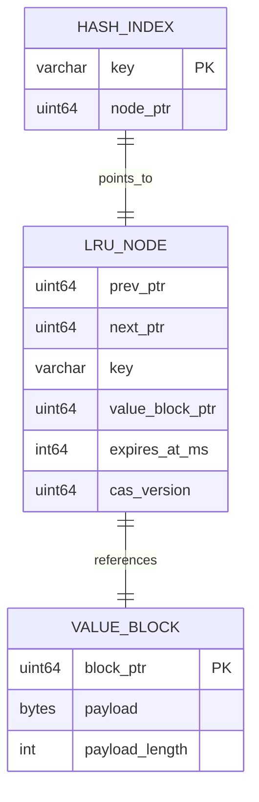
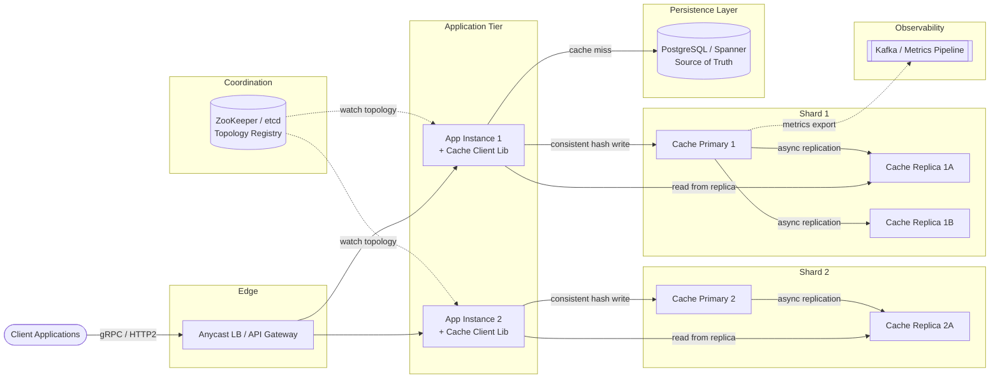
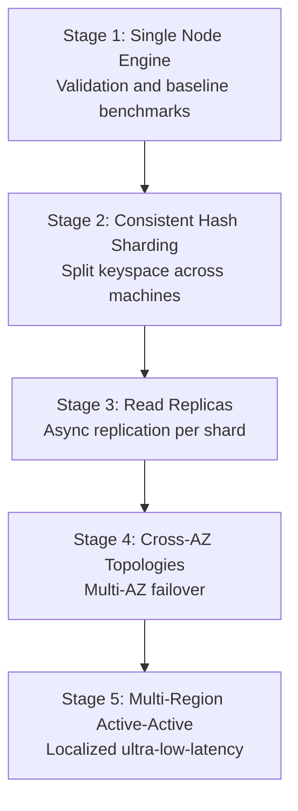

A distributed key-value cache sits between application services and persistent storage, absorbing read pressure with **ultra-low-latency, in-memory lookups**. This design targets a Memcached-style engine: opaque byte payloads, per-key TTL, LRU eviction under memory pressure, and **no disk persistence** — availability comes from clustering and replication, not cold storage.

At scale the workload is **read-intensive (10:1)**: 100M DAU generating ~1 trillion operations per day, with a peak of **~23M RPS** and a p99 latency budget under **2 ms** over the network. This post walks through requirements, capacity math, API contracts, in-memory data structures, consistent-hashing client routing, technology trade-offs, infrastructure sizing, security, observability, and failure recovery. For senior-level interview follow-ups, see [Distributed KV Store Interview Questions](/system-design/distributed-kv-store-interview-questions/).

---

## 1. Requirements and Goals

### Functional Requirements (MVP)

| Requirement | Description |
| :--- | :--- |
| **put(key, value, ttl)** | Associate an opaque byte payload with a unique key; support per-key TTL in seconds. |
| **get(key)** | Retrieve the stored value; return a miss if the key is absent or expired. |
| **delete(key)** | Explicitly invalidate and remove a key from the data layer. |
| **LRU eviction** | When memory limits are reached, evict least-recently-used entries automatically. |
| **Per-key expiration** | TTL configured at write time; expired keys self-clean on access or background sweep. |
| **Single-key CAS** | Optional Check-And-Set token on `put` to prevent lost updates under concurrent writers. |

### Clarifying Assumptions

| Question | Assumption |
| :--- | :--- |
| Structured values or opaque blobs? | **Opaque byte arrays** up to **1 MB**; serialization is the client's responsibility. |
| Disk-backed persistence? | **No** — ephemeral cache; HA via replication and clustering. |
| Multi-key transactions? | **Not supported**; single-key atomic `put`/`get`/`delete` and CAS only. |
| Strict cross-replica consistency? | **Eventual** by default; optional strict-consistency mode for sensitive workloads. |

### Non-Functional Requirements

| NFR | Target |
| :--- | :--- |
| **Scale** | **100M DAU**; **10,000 requests/user/day** → **~1T ops/day** |
| **Read / Write ratio** | **10 : 1** (read-heavy) |
| **Latency** | p99 read and write **< 2 ms** over network boundaries |
| **Availability** | **99.999%** uptime for cache queries; node failures must not cascade into DB meltdown |
| **Horizontal scalability** | Linear throughput growth across arbitrary shard boundaries |
| **Memory constraint** | All hot data in **RAM** only; no complex querying (no secondary indices, range scans, or multi-key transactions) |

---

## 2. Back-of-the-Envelope Calculations

### Traffic Estimates

Starting from **100M DAU**, **10,000 requests/user/day**, and a **10:1 read/write ratio**:

| Metric | Calculation | Result |
| :--- | :--- | :--- |
| Total ops / day | 100M × 10,000 | **1 trillion / day** |
| Average RPS | 1T ÷ 86,400 s | **~11.57M RPS** |
| Peak scaling factor | 2× average | — |
| Peak system RPS | 11.57M × 2 | **~23.15M RPS** |
| Peak write RPS | 23.15M × (1/11) | **~2.1M WPS** |
| Peak read RPS | 23.15M × (10/11) | **~21.0M RPS** |

### Storage (Inbound Volume)

| Assumption | Value |
| :--- | :--- |
| Average key size | 64 B (metadata allowance) |
| Average value size | 1,024 B (1 KB) |
| Total entry size (with overhead) | **~1,100 B** |
| New objects written / day | 1T ÷ 11 | **~90.9B items/day** |
| Gross inbound data / day | 90.9B × 1,100 B | **~100 TB / day** |

### Active Working Set (80/20 Pareto)

Storing 100 TB of new data daily without bounds violates hardware budgets. Applying the **80/20 rule** — 20% of keys generate 80% of traffic:

| Metric | Calculation | Result |
| :--- | :--- | :--- |
| Target active cache size | 100 TB × 0.20 | **~20 TB RAM** (cluster-wide) |

### Bandwidth

| Path | Calculation | Result |
| :--- | :--- | :--- |
| Peak network load | 23.15M RPS × 1,100 B | **~25.5 GB/s** |
| Bandwidth requirement | — | **~204 Gbps** |

---

## 3. API Design

| # | Method | Path | Purpose |
| :---: | :--- | :--- | :--- |
| 1 | PUT | `/api/v1/cache/{key}` | Save / Update Value |
| 2 | GET | `/api/v1/cache/{key}` | Retrieve Value |
| 3 | DELETE | `/api/v1/cache/{key}` | Delete Value |

The system exposes **gRPC over HTTP/2** for internal microservices and a **text/binary TCP fallback** for legacy clients. REST endpoints below serve gateway and debugging use cases.

{{< api-endpoint method="PUT" path="/api/v1/cache/{key}" desc="Save / Update Value" open="true" >}}
Headers:

| Header | Required | Notes |
| :--- | :--- | :--- |
| `Content-Type` | Yes | `application/octet-stream` |
| `X-Cache-TTL` | Yes | TTL in seconds (e.g. `3600`) |
| `X-CAS-Token` | No | Optimistic concurrency token from prior `get`/`put` |


Request body: raw binary payload (≤ 1 MB).


```json
{
  "status": "SUCCESS",
  "key": "user:session:98231",
  "cas_token": "48106"
}
```



{{< api-endpoint method="GET" path="/api/v1/cache/{key}" desc="Retrieve Value" >}}
| Condition | Response |
| :--- | :--- |
| Key exists and not expired | `200 OK`; body = raw bytes; header `X-CAS-Token: <token>` |
| Key absent or expired | `404 Not Found` |


{{< api-endpoint method="DELETE" path="/api/v1/cache/{key}" desc="Delete Value" >}}
| Condition | Response |
| :--- | :--- |
| Key removed (or already absent) | `204 No Content` |


### Idempotency

| Operation | Behavior |
| :--- | :--- |
| `GET`, `DELETE` | Structurally idempotent |
| `PUT` without CAS | Idempotent — safe to retry after network timeout |
| `PUT` with CAS | Not idempotent on conflict — client must re-read and retry |

**Common HTTP error codes**

{}
| Code | Condition |
| :--- | :--- |
| `400 Bad Request` | Payload > 1 MB or invalid key format |
| `404 Not Found` | Key missing or expired |
| `409 Conflict` | CAS token mismatch — another client updated the key |
| `429 Too Many Requests` | Rate-limit threshold exceeded |
{}
---

## 4. Data Model

The storage engine is **fully denormalized in RAM** — no relational normalization. Keys are duplicated in both the hash index and the LRU linked-list nodes to enable O(1) tail evictions without secondary lookups.



### Hash Index Entry

| Field | Type | Notes |
| :--- | :--- | :--- |
| `key` | `VARCHAR(250)` | Primary lookup key |
| `node_ptr` | `UINT64` | Direct pointer to the corresponding LRU node |

### LRU Doubly Linked List Node

| Field | Type | Notes |
| :--- | :--- | :--- |
| `prev_ptr` / `next_ptr` | `UINT64` | Memory pointers for list topology |
| `key` | `VARCHAR(250)` | Redundant copy — enables eviction without hash lookup |
| `value_block_ptr` | `UINT64` | Pointer to raw byte allocation block |
| `expires_at` | `INT64` | Unix epoch milliseconds; `0` = no expiration |
| `cas_version` | `UINT64` | Monotonic counter for optimistic concurrency |

### Value Block

| Field | Type | Notes |
| :--- | :--- | :--- |
| `payload` | `BYTES` | Opaque client data, ≤ 1 MB |
| `payload_length` | `INT` | Actual byte count |

---

## 5. High-Level Architecture



### Component Responsibilities

| Component | Role |
| :--- | :--- |
| **Cache Client Library** | Embedded in app microservices; computes consistent-hash routing locally; watches ZooKeeper for topology changes; routes directly to shards — no proxy hop. |
| **ZooKeeper / etcd** | Service discovery, heartbeat tracking, cluster membership broadcasts. |
| **Cache Primary Node** | Serves reads and writes from RAM; owns a shard's key range; streams replication logs to replicas. |
| **Cache Replica Nodes** | Read-only mirrors; scale read capacity; hot-standby for failover. |
| **Persistent DB** | Source of truth on cache miss (cache-aside pattern). |
| **Metrics Pipeline** | Offloads telemetry from the hot path via async export. |

### Read Path

1. Client library hashes the key → routes to the nearest replica (or primary on miss/recent write).
2. **Hit** → return value + CAS token; update LRU position.
3. **Miss** → application fetches from PostgreSQL/Spanner, populates the shard via `put`, returns to caller.

### Write Path (Cache-Aside Invalidation)

1. Application writes to the persistent database first.
2. Application **deletes** the cache key (invalidation) rather than write-through — avoids race conditions where a stale cache value could be served after a DB update.

---

## 6. Core Algorithms — Consistent Hashing & Lock-Striped LRU

### Client-Side Consistent Hashing

Keys are routed deterministically using **MurmurHash3** mapped onto a consistent hashing ring with **virtual nodes**:

```
shard_index = murmur3(key) mod num_virtual_nodes → physical_shard
```

Virtual nodes (typically 100–200 per physical machine) ensure even distribution and minimize key redistribution when nodes join or leave the ring.

### Single-Node LRU Engine — Lock Striping

To avoid global lock contention, the entry space is partitioned into **64 lock stripes** based on `key.hashCode() % 64`. Each stripe independently guards both hash-map mutations and linked-list topology updates.

```java
public class ConcurrentLruCacheContainer<K, V> {
    private final int capacity;
    private final ConcurrentHashMap<K, Node<K, V>> indexMap;
    private final DoublyLinkedList<K, V> evictionList;
    private final ReadWriteLock[] stripeLocks;
    private static final int STRIPE_COUNT = 64;

    public V get(K key) {
        Node<K, V> targetNode = indexMap.get(key);
        if (targetNode == null) return null;

        if (targetNode.isExpired(System.currentTimeMillis())) {
            invalidateExpiredNode(key, targetNode);
            return null;
        }

        int lockIndex = Math.abs(key.hashCode() % STRIPE_COUNT);
        stripeLocks[lockIndex].writeLock().lock();
        try {
            evictionList.moveToHead(targetNode);
        } finally {
            stripeLocks[lockIndex].writeLock().unlock();
        }
        return targetNode.value;
    }

    public void put(K key, V value, long ttlMs) {
        int lockIndex = Math.abs(key.hashCode() % STRIPE_COUNT);
        stripeLocks[lockIndex].writeLock().lock();
        try {
            long expiryTime = System.currentTimeMillis() + ttlMs;
            if (indexMap.containsKey(key)) {
                Node<K, V> existing = indexMap.get(key);
                existing.value = value;
                existing.expiresAt = expiryTime;
                existing.casVersion++;
                evictionList.moveToHead(existing);
            } else {
                if (indexMap.size() >= capacity) {
                    Node<K, V> tail = evictionList.removeTail();
                    if (tail != null) indexMap.remove(tail.key);
                }
                Node<K, V> newNode = new Node<>(key, value, expiryTime);
                evictionList.addToHead(newNode);
                indexMap.put(key, newNode);
            }
        } finally {
            stripeLocks[lockIndex].writeLock().unlock();
        }
    }
}
```

**Why lock striping over `ConcurrentHashMap` alone?** `ConcurrentHashMap` locks at the bucket level, but LRU requires updating the doubly linked list on every read. Striping groups both structures under the same stripe lock, reducing contention on hot keys while preserving correctness.

### Hot Key Mitigation — Key Diversification

A single hot key maps to one shard. The client library can append a randomized suffix index (e.g. `homepage:payload_sub_4`) and read from any replica of the diversified key set, spreading load across multiple virtual nodes.

### TTL Jitter (Cache Avalanche Prevention)

Uniform TTLs cause synchronized mass expiration. Apply randomized jitter:

```
TTL = BaseTTL + Random(0, JitterWindow)
```

This spreads expirations over time, preventing thundering herds on the persistent database.

---

## 7. Database Selection and Scaling

### Technology Comparison

| Dimension | Selected | Alternatives | Why / Trade-off |
| :--- | :--- | :--- | :--- |
| **Storage engine** | Custom in-memory volatile engine | PostgreSQL, Redis, Cassandra | Disk I/O and WAL overhead break the sub-2ms p99 budget at 23M+ RPS; a stripped-down multithreaded engine maximizes RAM efficiency. |
| **Coordination** | Apache ZooKeeper | etcd, Consul | Mature watch semantics and heartbeat handling for tens of thousands of client instances. |
| **Key routing** | MurmurHash3 + consistent hashing | Snowflake IDs, DB auto-increment | Routing must be deterministic from the key string — no external ID service dependency. |
| **Replication** | Async leader-follower | Sync quorum (Raft) | Async replication trades strict consistency for write throughput; replicas serve stale reads within replication lag. |
| **Fallback store** | PostgreSQL / Spanner | — | Source of truth on cache miss; not on the hot path. |

### Scaling Strategy



| Stage | Trigger | Design |
| :--- | :--- | :--- |
| **1 — Single node** | Initial validation | One monolithic RAM instance; SPOF; limited by single-machine bandwidth and RAM. |
| **2 — Sharding** | Single machine > 500 GB RAM | Consistent hashing ring with virtual nodes; ZooKeeper manages topology. |
| **3 — Read replicas** | Shard read RPS > ~1.5M | 1 primary + 2 replicas per shard; writes to primary, reads fan out to replicas. |
| **4 — Cross-AZ** | AZ failure tolerance required | Replicas spread across availability zones; automated leader election on primary loss. |
| **5 — Multi-region** | Intercontinental latency > 100 ms | Regional cache clusters; cross-region sync via message queues or global DB layer. |

---

## 8. Caching Strategy & Lifecycle

This system **is** the cache layer. The lifecycle patterns below govern how application services interact with it and the persistent database.

### Cache-Aside (Lazy Loading)

| Step | Action |
| :--- | :--- |
| Read | Check cache → on miss, read DB → `put` into cache → return |
| Write | Write DB → **delete** cache key (invalidation) |
| Delete | Delete DB record → **delete** cache key |

Invalidation-on-write (rather than write-through) prevents serving stale values when concurrent writers race.

### Eviction Policy

| Trigger | Behavior |
| :--- | :--- |
| Memory at capacity | LRU eviction from doubly linked list tail |
| Memory > 95% utilization | Aggressive proactive eviction before OOM |
| Per-key TTL expiry | Lazy delete on `get`; background sweeper for cold keys |

### Thundering Herd Mitigation

When a popular key expires, concurrent misses can overload the database. The client library acquires a **distributed mutex** (via the coordination service or a short-lived lock key) — only the first miss fetches from DB; others wait and retry the cache.

### Cache Stampede on Node Failure

When a primary shard dies, its key range redistributes to neighbors. **Two-way virtual node configuration** spreads the failed node's traffic evenly across multiple healthy shards instead of overloading a single neighbor.

---

## 9. Capacity Planning

### Cluster Memory Provisioning

| Assumption | Value |
| :--- | :--- |
| Total RAM target | **20 TB** |
| Instance type | AWS `r6i.4xlarge` (16 vCPU, 128 GB RAM, 12.5 Gbps network) |
| Base instances | 20,000 GB ÷ 128 GB = **157 nodes** |
| HA over-provisioning (1.3×) | 157 × 1.3 = **205 shard groups** |
| Topology per group | 1 primary + 2 replicas |
| **Total production instances** | 205 × 3 = **615 nodes** |

### Component Sizing Summary

| Component | Metric | Calculation / Assumption | Recommendation |
| :--- | :--- | :--- | :--- |
| **Cache shard primaries** | Write throughput | ~2.1M WPS ÷ 205 shards ≈ **~10.2K WPS/shard** | 205 primary nodes (`r6i.4xlarge`) |
| **Cache replicas** | Read throughput | ~21M RPS ÷ 410 replicas ≈ **~51K RPS/replica** | 410 replica nodes (2 per shard group) |
| **ZooKeeper ensemble** | Client watches | Tens of thousands of app instances | **5-node** ensemble (3 minimum for quorum + 2 observers) |
| **API Gateway** | Peak RPS | ~23.15M RPS (edge-terminated subset) | Anycast LB + rate limiter cluster |
| **PostgreSQL / Spanner** | Cache miss fallback | ~15% miss rate at steady state | Sized independently; not on hot path |
| **Network** | Peak bandwidth | ~25.5 GB/s aggregate | **~204 Gbps** cluster-wide |

### Autoscaling

| Signal | Threshold | Action |
| :--- | :--- | :--- |
| Network I/O saturation | > 70% for 60 s | Trigger shard split |
| Concurrent connections | Per-shard connection limit | Add replica nodes |
| Memory utilization | > 90% with active evictions | Alert; evaluate shard split or RAM upgrade |

Scale on **network I/O and connection metrics**, not CPU — cache nodes are memory- and network-bound.

---

## 10. Key Design Decisions Summary

| Decision | Choice | Rationale |
| :--- | :--- | :--- |
| Persistence model | RAM-only, no disk snapshots | Sub-2ms p99 at 23M+ RPS requires bypassing disk I/O entirely |
| Client routing | Embedded consistent-hash library | Eliminates proxy hop; deterministic shard selection |
| Replication | Async leader-follower | Maximizes write throughput; replicas scale reads |
| Consistency default | Eventual across replicas | Tunable strict mode available for sensitive keys |
| Concurrency control | CAS tokens on single-key `put` | Prevents lost updates without multi-key transactions |
| Eviction | Lock-striped LRU | O(1) eviction; 64 stripes reduce contention vs global lock |
| DB interaction | Cache-aside with invalidation | Safer than write-through under concurrent DB writers |
| Coordination | ZooKeeper topology watches | Real-time membership changes propagated to all clients |
| Hot key handling | Key diversification across virtual nodes | Spreads single-key fan-out across multiple shards |
| TTL strategy | Base TTL + random jitter | Prevents synchronized mass expiration (cache avalanche) |

### Security Architecture

| Control | Implementation |
| :--- | :--- |
| Network isolation | Cache shards in private VPC subnets; no public internet access |
| Authentication | **mTLS** (SPIFFE/SPIRE) between microservices and cache cluster |
| Authorization | ACLs restrict clients to specific key prefixes by service role |
| Rate limiting | Distributed token bucket at API gateway (429 on breach) |
| Transport | TLS termination at gateway; mTLS on internal paths |

### Observability

| SLI / Metric | Target / Purpose |
| :--- | :--- |
| Cache hit rate | ≥ **85%** globally |
| Command latency | p95/p99 tracking; target p99 **< 2 ms** |
| Memory saturation | Alert at **> 90%** without active evictions |
| Metrics export | Prometheus endpoints per shard → Grafana dashboards |
| Distributed tracing | W3C `traceparent` headers → OpenTelemetry collectors |

---

## 11. Failure Modes and Mitigations

| Failure | Impact | Mitigation |
| :--- | :--- | :--- |
| **Primary shard outage** | Immediate cache misses for key range; writes blocked | ZooKeeper detects heartbeat loss; replica leader election; clients receive updated topology |
| **Replica lag** | Stale reads from replica | Route recent writes to primary; tunable read-your-writes mode |
| **Network partition (AZ)** | Primary accepts writes; isolated replicas serve stale data | Prioritize availability; backlog replication logs; sync on heal |
| **Entire AZ blackout** | All nodes in AZ lost | Multi-AZ replicas in surviving zones; ZooKeeper updates membership; clients redirect immediately |
| **ZooKeeper ensemble down** | No topology updates; clients use cached ring | Pre-configured fallback ring snapshot; 3+ node quorum for writes |
| **Cache avalanche (mass TTL expiry)** | DB overload from synchronized misses | TTL jitter; distributed mutex on miss; proactive refresh of hot keys |
| **Hot key overload** | Single shard saturated | Key diversification; local request coalescing in client library |
| **Memory exhaustion** | Eviction storms; elevated latency | LRU tail eviction at 95%; alerts at 90%; shard split if sustained |
| **Node failure redistribution** | Neighbor shard overload | Two-way virtual nodes spread orphaned keyspace evenly |
| **mTLS certificate expiry** | Auth failures across cluster | SPIRE automatic rotation; alert 7 days before expiry |

---

## What's Next

Future posts in this series will cover adjacent designs — Redis Cluster vs custom engine benchmarking, kernel-level socket tuning for sub-millisecond cache nodes, memory defragmentation strategies, and cross-datacenter active-active replication with conflict resolution.
