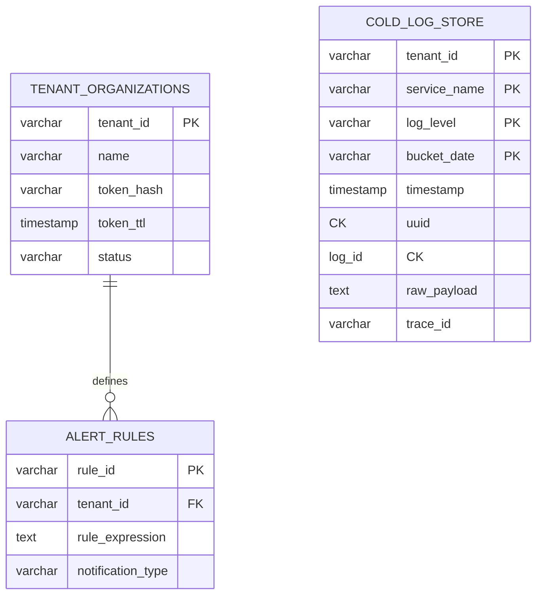
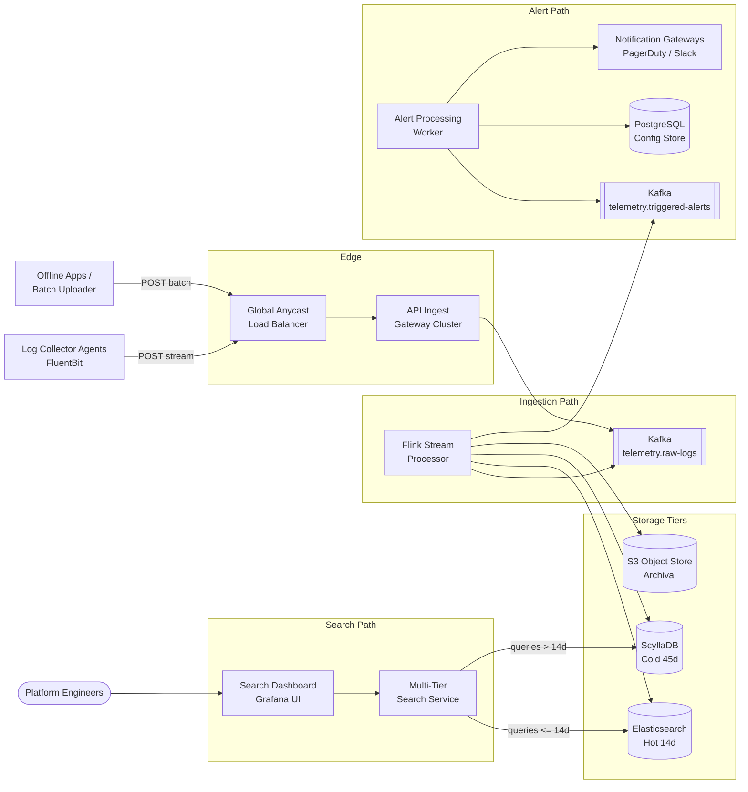
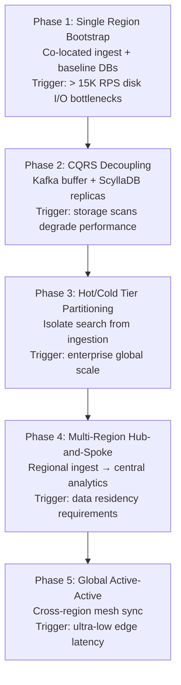

A distributed logging platform ingests telemetry from arbitrary sources — Kubernetes pods, bare-metal hosts, mobile clients, and serverless runtimes — normalizes heterogeneous formats, and makes logs searchable across hot, cold, and archival tiers. At production scale it is a **write-heavy, AP-biased system**: ingestion must never drop client data during partitions or indexing lag, while search paths stay decoupled from the continuous intake pipeline.

This post captures the full design — from requirements and capacity math through API contracts, data modeling, stream processing, multi-tier storage, caching, Kubernetes sizing, and failure runbooks.

---

## 1. Requirements and Goals

### Functional Requirements

| Requirement | Description |
| :--- | :--- |
| **Multi-source ingestion** | Ingest telemetry asynchronously from arbitrary platforms without prescribing uniform schemas up front. |
| **Real-time stream path** | Sub-second delivery of active stdout/stderr streams via host-level collector agents. |
| **Batch / offline sync** | Multi-part binary/text upload endpoints for offline devices or scheduled batch jobs to sync historical archives. |
| **Transformations & normalization** | Validate integrity, parse JSON/Log4j/CSV/raw text, enrich with runtime metadata (GeoIP, host specs), map to a standard schema. |
| **Query & visibility dashboard** | Single-pane search: raw string matches, boolean filters, structural index queries, and real-time live log tailing. |
| **Configurable alerting** | Real-time analysis of streaming lines against user-defined rules (e.g. ERRORS > 50 within 60s). |

### Clarifying Assumptions (Interview Context)

| Question | Decision |
| :--- | :--- |
| Schema validation at the edge? | **Buffer immediately** to disk-backed message queues; normalize out-of-band via stream processors. |
| Multi-tenancy isolation? | **Logical isolation** via tenant flags in indexes and partition keys — not physical hardware segregation. |
| Indexing layer backup stall? | **Elastic Kafka buffers** as shock absorbers; apply controlled backpressure to agents only when queue depth threatens disk limits. |

### Non-Functional Requirements

| NFR | Target |
| :--- | :--- |
| **Scale** | **10 billion logs/day** (~115K avg RPS, ~347K peak RPS with 3× surge) |
| **Availability / consistency** | AP focus — fast write acceptance over immediate search visibility |
| **Ingest-to-search latency** | **< 1 second** from host collector read to search availability |
| **Data reliability** | Zero data loss — durable write-ahead on reception; hot index 14 days, cold search 45 days, archival indefinitely |
| **Read / Write ratio** | **1 : 10,000** (deeply write-heavy) |
| **Operational constraint** | Decouple search execution from ingestion queues — wide searches must not starve intake |

---

## 2. Back-of-the-Envelope Calculations

### Traffic Estimates

| Metric | Calculation | Result |
| :--- | :--- | :--- |
| Daily log volume | Given | **10 billion / day** |
| Average ingestion RPS | 10¹⁰ ÷ 86,400 s | **~115,740 entries/sec** |
| Peak ingestion RPS (3× surge) | 115,740 × 3 | **~347,220 entries/sec** |
| Active ingestion tasks | 1,000 orgs × 100 workloads | **~100,000 concurrent instances** |
| Avg payload size | Given | **~500 bytes** (uncompressed) |

### Storage

| Tier | Calculation | Result |
| :--- | :--- | :--- |
| Raw daily growth | 10¹⁰ × 500 B | **~5 TB/day** |
| With indexing overhead (2×) | 5 TB × 2 | **~10 TB/day** |
| Annual growth (pre-compression) | 10 TB × 365 | **~3.65 PB/year** |
| Hot Elasticsearch (14 days) | 14 × 10 TB | **~140 TB** raw |
| Hot tier (0.4× compression) | 140 TB × 0.4 | **~56 TB** index volume |

### Bandwidth

| Path | Calculation | Result |
| :--- | :--- | :--- |
| Average ingress | 115,740 RPS × 500 B | **~57.87 MB/s (~464 Mbps)** |
| Peak ingress | 347,220 RPS × 500 B | **~173.61 MB/s (~1.39 Gbps)** |

### Kafka Throughput

| Topic | Peak rate | Notes |
| :--- | :--- | :--- |
| `telemetry.raw-logs` | **347,220 events/sec** | Primary ingestion stream |
| `telemetry.triggered-alerts` | Variable | Alert evaluation output |

---

## 3. API Design

| # | Method | Path | Purpose |
| :---: | :--- | :--- | :--- |
| 1 | POST | `/api/v1/telemetry/ingest` | Real-Time Log Ingestion |
| 2 | POST | `/api/v1/telemetry/batch-upload` | Offline Bulk Upload |
| 3 | POST | `/api/v1/search/query` | Search Query |


Headers:

| Header | Required | Notes |
| :--- | :--- | :--- |
| `X-Tenant-ID` | Yes | e.g. `amzn-prod-9923` |
| `Authorization` | Yes | `Bearer <token_hash>` |


```json
{
  "timestamp": "2026-06-26T16:03:00.123Z",
  "source": "checkout-service-pod-x7b",
  "environment": "production",
  "payload": {
    "level": "ERROR",
    "message": "NullPointerException in payment gateway abstraction processing path.",
    "trace_id": "tr-44102-a89b",
    "span_id": "sp-00129"
  }
}
```



```json
{
  "status": "ACCEPTED",
  "request_id": "req-9912-881a"
}
```

| Status | Condition |
| :--- | :--- |
| `400 Bad Request` | Invalid payload syntax |
| `401 Unauthorized` | Invalid or expired token |
| `429 Too Many Requests` | Tenant exceeded provisioned rate limit |




Headers: `X-Tenant-ID`, `Content-Type: multipart/form-data`, optional `X-Idempotency-Key: <uuid>`.

Request: gzip-compressed, line-delimited JSON archive.


```json
{
  "batch_id": "batch-88319-ff02",
  "status": "QUEUED",
  "estimated_processing_seconds": 45
}
```

**Idempotency:** Gateway tracks `X-Idempotency-Key` in Redis for 24 hours to prevent duplicate batch inflation.





```json
{
  "query_string": "payload.level:ERROR AND payment",
  "start_time": "2026-06-25T00:00:00Z",
  "end_time": "2026-06-26T00:00:00Z",
  "limit": 50,
  "offset": 0
}
```



```json
{
  "total_found": 1,
  "results": [
    {
      "log_id": "uuid-9921-aa02",
      "timestamp": "2026-06-25T14:22:10.991Z",
      "payload": {
        "level": "ERROR",
        "message": "Critical timeout occurred on payment webhook sync.",
        "trace_id": "tr-1102"
      }
    }
  ]
}
```


---

## 4. Data Model



### `tenant_organizations` (PostgreSQL)

| Column | Type | Notes |
| :--- | :--- | :--- |
| `tenant_id` | `VARCHAR` | Primary key |
| `name` | `VARCHAR` | Corporate identifier |
| `token_hash` | `VARCHAR` | Auth validation hash — B-tree index |
| `token_ttl` | `TIMESTAMP` | Token expiration |
| `status` | `VARCHAR` | `ACTIVE`, `SUSPENDED` |

### `alert_rules` (PostgreSQL)

| Column | Type | Notes |
| :--- | :--- | :--- |
| `rule_id` | `VARCHAR` | Primary key |
| `tenant_id` | `VARCHAR` | FK → tenant |
| `rule_expression` | `TEXT` | e.g. `ERRORS > 50 within 60s` |
| `notification_type` | `VARCHAR` | `PAGERDUTY`, `SLACK`, `EMAIL` |

### `cold_log_store` (ScyllaDB)

| Column | Type | Notes |
| :--- | :--- | :--- |
| `tenant_id` | `VARCHAR` | Partition scope |
| `service_name` | `VARCHAR` | Origin workload |
| `log_level` | `VARCHAR` | `INFO`, `WARN`, `ERROR` |
| `bucket_date` | `VARCHAR` | `YYYY-MM-DD` — prevents partition bloat |
| `timestamp` | `TIMESTAMP` | Clustering key (DESC) |
| `log_id` | `UUID` | Clustering key (ASC) — UUIDv7 |
| `raw_payload` | `TEXT` | Serialized JSON |
| `trace_id` | `VARCHAR` | Distributed trace correlation |

**Partition key:** `((tenant_id, service_name, bucket_date), log_level)`

**Clustering keys:** `(timestamp DESC, log_id ASC)`

Configuration data stays normalized in PostgreSQL (3NF). Log storage is fully denormalized in ScyllaDB for append-optimized writes.

---

## 5. High-Level Architecture



### Ingestion Path

1. **Collector agents** (FluentBit) tail host logs and POST to the regional load balancer.
2. **API Ingest Gateway** validates tenant tokens, enforces rate limits, and publishes to `telemetry.raw-logs` — no schema rejection at the edge.
3. **Flink** consumes the stream, parses/enriches records, masks PII, and multiplexes writes to Elasticsearch (hot), ScyllaDB (cold), and S3 (archival).
4. Matching alert rules publish to `telemetry.triggered-alerts`.

### Search Path

1. Dashboard sends queries to the **Multi-Tier Search Service**.
2. Queries spanning ≤ 14 days route to **Elasticsearch**; deeper history routes to **ScyllaDB**.
3. Live-tail mode clones the Flink stream to a dedicated WebSocket service — bypassing primary indexes.

### Alert Path

1. **Alert Processing Worker** consumes triggered events.
2. Loads recipient metadata from PostgreSQL.
3. Dispatches via PagerDuty, Slack, or email with 15-minute deduplication windows.

---

## 6. Log ID Generation and Partitioning

### UUIDv7 for `log_id`

| Strategy | Pros | Cons |
| :--- | :--- | :--- |
| **UUIDv7** | Coordination-free; timestamp prefix enables sequential disk layout | Slightly larger than 64-bit IDs |
| Snowflake IDs | Compact, sortable | Requires coordination node — SPOF risk |
| DB auto-increment | Simple | Central lock contention at 100K+ RPS |

**Choice: UUIDv7** — distributed workers generate IDs without coordination while preserving time-ordered clustering properties.

### ScyllaDB Partition Strategy

```
Partition key: ((tenant_id, service_name, bucket_date), log_level)
```

| Design choice | Rationale |
| :--- | :--- |
| `bucket_date` in partition key | Caps partition size; enables efficient TTL sweeps by dropping daily buckets |
| `tenant_id` prefix | Logical multi-tenant isolation at storage layer |
| `log_level` in compound key | Spreads error-storm hotspots across partitions |

### Deduplication

Stream processors maintain a sliding-window signature cache in Redis to drop duplicate entries from network reconnects. At-least-once delivery is safe because `log_id` acts as a natural idempotency key on write.

---

## 7. Database Selection and Scaling

### Technology Comparison

| Component | Choice | Why | Rejected |
| :--- | :--- | :--- | :--- |
| **Cold log store** | ScyllaDB | LSM-tree sequential writes; thread-per-core C++; no JVM GC pauses | PostgreSQL (lock contention), MongoDB (RAM-bound indexes), Cassandra (GC overhead) |
| **Hot search** | Elasticsearch | Inverted-index text search; sub-second pattern matching | Using ES for all history (prohibitive RAM cost) |
| **Message broker** | Kafka | Immutable append log; multiple independent consumer groups | RabbitMQ (consumption clears state), SQS (no replay) |
| **Config / tenants** | PostgreSQL | ACID for account and alert rule integrity | Co-locating with telemetry (resource starvation) |
| **Archival** | S3 + Parquet | Cheap long-term storage; Trino/Presto for ad-hoc scans | Keeping all data in Elasticsearch |

### Scaling Strategy



| Phase | Key addition |
| :--- | :--- |
| 1 | Monolithic ingest with PostgreSQL + single ES cluster |
| 2 | Dedicated ingest proxies, central Kafka, ScyllaDB read replicas |
| 3 | Separate hot (ES) and cold (ScyllaDB) tiers; independent autoscaling |
| 4 | Regional edge clusters funnel to consolidated processing warehouse |
| 5 | Globally distributed zones with cross-region replication |

**HPA policy:** Scale Flink workers on Kafka consumer lag metrics — scale out before processing delays accumulate.

---

## 8. Caching Strategy

The system prioritizes streaming ingestion into indexed tiers over read/write-through caches on the hot path.

| Cache layer | Strategy | TTL / eviction | Purpose |
| :--- | :--- | :--- | :--- |
| **Elasticsearch OS page cache** | Kernel-managed | N/A — 50% node RAM to page cache | Accelerate frequent index segment reads |
| **Redis query result cache** | Cache-aside | LFU, **60-second TTL** | Repetitive Grafana dashboard aggregations |
| **Redis token cache** | Write-through on auth | Aligned to `token_ttl` | Avoid PostgreSQL lookup on every ingest request |
| **Redis idempotency keys** | SET with expiry | **24 hours** | Batch upload deduplication |
| **Redis dedup window** | Sliding set | Configurable (minutes) | Drop reconnect duplicates in stream |

### Live-Tail Bypass

Live-tail WebSocket connections subscribe to a Flink side-output topic — no cache layer involved. This prevents polling from overloading Elasticsearch.

---

## 9. Capacity Planning

Target baseline: **peak 350,000 RPS** ingestion capacity.

| Component | Count | Spec per unit | Notes |
| :--- | :--- | :--- | :--- |
| **API Ingest Gateway** | 35 pods | 2 vCPU, 4 GiB RAM | Distributed across fault domains |
| **Kafka brokers** | 12 nodes | NVMe storage | 36 partitions on `telemetry.raw-logs` |
| **Flink workers** | Auto-scaled | HPA on consumer lag | Checkpoint-enabled at-least-once |
| **ScyllaDB** | 15 nodes | High-performance local disks | 3-AZ placement |
| **Elasticsearch** | 24 nodes | 32 GiB RAM (16 GiB JVM heap cap) | Daily index rollover; 30s refresh interval |
| **PostgreSQL** | 1 primary + 2 sync replicas | 3-AZ | Tenant config and alert rules only |
| **Redis cluster** | 6 nodes | 3 masters + 3 replicas | Token, idempotency, query cache, dedup |
| **Network (peak)** | — | **~1.39 Gbps** ingress | Regional LB limits are primary constraint |

### Retention Enforcement

A Kubernetes CronJob sweeps expired ScyllaDB `bucket_date` partitions and triggers Elasticsearch index deletion past 14 days. S3 lifecycle policies transition Parquet archives to Glacier after 45 days.

---

## 10. Key Design Decisions Summary

| Decision | Choice | Rationale |
| :--- | :--- | :--- |
| Edge validation | Buffer-first, parse later | Prevents client data loss on malformed payloads |
| Ingest / search decoupling | Kafka + separate search service | Wide queries cannot starve ingestion |
| Hot / cold / archival tiers | ES (14d) → ScyllaDB (45d) → S3 (∞) | Cost vs. latency trade-off per access pattern |
| Stream processor | Apache Flink | Continuous per-event processing vs. Spark micro-batches |
| Log identifiers | UUIDv7 | Coordination-free, time-ordered clustering |
| Consistency model | AP on ingest, eventual on search | Accept brief indexing lag; never reject writes |
| Multi-tenancy | Logical partition keys + query filters | Cost-effective vs. physical hardware isolation |
| Alert delivery | Event-driven via Kafka topic | Decouples rule evaluation from notification routing |
| Compression | ZSTD on Kafka wire | Gzip-comparable ratio, faster decompression |
| PII handling | Regex masking in Flink | Redact before any durable storage write |

---

## 11. Failure Modes and Mitigations

| Failure | Impact | Mitigation |
| :--- | :--- | :--- |
| **Kafka cluster outage** | Ingestion stalls | Agents buffer to local disk queues; zero loss until broker recovery |
| **Flink worker crash** | Processing pause | Kafka retains records; orchestrator restarts pods from checkpoints |
| **ScyllaDB write stall** | Indexing lag grows | Flink pauses partition reads; expand Kafka retention; scale ScyllaDB nodes |
| **Elasticsearch merge pressure** | Hot search latency spikes | 30s refresh interval; disable heavy tokenization on raw payload; daily rollover |
| **Search overload** | Slow dashboards | Query result Redis cache; route deep history to ScyllaDB/Trino on S3 |
| **Tenant error storm** | Partition hotspot | `bucket_date` + `log_level` compound key spreads load |
| **Malformed payloads** | Parser failure | Dead-letter queue for diagnostics; main stream continues |
| **Clock drift on sources** | Incorrect event ordering | Enrich with `ingest_timestamp` at gateway reception |
| **Duplicate reconnect logs** | Inflated counts | Redis sliding-window dedup + UUIDv7 idempotent writes |
| **Regional LB saturation** | 429 responses to agents | Anycast routing; HTTP/2 multiplexing; autoscale gateway pods |

### Disaster Recovery Targets

| Parameter | Target |
| :--- | :--- |
| **RPO (hot search)** | ≤ 5 minutes |
| **RPO (Kafka WAL)** | 0 minutes — logs durably written on broker ack |
| **RTO** | < 30 seconds via automated health-probe failover across AZs |

All stateful tiers (ScyllaDB, Elasticsearch, Kafka) deploy across a minimum of **three availability zones**.

---

## What's Next

See [Distributed Logging System — Interview Questions](/system-design/distributed-logging-system-interview-questions/) for 50 senior-level Q&A covering ingestion backpressure, UUIDv7 trade-offs, live-tail architecture, and production failure handling.
