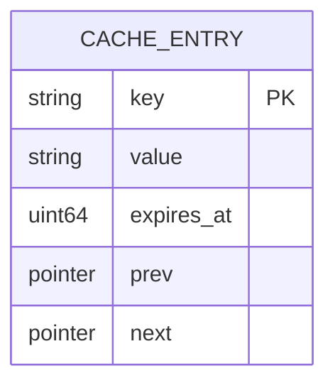
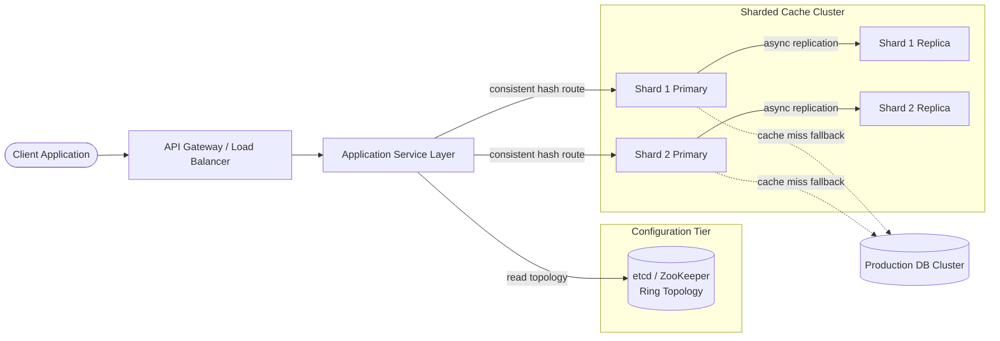
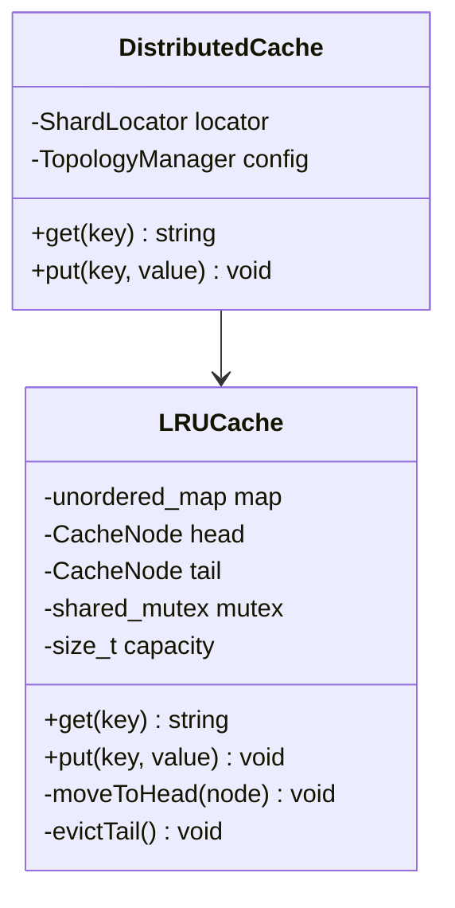
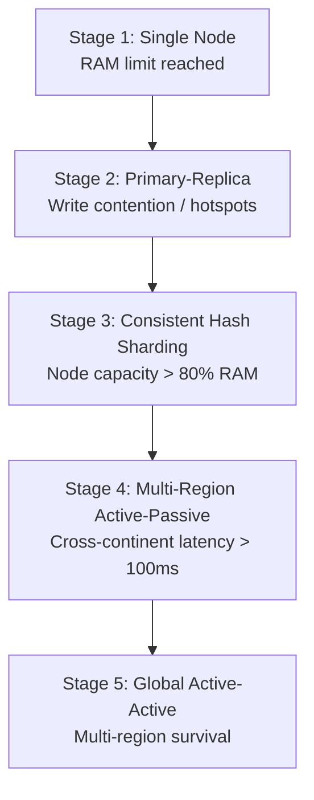
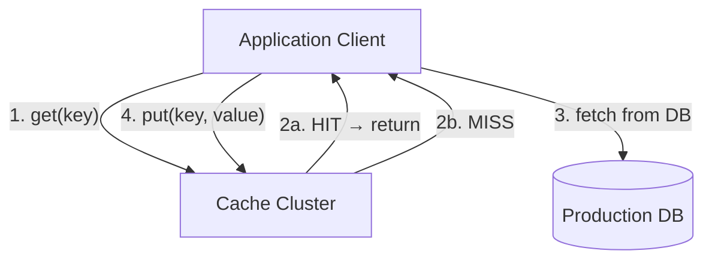

A distributed LRU cache stores hot key-value pairs in memory and evicts the least recently used entries when capacity is reached. At scale it is an **extremely read-heavy, latency-critical** system — every `get` and `put` must complete in **sub-millisecond** time while sustaining **347K peak RPS** across **100M DAU** with tunable consistency and horizontal shard growth.

This post walks through the full design — requirements, capacity math, REST API contracts, in-memory node layout, consistent hashing architecture, LRU engine mechanics, technology trade-offs, cache-aside fallback, infrastructure sizing, and failure modes. For senior-level interview follow-ups, see [Distributed LRU Cache Interview Questions](/system-design/distributed-lru-cache-interview-questions/).

---

## 1. Requirements and Goals

### Functional Requirements (MVP)

| Requirement | Description |
| :--- | :--- |
| **Insert / Update (`put`)** | Store a unique key and corresponding value in the cache. |
| **Retrieve (`get`)** | Return the value stored against a specific key. |
| **LRU eviction** | Automatically evict the least recently used entry when storage thresholds are reached. |

### Clarifying Assumptions

| Question | Assumption |
| :--- | :--- |
| Key and value data types? | Opaque byte strings — keys capped at **250 bytes**; values average **1 KB**. |
| Cache-miss fallback? | **Cache-Aside** — the upstream application fetches from the persistent DB on miss and writes back. |
| Expiration model? | **Both** — space-driven LRU eviction plus optional per-key TTL counters. |

### Non-Functional Requirements

| NFR | Target |
| :--- | :--- |
| **Latency** | Reads **< 1 ms**; writes **< 2 ms** (p99) |
| **Availability** | **99.99%** uptime; continuous service during hardware faults or network splits |
| **Scalability** | Horizontal scaling for traffic and storage footprint |
| **Consistency** | Tunable — eventual consistency on replicas; strict read-your-writes on primary |
| **DAU** | **100M** daily active users |
| **Throughput** | **10B** cache requests / day |
| **Read / Write ratio** | **10 : 1** (~91% reads, ~9% writes) |

---

## 2. Back-of-the-Envelope Calculations

### Traffic Estimates

| Metric | Calculation | Result |
| :--- | :--- | :--- |
| Total requests / day | Given | **10 billion / day** |
| Average RPS | 10B ÷ 86,400 s | **~115,740 RPS** |
| Peak RPS (3× modifier) | 115,740 × 3 | **~347,220 RPS** |
| Peak read RPS | 347,220 × 0.9091 | **~315,658 RPS** |
| Peak write RPS | 347,220 × 0.0909 | **~31,562 RPS** |

### Storage Growth

| Metric | Calculation | Result |
| :--- | :--- | :--- |
| Daily writes | 10B ÷ 11 | **~909M writes / day** |
| Daily ingress | 909M × 1 KB | **~909 GB / day** |
| Working set (20% active) | 909 GB × 0.20 | **~182 GB RAM** |
| Annual log-append run-rate | 909 GB × 365 | **~332 TB / year** (if persistence enabled) |

### Bandwidth

| Path | Calculation | Result |
| :--- | :--- | :--- |
| Peak payload throughput | 347,220 RPS × 1 KB | **~347 MB/s (~2.77 Gbps)** |
| NIC headroom | vs 10 Gbps interface | **~28% utilization** at peak |

---

## 3. API Design

| # | Method | Path | Purpose |
| :---: | :--- | :--- | :--- |
| 1 | GET | `/v1/cache/{key}` | Retrieve Entry |
| 2 | PUT | `/v1/cache/{key}` | Upsert Entry |

{{< api-endpoint method="GET" path="/v1/cache/{key}" desc="Retrieve Entry" open="true" >}}
Idempotent — repeated calls produce identical side effects on downstream state.


```http
GET /v1/cache/user_session_992183 HTTP/1.1
Host: cache.internal.net
X-Request-ID: c8d2fa8c-023a-446a-8be7-d35b91cf8df3
```



```json
{
  "key": "user_session_992183",
  "value": "eyJ1c2VyX2lkIjo5OTIxODMsInRva2VuIjoiYWJjIn0=",
  "ttl_remaining_sec": 3600
}
```



{{< api-endpoint method="PUT" path="/v1/cache/{key}" desc="Upsert Entry" >}}
Idempotent — successive writes to the same key produce identical final state.


```http
PUT /v1/cache/user_session_992183 HTTP/1.1
Host: cache.internal.net
Content-Type: application/json
X-Request-ID: f47ac10b-58cc-4372-a567-0e02b2c3d4a1

{
  "value": "eyJ1c2VyX2lkIjo5OTIxODMsInRva2VuIjoiYWJjIn0=",
  "ttl_seconds": 3600
}
```


```json
{
  "status": "SUCCESS",
  "key": "user_session_992183"
}
```



**Common HTTP error codes**

{}
| Code | Error Code | Condition | Mitigation |
| :--- | :--- | :--- | :--- |
| `400 Bad Request` | `INVALID_KEY_FORMAT` | Key exceeds 250-byte bound | Client shortens key |
| `404 Not Found` | `CACHE_MISS` | Entry absent or expired | Application fetches from DB |
| `429 Too Many Requests` | `RATE_LIMIT_EXCEEDED` | Client exceeds RPS quota | Client backs off |
| `503 Service Unavailable` | `SHARD_UNREACHABLE` | Quorum failure across storage nodes | Circuit breaker trips |
{}
---

## 4. Data Model

The single-node engine combines an **O(1) hash map** for lookups with a **doubly linked list** for recency tracking.



### In-Memory Node Structure

Each entry is fully denormalized — the value payload is stored inline alongside pointer nodes to avoid multiple lookup hops and minimize memory fragmentation.

```cpp
struct CacheNode {
    string key;             // Duplicated for hash table cleanup during tail eviction
    string value;           // Opaque payload bytes
    uint64_t expires_at;    // Epoch ms for TTL evaluation
    CacheNode* prev;        // Preceding node in LRU list
    CacheNode* next;        // Succeeding node in LRU list
};
```

### Doubly Linked List Layout

```
Doubly Linked List (LRU Order)
  +------+    +------+    +------+
Head | Node |<==>| Node |<==>| Node | Tail (LRU)
  +------+    +------+    +------+
     ^           ^           ^
     |           |           |
  +---------------------------------+
  |  Key1  |   Key2   |   Key3      |  Hash Map Index
  +---------------------------------+
```

| Field | Rationale |
| :--- | :--- |
| `key` duplicated in node | Enables O(1) hash map removal during tail eviction without reverse lookup |
| `expires_at` | Supports passive TTL cleanup on read and active background sampling |
| `prev` / `next` | O(1) detach-and-move for LRU promotion on access |

---

## 5. High-Level Architecture



### Component Responsibilities

| Component | Role |
| :--- | :--- |
| **API Gateway / Load Balancer** | TLS termination, edge rate limiting, traffic balancing |
| **Application Service Layer** | Client library caches cluster routing topology locally for direct shard routing |
| **etcd Coordination Cluster** | Source of truth for topology layout; heartbeat-based health; automatic leader promotion |
| **Sharded Cache Ring** | In-memory storage nodes partitioned via consistent hashing |
| **Production DB Cluster** | Durable source of truth on cache misses (PostgreSQL or MongoDB) |

### Request Routing Path

1. Client sends `GET` or `PUT` through the API gateway.
2. Application service resolves the target shard via locally cached consistent hash ring topology from **etcd**.
3. **Reads** may route to a replica for lower latency; **writes** always route to the shard primary.
4. On cache miss, the application fetches from the **production DB** and writes back (cache-aside).

---

## 6. Core LRU Algorithm

### Single-Node Engine



### `get(key)` — O(1)

1. Acquire exclusive write-lock (see concurrency note below).
2. Look up key in hash map.
3. If found and not expired → move node to list head → return value.
4. If absent or expired → return cache miss.

### `put(key, value)` — O(1)

1. Acquire exclusive write-lock.
2. If key exists → update value, move to head.
3. If key is new and at capacity → evict tail node, remove from hash map, insert new node at head.
4. Async replicate to shard replica.

### Thread Safety and Concurrency

The cache uses `std::shared_mutex`, but **both reads and writes require an exclusive write-lock**:

| Operation | Lock type | Why |
| :--- | :--- | :--- |
| `get` | Exclusive write-lock | LRU promotion mutates linked-list pointers — not a pure read |
| `put` | Exclusive write-lock | Inserts, updates, and evictions all modify structure |

For higher read concurrency at the distributed layer, route read traffic to **replica nodes** that serve slightly stale data under eventual consistency.

### Why Doubly Linked List over Singly Linked List?

Moving a node to the head requires detaching it from its current position. A singly linked list lacks a `prev` pointer, forcing **O(N)** traversal to find the predecessor. A doubly linked list detaches and re-links in **O(1)**.

---

## 7. Database Selection and Scaling

### Technology Comparison

| Component | Choice | Why choose | Why not alternatives |
| :--- | :--- | :--- | :--- |
| **Storage engine** | Custom in-memory engine | Sub-ms ops; no disk WAL on hot path | PostgreSQL/MySQL: disk I/O bottlenecks |
| **Coordination** | etcd | Raft consensus; Go-native; container-friendly | ZooKeeper: JVM tuning; heavier client libs |
| **Partitioning** | Consistent hashing + vnodes | Even key distribution; minimal resharding on node add/remove | Static range sharding: hotspot risk on key prefixes |
| **Miss fallback** | PostgreSQL / MongoDB | Durable source of truth | None: data loss on full cache flush |
| **Replication** | Async primary → replica | Offloads read traffic; fast writes | Sync replication: latency penalty per write |

### Scaling Strategy



| Stage | Trigger | Benefit | Drawback |
| :--- | :--- | :--- | :--- |
| **1 — Single instance** | Initial deployment | Simple; zero network overhead | RAM ceiling; SPOF |
| **2 — Primary-replica** | CPU > 75% on reads | Offloads read traffic | Replication lag → stale reads |
| **3 — Consistent hashing** | Node RAM > 80% | Horizontal scale | Topology management overhead |
| **4 — Multi-region passive** | Latency > 100 ms cross-continent | Fast local reads | Cross-region sync cost |
| **5 — Active-active global** | True multi-region survival | Zero local read/write delay | Split-brain; merge conflicts |

### Hotspot Key Mitigation

If a single key becomes an unavoidable bottleneck (e.g. a viral asset):

1. Split the hotspot vnode range dynamically.
2. Apply a **local cache layer** on upstream application instances for that key.
3. Use **single-flight** deduplication so only one worker refreshes the key on expiry.

---

## 8. Caching Strategy

### Cache-Aside Pattern



1. Application checks cache.
2. **Hit** → return data immediately.
3. **Miss** → application fetches from DB.
4. Application writes result back to cache.

### Eviction Policies

| Policy | Mechanism |
| :--- | :--- |
| **Space-driven LRU** | When storage pool is full, drop the tail (least recently used) node |
| **TTL — passive** | Expired keys removed on next read access |
| **TTL — active** | Background task samples random keys and purges expired entries to prevent memory leaks |
| **High-water mark** | At **90% RAM**, trigger aggressive proactive eviction even if item count is below capacity |

### Cache Stampede Prevention

When a popular key expires, parallel requests can flood the database. The system uses **single-flight** (distributed locking) so only one worker queries the DB to refresh the key; all other requests wait for the update.

---

## 9. Capacity Planning

Target: **~182 GB** operational RAM for the active working set.

| Component | Metric | Calculation | Recommendation |
| :--- | :--- | :--- | :--- |
| **Shards** | Partition count | 8 shards × 32 GB/node | **8 shards** |
| **Node pairs** | Primary + replica per shard | 8 × 2 | **16 node instances** |
| **Instance type** | AWS r6g.xlarge | 4 vCPU, 32 GB RAM, 10 Gbps | **16 × r6g.xlarge** |
| **Total RAM** | Cluster capacity | 8 × 32 GB | **256 GB** (~29% buffer over 182 GB target) |
| **Network** | Peak throughput | 347,220 RPS × 1 KB | **~2.77 Gbps** (within 10 Gbps NIC) |
| **etcd cluster** | Topology + heartbeats | 3-node Raft quorum | **3 × m6g.large** |
| **API Gateway** | Edge rate limit | 5,000 RPS per client ID | Token bucket per client |

### Autoscaling Triggers

| Signal | Action |
| :--- | :--- |
| Per-node RAM > 80% sustained | Add vnodes; rebalance hash ring |
| P99 read latency > 1 ms | Scale read replicas per shard |
| P99 write latency > 2 ms | Add shards; split vnode ranges |

---

## 10. Key Design Decisions Summary

| Decision | Choice | Rationale |
| :--- | :--- | :--- |
| Storage engine | Custom in-memory | Sub-ms latency; no disk on hot path |
| LRU structure | Hash map + doubly linked list | O(1) get, put, and eviction |
| Partitioning | Consistent hashing + vnodes | Even distribution; graceful node add/remove |
| Coordination | etcd | Raft consensus; automated leader promotion |
| Consistency model | Eventual on replicas | Strict linearizability on replicas kills read-replica benefit |
| Write routing | Always to primary | Prevents split writes across replica nodes |
| Miss pattern | Cache-aside | Application controls fallback logic and freshness |
| Eviction | LRU + optional TTL | Space pressure + time-based expiry |
| Stampede defense | Single-flight mutex | Protects DB during viral key expiry |
| Security | TLS 1.3 + mTLS | Edge encryption; mutual auth between cluster nodes |
| Rate limiting | Token bucket at gateway | 5,000 RPS per client ID |

### Security Architecture

| Control | Implementation |
| :--- | :--- |
| Transport encryption | TLS 1.3 at gateway; mTLS between cluster nodes |
| Rate limiting | Token bucket at API gateway — 5,000 RPS per client ID |
| Input validation | Keys capped at 250 bytes; regex structural checks |

### Observability Matrix

| Metric | SLO / Purpose |
| :--- | :--- |
| Cache hit rate | Target **> 85%** |
| Memory saturation | Per-node RAM utilization |
| P99 read latency | **< 1 ms** |
| P99 write latency | **< 2 ms** |
| Availability | **99.99%** monthly uptime |
| Daily read latency | **99%** of reads complete in **< 2 ms** |

---

## 11. Failure Modes and Mitigations

| Failure | Impact | Mitigation |
| :--- | :--- | :--- |
| **Primary node crash** | Writes blocked for affected shard | etcd heartbeat timeout (3s) → Raft promotes most up-to-date replica |
| **Network partition / split-brain** | Conflicting primaries | Quorum sizing Q = ⌊N/2⌋ + 1 enforced on coordination cluster |
| **Shard node unreachable** | Requests to dead node fail | Client library catches timeouts; routes around failed node via consistent hash |
| **Cache stampede** | DB overload on popular key expiry | Single-flight — one worker refreshes; others wait |
| **Unexpected memory spike** | OOM risk | High-water mark at 90% RAM triggers aggressive tail eviction |
| **Write to read replica** | Rejected write | Replica returns redirection response pointing to current primary |
| **Hotspot shard** | Single shard saturated | Dynamic vnode split; local application-level cache for hot key |
| **Replica lag** | Stale reads from replica | Route read-your-writes to primary; accept eventual consistency on replicas |
| **etcd cluster outage** | Topology updates blocked | Client library uses last-known-good ring; stale routing tolerated briefly |
| **Full cluster flush** | All keys evicted | Cache-aside rebuilds from DB; single-flight prevents DB stampede |

### High Availability Design

- Read replicas placed in **separate Availability Zones** per shard.
- Primary heartbeat interval: **3 seconds** — missed heartbeats trigger automatic leader promotion via etcd.
- Client library maintains a **locally cached hash ring** to route around failed nodes without central proxy bottleneck.

---

## What's Next

Future posts in this series will cover adjacent designs — write-through vs write-behind cache topologies, Redis Cluster as an off-the-shelf LRU backend, and migration playbooks from single-node Memcached to a fully sharded in-memory engine with virtual node rebalancing.
