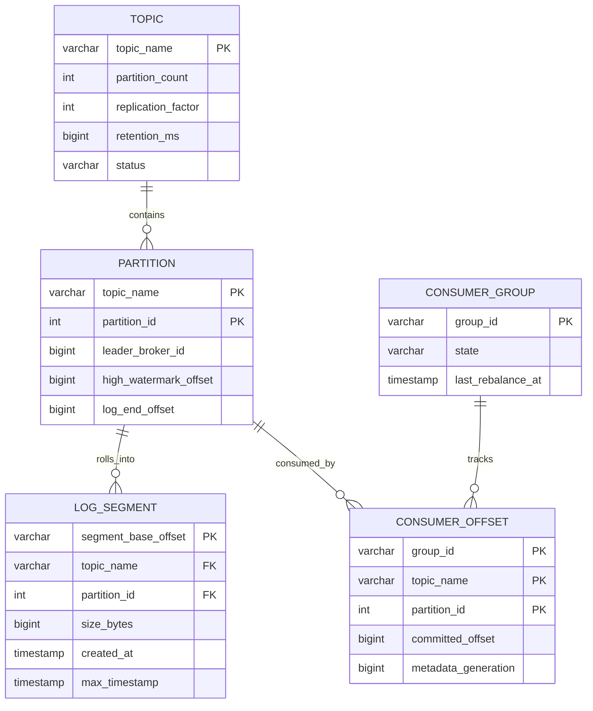
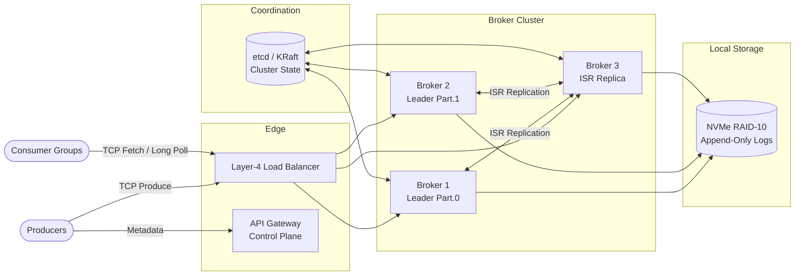
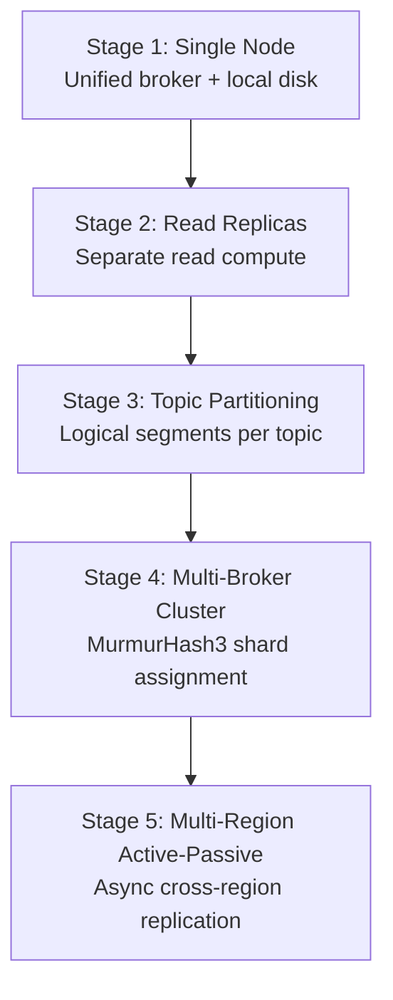
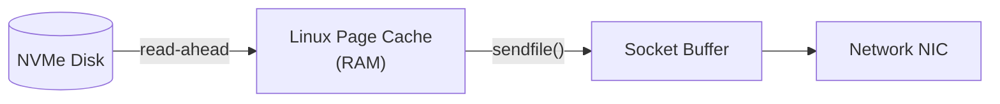

A distributed message queue decouples producers from consumers through durable, partitioned topics — enabling event-driven microservices, stream processing, and historical replay at scale. At production scale it is a **write-heavy, partition-ordered system**: ingestion must sustain burst traffic with configurable durability guarantees (ack=0/1/all), while consumers pull at their own pace without broker-side push overload.

This post walks through the full design — requirements, capacity math, REST control plane and TCP data plane APIs, append-only log storage, leader-follower replication, MurmurHash3 partitioning, OS page-cache caching, infrastructure sizing, and failure runbooks. For 50 senior-level interview follow-ups, see [Distributed Message Queue Interview Questions](/system-design/distributed-message-queue-interview-questions/).

---

## 1. Requirements and Goals

### Functional Requirements (MVP)

| Requirement | Description |
| :--- | :--- |
| **Publish / Produce** | High-throughput ingestion of messages to specific topics by multiple concurrent producers. |
| **Subscribe / Consume** | Low-latency retrieval of topic messages by multi-consumer groups. |
| **Topic-based routing** | Partitioned topics with multiple consumers maintaining independent read states. |
| **Message retention** | Configurable time-based retention (default 30 days) regardless of consumption state. |

### Clarifying Assumptions (Interview Context)

| Question | Decision |
| :--- | :--- |
| Global vs partition-level ordering? | **Partition-level ordering** — global ordering across distributed topics bottlenecks throughput. |
| How is consumer state (offsets) managed? | **Broker-managed** via an internal compacted offset topic (`__consumer_offsets`), enabling fast consumer failovers without client-side state. |
| Push vs pull consumption? | **Pull-based** — consumers fetch at their own pace, preventing resource starvation during spikes. |
| Binary payloads? | Content remains text-based; binary data is transported as raw byte sequences. |

### Non-Functional Requirements

| NFR | Target |
| :--- | :--- |
| **Scale** | **10M messages/day** baseline; **~1,160 peak write RPS** (10× surge); **~3,480 peak read RPS** (3× fan-out) |
| **Fault tolerance** | Zero data loss for acknowledged writes under single-node/broker failure (ack=all) |
| **Ordering** | Strict per-partition message ordering via monotonic offsets |
| **Consistency** | Tunable publisher acknowledgments: ack=0, ack=1, ack=all |
| **Topic count** | **10,000** active topics |
| **Retention** | **30 days** default |
| **Avg payload** | **1 KB** per message |
| **Read / Write ratio** | **3 : 1** (typical event-driven fan-out) |

---

## 2. Back-of-the-Envelope Calculations

### Traffic Estimates

| Metric | Calculation | Result |
| :--- | :--- | :--- |
| Daily write volume | Given | **10,000,000 msgs/day** |
| Daily read volume (3× fan-out) | 10M × 3 | **30,000,000 msgs/day** |
| Average write RPS | 10M ÷ 86,400 s | **~116 RPS** |
| Peak write RPS (10× surge) | 116 × 10 | **~1,160 RPS** |
| Peak read RPS | 1,160 × 3 | **~3,480 RPS** |

### Storage

| Assumption | Calculation | Result |
| :--- | :--- | :--- |
| Daily raw storage | 10M × 1 KB | **~10 GB/day** |
| Annual growth | 10 GB × 365 | **~3.65 TB/year** |
| 30-day retention (single replica) | 10 GB × 30 | **~300 GB** |
| With RF=3 replication | 300 GB × 3 | **~900 GB** total cluster storage |

### Bandwidth

| Path | Calculation | Result |
| :--- | :--- | :--- |
| Peak ingress | 1,160 RPS × 1 KB | **~1.16 MB/s (~9.28 Mbps)** |
| Peak egress | 3,480 RPS × 1 KB | **~3.48 MB/s (~27.84 Mbps)** |

### Page Cache Working Set

| Assumption | Calculation | Result |
| :--- | :--- | :--- |
| Hourly write volume | 10 GB ÷ 24 | **~416 MB** |
| With RF=3 replicas | 416 MB × 3 | **~1.25 GB** hot working set |

Active consumers reading recent data are served from the Linux page cache without touching disk.

---

## 3. API Design

| # | Method | Path | Purpose |
| :---: | :--- | :--- | :--- |
| 1 | POST | `/v1/topics` | Control Plane (REST) |



```json
{
  "topic_name": "orders.v1",
  "partitions": 12,
  "replication_factor": 3,
  "config": {
    "retention_ms": 2592000000
  }
}
```



```json
{
  "topic_id": "tp-9831a-0a91",
  "status": "PROVISIONING"
}
```



### Data Plane (TCP Binary Frames)

#### Produce Request

```
[FrameSize (4B)][ApiKey (2B)][ClientIdSize (2B)][ClientId (vB)]
[TopicNameSize (2B)][TopicName (vB)][Partition (4B)]
[MessageSetSize (4B)][MessageSet (vB)]
```

#### Fetch Request

```
[FrameSize (4B)][ApiKey (2B)][ConsumerGroupIdSize (2B)][ConsumerGroupId (vB)]
[TopicName (vB)][Partition (4B)][FetchOffset (8B)][MaxBytes (4B)]
```

### Idempotency

Producers append a unique `ProducerId` and monotonically increasing `SequenceNumber` to every message batch. The broker tracks sequences per partition log to discard duplicate submissions caused by network retries.

**Common HTTP error codes**

{}
| Code | Name | Client Action |
| :--- | :--- | :--- |
| `0x00` | NO_ERROR | Continue |
| `0x01` | CORRUPT_MESSAGE | Resubmit batch (CRC mismatch) |
| `0x02` | UNKNOWN_TOPIC_OR_PARTITION | Refresh metadata |
| `0x03` | NOT_LEADER_FOR_PARTITION | Refresh metadata; retry on new leader |
| `0x04` | REQUEST_TIMED_OUT | Exponential backoff retry |
{}
---

## 4. Data Model



### On-Disk Layout

No relational or NoSQL engine stores message payloads. Messages append directly to sequential flat-file logs:

```
/var/log/queue/
  ├── orders.v1-0/                  # Topic: orders.v1, Partition: 0
  │     ├── 00000000000000000000.log
  │     ├── 00000000000000000000.index
  │     └── 00000000000000000000.timeindex
```

### Log Record Format (`.log` file)

| Field | Type | Size | Description |
| :--- | :--- | :--- | :--- |
| `Offset` | Int64 | 8 B | Monotonic offset within partition |
| `Length` | Int32 | 4 B | Size of remaining record |
| `CRC` | Int32 | 4 B | Payload corruption validation |
| `Magic` | Int8 | 1 B | Schema protocol version |
| `Attributes` | Int8 | 1 B | Codec info (zstd, snappy, none) |
| `Key_Size` | Int32 | 4 B | Partition key length |
| `Key` | Bytes | Variable | Partition key (e.g. `buyer_id`) |
| `Val_Size` | Int32 | 4 B | Payload size |
| `Value` | Bytes | Variable | Raw text/JSON message |

### Sparse Index Format (`.index` file)

Maps offsets to physical byte positions every 4 KB of written data:

| Offset (relative, 4 B) | Physical Position (4 B) |
| :--- | :--- |
| 0 | 1024 |
| 4096 | 20488 |
| 8192 | — |

Relative offsets use 4-byte integers instead of 8-byte absolutes, keeping index files compact enough to fit in memory.

---

## 5. High-Level Architecture



### Write Path

1. Producer resolves partition via `MurmurHash3(partition_key) % partition_count`.
2. Producer sends the batch to the partition **leader** broker over a persistent TCP connection.
3. Leader appends to the active log segment, assigns monotonic offsets, and replicates to the **ISR** (In-Sync Replica) pool.
4. Leader responds based on `acks` config: immediately (0), after local write (1), or after all ISR acks (all).

### Read Path

1. Consumer group member sends a **long-polling fetch** request with its committed offset.
2. Broker returns records up to the **high-watermark** — the highest offset replicated to all ISR members.
3. Consumer processes the batch, then commits offset to the internal `__consumer_offsets` topic.

### Control Path

1. Admin clients create topics via REST (`POST /v1/topics`).
2. The **cluster controller** (one elected broker) writes metadata to etcd/KRaft.
3. All brokers receive topology updates and elect partition leaders.

---

## 6. Core Algorithm — Partitioning, Offsets, and Idempotency

### Partition Routing

```
Target Partition = MurmurHash3(PartitionKey) mod TotalPartitions
```

MurmurHash3 produces a uniform 32-bit distribution. Modulo against partition count spreads keys evenly. Use entity IDs (e.g. `user_id`, `order_id`) as keys when related events must stay ordered — avoid random UUIDs that destroy locality.

### Monotonic Offset Assignment

Each partition maintains a `nextOffset` counter. On append, the broker assigns sequential offsets to every record in the batch:

```java
public void append(MessageBatch batch) {
    rwLock.writeLock().lock();
    try {
        LogSegment activeSegment = segments.get(segments.size() - 1);
        if (activeSegment.sizeBytes() > maxSegmentBytes) {
            activeSegment = rollNewSegment();
        }
        batch.assignOffsets(nextOffset);
        activeSegment.append(batch);
        nextOffset += batch.size();
    } finally {
        rwLock.writeLock().unlock();
    }
}
```

### Idempotent Producer Deduplication

| Field | Purpose |
| :--- | :--- |
| `ProducerId` | Unique per producer instance (assigned by broker on init) |
| `SequenceNumber` | Monotonically increasing per partition |
| Broker state | Tracks last accepted sequence per `(ProducerId, Partition)` |

If a retry arrives with a sequence already committed, the broker silently discards the duplicate. Out-of-order sequences (retry of batch N after batch N+1 was accepted) raise an error.

### High-Watermark Semantics

The **high-watermark offset** is the highest offset replicated to all ISR members. Consumers may only read below this point — preventing access to uncommitted data that could vanish during leader failover.

### Log Segment Rolling

| Trigger | Default | Action |
| :--- | :--- | :--- |
| Size limit | 1 GB | Close active segment; open new `.log` + `.index` pair |
| Time limit | 7 days | Roll segment regardless of size |

### Zero-Copy Read Path

The data plane uses `FileChannel.transferTo()` (wrapping OS `sendfile()`) to move bytes from the page cache directly to the NIC buffer — bypassing application memory and avoiding GC pressure on large fetches.

---

## 7. Database Selection and Scaling

### Technology Comparison

| Component | Choice | Why choose | Why not alternatives |
| :--- | :--- | :--- | :--- |
| **Message storage** | Append-only file logs | O(1) sequential disk writes; no B-tree page splits | PostgreSQL/MongoDB: indexing overhead destroys write throughput |
| **Coordination** | etcd / KRaft | Lean Raft consensus; clear operational semantics | ZooKeeper: heavy memory footprint; complex deployment |
| **Architecture style** | Kafka-style log | Immutable retention; multi-consumer fan-out; replay | RabbitMQ: messages deleted on ack — no downstream replay |
| **Data plane protocol** | Custom TCP framing | Minimal header overhead; optimized binary layout | HTTP/2: framing and parsing costs limit throughput |
| **Compression** | zstd (default) / snappy | zstd: higher ratio; snappy: lower CPU | Uncompressed: 3–5× storage and bandwidth waste |

### Scaling Strategy



| Stage | Trigger | Design |
| :--- | :--- | :--- |
| **1 — Single node** | Prototype / dev | One broker; SPOF |
| **2 — Read replicas** | Read pressure | Async replicas for fetch; risk of lag races |
| **3 — Partitioning** | Write throughput ceiling | Split topics into N independent ordered logs |
| **4 — Multi-broker cluster** | Storage / CPU limits | Assign partition subsets across brokers; ISR replication |
| **5 — Multi-region** | DR / latency | Active-passive with background cross-region sync |

### Leader-Follower Replication

| State | Description |
| :--- | :--- |
| **Leader** | Accepts writes; replicates to ISR |
| **ISR (In-Sync Replicas)** | Followers caught up within `replica.lag.time.max.ms` |
| **Out-of-sync** | Removed from ISR; cannot become leader until caught up |

On leader failure, the controller promotes the highest-ranked ISR candidate. Target RTO: **< 10 seconds**. RPO: **0** with ack=all.

---

## 8. Caching Strategy

The system does **not** use application-level caches (Redis/Memcached). It relies on the **Linux OS page cache**:



| Mechanism | Behavior |
| :--- | :--- |
| **Write-through** | Written byte regions automatically populate the page cache |
| **Read-through** | Active consumers fetch recent data from RAM — near-zero latency |
| **Eviction** | Kernel LRU evicts cold pages; historical reads hit disk without user-space GC |
| **Working set** | ~1.25 GB (1 hour of writes × RF=3) fits comfortably in broker RAM |

### Page Cache Pollution Mitigation

Deep historical consumers can flush warm pages used by real-time producers. Mitigations:

- Separate storage volumes for hot vs cold partitions
- `POSIX_FADV_DONTNEED` hints after serving old segments
- Dedicated broker pools for replay workloads vs real-time traffic

---

## 9. Capacity Planning

| Component | Metric | Calculation / Assumption | Recommendation |
| :--- | :--- | :--- | :--- |
| **Broker nodes** | Peak write + read RPS | 1,160 write + 3,480 read RPS | **3× c6g.2xlarge** (8 vCPU, 32 GB RAM) |
| **Broker disk** | 30-day retention × RF=3 | ~900 GB total | **2× 1 TB NVMe RAID-10** per broker |
| **Coordination cluster** | Metadata + leader election | Lightweight Raft workload | **3× t4g.medium** |
| **Page cache headroom** | 1-hour hot working set | ~1.25 GB | Covered by 32 GB broker RAM |
| **Network** | Peak ingress + egress | ~9.28 + ~27.84 Mbps | Well within instance limits |
| **Partition ceiling** | Parallelism bound | 10,000 topics × N partitions | Scale partitions before adding brokers |

### Autoscaling Policy

- Add broker nodes when sustained CPU exceeds **70%**
- Trigger partition reassignment to redistribute load onto new nodes
- Partition count sets the maximum parallel consumer scaling limit (consumers ≤ partitions per group)

---

## 10. Key Design Decisions Summary

| Decision | Choice | Rationale |
| :--- | :--- | :--- |
| Storage substrate | Append-only flat files | Sequential I/O; O(1) writes; no DB indexing overhead |
| Ordering guarantee | Per-partition monotonic offsets | Throughput without global coordination bottleneck |
| Consumption model | Pull-based long polling | Consumer-paced; natural batching; no push overload |
| Replication | Leader + ISR with Raft coordination | Configurable durability via ack levels |
| Offset management | Internal `__consumer_offsets` topic | Broker-side state; seamless failover |
| Deduplication | ProducerId + SequenceNumber | Safe retries without duplicate records |
| Data plane transport | Custom TCP + sendfile | Maximum throughput; minimal framing overhead |
| Retention | Time-based segment deletion | Predictable storage; independent of consumption |
| Security | mTLS + ACLs + byte-rate quotas | Identity validation; tenant isolation; backpressure |
| Observability | Under-replicated partitions + consumer lag SLIs | 99.99% publish/ingest SLO |

### Security Architecture

| Control | Implementation |
| :--- | :--- |
| Authentication | Mutual TLS (mTLS) with X.509 client certificates |
| Authorization | ACLs in coordination cluster (principal → topic/action) |
| Rate limiting | Per-connection byte-rate quotas |

```json
{
  "principal": "order-service",
  "producer_byte_rate": 10485760,
  "consumer_byte_rate": 20971520
}
```

### Observability Matrix

| SLI | Target | Alarm |
| :--- | :--- | :--- |
| Under-replicated partitions | **0** | PagerDuty if > 0 for 5+ minutes |
| Consumer group lag | Per-group threshold | Warn at 10K; critical at 100K offsets |
| Disk I/O utilization | < 80% sustained | Scale disk or add brokers |
| Leader election count | Near zero | Alert on any unexpected election |
| Publish success rate | **99.99%** monthly | SLO breach dashboard |

---

## 11. Failure Modes and Mitigations

| Failure | Impact | Mitigation |
| :--- | :--- | :--- |
| **Broker leader crash** | Partition temporarily unavailable for writes | Controller elects new leader from ISR; RTO < 10s; clients refresh metadata |
| **Under-replicated partition** | Reduced durability | Alert immediately; investigate ISR lag; throttle producers if needed |
| **Coordination cluster outage** | No topology updates or leader elections | Existing connections continue; clients use cached metadata with exponential backoff |
| **Disk full on broker** | Writes rejected | Halt ingestion; return disk-full error; prioritize segment truncation |
| **CRC / data corruption** | Invalid records rejected | Broker rejects packet; client resubmits; on restart, truncate to last valid CRC |
| **Slow consumer** | Consumer lag grows | Lag is a feature (pull model); scale consumers up to partition count; monitor lag SLI |
| **Producer retry duplicate** | Potential duplicate records | Idempotent producer sequencing discards already-committed batches |
| **Network partition (split-brain)** | Conflicting leaders | Raft quorum (⌊N/2⌋ + 1); isolated nodes lose leadership |
| **GC pause on broker** | Missed heartbeats → false failover | Tune JVM heap/G1; avoid over-provisioning heap; monitor GC pause duration |
| **Poison message** | Consumer crash loop | Route to dead-letter queue (DLQ) after N retries; skip and continue |
| **Mass rolling upgrade** | Transient leader churn | Migrate leadership off target node before shutdown; one broker at a time |
| **Historical read pollution** | Page cache flushed for real-time traffic | Isolate replay consumers; separate disk volumes; `POSIX_FADV_DONTNEED` |

### Disaster Recovery

| Metric | Target |
| :--- | :--- |
| **RTO** | < 10 seconds (partition leader re-election) |
| **RPO** | 0 data loss with ack=all and healthy ISR |

---

## What's Next

Future posts in this series will cover adjacent designs — exactly-once stream processing semantics, multi-region active-active replication with conflict resolution, and operational playbooks for partition reassignment at 100K+ partitions.
