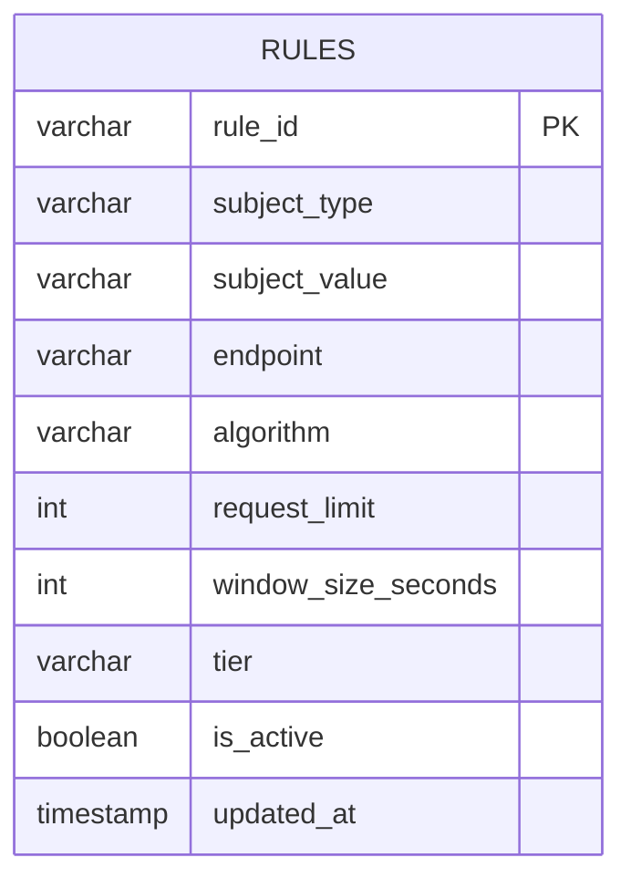
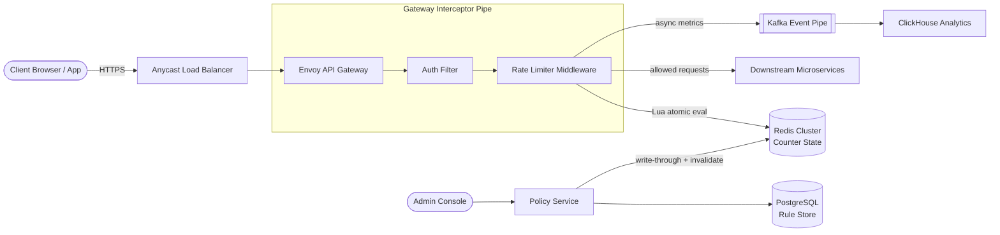
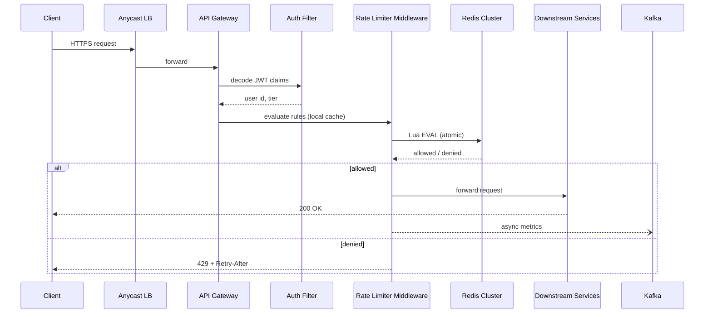
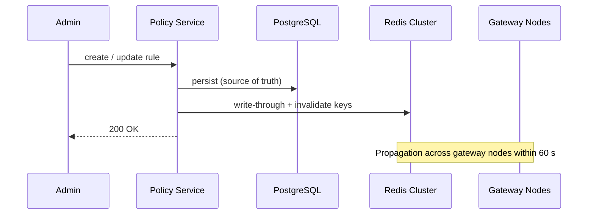
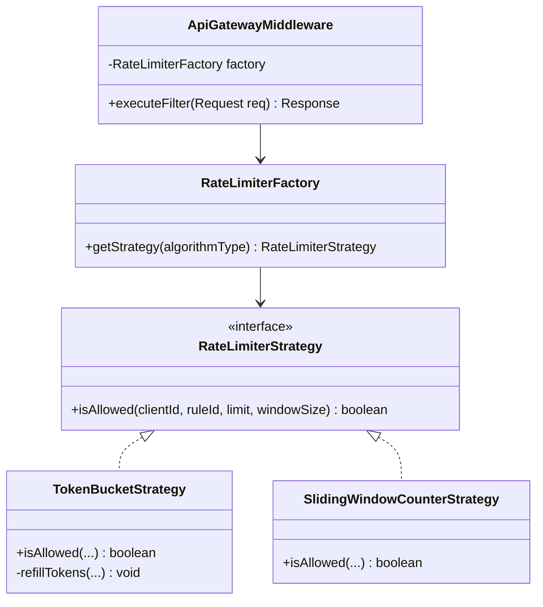
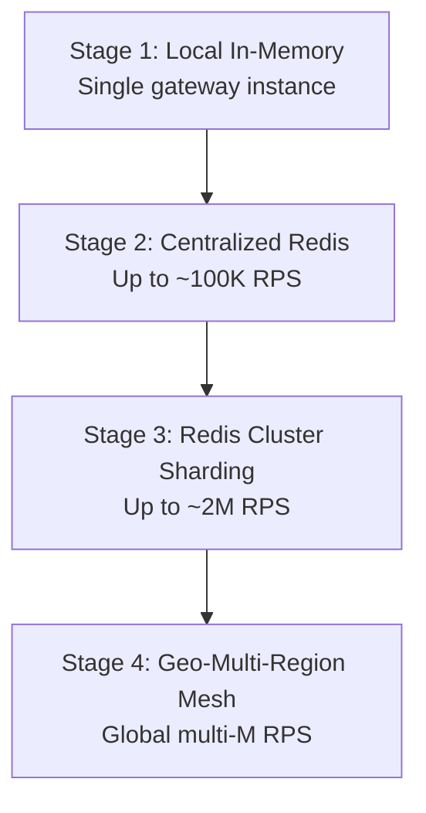

A distributed rate limiter protects downstream services by throttling traffic based on user identity, API keys, IP addresses, and endpoint patterns. At scale it is an **extremely read-heavy, latency-critical inline interceptor** — every API request must be evaluated in **≤ 5 ms** while sustaining **1 million RPS** steady state with burst tolerance and runtime rule updates.

This post walks through the full design — requirements, capacity math, admin API contracts, PostgreSQL rule storage, Envoy gateway architecture, atomic Redis Lua token-bucket algorithms, technology trade-offs, caching and eviction, infrastructure sizing, and failure modes. For 50 senior-level interview follow-ups, see [Distributed Rate Limiter Interview Questions](/system-design/distributed-rate-limiter-interview-questions/).

---

## 1. Requirements and Goals

### Functional Requirements (MVP)

| Requirement | Description |
| :--- | :--- |
| **Multi-attribute limiting** | Throttle by User ID, API Key, IP Address, or explicit API endpoint. |
| **Dynamic configuration** | Policies and thresholds are config-driven and changeable at runtime without service restarts. |
| **Standardized throttling output** | Denied requests return HTTP `429 Too Many Requests` with precise limit, remaining, reset, and retry headers. |
| **Burst handling** | Gracefully accommodate high-concurrency burst patterns without degrading underlying resources. |
| **Multi-tier / SLA support** | Enforce monetization tiers (Free, Pro, Enterprise) mapped dynamically to incoming tokens. |

### Clarifying Assumptions

| Question | Assumption |
| :--- | :--- |
| Inline interceptor or standalone service? | **Native plug-in / middleware** inside the API Gateway with out-of-process distributed cache lookups. |
| Failure strategy if global cache goes dark? | **Soft fail-open** with local degraded rate limiting — availability over absolute strict enforcement. |
| Global synchronization across regions? | **Regional isolation** for stateful traffic; global rule propagation for metadata only. |

### Non-Functional Requirements

| NFR | Target |
| :--- | :--- |
| **Scale** | **1M RPS** steady state; **2.5M RPS** peak (2.5× buffer) |
| **Latency** | Rule evaluation **≤ 5 ms** inline overhead |
| **Availability** | **AP** — fail-open on cache failure; prioritize availability over strict consistency |
| **Rule propagation** | Admin rule updates propagate within **≤ 60 seconds** across geo-distributed nodes |
| **DAU** | **50M** active calling entities |
| **Read / Write ratio** | **10,000,000 : 1** (counter state writes vs admin rule definition writes) |

---

## 2. Back-of-the-Envelope Calculations

### Traffic Estimates

| Metric | Calculation | Result |
| :--- | :--- | :--- |
| Requests / day | 1M RPS × 86,400 s | **86.4 billion / day** |
| Peak RPS | 2.5× steady state | **2.5M RPS** |
| Admin rule writes / day | Admin-only mutations | **< 100 / day** |

### Redis State Memory (Token Bucket)

Key format: `rl:{tenant_id}:{rule_id}` (~32 B). Value: tokens (8 B) + last_updated (8 B) + hash metadata (~48 B) ≈ **64 B**. Rounded to **128 B** per entry with padding.

| Assumption | Calculation | Result |
| :--- | :--- | :--- |
| Active client contexts | 50M unique keys in sliding window | — |
| Memory per entry | 128 B | — |
| Total active memory | 50M × 128 B | **~6.4 GB** |
| Operational cushion (2×) | Fragmentation + spikes | **~12.8 GB RAM** |

### Bandwidth

| Path | Calculation | Result |
| :--- | :--- | :--- |
| Cache check round-trip | 1M RPS × 250 B payload | **~250 MB/s (~2 Gbps)** |
| Peak cache throughput | 2.5× steady state | **~625 MB/s (~5 Gbps)** |

---

## 3. API Design

| # | Method | Path | Purpose |
| :---: | :--- | :--- | :--- |
| 1 | POST | `/api/v1/rules` | Create Rate Limiting Rule |
| 2 | GET | `/api/v1/rules/{client_id}` | Retrieve Client Rules |


Idempotency: `X-Idempotency-Key` header cached in admin Redis tier for 30 minutes.


```json
{
  "subject_type": "USER_ID",
  "subject_value": "user_vip_9918",
  "endpoint": "/api/v1/image/generate",
  "algorithm": "TOKEN_BUCKET",
  "request_limit": 100,
  "window_size_seconds": 60,
  "tier": "PREMIUM"
}
```



```json
{
  "rule_id": "rule_ff8923a1",
  "status": "ACTIVE",
  "created_at": "2026-06-26T16:09:00Z"
}
```



{{< api-endpoint method="GET" path="/api/v1/rules/{client_id}" desc="Retrieve Client Rules" >}}

```json
{
  "client_id": "user_vip_9918",
  "active_rules": [
    {
      "rule_id": "rule_ff8923a1",
      "endpoint": "/api/v1/image/generate",
      "request_limit": 100,
      "window_size_seconds": 60
    }
  ]
}
```





When a consumer exceeds quota, the gateway returns immediately without forwarding to downstream services:



```http
HTTP/1.1 429 Too Many Requests
Content-Type: application/json
X-RateLimit-Limit: 100
X-RateLimit-Remaining: 0
X-RateLimit-Reset: 1782490140
Retry-After: 45
```

```json
{
  "error_code": "RESOURCE_THROTTLED",
  "message": "API request quota exceeded for your current tier. Please retry after 45 seconds.",
  "retry_after_seconds": 45
}
```



**Common HTTP error codes**

{}
| Code | Condition |
| :--- | :--- |
| `400 Bad Request` | Invalid payload (e.g. negative token bucket constants) |
| `429 Too Many Requests` | Client-facing throttling marker |
| `201 Created` | Rule successfully persisted and propagated |
{}
---

## 4. Data Model



### `rules` (PostgreSQL)

Configuration rules require ACID persistence. The schema is intentionally flat — no joins on the admin write path.

```sql
CREATE TABLE rules (
    rule_id             VARCHAR(64)  PRIMARY KEY,
    subject_type        VARCHAR(32)  NOT NULL,
    subject_value       VARCHAR(255) NOT NULL,
    endpoint            VARCHAR(512) NOT NULL,
    algorithm           VARCHAR(32)  NOT NULL,
    request_limit       INT          NOT NULL CHECK (request_limit > 0),
    window_size_seconds INT          NOT NULL CHECK (window_size_seconds > 0),
    tier                VARCHAR(32)  NOT NULL,
    is_active           BOOLEAN      DEFAULT TRUE NOT NULL,
    updated_at          TIMESTAMP    DEFAULT CURRENT_TIMESTAMP NOT NULL
);

CREATE INDEX idx_rules_lookup ON rules (subject_type, subject_value, is_active);
```

| Column | Rationale |
| :--- | :--- |
| `subject_type` + `subject_value` | Modular decoupling — match against USER_ID, IP_ADDRESS, or API_KEY in unified queries |
| `endpoint` | Per-path limits (e.g. costly `/v1/image/generate` vs cheaper text pipelines) |
| `is_active` | Soft-kill circuit breaker without hard deletes during emergencies |
| `updated_at` | Version tag for cache invalidation and propagation tracking |

### Ephemeral Counter State (Redis Hash)

Not persisted to PostgreSQL. Lives entirely in Redis:

| Field | Type | Purpose |
| :--- | :--- | :--- |
| `tokens` | float64 | Current bucket balance |
| `last_updated` | int64 | Timestamp for lazy refill calculation |

Key: `rl:{tenant_id}:{rule_id}`

---

## 5. High-Level Architecture



### Request Evaluation Path



Metrics ship asynchronously to **Kafka** → **ClickHouse** — never blocking the hot path.

### Admin Configuration Path



---

## 6. Core Rate Limiting Algorithms

The system uses the **Strategy Pattern** to swap algorithms per rule configuration at runtime.



### Token Bucket (Primary Algorithm)

Tokens accumulate up to `request_limit` (bucket capacity). Each allowed request consumes one token. Refill is **lazy** — computed on each request from elapsed time, eliminating background refill threads.

### Atomic Redis Lua Script

All check-and-update logic runs as a single atomic operation — no distributed locks, no multi-round-trip race conditions:

```lua
local key = KEYS[1]
local limit = tonumber(ARGV[1])
local current_time = tonumber(ARGV[2])
local refill_rate = tonumber(ARGV[3])

local data = redis.call('HMGET', key, 'tokens', 'last_updated')
local tokens = tonumber(data[1])
local last_updated = tonumber(data[2])

if not tokens then
    tokens = limit
    last_updated = current_time
else
    local delta = math.max(0, current_time - last_updated)
    tokens = math.min(limit, tokens + (delta * refill_rate))
end

if tokens >= 1 then
    tokens = tokens - 1
    redis.call('HMSET', key, 'tokens', tokens, 'last_updated', current_time)
    return 1
else
    return 0
end
```

### Algorithm Comparison

| Algorithm | Burst tolerance | Memory | Boundary burst flaw |
| :--- | :--- | :--- | :--- |
| **Fixed Window Counter** | Low | Minimal | Yes — double quota at window edges |
| **Sliding Window Log** | High | High (per-request timestamps) | No |
| **Sliding Window Counter** | Medium | Low | Approximation — assumes even prior-window distribution |
| **Token Bucket** | High | Low (2 fields per key) | No — lazy refill handles bursts natively |
| **Leaky Bucket** | None (smooth output) | Queue-bound | No — but queues add latency |

**Production default:** Token Bucket for API gateway enforcement. Leaky Bucket reserved for downstream smoothing where uniform consumption rate is required.

### Rule ID Generation

**UUIDv4** — decentralized generation across independent gateway instances. No network hop, no centralized ID service.

---

## 7. Database Selection and Scaling

### Technology Comparison

| Component | Choice | Why choose | Why not alternatives |
| :--- | :--- | :--- | :--- |
| **Counter state** | Redis Cluster | Lua atomicity; Hash data type; sub-ms ops | Memcached: no Hashes or scripts; Hazelcast: JVM GC tuning at 1M RPS |
| **Rule metadata** | PostgreSQL | ACID constraints; relational validation; low-volume admin writes | Cassandra/MongoDB: unnecessary schema flexibility for structured config |
| **Metrics pipeline** | Kafka | High-throughput append log; non-blocking hot path | RabbitMQ: queue degradation under metric floods |
| **Analytics** | ClickHouse | Columnar aggregation over billions of telemetry rows | PostgreSQL: poor at billion-row analytical scans |
| **Rule IDs** | UUIDv4 | Decentralized; no coordination | DB auto-increment: centralized bottleneck |
| **Gateway** | Envoy Proxy | WASM/Lua filters; async I/O; xDS live config | Standalone RL service: extra network hop per request |

### Scaling Strategy



| Stage | Trigger | Design | Drawback |
| :--- | :--- | :--- | :--- |
| **1 — Local memory** | Initial dev / low traffic | In-process counters | Inaccurate across gateway replicas |
| **2 — Single Redis** | Replica counter mismatch | Centralized state | SPOF; network bottleneck |
| **3 — Redis cluster** | Single-node capacity exhaustion | Consistent hashing on `rl:{user_id}` | Hotspot keys on viral accounts |
| **4 — Multi-region mesh** | Global latency requirements | Regional Redis + local routing; global rule sync via PostgreSQL | No cross-region counter sync (by design) |

### Hotspot Key Mitigation

For viral users or enterprise accounts that overload a single shard, deploy a **multi-level cache**: store a portion of counter state locally within the gateway node for high-volume keys, reducing central Redis lookups.

---

## 8. Caching Strategy

### Rule Metadata — Cache-Aside

1. Admin writes rule to PostgreSQL.
2. Policy Service writes through to Redis rule cache.
3. Eviction signals clear stale rule profiles on gateway nodes.

Live request paths never query PostgreSQL — all rule lookups resolve from Redis or local gateway cache.

### Counter State — Write-Through (Redis Only)

Every request evaluation reads and writes counter state directly in Redis via Lua. PostgreSQL is bypassed entirely on the hot path.

### TTL and Eviction

| Policy | Value |
| :--- | :--- |
| **Entry TTL** | 3× the rule's window size (60s rule → 180s TTL) |
| **Eviction policy** | `volatile-lru` across cluster nodes |
| **Purpose** | Auto-clean inactive client records; prevent memory leakage |

### Configuration Stampede Prevention

Apply random jitter to TTL durations or proactively refresh hot configuration keys before hard expiry to prevent synchronized cache misses across gateway pods.

---

## 9. Capacity Planning

| Component | Metric | Calculation | Recommendation |
| :--- | :--- | :--- | :--- |
| **Envoy Gateway** | Steady-state RPS | 1M ÷ 25K RPS/instance | **40 baseline** → **60 pods** (N+2 HA + 50% headroom) |
| **Redis Cluster** | Ops per shard | 1M ÷ 40K ops/shard | **25 primary + 25 replica** (50 nodes, multi-AZ) |
| **Redis Memory** | Active counter state | 50M keys × 128 B × 2× cushion | **~12.8 GB** |
| **Network** | Cache round-trip | 1M RPS × 250 B | **~250 MB/s (2 Gbps)**; peak **~5 Gbps** |
| **PostgreSQL** | Rule storage | < 100 admin writes/day; millions of rule rows | Primary + read replicas |
| **Kafka** | Metric events | 1M eval events/sec (sampled) | Partitioned by gateway region |
| **Policy Service** | Admin API | Negligible vs request path | 3 pods (HA) |

### Gateway Pod Spec

16 vCPU, 32 GB RAM per Envoy instance — optimized for ~25,000 high-concurrency filtered connections per second.

### Autoscaling

Kubernetes HPA scales gateway pods when p99 evaluation latency exceeds **3 ms** or CPU exceeds **70%**. Redis shard count scales horizontally when per-node ops approach **35K/sec** sustained.

---

## 10. Key Design Decisions Summary

| Decision | Choice | Rationale |
| :--- | :--- | :--- |
| Consistency model | AP (availability over consistency) | Network glitches must not block all traffic |
| Enforcement location | Inline Envoy middleware | Eliminates extra out-of-process hop; meets 5 ms budget |
| Counter atomicity | Redis Lua scripts | Single-round-trip check-and-update; no Redlock overhead |
| Primary algorithm | Token Bucket | Native burst handling; lazy refill; minimal memory |
| Rule storage | PostgreSQL (flat table) | ACID config correctness; rare writes |
| Counter storage | Redis Cluster only | Sub-ms reads/writes; no disk on hot path |
| Failure mode | Fail-open circuit breaker | Preserve downstream availability during cache outage |
| Regional strategy | Regional state isolation | Cross-continent counter sync violates latency SLO |
| Tier resolution | JWT claims | Skip DB lookup for user tier on every request |
| Metrics | Async Kafka → ClickHouse | Analytics never blocks request evaluation |
| Rule propagation | ≤ 60s eventual consistency | Acceptable for admin config; not for counters |
| DDoS defense | Layered — CDN edge + gateway | Volumetric drops at CDN; fine-grained rules at gateway |

### Security Architecture

| Control | Implementation |
| :--- | :--- |
| Edge volumetric filtering | Cloudflare / CDN IP-based connection limits |
| Authentication | JWT signature validation before rate limiter evaluation |
| Payload protection | Strict request body size limits at gateway |
| Admin mutations | Idempotency keys; RBAC on Policy Service |

### Observability Matrix

| Metric | SLO / Purpose |
| :--- | :--- |
| Evaluation path latency (p99.9) | **≤ 2 ms** |
| System availability | **99.99%** uptime for rule routing loops |
| 429 vs 5xx ratio | Distinguish throttling from infrastructure failure |
| Circuit breaker trip duration | Alert on prolonged fail-open state |
| Rule propagation lag | Track time from admin write to gateway cache hit |

---

## 11. Failure Modes and Mitigations

| Failure | Impact | Mitigation |
| :--- | :--- | :--- |
| **Total Redis cluster outage** | Gateway loses counter state | Fail-open circuit breaker; requests pass through with warning logs; fallback to local in-memory degraded limiting |
| **Admin database outage** | New rule mutations blocked | Gateway continues reading cached rules from Redis; Policy Service rejects writes gracefully |
| **Cross-zone network partition** | Affected zones cannot reach Redis primary | Redis Sentinel triggers regional primary re-election; proxies route to healthy AZs |
| **Hotspot key overload** | Single shard saturated by viral user | Local gateway-level counter cache for hot keys; request key salting across shards |
| **Thundering herd on window reset** | Blocked clients retry simultaneously | Jittered `Retry-After` headers; exponential backoff guidance in 429 payload |
| **Malicious header forgery** | Spoofed user identity bypasses limits | Auth filter rejects invalid JWT signatures before rate limiter executes |
| **Configuration stampede** | Hot rule keys expire simultaneously | Proactive refresh + TTL jitter on rule cache entries |
| **Clock drift across gateways** | Inconsistent refill calculations | NTP synchronization; use Redis cluster time as authoritative source |
| **Kafka metrics pipeline down** | Telemetry loss only | Core enforcement unaffected — metrics are fully decoupled from hot path |
| **Rule propagation delay** | Stale limits for up to 60s after admin change | Acceptable by NFR; monitor propagation lag; canary validation before full rollout |

---

## What's Next

Future posts in this series will cover adjacent designs — sliding window counter approximation at social-media API scale, sidecar-based service mesh rate limiting for internal microservice boundaries, and migration playbooks from monolithic gateway plugins to WASM-based policy engines.
