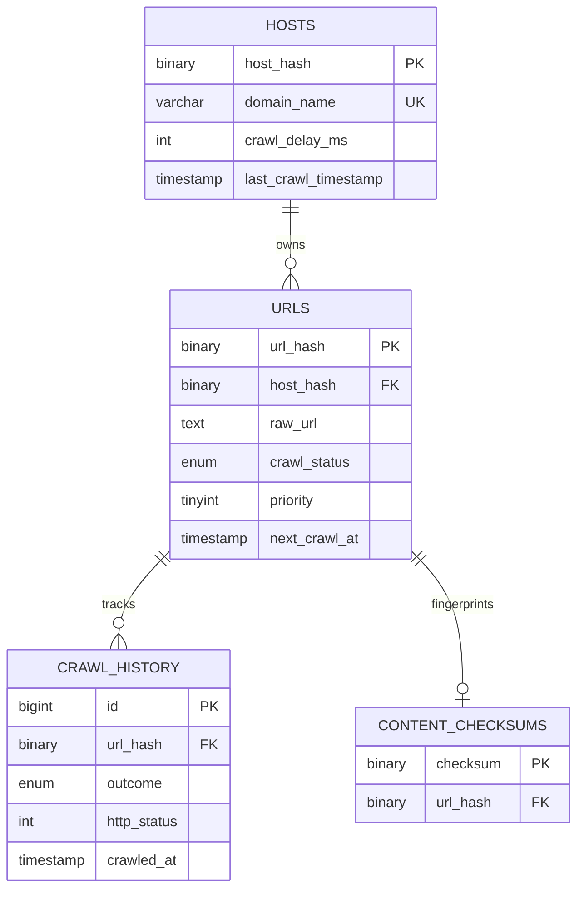
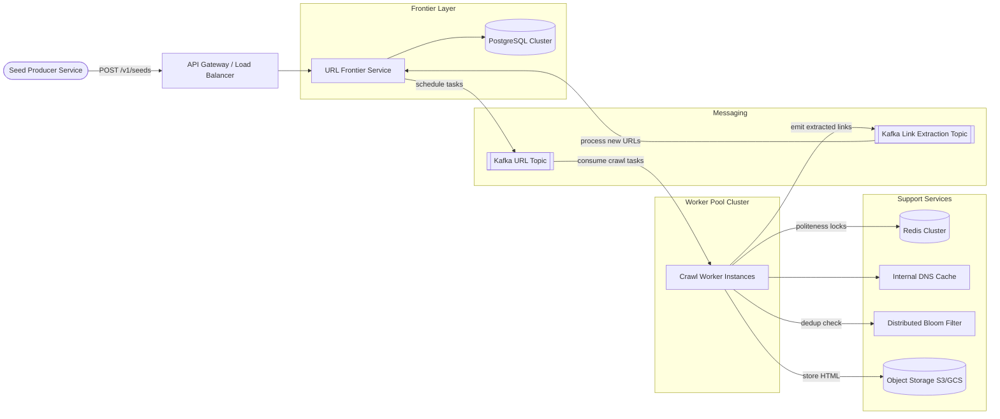
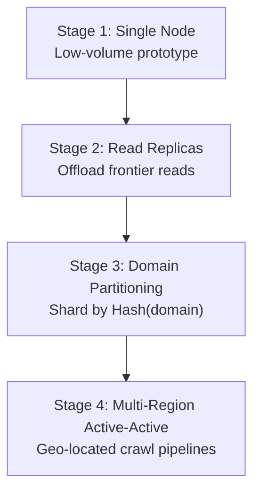

A distributed web crawler discovers, fetches, and stores billions of web pages for search indexing, archival, or analytics. At scale it is **write-intensive and throughput-bound**: the dominant cost is network I/O, politeness delays, and deduplication — not read queries. The system favors **eventual consistency** for crawl state while enforcing **strict per-domain rate limits** to avoid overloading origin servers.

This post walks through the full design — requirements, capacity math, API contracts, normalized data modeling, frontier scheduling architecture, URL hashing and Bloom-filter deduplication, technology trade-offs, caching, infrastructure sizing, and failure modes. For 50 senior-level interview follow-ups, see [Distributed Web Crawler Interview Questions](/system-design/distributed-web-crawler-interview-questions/).

---

## 1. Requirements and Goals

### Functional Requirements (MVP)

| Requirement | Description |
| :--- | :--- |
| **Seed-based discovery** | Consume a seed list of URLs to initialize the crawling loop. |
| **Recursive extraction** | Parse crawled HTML to extract internal and external hyperlinks recursively. |
| **Politeness enforcement** | Adhere to domain-level crawl delays and `robots.txt` specifications. |
| **Content / URL deduplication** | Prevent crawling duplicate URLs or storing duplicate page contents across different URLs. |
| **Priority-based scheduling** | Support varying crawl frequencies by site category (e.g. news hourly, blogs monthly). |

### Clarifying Assumptions

| Question | Assumption |
| :--- | :--- |
| Index media assets (images, videos, PDFs)? | **No** — focus on HTML page extraction and text storage only. |
| Evaluate client-side rendered JavaScript? | **No** — server-side static HTML parsing to maximize throughput. |
| Handle infinite loops (dynamic calendar pages)? | **Yes** — strict max-depth limit and per-domain crawl budget. |

### Non-Functional Requirements

| NFR | Target |
| :--- | :--- |
| **Scale** | **1 billion** unique web pages in the crawl universe |
| **Re-crawl interval** | Average **7 days** (604,800 seconds) |
| **Extensibility** | Modular parsers for HTML, PDF, JSON without redesigning the pipeline |
| **Fault tolerance** | Resilient to dead links, timeouts, DNS failures, and malformed HTML |
| **Consistency** | **Eventual consistency** for crawled pages and metadata state transitions |
| **Read / Write ratio** | **1 : 100** (heavily write-intensive on the storage tier) |

---

## 2. Back-of-the-Envelope Calculations

### Traffic Estimates

Starting from **1 billion pages**, a **7-day re-crawl interval**, and **100 KB average page size**:

| Metric | Calculation | Result |
| :--- | :--- | :--- |
| Daily crawl volume | 1B ÷ 7 days | **~142,857,142 pages / day** |
| Average write RPS | 142.9M ÷ 86,400 s | **~1,653 pages/sec** |
| Peak write RPS (3× multiplier) | 1,653 × 3 | **~4,959 pages/sec** |

### Storage

| Assumption | Calculation | Result |
| :--- | :--- | :--- |
| Daily ingestion | 142.9M × 100 KB | **~14.28 TB / day** |
| Yearly accumulation | 14.28 TB × 365 | **~5.21 PB / year** |
| URL metadata (500 B / record) | 1B × 500 B | **~500 GB** total state space |

### Bandwidth

| Path | Calculation | Result |
| :--- | :--- | :--- |
| Average write bandwidth | 1,653 pages/s × 100 KB | **~165 MB/s (~1.32 Gbps)** |
| Peak write bandwidth (3×) | 4,959 × 100 KB | **~495 MB/s (~3.96 Gbps)** |

### Messaging & Cache Sizing

| Component | Assumption | Result |
| :--- | :--- | :--- |
| Kafka link-extraction throughput | Multiple hyperlinks per page at peak | **~50,000 messages/sec** |
| Bloom filter (1B URLs, 0.1% FP rate) | Standard Bloom math | **~1.2 GB RAM** |
| Redis politeness stamps | 100K active host mappings | **~5 MB RAM** |

---

## 3. API Design

| # | Method | Path | Purpose |
| :---: | :--- | :--- | :--- |
| 1 | POST | `/v1/seeds` | Ingest Seed URLs |
| 2 | GET | `/v1/politeness/rules?domain={domain_name}` | Fetch Domain Crawl Rules |


Idempotency: `X-Idempotency-Key` header mapped in Redis to prevent duplicate batch ingestion on retries.


```json
{
  "seeds": [
    { "url": "https://example.com", "priority": 1 }
  ]
}
```



```json
{
  "status": "QUEUED",
  "batch_id": "b0811b72-3ab8-466d-89df-cc8ba4b92bdf"
}
```

| Field | Required | Notes |
| :--- | :--- | :--- |
| `url` | Yes | Must be a valid, normalized HTTP/HTTPS URL |
| `priority` | No | 1 (lowest) – 5 (highest); defaults to 3 |



{{< api-endpoint method="GET" path="/v1/politeness/rules?domain={domain_name}" desc="Fetch Domain Crawl Rules" >}}

```json
{
  "domain": "example.com",
  "crawl_delay_ms": 1000,
  "disallowed_paths": ["/admin", "/private"]
}
```



**Common HTTP error codes**

{}
| Code | Condition |
| :--- | :--- |
| `400 Bad Request` | Malformed or unparseable target URL string |
| `429 Too Many Requests` | Internal throttling on ingestion or frontier overload |
{}
---

## 4. Data Model



### `hosts`

| Column | Type | Notes |
| :--- | :--- | :--- |
| `host_hash` | `BINARY(20)` | PK — MurmurHash3 of domain name |
| `domain_name` | `VARCHAR(255)` | Unique index on raw domain string |
| `crawl_delay_ms` | `INT` | Extracted from `robots.txt` |
| `last_crawl_timestamp` | `TIMESTAMP` | Epoch tracker for domain locking |

### `urls`

| Column | Type | Notes |
| :--- | :--- | :--- |
| `url_hash` | `BINARY(20)` | PK — SHA-1 of normalized URL |
| `host_hash` | `BINARY(20)` | FK → `hosts.host_hash` |
| `raw_url` | `TEXT` | Verbatim URL string |
| `crawl_status` | `ENUM` | `DISCOVERED`, `QUEUED`, `COMPLETED`, `FAILED` |
| `priority` | `TINYINT` | 1 (lowest) – 5 (highest) |
| `next_crawl_at` | `TIMESTAMP` | Scheduled crawl readiness |

**Indexing:** composite index on `(crawl_status, next_crawl_at)` for frontier polling.

### `content_checksums`

| Column | Type | Notes |
| :--- | :--- | :--- |
| `checksum` | `BINARY(32)` | PK — SHA-256 of parsed HTML body |
| `url_hash` | `BINARY(20)` | FK → `urls.url_hash` |

### Normalization vs. Denormalization

| Strategy | Rationale |
| :--- | :--- |
| **Normalize hosts** | Isolating host metadata avoids duplicating domain strings across billions of URL rows — reduces metadata footprint by ~40%. |
| **Denormalize checksums** | Independent checksum lookup store enables cluster-wide content dedup without heavy join locks on the primary URL table. |

---

## 5. High-Level Architecture



### Crawl Pipeline

1. **Seed Producer** sends `POST /v1/seeds` through the API gateway.
2. **URL Frontier Service** normalizes URLs, checks Bloom filter + database, inserts new records, and publishes crawl tasks to the **Kafka URL topic**.
3. **Crawl Workers** consume tasks, acquire per-domain politeness locks in **Redis**, resolve DNS, fetch HTML, and store raw content in **object storage**.
4. Workers parse HTML, compute content checksums, and emit discovered links to the **Kafka link extraction topic**.
5. Frontier consumes extracted links, applies priority scheduling and dedup, and re-queues eligible URLs.

### Component Responsibilities

| Component | Role |
| :--- | :--- |
| **URL Frontier Service** | Coordinates task queues, processes incoming links, computes priority workflows |
| **Kafka clusters** | Async staging — decouples slow network I/O from scheduling |
| **Crawl Workers** | Stateless, event-driven pods executing fetch + parse |
| **Redis cluster** | Microsecond read locks for per-domain execution timestamps |
| **Object storage** | Scalable tier for raw HTML text files |
| **Distributed Bloom filter** | In-memory URL uniqueness pre-filter before database writes |

---

## 6. Core Algorithms — URL Normalization, Deduplication & Politeness

### URL Normalization

Before hashing, every URL passes through a normalization pipeline:

| Step | Action |
| :--- | :--- |
| Scheme normalization | Lowercase `http` / `https`; default to `https` when absent |
| Host normalization | Lowercase hostname; strip default ports (80, 443) |
| Path normalization | Resolve `.` and `..` segments; remove trailing slashes |
| Query stripping | Remove session IDs, tracking params (`utm_*`, `fbclid`) |
| Fragment removal | Strip `#anchor` — not sent to servers |
| Depth guard | Reject URLs exceeding **20 directory levels** |

### URL Identity — Cryptographic Hashing

| Strategy | How it works | Pros | Cons |
| :--- | :--- | :--- | :--- |
| **Snowflake ID** | Time-ordered 64-bit IDs from a coordination service | Sortable; compact | Extra network hop; no natural dedup from URL text |
| **URL hash (SHA-1 / Murmur3)** | Hash normalized URL string to fixed-width binary key | Deterministic; no ID generator dependency | Cannot recover original URL from hash alone (store `raw_url`) |

**Recommended:** SHA-1 hash of normalized URL as primary key; MurmurHash3 for host partitioning.

### Content Deduplication — Bloom Filter + Checksum

```
Worker receives link
  → Check distributed Bloom filter (URL seen?)
    → If probably seen: skip (99.9% filtered in microseconds)
    → If definitely new: insert Bloom entry + write to DB
  → After fetch: SHA-256 body checksum
    → If checksum exists in content_checksums: mark URL COMPLETED, skip storage
    → Else: write to S3 + insert checksum record
```

A Bloom filter tracking **1 billion URLs** at **0.1% false-positive rate** requires ~**1.2 GB** RAM — far cheaper than a database lookup per discovered link.

### Politeness Enforcement

Workers acquire per-domain locks via Redis atomic commands:

```
SET politeness:{host_hash} {worker_id} NX PX {crawl_delay_ms}
```

| Mechanism | Purpose |
| :--- | :--- |
| `NX` (set-if-not-exists) | Only one worker crawls a domain at a time |
| `PX` TTL | Lock auto-expires aligned to `crawl_delay_ms` from `robots.txt` |
| Fallback delay | If Redis is unavailable, default to **5 seconds** per domain in-memory |

### Infinite Loop Protection

| Guard | Limit |
| :--- | :--- |
| Max crawl depth | **20** directory levels |
| Per-domain page budget | **5,000** pages |
| Parameter stripping | Calendar/query-param loops normalized away during URL canonicalization |

---

## 7. Database Selection and Scaling

### Technology Comparison

| Component | Choice | Why choose | Why not alternatives |
| :--- | :--- | :--- | :--- |
| **Metadata state** | PostgreSQL (Citus sharding) | ACID guarantees on URL status transitions; strong indexing for frontier polling | Cassandra: weaker joins; MongoDB: document-level locking under heavy writes |
| **Message broker** | Kafka | Replayable logs; absorbs backlogged worker tasks without queue degradation | RabbitMQ: queue performance degrades under heavy pressure |
| **Coordination cache** | Redis | Native hashes and sorted sets for sliding politeness windows | Memcached: no complex data structures |
| **Content storage** | S3 / GCS | Petabyte-scale object storage; cheap per-GB | PostgreSQL BLOBs: expensive at 5 PB/year |
| **URL dedup pre-filter** | RedisBloom / distributed Bloom | Microsecond in-memory checks; decoupled from worker heap | DB lookup per link: massive I/O bottleneck |
| **Unique IDs** | URL hash fingerprints | Maps text to IDs naturally; no coordination service | Snowflake: extra network hop per URL |

### Scaling Strategy



| Stage | Trigger | Design |
| :--- | :--- | :--- |
| **1 — Single instance** | Prototype validation | Single DB + handful of workers; bottleneck is bandwidth and DB storage |
| **2 — Read replicas** | Frontier read traffic exceeds DB compute | Replicas serve dedup lookups; drawback: replication lag can fire duplicate tasks |
| **3 — Sharding** | Write metrics saturate primary | Shard URL schemas by `Hash(domain)` across Citus nodes |
| **4 — Multi-region** | Cross-continent latency slows crawls | Geo-located worker pools closer to target hosts; active-active frontier per region |

---

## 8. Caching Strategy

### Request Flow

```
Worker request
  → Check Redis politeness delay lock
  → Check local DNS cache
  → Network fetch
  → Check Bloom filter (URL dedup)
  → Store content + update DB state
```

### Cache Configuration

| Layer | Pattern | Details |
| :--- | :--- | :--- |
| **Bloom filter** | Cache-aside pre-filter | Workers check Bloom before committing URL to PostgreSQL; filters 99.9% of duplicates in microseconds |
| **Redis politeness** | Write-through lock | Domain timestamp written on every successful crawl; TTL auto-expires stale locks |
| **DNS cache** | Local in-process LRU | Workers cache resolved IPs to avoid repeated resolver round-trips |
| **robots.txt rules** | Cache-aside in Redis | Frontier caches parsed rules per domain with 24-hour TTL |

### Eviction Policy

Redis politeness records expire via explicit TTL aligned to `crawl_delay_ms`. DNS cache uses LRU with a 10,000-entry cap per worker pod.

---

## 9. Capacity Planning

Infrastructure sized for **142M daily ingestion** with 3× peak headroom:

| Component | Metric | Calculation / Assumption | Recommendation |
| :--- | :--- | :--- | :--- |
| **API / Frontier pods** | Scheduling throughput | Frontier polls + link processing | **10 pods** (2 vCPU, 4 GB RAM each) |
| **Crawl worker pods** | Peak fetch + parse | ~4,959 pages/sec at 3× | **50 pods** (4 vCPU, 8 GB RAM each) |
| **Redis cluster** | Politeness + idempotency | 100K host mappings + overhead | **3-node cluster** (high-memory instances) |
| **Bloom filter tier** | URL dedup | 1B URLs at 0.1% FP | **~1.2 GB** across distributed Bloom nodes |
| **Kafka tier** | Peak message rate | ~50K messages/sec (links + tasks) | **5 brokers** (RF=3, storage-optimized) |
| **PostgreSQL** | Metadata state | 1B rows × 500 B ≈ 500 GB | Citus-sharded cluster; Patroni failover |
| **Object storage** | Content ingestion | ~14.28 TB/day | S3/GCS with cross-AZ replication |
| **Network** | Peak bandwidth | ~495 MB/s at 3× | **~4 Gbps** egress per region |

### Autoscaling

Kubernetes HPA scales worker pods when Kafka consumer lag exceeds **50,000** unconsumed messages on the URL topic.

---

## 10. Key Design Decisions Summary

| Decision | Choice | Rationale |
| :--- | :--- | :--- |
| Crawl scope | HTML only, no JS rendering | Maximizes throughput; headless browsers are 10–100× slower |
| URL dedup | Distributed Bloom filter + DB | Filters 99.9% of duplicates in-memory before disk I/O |
| Content dedup | SHA-256 checksum table | Prevents storing identical pages under different URLs |
| Politeness | Redis `SET NX PX` per domain | Atomic distributed lock without worker-local state |
| Metadata store | PostgreSQL with Citus | ACID on status transitions; shardable at terabyte scale |
| Content store | Object storage (S3/GCS) | 5 PB/year is impractical in a relational database |
| Task queue | Kafka | Replayable; absorbs worker backlog without queue starvation |
| URL identity | SHA-1 hash of normalized URL | Deterministic; eliminates ID generator coordination |
| Consistency model | Eventual | Crawl state may lag seconds; acceptable for indexing pipelines |
| Loop protection | Max depth 20 + 5K pages/domain | Prevents calendar and pagination traps |

### Security Architecture

| Control | Implementation |
| :--- | :--- |
| API rate limiting | Token bucket at API gateway to prevent seed-flooding |
| Network isolation | Workers in sandboxed zones; egress restricted to ports 80 and 443 |
| SSRF prevention | DNS resolver blocks private IP ranges (10.0.0.0/8, 192.168.0.0/16, 127.0.0.0/8) |
| Transport | TLS 1.3 for all API traffic; encrypted object storage at rest |

### Observability Matrix

| SLI / SLO | Target |
| :--- | :--- |
| Crawl success within 2s timeout | **≥ 99.5%** of tasks |
| Kafka consumer lag | Alert when lag > 50K for 5 minutes |

| Metric | Purpose |
| :--- | :--- |
| `kafka_consumer_lag` | Worker backlog depth |
| `worker_http_failure_rate` | Origin server errors, timeouts, DNS failures |
| `db_connection_pool_utilization` | Frontier database pressure |
| `bloom_filter_false_positive_rate` | Dedup efficiency monitoring |

---

## 11. Failure Modes and Mitigations

| Failure | Impact | Mitigation |
| :--- | :--- | :--- |
| **Redis node outage** | Politeness locks unavailable | Conservative 5-second in-memory fallback delay per domain until cluster recovers |
| **DNS resolution failure** | Target URL unreachable | Mark URL `FAILED`; schedule retry via dead-letter queue with exponential backoff |
| **Kafka broker down** | Task scheduling stalls | RF=3, `min.insync.replicas=2`; workers buffer locally with back-pressure |
| **PostgreSQL primary down** | Frontier cannot update state | Patroni-driven automatic failover within seconds; workers continue fetching from queued Kafka messages |
| **Bloom filter corruption** | Duplicate crawls or missed URLs | Rebuild from PostgreSQL URL table; accept temporary duplicate fetches during rebuild |
| **Malformed HTML** | Parser crashes on single page | Isolate parse failures per URL; log and mark `FAILED`; worker continues processing |
| **Origin server overload (429/503)** | Crawl delays increase | Respect `Retry-After` headers; exponential backoff per domain |
| **Worker pod crash mid-fetch** | Partial state, possible duplicate | Kafka redelivers uncommitted messages; idempotent URL status transitions prevent double-storage |
| **S3 availability zone outage** | Content write failures | Cross-AZ replication; retry writes to alternate region endpoint |
| **SSRF via malicious DNS** | Internal network traversal | Sandboxed resolver blocks non-routable IP spaces before HTTP fetch |

---

## What's Next

Future posts in this series will cover adjacent designs — headless-browser rendering pipelines for JavaScript-heavy sites, incremental index construction from crawl output, and migration playbooks from monolithic crawlers to the distributed frontier architecture described here.
