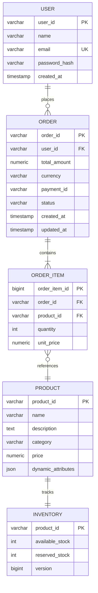
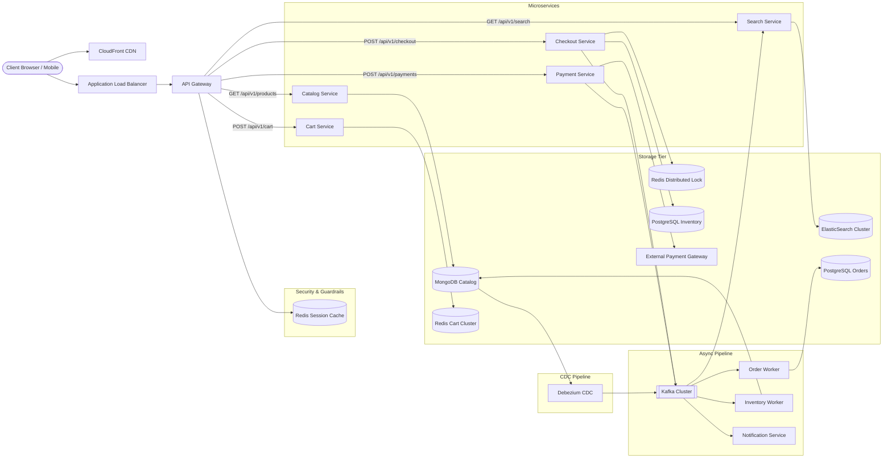
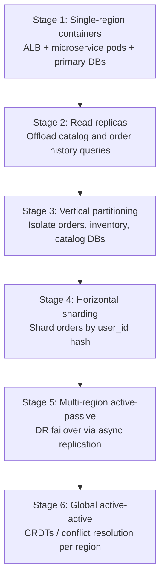

An e-commerce platform lets users search products, manage a persistent cart, check out, pay, and track orders. At scale it is **read-heavy and latency-sensitive on the browse path**, but **consistency-critical on checkout and inventory** — search and catalog browsing favor availability (AP), while order placement and stock reservation demand atomic guarantees (CP).

This post walks through the full design: requirements, capacity math, API contracts, data modeling, microservice architecture, concurrency controls, technology trade-offs, caching, and infrastructure sizing.

---

## 1. Requirements and Goals

### Functional Requirements (MVP)

| Requirement | Description |
| :--- | :--- |
| **Product catalog & search** | Search by keywords; view metadata (description, specs, images, price). |
| **Shopping cart** | Add, view, update, and remove items in a persistent cart. |
| **Checkout & order placement** | Create an order from cart items, reserve inventory temporarily, initiate payment. |
| **Payment processing** | Secure transactions via third-party gateways with deterministic success/failure. |
| **Order tracking** | Query real-time order states (Placed, Paid, Processing, Shipped). |
| **Flash sale isolation** | Handle concurrent spikes for high-demand products without overselling. |

### Premium Features

| Feature | Description |
| :--- | :--- |
| **Fuzzy search & autocomplete** | ElasticSearch-backed text lookup with facet filters. |
| **Custom shipping** | Multiple addresses, delivery slot selection. |
| **Wishlist & recommendations** | Saved items and personalized suggestions. |
| **Multi-gateway failover** | Automatic routing to a secondary payment provider on primary outage. |

### Clarifying Assumptions

| Question | Assumption |
| :--- | :--- |
| Anonymous vs authenticated cart? | **Authenticated** via JWT bearer tokens. |
| Inventory hold window? | **15 minutes** — reservation expires and rolls back. |
| Multi-warehouse inventory? | **Unified global catalog** with single-source-of-truth stock per SKU. |

### Non-Functional Requirements

| NFR | Target |
| :--- | :--- |
| **Scale** | 10M MAU; millions of global operations/day |
| **Order throughput** | ~10 orders/sec steady state; **100 orders/sec** peak (flash sale) |
| **Read / Write ratio** | **100 : 1** at sub-service level (catalog vs checkout) |
| **Latency** | Search & product view **P99 ≤ 200 ms**; checkout & order **P99 ≤ 500 ms** |
| **Availability** | **AP** for search/browse (eventual consistency acceptable); **CP** for inventory, checkout, payments |
| **Surge factor** | Horizontal scale for **10×** peak-to-trough variance |

---

## 2. Back-of-the-Envelope Calculations

### Traffic Estimates

Starting from **10M MAU** and a **30% DAU** engagement factor:

| Metric | Calculation | Result |
| :--- | :--- | :--- |
| DAU | 10M × 0.30 | **3,000,000 users/day** |
| Ops per active user | 4 search + 10 view + 2 cart + 0.05 order | **16 ops/day** |
| Total requests / day | 3M × 16 | **48,000,000 / day** |
| Read ops / day | 3M × 14 | **42,000,000 / day** |
| Write ops / day | 3M × 2.05 | **6,150,000 / day** |
| Average RPS | 48M ÷ 86,400 | **~556 RPS** |
| Peak RPS (5× skew) | 556 × 5 | **~2,778 RPS** |

### Order Throughput

| Metric | Calculation | Result |
| :--- | :--- | :--- |
| Orders / day | 3M × 0.05 | **150,000 / day** |
| Average orders/sec | 150K ÷ 86,400 | **~1.7 orders/sec** |
| Design target (steady) | Given | **10 orders/sec** |
| Peak orders/sec (flash sale) | 10× multiplier | **100 orders/sec** |

### Storage

| Dataset | Assumption | Result |
| :--- | :--- | :--- |
| Product catalog | 10M SKUs × 2 KB | **~20 GB** static |
| Orders | 150K/day × 1 KB | **~150 MB/day** (~55 GB/year) |
| Redis — hot products | Top 10% SKUs (1M × 2 KB) | **~2 GB** |
| Redis — active carts | 300K sessions × 1 KB | **~300 MB** |
| **Redis total (with overhead)** | | **~4 GB minimum** |

### Bandwidth & Event Ingestion

| Path | Calculation | Result |
| :--- | :--- | :--- |
| Average throughput | 556 RPS × 5 KB | **~2.8 MB/s (~22 Mbps)** |
| Peak throughput | 2,778 RPS × 5 KB | **~13.9 MB/s (~111 Mbps)** |
| Peak Kafka events | 100 orders/sec × 4 events/order | **~400 messages/sec** |

---

## 3. API Design

| # | Method | Path | Purpose |
| :---: | :--- | :--- | :--- |
| 1 | GET | `/api/v1/search?q={term}&category={cat}&page={n}&size={n}` | Search Catalog |
| 2 | GET | `/api/v1/products/{productId}` | Get Product Metadata |
| 3 | POST | `/api/v1/cart/items` | Add to Cart |
| 4 | POST | `/api/v1/checkout` | Initialize Checkout |
| 5 | POST | `/api/v1/payments/charge` | Process Payment |
| 6 | GET | `/api/v1/orders/{orderId}/status` | Order Status |

{{< api-endpoint method="GET" path="/api/v1/search?q={term}&category={cat}&page={n}&size={n}" desc="Search Catalog" open="true" >}}

```json
{
  "items": [
    {
      "productId": "p_9901",
      "name": "Premium Smartphone",
      "thumbnailUrl": "https://cdn.platform.com/img/p_9901_thumb.jpg",
      "price": 999.00,
      "currency": "USD"
    }
  ],
  "pagination": { "currentPage": 1, "totalPages": 45, "totalItems": 450 }
}
```



{{< api-endpoint method="GET" path="/api/v1/products/{productId}" desc="Get Product Metadata" >}}

```json
{
  "productId": "p_9901",
  "name": "Premium Smartphone",
  "description": "Flagship 5G enabled device",
  "attributes": { "color": "Graphite", "storage": "256GB" },
  "imageUrls": ["https://cdn.platform.com/img/p_9901_1.jpg"],
  "price": 999.00,
  "currency": "USD"
}
```




Headers: `Authorization: Bearer <JWT>`


```json
{ "productId": "p_9901", "quantity": 1 }
```



```json
{ "cartId": "c_5502", "userId": "u_1102", "itemCount": 3 }
```




Headers: `Authorization: Bearer <JWT>`, `X-Idempotency-Key: <UUID>`


```json
{ "cartId": "c_5502", "shippingAddressId": "addr_8801" }
```



```json
{ "orderId": "ord_7701", "totalAmount": 999.00, "status": "PENDING_PAYMENT" }
```




Headers: `X-Idempotency-Key: <UUID>`


```json
{ "orderId": "ord_7701", "paymentMethodToken": "tok_9988", "amount": 999.00 }
```



```json
{ "transactionId": "tx_4402", "orderId": "ord_7701", "status": "SUCCESS" }
```



{{< api-endpoint method="GET" path="/api/v1/orders/{orderId}/status" desc="Order Status" >}}

```json
{ "orderId": "ord_7701", "status": "CONFIRMED", "updatedAt": "2026-06-26T15:00:00Z" }
```



### Idempotency

For `/checkout` and `/payments/charge`, the API gateway stores `X-Idempotency-Key` in Redis via atomic `SETNX` with a 2-hour TTL. Duplicate requests return the cached response fingerprint instead of re-executing downstream transactions.

**Common HTTP error codes**

{}
| Code | When |
| :--- | :--- |
| `400 Bad Request` | Validation failure on request body |
| `409 Conflict` | Requested quantity exceeds available stock |
| `422 Unprocessable Entity` | Invalid payment instrument state |
| `429 Too Many Requests` | Rate limit exceeded at API gateway |
{}
---

## 4. Data Model



### PostgreSQL — Users, Orders, Inventory

**`users`** — relational customer profiles with encrypted credentials.

**`orders` + `order_items`** — normalized transactional data; ACID boundaries across payment confirmation.

**`inventory`** — isolated ledger instance with `version` column for Optimistic Concurrency Control (OCC). Constraints: `available_stock >= 0`, `reserved_stock >= 0`.

### MongoDB — Product Catalog

Collection `products` stores denormalized documents with flexible `dynamic_attributes` per category (Electronics vs Apparel). No joins at read time.

### Redis — Shopping Cart

Key pattern: `cart:{user_id}` → hash map `item:{product_id}` → `{"quantity": 2, "added_at": 178234900}`. TTL: **14 days**, reset on every mutation.

---

## 5. High-Level Architecture



### Read Path — Browse & Search

1. Static SPA assets served from **CloudFront** at the edge.
2. API requests hit **ALB → API Gateway** (JWT validation, rate limiting, idempotency).
3. **Search Service** queries **ElasticSearch** (inverted index, fuzzy match, facets).
4. **Catalog Service** reads denormalized documents from **MongoDB**; cache-aside through **Redis** on hot SKUs.

### Write Path — Checkout & Payment

1. **Cart Service** mutates in-memory state in **Redis Cart Cluster**.
2. **Checkout Service** acquires a **Redis distributed lock**, reserves stock via OCC on the **inventory ledger**, and emits `OrderCreated` to **Kafka**.
3. **Payment Service** charges via external gateway (PCI token only — no raw card data stored).
4. Saga choreography: inventory worker, payment worker, and order worker consume events independently; compensating transactions on failure.

### CDC Sync Path

**Debezium** tails MongoDB oplog → **Kafka** → ElasticSearch index updater. Sub-second search index lag without blocking catalog writes.

---

## 6. Core Algorithms — Inventory, Saga, and ID Generation

### Flash Sale — Two-Tier Stock Protection

| Tier | Mechanism | Purpose |
| :--- | :--- | :--- |
| **1 — Redis** | Lua script atomic check-and-reserve | Fast rejection of oversell at the edge |
| **2 — PostgreSQL OCC** | `UPDATE ... WHERE version = :current AND available_stock >= :qty` | Authoritative ledger; rejects concurrent stale writes |

On conflict (`affected_rows = 0`), retry with exponential backoff (max 3 attempts). Reservation hold: **15 minutes** before automatic rollback.

### Choreography-Based Saga (vs 2PC)

Checkout spans inventory, orders, and payments across separate databases. Instead of blocking Two-Phase Commit:

```
Checkout Service ── OrderCreated ──> Kafka
                                      │
                    ┌─────────────────┴─────────────────┐
                    ▼                                   ▼
          Inventory Worker                    Payment Worker
          (reserve stock)                     (process charge)
                    │                                   │
          StockReserved ──>              PaymentSuccess ──>
                    │                                   │
                    └──────── OrderConfirmed ───────────┘
```

On failure: compensating events (`StockFailed`, `PaymentFailed`) trigger rollback — increment `available_stock`, decrement `reserved_stock`.

### Transactional Outbox

Payment log and outbox event share **one ACID transaction**; Debezium tails the outbox for at-least-once Kafka delivery. [Transactional Outbox Overview](/system-design/transactional-outbox-overview/).

### ID Generation — Snowflake

| Strategy | Pros | Cons |
| :--- | :--- | :--- |
| **UUIDv4** | No coordination | Random B-Tree keys → index fragmentation |
| **Auto-increment** | Sequential | Single-node bottleneck |
| **Snowflake** | 64-bit time-sortable IDs; index-friendly | Requires clock sync across nodes |

Snowflake generates order IDs, transaction IDs, and event IDs across distributed services without a central coordinator.

---

## 7. Database Selection and Scaling

### Technology Comparison

| Domain | Choice | Alternatives rejected | Rationale |
| :--- | :--- | :--- | :--- |
| **Product catalog** | MongoDB | PostgreSQL, Cassandra | Flexible schema per category; no join penalty on reads |
| **Orders & payments** | PostgreSQL | MySQL, MongoDB | ACID, OCC, predictable query planner |
| **Inventory ledger** | PostgreSQL (isolated) | Shared DB with catalog | Prevents lock contention between browse and checkout |
| **Search index** | ElasticSearch | SQL `LIKE` | Inverted index; ms-level full-text on 10M SKUs |
| **Cart & sessions** | Redis | SQL, Memcached | Sub-ms hash ops; TTL-based eviction |
| **Event bus** | Kafka | RabbitMQ | Log compaction, replayable offsets, consumer scaling |
| **Distributed locks** | Redis Cluster | Hazelcast | Redlock, Lua scripts, built-in data structures |

### Scaling Strategy



| Phase | Trigger | Action |
| :--- | :--- | :--- |
| Read replicas | Read traffic > 70% primary CPU | Async replicas for catalog and order queries |
| DB decomposition | Cross-context table lock contention | Separate PostgreSQL instances per bounded context |
| Sharding | Order history > 1 TB or IOPS ceiling | Consistent-hash on `user_id` |
| Time-based partitioning | Orders table growth | Monthly partitions on `created_at`; archive cold data to data lake |

**PgBouncer** sits in front of PostgreSQL to multiplex connections from hundreds of microservice pods.

---

## 8. Caching Strategy

### Cache-Aside — Product Catalog

```
User Query → Check Redis → [Hit] → Return
                         → [Miss] → Query MongoDB → Hydrate Redis → Return
```

On catalog update: write MongoDB → invalidate Redis key (or short TTL).

### TTL Policy

| Data type | TTL | Eviction |
| :--- | :--- | :--- |
| Static product listings | 24 hours | `volatile-lru` |
| Real-time inventory counts | 30 seconds | `volatile-lru` |
| Shopping cart | 14 days (reset on mutation) | Redis TTL |
| Idempotency keys | 2 hours | `SETNX` + TTL |

### Stampede Protection

On cache miss for hot keys, a **distributed mutex** ensures only one pod queries MongoDB; concurrent identical requests wait for hydration.

### Sizing

| Pool | Calculation | Allocation |
| :--- | :--- | :--- |
| Hot products (top 10%) | 1M × 2 KB | ~2 GB |
| Active carts (peak hour) | 300K × 1 KB | ~300 MB |
| Structural overhead | ~2× | **~4 GB baseline** |
| Production cluster | 3 shards × (primary + replica) | **6 nodes × 8 GB = 48 GB** |

---

## 9. Capacity Planning

Target: **2,778 peak RPS** with 50 ms average processing time per request.

| Component | Metric | Calculation | Recommendation |
| :--- | :--- | :--- | :--- |
| **Microservice pods** | Peak RPS | 2,778 ÷ 20 RPS/core | **70 pods** (2 vCPU, 4 GB RAM each) |
| **Redis cluster** | Cache + locks + sessions | 48 GB with headroom | **3 shards × (1 primary + 1 replica)** |
| **Kafka brokers** | Peak event rate | ~400 msg/sec sustained | **3 brokers** (RF=3, min.insync.replicas=2) |
| **ElasticSearch** | 10M documents | Category-routed shards | **3 data nodes + 3 dedicated masters** |
| **PostgreSQL — orders** | 55 GB/year growth | PgBouncer + 1 primary + 2 replicas | Time-partitioned `orders` table |
| **PostgreSQL — inventory** | Dedicated instance | High write concurrency | Isolated from catalog traffic |
| **MongoDB** | 20 GB catalog | Replica set | 3-node cluster |
| **Network (peak)** | 2,778 RPS × 5 KB | ~111 Mbps | ALB + CDN offload for static assets |
| **HPA trigger** | CPU > 70% or queue > 150 req/pod | | Auto-scale microservice replicas |

---

## 10. Key Design Decisions Summary

| Decision | Choice | Rationale |
| :--- | :--- | :--- |
| Catalog store | MongoDB (denormalized) | Flexible per-category attributes; fast single-document reads |
| Transactional store | PostgreSQL (normalized) | ACID for orders, payments, inventory OCC |
| Inventory isolation | Dedicated PostgreSQL instance | Prevents checkout locks from slowing catalog browse |
| Search | ElasticSearch + Debezium CDC | Inverted index; async sync without blocking writes |
| Cart state | Redis hash maps | High-frequency cart mutations off disk |
| Distributed transactions | Kafka choreography saga | Non-blocking; compensating rollback vs 2PC |
| Payment security | Gateway tokenization (Stripe/Adyen) | No raw card data in our infrastructure (PCI scope reduction) |
| ID generation | Snowflake | Time-sortable 64-bit IDs; B-Tree friendly |
| Static assets | S3 + CloudFront CDN | Global edge delivery; reduced origin egress |
| Observability | Prometheus + Grafana + distributed tracing (X-B3-TraceId) | SLI/SLO monitoring; P99 latency alerts |
| Service mesh | Istio mTLS | Encrypted pod-to-pod communication |
| Analytics separation | [CQRS](/system-design/cqrs-overview/) — OLTP vs data lake (Snowflake/BigQuery) | Reporting queries never touch checkout databases |

---

## 11. Failure Modes and Mitigations

| Failure | Impact | Mitigation |
| :--- | :--- | :--- |
| **Redis cluster outage** | Lost locks, cart state, session cache | Graceful degradation: disable flash-sale features; rate-limited DB fallback for catalog; cart rebuild from last snapshot |
| **Kafka broker crash** | Async workers stall; notifications delayed | Transactional outbox buffers events locally; consumers resume from committed offsets after rebalance |
| **Primary PostgreSQL down** | Checkout and payment blocked | Patroni failover promotes replica in < 5 min; gateway switches to read-only mode with cached search results |
| **ElasticSearch cluster down** | Search unavailable; product-by-ID still works | Serve cached top queries; circuit breaker on search endpoint; CDC backlog replays on recovery |
| **Payment gateway outage** | Charges fail | Failover routing matrix to secondary provider; order stays `PENDING_PAYMENT` with reservation TTL |
| **Debezium CDC lag** | Stale search results | Monitor consumer lag; alert at > 5 s; catalog direct-lookup unaffected |
| **Availability zone failure** | Partial cluster loss | Multi-AZ pod spread; Route53 health checks redirect to surviving region |
| **Cache cold start** | Thundering herd on MongoDB | Pre-warm top 5% SKUs from analytics before traffic cutover |
| **Slow downstream service** | Thread exhaustion upstream | [Circuit breaker](/system-design/resilience-patterns-overview/) (Envoy); request timeout deadlines; fail-fast |
| **Duplicate Kafka delivery** | Double notification emails | Idempotent consumer: `SETNX` on event ID in Redis before dispatch |

### HA / DR Objectives

| Objective | Target |
| :--- | :--- |
| **RTO** | ≤ 5 minutes (traffic reroute) |
| **RPO — payments** | 0 seconds (synchronous WAL + replication) |
| **RPO — search analytics** | ≤ 10 seconds (async CDC acceptable) |
| **Availability SLO** | 99.99% non-5xx at API gateway |

---

## What's Next

Future posts will cover adjacent designs — notification delivery at scale, recommendation engines, and migrating from choreography sagas to orchestrated workflows as order complexity grows.
