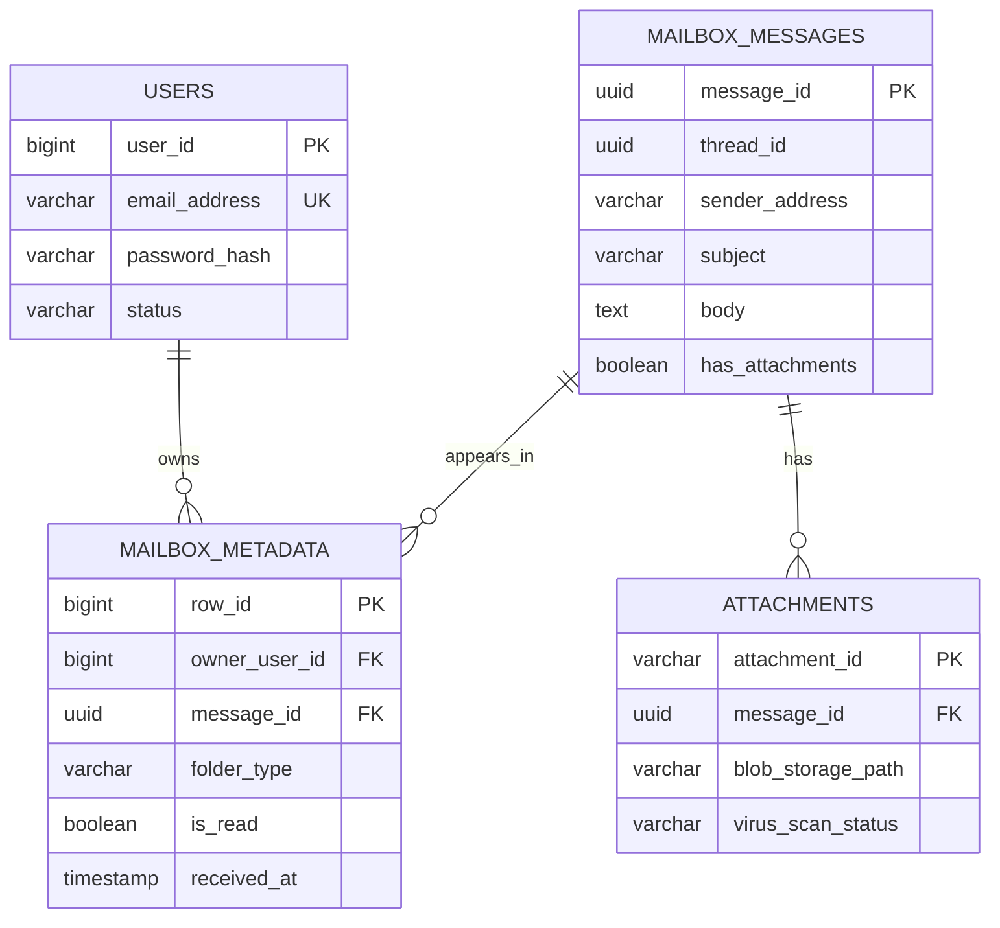
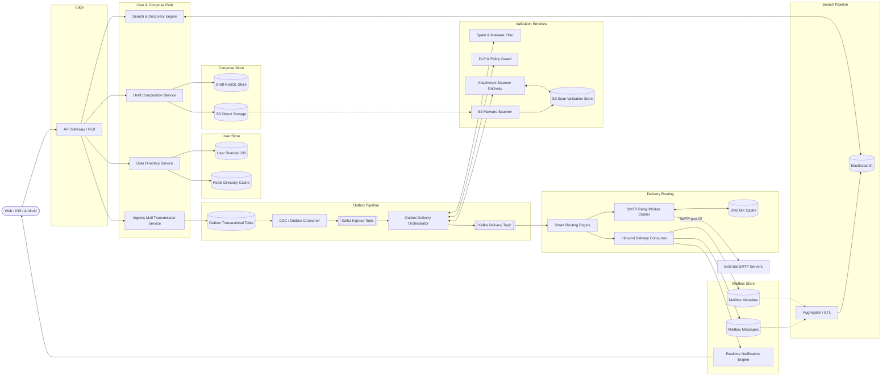
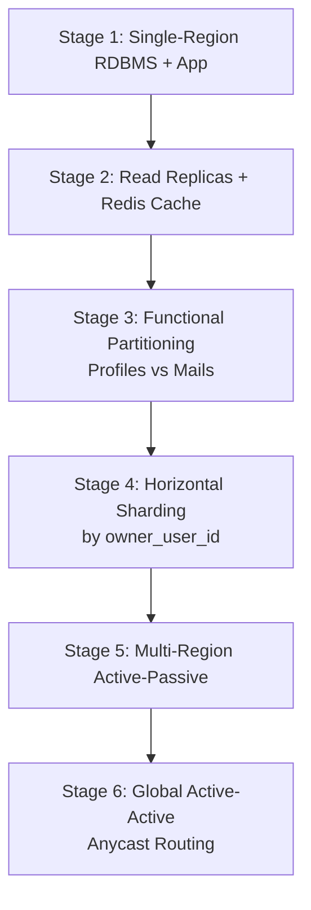

A global email platform must register unique addresses, compose and autosave drafts, deliver messages internally and to third-party domains, organize mailboxes, handle attachments, and support full-text search — all while sustaining **500M DAU** and **5 billion sent emails per day**. The system is **write-accepting on ingress** (never block composition) with **eventually consistent delivery** (a few seconds of inbox lag is acceptable), but **zero data loss** once a message leaves the outbox.

This post walks through the full design — requirements, capacity math, API contracts, denormalized mailbox schema, outbox + CDC architecture, UUIDv7 ID strategy, technology trade-offs, caching, infrastructure sizing, security, and failure modes. For senior-level interview follow-ups, see [Email Delivery Interview Questions](/system-design/email-delivery-interview-questions/).

---

## 1. Requirements and Goals

### Functional Requirements (MVP)

| Requirement | Description |
| :--- | :--- |
| **User onboarding & auth** | Register unique email addresses; handle core authentication. |
| **Compose & draft autosave** | Persist structured drafts (To, CC, BCC, Subject, Body) dynamically. |
| **Send & receive** | Orchestrate delivery internally (same domain) and externally (Outlook, Yahoo) via standard protocols. |
| **Folder structure** | Organize mail into virtual folders: Inbox, Outbox, Sent, Drafts, Trash, Spam. |
| **Rich attachments** | Upload and download binary assets (PDFs, images, documents) securely. |
| **Full-text search** | Query by keywords across subject, body, sender, and recipient fields. |
| **Thread & reply management** | Track conversational relationships for seamless thread rendering. |

### Clarifying Assumptions

| Question | Assumption |
| :--- | :--- |
| Bulk / marketing email? | **No** — transactional, user-to-user conversational mail only. Bulk traffic is throttled or routed to external dedicated pools. |
| Attachments in the database? | **No** — binary assets live in dedicated object storage; the transactional DB stores only metadata references. |
| BCC visibility? | BCC fields are **stripped at the delivery routing stage** for all recipients except the sender's own record. |

### Non-Functional Requirements

| NFR | Target |
| :--- | :--- |
| **Scale** | **1.5B total users**; **500M DAU** |
| **Onboarding consistency** | **CP** — strict global uniqueness on email handles |
| **Delivery consistency** | **AP** — accept writes immediately; eventual inbox delivery |
| **Durability** | Zero data loss for finalized messages once transitioned out of outbox |
| **Draft / ingest latency** | **≤ 200 ms** (P99) |
| **Internal delivery latency** | **≤ 2 seconds** (P99) end-to-end |
| **Payload limits** | **25 MB** max raw email size; **25 MB** max total attachment size per message |
| **Read / Write ratio** | **4 : 1** (40 received vs 10 sent per DAU/day) |

---

## 2. Back-of-the-Envelope Calculations

Starting from **500M DAU**, **10 sent + 40 received emails/user/day**, **100 KB** average structured email size, and **10%** attachment prevalence at **2 MB** average:

### Traffic Estimates

| Metric | Calculation | Result |
| :--- | :--- | :--- |
| Total transactions / day | 500M × 50 | **25 billion / day** |
| Write requests / day (sent) | 500M × 10 | **5 billion / day** |
| Read interactions / day | 500M × 40 | **20 billion / day** |
| Average write RPS | 5B ÷ 86,400 s | **~57,870 RPS** |
| Average read RPS | 20B ÷ 86,400 s | **~231,480 RPS** |
| Peak write RPS (3× avg) | 57,870 × 3 | **~173,610 RPS** |
| Peak read RPS (3× avg) | 231,480 × 3 | **~694,440 RPS** |

### Storage

| Component | Calculation | Result |
| :--- | :--- | :--- |
| Structured data / day | 5B × 100 KB | **500 TB / day** |
| Structured data / year | 500 TB × 365 | **~182.5 PB / year** |
| Attachments / day | 5B × 10% × 2 MB | **~1 PB / day** |
| Attachments / year | 1 PB × 365 | **~365 PB / year** |

### Bandwidth & Event Throughput

| Metric | Calculation | Result |
| :--- | :--- | :--- |
| Network ingress | (500 TB + 1 PB) ÷ 86,400 s | **~17.36 GB/s (~139 Gbps)** |
| Kafka events / sec (avg) | 57,870 writes × 3 pipeline steps | **~173,610 events/sec** |
| Kafka peak throughput | 173,610 × 3 | **~520,830 events/sec** |

### Cache Sizing (Directory Metadata)

| Assumption | Calculation | Result |
| :--- | :--- | :--- |
| Cached contacts per DAU | 100 entries × 128 B | — |
| Global working set | 500M × 100 × 128 B | **~6.4 TB** |

---

## 3. API Design

| # | Method | Path | Purpose |
| :---: | :--- | :--- | :--- |
| 1 | POST | `/api/v1/drafts` | Compose / Save Draft |
| 2 | POST | `/api/v1/emails/send` | Send Email |
| 3 | GET | `/api/v1/emails/search?q=Design&limit=20&offset=0` | Full-Text Search |
| 4 | POST | `/api/v1/attachments/upload-intent` | Attachment Upload Intent (Signed URL) |



```json
{
  "draft_id": "8f3b9c62-7e1a-4c8d-b903-ef123456789a",
  "to": ["recipient1@outlook.com", "recipient2@gmail.com"],
  "cc": [],
  "bcc": [],
  "subject": "System Design Deliverables",
  "body_location_type": "inline",
  "body": "Hello, please review the reverse-engineered document attached.",
  "attachment_ids": ["att-44129-99a3"]
}
```


```json
{
  "status": "SUCCESS",
  "draft_id": "8f3b9c62-7e1a-4c8d-b903-ef123456789a",
  "updated_at": "2026-06-26T16:09:00Z"
}
```




Headers: `X-Idempotency-Key: idemp-token-99124-abc`


```json
{
  "draft_id": "8f3b9c62-7e1a-4c8d-b903-ef123456789a",
  "client_timestamp": "2026-06-26T16:09:01Z"
}
```



```json
{
  "message_id": "msg-77215-992a-bc99",
  "status": "QUEUED",
  "estimated_delivery_latency_ms": 150
}
```

**Idempotency:** `X-Idempotency-Key` is tracked in Redis via atomic `SETNX` with a **24-hour TTL** to prevent duplicate sends on network retries.





```json
{
  "total_matches": 1,
  "results": [
    {
      "message_id": "msg-77215-992a-bc99",
      "sender": "pravin@gmail.com",
      "subject": "System Design Deliverables",
      "snippet": "Hello, please review the reverse-engineered document...",
      "timestamp": "2026-06-26T16:09:00Z"
    }
  ]
}
```





```json
{
  "filename": "specs.pdf",
  "content_type": "application/pdf",
  "byte_size": 5242880
}
```



```json
{
  "attachment_id": "att-44129-99a3",
  "upload_target_url": "https://s3.amazonaws.com/email-attachments/att-44129-99a3?AWSAccessKeyId=...",
  "expires_at": "2026-06-26T16:24:00Z"
}
```



**Common HTTP error codes**

{}
| Code | Condition |
| :--- | :--- |
| `400 Bad Request` | Malformed addresses; payload exceeds 25 MB |
| `409 Conflict` | Duplicate client entity operation |
| `422 Unprocessable Entity` | Virus scan failure or policy rule violation |
| `429 Too Many Requests` | Rate limiter exhaustion |
{}
---

## 4. Data Model

User onboarding uses **normalized** relational tables. Core mail storage is **denormalized** — immutable message bodies are separated from per-user mailbox metadata for efficient timeline queries.



### `users`

| Column | Type | Constraint | Notes |
| :--- | :--- | :--- | :--- |
| `user_id` | `BIGINT` | PK | Cluster surrogate identifier |
| `email_address` | `VARCHAR(255)` | UNIQUE | Global identity handle |
| `password_hash` | `VARCHAR(512)` | NOT NULL | Credential storage |
| `status` | `VARCHAR(32)` | DEFAULT `ACTIVE` | Lifecycle state |

### `mailbox_messages`

| Column | Type | Constraint | Notes |
| :--- | :--- | :--- | :--- |
| `message_id` | `UUID` | PK | Time-ordered globally unique ID (UUIDv7) |
| `thread_id` | `UUID` | INDEX | Conversational lineage |
| `sender_address` | `VARCHAR(255)` | NOT NULL | Origin mapping |
| `subject` | `VARCHAR(1024)` | NOT NULL | Search index target |
| `body` | `TEXT` | NOT NULL | Immutable textual payload |
| `has_attachments` | `BOOLEAN` | DEFAULT FALSE | Branch optimization flag |

### `mailbox_metadata`

Per-user view of a message — folder placement, read state, and timeline ordering.

| Column | Type | Constraint | Notes |
| :--- | :--- | :--- | :--- |
| `row_id` | `BIGINT` | PK | Partition-level locator |
| `owner_user_id` | `BIGINT` | FK, COMPOSITE | Mailbox ownership |
| `message_id` | `UUID` | FK | References message body |
| `folder_type` | `VARCHAR(32)` | COMPOSITE INDEX | `INBOX`, `SENT`, `SPAM`, etc. |
| `is_read` | `BOOLEAN` | DEFAULT FALSE | Unread count tracking |
| `received_at` | `TIMESTAMP` | INDEX DESC | Timeline ordering |

```sql
CREATE INDEX idx_owner_folder_time
ON mailbox_metadata (owner_user_id, folder_type, received_at DESC);
```

### `attachments`

| Column | Type | Constraint | Notes |
| :--- | :--- | :--- | :--- |
| `attachment_id` | `VARCHAR(128)` | PK | Content-deduplicated ID |
| `message_id` | `UUID` | FK INDEX | Parent message linkage |
| `blob_storage_path` | `VARCHAR(512)` | NOT NULL | Object store address |
| `virus_scan_status` | `VARCHAR(32)` | DEFAULT `PENDING` | Scan gatekeeping |

---

## 5. High-Level Architecture



### Send Path

1. Client calls `POST /api/v1/emails/send` with an idempotency key.
2. **Ingress Mail Transmission Service** writes an outbox record and updates draft status in a **single local transaction**.
3. **CDC** captures the outbox row and publishes to **Kafka Ingress Topic**.
4. **Outbox Delivery Orchestrator** runs spam, DLP, and attachment validation **in parallel** (non-blocking async tasks).
5. Sanitized events land on **Kafka Delivery Topic** for routing.

### Internal Delivery Path

1. **Smart Routing Engine** detects same-domain recipients.
2. **Inbound Delivery Consumer** dual-writes `mailbox_messages` + `mailbox_metadata` atomically.
3. **Realtime Notification Engine** pushes inbox updates via WebSocket / mobile push.

### External Delivery Path

1. **SMTP Relay Workers** resolve MX records (cached in **DNS MX Cache**).
2. Messages relay over **STARTTLS** to third-party mail servers.
3. Failed deliveries retry with exponential backoff + jitter; permanent failures after **72 hours** generate bounce notifications.

### Search Path

1. **Aggregator / ETL** streams finalized messages + metadata into flattened JSON documents.
2. **Elasticsearch** maintains inverted indexes for keyword search.
3. **Search Service** queries Elasticsearch — never the primary relational shards.

---

## 6. Core Delivery Pipeline — Outbox Pattern & ID Generation

### Transactional Outbox

The outbox pattern guarantees durability before pipeline entry:

| Step | Transaction boundary | Guarantee |
| :--- | :--- | :--- |
| Send request | Outbox insert + draft status update | Single local DB transaction |
| CDC publish | Outbox row → Kafka | At-least-once delivery with idempotent consumers |
| Internal delivery | `mailbox_messages` + `mailbox_metadata` | Atomic multi-table transaction |

### Parallel Validation Orchestrator

Validators run concurrently via async worker pools (ForkJoinPool / Go worker pools) so long-running external checks never block ingress threads:

```java
public CompletableFuture<PipelineStatus> processEmailAsync(MessageContext context) {
    List<CompletableFuture<ValidationResult>> futures = validators.stream()
        .map(v -> CompletableFuture.supplyAsync(() -> v.validate(context)))
        .collect(Collectors.toList());

    return CompletableFuture.allOf(futures.toArray(new CompletableFuture[0]))
        .thenApply(v -> ledgerRepo.commitValidationTraces(context.getMessageId(), results));
}
```

### UUIDv7 for Message IDs

| Strategy | Pros | Cons |
| :--- | :--- | :--- |
| **Auto-increment** | Simple; sequential inserts | Leaks volume; centralized bottleneck |
| **UUIDv4** | Decentralized uniqueness | Random inserts → B-tree index fragmentation |
| **Snowflake IDs** | Time-ordered; compact | Requires coordination cluster |
| **UUIDv7** ✓ | 48-bit timestamp prefix + global uniqueness; append-friendly B-trees | Slightly larger than Snowflake |

**Selected: UUIDv7** — natural time ordering without a dedicated ID coordination service.

### User-ID Sharding Key

```
Shard_ID = MurmurHash3(owner_user_id) % Total_Shards
```

Sharding by `owner_user_id` co-locates all mailbox metadata for a user on one node, enabling single-shard timeline queries without cross-node joins.

---

## 7. Database Selection and Scaling

### Technology Comparison

| Component | Choice | Why choose | Why not alternatives |
| :--- | :--- | :--- | :--- |
| **Mailbox repository** | PostgreSQL (sharded) | Relational integrity, timestamp indexing, ACID dual-writes | MongoDB: weaker transactional guarantees for folder metadata |
| **Outbox / archive logs** | Cassandra | LSM-tree append speed for high-volume immutable logs | PostgreSQL: B-tree fragmentation under log-scale writes |
| **Directory cache** | Redis (cluster mode) | Hashes, sorted sets, `SETNX` idempotency | Memcached: no rich data structures; Hazelcast: unnecessary complexity |
| **Event buffer** | Kafka | Durable replay, high ingestion, consumer parallelism | RabbitMQ: memory pressure when queues backlog |
| **Attachment storage** | S3-compatible object store | Direct client upload via pre-signed URLs; keeps DB lightweight | DB BLOBs: bloat transactional storage |
| **Search index** | Elasticsearch | Inverted indexes; millisecond keyword queries | Primary DB `LIKE` scans: unacceptable at billions of rows |
| **Message IDs** | UUIDv7 | Time-ordered; decentralized | Snowflake: extra coordination overhead |

### Scaling Strategy



| Stage | Trigger | Design |
| :--- | :--- | :--- |
| **1 — Monolith** | Initial deployment | Single-region PostgreSQL + app tier |
| **2 — Cache + replicas** | Read bottlenecks | Redis directory cache; PostgreSQL read replicas |
| **3 — Functional split** | Table space > 2 TB | Separate user profiles from mail storage |
| **4 — Sharding** | Write throughput exhausted | `MurmurHash3(owner_user_id) % N` |
| **5 — Active-passive** | Multi-continent latency | Primary region writes; async DR replica |
| **6 — Active-active** | Geo-failover SLA | Anycast routing; conflict resolution for drafts |

### High Availability & Disaster Recovery

| Metric | Target |
| :--- | :--- |
| **RTO (AZ failover)** | ≤ 30 seconds |
| **RTO (regional outage)** | ≤ 15 minutes |
| **RPO (local zone)** | 0 data loss (sync replication across AZs) |
| **RPO (multi-region)** | ≤ 1 second (async cross-region stream) |

Every tier — load balancers, app pods, storage nodes — deploys across **≥ 3 availability zones** in active N+1 configuration.

---

## 8. Caching Strategy

### Pattern: Cache-Aside (Directory & Contact Lookups)

```
Client search → Redis memory tier → [Hit: return]
                                  → [Miss: query DB shard → populate Redis]
```

| Property | Value |
| :--- | :--- |
| **Eviction** | LRU with **2-hour sliding TTL** |
| **Invalidation** | Profile or contact updates trigger immediate `DEL` |
| **Working set** | ~6.4 TB global (100 contacts × 128 B × 500M DAU) |

### Idempotency Cache (Send Path)

| Key | Operation | TTL |
| :--- | :--- | :--- |
| `idempotency:{token}` | `SETNX` on `POST /emails/send` | 24 hours |

### DNS MX Cache

Outbound SMTP workers cache MX record lookups to avoid repeated DNS resolution under high relay volume. TTL aligned to DNS provider recommendations with proactive refresh before expiry.

---

## 9. Capacity Planning

Based on **5 billion sent emails / day** (~57,870 average ingress RPS):

| Component | Metric | Calculation / Assumption | Recommendation |
| :--- | :--- | :--- | :--- |
| **Ingress & processing pods** | Peak write RPS | ~173,610 RPS | **120 pods** (2 vCPU, 4 GB RAM); HPA at 70% CPU |
| **Redis cluster** | Directory + idempotency cache | ~6.4 TB working set | **12 shard pairs** (master + replica); 1 TB safety limit per instance |
| **Kafka brokers** | Peak event throughput | ~520,830 events/sec | **15 brokers** (NVMe SSD); **≥ 48 partitions** per core topic |
| **PostgreSQL shards** | Structured writes | 500 TB/day structured | Sharded by `owner_user_id`; sync replication across AZs |
| **S3 / object store** | Attachment volume | ~1 PB/day | Multi-region buckets; lifecycle policies for cold tier |
| **Elasticsearch** | Search index growth | Derived from message volume | Dedicated cluster; index per time window with rollover |
| **Network** | Ingress bandwidth | ~139 Gbps peak | Multi-AZ NLB; CDN for attachment downloads |

---

## 10. Key Design Decisions Summary

| Decision | Choice | Rationale |
| :--- | :--- | :--- |
| Onboarding consistency | CP (strong uniqueness) | Duplicate email handles are unacceptable |
| Delivery consistency | AP (eventual) | Accept seconds of inbox lag; never block composition |
| Outbox + CDC | Transactional outbox → Kafka | Durable handoff before async pipeline |
| Attachment upload | Pre-signed S3 URLs | Keeps ingress API lightweight; avoids 25 MB request timeouts |
| BCC handling | Strip at routing stage | Privacy — recipients never see BCC list |
| Search architecture | Async ETL → Elasticsearch | Separates search load from transactional DB |
| Validation pipeline | Parallel async validators | Spam, DLP, attachment scan without blocking ingress |
| Message identity | UUIDv7 | Time-ordered; append-friendly indexes |
| Sharding key | `owner_user_id` | Single-shard mailbox timeline queries |
| Bulk email | Throttled / external pools | Protects conversational mail SLA |
| Authentication | OAuth2 + JWT | Gateway-level validation before downstream services |
| Rate limiting | Sliding window in Redis | 20 API req/sec per user; 100 sends/min outbound |
| Encryption | TLS 1.3 in transit; AES-256 at rest | Application-layer encryption for credentials |
| Observability | `X-Correlation-ID` + OpenTelemetry | End-to-end trace across Kafka and validation queues |

### Service Level Objectives

| SLI | SLO |
| :--- | :--- |
| Ingress availability | **99.99%** — API gateway accepts writes |
| Internal delivery velocity | **99%** of same-domain mail readable within **≤ 2.0 s** |
| Draft autosave latency | **P99 ≤ 200 ms** |

---

## 11. Failure Modes and Mitigations

| Failure | Impact | Mitigation |
| :--- | :--- | :--- |
| **Primary DB node down** | Writes blocked briefly | Auto-promote hot standby; buffer in Kafka during failover window |
| **Kafka cluster outage** | Pipeline stalls | Fallback to localized DLQs on persistent block storage; replay on recovery |
| **External SMTP / MX down** | Delayed external delivery | Exponential backoff + jitter; bounce after 72 hours |
| **S3 scanner lag** | Attachment validation delayed | Pre-computed scan flags in S3ValidationDB; async scan on object create |
| **Elasticsearch down** | Search unavailable | Mail read/write unaffected; queue index updates for catch-up |
| **Redis cache miss storm** | Directory lookup latency spike | Cache-aside with 2-hour TTL; proactive invalidation on updates |
| **Noisy neighbor (enterprise burst)** | Pipeline contention | Separate Kafka topics; lower-priority queue with capped workers |
| **Duplicate send retry** | Potential double delivery | `X-Idempotency-Key` + Redis `SETNX` with 24-hour TTL |
| **Regional catastrophe** | Full region unavailable | Async cross-region replication; failover within 15-minute RTO |
| **Virus scan failure** | Message blocked | Return `422`; quarantine attachment; notify sender |

---

## What's Next

Future posts in this series will cover adjacent designs — IMAP/POP3 gateway compatibility, end-to-end encryption (S/MIME, PGP), spam ML model serving at billions of messages per day, and migration playbooks from monolithic mail stores to the sharded architecture described here.
