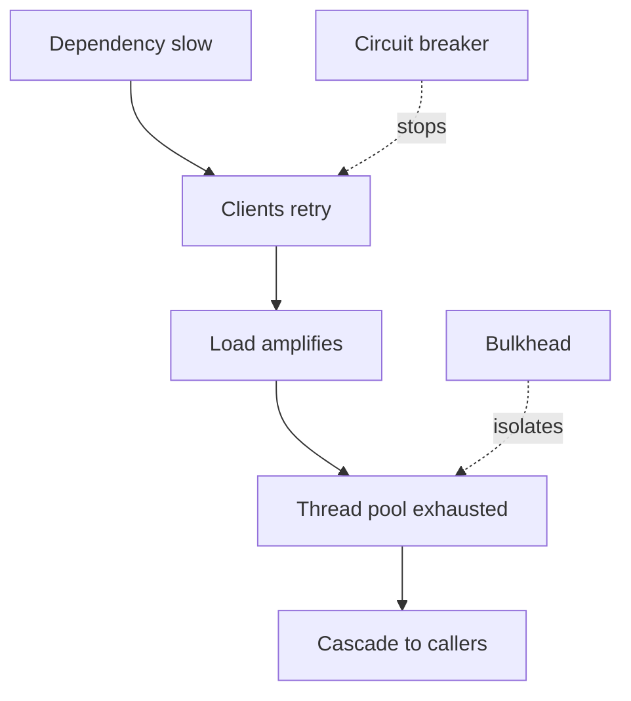

## Overview

**Failure patterns** are recurring ways distributed systems break: cascading overload, network partitions, brittle dependency chains, and regional outages.

Interviewers expect you to name **2–3 failure modes per component** and tie mitigations to [Resilience Patterns](/system-design/resilience-patterns-overview/) and [Availability & Nines](/system-design/availability-and-nines/).

Production failure catalogs and game-day drills live in Microservices **Failure Scenarios**.

---

## Why It Matters

| Undiscussed failure | Interview signal |
| :--- | :--- |
| Only happy path | Junior design |
| “We’ll add monitoring later” | No closed loop |
| No partition story | Misses CAP reality |
| Single-region only | Ignores regional SLA |

Naming patterns shows production maturity without over-explaining implementation.

---

## Core Concepts

### Failure pattern catalog

| Pattern | Mechanism | Mitigation |
| :--- | :--- | :--- |
| **Cascading failure** | Retry storm + thread exhaustion | Breaker, bulkhead, load shed |
| **Thundering herd** | Many clients hit cold cache / reset | Jitter, single-flight, warm-up |
| **Split brain** | Partition → dual primaries | Quorum, fencing, CP choice |
| **Dependency domino** | Serial chain; one slow link blocks all | Timeout, async, cache, degrade |
| **Regional outage** | AZ/region loss | Multi-AZ, multi-region, failover |
| **Data plane vs control plane** | Config server down | Cached routing, graceful degradation |
| **Poison message** | Bad event retries forever | DLQ, skip policy, alerting |
| **Hot spot overload** | Skewed key saturates shard | Salting, local aggregate — [Scaling Strategies](/system-design/scaling-strategies-overview/) |

### Cascading failure (deep dive)

1. Service B slows (GC pause, DB lock)
2. Service A threads block waiting
3. A’s callers retry → multiply load on B
4. Fleet collapses though root fault was small

**Fix stack:** timeout → limited retry → circuit breaker → bulkhead → queue/load shed.

### Network partition

Under partition, [CAP & PACELC](/system-design/cap-and-pacelc/) applies:
- **CP:** reject writes/reads to stay consistent
- **AP:** serve possibly stale data

Multi-master without conflict resolution → split-brain — [CRDTs](/system-design/crdts-and-multi-master-conflict-resolution/).

### Dependency failure modes

| Dependency type | Typical failure | Detection |
| :--- | :--- | :--- |
| Database primary | Connection refused, replication lag | Health check, lag metric |
| Cache | Eviction storm, node loss | Hit rate drop, latency spike |
| Third-party API | Rate limit, timeout | 429/5xx, breaker open |
| Message broker | Consumer lag, partition leader election | Lag alert, under-replicated partitions |

### Regional and AZ failures

| Topology | Survives | Does not survive |
| :--- | :--- | :--- |
| Single AZ | Instance failure with LB | Full AZ outage |
| Multi-AZ same region | AZ failure | Region-wide event |
| Multi-region active-active | Region loss (with caveats) | Global misconfig, schema drift |

See [Multi-Region Topologies](/system-design/multi-region-topologies-and-availability-zones/) · [SPOF & Redundancy](/system-design/single-point-of-failure-elimination-redundancy/).

### Failure vs fault (quick link)

A **fault** (bug, misconfig) may lurk until a **failure** (user-visible). [Reliability vs Availability](/system-design/reliability-vs-availability/) separates correctness from uptime.

---

## Architect Perspective

### Interview workflow per component

For each box in your diagram:

1. **Name one failure** — what breaks?
2. **User impact** — unavailable vs wrong vs slow?
3. **Detection** — metric or probe?
4. **Mitigation** — redundancy, resilience pattern, degrade?
5. **Recovery** — manual vs automated failover?

### Case study examples

| System | Failure to mention |
| :--- | :--- |
| [Notification System](/system-design/notification-system/) | Broker lag, provider timeout |
| [Chat Application](/system-design/chat-application/) | Partition, message ordering |
| [Distributed Job Scheduler](/system-design/distributed-job-scheduler/) | Leader election, duplicate execution |
| [Stock Broker](/system-design/stock-broker-trading/) | Matching engine overload |

---

## Common Mistakes

| Mistake | Fix |
| :--- | :--- |
| Only hardware failures | Software, config, dependency failures dominate |
| Failover never tested | Game days — MS failure scenarios |
| No degradation plan | Define read-only mode, stale cache OK |
| Ignore operator error | Guardrails, blast-radius limits |
| Same RTO for all tiers | Tier critical paths |

---

## Interview Questions

1. **What is a cascading failure and how do you prevent it?**
2. **What happens to your design during a network partition?**
3. **How do multi-AZ and multi-region differ for failure handling?**
4. **Name three failure modes for a cache layer.**
5. **How would you run a game day for your architecture?**

---

## Related Topics

- [Resilience Patterns Overview](/system-design/resilience-patterns-overview/)
- [Availability & Nines](/system-design/availability-and-nines/)
- [Multi-Region Topologies](/system-design/multi-region-topologies-and-availability-zones/)
- [Cache Stampede Mitigation](/system-design/cache-stampede-and-penetration-mitigation/)
- [System Design Process](/system-design/system-design-process/) — step 9 reliability strategy

---

## Deep Dive References

| Topic | Location |
| :--- | :--- |
| Failure scenarios & game days (PRIMARY) | [Microservices — Failure Scenarios](/microservices/10-production-playbook/failure-scenarios/) |
| Reliability engineering | [Microservices — Reliability Engineering](/microservices/10-production-playbook/reliability-engineering/) |

**Observability:** [Observability Fundamentals](/system-design/observability-fundamentals/) — detection loop for failure patterns
