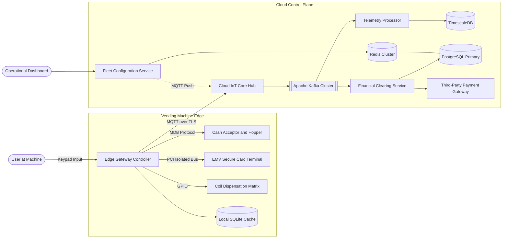
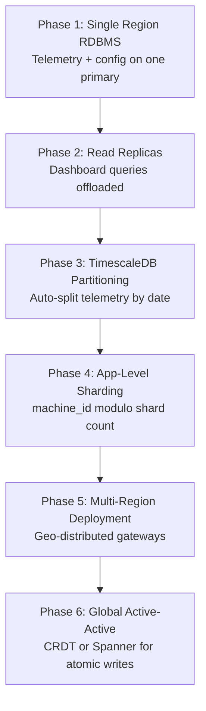

An enterprise fleet vending ecosystem spans **500,000 edge devices** across continents, each running autonomously on constrained ARM hardware with intermittent cellular backhaul. The dominant trait is **asymmetric scale**: the edge is read-heavy (constant hardware polling) and must remain **strictly consistent** for local inventory, while the cloud control plane is **write-heavy on telemetry ingestion** (~50K peak RPS) with periodic operational reads.

This post walks through the full design — requirements, capacity math, edge and cloud API contracts, dual-tier data modeling (SQLite + PostgreSQL/TimescaleDB), MQTT/Kafka ingestion architecture, state-machine concurrency on the edge, technology trade-offs, caching, infrastructure sizing, security, and failure modes. For senior-level interview follow-ups, see [Fleet Vending IoT Interview Questions](/system-design/fleet-vending-iot-interview-questions/).

---

## 1. Requirements and Goals

### Functional Requirements (MVP)

| Requirement | Description |
| :--- | :--- |
| **Item selection** | User selects items via an alphanumeric coordinate grid (e.g. `A5`). |
| **Multi-modal payment** | Accept cash, credit/debit (EMV chip, tap, magnetic stripe), and digital wallets (Apple Pay, Google Pay). |
| **Inventory & dispensation** | Mechanically dispense items and track local inventory counts in real time. |
| **Change dispensation** | Calculate and dispense physical cash change. |
| **Telemetry & alerting** | Outbound communication of hardware health, telemetry, and critical inventory states (low stock, out of change). |

### Clarifying Assumptions

| Question | Assumption |
| :--- | :--- |
| Dynamic, server-driven pricing? | **Yes** — prices change by time-of-day or local fleet configuration. |
| Card processing during cellular blackout? | **Store-and-forward** allowed up to a **$20 risk threshold**; deny offline card transactions above that limit. |
| Telemetry interval? | **Heartbeats every 30 seconds**; transactional data sent immediately if online, otherwise queued locally. |

### Non-Functional Requirements

| NFR | Target |
| :--- | :--- |
| **Edge-offline capability** | Core vending operations (cash payment, item dispensing) function locally during complete network isolation |
| **Local consistency** | High consistency for local inventory — prevent duplicate dispensing of the final unit |
| **Security & compliance** | Hardened cryptographic isolation, PCI-DSS for payments, secure firmware verification |
| **Fault tolerance** | Component degradation isolation (e.g. broken coil motor must not halt cash validation) |
| **Fleet scale** | **500,000** active units; **30M transactions/day** globally |
| **Edge read/write ratio** | **99 : 1** (constant hardware state polling vs transactional writes) |
| **Cloud read/write ratio** | **1 : 10** (heavy inbound telemetry vs periodic dashboard reads) |

### Edge Constraints

| Constraint | Value |
| :--- | :--- |
| Hardware | ARMv8 IoT gateway, embedded Linux |
| Memory | 2 GB RAM |
| Local storage | 32 GB NVMe flash |
| Network | Cellular LTE/5G — variable packet loss, high latency, intermittent total blackout |

---

## 2. Back-of-the-Envelope Calculations

### Fleet Scale Assumptions

| Assumption | Value |
| :--- | :--- |
| Active vending units | **500,000** |
| Matrix size | 10 rows × 10 columns; max **10 units/slot** |
| Max items per machine | **1,000** |
| Daily transactions per machine | **60** |
| Total daily transactions | 500K × 60 = **30 million / day** |
| Daily active interactions (DAU) | **~30 million** |

### Telemetry Volume

| Metric | Calculation | Result |
| :--- | :--- | :--- |
| Heartbeats / day | 500K × (86,400 ÷ 30) | **1.44 billion / day** |
| Average telemetry RPS | 1.44B ÷ 86,400 s | **~16,666 RPS** |
| Peak telemetry RPS (3×) | 16,666 × 3 | **~50,000 RPS** |
| Payload size | Given | **500 bytes** |
| Daily ingestion volume | 1.44B × 500 B | **~720 GB / day** |
| Yearly ingestion | 720 GB × 365 | **~262.8 TB / year** |

### Transactions & Bandwidth

| Metric | Calculation | Result |
| :--- | :--- | :--- |
| Transaction events / day | Given | **30 million / day** |
| Peak inbound bandwidth | 50,000 RPS × 500 B | **~25 MB/s (~200 Mbps)** |
| Kafka peak events/sec | Telemetry peak | **~50,000 events/sec** |

### Cloud Cache Sizing

| Assumption | Calculation | Result |
| :--- | :--- | :--- |
| Device metadata per machine | 4 KB config | — |
| Total fleet config cache | 500K × 4 KB | **~2 GB** (fits a modest Redis cluster) |

---

## 3. API Design

| # | Method | Path | Purpose |
| :---: | :--- | :--- | :--- |
| 1 | POST | `/api/v1/local/selection` | Edge — Select Item |
| 2 | POST | `/api/v1/local/payment/cash` | Edge — Process Cash Payment |
| 3 | POST | `/api/v1/fleet/transactions` | Cloud — Transaction Reconciliation |

Low-level communication between edge runtime components uses **asynchronous gRPC over Unix Domain Sockets**. External cloud APIs use REST over mTLS.



```json
{
  "coordinate": "A5"
}
```



```json
{
  "status": "AVAILABLE",
  "sku": "SKU-PROD-992",
  "price_cents": 175
}
```

| Code | Condition |
| :--- | :--- |
| `404 Not Found` | Invalid row/column coordinate |
| `410 Gone` | Slot out of stock |




Idempotency: client-generated `transaction_id` prevents duplicate coin-return runs on retry.


```json
{
  "transaction_id": "tx-edge-109273-8821",
  "inserted_cents": 200
}
```



```json
{
  "status": "PAID",
  "change_due_cents": 25,
  "idempotency_token": "idem-tok-88127391823"
}
```



### Cloud — Fleet Configuration Push (MQTT)

Devices subscribe to `fleet/{machine_id}/config`. Configuration updates are pushed from the **Fleet Configuration Service** through the IoT hub when an administrator changes machine parameters.


Asynchronous ingestion — device fires the event and tracks status locally. Cloud confirms via MQTT ack topic `fleet/{machine_id}/txn/ack`.


```json
{
  "transaction_id": "tx-edge-109273-8821",
  "machine_id": "vm-us-east-004821",
  "sku": "SKU-PROD-992",
  "payment_method": "CASH",
  "amount_cents": 175,
  "timestamp": 1782403200
}
```



```json
{
  "status": "queued",
  "snowflake_id": 8923749182736401
}
```


---

## 4. Data Model

```mermaid
erDiagram
    VENDING_FLEET ||--o{ MACHINE_INVENTORY : contains
    VENDING_FLEET ||--o{ TELEMETRY_STREAM : emits
    VENDING_FLEET {
        varchar machine_id PK
        varchar region
        varchar status
        varchar firmware_version
    }
    MACHINE_INVENTORY {
        varchar machine_id PK_FK
        varchar coordinate PK
        varchar sku
        int current_quantity
    }
    TELEMETRY_STREAM {
        bigint metric_id PK
        varchar machine_id FK
        timestamp recorded_at PK
        varchar error_code
        float core_temperature
    }
    LOCAL_INVENTORY {
        varchar coordinate PK
        varchar sku
        int quantity
        int price_cents
    }
```

### Edge — `local_inventory` (SQLite / Embedded RocksDB)

Optimized for ACID transactions, zero operational overhead, and offline durability.

| Column | Type | Constraints | Purpose |
| :--- | :--- | :--- | :--- |
| `coordinate` | `VARCHAR(3)` | PRIMARY KEY | Alpha-numeric slot key (e.g. `A5`) |
| `sku` | `VARCHAR(64)` | NOT NULL | Product identifier |
| `quantity` | `INTEGER` | CHECK (quantity >= 0) | Remaining mechanical units |
| `price_cents` | `INTEGER` | NOT NULL | Current set price |

Local writes use **IMMEDIATE transaction locks** in SQLite to prevent concurrent inventory mutations.

### Cloud — `vending_fleet`, `machine_inventory`, `telemetry_stream` (PostgreSQL + TimescaleDB)

| Table | Engine | Rationale |
| :--- | :--- | :--- |
| `vending_fleet` | PostgreSQL | Normalized fleet metadata; ACID mutations for status and firmware |
| `machine_inventory` | PostgreSQL | Cross-machine inventory visibility; composite PK `(machine_id, coordinate)` |
| `telemetry_stream` | TimescaleDB hypertable | Denormalized wide columns for high-throughput time-series ingestion |

**Index:** composite `(machine_id, timestamp DESC)` on `telemetry_stream` for instant device history graphs.

---

## 5. High-Level Architecture



### Edge Gateway Controller

Central orchestration on physical hardware. Interfaces with peripherals via **Multi-Drop Bus (MDB)** for cash acceptors, coin hoppers, and coil motors. Card terminal traffic stays on a **PCI-isolated bus** — encrypted at point of interaction (P2PE) inside the certified hardware module.

### Cloud Ingestion Path

1. Edge device publishes telemetry and transactions over **MQTT/TLS** to the managed IoT hub.
2. IoT hub routes events into **Kafka** topics (`telemetry.raw`, `transactions.events`).
3. **Telemetry Processor** writes denormalized metrics to **TimescaleDB**.
4. **Financial Clearing Service** performs ACID ledger writes to **PostgreSQL** and routes card settlements to the third-party processor.

### Configuration Path

1. Administrator updates fleet parameters via the operational dashboard.
2. **Fleet Configuration Service** writes to PostgreSQL, invalidates the Redis cache key, and pushes the update over MQTT to the target device.

---

## 6. Core Edge State Machine & Concurrency

Hardware events arrive asynchronously — a coil motor completion, a bill insertion, or a network state change can interleave. The edge controller uses a **deterministic State Pattern** with a `ReentrantLock` to serialize state mutations.




```java
public interface VendingState {
    void selectItem(String coordinate);
    void insertCash(int amountCents);
    void dispenseItem();
    void cancelTransaction();
}

public class ReadyState implements VendingState {
    private final VendingStateMachine machine;

    @Override
    public void selectItem(String coordinate) {
        if (machine.getLocalInventory().isAvailable(coordinate)) {
            machine.setCurrentCoordinate(coordinate);
            machine.transitionTo(machine.getPaymentPendingState());
        }
    }
}

public class VendingStateMachine {
    private final ReentrantLock stateLock = new ReentrantLock();
    private VendingState currentState;

    public void executeAction(Consumer<VendingState> action) {
        stateLock.lock();
        try {
            action.accept(currentState);
        } finally {
            stateLock.unlock();
        }
    }
}
```




```go
// TODO: idiomatic Go equivalent — mirror the Java snippet above
```




### Concurrency Boundaries

| Layer | Strategy |
| :--- | :--- |
| **Business logic** | State machine + `ReentrantLock` — one mutation at a time |
| **Local database** | SQLite `BEGIN IMMEDIATE` transactions for inventory decrements |
| **Hardware polling** | Dedicated single-threaded executor per serial interface (MDB loop) — no multi-access races on physical buses |
| **Cloud sync** | Async outbound queue — never blocks the dispensation hot path |

### Power-Loss Reconciliation

Infrared drop sensors at the chute bottom detect successful dispense. If a coil turns but no item breaks the beam, the controller aborts the transaction, rolls back the local inventory deduction, and reverses the payment hold. On reboot, a self-diagnostic sequence runs and uploads a stuck-item alert.

### Distributed Identifier Strategy — Snowflake IDs

| Option | Verdict |
| :--- | :--- |
| Auto-increment | Collision hazard across multi-region writers |
| UUID v4 | Index fragmentation — no temporal sorting |
| **Snowflake IDs** | **Selected** — collision-free, time-sortable 64-bit integers; high-performance B-tree indexing |

---

## 7. Database Selection and Scaling

### Technology Comparison

| Component | Choice | Why choose | Why not alternatives |
| :--- | :--- | :--- | :--- |
| **Edge store** | SQLite / RocksDB | ACID, zero ops, embedded writes on 32 GB flash | PostgreSQL: too heavy for 2 GB RAM edge nodes |
| **Cloud transactional** | PostgreSQL | Strict ACID for financial ledger records | Cassandra: no cross-row ACID for distributed ledger reconciliation |
| **Cloud telemetry** | TimescaleDB | Optimized hypertable partitioning over Postgres; minimal operational friction | Raw Postgres: vacuum lock contention at 1.44B rows/day |
| **Event buffer** | Kafka | Immutable log replay; 50K events/sec sustained | RabbitMQ: struggles with high-volume persistence and historical replay |
| **Device messaging** | MQTT over IoT Hub | Lightweight bidirectional protocol over unreliable cellular | REST polling: battery and bandwidth waste on edge |
| **Fleet config cache** | Redis | 2 GB fleet metadata fits in RAM; sub-ms reads | Memcached: no pub/sub for config push notifications |

### Scaling Strategy



| Phase | Trigger | Design |
| :--- | :--- | :--- |
| **1 — Single region** | Initial deployment | Monolithic PostgreSQL for telemetry and config |
| **2 — Read replicas** | Write replication lag; disk I/O limits on primary | Dashboard and reporting offloaded to replicas |
| **3 — TimescaleDB** | Fleet reaches ~100K devices; vacuum locks | Automatic date-range hypertable partitioning |
| **4 — App sharding** | Cross-continental latency degrades ops | Shard by `machine_id % number_of_shards` |
| **5 — Multi-region** | GDPR / data sovereignty demands | Deploy gateways in us-east-1, eu-west-1, ap-southeast-1 |
| **6 — Active-active** | Global atomic transaction guarantees | Multi-region CRDT engines or Google Spanner |

---

## 8. Caching Strategy

### Cache-Aside — Fleet Configuration (Cloud)

| Step | Action |
| :--- | :--- |
| Read | Check Redis → hit? return data |
| Miss | Query PostgreSQL → populate Redis → return |
| Write | Transactional DB write → **immediate cache invalidation** → MQTT push to device |

| Parameter | Value |
| :--- | :--- |
| Eviction policy | LRU |
| TTL | **3,600 seconds (1 hour)** for standard machine parameters |
| Cache key pattern | `fleet:config:{machine_id}` |

### Edge Local Cache

The SQLite `local_inventory` table **is** the edge cache — no separate cache layer needed. Pricing updates from the cloud merge into SQLite on MQTT receipt; until then, the last-known price serves offline transactions.

---

## 9. Capacity Planning

| Component | Metric | Calculation | Recommendation |
| :--- | :--- | :--- | :--- |
| **Telemetry Processor** | Peak RPS | 50,000 RPS; ~400 RPS/pod | **150 pods** (1 vCPU, 2 GB RAM); HPA min 50, max 300 at 70% CPU |
| **Kafka cluster** | Peak events/sec | 50,000 events/sec | **12 broker nodes** with local NVMe arrays |
| **Redis cluster** | Fleet config | ~2 GB data | **6 shards** with replica redundancy; 16 GB RAM overhead per partition |
| **TimescaleDB** | Daily ingestion | ~720 GB/day | Retention policies; compress chunks older than 7 days |
| **PostgreSQL primary** | Transaction ledger | 30M writes/day | Primary + 2 read replicas; connection pooling via PgBouncer |
| **Network inbound** | Peak bandwidth | 50K RPS × 500 B | **~200 Mbps** per cloud zone with headroom |

### Autoscaling

Kubernetes HPA on telemetry processor pods targets **70% CPU utilization**. Scale-up bounds: minimum **50 pods**, maximum **300 pods** to absorb sudden reconnection surges after cellular outages.

---

## 10. Key Design Decisions Summary

| Decision | Choice | Rationale |
| :--- | :--- | :--- |
| Edge consistency | Strict local ACID | Prevent double-dispense of final inventory unit |
| Offline card limit | Store-and-forward up to $20 | Balance revenue capture vs fraud risk during blackout |
| Cloud ingestion | Async event-driven (MQTT → Kafka) | Cellular drops make synchronous REST blocking unacceptable |
| Payment PCI scope | P2PE terminal on isolated bus | Edge controller stays out of PCI audit scope |
| Device authentication | mTLS with TPM 2.0 X.509 keys | Bidirectional trust; no inbound ports on edge |
| Firmware updates | Dual-bank flash (active/passive) | Watchdog fallback if primary OS corrupts during upgrade |
| Telemetry transport | MQTT with 30s heartbeats | Lightweight; survives intermittent connectivity |
| Cloud DB for ledger | PostgreSQL (not Cassandra) | ACID cross-row guarantees for financial reconciliation |
| Event replay | Kafka immutable log | Analytical systems recalculate past events without blocking ops |
| DR targets | RPO ≤ 1 min; RTO ≤ 15 min | Continuous WAL streaming to encrypted S3 + nightly snapshots |

### Security Architecture

| Control | Implementation |
| :--- | :--- |
| Edge network | Outbound-only connections; no public inbound ports |
| Payment isolation | EMV terminal on firewalled PCI bus; P2PE encryption in certified HSM |
| Device identity | TPM 2.0 private key; mutual TLS on all cloud traffic |
| Firmware integrity | Signed image verification before flash bank swap |
| Admin access | OAuth2 JWT on fleet management APIs; role-based machine group scoping |

### Observability Matrix

| SLI | SLO |
| :--- | :--- |
| Edge-to-cloud telemetry persistence latency | **99.9%** persisted in **≤ 500 ms** |
| Fleet administration API availability | **99.95%** over trailing 30-day window |
| API error rate | Alert when non-200 responses exceed **0.5%** over 5-minute window |

Distributed tracing via **OpenTelemetry** — `transaction_id` propagates as trace context ([Observability Fundamentals](/system-design/observability-fundamentals/)).

---

## 11. Failure Modes and Mitigations

| Failure | Impact | Mitigation |
| :--- | :--- | :--- |
| **Total edge cellular loss** | Cloud loses real-time visibility; card payments blocked above $20 | Cash operations continue locally; telemetry queues in circular log buffer on flash; low-priority debug logs dropped when disk exceeds 80% capacity |
| **Power loss mid-dispense** | Inventory drift; potential unpaid dispense | Infrared drop sensor validates dispense; rollback inventory and payment hold on sensor miss; stuck-item alert on reboot |
| **Broken coil motor** | One slot unavailable | Fault isolated per slot; cash validator and other coils continue operating |
| **100K devices reconnect simultaneously** | Connection storm overwhelms IoT hub and DB | Randomized exponential backoff with jitter on edge; connection state events routed through Kafka async consumers |
| **Kafka broker failure** | Telemetry ingestion slows | RF=3 cluster; producer retries; consumers resume from last committed offset |
| **Cloud network partition (split-brain)** | Potential conflicting writes across regions | Quorum routing — shards below majority voter count transition to **read-only** until consensus recovers |
| **Primary PostgreSQL failure** | Transaction ledger writes blocked | Automatic failover to synchronous standby; RPO ≤ 1 min via WAL streaming |
| **Redis cache miss storm** | Config reads hit PostgreSQL | Cache-aside with 1-hour TTL; immediate invalidation on admin write prevents stale config |
| **Offline card fraud attempt** | Chargeback risk above risk threshold | Hard deny above $20; store-and-forward queue capped per device; reconciliation on reconnect flags anomalies |
| **Firmware upgrade corruption** | Edge controller unbootable | Dual-bank flash with hardware watchdog; automatic fallback to secondary OS layer |

---

## What's Next

Future posts in this series will cover adjacent designs — OTA firmware rollout strategies for million-device fleets, CRDT-based inventory reconciliation after extended offline periods, and PCI scope reduction patterns for embedded payment terminals.
