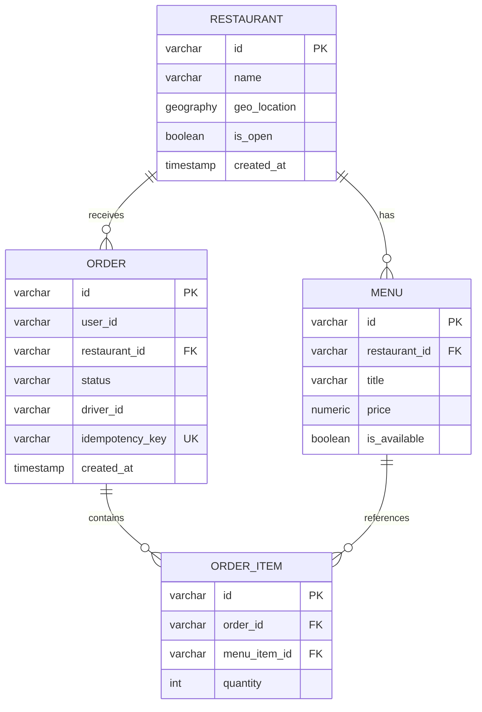
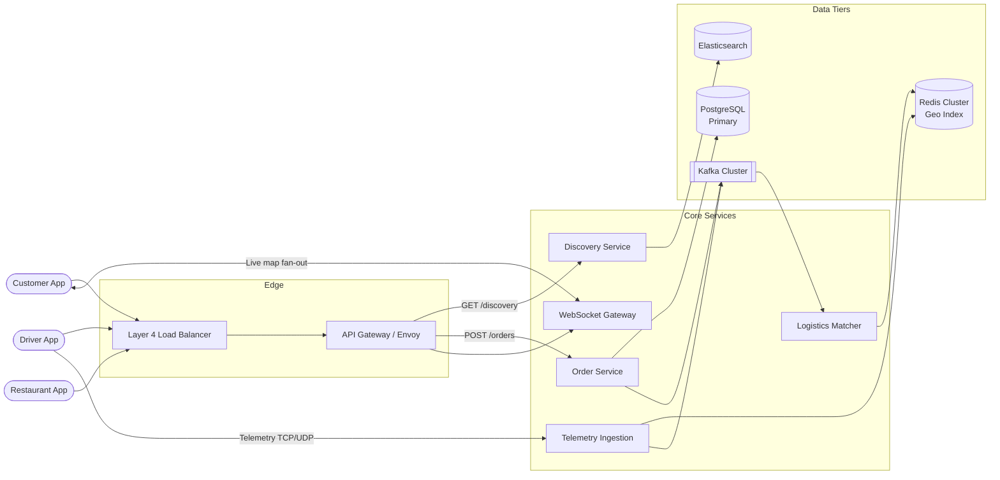
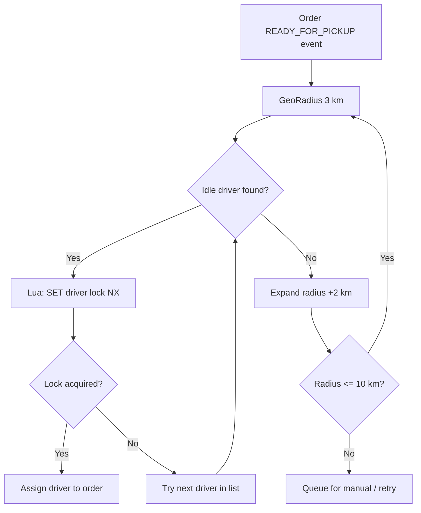
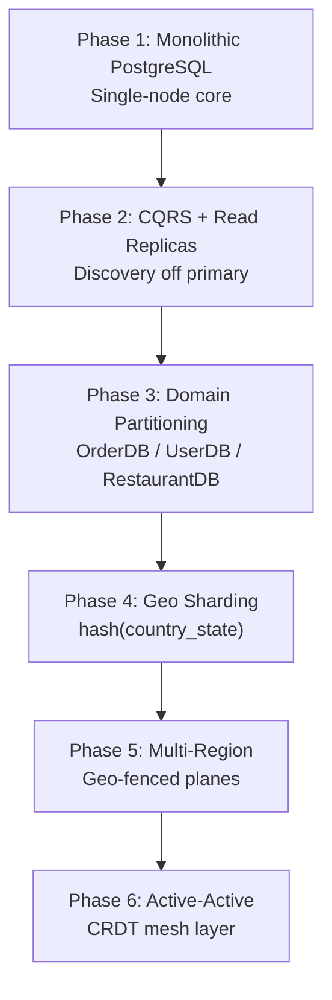
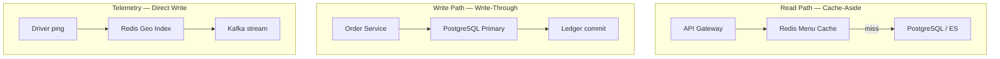

A food delivery platform connects customers, restaurants, and delivery agents in real time — browse nearby venues, build a cart, pay, track preparation, and follow live driver location on a map. At scale it is **asymmetric by path**: discovery and telemetry are **read-heavy and AP-tolerant**, while checkout, payments, and driver allocation are **CP-critical** where double-booking or ledger errors are unacceptable.

This post walks through the full design — requirements, capacity math, API contracts, data modeling, microservice topology, driver-matching algorithms, technology trade-offs, caching, infrastructure sizing, and failure modes. For 50 senior-level interview follow-ups, see [Food Delivery Interview Questions](/system-design/food-delivery-interview-questions/).

---

## 1. Requirements and Goals

### Functional Requirements (MVP)

| Requirement | Description |
| :--- | :--- |
| **Customer lifecycle** | Sign-up, login, profile management, session validation via JWT. |
| **Discovery & search** | Browse nearby restaurants within a dynamic radius (5–10 km) from live geolocation; search by restaurant metadata, cuisine, or dish name. |
| **Cart & checkout** | Multi-item, **single-restaurant** cart with strict isolation — cross-restaurant ordering is prohibited. |
| **Order & payment** | Transactional checkout with third-party payment gateway; ledgering and state-machine tracking (`PLACED` → `ACCEPTED` → `PREPARING` → `READY_FOR_PICKUP` → `DISPATCHED` → `DELIVERED` / `FAILED`). |
| **Restaurant operations** | Live order dashboard via long-polling or SSE; accept/decline orders; signal `READY_FOR_PICKUP`. |
| **Delivery logistics** | Automated driver matching by geographic proximity; ingest agent telemetry; fan-out live location to customers via WebSocket. |

### Premium Features

| Feature | Description |
| :--- | :--- |
| **Surge pricing** | Dynamic pricing in high-density hotspots (financial districts at lunch). |
| **ETA prediction** | ML model combining historical route data, live traffic, and kitchen prep signals. |
| **Promotional coupons** | Distributed-lock guarded single-use redemption. |
| **Multi-gateway payments** | Automatic failover to backup payment vendor on primary outage. |

### Clarifying Assumptions

| Question | Assumption |
| :--- | :--- |
| Multi-restaurant cart? | **No** — logistics overhead prohibits cross-restaurant orders. |
| Driver telemetry ping interval? | **5–10 seconds** — balances network load vs location fidelity. |
| Hotspot handling? | **Dynamic surge pricing** + location grouping algorithms. |

### Non-Functional Requirements

| NFR | Target |
| :--- | :--- |
| **Scale** | 50M registered customers; 1M active restaurants; 500K concurrent drivers at peak |
| **CAP profile** | **AP** for discovery, search, live location (stale-by-seconds acceptable); **CP** for checkout, ledgering, payments, state transitions |
| **Latency** | Discovery & menu rendering **P99 < 100 ms**; telemetry ingest → fan-out **< 1 s** |
| **Availability** | **99.999%** on core checkout paths via isolated execution planes and circuit breaking |
| **Read / Write ratio** | ~**50 : 1** for general platform ops; inverted to **1 : 120** for telemetry streams |

---

## 2. Back-of-the-Envelope Calculations

### Traffic Estimates

Starting from **50M registered users**, **10% DAU**, and **0.4 orders/DAU**:

| Metric | Calculation | Result |
| :--- | :--- | :--- |
| DAU | 50M × 10% | **5,000,000 / day** |
| Orders / day | 5M × 0.4 | **2,000,000 / day** |
| Browse & search ops / user | 20 reads (home feed, menu, search) | **100M reads / day** |
| Average read RPS | 100M ÷ 86,400 | **~1,157 RPS** |
| Peak read RPS (4× lunch/dinner) | 1,157 × 4 | **~4,628 RPS** |
| Average order write RPS | 2M ÷ 86,400 | **~23 RPS** |
| Peak order write RPS | 23 × 4 | **~92 RPS** |

### Telemetry Load (Scaling Bottleneck)

| Metric | Calculation | Result |
| :--- | :--- | :--- |
| Active drivers at peak | Given | **500,000** |
| Ping interval | 5 s | — |
| Telemetry ingest RPS | 500K ÷ 5 | **100,000 RPS** |
| Packet size | ~500 B (Protobuf) | — |
| Ingress bandwidth | 100K × 500 B | **50 MB/s (~400 Mbps)** |

### Storage & Events

| Metric | Calculation | Result |
| :--- | :--- | :--- |
| Order record size | ~2 KB (relational + JSON) | — |
| Daily order storage | 2M × 2 KB | **4 GB / day** |
| Annual order storage | 4 GB × 365 | **~1.46 TB / year** |
| Kafka location events/sec | Steady peak | **~100,000 / sec** |
| Order lifecycle events/sec | 8 transitions × 92 peak RPS | **~736 / sec** |

### Live Driver Index Memory

| Metric | Calculation | Result |
| :--- | :--- | :--- |
| Active driver entries | 500K | — |
| Bytes per geo entry | ~250 B | — |
| Total in-memory pool | 500K × 250 B | **~125 MB** (fits RAM; CPU for GeoRadius math drives cluster layout) |

---

## 3. API Design

### Discovery — Nearby Restaurants

**`GET /api/v1/discovery/restaurants`**

| Parameter | Type | Required | Notes |
| :--- | :--- | :--- | :--- |
| `latitude` | double | Yes | User location |
| `longitude` | double | Yes | User location |
| `radius_km` | float | No | Default `5.0` |
| `page_token` | string | No | Cursor-based pagination |

Header: `Authorization: Bearer <JWT>`

Response (`200 OK`):

```json
{
  "restaurants": [
    {
      "id": "res_88301f2a",
      "name": "Spicy Paradise",
      "latitude": 12.9716,
      "longitude": 77.5946,
      "rating": 4.7,
      "thumbnail_url": "https://cdn.platform.com/media/res_88301f2a.jpg",
      "is_open": true
    }
  ],
  "next_page_token": "eyJjdXJzb3IiOiIzIn0="
}
```

### Cart — Add / Mutate Item

**`POST /api/v1/carts`**

```json
{
  "restaurant_id": "res_88301f2a",
  "item_id": "item_99201",
  "quantity": 2
}
```

Response (`200 OK`):

```json
{
  "cart_id": "cart_bc771a3",
  "restaurant_id": "res_88301f2a",
  "items": [
    { "item_id": "item_99201", "quantity": 2 }
  ],
  "version": 1
}
```

### Order — Commit Transactional Placement

**`POST /api/v1/orders`**

Header: `X-Idempotency-Key: <uuidv4>` (required)

```json
{
  "cart_id": "cart_bc771a3",
  "payment_method_token": "pm_9921102"
}
```

Response (`201 Created`):

```json
{
  "order_id": "ord_77102f",
  "status": "PLACED",
  "created_at": "2026-06-26T15:21:00Z"
}
```

### Error Matrix

| HTTP | Code | Condition |
| :--- | :--- | :--- |
| `400` | `ERR_CART_RESTAURANT_MISMATCH` | Cross-restaurant cart item addition |
| `409` | `ERR_ORDER_IDEMPOTENT_LOCK` | Duplicate `X-Idempotency-Key` in flight |
| `422` | `ERR_PAYMENT_FAILED` | Payment gateway declined transaction |

### Idempotency Strategy

The API gateway acquires a distributed lock via Redis (`SET order_id_key value NX PX 5000`). If the key exists within the TTL window, the gateway returns the cached response or rejects concurrent duplicates. A **unique `idempotency_key` column** on `orders` provides a database-level safety net if Redis locks evict early.

---

## 4. Data Model



### Core DDL (PostgreSQL + PostGIS)

```sql
CREATE EXTENSION IF NOT EXISTS "uuid-ossp";
CREATE EXTENSION IF NOT EXISTS postgis;

CREATE TABLE restaurants (
    id VARCHAR(64) PRIMARY KEY,
    name VARCHAR(255) NOT NULL,
    geo_location GEOGRAPHY(Point, 4326) NOT NULL,
    is_open BOOLEAN NOT NULL DEFAULT TRUE,
    created_at TIMESTAMPTZ DEFAULT CURRENT_TIMESTAMP
);
CREATE INDEX idx_restaurants_geo ON restaurants USING GIST(geo_location);

CREATE TABLE menus (
    id VARCHAR(64) PRIMARY KEY,
    restaurant_id VARCHAR(64) REFERENCES restaurants(id),
    title VARCHAR(255) NOT NULL,
    price NUMERIC(12, 2) NOT NULL,
    is_available BOOLEAN NOT NULL DEFAULT TRUE
);
CREATE INDEX idx_menu_restaurant ON menus(restaurant_id);

CREATE TABLE orders (
    id VARCHAR(64) PRIMARY KEY,
    user_id VARCHAR(64) NOT NULL,
    restaurant_id VARCHAR(64) REFERENCES restaurants(id),
    status VARCHAR(32) NOT NULL,
    driver_id VARCHAR(64),
    idempotency_key VARCHAR(256) UNIQUE,
    created_at TIMESTAMPTZ DEFAULT CURRENT_TIMESTAMP
);
CREATE INDEX idx_orders_user ON orders(user_id);
CREATE INDEX idx_orders_status ON orders(status);
```

### Normalization Strategy

| Partition | Strategy | Rationale |
| :--- | :--- | :--- |
| Orders, order items | **Normalized** in PostgreSQL | Relational integrity during transactional mutations |
| Restaurant + menu cards | **Denormalized** into Elasticsearch via CDC | Offloads high-throughput text search and radial filtering from the primary DB |

---

## 5. High-Level Architecture



### Component Responsibilities

| Component | Role |
| :--- | :--- |
| **API Gateway (Envoy)** | TLS termination, JWT verification, Redis-backed rate limiting, request routing |
| **Discovery Service** | Read-heavy spatial + text queries against Elasticsearch; zero dependency on transactional DB |
| **Order Service** | Deterministic state machine; orchestrates checkout, payment, and lifecycle transitions |
| **Telemetry Ingestion** | Stateless Go daemon pipeline — receives driver pings, writes Redis geo index + Kafka |
| **Logistics Matcher** | Consumes order events; runs geo-radius driver search with atomic allocation locks |
| **WebSocket Gateway** | Event-driven (Netty/Go) persistent channels for live location fan-out to customers |

### Request Flow Summary

**Discovery (AP path):** Client → Gateway → Discovery Service → Elasticsearch → paginated restaurant list.

**Checkout (CP path):** Client → Gateway (idempotency lock) → Order Service → PostgreSQL transaction + payment gateway → Kafka order event → restaurant notification.

**Telemetry (hot path):** Driver app → Telemetry Service → Redis `GEOADD` + Kafka partition → WebSocket Gateway fans out to subscribed customers.

---

## 6. Driver Matching & Concurrency Controls

Driver allocation is the highest-contention write path after checkout. The logistics engine uses **expanding-radius geo search** with **atomic Redis Lua locks** to prevent dual allocation.



### Matching Algorithm

| Step | Detail |
| :--- | :--- |
| Initial radius | **3 km** from restaurant coordinates |
| Expansion | **+2 km** per iteration, max **10 km** |
| Candidate source | Redis `GEORADIUS` on `drivers:active:geoidx` |
| Allocation | Lua script: `SET driver:lock:{id} orderId EX 30` only if key absent |
| Fallback | Kafka last-known-location replay; zip-code static assignment during Redis outage |

### Interface Design

```java
public interface IDeliveryMatcher {
    Optional<String> matchDriver(String orderId, GeoPoint restaurantLocation);
}
```

Implementations: `RedisGeoMatcher` (production — Redis Cluster geospatial index) and `QuadTreeMatcher` (in-memory alternative for isolated regions).

### Order State Machine

```
PLACED → ACCEPTED → PREPARING → READY_FOR_PICKUP → DISPATCHED → DELIVERED
                                                              ↘ FAILED
```

State transitions are **single-writer per order** (partition key = `order_id` in Kafka) with **transactional outbox** to guarantee DB commit and event publish atomicity.

---

## 7. Database Selection and Scaling

### Technology Comparison

| Store | Use case | Why choose | Why not |
| :--- | :--- | :--- | :--- |
| **PostgreSQL** | Orders, users, ledgers | ACID cross-table transactions; complex state workflows | Horizontal write scaling requires sharding |
| **MongoDB** | — | Flexible schema | Weak multi-shard ACID for checkout |
| **Cassandra** | — | Write-heavy append | No fast relational reference checks for order workflows |
| **Redis Cluster** | Live driver geo index | Native `GEOADD` / `GEORADIUS`; sub-ms spatial ops | All data must fit in RAM |
| **Elasticsearch** | Discovery search | Text + geo + facets in one query | Eventually consistent; not for payments |
| **Kafka** | Events, telemetry buffer | Replay, high throughput, multi-consumer | Higher ops complexity than RabbitMQ |

### Decision

- **PostgreSQL (Aurora)** for transactional core — orders, payments, idempotency keys.
- **Elasticsearch** for discovery — synced via Debezium CDC, never dual-written from application code.
- **Redis Cluster** for live telemetry and driver locks — ephemeral; purge on driver offline.
- **Kafka** for order lifecycle events and telemetry fan-out — replication factor 3, `min.insync.replicas=2`.

### Scaling Strategy



| Phase | Trigger to evolve |
| :--- | :--- |
| **1 → 2** | Read performance drops during meal peaks |
| **2 → 3** | Storage limits; cross-domain locking bottlenecks |
| **3 → 4** | Peak order writes exceed single-primary capacity |
| **4 → 5** | International expansion; cross-region latency |
| **5 → 6** | Global active-active with conflict-free replicated types |

**Sharding key:** `hash(restaurant_location_country_state)` — a driver in Mumbai never services Bangalore; cross-shard queries are rare during order processing.

---

## 8. Caching Strategy



| Cache domain | Pattern | TTL | Invalidation |
| :--- | :--- | :--- | :--- |
| Menu & restaurant profiles | Cache-aside | **1 hour** | CDC event → `DEL res:menu:{id}` across cluster |
| Active driver locations | Direct write pipeline | **30 s** | No DB backup; ephemeral by design |
| Idempotency keys | Write-through at gateway | **5 s** | Auto-expire via Redis `PX` |
| Discovery results | ES query cache + CDN thumbnails | Short-lived | Restaurant status change via CDC |

### Sizing

| Pool | Estimate |
| :--- | :--- |
| Live driver geo index | 500K × 250 B ≈ **125 MB** |
| Hot menu cache (top 50K restaurants) | 50K × ~4 KB ≈ **200 MB** |
| Recommended Redis topology | **6 master + 6 read replicas** for telemetry spatial math at 100K ops/sec |

---

## 9. Capacity Planning

Target footprint for **100K telemetry RPS** and **~5K read RPS** at peak:

| Component | Metric | Assumption | Recommendation |
| :--- | :--- | :--- | :--- |
| **Telemetry Ingestion** | Peak ingest | 100K RPS | **32 pods** — 2 vCPU, 4 GB RAM each; HPA at 70% CPU |
| **Redis Geo Cluster** | Spatial ops/sec | 100K GEORADIUS + GEOADD | **6 masters + 6 replicas** on m6g.xlarge (4 vCPU, 16 GB) |
| **PostgreSQL (Aurora)** | Peak order writes | ~92 RPS + reporting | **db.r6g.4xlarge primary** + 2 identical read replicas |
| **Discovery Service** | Peak reads | ~4,628 RPS | **12 pods** — 2 vCPU, 4 GB; backed by 3-node ES cluster |
| **Order Service** | Checkout isolation | 99.999% SLO path | **8 pods** dedicated pool; circuit breaker on payment client |
| **WebSocket Gateway** | Concurrent connections | ~500K active trackers | **40 pods** behind NLB with consistent hashing |
| **Kafka** | Combined events | ~100K location + 736 order/sec | **6 brokers**, RF=3, 64 partitions on `driver.telemetry` |
| **Network (telemetry only)** | Ingress | 100K × 500 B | **~400 Mbps** dedicated telemetry VLAN |

---

## 10. Key Design Decisions Summary

| Decision | Choice | Rationale |
| :--- | :--- | :--- |
| Discovery data path | Elasticsearch via CDC | Decouples read-heavy search from transactional primary |
| Telemetry path | Dedicated ingest → Redis + Kafka | Protects disk storage from 100K RPS location writes |
| Checkout consistency | PostgreSQL + idempotency key + Redis lock | CP guarantees; defense-in-depth against double-billing |
| Driver allocation | Redis Lua atomic locks | Prevents dual allocation without 2PC across services |
| Event delivery | Transactional outbox + Debezium | Atomic DB commit and event publish |
| Order orchestration | Saga pattern with compensations | Refund + voucher on restaurant rejection without 2PC |
| Payment resilience | Circuit breaker (Resilience4j) | Fail fast when gateway latency spikes |
| Pagination | Cursor tokens | Stable O(log N) vs OFFSET scan degradation |
| Security | JWT @ gateway, mTLS mesh, AES-256 at rest | TLS 1.3 edge; KMS-managed keys |
| Rate limiting | 60 discovery/min, 2 checkout/min per user | Token bucket at gateway via Redis sidecar |
| Observability | Prometheus + OpenTelemetry + Vector | Alert if `/api/v1/orders` 5XX > 0.5% over 2 min |
| HA / DR | Patroni + etcd failover; Aurora multi-AZ | Order ledger RPO = 0; RTO < 15 s |

### Production Improvements Over Naive Designs

| Naive pattern | Production correction |
| :--- | :--- |
| Discovery queries hit PostgreSQL | Route all spatial + text search through Elasticsearch |
| Telemetry through HTTP gateway → RDBMS | Async Kafka pipeline → in-memory Redis geo index |
| Fire-and-forget microservice calls for orders | Event-driven Saga + transactional outbox |
| JSON telemetry payloads | Protobuf — ~70% smaller per frame |

---

## 11. Failure Modes and Mitigations

| Failure | Impact | Mitigation |
| :--- | :--- | :--- |
| **Redis cluster outage** | Live driver tracking lost; map updates stall | Replay last-known locations from Kafka; zip-code static fallback assignment |
| **Kafka processing backlog** | Delayed notifications and driver matching | Critical restaurant signals via fallback HTTP; scale consumers; add partitions |
| **Elasticsearch CDC lag** | Stale restaurant open/closed status | Acceptable on AP path (< few seconds); operator mutations prioritized in CDC queue |
| **Payment gateway latency spike** | Checkout threads blocked; cascading timeouts | Circuit breaker opens; fail fast with `ERR_PAYMENT_FAILED`; route to backup vendor |
| **Complete AZ outage** | ~⅓ compute + DB nodes offline | NLB reroutes to healthy AZs; Aurora promotes replica within seconds |
| **Driver network dropout** | Location gaps during transit | Mobile client buffers pings in SQLite; batch flush on reconnect |
| **Dual database master promotion** | Split-brain writes | Fencing tokens + etcd lease — only one primary claims write address |
| **Popular restaurant cache expiry** | Thundering herd on menu key | Probabilistic early refresh (XFetch); dedicated Redis read replica for hot keys |
| **GPS spoofing** | Fraudulent driver locations | Background velocity/direction sanity checks; flag unrealistic jumps |
| **Poison Kafka message** | Consumer retry loop | Dead Letter Queue + on-call alert |

### Business Continuity Targets

| Component | Replication | RPO | RTO |
| :--- | :--- | :--- | :--- |
| Order ledger core | Multi-AZ sync streaming | **0** | **< 15 s** |
| Telemetry geo index | Async master-worker | **10 s** | **< 5 s** |
| Asset blob store (S3) | Cross-region | Intermittent | **Immediate** |

---

## Interview Highlights

Condensed answers to common senior/staff-level probes. Full set of 50 questions with detailed answers: [Food Delivery Interview Questions](/system-design/food-delivery-interview-questions/).

| Question | Answer |
| :--- | :--- |
| How avoid dual driver allocation? | Redis Lua script: allocate only if `driver:lock:{id}` is absent; state IDLE → ALLOCATED atomically. |
| Why Geohash/Redis over PostGIS for telemetry? | R-Tree disk writes scale poorly at 100K updates/sec; in-memory geo ops are O(log N) per shard. |
| Why not dual-write PG and ES? | Partial failures cause permanent drift; Debezium CDC from committed WAL is the safe path. |
| Restaurant cancels after accepting? | State → `REJECTED_BY_RESTAURANT`; Kafka triggers refund Saga + logistics voucher. |
| DB schema migration without downtime? | Expand-contract: nullable column → dual-write → backfill → deprecate old column. |
| Payment gateway slow? | Circuit breaker on payment client; open breaker, fail fast, preserve order service threads. |
| Driver offline mid-delivery? | Client-side SQLite buffer; compressed batch replay on reconnect with monotonic timestamps. |
| Order written but Kafka publish fails? | Transactional outbox in same DB transaction; Debezium streams events reliably post-commit. |
| Scale WebSockets to millions? | Stateless gateway fleet + NLB consistent hashing; heartbeat disconnect at 2 min idle. |
| Protect checkout from DDoS? | AWS Shield Advanced + Cloudflare WAF at edge; strict per-user checkout rate limits. |

---

## What's Next

Future posts in this series will cover adjacent designs — multi-region active-active discovery, ETA model serving infrastructure, and order-table partitioning operations at 1.46 TB/year growth.
