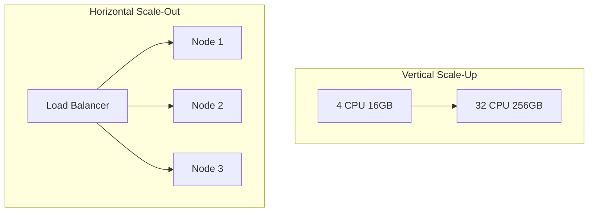

## Overview

**Vertical scaling (scale-up)** adds CPU, RAM, or disk to a single machine. **Horizontal scaling (scale-out)** adds more machines and distributes work across them.

Stateless application tiers scale out easily. Stateful data tiers hit vertical limits first, then need replication, partitioning, or sharding.

This page is the System Design **overview**. Production playbooks for replica topologies, shard migrations, and hot-key mitigation live in Microservices.

---

## Why It Matters

| Wrong choice | Cost |
| :--- | :--- |
| Scale-up a DB past hardware ceiling | Emergency rewrite to sharding |
| Scale-out stateful app without sticky sessions | Broken user state, duplicate writes |
| Horizontal pods without load balancer | Uneven traffic, wasted capacity |
| Ignore single-node limits | 64-core monster still one failure domain |

Pair scaling dimension with [Latency vs Throughput](/system-design/latency-vs-throughput/) — more machines raise throughput ceiling; per-request latency still depends on architecture.

---

## Core Concepts

### Comparison matrix

| Dimension | Vertical (scale-up) | Horizontal (scale-out) |
| :--- | :--- | :--- |
| **Mechanism** | Bigger instance | More instances |
| **Stateless app tier** | Works until one box maxed | **Preferred** — add pods behind LB |
| **Database** | First lever (bigger disk/RAM) | Replicas, then shards |
| **Cost curve** | Expensive at top end | Linear with commodity hardware |
| **Failure domain** | Single node = SPOF | Smaller blast radius per node |
| **Deploy complexity** | Low | Needs discovery, LB, health checks |
| **Data consistency** | Single node = simple ACID | Distributed consistency trade-offs |
| **Upper bound** | Hardware SKU limit | Theoretical cluster size (ops cost) |

### Typical scaling path by tier

| Tier | First move | Second move | Third move |
| :--- | :--- | :--- | :--- |
| **Web / API** | Vertical (small) | Horizontal + LB | Auto-scale on CPU/RPS |
| **Cache** | Vertical RAM | Horizontal cluster | Consistent hashing |
| **Database reads** | Vertical IOPS | Read replicas | — |
| **Database writes** | Vertical until limit | Partition / shard | Async ingestion |
| **Object storage** | N/A (already distributed) | CDN edge | — |

### Stateless vs stateful

| Stateless | Stateful |
| :--- | :--- |
| Any instance can serve any request | Session, local disk, or primary DB affinity |
| Scale out with round-robin / least-conn | Sticky sessions, leader election, or externalized state |
| Examples: REST handlers, rate limiter gateways | DB primary, Redis primary shard, local cache |

**Rule:** Externalize session state (Redis, JWT) before scaling app tier horizontally.

### Database vertical limits

Before sharding, teams usually exhaust:

1. **Vertical scale** — larger instance, faster disk
2. **Read replicas** — offload SELECT — [Replication Lag & Read Replicas](/system-design/replication-lag-read-replica-topology/)
3. **Caching** — hot key absorption — [Caching & CDNs](/system-design/caching-and-cdns-hierarchical-arrays/)
4. **Sharding** — write path partition — [Database Sharding](/system-design/database-sharding-provisioning-and-chunk-routing/)

Synchronous replication **does not** scale writes horizontally — each replica adds write-path latency.

### When to choose which

| Choose vertical when | Choose horizontal when |
| :--- | :--- |
| Early product, low ops headcount | Proven load, SRE capacity |
| Single-node DB under write cap | Stateless tier needs 10× RPS |
| Quick win before architecture change | Fault isolation required |
| License per socket (legacy) | Cloud auto-scale economics |

---

## Architect Perspective

### Interview framework

1. **Identify the bottleneck tier** — app, cache, or DB
2. **State if tier is stateless** — determines scale-out feasibility
3. **Describe escalation ladder** — vertical → replicas → cache → shard
4. **Name trade-off** — simplicity vs ceiling vs ops cost
5. **Link to NFR** — latency SLO may forbid sync replica chains

### Auto-scaling triggers (horizontal)

| Signal | Scale action |
| :--- | :--- |
| CPU > 70% sustained | Add app instances |
| p99 latency > SLO | Add capacity or fix slow dependency |
| Queue depth growing | Add consumers |
| DB connections saturated | Pool tuning or read replicas |

Full strategy catalog: [Scaling Strategies Overview](/system-design/scaling-strategies-overview/).

---

## Common Mistakes

| Mistake | Fix |
| :--- | :--- |
| Scale app without scaling DB | DB becomes bottleneck; replicas or cache first |
| Horizontal scale without health checks | Traffic to dead nodes |
| Sharding before replicas | Replicas are cheaper for read-heavy |
| Ignoring connection pool limits | 100 pods × 50 DB conns = exhaustion |
| Scale-up as only strategy | Plan shard key before emergency |

---

## Interview Questions

1. **What is the difference between horizontal and vertical scaling?**
2. **Why do stateless services scale out more easily than databases?**
3. **When would you scale up a database instead of sharding?**
4. **What happens when you add synchronous replicas to improve read scale?**
5. **How does consistent hashing relate to horizontal cache scaling?**
6. **Your API tier auto-scales but p99 latency worsens — what next?**

---

## Related Topics

- [Latency vs Throughput](/system-design/latency-vs-throughput/) — SLOs after scaling
- [Scaling Strategies Overview](/system-design/scaling-strategies-overview/) — full escalation ladder
- [Load Balancers & Routing](/system-design/load-balancers-and-routing-algorithms/) — distribute horizontal instances
- [Consistent Hashing](/system-design/consistent-hashing/) — minimal reshuffle on node add/remove
- [Single Point of Failure & Redundancy](/system-design/single-point-of-failure-elimination-redundancy/) — why horizontal helps availability

---

## Deep Dive References

| Topic | Location |
| :--- | :--- |
| Scalability patterns (PRIMARY) | [Microservices — Scalability Patterns](/microservices/10-production-playbook/scalability-patterns/) |
| Multi-region scale | [Multi-Region Topologies](/system-design/multi-region-topologies-and-availability-zones/) |

**Reliability:** [Availability & Nines](/system-design/availability-and-nines/)
