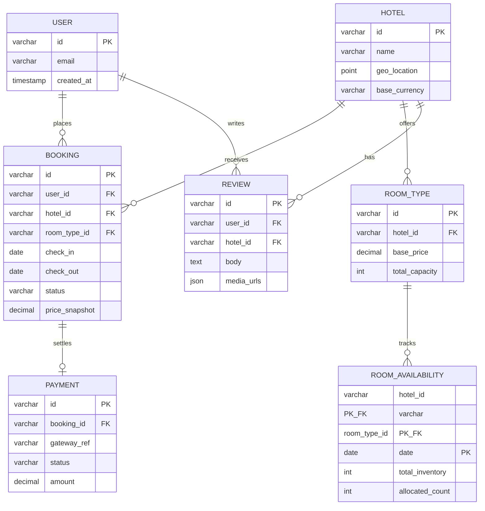
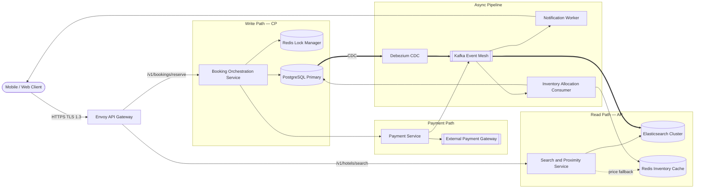
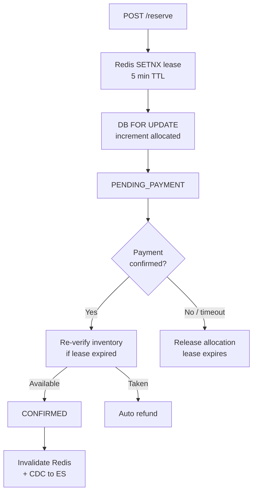
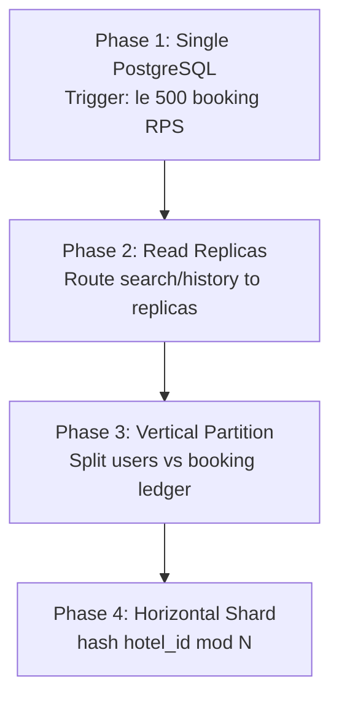
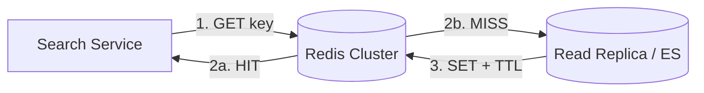

A hotel booking platform lets travelers discover properties by proximity, browse room inventory, reserve rooms in real time, pay through an external gateway, and review past stays. At scale it is **asymmetric by path**: search and discovery favor **availability over strict consistency** (AP), while booking and inventory control demand **strong consistency** (CP) — a double-booked room is never acceptable.

This post walks through the full design: requirements, capacity math, API contracts, data modeling, CQRS architecture, concurrency controls, technology trade-offs, caching, infrastructure sizing, and failure modes.

---

## 1. Requirements and Goals

### Functional Requirements (MVP)

| Requirement | Description |
| :--- | :--- |
| **Proximity search** | Find hotels by geolocation, name, and date range within a configurable radius. |
| **Inventory & booking** | Browse room types, check real-time availability, select rooms, and execute bookings. |
| **Payment integration** | Two-phase booking workflow coordinating with an external payment gateway. |
| **Historical archive** | Paginated list of past bookings per user. |
| **Reviews** | Submit textual and media-rich reviews per hotel. |

### Clarifying Assumptions

| Question | Assumption |
| :--- | :--- |
| Inventory granularity? | **Room types** (Deluxe, Standard) — not individual physical room rows. Reduces lock contention. |
| Maximum booking window? | **365 days** in advance. |
| Flash pricing propagation? | Dynamic price changes reach search/cache layers within **< 5 seconds**. |

### Non-Functional Requirements

| NFR | Target |
| :--- | :--- |
| **Scale** | **15M DAU**; **1M** active hotel listings; ~50 room types per hotel |
| **Search / view latency** | **P99 ≤ 150 ms** |
| **Booking mutation latency** | **P99 ≤ 500 ms** |
| **Consistency** | **AP** for search/discovery (eventual consistency on prices/availability display); **CP** for booking/inventory (no double-booking) |
| **Search-to-book ratio** | **30 : 1** (30 searches or inventory checks per successful booking) |
| **Availability SLO** | **99.95%** successful responses over rolling 30 days |

---

## 2. Back-of-the-Envelope Calculations

### Traffic Estimates

Starting from **15M DAU** and a **30:1 search-to-book ratio**:

| Metric | Calculation | Result |
| :--- | :--- | :--- |
| Daily bookings | 15M ÷ 10 | **1,500,000 / day** |
| Search & view requests / day | 1.5M × 30 | **45,000,000 / day** |
| Total requests / day | 45M + 1.5M | **46,500,000 / day** |
| Average RPS | 46.5M ÷ 86,400 | **~538 RPS** |
| Peak RPS (5× surge) | 538 × 5 | **~2,691 RPS** |
| Peak booking write RPS | (1.5M × 5) ÷ 86,400 | **~87 WPS** |

### Storage

| Dataset | Calculation | Result |
| :--- | :--- | :--- |
| Booking records | 1.5M/day × 500 B | **750 MB/day** (~274 GB/year) |
| Inventory (per-day rows) | 1M hotels × 50 types × 365 days × 64 B | **~1.16 TB** hot storage |
| Inventory (compressed date-ranges) | ~85% row reduction | **~175 GB** |

> **Design choice:** compressed date-range rows (Approach 2) are preferred at this scale — per-day pre-allocation (Approach 1) creates 18.25 billion mutable rows.

### Bandwidth

| Assumption | Calculation | Result |
| :--- | :--- | :--- |
| Avg search payload | 20 KB | — |
| Peak egress | 2,691 RPS × 20 KB | **~54 MB/s (~431 Mbps)** |

### Cache & Event Throughput

| Component | Calculation | Result |
| :--- | :--- | :--- |
| Redis hot inventory (30-day window) | 1M × 50 × 30 × 32 B | **~48 GB** (+ 3× replication ≈ **144 GB**) |
| Kafka peak events | 87 WPS × 4 fan-outs | **~348 events/sec** |

---

## 3. API Design

| # | Method | Path | Purpose |
| :---: | :--- | :--- | :--- |
| 1 | GET | `/v1/hotels/search` | Proximity Search |
| 2 | POST | `/v1/bookings/reserve` | Reserve Room (Two-Phase Booking) |


| Parameter | Type | Required | Notes |
| :--- | :--- | :--- | :--- |
| `latitude` | double | Yes | Target coordinate |
| `longitude` | double | Yes | Target coordinate |
| `radius_km` | int | No | Default **10**; max **50** (rejected at edge if exceeded) |
| `check_in` | ISO 8601 date | Yes | Stay start |
| `check_out` | ISO 8601 date | Yes | Stay end |
| `page_token` | string | No | Opaque cursor for stateless pagination |


```json
{
  "data": [
    {
      "hotel_id": "htl_99a8b7c6",
      "name": "Grand Horizon Resort",
      "coordinates": { "lat": 17.3850, "lng": 78.4867 },
      "base_currency": "USD",
      "starting_price": 145.00,
      "thumbnail_url": "https://cdn.platform.com/media/htl_99a8b7c6/thumb.jpg"
    }
  ],
  "next_page_token": "eyJvZmZzZXQ6MTAwLCJsaW1pdCI6MTB9"
}
```

Cursor pagination avoids `OFFSET` scans — lookups stay **O(log N)** via index seek instead of **O(N)** discard.




Headers:

| Header | Required | Notes |
| :--- | :--- | :--- |
| `Idempotency-Key` | Yes | UUIDv4 — prevents double charge on retries |
| `Authorization` | Yes | Bearer JWT (RS256) |


```json
{
  "hotel_id": "htl_99a8b7c6",
  "room_type_id": "rm_deluxe_01",
  "check_in": "2026-07-10",
  "check_out": "2026-07-15",
  "guest_count": 2
}
```



```json
{
  "booking_id": "bkg_77e6f5a4",
  "status": "PENDING_PAYMENT_VERIFICATION",
  "lease_expires_at": "2026-06-26T15:23:00Z"
}
```



### Error Matrix

| Status | Code | Condition |
| :--- | :--- | :--- |
| `400` | `ERR_INVALID_DATE_RANGE` | `check_out` before `check_in` |
| `409` | `ERR_INVENTORY_EXHAUSTED` | No rooms available for date window |
| `429` | `ERR_RATE_LIMIT_EXCEEDED` | Token bucket exhausted per user fingerprint |

### Idempotency Protocol

1. Gateway extracts `Idempotency-Key`.
2. Lookup `idempotency:bkg:{key}` in Redis — if hit, return cached response verbatim.
3. On miss, `SETNX` lock with **120 s** lease; process once; cache result.
---

## 4. Data Model



### `hotels`

| Column | Type | Notes |
| :--- | :--- | :--- |
| `id` | `VARCHAR(32)` | PK — prefix `htl_` |
| `name` | `VARCHAR(255)` | Indexed for text search (mirrored to ES) |
| `geo_location` | `POINT` | **SPATIAL INDEX** for bounding-box queries |
| `base_currency` | `VARCHAR(3)` | ISO 4217 |

### `room_availability`

| Column | Type | Notes |
| :--- | :--- | :--- |
| `hotel_id`, `room_type_id`, `date` | Composite PK | One row per type per day (or compressed range) |
| `total_inventory` | `INT` | Capacity baseline |
| `allocated_count` | `INT` | Active bookings; **CHECK (allocated_count ≤ total_inventory)** |

### Normalization Strategy

| Store | Role |
| :--- | :--- |
| **PostgreSQL** | Normalized 3NF ledger — bookings, availability, payments (ACID) |
| **Elasticsearch** | Denormalized flat JSON of hotels + room types for sub-ms faceted search |

Writes go to PostgreSQL only; **Debezium CDC** syncs to Elasticsearch — no application-level dual-write.

---

## 5. High-Level Architecture



### Read Path — Search & Discovery

1. Client queries `/v1/hotels/search` with lat/lng, dates, and optional cursor.
2. **Search Service** runs geohash + facet query against **Elasticsearch** (H3 hex cells for spatial indexing).
3. Starting prices and availability counts read from **Redis** cache (eventual consistency acceptable).
4. On cache miss, hydrate from read replica or ES document fields.

### Write Path — Reservation

1. Gateway validates JWT and idempotency key.
2. **Booking Orchestration Service** acquires Redis lease (`lock:room:{id}:date:{val}`, **5 min TTL**).
3. Opens DB transaction with `SELECT ... FOR UPDATE` on `room_availability` rows for the stay window.
4. If capacity exists, increments `allocated_count`, inserts booking with `PENDING_PAYMENT_VERIFICATION`.
5. Commits via **transactional outbox** — event row written in same transaction, forwarded to Kafka by outbox daemon.
6. Returns `202` with `lease_expires_at`.

### Payment Confirmation

1. **Payment Service** calls external gateway; on success publishes state-change event.
2. Consumer confirms booking → `CONFIRMED`; on timeout/failure → rollback allocation via compensating transaction.
3. If Redis lease expired but payment arrives late, **re-verify inventory under `FOR UPDATE`** before confirm; otherwise trigger refund.

---

## 6. Reservation Concurrency & Idempotency

### Pessimistic Locking Pattern

```sql
BEGIN;

SELECT total_inventory, allocated_count
FROM room_availability
WHERE hotel_id = 'htl_99a8b7c6'
  AND room_type_id = 'rm_deluxe_01'
  AND date BETWEEN '2026-07-10' AND '2026-07-15'
FOR UPDATE;

-- If (total_inventory - allocated_count) >= 1:
UPDATE room_availability
SET allocated_count = allocated_count + 1
WHERE hotel_id = 'htl_99a8b7c6'
  AND room_type_id = 'rm_deluxe_01'
  AND date BETWEEN '2026-07-10' AND '2026-07-15';

COMMIT;
```

| Design choice | Rationale |
| :--- | :--- |
| **READ COMMITTED** + `FOR UPDATE` | SERIALIZABLE causes excessive rollbacks under flash-sale contention |
| **Room-type aggregation** | One lock row per type per day — not per physical room |
| **Sorted key locking** | Application sorts reservation keys before locking — prevents deadlocks on multi-room bookings |
| **Optimistic concurrency rejected** | High abort/retry rates on last-room scenarios waste CPU and degrade UX |

### Two-Phase State Machine



### Transactional Outbox

Booking mutation and outbound Kafka event are written in **one database transaction** to an `outbox` table. A log-tailing daemon publishes to Kafka after commit — eliminates dual-write partial-failure drift.

---

## 7. Database Selection and Scaling

### Technology Comparison

| Database | Why choose | Why not |
| :--- | :--- | :--- |
| **PostgreSQL** | ACID, `FOR UPDATE`, FK integrity, CHECK constraints | Vertical ceiling; sharding adds join complexity |
| **MongoDB** | Horizontal document scale | Multi-document transactions unstable under heavy concurrent inventory loads |
| **Cassandra** | Global write scale | No cross-row transactions — double-booking risk |

### Proximity Index Strategy

| Approach | Verdict |
| :--- | :--- |
| **Elasticsearch geohash + H3** | **Selected** — combines spatial + full-text + facets in one query |
| Custom quad-tree in memory | High operational burden; poor multi-attribute filtering |
| PostGIS on PostgreSQL | Strains DB CPU under concurrent full-text + geo load |

### Distributed Locks

| Approach | Verdict |
| :--- | :--- |
| **Redis SETNX lease** | **Selected** — sub-ms; short TTL tolerates rare failover edge cases |
| ZooKeeper | Strong CP consensus but adds latency that caps booking throughput |

### Scaling Roadmap



| Phase | Trigger | Strategy |
| :--- | :--- | :--- |
| 1 | ≤ 500 booking RPS | Single high-spec primary |
| 2 | Primary CPU > 75% | 3 read replicas behind internal LB; writes to primary only |
| 3 | Disk I/O contention | Separate DBs for user profiles vs booking ledger |
| 4 | Inventory rows > 1B | Shard by `MurmurHash3(hotel_id) mod N`; no cross-shard joins |

---

## 8. Caching Strategy

**Cache-aside** for read paths; explicit invalidation on confirmed bookings.



| Policy | Detail |
| :--- | :--- |
| **Hot window** | 30-day availability bitmaps per hotel × room type |
| **TTL** | `86400 ± 3600 s` jitter — prevents thundering herd |
| **Eviction** | LRU under memory pressure |
| **Invalidation** | Inventory consumer clears impacted keys on `CONFIRMED` booking |
| **Stampede mitigation** | Probabilistic early refresh (XFetch) on hot keys nearing expiry |
| **Checkout pin** | Active checkout reads route to **primary** — not replica — for consistency |

### Sizing

| Item | Value |
| :--- | :--- |
| Raw hot inventory | ~48 GB |
| With 3× replication + overhead | **~144 GB** |
| Topology | **6 shards** (3 primary + 3 replica) |

---

## 9. Capacity Planning

Infrastructure sized for **2,691 peak RPS** and **87 peak booking WPS**:

| Component | Instances | Per-Instance Spec | Total Footprint | Autoscaling |
| :--- | :--- | :--- | :--- | :--- |
| **Search Service** | 12 pods | 4 vCPU, 8 GB | 48 cores, 96 GB | HPA @ 70% CPU |
| **Booking Service** | 8 pods | 4 vCPU, 16 GB | 32 cores, 128 GB | HPA @ 65% memory |
| **Redis Cluster** | 6 nodes | Memory-optimized | **144 GB** hot RAM | Horizontal shard add |
| **Kafka Brokers** | 5 brokers | 4 TB NVMe SSD | RF=3, min.insync.replicas=2 | Partition expansion via mirror-maker |
| **Elasticsearch** | Scale on queue depth | — | Add data nodes when thread pool backlog > 200 for 3 min | Automated |
| **PostgreSQL** | 1 primary + 2 replicas | — | ~274 GB/year booking growth | Patroni failover |
| **Network** | — | — | **~431 Mbps** peak egress | Edge Envoy near users |

### High Availability

| Metric | Target |
| :--- | :--- |
| **RPO** (cross-region) | ≤ 1 minute (async WAN replication) |
| **RTO** (region failover) | ≤ 5 minutes (Route53 health-checked DNS) |
| **Primary DB** | Sync replica in separate AZ; Patroni automated failover |
| **Kafka** | RF=3, `acks=all`, partition key = `hotel_id` for per-property ordering |

---

## 10. Key Design Decisions Summary

| Decision | Choice | Rationale |
| :--- | :--- | :--- |
| Read/write split | CQRS — ES for search, PG for writes | Asymmetric CAP: AP browse, CP book |
| Search index sync | Debezium CDC → Kafka → ES | No dual-write; single source of truth |
| Inventory model | Room-type daily rows (or compressed ranges) | Minimizes lock footprint vs per-room rows |
| Concurrency | Pessimistic `FOR UPDATE` | Last-room scenarios; avoids optimistic retry storms |
| Short-term hold | Redis SETNX 5-min lease | Protects inventory during payment entry |
| Payment flow | Two-phase + idempotency key | Safe retries; no double charge |
| Event delivery | Transactional outbox | Atomic DB + event publish |
| Pagination | Cursor tokens | O(log N) vs OFFSET O(N) |
| Consistency during browse | Eventual on prices/availability | < 5 s propagation SLO acceptable |
| Security | JWT @ gateway, mTLS mesh, AES-256 at rest | TLS 1.3 edge; Vault for secrets |
| Rate limiting | 10 search/sec per user at edge | Bot/scalper protection |

---

## 11. Failure Modes and Mitigations

| Failure | Impact | Mitigation |
| :--- | :--- | :--- |
| Redis cache total loss | Search falls through to DB; overload risk | Circuit breaker; serve slightly stale ES results; rate-limit fallback mode |
| Kafka split-brain / partition | Async inventory sync and notifications stall | Transactional outbox; resume on recovery without data loss |
| Elasticsearch lag (CDC delay) | Stale search results after booking | User-scoped short-lived marker in client cache post-booking |
| Redis lease expires during payment | Risk of selling same room twice | Re-verify under `FOR UPDATE` on confirm; auto-refund if taken |
| Booking service crash mid-reserve | Orphaned holds | Background sweeper releases unconfirmed sessions |
| Primary DB down | No new bookings; reads degraded | Patroni failover to hot standby; search continues on ES + cache |
| Payment gateway outage | Checkout blocked | Exponential backoff + jitter on retries; no thundering herd on partner API |
| Cross-region WAN partition | Secondary region isolated | Active-passive: secondary ES nodes serve read-only survival mode |
| Poison Kafka message | Consumer stuck in retry loop | Dead Letter Queue + engineering alert |
| Popular hotel cache expiry | Thundering herd on one key | XFetch probabilistic early refresh; in-pod pinned hot metadata |

---

## Interview Highlights

Condensed answers to common senior/staff-level probes:

| Question | Answer |
| :--- | :--- |
| Why not dual-write to PG and ES? | Partial failures cause permanent drift; CDC from committed WAL is safe. |
| Why cursor over offset pagination? | `OFFSET 10000` scans and discards rows; cursor uses index seek. |
| Why ES over Redis GEO? | ES handles geo + text + facets in one query; Redis GEO lacks rich filtering. |
| How prevent double-booking? | `FOR UPDATE` inside transaction + room-type aggregation + idempotency keys. |
| Why Kafka over sync HTTP between services? | Decouples notifications/analytics from booking latency; absorbs downstream stalls. |
| How ensure ordered inventory updates? | Kafka partition key = `hotel_id`. |
| Why READ COMMITTED not SERIALIZABLE? | Targeted row locks give safety with better write throughput under contention. |
| Schema migration at scale? | Expand-contract: add optional columns, dual-read, then deprecate old fields. |
| Zero-downtime deploy at peak? | Istio canary — 1% traffic first, auto-promote on SLO pass. |
| GDPR deletion? | PII isolated; shred per-user encryption keys to anonymize historical logs. |

---

## What's Next

Future posts in this series will cover adjacent designs — multi-region active-active search, inventory sharding operations, and migrating from per-day rows to compressed date-range availability matrices.
