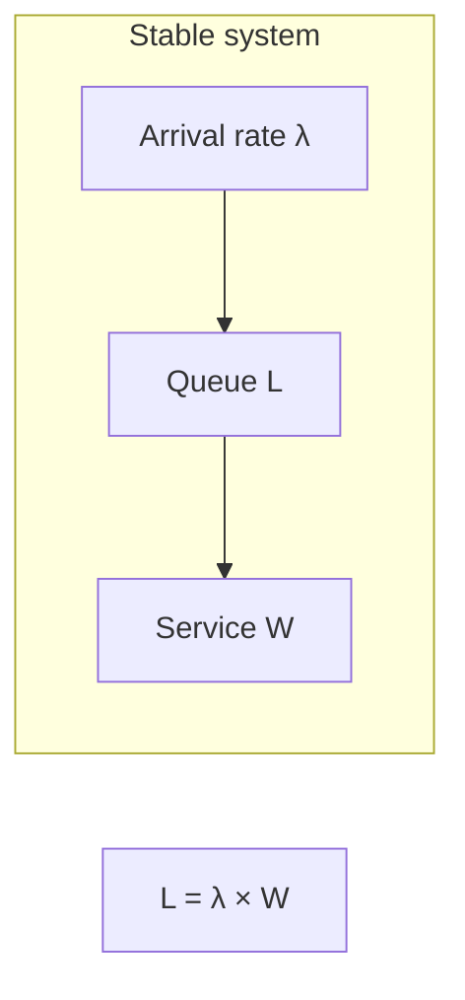

## Overview

**Latency** is how long one operation takes (milliseconds per request). **Throughput** is how many operations complete per unit time (requests per second, events per second).

They are related but not interchangeable. Optimizing one can hurt the other: batching raises throughput but adds per-request wait time; aggressive timeouts improve tail latency but may drop valid work.

This page is the System Design **primary** reference for the latency vs throughput interview answer. Production autoscaling and data-tier patterns are covered in [Scaling Strategies Overview](/system-design/scaling-strategies-overview/) and Microservices.

---

## Why It Matters

| Symptom | Often confused as | Actual issue |
| :--- | :--- | :--- |
| “API is slow” | Need more servers | Tail latency from one slow dependency |
| “We handle 100K RPS” | Latency is fine | p99 may be 2s while p50 is 20ms |
| “Queue backs up” | Low throughput | High latency at saturation (Little's Law) |
| “Batch job finished fast” | Good user latency | Batch improved throughput, not interactive path |

Interviewers test whether you **define SLIs correctly** and choose optimizations that match product NFRs — see [Non-Functional Requirements](/system-design/non-functional-requirements/).

---

## Core Concepts

### Definitions

| Term | Definition | Typical SLI |
| :--- | :--- | :--- |
| **Latency** | Time from request start to response | p50, p95, **p99** |
| **Throughput** | Completed work per second | RPS, WPS, events/sec |
| **Saturation** | Resource utilization (CPU, connections, queue depth) | % CPU, pool wait time |
| **Tail latency** | Slowest percentile (p99, p99.9) | Drives user perception at scale |

### Little's Law

For a stable system:

```
L = λ × W
```

| Symbol | Meaning |
| :--- | :--- |
| **L** | Average number of requests in the system (queue + in-flight) |
| **λ** (lambda) | Arrival rate (throughput) |
| **W** | Average time in system (latency) |

**Implication:** At fixed capacity, higher throughput increases average latency unless you add capacity or reduce per-request work.



### Latency vs throughput trade-offs

| Technique | Throughput | Latency | When to use |
| :--- | :--- | :--- | :--- |
| **Batching** | ↑ | ↑ (wait for batch) | Log ingestion, ML inference |
| **Parallelism** | ↑ | ↔ (coordination cost) | Embarrassingly parallel reads |
| **Caching** | ↑ | ↓ on hit | Read-heavy hot paths |
| **Sync replication** | ↓ | ↑ on writes | Strong consistency |
| **Async / queue** | ↑ sustained | ↑ perceived (queued) | Decouple write spikes |
| **Connection pooling** | ↑ | ↓ amortized setup | DB-heavy services |

### Percentiles matter more than averages

| Metric | Why averages lie |
| :--- | :--- |
| p50 = 50ms, p99 = 3s | 1% of users see 3s — at 10K RPS that's 100 slow requests/sec |
| Average = 80ms | Hides bimodal distribution (cache hit vs miss) |

**Production practice:** Set SLOs on **p99** or **p99.9** for user-facing paths. Example: [Distributed Rate Limiter](/system-design/distributed-rate-limiter/) targets **≤ 2 ms p99.9** on the evaluation path.

### Batching: the classic trade-off

```
Without batch: 1000 requests × 1ms each = 1000ms wall clock serial
With batch 100: 10 batches × 5ms = 50ms wall clock, but last item waits up to batch window
```

| Path | Batching |
| :--- | :--- |
| User-facing API | Avoid or micro-batch only |
| Metrics / logs | Large batches OK |
| GPU / vector DB | Batch for throughput |

### Network and transport effects

TCP window sizing and connection setup affect both dimensions — see [Transport Layer (TCP vs UDP)](/system-design/transport-layer-mechanics-tcp-vs-udp/). Load balancers add hop latency but enable horizontal throughput — [Load Balancers & Routing](/system-design/load-balancers-and-routing-algorithms/).

---

## Architect Perspective

### Interview answer template

1. **Define both terms** — latency = time per op; throughput = ops per second
2. **State they trade off** under fixed resources (Little's Law)
3. **Name the product priority** — interactive (latency) vs pipeline (throughput)
4. **Give one optimization each direction** — cache for latency; batching for throughput
5. **Mention tail percentiles** — p99, not average

### Linking to capacity planning

[Capacity Estimation](/system-design/capacity-estimation/) gives peak RPS; latency SLOs determine whether that RPS is **achievable** with your component chain:

| Peak RPS | Latency budget per hop | Max serial dependencies |
| :--- | :--- | :--- |
| 50K | 20ms end-to-end | ~3–4 sync calls at 5ms each |
| 50K | 200ms end-to-end | More fan-out acceptable |

### PACELC connection

Even without partition, [CAP & PACELC](/system-design/cap-and-pacelc/) reminds you: stronger consistency often costs **latency** on reads — factor that into NFR ranking.

---

## Common Mistakes

| Mistake | Reality |
| :--- | :--- |
| “We need higher throughput” → add caching | Cache helps read latency; write throughput may need sharding |
| Optimizing p50 only | Users experience tail; SLO on p99 |
| Ignoring queue depth | Rising queue = latency cliff before throughput flatlines |
| Same SLO for batch and online paths | Different NFRs need different targets |
| Conflating bandwidth with throughput | Gbps ≠ RPS without payload size |

---

## Interview Questions

1. **What is the difference between latency and throughput?**
2. **Explain Little's Law and how it applies to a saturated API.**
3. **Why optimize p99 instead of average latency?**
4. **When does batching help throughput but hurt latency?**
5. **A system handles 100K RPS but p99 is 5 seconds — what do you investigate?**
6. **Design SLOs for a rate limiter on every API request.**

---

## Related Topics

- [Capacity Estimation](/system-design/capacity-estimation/) — peak RPS from DAU
- [Horizontal vs Vertical Scaling](/system-design/horizontal-vs-vertical-scaling/) — adding capacity to shift the curve
- [Scaling Strategies Overview](/system-design/scaling-strategies-overview/) — cache, replicas, shards
- [Caching & CDNs](/system-design/caching-and-cdns-hierarchical-arrays/) — latency reduction on reads
- [Distributed Rate Limiter](/system-design/distributed-rate-limiter/) — latency-critical inline path case study

---

## Deep Dive References

| Topic | Location |
| :--- | :--- |
| Scalability patterns (production) | [Microservices — Scalability Patterns](/microservices/10-production-playbook/scalability-patterns/) |
| Reliability SLOs & error budgets | [Microservices — Reliability Engineering](/microservices/10-production-playbook/reliability-engineering/) |

**Reliability:** [Availability & Nines](/system-design/availability-and-nines/) · [Resilience Patterns Overview](/system-design/resilience-patterns-overview/)
