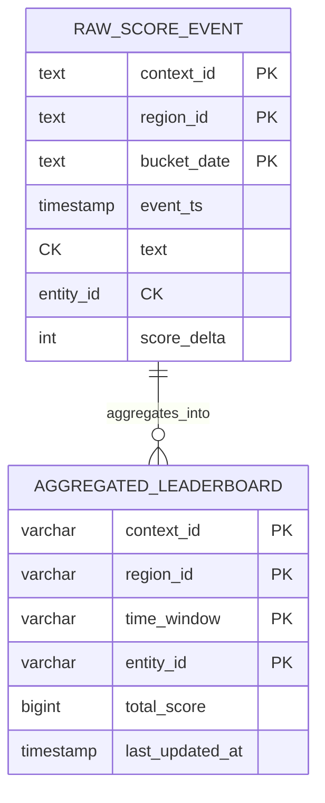
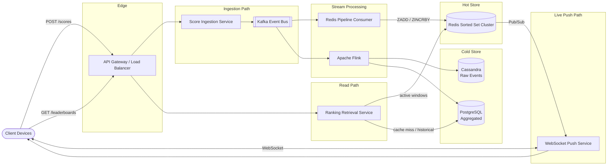
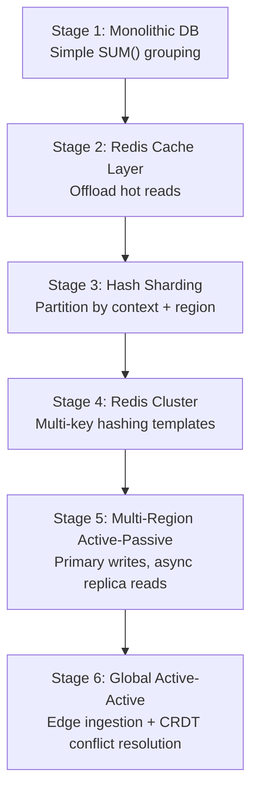

A global leaderboard ranks players, videos, or songs in real time across time windows and geographic regions. At scale it is **write-heavy on ingestion** (1M events/sec at peak) while read queries must return top-K lists in **≤ 100 ms** and support exact rank lookups with surrounding players. The system favors **availability over consistency** — stale rankings are acceptable; dropped requests are not.

This post walks through the full design — requirements, capacity math, API contracts, dual-store data modeling (Cassandra + PostgreSQL), Lambda/Kappa hybrid streaming architecture, Redis sorted-set algorithms, technology trade-offs, caching, infrastructure sizing, and failure modes. For 50 senior-level interview follow-ups, see [Leaderboard Interview Questions](/system-design/leaderboard-interview-questions/).

---

## 1. Requirements and Goals

### Functional Requirements (MVP)

| Requirement | Description |
| :--- | :--- |
| **Ingest events** | Accept user scores, video views, or song plays in real time. |
| **Query top-K** | Retrieve the top-K trending items or players for a given context. |
| **Time-window filtering** | Query across predefined windows: 1 Hour, 24 Hours, 30 Days, All-Time. |
| **Regional partitioning** | Segment ranking lists geographically (e.g. India vs. US). |
| **Real-time delivery** | Push ranking updates to clients in near real-time for live events or gaming leaderboards. |
| **Surrounding ranks** | Return a user's exact rank plus the K players immediately above and below them. |

### Clarifying Assumptions

| Question | Assumption |
| :--- | :--- |
| Exact vs probabilistic rankings? | **Exact** for standard windows; probabilistic estimations (Count-Min Sketch, HyperLogLog) only when a single entity's update volume threatens to saturate a shard. |
| Tie-breaker when scores are equal? | **First-In, First-Ranked** — order by the timestamp of who achieved the score first. |
| Top-K bounds? | **1 ≤ K ≤ 10,000**; requests for K > 1,000 require pagination. |

### Non-Functional Requirements

| NFR | Target |
| :--- | :--- |
| **Scale** | **100M DAU**; **1M events/sec** peak ingestion |
| **Availability** | **AP** — prefer stale leaderboards over errors during partitions |
| **Read latency** | Top-K queries **≤ 100 ms** (P99) |
| **Write propagation** | Ingestion-to-display delay **≤ 500 ms** through the streaming pipeline |
| **Accuracy** | Precise rankings for core scenarios; optional probabilistic fallback at extreme scale |
| **Read / Write ratio** | **1 : 2** (500M reads/day vs 1B events/day) |

---

## 2. Back-of-the-Envelope Calculations

### Traffic Estimates

Starting from **100M DAU**, **10 events/user/day**, and **5 leaderboard views/user/day**:

| Metric | Calculation | Result |
| :--- | :--- | :--- |
| Ingest events / day | 100M × 10 | **1 billion / day** |
| Read queries / day | 100M × 5 | **500 million / day** |
| Average write RPS | 1B ÷ 86,400 s | **~11,574 RPS** |
| Peak ingestion RPS | Given | **1,000,000 RPS** |
| Average read RPS | 500M ÷ 86,400 s | **~5,787 RPS** |
| Peak read RPS (estimate) | ~3.5× average | **~20,000 RPS** |

### Storage (Raw Events)

| Assumption | Calculation | Result |
| :--- | :--- | :--- |
| Bytes per event | entity_id (16B) + score_delta (4B) + timestamp (8B) + region (4B) + metadata (8B) | **40 B** |
| Daily ingestion | 1B × 40 B | **40 GB / day** |
| Yearly accumulation | 40 GB × 365 | **~14.6 TB / year** (excluding replication) |

### Bandwidth

| Path | Calculation | Result |
| :--- | :--- | :--- |
| Peak ingestion inbound | 1M RPS × 40 B | **~40 MB/s** |
| Peak read egress | 20K RPS × 10 KB (top-100 payload) | **~200 MB/s** |

### Redis Sorted Set Memory (Hot Windows)

| Assumption | Calculation | Result |
| :--- | :--- | :--- |
| Active regions | 100 | — |
| Active time windows cached | 2 (1h, 24h) | — |
| Entities per region | 100,000 | — |
| Bytes per ZSET entry | ~100 B (score + skip-list/hash overhead) | — |
| Total memory | 100 × 2 × 100K × 100 B | **~2 GB** |

The hot cache layer fits entirely in RAM with headroom for replication.

---

## 3. API Design

### Ingest Score Event

**`POST /api/v1/scores`**

Idempotency: include a `Client-Request-Id` UUID in HTTP headers to prevent duplicate increments on retry storms.

Request:

```json
{
  "entity_id": "9b1deb4d-3b7d-4bad-9bdd-2b0d7b3dcb6d",
  "score_delta": 15,
  "timestamp": 1782403200,
  "region": "IN",
  "context_id": "game_season_12"
}
```

Response (`202 Accepted`):

```json
{
  "status": "queued"
}
```

### Fetch Top-K Leaderboard

**`GET /api/v1/leaderboards/{context_id}`**

Query parameters: `window=24h&region=IN&limit=50&offset=0`

Response (`200 OK`):

```json
{
  "context_id": "game_season_12",
  "window": "24h",
  "region": "IN",
  "entries": [
    { "rank": 1, "entity_id": "user_88", "score": 9850 },
    { "rank": 2, "entity_id": "user_102", "score": 9740 }
  ],
  "has_more": false
}
```

| Parameter | Constraint |
| :--- | :--- |
| `limit` | 1 ≤ limit ≤ 1,000 per page |
| `window` | `1h`, `24h`, `30d`, `all` |
| `offset` | Required when K > 1,000 (pagination) |

### Fetch Surrounding Ranks

**`GET /api/v1/leaderboards/{context_id}/users/{user_id}/surrounding`**

Query parameters: `window=30d&region=US&surround_radius=2`

Response (`200 OK`):

```json
{
  "target_user_rank": 45,
  "entries": [
    { "rank": 43, "entity_id": "user_abc", "score": 5100 },
    { "rank": 44, "entity_id": "user_def", "score": 5050 },
    { "rank": 45, "entity_id": "user_target", "score": 5000 },
    { "rank": 46, "entity_id": "user_ghi", "score": 4950 },
    { "rank": 47, "entity_id": "user_jkl", "score": 4900 }
  ]
}
```

### HTTP Error Codes

| Code | Condition |
| :--- | :--- |
| `400 Bad Request` | Invalid window string, out-of-bounds limit, or missing fields |
| `429 Too Many Requests` | Rate-limit threshold breached on ingestion or read path |

---

## 4. Data Model



### `raw_score_events` (Cassandra)

High-throughput append-only event log for the streaming pipeline.

| Column | Type | Key | Justification |
| :--- | :--- | :--- | :--- |
| `context_id` | `TEXT` | Partition | Isolates tournaments, songs, or game seasons |
| `region_id` | `TEXT` | Partition | Geographically fragments hot spots |
| `bucket_date` | `TEXT` | Partition | Shards timelines (e.g. `2026-06-26`) to bound row growth |
| `event_ts` | `TIMESTAMP` | Clustering (DESC) | Deterministic ordering for stream processors |
| `entity_id` | `TEXT` | Clustering (ASC) | Uniqueness across matching timestamps |
| `score_delta` | `INT` | Data | Value added or subtracted |

### `aggregated_leaderboards` (PostgreSQL)

Sink table for Flink-computed window aggregates and historical queries.

```sql
CREATE TABLE aggregated_leaderboards (
    context_id   VARCHAR(64)  NOT NULL,
    region_id    VARCHAR(8)   NOT NULL,
    time_window  VARCHAR(8)   NOT NULL,
    entity_id    VARCHAR(64)  NOT NULL,
    total_score  BIGINT       NOT NULL,
    last_updated_at TIMESTAMP NOT NULL,
    PRIMARY KEY (context_id, region_id, time_window, entity_id)
);

CREATE INDEX idx_leaderboard_ranking
ON aggregated_leaderboards (context_id, region_id, time_window, total_score DESC);
```

Entity profile details (usernames, avatars) live in a separate user microservice — leaderboard computation tracks only `entity_id` and score.

---

## 5. High-Level Architecture



### Ingestion Path

1. Client sends `POST /api/v1/scores` through the API gateway.
2. **Score Ingestion Service** validates schema, enforces rate limits, and produces to **Kafka**.
3. Returns `202 Accepted` immediately — the event is durably buffered.

### Real-Time Path

1. **Redis Pipeline Consumer** reads from Kafka and applies `ZINCRBY` to the appropriate sorted-set key.
2. Redis **Pub/Sub** notifies the **WebSocket Push Service**, which pushes top-K changes to subscribed clients.

### Analytical Path

1. **Apache Flink** consumes the same Kafka stream, computes sliding/tumbling window aggregates, and writes to **Cassandra** (raw archive) and **PostgreSQL** (aggregated leaderboards).

### Read Path

1. Client sends `GET /api/v1/leaderboards/{context_id}`.
2. **Ranking Retrieval Service** reads active windows (1h, 24h) from **Redis** via `ZREVRANGE`.
3. On cache miss or historical windows (30d, all-time), falls back to **PostgreSQL** with cache-aside population.
4. Surrounding-rank queries use `ZREVRANK` + `ZREVRANGE` in Redis, or the PostgreSQL index on `(total_score DESC)`.

---

## 6. Core Ranking Algorithm — Redis Sorted Sets

Redis **Sorted Sets (ZSET)** combine a hash table (O(1) score lookup) and a skip list (O(log N) range queries and insertions).

### Key Operations

| Command | Purpose | Complexity |
| :--- | :--- | :--- |
| `ZINCRBY key increment member` | Atomic score increment | O(log N) |
| `ZREVRANGE key start stop WITHSCORES` | Top-K range query (descending) | O(log N + K) |
| `ZREVRANK key member` | Exact 0-indexed rank from top | O(log N) |

### Tie-Breaking: First-In, First-Ranked

Redis scores are 64-bit floats. Encode the tie-breaker as a fractional component of the base score:

```
Final Score = Raw Score + (1 - Epoch Timestamp / 10^10)
```

Earlier timestamps receive a slightly higher fractional score, preserving FIFO ordering among equal raw scores.

### Multi-Window Atomic Updates

Wrap multiple `ZINCRBY` commands (one per time window) in a **Lua script**. Redis executes Lua atomically — either all windows update or none do, preventing cross-window drift.

### Kafka Partition Routing

Hash events by `entity_id` so all updates for a given entity route to the same Kafka partition and consumer thread. This eliminates write races without distributed transactions.

For viral entities that saturate a single partition, append a random salt to the routing key (e.g. `entity_id + salt`) and aggregate salted streams downstream in Flink before writing to storage.

### Sliding 24-Hour Window

Store per-event timestamps in a secondary ZSET where the member score is the event timestamp. A background worker runs `ZREMRANGEBYSCORE` every minute to evict entries older than 24 hours, then recomputes the aggregate.

---

## 7. Database Selection and Scaling

### Technology Comparison

| Component | Choice | Why choose | Why not alternatives |
| :--- | :--- | :--- | :--- |
| **Raw event store** | Cassandra | LSM-tree writes; no row locks; masterless replication | PostgreSQL: B-tree index fragmentation under heavy writes; MongoDB: document-level locking limits throughput |
| **Aggregated store** | PostgreSQL | Declarative partitioning (Timescale); strong indexing for historical rank queries | Cassandra: weaker ad-hoc aggregation; no native `ORDER BY total_score DESC` index patterns |
| **Hot cache** | Redis ZSET | Native sorted-set ops; atomic `ZINCRBY`; sub-ms reads | Memcached: no complex data structures; Hazelcast: higher operational overhead for this use case |
| **Event buffer** | Kafka | Sequential disk append; millions of events/sec; replay for disaster recovery | RabbitMQ: queue degradation under large backlogs |
| **Entity IDs** | UUIDv4 | Decentralized generation; no coordination overhead | DB auto-increment: centralized serialization blocks horizontal scaling |
| **Stream processing** | Apache Flink | Continuous sliding windows; even resource usage; checkpointed state | Cron + PostgreSQL: resource spikes; poor scaling |

### Scaling Strategy



| Stage | Trigger | Design |
| :--- | :--- | :--- |
| **1 — Monolith** | Initial deployment | Single relational DB with `SUM()` grouping |
| **2 — Cache** | Reads outpace DB | Redis ahead of read path |
| **3 — Sharding** | Write/storage limits | Hash-shard by `(context_id, region_id)` |
| **4 — Redis cluster** | Memory/processing ceiling | Custom key templates: `{context_id:region_id}:shard_bucket` |
| **5 — Active-passive** | International latency | Primary region writes; async replication to read outposts |
| **6 — Active-active** | Sub-100ms cross-continent | Edge ingestion nodes; Flink merges regional streams; CRDTs resolve conflicts |

---

## 8. Caching Strategy

### Real-Time Windows (Write-Through)

Live leaderboard updates flow **Kafka → Redis consumer** directly. No disk on the read hot path. Keys include the active time interval (e.g. `leaderboard:game_season_12:IN:1h`).

| Window | TTL |
| :--- | :--- |
| 1 Hour | 5 minutes (refreshed continuously) |
| 24 Hours | 1 hour |

### Historical Windows (Cache-Aside)

For 30-day and all-time queries, the Ranking Retrieval Service checks a long-term Redis cache. On miss, queries PostgreSQL, populates the cache, and sets an explicit TTL.

### Eviction Policy

`volatile-lru` — evict least-recently-used keys that have an explicit expiration target.

### Hot Partition Protection

Use probabilistic early expiration (XFetch) or background workers that proactively refresh hot keys before hard TTL expiry to prevent cache stampedes.

---

## 9. Capacity Planning

| Component | Metric | Calculation / Assumption | Recommendation |
| :--- | :--- | :--- | :--- |
| **Score Ingestion Service** | Peak ingestion | 1M RPS (buffered by Kafka) | **20 pods** (2 vCPU, 4 GB RAM each) |
| **Ranking Retrieval Service** | Peak reads | ~20K RPS | **30 pods** (4 vCPU, 8 GB RAM each) |
| **Redis Cluster** | Hot ZSET memory | 100 regions × 2 windows × 100K entities × 100 B | **~2 GB** data; **16-node cluster** (8 masters + 8 replicas) |
| **Kafka** | Peak event rate | 1M events/sec | **9 brokers** (RF=3, min.insync.replicas=2) |
| **Cassandra** | Raw event storage | 40 GB/day; ~14.6 TB/year | Multi-node cluster with daily S3 SSTable snapshots |
| **PostgreSQL** | Aggregated rows | Windowed aggregates per context/region | Primary + read replicas; Timescale partitioning |
| **Flink** | Stream parallelism | Matches Kafka partition count | Auto-scaled task managers |
| **Network** | Peak egress | 20K RPS × 10 KB | **~200 MB/s** |

### Autoscaling

Kubernetes HPA scales ingestion and retrieval pods when CPU exceeds **70%** or average connection queue latency exceeds **300 ms**.

---

## 10. Key Design Decisions Summary

| Decision | Choice | Rationale |
| :--- | :--- | :--- |
| Consistency model | AP (availability over consistency) | Stale leaderboards acceptable; errors are not |
| Hot-path ranking store | Redis Sorted Sets | O(log N) insert/rank/range; atomic server-side ops |
| Event buffer | Kafka | Absorbs 1M/sec spikes; durable replay for recovery |
| Raw vs aggregated storage | Cassandra + PostgreSQL | Write-optimized log + query-optimized aggregates |
| Stream processing | Apache Flink | Continuous windowing; checkpointed exactly-once state |
| Tie-breaking | Fractional timestamp encoding | FIFO ordering without secondary sort keys |
| Entity identity | UUIDv4 | Decentralized; no ID coordination service |
| Live updates | WebSocket push via Redis Pub/Sub | Avoids polling overhead from millions of clients |
| Ingestion contract | Delta events (not absolute scores) | Prevents client-side score inflation attacks |
| Pagination | Cap at 1,000 per page | Protects bandwidth on K=10,000 requests |
| Security | OAuth2 JWT + rate limiting | 60 req/min ingest; 200 req/min read per client |
| Observability | OpenTelemetry + SLI/SLO | 99.95% availability; P99 read ≤ 100 ms |

### Security Architecture

| Control | Implementation |
| :--- | :--- |
| Authentication | OAuth2 JWT on all API endpoints |
| Rate limiting | Envoy/API Gateway token bucket per `user_id` and client IP |
| Input validation | Regex on IDs; `score_delta` bounded to 1–1,000 |
| Transport | TLS 1.3 in transit; AES-256 at rest |

### Observability Matrix

| Metric | Purpose |
| :--- | :--- |
| Kafka consumer lag | Background processing delay |
| Cache hit ratio | Retrieval path efficiency |
| P99 read latency | SLO compliance (target ≤ 100 ms) |
| Distributed tracing | End-to-end request flow via OpenTelemetry |

---

## 11. Failure Modes and Mitigations

| Failure | Impact | Mitigation |
| :--- | :--- | :--- |
| **Redis cluster down** | Real-time reads fail or serve stale data | Circuit breaker routes to PostgreSQL aggregates (last Flink sync point); rebuild Redis by replaying Kafka from checkpoint |
| **Kafka broker failure** | Ingestion slows or blocks | RF=3 with min.insync.replicas=2; producer retries with exponential backoff; fallback to secondary Kafka cluster |
| **Redis network partition** | Potential split-brain | Sentinel quorum (N/2 + 1); `replica-validity-factor` prevents stale replica promotion |
| **PostgreSQL unavailable** | Historical queries fail | Serve from Redis for active windows; return graceful degradation message for historical |
| **Both Redis and PostgreSQL down** | All reads fail | Safe mode: empty list or maintenance message; raw events preserved in Kafka for full reconstruction |
| **Hot Kafka partition** | Single viral entity saturates a partition | Salt routing key; downstream Flink aggregation before storage write |
| **Corrupted score data in Kafka** | Incorrect rankings | Deploy fix; inject corrective negative-delta events for affected time window |
| **Cassandra disk full** | Downstream consumers pause | Kafka buffers events durably; scale disk; consumers resume from last offset |
| **Cache stampede on TTL expiry** | PostgreSQL overload | XFetch probabilistic early refresh; background pre-warm of hot keys |

---

## What's Next

Future posts in this series will cover adjacent designs — probabilistic trending with Count-Min Sketch at social-media scale, CRDT-based active-active leaderboard replication, and migration playbooks from monolithic ranking to the streaming architecture described here.
