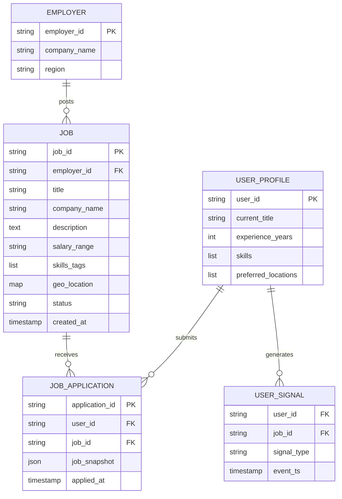
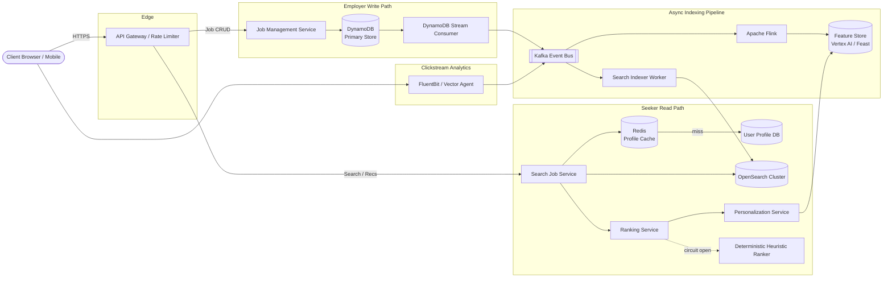
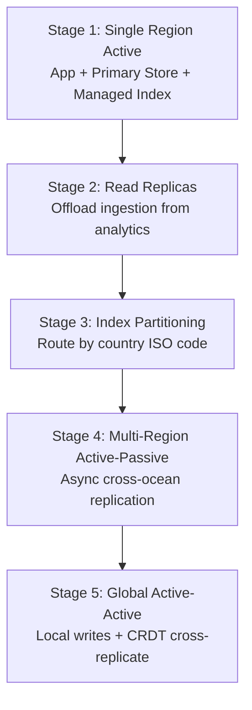

A professional job platform must serve two asymmetric workloads: employers performing infrequent CRUD on postings, and millions of seekers running filtered search and personalized recommendations every day. At LinkedIn scale this is **read-dominated** (~1000:1 seeker-to-employer ratio) with a strict **≤ 200 ms backend SLA** and graceful degradation when the AI personalization tier fails.

This post walks through the full design — requirements, capacity math, API contracts, DynamoDB/OpenSearch data modeling, Kafka-driven index synchronization, multi-tier ranking with circuit-breaker fallbacks, technology trade-offs, caching, infrastructure sizing, and failure modes. For 50 senior-level interview follow-ups, see [LinkedIn Job Search Interview Questions](/system-design/linkedin-job-search-interview-questions/).

---

## 1. Requirements and Goals

### Functional Requirements (MVP)

| Requirement | Description |
| :--- | :--- |
| **Job ingestion (employer)** | CRUD on job postings — create, update, expire, delete. |
| **Job search (seeker)** | Filter by location, role, title, organization; paginated results. |
| **AI recommendations** | Contextual job recommendations from profile, clickstreams, applications, and implicit signals. |

### Clarifying Assumptions

| Question | Assumption |
| :--- | :--- |
| Real-time sync when a job is posted? | **No** — eventual consistency of up to a few minutes is acceptable. |
| Full-text search across entire job description? | Primary filters on structured tokens (title, company, location); full-text scoring via OpenSearch. |
| Scope of user signals? | Implicit clicks, explicit views, saves, and application histories. |

### Non-Functional Requirements

| NFR | Target |
| :--- | :--- |
| **Scale** | **100M DAU**; **40M active job searchers/day**; **10M active searchable jobs** |
| **Latency** | Search/recommendation backend **≤ 200 ms**; client-perceived **< 1 s** |
| **Availability** | **99.99%** (4 nines) on the seeker path; graceful degradation if AI layer fails |
| **Consistency** | Eventual consistency between DynamoDB (writes) and OpenSearch (search index); seconds-to-minutes lag acceptable |
| **Compliance** | Regional data residency (e.g. GDPR in Europe) |
| **Read / Write ratio** | **~1000 : 1** (seeker reads dwarf employer writes) |

---

## 2. Back-of-the-Envelope Calculations

### Traffic Estimates

Starting from **100M DAU**, **40% active job searchers**, and **4 searches/user/day**:

| Metric | Calculation | Result |
| :--- | :--- | :--- |
| Job-seeking users / day | 100M × 40% | **40 million** |
| Total search requests / day | 40M × 4 | **160 million / day** |
| Average RPS | 160M ÷ 86,400 s | **~1,852 RPS** |
| Peak RPS (3× multiplier) | 1,852 × 3 | **~5,556 RPS** |

The **3× peak multiplier** accounts for synchronized regional spikes (lunch breaks, evening job browsing).

### Storage

| Component | Assumption | Calculation | Result |
| :--- | :--- | :--- | :--- |
| User profile cache | ~1 KB per profile (text/tags, no images) | 50M active profiles × 1 KB | **~50 GB** |
| OpenSearch job documents | ~10 KB per indexed job | 10M jobs × 10 KB | **~100 GB** hot index footprint |

### Bandwidth

| Path | Calculation | Result |
| :--- | :--- | :--- |
| Egress per search response | 20 jobs × ~2 KB metadata | **~40 KB** |
| Peak egress throughput | 5,556 RPS × 40 KB | **~222 MB/s (~1.78 Gbps)** |

---

## 3. API Design

| # | Method | Path | Purpose |
| :---: | :--- | :--- | :--- |
| 1 | GET | `/v1/jobs/search` | Seeker Job Search |


Request headers:

```
Authorization: Bearer <JWT_TOKEN>
X-Idempotency-Key: <UUID>  (optional for GET; tracked at gateway)
```

Query parameters:

```json
{
  "query": "Staff Software Engineer",
  "location": "San Francisco, CA",
  "experience_level": "Mid-Senior",
  "page_token": "eyJvZmZzZXQiOjIwLCJzZWVkIjo0Mn0=",
  "limit": 20
}
```


```json
{
  "results": [
    {
      "job_id": "job_98431024",
      "company": "Stripe",
      "title": "Staff Software Engineer - Core Infrastructure",
      "location": "San Francisco, CA (Hybrid)",
      "posted_at": "2026-06-25T08:00:00Z",
      "match_score": 0.96
    }
  ],
  "next_page_token": "eyJvZmZzZXQiOjQwLCJzZWVkIjo0Mn0="
}
```



**Common HTTP error codes**

{}
| Code | Condition |
| :--- | :--- |
| `400 Bad Request` | Invalid filter parameters or corrupted cursor token |
| `401 Unauthorized` | Missing, expired, or malformed JWT |
| `429 Too Many Requests` | Rate-limit threshold breached |
| `503 Service Unavailable` | Circuit breaker open on personalization pipeline — falls back to structural search ranking |

Token-based pagination (`page_token`) avoids O(n) offset scans as result sets grow.
{}
---

## 4. Data Model



### `Jobs` (DynamoDB — Primary Write Store)

| Column | Type | Key | Notes |
| :--- | :--- | :--- | :--- |
| `job_id` | `String` | Partition | Globally unique identifier |
| `employer_id` | `String` | — | Posting organization |
| `title` | `String` | — | Structured filter token |
| `company_name` | `String` | — | Denormalized for display; resolved via `company_id` at scale |
| `description` | `String` | — | Raw unstructured text |
| `salary_range` | `String` | — | Optional display field |
| `skills_tags` | `List` | — | Indexed into OpenSearch |
| `geo_location` | `Map` | — | `{lat, lon, region}` |
| `status` | `String` | — | `ACTIVE`, `EXPIRED`, `DELETED` |
| `created_at` | `Timestamp` | — | Sort key for freshness ranking |

### `User_Profiles` (Read-Optimized View)

| Column | Type | Key | Notes |
| :--- | :--- | :--- | :--- |
| `user_id` | `String` | Partition | Seeker identity |
| `current_title` | `String` | — | Ranking feature |
| `experience_years` | `Number` | — | Filter + ranking |
| `skills` | `List` | — | Skill-match scoring |
| `preferred_locations` | `List` | — | Geo preference |

### Denormalization Strategy

The seeker serving path uses **extreme denormalization**. OpenSearch flattens company name, geographic tags, and skills into a single document per job — eliminating runtime joins. Write complexity moves to the asynchronous ingestion pipeline.

When an employer edits a job with active applications, applicants retain a **static snapshot** of the job description at apply time for audit integrity.

---

## 5. High-Level Architecture



### Employer Write Path

1. Employer mutates a job via **Job Management Service** → **DynamoDB**.
2. **DynamoDB Streams** emit change events to a stream consumer.
3. Consumer publishes to **Kafka**; **Search Indexer** workers update **OpenSearch** documents.
4. Lag of seconds to minutes is acceptable — new postings appear in search after async propagation.

### Seeker Read Path

1. **Search Job Service** fetches user context from **Redis** (cache-aside fallback to profile DB).
2. Concurrently queries **OpenSearch** for a filtered candidate set (~1,000 jobs matching structural filters).
3. **Ranking Service** scores candidates via **Personalization Service** (vector embeddings from **Feature Store**).
4. If personalization exceeds SLA tail (>50 ms) or circuit breaker is open → **Deterministic Heuristic Ranker** (job age + geo proximity).

### Analytics Path

Clickstream events flow through **FluentBit/Vector** → **Kafka** → **Flink** for real-time embedding refresh. Heavy vector generation stays off the synchronous search hot path.

---

## 6. Core Ranking Algorithm — Multi-Tier Filtering & Personalization

The ranking pipeline uses a **funnel architecture** to meet the 200 ms SLA:

```
10M jobs → OpenSearch structural filter (~1,000 candidates)
         → Lightweight heuristic pre-rank (~200 candidates)
         → Vector similarity scoring (top 20 returned)
```

### PersonalizationRankingEngine (Circuit-Breaker Pattern)




```java
public interface JobRankingEngine {
    List<JobCandidate> rankJobs(String userId, List<JobCandidate> candidates)
        throws RankingException;
}

public class PersonalizationRankingEngine implements JobRankingEngine {
    private final VectorModelClient modelClient;
    private final DeterministicHeuristicRanker fallbackRanker;
    private final CircuitBreaker circuitBreaker;

    @Override
    public List<JobCandidate> rankJobs(String userId, List<JobCandidate> candidates) {
        if (!circuitBreaker.allowExecution()) {
            return fallbackRanker.rankJobs(userId, candidates);
        }
        try {
            return modelClient.scoreAndOrder(userId, candidates);
        } catch (Exception ex) {
            circuitBreaker.recordFailure();
            return fallbackRanker.rankJobs(userId, candidates);
        }
    }
}
```




```go
// TODO: idiomatic Go equivalent — mirror the Java snippet above
```




### Concurrency Model

**Search Job Service** runs profile fetch (Redis) and OpenSearch query **in parallel** via `CompletableFuture` (Java) or goroutines (Go) — overlapping I/O-bound work.

### Vector Search

User and job embeddings are precomputed offline/in streaming pipelines and stored in a **feature store**. At query time, **k-NN search** (HNSW graphs in OpenSearch or a dedicated vector DB) scores similarity in milliseconds — not runtime GenAI API calls.

### Exploration vs Exploitation

Ranking injects a controlled percentage of diverse, long-tail listings to prevent popular jobs from drowning niche opportunities (recommendation loop mitigation).

### Cold-Start Jobs

Newly posted jobs receive a **baseline visibility boost** until engagement signals accumulate.

### Duplicate Detection

Ingestion workers compute **min-hashes** on job descriptions. Listings closely matching an active job from the same company are flagged as duplicates and omitted from the search index.

### Remote Job Geo Handling

Remote jobs carry `is_remote: true`. The search coordinator bypasses spatial boundaries when this flag is set, matching regional search criteria globally.

---

## 7. Database Selection and Scaling

### Technology Comparison

| Component | Choice | Why choose | Why not alternatives |
| :--- | :--- | :--- | :--- |
| **Primary write store** | DynamoDB | Linear scale-out; predictable multi-tenant writes; no connection-pool bottlenecks | PostgreSQL: scale-up connection overhead at high write fan-out |
| **Search index** | OpenSearch | Inverted indices; full-text scoring; native k-NN plugin; compound geo + token filters | MongoDB compound indexes: degrade under high-cardinality compound queries |
| **Profile cache** | Redis | Hash/Set data types; partial field updates without full-key invalidation | Memcached: lacks structural data types |
| **Event buffer** | Kafka | Immutable log; replay for index rebuild; absorbs ingestion spikes | RabbitMQ: weak long-term retention and sequential replay |
| **Stream analytics** | Apache Flink | Real-time embedding refresh; checkpointed state | Batch cron: latency too high for signal freshness |
| **Feature store** | Vertex AI / Feast | Low-latency vector + feature lookups at ranking time | On-the-fly embedding generation: breaches SLA |

### Scaling Strategy



| Stage | Trigger | Design |
| :--- | :--- | :--- |
| **1 — Single region** | Initial deployment | App instances + DynamoDB + managed OpenSearch |
| **2 — Read replicas** | Read traffic surge | Separate ingestion engine from analytical Flink workloads |
| **3 — Index partitioning** | Storage limits / hotspots | Route OpenSearch shards by country code |
| **4 — Active-passive** | Cross-continental tail latency | Async data-plane replication; Route 53 geo-proximity failover |
| **5 — Active-active** | Strict compliance + localized proximity | Write to local region; CRDT engines for cross-replication |

---

## 8. Caching Strategy

### User Profiles — Cache-Aside

1. Query **Redis** for `user_id` profile hash.
2. On miss → fetch from profile DB → populate Redis asynchronously.
3. **TTL: 24 hours**; explicit skill updates trigger targeted invalidation via DB change streams.

| Policy | Setting |
| :--- | :--- |
| Eviction | `volatile-lru` — hot active users stay resident |
| TTL jitter | Random jitter on expiry to prevent thundering herd |
| Payload | Text/tags only (~1 KB); profile images served via CDN references |

### Company Name Resolution

Jobs index immutable `company_id` values. Client gateway resolves display names from a **highly cached lookup table** — avoiding mass reindex when a company rebrands.

### GDPR — Right to be Forgotten

Account closure events on Kafka trigger hard deletion across profile DB, search personalization indices, and Redis cache nodes.

---

## 9. Capacity Planning

| Component | Metric | Calculation / Assumption | Recommendation |
| :--- | :--- | :--- | :--- |
| **Search Job Service** | Peak search RPS | ~5,556 RPS; ~50 ms per query | **40 pods/region** (0.5 vCPU, 1 GiB RAM each) |
| **Redis (profiles)** | Working set | 50M profiles × 1 KB | **3-node sharded ElastiCache** (`cache.r6g.xlarge`; 1 primary + 2 read replicas per shard) |
| **OpenSearch** | Hot index | 10M jobs × 10 KB | **~100 GB**; shard target 30–50 GB each |
| **Kafka** | Indexing + analytics | Peak employer writes + clickstream | RF=3; **7-day retention** for downstream recovery headroom |
| **DynamoDB** | Job metadata | 10M active jobs | On-demand or provisioned with PITR enabled |
| **Network egress** | Peak response bandwidth | 5,556 RPS × 40 KB | **~222 MB/s**; gzip compression above threshold |

### Autoscaling

Kubernetes **HPA** scales search pods when cluster-wide CPU or memory exceeds **70%**.

### High Availability

- Application pods across **multiple AZs** behind an ALB with cross-zone routing.
- **Route 53** geo-proximity with health probes for regional failover.
- **PITR** on DynamoDB; daily incremental snapshots to cross-region storage.

---

## 10. Key Design Decisions Summary

| Decision | Choice | Rationale |
| :--- | :--- | :--- |
| Write vs read store separation | DynamoDB + OpenSearch | Isolates heavy query workloads from transactional writes |
| Consistency model | Eventual (search index) | Strong cross-store consistency requires distributed locks; slows writes |
| Pagination | Token-based cursors | O(1) page fetches vs O(n) offset scans |
| AI integration | Precomputed embeddings + k-NN | Meets 200 ms SLA; runtime GenAI calls too slow |
| Personalization fallback | Deterministic heuristic ranker | 99.99% availability even when ML tier fails |
| Duplicate jobs | Min-hash dedup at ingestion | Prevents scraped listings flooding recommendations |
| Multi-tenant isolation | Query-time visibility filters | Enterprise constraints via security groups, not DB-level sharding |
| Language search | OpenSearch language analyzers | Localized stemming/tokenization per field mapping |
| Rate limiting | Distributed token bucket (Redis) | Global limits across thousands of container nodes |
| Security | JWT + RBAC + mTLS internal | Least privilege; TLS 1.3 in transit; AES-256 at rest |
| Observability | OpenTelemetry + distributed tracing | [Observability Fundamentals](/system-design/observability-fundamentals/) — trace IDs from gateway through OpenSearch |
| SLOs | 99.99% availability; p95 ≤ 150 ms; p99 ≤ 250 ms | Search orchestrator execution boundaries |

### Security Architecture

| Control | Implementation |
| :--- | :--- |
| Edge protection | WAF — SQL injection and L7 flood mitigation |
| Authorization | RBAC; microservice mTLS inside private VPC |
| Input validation | JSON schema validation at API gateway |
| Data residency | Sensitive fields excluded from cross-border replication |

---

## 11. Failure Modes and Mitigations

| Failure | Impact | Mitigation |
| :--- | :--- | :--- |
| **Redis profile cache outage** | Higher latency on profile fetch | Bypass cache → profile DB; adaptive concurrency limits prevent connection exhaustion |
| **OpenSearch cluster degradation** | Search quality/latency degrades | Indexing pauses; events queue in Kafka; fallback to cached results or simplified keyword sort by `posted_at` |
| **Personalization / vector tier failure** | No ML-ranked results | Circuit breaker opens → deterministic heuristic ranker (geo + freshness) |
| **Kafka consumer lag** | Stale search index | Scale parallel partition consumers; alert on lag via Prometheus |
| **Single AZ loss** | Reduced capacity in region | HPA provisions pods in healthy AZs; ALB shifts traffic away from impacted datacenter |
| **Regional blackout** | Entire region unavailable | Route 53 failover to healthy standby region; async replication catches up |
| **OpenSearch shard corruption** | Partial index data loss | Take shard offline; restore last clean snapshot; replay missed events from Kafka log |
| **Cache stampede on TTL expiry** | Profile DB overload | TTL jitter; targeted invalidation on explicit updates only |
| **GDPR deletion event** | User data must be purged | Kafka-triggered hard delete across profile DB, feature store, Redis, and personalization indices |

---

## What's Next

Future posts in this series will cover adjacent designs — shadow deployments for safe ML model rollouts, CRDT-based active-active job index replication, and cost optimization playbooks when active listings grow 10× (S3 archival tiers for expired jobs).
