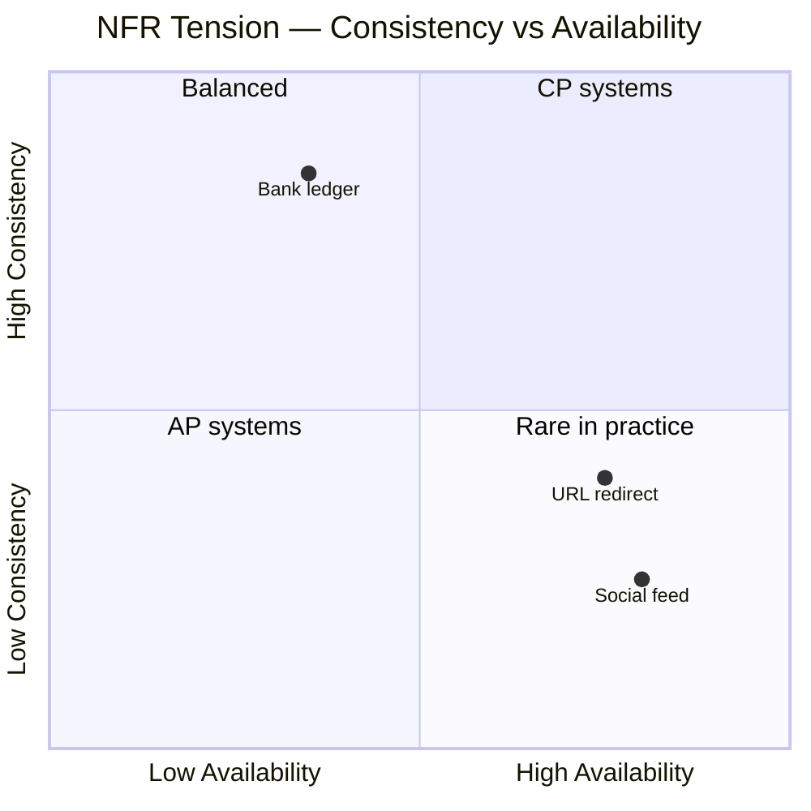

## Overview

**Non-functional requirements (NFRs)** define *how well* a system must behave — latency, availability, durability, security — as opposed to *what* it does functionally. Architects translate product statements (“fast”, “always up”, “secure”) into **measurable SLOs** that drive caching, replication, partitioning, and consistency choices.

This page is the System Design **overview** for NFRs. Production PRR checklists and SRE depth live in Microservices; pattern selection ADRs live in Technology Playbook.

---

## Why It Matters

| Scenario | NFR impact |
| :--- | :--- |
| Payment checkout | Latency + consistency + durability dominate |
| Social feed | Throughput + eventual consistency + cost |
| OTP notification | Tail latency + availability on write path |
| Analytics pipeline | Throughput + durability; latency relaxed |

Interviewers use NFRs to test whether you **prioritize correctly**. A feed can tolerate stale reads; a ledger cannot.

---

## Core Concepts

### NFR reference table

| NFR | Definition | How measured | Typical targets | Key trade-offs |
| :--- | :--- | :--- | :--- | :--- |
| **Availability** | Fraction of time system is usable | Uptime %, error budget | 99.9% – 99.99% | vs consistency, cost of redundancy |
| **Reliability** | Probability of correct behavior | Defect rate, data loss events | Zero financial duplication | vs latency (sync replication) |
| **Scalability** | Ability to handle load growth | Max RPS, linear scale factor | 10× annual traffic | vs complexity, ops cost |
| **Latency** | Time to complete a request | p50, p95, p99, p99.9 | 50ms–500ms API; <2s OTP | vs throughput, consistency |
| **Throughput** | Work completed per unit time | RPS, TPS, events/sec | Domain-specific | vs latency (batching) |
| **Durability** | Data survives failures | RPO, replication factor | RPO ≈ 0 for money | vs write latency |
| **Consistency** | All readers see same data | Linearizability, staleness bound | Strong for ledger; eventual for feed | vs availability (CAP) |
| **Security** | CIA + compliance | Audits, pen tests, encryption coverage | PCI, SOC2 scope | vs velocity, UX |
| **Maintainability** | Ease of change and operation | Deploy freq, MTTR, onboarding time | Weekly deploys, <30m MTTR | vs short-term speed |
| **Cost** | Infra + engineering TCO | $/request, $/GB-month | FinOps budgets | vs all other NFRs |

### NFR comparison matrix (interview prioritization)

| System type | Top-3 NFRs | Deprioritize |
| :--- | :--- | :--- |
| URL shortener (read-heavy) | Latency, availability, scalability | Strong cross-region consistency |
| Bank ledger | Consistency, durability, reliability | Eventual reads |
| Notification / OTP | Tail latency, availability, throughput | Cross-service ACID |
| Social feed | Throughput, scalability, cost | Strong consistency on reads |
| Search / recommendations | Latency, relevance freshness | Immediate write visibility |

*Under partition, CAP forces CP vs AP — see [CAP & PACELC](/system-design/cap-and-pacelc/).*

### Mapping NFRs to architecture levers

| NFR | Architecture levers |
| :--- | :--- |
| Latency | Cache, CDN, edge, async where acceptable |
| Throughput | Partitioning, queues, horizontal scale |
| Availability | Redundancy, failover, multi-AZ |
| Durability | Replication, backups, WAL |
| Consistency | Sync replication, transactions, CRDTs |
| Security | Zero trust, encryption, least privilege |

---

## Architect Perspective

### How to elicit NFRs in interviews

1. **Ask for scale** — DAU, QPS, data retention
2. **Ask for failure tolerance** — “Can we lose 1 minute of writes?”
3. **Ask for read freshness** — “Is 30s stale feed OK?”
4. **Ask for compliance** — PCI, PII, residency
5. **Rank** — “If we can only optimize two, which two?”

Document answers in a table before drawing architecture. Link estimates to [Capacity Estimation](/system-design/capacity-estimation/).

### How NFRs connect to modules

| NFR cluster | System Design module |
| :--- | :--- |
| Consistency, CAP | [Distributed Systems](/system-design/cap-and-pacelc/) — [Consistency Models](/system-design/consistency-models/) |
| Scalability, latency | [Latency vs Throughput](/system-design/latency-vs-throughput/) · [Scaling Strategies Overview](/system-design/scaling-strategies-overview/) · [Caching & CDNs](/system-design/caching-and-cdns-hierarchical-arrays/) |
| Availability, reliability | [Availability & Nines](/system-design/availability-and-nines/) · [Reliability vs Availability](/system-design/reliability-vs-availability/) · [SPOF & Redundancy](/system-design/single-point-of-failure-elimination-redundancy/) |
| Durability, transactions | [Data Management](/system-design/database-transactions-and-acid-isolation/) |
| Operability, observability | [Observability Fundamentals](/system-design/observability-fundamentals/) · [Distributed Logging System](/system-design/distributed-logging-system/) (application)

---

## Common Mistakes

| Mistake | Correction |
| :--- | :--- |
| “High availability” without a number | State 99.9% vs 99.99% and downtime budget |
| Conflating reliability and availability | Reliable = correct; available = reachable |
| Ignoring tail latency | Specify p99/p99.9 for user-facing paths |
| One-size consistency | Match model to use case (ledger vs feed) |
| Security as afterthought | Name authN/authZ and data classification early |

---

## Interview Questions

1. **What NFRs would you prioritize for a ride-sharing dispatch system?**
2. **How do you trade latency against consistency in a payment flow?**
3. **What does 99.99% availability mean in minutes of downtime per year?**
4. **When is eventual consistency acceptable? When is it not?**
5. **How would you measure whether you met your NFRs in production?**

**Companion practice:** [Payment Gateway Interview Questions](/system-design/payment-gateway-orchestration-interview-questions/) · [Distributed Rate Limiter Interview Questions](/system-design/distributed-rate-limiter-interview-questions/)

---

## Related Topics

- [What Is System Design?](/system-design/what-is-system-design/)
- [System Design Process](/system-design/system-design-process/)
- [Capacity Estimation](/system-design/capacity-estimation/)
- [Replication Lag & Read Replicas](/system-design/replication-lag-read-replica-topology/) — scalability NFR lever
- [Multi-Region Topologies](/system-design/multi-region-topologies-and-availability-zones/) — availability NFR lever

---

## Deep Dive References

| Topic | Location |
| :--- | :--- |
| PRR / NFR checklist | [Microservices — Architecture Review Checklist](/microservices/10-production-playbook/architecture-review-checklist/) |
| SLOs, error budgets, reliability engineering | [Microservices — Reliability Engineering](/microservices/10-production-playbook/reliability-engineering/) |
| Architecture pattern selection | [Technology Playbook — Module Architecture Patterns](/technology-playbook/module-architecture-patterns/) |

**Observability:** [Observability Fundamentals](/system-design/observability-fundamentals/)

**Reliability:** [Availability & Nines](/system-design/availability-and-nines/) · [Reliability vs Availability](/system-design/reliability-vs-availability/) · [Resilience Patterns Overview](/system-design/resilience-patterns-overview/)

**Distributed Systems:** [CAP & PACELC](/system-design/cap-and-pacelc/) · [Consistency Models](/system-design/consistency-models/)
