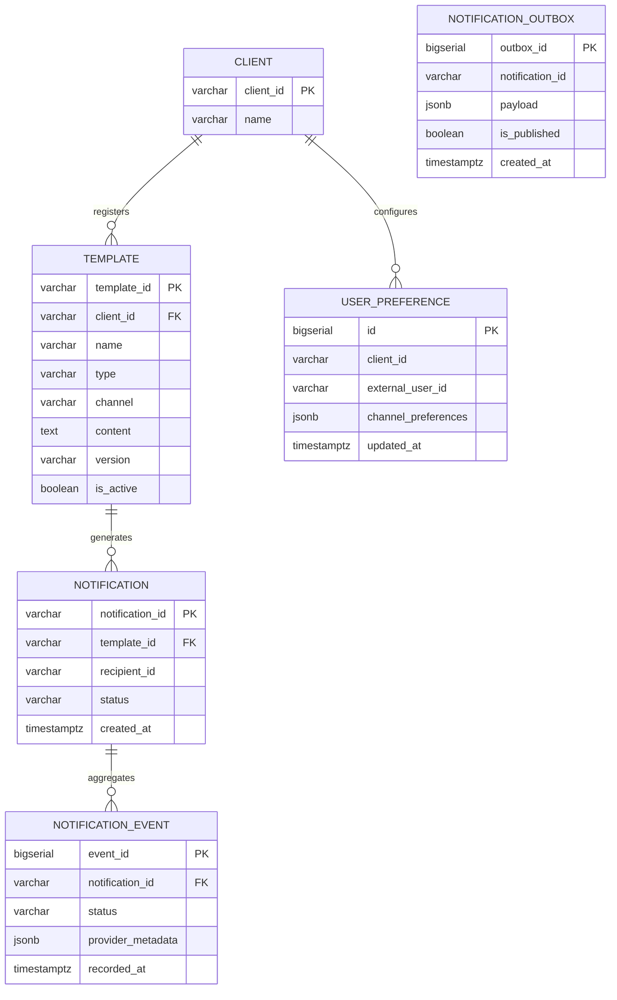
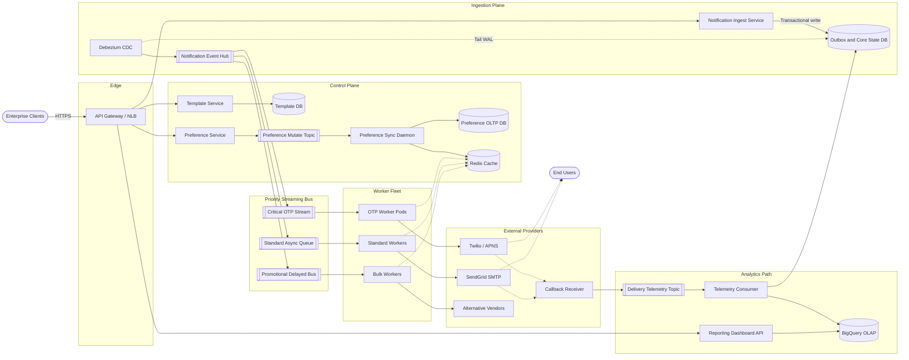
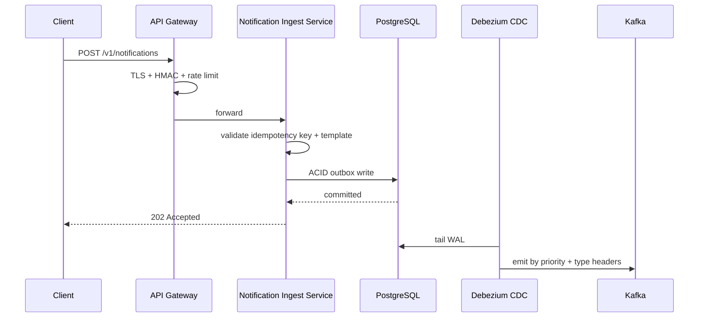
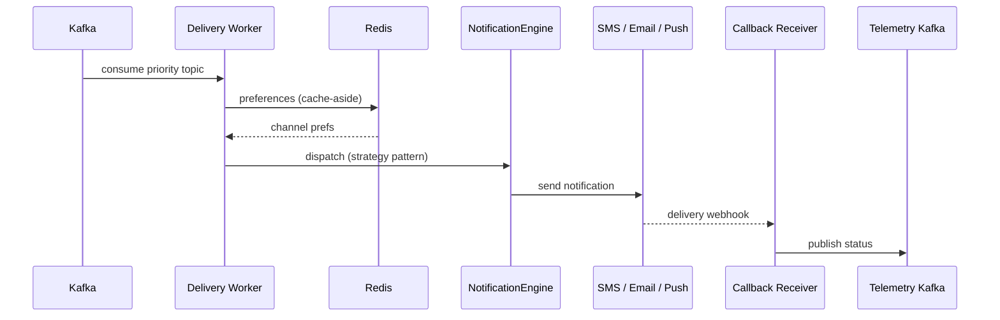
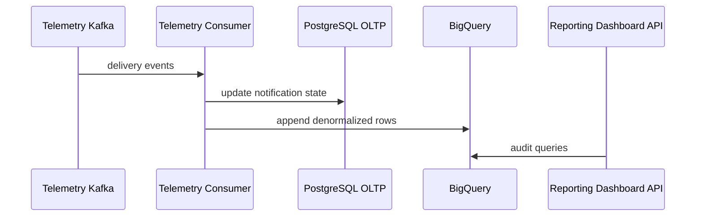
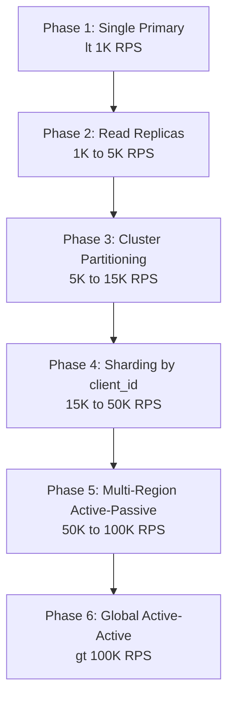
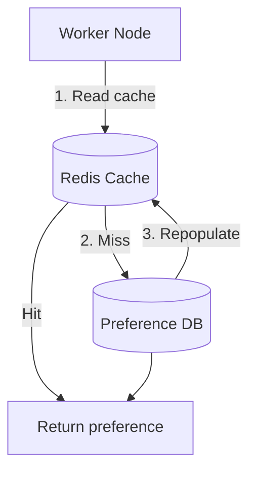

A multi-channel notification system routes templated messages to end users across Email, SMS, and In-App Push — from sub-2-second OTP delivery to throttled bulk promotions. At production scale it is a **write-heavy, priority-sensitive ingestion pipeline**: throughput dominates, but critical transactional traffic must never be blocked by promotional backlogs.

This post captures the full design — from requirements and capacity math through API contracts, data modeling, the [transactional outbox](/system-design/transactional-outbox-overview/) (ingest durability), priority streaming, caching, infrastructure sizing, and failure runbooks.

---

## 1. Requirements and Goals

### Functional Requirements

| Requirement | Description |
| :--- | :--- |
| **Multi-channel transmission** | Deliver notifications via Email, SMS, and In-App Push. |
| **Dynamic templating** | Clients submit template IDs with parameterized JSON contexts; the system compiles variables at runtime based on target persona attributes. |
| **Transmission models** | Real-time high-priority transactions (e.g. Auth OTPs) alongside asynchronously scheduled programmatic bulk promotions. |
| **Preference management** | End-users can opt in/out per channel globally or scoped to a specific client tenant. |
| **Auditing & dashboards** | Visibility into delivery statuses (`PENDING`, `SENT`, `DELIVERED`, `FAILED`) via structural analytics reporting endpoints. |

### Clarifying Assumptions (Interview Context)

| Question | Answer |
| :--- | :--- |
| Who compiles message content? | Clients pass template identifiers + parameter contexts; this system handles variable substitution locally. |
| Multi-tenancy model? | B2B2C — operational **Client** tenants are isolated from **External End-Users** who may exist across multiple clients. |
| Permanent third-party provider failure? | Fallback topologies route to alternate providers or channel migrations before declaring ultimate failure. |

### Non-Functional Requirements

| NFR | Target |
| :--- | :--- |
| **Scale** | **1,000,000 notifications/minute** average ingestion (~16,667 RPS) |
| **Peak burst** | 5× average → **~83,335 ingestion RPS** |
| **Availability** | Prioritize availability over immediate consistency (AP over CP); eventual consistency for metadata (templates, preferences) |
| **Critical latency SLO** | OTP / transactional: **< 2 seconds** end-to-end at **p99.9** |
| **Bulk latency SLO** | Promotional / bulk: **5–10 seconds** acceptable |
| **Delivery guarantee** | At-least-once to external vendor networks; strict idempotency inside internal storage |
| **Read / Write ratio** | **1 : 10** (write-heavy — operational state updates dominate) |

---

## 2. Back-of-the-Envelope Calculations

### Traffic Estimates

| Metric | Calculation | Result |
| :--- | :--- | :--- |
| Notifications / minute | Given | **1,000,000** |
| Notifications / day | 1M × 1,440 min | **1.44 billion / day** |
| Average ingestion RPS | 1.44B ÷ 86,400 s | **~16,667 RPS** |
| Peak ingestion RPS (5× burst) | 16,667 × 5 | **~83,335 RPS** |
| DAU (targeted unique users) | Given | **100,000,000** |

### Storage

| Assumption | Calculation | Result |
| :--- | :--- | :--- |
| Bytes per notification record | Given | **~500 bytes** |
| Storage / day | 1.44B × 500 B | **~720 GB / day** |
| Storage / year (raw metadata) | 720 GB × 365 | **~262.8 TB / year** |

### Bandwidth

| Path | Calculation | Result |
| :--- | :--- | :--- |
| Average inbound | 16,667 RPS × 500 B | **~8.33 MB/s (~66 Mbps)** |
| Peak inbound | 83,335 RPS × 500 B | **~41.67 MB/s (~333 Mbps)** |

### Kafka Event Volume

Ingest splits into state transitions and outbox events:

| Stream | Rate | Notes |
| :--- | :--- | :--- |
| Average events / sec | 16,667 × 2 | **~33,334 events/sec** |
| Delivery telemetry | Provider webhooks → tracking topic | Async status updates decoupled from OLTP |

### Cache Sizing (Preferences)

Cache active template metadata and **20%** of high-frequency end-user preference objects:

```
20,000,000 users × 100 B ≈ 2 GB minimum RAM buffer
```

---

## 3. API Design

| # | Method | Path | Purpose |
| :---: | :--- | :--- | :--- |
| 1 | POST | `/v1/templates` | Manage Template Definitions |
| 2 | POST | `/v1/notifications` | Disseminate Messages / Notify Users |
| 3 | PUT | `/v1/preferences` | Mutate Profile Subscriptions |



```json
{
  "client_id": "cli_amzn_9921",
  "name": "order_dispatched_alert",
  "type": "TRANSACTIONAL",
  "channel": "SMS",
  "content": "Hello {{user_name}}, your package containing {{item_count}} item(s) has been shipped. Tracking number: {{tracking_id}}.",
  "version": "1.0.0"
}
```



```json
{
  "template_id": "tpl_sms_88321",
  "status": "ACTIVE",
  "created_at": "2026-06-26T16:01:00Z"
}
```




Requires header: `Idempotency-Key: <UUIDv4>`


```json
{
  "template_id": "tpl_sms_88321",
  "recipient_id": "usr_pravin_772",
  "variables": {
    "user_name": "Pravin",
    "item_count": "3",
    "tracking_id": "TRK-990214"
  },
  "channel": "SMS",
  "priority": "HIGH",
  "schedule_timestamp": null
}
```



```json
{
  "notification_id": "ntf_b7a8-991a2",
  "status": "QUEUED"
}
```





```json
{
  "client_id": "cli_amzn_9921",
  "external_user_id": "usr_pravin_772",
  "preferences": {
    "email": true,
    "sms": false,
    "push": true
  }
}
```



```json
{
  "status": "UPDATED",
  "updated_at": "2026-06-26T16:01:05Z"
}
```



### Idempotency Execution

Clients submit a unique `Idempotency-Key` header on write requests. The edge service applies a short-lived distributed lock (`SET NX EX 86400`) in Redis using compound key `idempotency:{client_id}:{key}`. If an entry exists, the system returns the cached initial response without scheduling redundant executions.

**Common HTTP error codes**

{}
| Status | Condition |
| :--- | :--- |
| `400 Bad Request` | Validation failure on runtime parameters |
| `401 Unauthorized` | API signature token corrupted or expired |
| `429 Too Many Requests` | Client breached allocated tier rate limits |
| `503 Service Unavailable` | Downstream buffer queue overflow |
{}
---

## 4. Data Model



### `templates`

| Column | Type | Notes |
| :--- | :--- | :--- |
| `template_id` | `VARCHAR(64)` | Primary key |
| `client_id` | `VARCHAR(64)` | Indexed — multi-tenant grouping |
| `name` | `VARCHAR(128)` | Human-readable canonical name |
| `type` | `VARCHAR(32)` | `TRANSACTIONAL` or `PROMOTIONAL` |
| `channel` | `VARCHAR(16)` | `EMAIL`, `SMS`, `PUSH` |
| `content` | `TEXT` | Raw markup with `{{placeholder}}` variables |
| `version` | `VARCHAR(16)` | Semantic version |
| `is_active` | `BOOLEAN` | Active state flag |

**Indexing:** compound index `idx_client_template_name (client_id, name)`.

### `user_preferences`

| Column | Type | Notes |
| :--- | :--- | :--- |
| `id` | `BIGSERIAL` | Primary key |
| `client_id` | `VARCHAR(64)` | Tenant isolation |
| `external_user_id` | `VARCHAR(64)` | Client-side user identity |
| `channel_preferences` | `JSONB` | e.g. `{"sms": false, "email": true}` |
| `updated_at` | `TIMESTAMPTZ` | Last mutation timestamp |

**Constraint:** unique on `(client_id, external_user_id)`.

### `notification_outbox`

| Column | Type | Notes |
| :--- | :--- | :--- |
| `outbox_id` | `BIGSERIAL` | Primary key |
| `notification_id` | `VARCHAR(64)` | Distributed trace identifier |
| `payload` | `JSONB` | Full serialized request |
| `is_published` | `BOOLEAN` | CDC capture flag |
| `created_at` | `TIMESTAMPTZ` | Append-only timestamp |

### Normalization Strategy

| Store | Pattern | Rationale |
| :--- | :--- | :--- |
| OLTP (templates, preferences, outbox) | **3NF normalized** | Prevents state skew on configuration updates |
| OLAP (notification_events) | **Denormalized** | Columnar BigQuery rows carry full context — no joins at query time |

---

## 5. High-Level Architecture



### Ingestion Path



### Delivery Path



### Analytics Path



---

## 6. ID Generation, Idempotency, and Channel Routing

### Notification ID Strategy

| Strategy | Pros | Cons |
| :--- | :--- | :--- |
| **Snowflake ID** | 64-bit, time-sortable, no central coordination; prevents B-Tree index fragmentation | Requires clock synchronization discipline |
| **UUIDv4** | Simple, globally unique | Random distribution causes index fragmentation |
| **DB auto-increment** | Trivial | Single-node bottleneck; not distributed-safe |

**Selected: Snowflake ID** — generated at the ingestion boundary for every notification.

### Duplicate Prevention (At-Least-Once Pipeline)

1. Snowflake ID assigned at ingest.
2. Worker nodes record processed IDs in a distributed cache via atomic `SETNX`.
3. On consumer rebalance or network retry, duplicate events are detected and skipped.

### Channel Engine Abstraction

```
+-------------------+     +-------------------+     +-------------------+
| EmailEngine       |     | SMSEngine         |     | PushEngine        |
| provider: SMTP    |     | gateway: Twilio   |     | engine: FCM/APNS  |
+-------------------+     +-------------------+     +-------------------+
          \                       |                       /
           \                      |                      /
            +-------- NotificationEngine interface -----+
```

| Pattern | Usage |
| :--- | :--- |
| **Strategy** | Encapsulates per-channel delivery behind `executeTransmission(context)` |
| **Factory** | Instantiates the correct engine subclass from runtime payload context |

Workers use bounded channels and capped connection pools to enforce back-pressure under load.

---

## 7. Database Selection and Scaling

### Technology Comparison

| Database | Why choose | Why not |
| :--- | :--- | :--- |
| **PostgreSQL** | ACID transactions, relational constraints, transactional outbox support | Vertical scaling ceiling; sharding complexity |
| **MongoDB** | Flexible schema | Loose validation; write-ack inconsistencies under partition |
| **Cassandra** | Massive append throughput | Lacks performant relational constraints for outbox scheduling |

### Stream Infrastructure

| System | Verdict | Rationale |
| :--- | :--- | :--- |
| **Kafka** | **Selected** | Multi-partition retention, replayable logs, terabyte-scale throughput |
| **RabbitMQ** | Rejected | Struggles with multi-terabyte replay and horizontal log scaling |

### Decision

**PostgreSQL** for core/outbox store. **Kafka** for event streaming. **BigQuery** for OLAP analytics.

### Scaling Phases

| Phase | Architecture | Target RPS | Trigger | Bottleneck |
| :--- | :--- | :--- | :--- | :--- |
| 1 | Single primary | < 1,000 | Initial launch | Single node saturation |
| 2 | Primary + read replicas | 1K – 5K | Dashboard read pressure | Writes still on single primary |
| 3 | Horizontal cluster partitioning | 5K – 15K | Shared DB contention | Analytical queries degrade OLTP |
| 4 | Sharding by `client_id` | 15K – 50K | Write saturation | Cross-shard joins inefficient |
| 5 | Multi-region active-passive | 50K – 100K | DR mandates | Cross-region replication lag |
| 6 | Global active-active | > 100K | Worldwide compliance | Multi-directional conflict resolution |



---

## 8. Caching Strategy

**Cache-aside** for high-frequency end-user preference validation.



| Parameter | Value |
| :--- | :--- |
| Eviction | LRU |
| TTL | 86,400 seconds (24 hours) |
| Invalidation | Preference mutate topic pushes purge commands to all nodes in near real-time |

### Sizing

```
20M active preference entries × 100 B ≈ 2 GB + replication overhead
```

Redis Cluster with sentinel failover across multiple availability zones.

---

## 9. Capacity Planning

Infrastructure sized for **1,000,000 notifications/minute** baseline:

| Component | Configuration | Notes |
| :--- | :--- | :--- |
| **Inbound Ingest Services** | 10 pods (2 vCPU, 4 GB RAM) | HPA at ≥ 70% CPU |
| **Delivery Workers** | 30 pods (4 vCPU, 8 GB RAM) | Pooled by priority tier |
| **Kafka Brokers** | 6 nodes (8 vCPU, 32 GB RAM, NVMe SSD) | 3 AZs, replication factor 3, `min.insync.replicas=2` |
| **PostgreSQL** | 1 primary + 2 read replicas (16 vCPU, 64 GB RAM) | Durable block storage |
| **Redis Cluster** | ≥ 2 GB preference cache + idempotency keys | Sentinel failover, multi-replica |
| **Network (peak)** | ~333 Mbps inbound | 83,335 RPS × 500 B |

---

## 10. Key Design Decisions Summary

| Decision | Choice | Rationale |
| :--- | :--- | :--- |
| Ingest durability | [Transactional outbox](/system-design/transactional-outbox-overview/) + Debezium CDC | Eliminates dual-write consistency risk |
| Status updates | Kafka telemetry bus → async consumer | Prevents provider webhook storms from locking the OLTP primary |
| Priority isolation | Separate Kafka topics + dedicated worker pools | Bulk promotions cannot delay OTP delivery |
| Topic routing | Kafka headers + throttled consumer groups | Simpler than N×M topic permutations per channel/priority |
| Notification IDs | Snowflake | Time-sortable; avoids UUID index fragmentation |
| Preference lookups | Redis cache-aside with topic-driven invalidation | Protects DB from per-message preference queries |
| Analytics store | BigQuery (denormalized) | Columnar scans over petabyte event horizons |
| Consistency model | Eventual for metadata; at-least-once for delivery | AP over CP under partition |
| Provider failover | [Circuit breaker](/system-design/resilience-patterns-overview/) + alternate vendor routing | Maintains SLAs when Twilio/SendGrid/FCM degrades |
| Security | HMAC-SHA256 + TLS 1.3 + AES-256 at rest | PII (email, phone) encrypted in transit and storage |

---

## 11. Failure Modes and Mitigations

| Failure | Impact | Mitigation |
| :--- | :--- | :--- |
| **Redis cache total outage** | Workers fall back to DB for preferences; query spike | Circuit breakers throttle promotional traffic; protect OLTP primary |
| **Kafka unavailable** | Cannot emit new events | Ingest continues appending to `notification_outbox`; Debezium replays on recovery |
| **Third-party SMS vendor blackout** | Delivery failures breach SLO | Circuit breaker trips at ~5% failure rate; reroute to backup vendor (e.g. Twilio → Sinch) |
| **Promotional broadcast surge** | Queue depth grows | Isolated promo topic + throttled workers; zero shared resources with critical pool |
| **Duplicate Kafka delivery** | Risk of double-send | Snowflake ID + worker-side `SETNX` dedup cache |
| **Primary DB connection exhaustion** | Ingest latency spikes | Telemetry status updates routed through Kafka, not direct provider → DB writes |
| **Provider rate limits** | 429 errors from Twilio/SendGrid/FCM | Client-side outbound throttling per provider contract; token-bucket rate limiters in worker pools |

### Interview Follow-Ups

**Q: How do you prevent promotional broadcasts from delaying OTP delivery?**

Strict queue isolation — transactional messages route to dedicated Kafka topics consumed by independently scaled worker pods with zero resource sharing.

**Q: What if a third-party SMS vendor experiences total network blackout?**

The `NotificationEngine` abstraction trips a circuit breaker on elevated failure rates and dynamically reroutes to an alternate backup vendor before declaring failure.

**Q: How do you prevent duplication in an at-least-once pipeline?**

Snowflake IDs at ingest + atomic `SETNX` dedup checks in workers catch replays from consumer rebalances or network retries.

---

## What's Next

Future posts in this series will cover adjacent designs — webhook ingestion at scale, multi-region active-active conflict resolution, and dead-letter queue recovery automation for poison messages.
