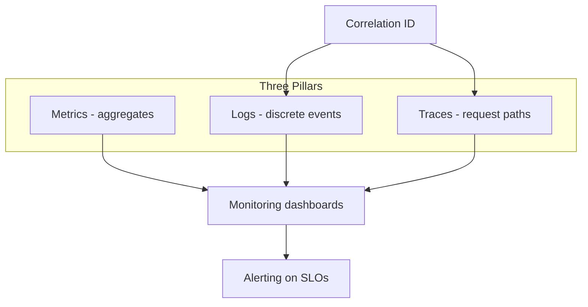

## Overview

**Observability** is the ability to understand internal system state from external outputs — primarily **logs**, **metrics**, and **traces**, supported by **monitoring** dashboards and **alerting** on SLO breaches.

The three pillars answer different questions:

| Pillar | Question | Example |
| :--- | :--- | :--- |
| **Metrics** | What is trending? | p99 latency, error rate, queue depth |
| **Logs** | What happened on this instance? | Stack trace, request payload metadata |
| **Traces** | How did this request flow? | Span tree across 12 microservices |

This page is the System Design **overview** for interviews. Production instrumentation, sampling policies, and on-call loops live in Microservices **Observability**.

> **Not the same as the logging case study:** [Distributed Logging System](/system-design/distributed-logging-system/) is an **APPLICATION** design for a log platform — one implementation of the logs pillar, not the full observability curriculum.

---

## Why It Matters

| Without observability | Result |
| :--- | :--- |
| “Users say it’s slow” | No SLI to debug |
| Alerts on CPU only | Miss dependency latency |
| Logs without trace ID | Cannot follow one request |
| Metrics without logs | Know *that* it failed, not *why* |
| No alerting loop | [Failure patterns](/system-design/failure-patterns-overview/) undetected |

Pair with [Resilience Patterns](/system-design/resilience-patterns-overview/) — breakers and retries need metrics on open state and retry rate.

---

## Core Concepts

### Three pillars



### Metrics

Time-series numeric measurements — cheap at high volume, ideal for dashboards and SLOs.

| Type | Example |
| :--- | :--- |
| Counter | Total requests, errors |
| Gauge | Queue depth, active connections |
| Histogram | Latency distribution (p50/p99) |

**Golden signals** (per service): **Latency**, **Traffic**, **Errors**, **Saturation** — link to [Latency vs Throughput](/system-design/latency-vs-throughput/).

### Logs

Structured or unstructured event records with timestamp, level, and context.

| Practice | Why |
| :--- | :--- |
| Structured JSON | Queryable fields |
| Correlation / trace ID | Tie to distributed trace |
| Log levels | Filter noise in production |
| Centralized aggregation | Search across fleet |

**Applied example:** [Distributed Logging System](/system-design/distributed-logging-system/) — ingestion, retention tiers, search at Splunk scale.

### Traces

Distributed tracing records a **trace** (one user request) as a tree of **spans** (per service hop).

| Concept | Purpose |
| :--- | :--- |
| Trace ID | End-to-end request identifier |
| Span | Single operation with start/end, tags |
| Parent/child spans | Latency breakdown by dependency |
| Baggage | Context propagated across services |

Critical for debugging microservices and async pipelines — [Notification System](/system-design/notification-system/), [Chat Application](/system-design/chat-application/).

### Correlation IDs

A **correlation ID** (or request ID) is propagated across HTTP headers, message metadata, and log lines so metrics, logs, and traces describe the **same unit of work**.

```
X-Request-ID: 7f3a9c2e-...
X-Trace-ID:     (OpenTelemetry trace context)
```

Without correlation, incident response is guesswork across thousands of log lines.

### RED method (request-driven services)

| Letter | Metric |
| :--- | :--- |
| **R**ate | Requests per second |
| **E**rrors | Failed requests / total |
| **D**uration | Latency distribution |

Use for APIs and synchronous microservices — [LinkedIn Job Search](/system-design/linkedin-job-search/) style read paths.

### USE method (resources)

| Letter | Metric |
| :--- | :--- |
| **U**tilization | % time resource busy |
| **S**aturation | Queue length, wait time |
| **E**rrors | Device / subsystem errors |

Use for databases, caches, brokers, hosts — [Fleet Vending IoT](/system-design/fleet-vending-iot/) edge devices.

### Monitoring vs observability

| Monitoring | Observability |
| :--- | :--- |
| Known dashboards & alerts | Explore unknown failures |
| Predefined metrics | High-cardinality drill-down |
| “Is it up?” | “Why is it slow for this user?” |

Both matter: monitoring for paging; observability for investigation.

### Alerting loop

1. **SLI** — measurable indicator (p99 latency, error rate)
2. **SLO** — target (99.9% of requests < 200ms)
3. **Error budget** — allowed bad events — [Availability & Nines](/system-design/availability-and-nines/)
4. **Alert** — fires on budget burn or symptom, not every blip
5. **Runbook** — link from alert to mitigation

Avoid alert fatigue: page humans on user-impacting symptoms, ticket on trends.

### Sampling

At high QPS, trace **every** request is expensive. Sample intelligently:

| Strategy | When |
| :--- | :--- |
| Head-based sampling | Fixed % at ingress |
| Tail-based sampling | Keep slow/error traces |
| Always sample critical paths | Payment, auth |

---

## Architect Perspective

### Interview answer template

1. **Name three pillars** — metrics, logs, traces
2. **Correlation ID** — ties them together
3. **RED for services** — rate, errors, duration
4. **Golden signals** — latency, traffic, errors, saturation
5. **Alert on SLO** — not raw CPU
6. **One applied example** — logging platform OR trace across chat

### Observability in system design process

Step 10 in [System Design Process](/system-design/system-design-process/): define SLIs per critical path, propagation across async boundaries, and dashboards before launch.

### Platform instrumentation

Vendor-neutral telemetry: [Kubernetes Handbook — OpenTelemetry](/kubernetes-handbook/opentelemetry/) (traces, metrics, logs export).

---

## Common Mistakes

| Mistake | Fix |
| :--- | :--- |
| Logs only, no metrics | Metrics for SLOs and trends |
| Metrics only, no traces | Traces for cross-service latency |
| No correlation ID | Propagate on every hop |
| Alert on threshold noise | SLO-based, multi-window burn |
| Logging case study = full observability | This page + MS deep dive |
| PII in logs | Redact, sample, retention policy |

---

## Interview Questions

1. **What are the three pillars of observability?**
2. **How do logs and traces differ? When do you use each?**
3. **Explain RED and USE methods.**
4. **What is a correlation ID and why is it necessary?**
5. **How would you alert on latency without paging on every spike?**
6. **How does the distributed logging case study relate to observability?**

---

## Related Topics

- [Distributed Logging System](/system-design/distributed-logging-system/) — logs pillar at platform scale
- [Latency vs Throughput](/system-design/latency-vs-throughput/) — latency SLIs
- [Resilience Patterns Overview](/system-design/resilience-patterns-overview/) — observe breaker and retry metrics
- [Failure Patterns Overview](/system-design/failure-patterns-overview/) — detection and game days
- [Non-Functional Requirements](/system-design/non-functional-requirements/) — operability NFRs

---

## Deep Dive References

| Topic | Location |
| :--- | :--- |
| Observability (PRIMARY) | [Microservices — Observability](/microservices/08-observability/observability/) |
| Reliability engineering & SLOs | [Microservices — Reliability Engineering](/microservices/10-production-playbook/reliability-engineering/) |
| OpenTelemetry / platform export | [Kubernetes Handbook — OpenTelemetry](/kubernetes-handbook/opentelemetry/) |

### Case studies with observability depth

| Case study | Observability angle |
| :--- | :--- |
| [Chat Application](/system-design/chat-application/) | Real-time delivery tracing |
| [LinkedIn Job Search](/system-design/linkedin-job-search/) | Search latency RED metrics |
| [Notification System](/system-design/notification-system/) | Async pipeline lag |
| [Fleet Vending IoT](/system-design/fleet-vending-iot/) | Edge device USE metrics |

**Interview practice:** [Distributed Logging System — Interview Questions](/system-design/distributed-logging-system-interview-questions/)
