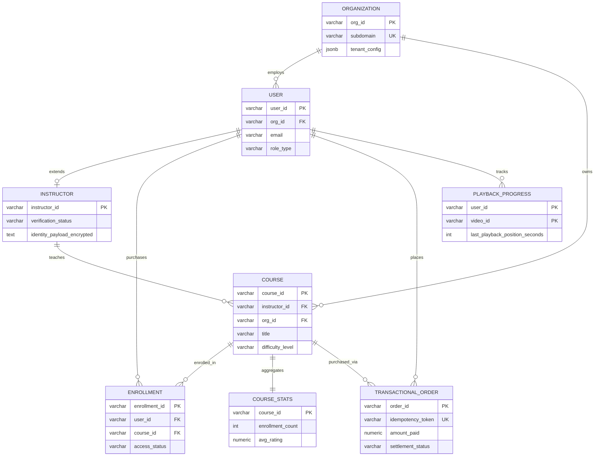
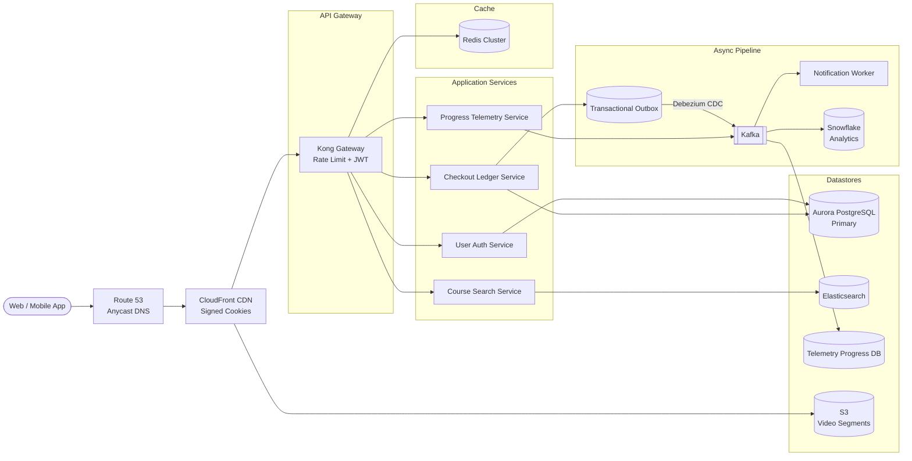
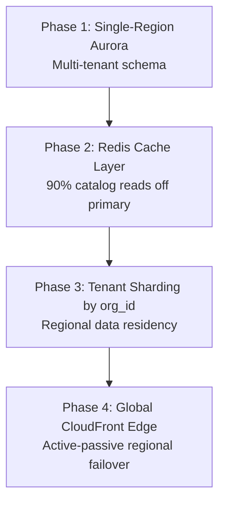
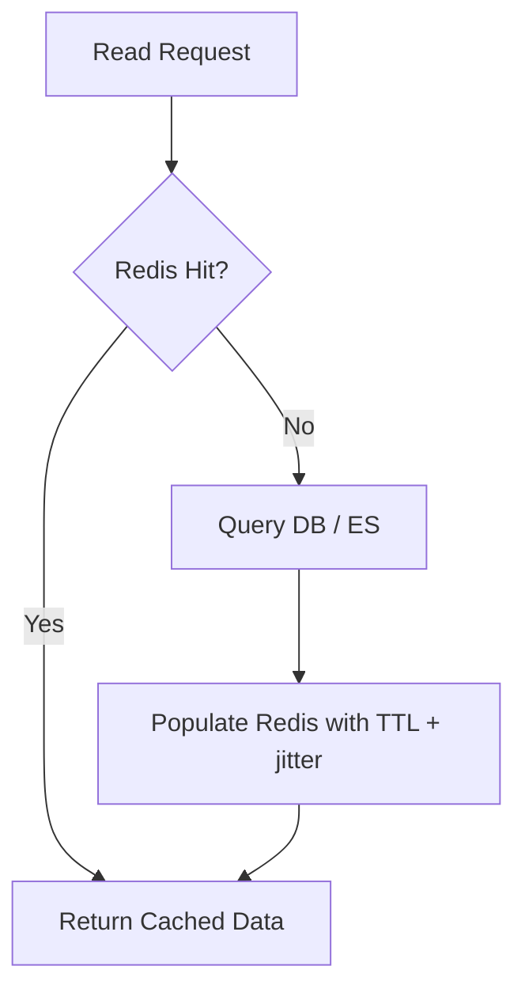

An online learning platform connects students, instructors, and enterprise tenants behind a course catalog, video playback layer, and financial settlement pipeline. At scale it is **read-heavy on discovery and streaming**, **write-bursty on telemetry heartbeats**, and **consistency-split** — catalog search and progress counters favor availability (AP), while payments, asset access control, and tenant isolation demand strong consistency (CP).

This post walks through the full design: requirements, capacity math, API contracts, data modeling, multi-tenant architecture, telemetry ingestion, technology trade-offs, caching, infrastructure sizing, and failure playbooks.

---

## 1. Requirements and Goals

### Functional Requirements — Students

| Requirement | Description |
| :--- | :--- |
| **Onboard & authenticate** | Registration, login, and role-based session management. |
| **Browse & search** | Textual search with structured filters (category, difficulty, price). |
| **View course structure** | Hierarchical chapters and lessons with metadata. |
| **Purchase & enroll** | Checkout for paid courses; instant grant for free tiers. |
| **Stream video** | On-demand (VOD) playback with global edge delivery. |
| **Track progress** | Section-by-section completion metrics via playback heartbeats. |
| **Reviews & quizzes** | Write course reviews; take multiple-choice assessments. |

### Functional Requirements — Instructors & Admins

| Role | Requirement | Description |
| :--- | :--- | :--- |
| **Instructor** | Identity verification | Validate against official registries (e.g., UDI/Aadhaar or equivalent global identity APIs). |
| **Instructor** | Asset upload | Upload videos, schemas, and quiz definitions. |
| **Instructor** | Analytics | View enrollment statistics and aggregated ratings. |
| **Admin / Moderator** | Content review | Compliance checks on submitted video before catalog publish. |

### Enterprise Features (B2B)

| Feature | Description |
| :--- | :--- |
| **Multi-tenant isolation** | Hard data boundaries per organization (`org_id`). |
| **White-label UI** | Dynamic styling configuration per tenant. |
| **Custom subdomains** | `acme.learnplatform.com` routing to tenant context. |
| **Tenant data grouping** | Shard and filter all queries by organization. |

### Clarifying Assumptions

| Question | Assumption |
| :--- | :--- |
| Live vs on-demand video? | **VOD** — pre-recorded lectures only. |
| Code execution in assessments? | **No** — multiple-choice quizzes and light text payloads. |
| B2B data residency rules? | **Multi-tenant sharding** by `org_id` to support regional isolation. |

### Non-Functional Requirements

| NFR | Target |
| :--- | :--- |
| **Scale baseline** | 100K active courses; 1M registered users; design validated at **10M DAU** |
| **Read / Write ratio** | **100 : 1** for browse/search/stream; **1 : 1** for telemetry heartbeats |
| **Video boot-up** | Time-to-first-frame **≤ 2 s** globally via edge orchestration |
| **Search latency** | Text search results **< 200 ms** |
| **Availability model** | **AP** for catalog search, landing pages, progress counters; **CP** for payments, asset ACL, tenant rights |
| **Media volume** | GB-scale video objects; high-frequency client heartbeats during playback |

---

## 2. Back-of-the-Envelope Calculations

### API Traffic (10M DAU)

Each active user executes roughly **20 interactive API calls per day** (browse, search, review):

| Metric | Calculation | Result |
| :--- | :--- | :--- |
| Requests / day | 10M × 20 | **200,000,000 / day** |
| Average RPS | 200M ÷ 86,400 s | **~2,315 RPS** |
| Peak RPS (4× burst) | 2,315 × 4 | **~9,260 RPS** |

### Video Telemetry Heartbeats

Clients send a playback position token every **10 seconds**. Assume **20% of DAU** (2M users) watch concurrently at peak:

| Metric | Calculation | Result |
| :--- | :--- | :--- |
| Heartbeat RPS | 2M ÷ 10 s | **200,000 RPS** |

Telemetry dominates write throughput — it must be buffered off the synchronous API hot path.

### Storage Growth

| Dataset | Assumption | Calculation | Result |
| :--- | :--- | :--- | :--- |
| Course metadata | 5K new courses/day × 50 KB | 5,000 × 50 KB | **250 MB / day** |
| Telemetry logs | 2M viewers × 30 min session × 1 heartbeat/10 s × 100 B | 2M × 180 × 100 B | **~36 GB / day** |
| **Annual DB growth** | Metadata + telemetry | 36.25 GB/day × 365 | **~13.2 TB / year** |

### Video Ingestion Bandwidth

| Stage | Assumption | Result |
| :--- | :--- | :--- |
| Raw upload ingress | 1,000 videos/day × 2 GB | **2 TB / day** |
| Transcoded variants | 1.5× overhead (1080p, 720p, 480p, 360p) | **3 TB / day** to object store |

### Cache Sizing Target

Cache the top **10%** of highly requested course listings, indexes, and session tokens:

```
1,000,000 active items × 10 KB/item ≈ 10 GB
```

---

## 3. API Design

| # | Method | Path | Purpose |
| :---: | :--- | :--- | :--- |
| 1 | GET | `/api/v1/courses/search` | Search Courses |
| 2 | POST | `/api/v1/courses/enroll` | Enroll in Course |
| 3 | POST | `/api/v1/telemetry/progress` | Progress Telemetry |



```json
{
  "query": "System Design",
  "filters": {
    "category": "Software Engineering",
    "difficulty": "Advanced",
    "price_max": 49.99
  },
  "pagination": { "page_size": 20, "cursor": "ZXF4OTM0" }
}
```



```json
{
  "data": [
    {
      "course_id": "crs_90234",
      "title": "Advanced Microservice System Design Architectures",
      "instructor_name": "Dr. Bunny",
      "rating": 4.95,
      "price": 29.99
    }
  ],
  "next_cursor": "YXVwODgy"
}
```




Headers: `X-Idempotency-Key: idm_uuid_v4_val`


```json
{
  "course_id": "crs_90234",
  "payment_method_token": "pm_tok_840239"
}
```



```json
{
  "enrollment_id": "enr_389234",
  "status": "PROCESSING",
  "message": "Payment resolution pipeline initiated."
}
```

`202 Accepted` signals async settlement — the client polls or receives a webhook when access is granted.





```json
{
  "course_id": "crs_90234",
  "video_id": "vid_77301",
  "playback_offset_seconds": 720,
  "client_timestamp_utc": "2026-06-26T16:07:00Z"
}
```



```json
{ "status": "ACK" }
```

Designed for fire-and-forget ingestion — the gateway ACKs after buffering to Kafka, not after a durable DB write.



### Global Error Contract

```json
{
  "error_code": "RESOURCE_LOCKED_BY_TRANSACTION",
  "message": "The enrollment asset state is currently locked by a live financial clearing routine.",
  "timestamp": "2026-06-26T16:07:02Z"
}
```
---

## 4. Data Model



### Core DDL (PostgreSQL)

```sql
CREATE TABLE organizations (
    org_id VARCHAR(64) PRIMARY KEY,
    name VARCHAR(255) NOT NULL,
    subdomain VARCHAR(128) UNIQUE NOT NULL,
    tenant_config JSONB NOT NULL,
    created_at TIMESTAMPTZ DEFAULT CURRENT_TIMESTAMP
);

CREATE TABLE users (
    user_id VARCHAR(64) PRIMARY KEY,
    org_id VARCHAR(64) REFERENCES organizations(org_id),
    name VARCHAR(255) NOT NULL,
    email VARCHAR(255) NOT NULL,
    password_hash VARCHAR(512) NOT NULL,
    role_type VARCHAR(32) NOT NULL
        CHECK (role_type IN ('STUDENT', 'INSTRUCTOR', 'MODERATOR', 'ADMIN')),
    created_at TIMESTAMPTZ DEFAULT CURRENT_TIMESTAMP
);
CREATE UNIQUE INDEX idx_users_org_email ON users(org_id, email);

CREATE TABLE course_stats (
    course_id VARCHAR(64) PRIMARY KEY REFERENCES courses(course_id),
    enrollment_count INT DEFAULT 0,
    avg_rating NUMERIC(3,2) DEFAULT 0.00
);

CREATE TABLE playback_progress (
    user_id VARCHAR(64) NOT NULL,
    course_id VARCHAR(64) NOT NULL,
    video_id VARCHAR(64) NOT NULL,
    last_playback_position_seconds INT NOT NULL,
    updated_at TIMESTAMPTZ DEFAULT CURRENT_TIMESTAMP,
    PRIMARY KEY (user_id, video_id)
);
```

### Normalization vs Denormalization

| Strategy | Tables | Rationale |
| :--- | :--- | :--- |
| **3NF (strict)** | `users`, `organizations`, `transactional_orders` | ACID guarantees for financial state; foreign-key integrity for tenancy |
| **Denormalized summaries** | `course_stats` | Isolates high-volume counter updates from catalog reads — prevents lock contention on `courses` |

---

## 5. High-Level Architecture



### Request Path Summaries

**Catalog search (read-heavy, AP):** Gateway → Redis cache-aside → Elasticsearch on miss. Results served from denormalized search documents synced via CDC.

**Enrollment (CP):** Gateway → Checkout Service → Aurora PostgreSQL under `SERIALIZABLE` isolation. Order state written atomically with an outbox row; Debezium publishes to Kafka only after commit.

**Telemetry (write-flood):** Gateway → Progress Service → in-memory buffer → Kafka partition by `user_id`. Batch consumers compact and upsert `playback_progress` asynchronously.

**Video playback:** Authorized clients receive CloudFront signed cookies. Segments served from edge cache — no origin round-trip per chunk.

---

## 6. Core Algorithms

### High-Throughput Progress Buffer

Incoming heartbeats merge in memory before batch flush to Kafka, keeping only the latest playback offset per `(user_id, video_id)`:




```java
public void bufferTelemetryUpdate(String userVideoCompositeKey, TelemetryRecord incoming) {
    internalMemoryMatrix.merge(userVideoCompositeKey, incoming, (existing, newer) ->
        newer.getPlaybackOffsetSeconds() > existing.getPlaybackOffsetSeconds()
            ? newer : existing);
}
```




```go
// TODO: idiomatic Go equivalent — mirror the Java snippet above
```




`ConcurrentHashMap.merge` provides optimistic concurrency without blocking network threads. A periodic `flushMemorySegment()` snapshots and clears the buffer under a write lock for bulk Kafka publish.

### Idempotent Checkout

Every enrollment request carries an `X-Idempotency-Key`. The Checkout Service checks `transactional_orders.idempotency_token` inside the same database transaction as the payment ledger write. Duplicate keys return the original `enrollment_id` without re-charging.

### Distributed ID Generation

**Snowflake IDs** (64-bit, timestamp-ordered) are used for `course_id`, `enrollment_id`, and `order_id`. They avoid auto-increment hot spots on distributed primaries and preserve time-order for debugging.

| Strategy | Pros | Cons |
| :--- | :--- | :--- |
| **Snowflake IDs** | Ordered, shard-friendly, no DB round-trip | Requires clock sync discipline |
| UUID v4 | Simple, collision-resistant | Random — poor index locality |
| DB auto-increment | Trivial | Hot row on single primary |

---

## 7. Database Selection and Scaling

### Technology Comparison

| Category | Selected | Alternatives | Justification |
| :--- | :--- | :--- | :--- |
| **Relational core** | Aurora PostgreSQL | MySQL, CockroachDB | JSONB tenant config, ACID payments, auto-scaling storage to 128 TB |
| **Search** | Elasticsearch | MongoDB, PG GIN | Sub-200 ms full-text with prefix matching at catalog scale |
| **Cache** | Redis Cluster | Memcached, Hazelcast | Sub-ms lookups, native TTL, master-replica failover |
| **Messaging** | Apache Kafka | RabbitMQ, SQS | WAL replay, 200K+ events/sec telemetry absorption |
| **Analytics** | Snowflake | Redshift, BigQuery | Columnar warehousing for enrollment and playback aggregates |

### Scaling Evolution



| Phase | Trigger | Action |
| :--- | :--- | :--- |
| **1** | MVP launch | Single Aurora primary + read replicas |
| **2** | Primary CPU > 75% on reads | Deploy Redis; cache-aside for catalog and sessions |
| **3** | GDPR / tenant isolation mandates | Horizontal shard by `org_id` |
| **4** | Global latency SLO breach | CloudFront edge + passive regional standby |

### High Availability Targets

| Metric | Target |
| :--- | :--- |
| **RPO** (transactional data) | ≤ 5 seconds |
| **RTO** (failover) | ≤ 60 seconds |
| **DB failover** | Aurora Multi-AZ automatic promotion (~30 s) |

---

## 8. Caching Strategy

**Pattern:** cache-aside for catalog reads; write-through for session tokens after login.



| Cache target | TTL strategy | Invalidation |
| :--- | :--- | :--- |
| Course listing cards | 5–15 min + random jitter | CDC event on `courses` update flushes key |
| Search result pages | 1–5 min | Index refresh webhook |
| Session / JWT metadata | Match token expiry | Explicit logout invalidation |
| Hot course metadata | LRU eviction under pressure | CDN layer for viral courses |

### Sizing

| Item | Calculation | Allocation |
| :--- | :--- | :--- |
| Hot catalog items | 1M × 10 KB | **10 GB** |
| Cluster topology | 6-node shard | **16 GB RAM per node** (headroom for replication) |

**Cache warming:** deployment workers pre-populate landing-page keys to absorb post-release traffic spikes.

---

## 9. Capacity Planning

Infrastructure sized for **10M DAU**, **~9,260 peak API RPS**, and **200,000 telemetry RPS**:

| Component | Pods / Nodes | Resources | Notes |
| :--- | :--- | :--- | :--- |
| **Kong API Gateway** | 30 pods (global) | 2 vCPU, 4 GB RAM | Rate limiting, JWT validation, subdomain routing |
| **Course Search Service** | 40 pods | 4 vCPU, 8 GB RAM | Elasticsearch query fan-out |
| **Telemetry Receiver** | 60 pods | 4 vCPU, 16 GB RAM | In-memory buffer + Kafka producer |
| **Redis Cluster** | 6 nodes | 16 GB RAM each | ~10 GB working set + replication overhead |
| **Kafka Brokers** | 5 brokers | NVMe storage | Sustained 200K events/sec with 7-day retention |
| **Aurora PostgreSQL** | 1 primary + 2 replicas | Auto-scaling storage | Transactional core only — telemetry offloaded |

**Auto-scaling:** Horizontal Pod Autoscaler adds instances when deployment-wide average CPU exceeds **65%** for 3 consecutive minutes.

---

## 10. Key Design Decisions Summary

| Decision | Choice | Rationale |
| :--- | :--- | :--- |
| Consistency split | AP for catalog/progress; CP for payments | Search staleness acceptable; double-charge is not |
| Telemetry path | Kafka buffer → batch consumer | 200K RPS cannot hit PostgreSQL synchronously |
| Checkout events | Transactional outbox + Debezium CDC | Atomic DB + event publish; no phantom orders on rollback |
| Stats denormalization | Separate `course_stats` table | Decouples counter writes from catalog row locks |
| Multi-tenancy | `org_id` on all rows + RLS + subdomain routing | Enterprise isolation without separate databases per tenant |
| Video access | CloudFront signed cookies | Edge-local ACL verification; no per-segment origin auth |
| ID generation | Snowflake IDs | Time-ordered, shard-friendly primary keys |
| Search store | Elasticsearch | Sub-200 ms full-text at 100K+ course scale |
| Security | OAuth 2.0 / OIDC JWT (RS256) | Stateless gateway validation; asymmetric key rotation |
| Tenant isolation | Row-Level Security on `org_id` | Defense-in-depth beyond application-layer filters |
| Observability | Prometheus + OpenTelemetry + Grafana | SLI: 99% API < 200 ms; checkout failure count = 0 |

---

## 11. Failure Modes and Mitigations

| Failure | Impact | Mitigation |
| :--- | :--- | :--- |
| **Redis cluster blackout** | Higher DB/ES load; latency spike | Circuit breaker at gateway; serve stale CDN catalog; limit deep pagination |
| **Kafka unavailable** | Telemetry ACK delayed; analytics gap | Local disk buffer with back-pressure; extend client retry window |
| **Aurora primary down** | No new enrollments; reads from replica | Multi-AZ auto-failover (~30 s); idempotent retry on checkout |
| **Elasticsearch degraded** | Search misses SLA | Fallback to PostgreSQL `ILIKE` for top queries; degrade filter facets |
| **Hot key on viral course** | Redis single-shard saturation | CDN cache course metadata; Caffeine local cache in gateway pods |
| **Outbox consumer lag** | Delayed enrollment confirmation emails | Monitor lag SLI; scale Debezium connectors; alert at 30 s lag |
| **Network partition (Redis Raft)** | Minority quorum refuses writes | Prevents split-brain; auto-resync on heal |
| **Regional outage** | Full region unavailable | Passive standby region; Route 53 health-check failover; RPO ≤ 5 s via Aurora replication |

### Interview Deep-Dive Highlights

**Why outbox instead of direct Kafka publish in checkout?** If the DB transaction rolls back after a Kafka message is sent, a phantom order appears in downstream consumers. The outbox pattern ties event emission to the same ACID commit.

**How prevent telemetry data loss at peak?** Kafka acts as a durable buffer with partitioned topics. Consumers batch-upsert at a rate matching database write capacity rather than synchronously blocking the API.

**Secure CDN caching with access control?** Issue time-limited CloudFront signed cookies after enrollment verification. The edge validates signatures locally — unauthorized requests never reach S3.

---

## What's Next

Companion posts can cover adjacent designs — instructor video transcoding pipelines, quiz grading workers, and a dedicated interview-questions sheet for this platform.
