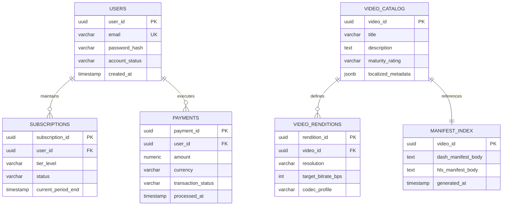
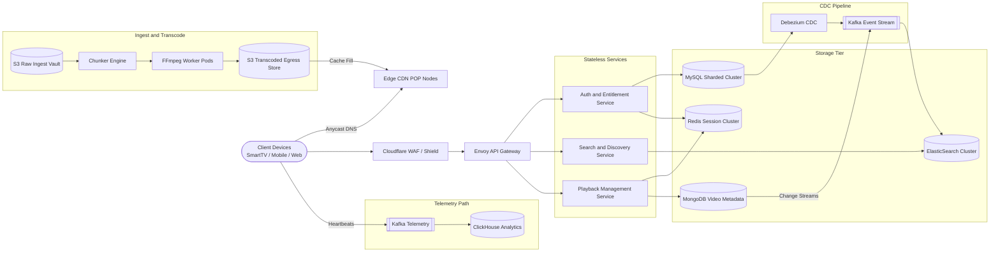
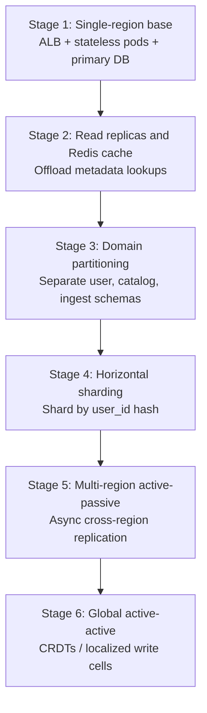
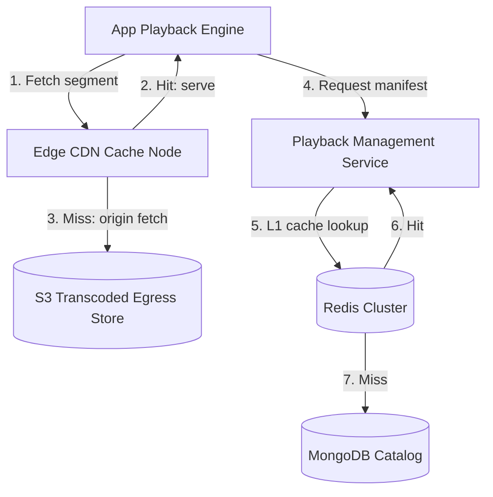

An OTT (over-the-top) streaming platform delivers on-demand video to smart TVs, mobile apps, and web browsers behind a subscription paywall. At scale it is **extremely read-heavy on playback and discovery paths** (99.99% reads), **bandwidth-dominated on egress**, and **consistency-split** — video ingestion and consumption favor availability (AP), while billing and payment state demand ACID guarantees (CP).

This post walks through the full design: requirements, capacity math, API contracts, data modeling, CDN-centric architecture, adaptive bitrate streaming, technology trade-offs, caching, infrastructure sizing, and failure playbooks.

---

## 1. Requirements and Goals

### Functional Requirements (MVP)

| Requirement | Description |
| :--- | :--- |
| **User onboarding & authentication** | Secure registration, login, and token-based session management. |
| **Subscription & paywall** | Tiered monetization with deterministic access validation before video distribution. |
| **Video discovery** | High-performance title, genre, and metadata lookup via full-text search. |
| **Adaptive bitrate streaming** | Native playback supporting dynamically scaling resolutions from 480p up to 4K. |

### Premium Features

| Feature | Description |
| :--- | :--- |
| **Multi-DRM protection** | Widevine, FairPlay, and PlayReady license servers for encrypted playback. |
| **Geo-fenced catalog** | Metadata queries filtered by user geo-IP profile and licensing rights. |
| **Concurrent stream limits** | Session verification at edge gateways per subscription tier. |
| **Continue watching** | Playback position heartbeats with async persistence. |
| **Personalized recommendations** | Pre-computed offline ML feeds served from key-value cache. |

### Clarifying Assumptions

| Question | Assumption |
| :--- | :--- |
| User-generated content (UGC)? | **No** — controlled studio ingestion pipeline only. |
| Concurrent stream limits per account? | **Yes** — enforced at API gateway / edge. |
| Localized catalog restrictions (geo-fencing)? | **Yes** — metadata filtered via geo-IP profiles. |

### Non-Functional Requirements

| NFR | Target |
| :--- | :--- |
| **Scale** | 200M DAU; 10,000 curated titles (~1 hr average runtime) |
| **Concurrency** | 10% of DAU active at peak = **20M concurrent users** |
| **Read / Write ratio** | **99.99 : 0.01** on playback systems; metadata writes are batch-driven |
| **Video start time (VST)** | P99 time-to-first-frame **< 200 ms** via edge topologies |
| **Rebuffer rate** | **< 0.25%** of active sessions over any 24-hour window |
| **Availability** | **AP** for ingestion and consumption; **CP** for payments and billing |
| **API availability SLO** | 99.99% non-5xx at the edge gateway |

---

## 2. Back-of-the-Envelope Calculations

### Traffic Estimates

Starting from **200M DAU** and **5 catalog interactions per active user per day**:

| Metric | Calculation | Result |
| :--- | :--- | :--- |
| Metadata & discovery requests / day | 200M × 5 | **1,000,000,000 / day** |
| Average RPS | 1B ÷ 86,400 s | **~11,574 RPS** |
| Peak RPS (4× evening skew) | 11,574 × 4 | **~46,300 RPS** |

### Concurrent Streaming & Bandwidth

At peak, **20M concurrent streams** with mixed resolution distribution:

| Resolution | Share | Bitrate | Concurrent streams | Bandwidth |
| :--- | :--- | :--- | :--- | :--- |
| 1080p | 50% | 5 Mbps | 10,000,000 | **50 Tbps** |
| 720p | 40% | 2.5 Mbps | 8,000,000 | **20 Tbps** |
| 4K Ultra-HD | 10% | 25 Mbps | 2,000,000 | **50 Tbps** |
| **Total egress** | | | | **120 Tbps** |

### Event Ingestion (Telemetry)

Clients emit heartbeats every **5 seconds** during active playback:

| Metric | Calculation | Result |
| :--- | :--- | :--- |
| Inbound events / sec | 20M ÷ 5 s | **4,000,000 events/sec** |

### Storage

| Dataset | Assumption | Result |
| :--- | :--- | :--- |
| Raw master sources | 10K titles × 150 GB/hr | **~1.5 PB** (ingest vault) |
| Transcoded variants | 10K × 30 GB (4K/1080p/720p/480p × H.264/HEVC/AV1) | **~300 TB** (egress store) |
| Catalog metadata (Redis) | 10K × 500 KB | **~5 GB** |
| Active session profiles (Redis) | 20M × 2 KB | **~40 GB** |
| **Redis total** | Catalog + sessions + overhead | **~45 GB** |

---

## 3. API Design

| # | Method | Path | Purpose |
| :---: | :--- | :--- | :--- |
| 1 | POST | `/api/v1/playback/session` | Playback Session Initiation |
| 2 | GET | `/api/v1/search?q={term}&genre={g}&page={n}&size={n}` | Search Catalog |
| 3 | GET | `/api/v1/videos/{video_id}` | Get Video Metadata |


Headers: `Authorization: Bearer <JWT>`, `X-Idempotency-Key: <UUID>`


```json
{
  "video_id": "vid_9948523a10ff",
  "device_profile": "TV_4K_RECV",
  "preferred_codec": "AV1",
  "supported_protocols": ["DASH", "HLS"]
}
```



```json
{
  "playback_session_id": "pb_sess_77391aefb204",
  "manifest_url": "https://edge-cdn.platform.com/manifests/vid_9948523a10ff/master.mpd",
  "license_server_url": "https://drm.platform.com/api/v1/license",
  "stream_token": "st_eyJhbGciOiJIUzI1NiIsInR5cCI6IkpXVCJ9...",
  "heartbeat_interval_ms": 5000
}
```

The `X-Idempotency-Key` header prevents duplicate stream accounting, license locking, and redundant billing state on network retries.



{{< api-endpoint method="GET" path="/api/v1/search?q={term}&genre={g}&page={n}&size={n}" desc="Search Catalog" >}}

```json
{
  "items": [
    {
      "video_id": "vid_9948523a10ff",
      "title": "The Midnight Signal",
      "thumbnail_url": "https://edge-cdn.platform.com/thumbs/vid_9948523a10ff.jpg",
      "maturity_rating": "PG-13",
      "duration_seconds": 5400
    }
  ],
  "pagination": { "current_page": 1, "total_pages": 12, "total_items": 120 }
}
```



{{< api-endpoint method="GET" path="/api/v1/videos/{video_id}" desc="Get Video Metadata" >}}

```json
{
  "video_id": "vid_9948523a10ff",
  "title": "The Midnight Signal",
  "description": "A sci-fi thriller set in near-future Mumbai.",
  "genres": ["Sci-Fi", "Thriller"],
  "cast": ["Actor A", "Actor B"],
  "localized_metadata": { "hi": { "title": "मिडनाइट सिग्नल" } },
  "maturity_rating": "PG-13"
}
```



### Rate Limits

| Scope | Limit |
| :--- | :--- |
| Unauthenticated endpoints | 10 requests / minute / IP |
| Authenticated endpoints | 500 requests / minute / token |

**Common HTTP error codes**

{}
| Code | When |
| :--- | :--- |
| `401 Unauthorized` | Token missing or expired |
| `403 Forbidden` | Subscription tier lacks privileges, or concurrent stream limit breached |
| `409 Conflict` | Duplicate `X-Idempotency-Key` context already processed |
| `429 Too Many Requests` | Rate limiter threshold crossed at API gateway |
{}
---

## 4. Data Model



### MySQL (InnoDB) — Users, Subscriptions, Payments

Sharded by `user_id` hash. Strict ACID for billing mutations. Compound index on `(user_id, status)` for fast entitlement validation.

### MongoDB — Video Catalog

Denormalized documents with nested localization arrays, genre/cast arrays, and rendition metadata. Multi-key indexes on `genres` and `cast` array fields.

### Manifest Index

Pre-compiled DASH (`.mpd`) and HLS (`.m3u8`) manifest bodies generated during transcoding. At playback time, static manifests are served from **edge CDN** — not read from MongoDB on every request.

---

## 5. High-Level Architecture



### Ingest Path

1. Studio uploads ProRes master to **S3 Raw Ingest Vault**.
2. S3 event triggers **Chunker Engine** — slices master into uniform micro-chunks on NVMe scratch disks.
3. **FFmpeg worker pods** (KEDA-autoscaled) transcode each chunk into multiple bitrates and codecs (H.264, HEVC, AV1).
4. Rendered segments land in **S3 Transcoded Egress Store**; manifests are pre-compiled and pushed to **edge CDN** nodes.

### Metadata Path

1. Catalog mutations in **MongoDB** stream via change streams → **Kafka**.
2. **Debezium** tails MySQL binlog for user/subscription changes.
3. **ElasticSearch** consumers update search indices without scanning primary storage.

### Playback Path

1. Client authenticates via **API Gateway** (JWT RS256 validation, entitlement claims, geo-IP check).
2. **Playback Management Service** issues a signed stream token and manifest URL pointing to **edge CDN**.
3. Media segment delivery **bypasses application servers entirely** — served from globally distributed CDN cache fabric.
4. Client heartbeats flow to **Kafka Telemetry** → **ClickHouse** for real-time SLI monitoring.

---

## 6. Core Algorithms — Adaptive Bitrate, Manifest Generation, and Concurrency

### Adaptive Bitrate (ABR) Manifest Model

Single master manifests contain alternate media tracks. The client monitors download performance per chunk and switches resolution on the next chunk boundary — not by swapping entire playlists.




```java
public interface ManifestGenerator {
    String generateManifest(UUID videoId, DeviceProfile profile, CodecPreference codec);
}

public class DashManifestGenerator implements ManifestGenerator {
    private final VideoRepository videoRepo;
    private final CacheManager cache;

    @Override
    public String generateManifest(UUID videoId, DeviceProfile profile, CodecPreference codec) {
        return cache.getOrElse(videoId + ":" + profile.name(), () -> {
            VideoMetadata meta = videoRepo.findTranscodedRenditions(videoId);
            return ManifestStitcherEngine.buildMPD(meta, profile, codec);
        });
    }
}
```




```go
// TODO: idiomatic Go equivalent — mirror the Java snippet above
```




**I-frame alignment:** Transcode workers force keyframes at fixed intervals (e.g., every 2 seconds) so chunks align across all resolutions — enabling seamless bitrate switches without decoder artifacts.

**CMAF benefit:** Fragmented MP4 containers serve both DASH and HLS from a single encoded set, cutting storage footprint nearly in half.

### Audio and Subtitle Separation

Audio tracks are stored independently from video streams. Manifests link video tracks with multi-language audio; clients download only the requested language. Subtitles ship as lightweight WebVTT/TTML, cached on edge CDN.

### Concurrency and Locking

| Domain | Strategy | Mechanism |
| :--- | :--- | :--- |
| **Billing mutations** | Pessimistic + transactional | `@Transactional(isolation = REPEATABLE_READ)` with row-level locks |
| **Analytics writes** | Optimistic | Version column with retry loops |
| **Payment idempotency** | Atomic dedup | Redis `SETNX` on `X-Idempotency-Key` with TTL |
| **Continue watching** | Write-behind | Heartbeats → Kafka → batch flush to Redis → async DB persist |

### ID Generation — UUIDv7

| Strategy | Pros | Cons |
| :--- | :--- | :--- |
| **UUIDv7** | Timestamp-sortable; globally decentralized | Slightly longer than Snowflake |
| **Snowflake** | Compact 64-bit IDs | Requires coordination service |
| **Auto-increment** | Simple | Single-node bottleneck |

UUIDv7 combines time-based database sorting with decentralization — no single-point sync engine.

---

## 7. Database Selection and Scaling

### Technology Comparison

| Domain | Choice | Alternatives rejected | Rationale |
| :--- | :--- | :--- | :--- |
| **User identity & billing** | MySQL InnoDB (sharded) | PostgreSQL, CockroachDB | Mature operational sharding; lower overhead than Cockroach at extreme volume |
| **Video catalog** | MongoDB | Cassandra, DynamoDB | Flexible nested JSON; native secondary indexes on array fields |
| **Full-text search** | ElasticSearch | Postgres `trgm`, OpenSearch | High-performance fuzzy indexing decoupled from transactional DB CPU |
| **Session & manifest cache** | Redis Enterprise | Memcached, Hazelcast | Sorted sets, hashes for token lifecycle; richer than Memcached |
| **Event streaming** | Kafka | RabbitMQ, Pulsar | Append-only log scales to 4M events/sec telemetry |
| **Analytics warehouse** | ClickHouse | BigQuery, Snowflake | Real-time columnar ingestion for playback SLIs |
| **Asset storage** | S3 + Edge CDN | Database BLOBs | Databases are not optimized for multi-TB media objects |

### Scaling Strategy



| Phase | Trigger | Action |
| :--- | :--- | :--- |
| Read replicas + cache | Metadata RPS > 10K or DB connection pool starvation | Redis cache-aside before MongoDB; MySQL read replicas |
| Domain partitioning | Cross-domain joins become impossible | Independent schemas for user, catalog, ingest state |
| Horizontal sharding | Single-region limits reached | `user_id % N` consistent hash |
| Multi-region | Cross-region write latency unacceptable | Active-passive with async replication; Anycast failover |
| Active-active | Global single-digit-ms latency required | CRDTs or sharded write paths to localized storage cells |

---

## 8. Caching Strategy



### Cache Patterns by Component

| Component | Pattern | Behavior |
| :--- | :--- | :--- |
| **Video segments (CDN)** | Read-through | Edge miss fetches from S3, caches locally, serves client |
| **Manifest index (Redis)** | Cache-aside | App checks Redis → miss queries MongoDB → hydrates Redis |
| **Static manifests (CDN)** | Pre-warm | First 5 seconds of all titles pre-cached on edge nodes for low VST |
| **Trending lists (Redis)** | TTL-based | 5-minute TTL for fresh recommendations |
| **Catalog metadata (Redis)** | Cache-aside | 24-hour TTL for static title payloads |

### Eviction and TTL

| Data type | TTL | Eviction |
| :--- | :--- | :--- |
| Static manifest files | 24 hours | LRU at CDN edge |
| Trending / recommendations | 5 minutes | `volatile-lru` |
| Session JWT profiles | Token lifetime | Redis TTL aligned to expiry |
| Catalog metadata | 1 hour (immediate invalidation via Pub/Sub on urgent edits) | `volatile-lru` |

### Stampede Protection

On cache miss for hot titles (new release drops), a **distributed mutex** ensures only one worker queries MongoDB; concurrent requests wait for hydration. Regional CDN nodes are **pre-warmed** with manifest and first segments before official release time.

### Sizing

| Pool | Calculation | Allocation |
| :--- | :--- | :--- |
| Catalog metadata | 10K × 500 KB | ~5 GB |
| Active sessions | 20M × 2 KB | ~40 GB |
| **Production cluster** | 16 shards × (primary + replica) | **~45 GB data + replication headroom** |

---

## 9. Capacity Planning

Target: **46,300 peak ingress RPS** across stateless layers.

| Component | Metric | Calculation / Assumption | Recommendation |
| :--- | :--- | :--- | :--- |
| **Envoy API Gateway** | Peak ingress RPS | 46,300 RPS | **60 pods** (4 vCPU, 8 GB RAM each) |
| **Auth & Entitlement Service** | Entitlement checks | ~30% of ingress | **120 pods** (2 vCPU, 4 GB RAM) |
| **Playback Management Service** | Session setup | ~45% of ingress | **200 pods** (4 vCPU, 8 GB RAM) |
| **Search & Discovery Service** | Catalog queries | ~25% of ingress | **100 pods** (2 vCPU, 4 GB RAM) |
| **Redis cluster** | Sessions + manifest cache | ~45 GB + headroom | **16 shards** (primary + replica, NVMe) |
| **Kafka brokers** | Telemetry + CDC | 4M events/sec peak | **24 brokers** (EBS gp3, 10K IOPS) |
| **MySQL cluster** | User/billing sharded | Multi-AZ | **12 nodes** across shards |
| **ElasticSearch** | 10K catalog documents | Low doc count, high QPS | **6 data nodes + 3 masters** |
| **CDN egress** | Peak streaming | 120 Tbps mixed resolution | Global POP matrix + ISP cache appliances |
| **HPA trigger** | CPU > 65% or memory > 70% | Scale-up in 15 s; 10-min cooldown | Prevent thrashing on minor drops |

---

## 10. Key Design Decisions Summary

| Decision | Choice | Rationale |
| :--- | :--- | :--- |
| Manifest distribution | Pre-compiled on edge CDN | Bypasses app servers during playback; instructor simplification of reading MongoDB per request is not production-viable |
| Ingest pipeline | Distributed chunker + KEDA GPU fleet | Concurrent transcode across spot instances; crash mid-job only re-processes one fragment |
| ABR control | Single master manifest with alternate tracks | Client switches chunk resolution dynamically; not separate playlist swaps |
| Entitlement enforcement | Signed JWT claims at edge gateway | Subscription tier and geo embedded in token; avoids DB lookup on every segment request |
| Telemetry | Kafka → ClickHouse | 4M events/sec heartbeats enable real-time VST and rebuffer SLI dashboards |
| DRM | Multi-DRM (Widevine, FairPlay, PlayReady) | AES-CTR encrypted chunks; keys via hardware-level device decryption |
| Authentication | JWT RS256 (asymmetric) | Edge gateways verify with public key; no round-trip to auth service |
| Secrets management | Vault / AWS Secrets Manager + IAM roles | Credentials injected at pod runtime; rotated every 30 days |
| Encryption | TLS 1.3 in transit; AES-256 at rest | All storage volumes, databases, and S3 objects |
| Observability | OpenTelemetry + W3C Trace Context | Tail-based sampling: 100% error traces, 1% success traces |
| Video start optimization | CDN pre-warm first 5 s of all titles | Proactive segment fetch before user presses play |
| Production vs video simplification | See table below | Addresses gaps in typical interview walkthroughs |

### Production Improvements Over Typical Interview Designs

| Vector | Typical simplification | Production implementation |
| :--- | :--- | :--- |
| Manifest distribution | Play service reads MongoDB per request | Pre-compiled manifests on global edge CDN as static `.mpd`/`.m3u8` files |
| Ingestion | Single upload → processing bucket | Distributed orchestration: chunk → parallel transcode → egress store |
| Dynamic bitrate | Separate manifest playlists per quality | Single master manifest with alternate media tracks |
| Entitlement | Service-to-service API lookup per request | Cryptographic claims in session JWT validated at edge |
| Telemetry | Omitted | Continuous client heartbeats → Kafka → ClickHouse |

### SLI / SLO Framework

| SLI | SLO Target |
| :--- | :--- |
| Video start time (VST) | P95 < 250 ms to first playback chunk |
| Rebuffer rate (RBR) | < 0.25% of sessions / 24 hr |
| API edge error rate | 99.99% availability (< 1 in 10K 5xx) |

---

## 11. Failure Modes and Mitigations

| Failure | Impact | Mitigation |
| :--- | :--- | :--- |
| **Redis cluster outage** | Thundering herd on MongoDB / MySQL | Circuit breaker (Resilience4j) at 10% error rate; serve pre-compiled static catalog from local memory |
| **Region / AZ failure** | Partial or total regional outage | Anycast DNS reroute within 30 s; non-critical features (watch history sync) degrade to async |
| **Kafka broker crash** | Telemetry gap; CDC lag | Consumers resume from committed offsets; outbox buffers locally |
| **Transcode worker crash** | Incomplete rendition for one chunk | Chunker reassigns only the failed fragment; no full re-encode |
| **MySQL primary down** | Billing mutations blocked | Multi-AZ synchronous replication; RAFT failover < 30 s |
| **ElasticSearch down** | Search unavailable; direct video lookup still works | Serve cached top queries; CDC backlog replays on recovery |
| **CDN edge miss storm** | Elevated origin egress on new release | Pre-warm manifests + first segments; mutex on app-layer cache misses |
| **Credential stuffing** | Brute-force login attempts | Redis sliding-window counter; CAPTCHA challenge on spike |
| **Payment duplicate on retry** | Double charge risk | `X-Idempotency-Key` + Redis `SETNX` atomic dedup |
| **Split-brain in DB cluster** | Corrupted write state | Consensus protocol (RAFT) requiring strict majority for primary election |

### HA / DR Objectives

| Objective | Target |
| :--- | :--- |
| **RTO** | ≤ 5 minutes (traffic reroute to alternate region) |
| **RPO — payments** | 0 seconds (synchronous WAL streaming) |
| **RPO — catalog metadata** | ≤ 1 hour (async replication acceptable) |
| **Availability SLO** | 99.99% non-5xx at API gateway |

### Graceful Degradation Under Extreme Load

API Gateway feature flags disable non-essential processes — real-time recommendation updates, viewing history tracking, search auto-suggest — preserving database connections and CPU for core playback requests.

---

## What's Next

Future posts in this series will cover adjacent designs — live streaming event architecture (rolling-window manifests), recommendation engine pipelines, and multi-region DRM key rotation at global scale.
