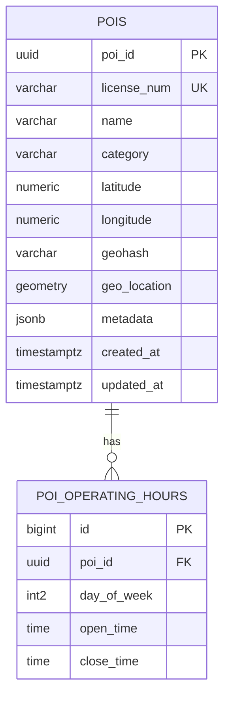
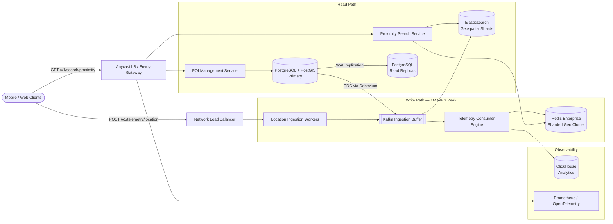
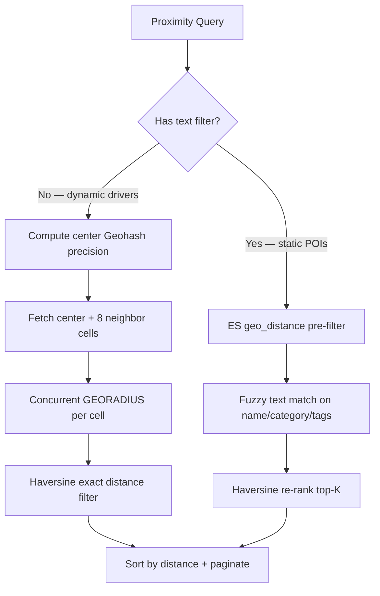
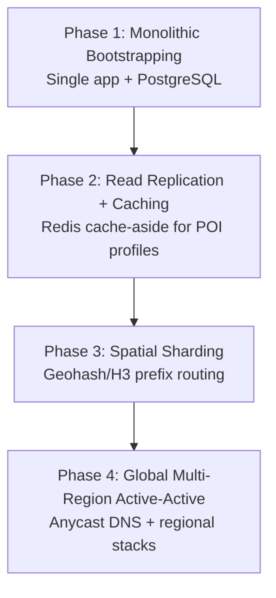

A proximity search engine answers one question at planetary scale: *what is near me right now?* Given a latitude, longitude, and radius, it returns paginated points of interest — restaurants, hotels, or live drivers — optionally filtered by name, category, or tags. At Uber, DoorDash, Yelp, or Google Maps scale the system is **write-dominated on the telemetry path** (1M location updates per second at peak) while read queries must still return in **P99 < 50 ms**.

This post walks through the full design — requirements, capacity math, API contracts, dual-engine storage (PostGIS + Redis Geo), CQRS architecture, spatial algorithms, technology trade-offs, caching, infrastructure sizing, HA/DR, and failure modes. For 50 senior-level interview follow-ups, see [Proximity Search Interview Questions](/system-design/proximity-search-interview-questions/).

---

## 1. Requirements and Goals

### Functional Requirements (MVP)

| Requirement | Description |
| :--- | :--- |
| **Geospatial proximity search** | Given `(lat, lng)` and radius `R` (default 5 km, max 50 km), return paginated POIs (restaurants, hotels, active drivers). |
| **Textual & fuzzy attribute search** | Search by name, category, or tags (e.g. "Pizza", "McDonald's") combined with proximity constraint. |
| **POI management (CRUD)** | Business owners create, update, or delete POI metadata, operating hours, and precise coordinates. |
| **Real-time location updates** | Dynamic POIs (drivers, couriers) accept telemetry every **4 seconds** and become queryable within seconds. |

### Premium Features

| Feature | Description |
| :--- | :--- |
| **Routing distance (isochrones)** | Async graph-engine computation for true travel-time distance (off hot path). |
| **Autocomplete** | Elasticsearch completion suggester with `geo_distance` filter wrapper. |
| **Fleet analytics** | Historical location aggregation via ClickHouse cold storage. |

### Clarifying Assumptions

| Question | Assumption |
| :--- | :--- |
| Static vs dynamic POIs? | **Polymorphic ingestion** — low-velocity static POI changes → PostgreSQL; high-velocity telemetry → in-memory ephemeral layer. |
| Search radius shape? | Initial filter via bounding box / Geohash / H3 cell; secondary exact Haversine filter. Routing distance is async. |
| Static POI propagation SLA? | **2–3 seconds** — async replica replication + ES indexing pipeline. |
| Consistency model? | **Eventual** — new restaurant or driver position may lag 2–3 seconds; acceptable. |

### Non-Functional Requirements

| NFR | Target |
| :--- | :--- |
| **Scale** | 100M DAU; 50M static POIs; 1M concurrent dynamic entities at peak |
| **Latency** | Proximity read **P99 < 50 ms**; telemetry write **P99 < 20 ms** |
| **Availability** | **99.999%** uptime; survive full AZ or region failure without static POI data loss |
| **Horizontal scalability** | Hundreds of thousands of concurrent reads; millions of ingestion streams at peak |
| **Read / Write ratio** | **1 : 108** (write-dominated due to driver telemetry) |

---

## 2. Back-of-the-Envelope Calculations

### Traffic Estimates

Starting from **100M DAU**, **2 reads/user/day**, and **1M active drivers** updating every **4 seconds**:

| Metric | Calculation | Result |
| :--- | :--- | :--- |
| Read requests / day | 100M × 2 | **200M / day** |
| Telemetry writes / day | 1M × (86,400 ÷ 4) | **21.6B / day** |
| Average read RPS | 200M ÷ 86,400 | **~2,315 RPS** |
| Peak read RPS (4×) | 2,315 × 4 | **~9,260 RPS** |
| Average write RPS | 21.6B ÷ 86,400 | **~250,000 WPS** |
| Peak write RPS (4×) | 250K × 4 | **~1,000,000 WPS** |
| Read : Write ratio | 200M : 21.6B | **~1 : 108** |

### Storage (Static POI Metadata)

| Assumption | Calculation | Result |
| :--- | :--- | :--- |
| Record size | poi_id (16B) + name (100B) + lat/lng (16B) + geohash (12B) + metadata (256B) | **~400 B** |
| Total static POIs | 50M × 400 B | **~20 GB** |
| Daily growth | 10K new POIs × 400 B | **~4 MB / day (~1.46 GB / year)** |

### Bandwidth

| Path | Calculation | Result |
| :--- | :--- | :--- |
| Peak write ingress | 1M WPS × 100 B (Protobuf telemetry) | **~100 MB/s (~800 Mbps)** |
| Peak read egress | 9,260 RPS × 4 KB (20 POIs JSON) | **~37 MB/s (~296 Mbps)** |
| Kafka events/sec | Full peak telemetry pipeline | **~1,000,000 events/sec** |

### Live Driver Cache Memory

| Metric | Calculation | Result |
| :--- | :--- | :--- |
| Active drivers | 1M concurrent | — |
| Bytes per entry (with Redis overhead) | ~256 B allocated | — |
| Total in-memory pool | 1M × 256 B | **~256 MB** (lightweight; I/O concurrency is the bottleneck) |

---

## 3. API Design

### Search Nearby Points of Interest

**`GET /v1/search/proximity`**

| Parameter | Type | Required | Notes |
| :--- | :--- | :--- | :--- |
| `latitude` | float64 | Yes | e.g. `12.9716` |
| `longitude` | float64 | Yes | e.g. `77.5946` |
| `radius_meters` | int32 | No | Default `5000`, max `50000` |
| `query` | string | No | Text match, e.g. `pizza` |
| `limit` | int32 | No | Default `20` |
| `next_token` | string | No | Opaque cursor for pagination |

Header: `X-Request-ID: <uuid>` (required for tracing)

Response (`200 OK`):

```json
{
  "results": [
    {
      "poi_id": "c4a7b812-d933-4b11-a823-112233445566",
      "name": "Luigi's Authentic Pizzeria",
      "latitude": 12.9722,
      "longitude": 77.5951,
      "distance_meters": 72.5,
      "rating": 4.8
    }
  ],
  "pagination": {
    "next_token": "eyJvZmZzZXQiOjIwLCJzZWVkIjo0Mn0="
  }
}
```

### Update Dynamic Location Telemetry

**`POST /v1/telemetry/location`**

```json
{
  "entity_id": "d83b9101-3821-419a-9912-887766554433",
  "entity_type": "DRIVER",
  "latitude": 12.9716,
  "longitude": 77.5946,
  "timestamp": 1774843200
}
```

Response (`202 Accepted`):

```json
{
  "status": "ACCEPTED",
  "tracking_id": "req-99887766-5544"
}
```

### POI Management (CRUD)

**`POST /v1/poi`** — create static POI. Header: `X-Idempotency-Key: <uuid>` (120 s TTL in gateway Redis).

**`PUT /v1/poi/{poi_id}`** — update metadata, hours, coordinates.

**`DELETE /v1/poi/{poi_id}`** — soft-delete with CDC propagation to ES.

### Error Matrix

| HTTP | Condition |
| :--- | :--- |
| `400` | Invalid coordinates (lat ∉ [-90, 90], lng ∉ [-180, 180]) |
| `429` | Rate limiter exhaustion per user / IP / token |
| `503` | Downstream spatial index or cache cluster degradation |

### Idempotency Strategy

| Operation | Strategy |
| :--- | :--- |
| POI create (`POST /v1/poi`) | `X-Idempotency-Key` stored in Redis (120 s TTL) — deduplicates network retries |
| Telemetry (`POST /v1/telemetry/location`) | No idempotency key; **timestamp monotonicity** — older timestamps discarded at consumer |

---

## 4. Data Model



### Core DDL (PostgreSQL + PostGIS)

```sql
CREATE EXTENSION IF NOT EXISTS postgis;

CREATE TABLE pois (
    poi_id        UUID PRIMARY KEY,
    license_num   VARCHAR(50) UNIQUE,
    name          VARCHAR(100) NOT NULL,
    category      VARCHAR(30),
    latitude      NUMERIC(9,6) NOT NULL,
    longitude     NUMERIC(10,6) NOT NULL,
    geohash       VARCHAR(12) NOT NULL,
    geo_location  GEOMETRY(Point, 4326) NOT NULL,
    metadata      JSONB,
    created_at    TIMESTAMPTZ DEFAULT CURRENT_TIMESTAMP,
    updated_at    TIMESTAMPTZ DEFAULT CURRENT_TIMESTAMP
);

CREATE INDEX idx_pois_geo ON pois USING GIST (geo_location);
CREATE INDEX idx_pois_geohash ON pois (geohash varchar_pattern_ops);
CREATE INDEX idx_pois_meta ON pois USING GIN (metadata);

CREATE TABLE poi_operating_hours (
    id          BIGSERIAL PRIMARY KEY,
    poi_id      UUID REFERENCES pois(poi_id),
    day_of_week INT2 NOT NULL,
    open_time   TIME NOT NULL,
    close_time  TIME NOT NULL
);
```

### Index Rationale

| Index | Purpose |
| :--- | :--- |
| `GIST(geo_location)` | R-Tree spatial index — bounding-box queries in O(log N) |
| `geohash varchar_pattern_ops` | Prefix scans for Geohash-based shard routing |
| `GIN(metadata)` | JSONB attribute filters, e.g. `metadata->>'is_delivery_available'` |

### Normalization Strategy

| Partition | Strategy | Rationale |
| :--- | :--- | :--- |
| POI core + operating hours | **3NF normalized** | Referential integrity; avoid update anomalies |
| lat, lng, geohash on `pois` | **Denormalized** | Compute once at write; avoid CPU on every read |
| Dynamic driver locations | **Redis Geo only** | Ephemeral; no relational durability needed |

`NUMERIC(9,6)` latitude gives ~11 cm accuracy. `GEOMETRY(Point, 4326)` matches WGS 84 GPS coordinates.

---

## 5. High-Level Architecture

The system uses **CQRS** — high-throughput telemetry writes are isolated from search reads via Kafka buffering and dual storage engines.



### Component Responsibilities

| Component | Role |
| :--- | :--- |
| **Envoy API Gateway** | TLS termination, JWT verification, Redis-backed token-bucket rate limiting, request routing |
| **Location Ingestion Workers** | Stateless; validate coordinates, drop stale timestamps, publish to Kafka |
| **Kafka Ingestion Buffer** | Absorbs burst traffic; shields Redis from direct client spikes |
| **Telemetry Consumer Engine** | Consumes partitions; `GEOADD` to Redis; optional ClickHouse batch sink |
| **Redis Enterprise Geo Cluster** | Operational store for live dynamic entities — `GEOADD`, `GEORADIUSBYMEMBER` |
| **Proximity Search Service** | Strategy-routed queries: Redis for pure geo; Elasticsearch for text + geo |
| **POI Management Service** | CRUD against PostgreSQL primary; triggers CDC to ES |
| **Elasticsearch** | `geo_point` mapping + `geo_distance` filters; fuzzy text search |

### Request Flow Summary

**Static POI search with text:** Client → Gateway → Search Service → Elasticsearch (`geo_distance` + `match` query) → paginated results with Haversine re-rank.

**Dynamic driver proximity:** Client → Gateway → Search Service → Redis `GEORADIUS` on center Geohash + 8 neighbors → Haversine filter → response.

**Telemetry write:** Driver app → NLB → Ingestion Worker → Kafka (partition key = `entity_id`) → Consumer → Redis `GEOADD` (discard if `timestamp < current`).

**Static POI mutation:** Owner → Gateway → POI Management → PostgreSQL → Debezium CDC → Kafka → ES indexer.

---

## 6. Spatial Indexing & Query Algorithm

The search service implements a **Strategy pattern** — `RedisGeoStrategy` for pure location queries, `ElasticsearchStrategy` for text + geo hybrid queries.



### Geohash Neighbor Resolution (Border Clipping Fix)

Two coordinates meters apart but on opposite sides of a Geohash quadrant boundary produce different prefixes. **Always query the center cell plus its 8 immediate neighbors.**

| Search radius | Geohash precision length | Approx cell size |
| :--- | :--- | :--- |
| 1 km | 6 | ~1.2 km × 0.6 km |
| 5 km (default) | 5 | ~4.9 km × 4.9 km |
| 50 km (max) | 4 | ~39 km × 19.5 km |

### Core Interface

```java
public interface SpatialIndexEngine {
    List<POIEntity> findNearby(Coordinate center, double radiusMeters, SearchFilters filters);
    void updateLocation(String entityId, Coordinate newCoord, long timestamp);
}
```

### Distance Calculation Pipeline

| Stage | Method | Purpose |
| :--- | :--- | :--- |
| **Stage 1 — coarse filter** | Bounding box / Geohash cells / H3 hexagons | O(1) or O(log N) candidate reduction |
| **Stage 2 — exact filter** | Haversine (numerically stable Great-Circle) | Eliminate false positives from cell approximation |
| **Stage 3 — async (premium)** | Graph engine isochrones | True routing distance; not on hot path |

### H3 for Dynamic Analytics

Uber **H3** hexagonal cells provide uniform distance from center to all 6 neighbors — eliminating Geohash edge distortion. Used for fleet clustering and analytics; Redis Geo uses internal Geohash encoding for `GEOADD`/`GEORADIUS`.

### Kafka Partition Strategy

Partition telemetry by **`entity_id`** (driver_id) — guarantees chronological processing per entity and prevents hot partitions from geographic clustering (drivers spread by ID, not location).

### Out-of-Order Packet Handling

Consumer maintains `last_timestamp[entity_id]`. If incoming `timestamp < last_timestamp`, discard silently. Late packets from cellular drops never regress live position.

---

## 7. Database Selection and Scaling

### Technology Comparison

| Store | Use case | Why choose | Why not |
| :--- | :--- | :--- | :--- |
| **PostgreSQL + PostGIS** | Static POI system of record | ACID, GiST R-Tree, complex SQL, durable | Haversine on 50M rows = full scan; poor at 250K WPS writes |
| **Redis Enterprise Geo** | Live driver locations | Native `GEOADD`/`GEORADIUS`; O(log N + M); sub-ms | RAM-bound; ephemeral by design |
| **Elasticsearch** | Text + geo hybrid search | `geo_point` + fuzzy match in one query | Eventually consistent; not for telemetry writes |
| **Geohash (grid)** | Shard routing, Redis internals | Simple 1D string index; B-Tree friendly | Border clipping without neighbor lookup |
| **H3 (hex grid)** | Analytics, uniform neighbor distance | No edge distortion; ideal clustering | Not native in Redis; used at application layer |
| **Quad-Tree** | — | Simple in-memory concept | Hard to shard horizontally; rebalance locks under localized updates |
| **Kafka** | Telemetry buffer + CDC bus | 1M events/sec; replay; partition parallelism | Ops complexity vs RabbitMQ |
| **RabbitMQ** | — | Smart routing | Memory-bound backlog; not built for 1M WPS |

### Decision

- **PostgreSQL + PostGIS** — static POI durability, CRUD, operating hours.
- **Redis Enterprise Sharded Geo** — dynamic entity locations at 1M WPS peak.
- **Elasticsearch** — proximity + fuzzy text; synced via Debezium CDC (never dual-written).
- **Kafka** — telemetry ingestion buffer + CDC transport; `acks=1` acceptable for ephemeral driver data.

### Scaling Strategy



| Phase | Scale ceiling | Trigger to evolve |
| :--- | :--- | :--- |
| **1** | ~10K users | Latency degradation; read saturation |
| **2** | ~1M users | Primary DB CPU > 70% from read-heavy search |
| **3** | ~20M users | Replication lag > 5 s; global lock contention |
| **4** | 100M+ users | Intercontinental P99 > 50 ms |

**Cross-shard queries:** When search radius spans shard boundaries, the application layer queries all covering shards concurrently, merges, re-ranks by distance, and paginates.

---

## 8. Caching Strategy

| Cache domain | Pattern | TTL | Invalidation |
| :--- | :--- | :--- | :--- |
| Static POI profiles | Cache-aside | **24 hours** | CDC event → `DEL poi:profile:{id}` |
| Active driver coordinates | Direct write (telemetry pipeline) | **10 seconds** | Ephemeral; repopulates on next ping |
| Idempotency keys (POI create) | Gateway write-through | **120 seconds** | Auto-expire |
| ES query cache | Short-lived per query hash | Minutes | POI CDC update |

### Eviction Policy

**`allkeys-lru`** on Redis profile cache. Driver geo entries expire naturally via TTL — stale drivers drop off the index automatically.

### Cache Stampede Protection

On hot POI profile expiry, use **probabilistic early expiration (XFetch)** or a short-lived distributed lock so only one worker repopulates the cache key.

### Sizing

| Pool | Estimate |
| :--- | :--- |
| Active driver geo index | 1M × 256 B ≈ **256 MB** |
| Hot static POI profiles (top 1M) | 1M × ~500 B ≈ **500 MB** |
| Recommended Redis topology | **10 master + 10 replica shards** across 3 AZs for 1M WPS |

---

## 9. Capacity Planning

Target footprint for **1M peak WPS** and **~9,260 peak read RPS**:

| Component | Metric | Assumption | Recommendation |
| :--- | :--- | :--- | :--- |
| **Location Ingestion Service** | Peak telemetry | 1M WPS ingress | **40 pods** — 2 vCPU, 4 GB RAM each |
| **Proximity Search Service** | Peak reads | ~9,260 RPS | **30 pods** — 4 vCPU, 8 GB RAM each |
| **Redis Geo Cluster** | Write throughput | ~100K ops/sec per core | **10 master + 10 replica shards**; 4 nodes × 16 vCPU, 64 GB RAM |
| **Kafka Broker Cluster** | Ingress | ~100 MB/sec | **6 brokers** — 8 vCPU, 32 GB RAM, NVMe; RF=3, 64 partitions |
| **PostgreSQL Cluster** | Static POI writes + CDC | ~20 GB total dataset | **1 primary** (64 vCPU, 256 GB) + **3 read replicas** (32 vCPU, 128 GB) |
| **Elasticsearch** | Geo + text queries | ~9K RPS hybrid search | **3-node cluster** with geo-sharded indexes |
| **Network (telemetry)** | Peak ingress | 1M × 100 B | **~800 Mbps** |
| **Network (reads)** | Peak egress | 9,260 × 4 KB | **~296 Mbps** |
| **HPA trigger** | CPU sustained > 60% for 60 s | All stateless services | Scale out ingestion and search pods |

---

## 10. Key Design Decisions Summary

| Decision | Choice | Rationale |
| :--- | :--- | :--- |
| Architecture pattern | **CQRS** | Isolates 1M WPS write path from sub-50ms read path |
| Static POI store | PostgreSQL + PostGIS | Durable system of record; GiST spatial index for admin queries |
| Dynamic location store | Redis Enterprise Geo | Native geospatial ops at O(log N + M); fits in ~256 MB |
| Hybrid text + geo search | Elasticsearch via CDC | PostGIS cannot fuzzy-match at scale; no dual-write drift |
| Telemetry transport | Kafka (partition by entity_id) | Buffers bursts; ordered per-driver processing |
| Spatial coarse filter | Geohash + 8 neighbors | Fixes border clipping; maps cleanly to Redis internals |
| Dynamic analytics grid | H3 hexagons | Uniform neighbor distance for fleet clustering |
| Quad-Tree | **Rejected** | Cannot scale horizontally; rebalance locks in dense urban zones |
| Consistency | Eventual on search path | 2–3 s propagation SLA; no 2PC on ingestion |
| Serialization | Protobuf for telemetry | ~70% smaller than JSON; lower CPU and bandwidth |
| Security | JWT @ gateway, mTLS mesh (SPIFFE), AES-256 at rest | TLS 1.3 edge; KMS-managed keys |
| Rate limiting | 100 searches/min per user_id | Sliding window log in Redis at gateway |
| Observability | Prometheus + OpenTelemetry → Jaeger | W3C Trace Context from gateway through Kafka |
| HA / DR | Patroni + etcd; Redis master-replica per shard | Static POI RPO ≤ 10 s; driver location RPO ≤ 4 s (ephemeral) |

### Production Improvements Over Naive Designs

| Naive pattern | Production correction |
| :--- | :--- |
| Single database for reads and 250K WPS writes | CQRS split: Kafka → Redis for telemetry; PostGIS for static only |
| Quad-Tree in application memory | Redis Geo sharded cluster with consistent hashing on Geohash prefix |
| Geohash single-cell lookup | Always query center + 8 neighbors to fix border clipping |
| PostGIS Haversine on every search | Two-stage filter: index coarse candidates → exact Haversine on top-K |
| Dual-write PostgreSQL and Elasticsearch | Debezium CDC from committed WAL — single source of truth |
| JSON telemetry payloads | Protobuf binary frames on ingestion hot path |

---

## 11. Failure Modes and Mitigations

| Failure | Impact | Mitigation |
| :--- | :--- | :--- |
| **Redis Geo cluster total failure** | Dynamic driver proximity returns empty | Circuit breaker at gateway; fallback to Elasticsearch geo index (latency 5 ms → ~40 ms); locations repopulate on next driver ping |
| **Extreme Kafka consumer lag** | Driver positions minutes stale | HPA on consumer pods; if downstream bottleneck persists, drop older telemetry in favor of newest timestamps |
| **PostgreSQL primary storage failure** | Static POI writes fail | Patroni promotes most current replica in < 10 s; reads continue via replicas + ES |
| **Elasticsearch CDC lag** | New restaurant delayed 2–3+ seconds | Acceptable on AP path; operator priority queue in CDC pipeline |
| **Hot Geohash shard** | Single Redis node overloaded in Manhattan | Consistent hashing on Geohash prefix; add shards; cross-shard merge at app layer |
| **Cache stampede on viral POI** | Thundering herd on profile key | XFetch probabilistic early refresh; local Caffeine L1 on search pods |
| **Complete AZ outage** | ~⅓ compute offline | N+1 redundancy across 3 AZs; NLB reroutes; Redis replica promotion |
| **DDoS on search API** | Gateway saturation | Cloud scrubbing layer (Cloudflare / AWS Shield Advanced) before API gateway |
| **Poison Kafka message** | Consumer retry loop | Dead Letter Queue + alert; skip after N retries |

### Business Continuity Targets

| Component | Replication | RPO | RTO |
| :--- | :--- | :--- | :--- |
| Static POI metadata | Sync streaming within region | **≤ 10 s** | **≤ 30 s** |
| Dynamic driver locations | Async master-replica | **≤ 4 s** (ephemeral) | **≤ 30 s** |
| Kafka / ES indexes | RF=3 across AZs | Configurable | **< 60 s** |

### SLO Targets

| SLI | SLO |
| :--- | :--- |
| Availability | 99.99% successful proximity queries over 30-day window |
| Latency | 95% of proximity searches ≤ 35 ms end-to-end |
| Telemetry ingest | 95% of writes processed ≤ 20 ms |

---

## Interview Highlights

Condensed answers to common senior/staff-level probes. Full set of 50 questions with detailed answers: [Proximity Search Interview Questions](/system-design/proximity-search-interview-questions/).

| Question | Answer |
| :--- | :--- |
| Why not Haversine on 50M rows in PostgreSQL? | O(N) trig per row → full table scan; use GiST/Geohash coarse filter then exact Haversine on top-K only. |
| Geohash border clipping? | Query center cell + 8 neighbors on every proximity search. |
| Why Redis over PostGIS for drivers? | 250K–1M WPS disk R-Tree updates are prohibitive; in-memory GEOADD is O(log N). |
| Kafka partition key for telemetry? | `entity_id` — per-driver ordering; avoids geographic hot partitions. |
| Why not dual-write PG and ES? | Partial failures cause permanent drift; Debezium CDC from WAL is the safe path. |
| Out-of-order telemetry? | Discard packets where `timestamp < last_known[entity_id]`. |
| H3 vs S2? | H3 hexagons have uniform center-to-neighbor distance; S2 squares distort at corners. |
| Cross-shard radius search? | Query all covering shards concurrently; merge + re-rank by Haversine distance. |

---

## What's Next

Future posts in this series will cover adjacent designs — multi-region active-active geo-fencing, H3-based fleet heatmaps, and migrating from Geohash to cell-based sharding at 100M+ POI scale.
