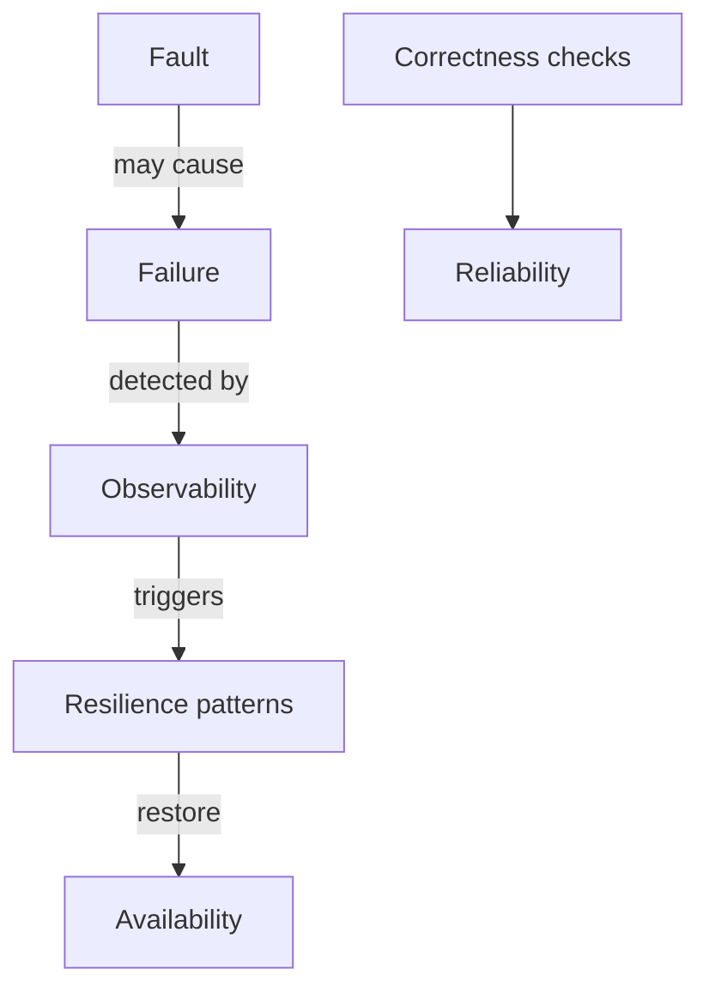

## Overview

**Availability** asks: *Is the system up and responding?* **Reliability** asks: *Does the system behave correctly over time?*

A service can be **available but unreliable** (returns 200 with wrong data). It can be **reliable when up** but **unavailable** often (long outages, rare but correct).

This page clarifies vocabulary for interviews and links to [Availability & Nines](/system-design/availability-and-nines/) for uptime math.

---

## Why It Matters

| Conflation | Consequence |
| :--- | :--- |
| “Five nines” as only metric | Silent data corruption undetected |
| Retries without idempotency | Reliable-looking uptime, duplicate charges |
| Cache stale reads | Available fast path, unreliable correctness |
| Fail-open rate limiter | Available during Redis outage, unreliable protection |

Senior interviews test whether you separate **uptime** from **correctness** and **durability**.

---

## Core Concepts

### Side-by-side definitions

| Term | Definition | Measured by |
| :--- | :--- | :--- |
| **Availability** | Proportion of time system is operational | Uptime %, nines |
| **Reliability** | Probability of correct operation over interval | Error rate, defect rate, data integrity checks |
| **Durability** | Data survives failures once committed | RPO, backup restore success |
| **Maintainability** | Speed/cost of repair | MTTR, deploy frequency |

### Fault vs failure

| Term | Meaning | Example |
| :--- | :--- | :--- |
| **Fault** | Defect or anomaly (may be latent) | Bug in failover script |
| **Failure** | Observable service deviation | Primary DB unreachable |
| **Error** | Incorrect internal state | Wrong shard routing |
| **Mistake** | Human action | Misconfigured LB rule |

**Fault tolerance:** System continues operating (perhaps degraded) despite **faults** — see [Resilience Patterns Overview](/system-design/resilience-patterns-overview/).

### Available but unreliable scenarios

| Scenario | Availability | Reliability |
| :--- | :--- | :--- |
| Stale replica read after profile update | Up | Wrong data served |
| AP datastore under partition | Up | Conflicting writes |
| Fail-open on dependency outage | Up | Policy not enforced |
| Eventual consistency lag | Up | Stale feed |

Link: [Consistency Models](/system-design/consistency-models/) · [Replication Lag](/system-design/replication-lag-read-replica-topology/).

### Reliable but low availability

| Scenario | Trade-off |
| :--- | :--- |
| Strict sync replication | Correct, fewer nines on writes |
| Maintenance window | Planned downtime, clean state |
| Circuit breaker open | Rejects traffic — “unavailable” for that path — protects system |

### MTBF and MTTR (reliability engineering lens)

```
Availability ≈ MTBF / (MTBF + MTTR)
```

| Lever | Improves |
| :--- | :--- |
| Reduce faults (testing, code quality) | MTBF ↑ → reliability |
| Faster detection + recovery | MTTR ↓ → availability |
| Redundancy | Availability without fixing root fault |



### CAP connection

Under partition, [CAP & PACELC](/system-design/cap-and-pacelc/) forces a choice: **availability** (AP) may reduce **reliability** of read-your-writes until healed.

---

## Architect Perspective

### Interview framing

1. **Define both terms** in one sentence each
2. **Give one example** of available-but-unreliable
3. **Name detection** — metrics, audits, reconciliation jobs
4. **Name prevention** — consistency model, idempotency, testing
5. **Tie to NFRs** — rank which matters for the product

### Payment vs social feed

| System | Priority |
| :--- | :--- |
| Payment ledger | Reliability + durability > raw availability |
| Social timeline | Availability + latency; brief staleness OK |
| Rate limiter | Availability on path; fail-open vs fail-closed trade-off — [Distributed Rate Limiter](/system-design/distributed-rate-limiter/) |

---

## Common Mistakes

| Mistake | Reality |
| :--- | :--- |
| HTTP 200 = success | Body may be wrong; check business invariants |
| Uptime monitors only edge | Core DB corruption invisible |
| Retries fix everything | Amplify load; need idempotency |
| Same SLO for all APIs | Split critical vs best-effort paths |

---

## Interview Questions

1. **What is the difference between reliability and availability?**
2. **Give an example of a highly available but unreliable system.**
3. **What is the difference between a fault and a failure?**
4. **How does replication lag affect reliability vs availability?**
5. **How do circuit breakers affect availability and reliability?**

---

## Related Topics

- [Availability & Nines](/system-design/availability-and-nines/)
- [Resilience Patterns Overview](/system-design/resilience-patterns-overview/)
- [Failure Patterns Overview](/system-design/failure-patterns-overview/)
- [Database Transactions & ACID](/system-design/database-transactions-and-acid-isolation/)
- [Payment Gateway](/system-design/payment-gateway-orchestration/) — reliability-critical case study

---

## Deep Dive References

| Topic | Location |
| :--- | :--- |
| Reliability engineering (PRIMARY) | [Microservices — Reliability Engineering](/microservices/10-production-playbook/reliability-engineering/) |
| Failure scenario catalog | [Microservices — Failure Scenarios](/microservices/10-production-playbook/failure-scenarios/) |

**Observability:** [Observability Fundamentals](/system-design/observability-fundamentals/)
