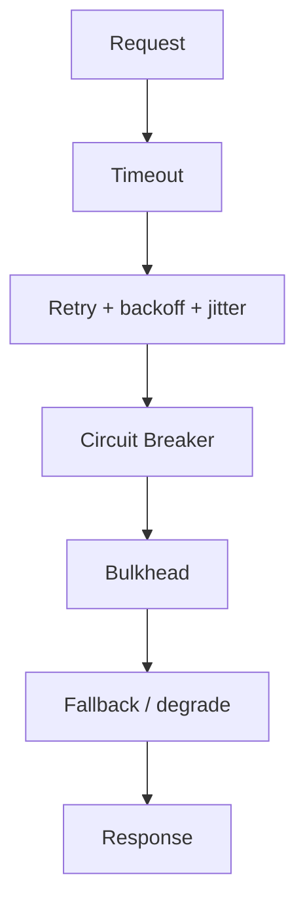

## Overview

**Resilience patterns** limit blast radius when dependencies fail: stop calling unhealthy services, isolate resource pools, bound wait time, and retry safely.

The core stack — **timeout → retry (with backoff) → circuit breaker → bulkhead → fallback** — is the standard interview answer for “how do you handle downstream failures?”

This page is the System Design **overview** (~1,200 words). Implementation detail, state machines, and framework config live in Microservices **Resilience Patterns**.

---

## Why It Matters

| Without resilience | Result |
| :--- | :--- |
| Retry storm on timeout | Cascade failure across fleet |
| Shared thread pool for all deps | One slow service blocks all |
| No circuit breaker | Latency pile-up; thread exhaustion |
| Infinite retries | Duplicate side effects |

Case studies embed these patterns in context — use this page as the **catalog**, then read application examples.

---

## Core Concepts

### Fault tolerance stack (order matters)



| Pattern | Purpose | Risk if misused |
| :--- | :--- | :--- |
| **Timeout** | Bound wait on every call | Too short → false failures |
| **Retry** | Recover transient faults | No idempotency → duplicates |
| **Circuit breaker** | Fail fast when dependency unhealthy | Opens too aggressively → false negatives |
| **Bulkhead** | Isolate resource pools | Over-partition → wasted capacity |
| **Fallback** | Degraded response | Stale/wrong data if not designed |

### Circuit breaker

States: **Closed** (normal) → **Open** (fail fast) → **Half-open** (probe).

| When to use | Payment client, search index, third-party API |
| When to skip | Idempotent internal cache read with local fallback |

**ADR:** [Technology Playbook — Circuit Breaker](/technology-playbook/circuit-breaker-pattern/)

### Bulkhead

Partition threads, connections, or instances so one dependency cannot exhaust shared pools.

| Example | Separate pool for payment gateway vs recommendations |
| Case study | [Payment Gateway Orchestration](/system-design/payment-gateway-orchestration/) |

**ADR:** [Technology Playbook — Bulkhead](/technology-playbook/bulkhead-pattern/)

### Retry with backoff and jitter

```
delay = min(cap, base × 2^attempt) + random_jitter
```

| Safe to retry | GET, idempotent PUT, deduplicated writes |
| Unsafe | Non-idempotent POST without key |

### Timeout budgets

End-to-end latency budget ÷ max dependency depth = per-hop timeout.

Link: [Latency vs Throughput](/system-design/latency-vs-throughput/) — retries consume budget.

### Fallback strategies

| Fallback | Trade-off |
| :--- | :--- |
| Cached stale value | Available, may be unreliable |
| Default empty result | Simple, UX impact |
| Fail closed (503) | Unavailable path, protects integrity |
| Fail open | Available, weak guarantees — [Distributed Rate Limiter](/system-design/distributed-rate-limiter/) |

### Pattern comparison

| Pattern | Protects | Does not fix |
| :--- | :--- | :--- |
| Circuit breaker | Cascade latency | Root cause bug |
| Bulkhead | Resource exhaustion | Data corruption |
| Retry | Transient network blip | Persistent outage |
| Timeout | Hung connections | Slow but valid responses |

---

## Architect Perspective

### Interview answer (template)

1. **Set timeouts** on all external calls
2. **Retry** transient errors with exponential backoff + jitter — idempotent only
3. **Circuit breaker** on unstable dependencies
4. **Bulkhead** pools for critical vs non-critical paths
5. **Fallback** with explicit degradation policy
6. **Observe** breaker state, retry rate, fallback rate

### Where patterns appear in case studies

| Case study | Pattern highlight |
| :--- | :--- |
| [Payment Gateway](/system-design/payment-gateway-orchestration/) | Bulkhead + breaker on PSP calls |
| [LinkedIn Job Search](/system-design/linkedin-job-search/) | Timeout + partial results |
| [Leaderboard](/system-design/leaderboard/) | Cache fallback, hot-key isolation |
| [Distributed Rate Limiter](/system-design/distributed-rate-limiter/) | Fail-open circuit breaker |

### Pair with redundancy

Resilience handles **dependency** failure; [SPOF & Redundancy](/system-design/single-point-of-failure-elimination-redundancy/) handles **component** failure. Use both.

---

## Common Mistakes

| Mistake | Fix |
| :--- | :--- |
| Retry on 500 without cap | Max attempts + breaker |
| Shared pool for all HTTP clients | Bulkhead per dependency |
| Breaker without health metrics | Export open/half-open state |
| Fallback without product sign-off | Define degraded UX explicitly |
| Retries on POST payment | Idempotency keys required |

---

## Interview Questions

1. **Explain circuit breaker states and when you would open the circuit.**
2. **What is a bulkhead and how does it differ from a circuit breaker?**
3. **When should you not retry a failed request?**
4. **How do timeouts and retries interact with p99 latency?**
5. **Design resilience for a payment service calling three external PSPs.**

---

## Related Topics

- [Availability & Nines](/system-design/availability-and-nines/)
- [Reliability vs Availability](/system-design/reliability-vs-availability/)
- [Failure Patterns Overview](/system-design/failure-patterns-overview/)
- [SPOF & Redundancy](/system-design/single-point-of-failure-elimination-redundancy/)
- [Load Balancers & Routing](/system-design/load-balancers-and-routing-algorithms/)

---

## Deep Dive References

| Topic | Location |
| :--- | :--- |
| Resilience patterns (PRIMARY) | [Microservices — Resilience Patterns](/microservices/05-resilience-patterns/resilience-patterns/) |
| Reliability engineering & SLOs | [Microservices — Reliability Engineering](/microservices/10-production-playbook/reliability-engineering/) |

**Observability:** [Observability Fundamentals](/system-design/observability-fundamentals/) — detect breaker trips and retry storms
