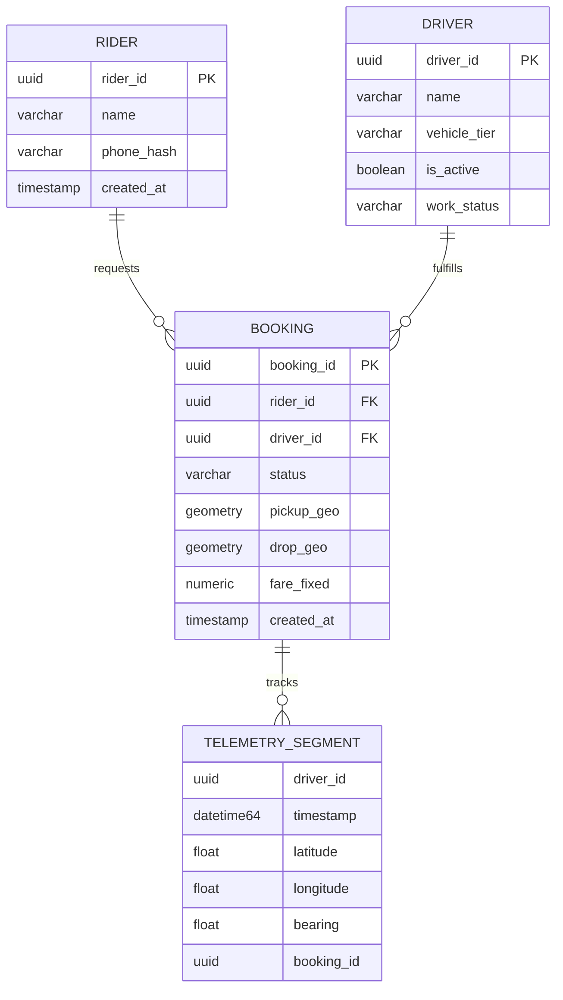
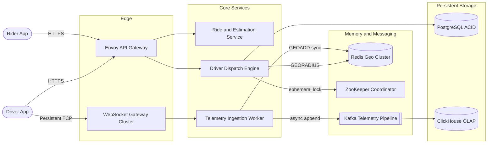
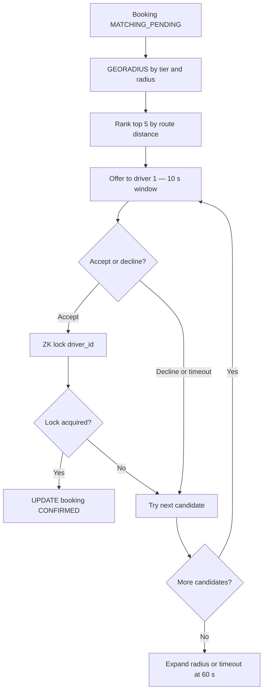
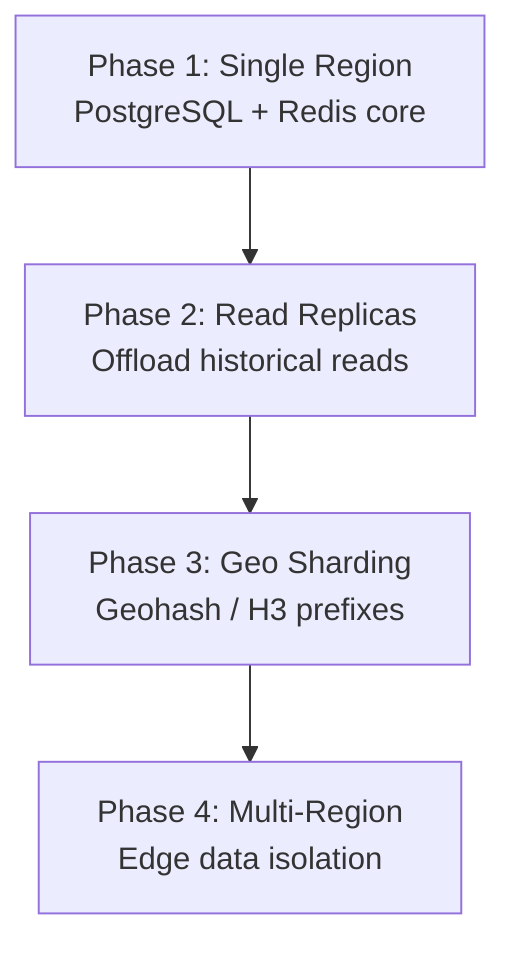
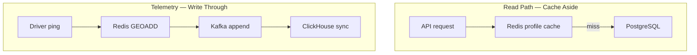

A ride-sharing platform connects riders and drivers in real time — estimate fares by vehicle tier, book a ride, match the nearest available driver, stream bi-directional map updates, settle payment, and exchange ratings. At Uber/Ola scale the system is **path-asymmetric**: browsing and estimation are **AP-tolerant**, while the dispatch pipeline is **CP-critical** — double-booking a driver or racing on allocation state is unacceptable.

This post walks through the full design — requirements, capacity math, API contracts, data modeling, microservice topology, driver-matching concurrency controls, technology trade-offs, caching, infrastructure sizing, security, observability, and failure modes.

---

## 1. Requirements and Goals

### Functional Requirements (MVP)

| Requirement | Description |
| :--- | :--- |
| **Fair estimation** | Riders input pickup/drop coordinates and view categorized estimates (Bike, Sedan, SUV) before booking. |
| **Ride booking** | Riders request a ride based on selected vehicle tier and a locked quotation. |
| **Driver matching** | System pairs riders with nearby available drivers via geo-proximity search within a configurable radius. |
| **Dispatch lifecycle** | Drivers receive push-based dispatch offers and must accept or decline within a strict time window. |
| **Real-time tracking** | Active drivers stream coordinate telemetry; rider and driver maps update concurrently. |
| **Trip lifecycle** | Distinct endpoints for `start_trip` (driver-validated passcode) and `end_trip`. |
| **Payment settlement** | Asynchronous payment processing via external gateways at trip completion. |
| **Bi-directional ratings** | Both rider and driver rate each other after trip completion. |

### Clarifying Assumptions

| Question | Assumption |
| :--- | :--- |
| Multi-drop or carpool? | **Point-to-point single ride** for MVP; schema supports future route transformations. |
| Matching strategy? | **Localized proximity search** + sequential matching queue — high throughput, low tail latency. |
| Route audit granularity? | **Every raw telemetry tick** persisted for dispute resolution and pricing reconciliation. |

### Non-Functional Requirements

| NFR | Target |
| :--- | :--- |
| **Scale** | 100M rider DAU; 10M driver DAU; 5M concurrent drivers streaming telemetry |
| **CAP profile** | **AP** for browsing and estimation; **CP** for dispatch pipeline (no double-booking) |
| **Latency** | Core driver allocation within **low double-digit seconds**; 60 s graceful timeout if unallocated |
| **Availability** | Regional clusters fail independently; circuit breakers + async messaging contain cascades |
| **Constraints** | Mobile network handoffs, packet dropouts, surge locality (weather, rush hour) |

### Scale Assumptions

| Metric | Value |
| :--- | :--- |
| Daily completed rides | **50,000,000** |
| Driver telemetry ping interval | **4 seconds** |
| Concurrent active drivers (telemetry) | **5,000,000** |
| Active app-open riders (map refresh) | **10,000,000** every 8 s |

---

## 2. Back-of-the-Envelope Calculations

### Write Workload — Driver Telemetry

| Metric | Calculation | Result |
| :--- | :--- | :--- |
| Concurrent active drivers | Given | **5,000,000** |
| Ping interval | 4 s | — |
| Telemetry write RPS | 5M ÷ 4 | **1,250,000 RPS** |

### Read Workload — Rider Proximity Maps

| Metric | Calculation | Result |
| :--- | :--- | :--- |
| Active app browsers | Given | **10,000,000** |
| Map refresh interval | 8 s | — |
| Map read RPS | 10M ÷ 8 | **1,250,000 RPS** |

### Core Ride Transaction Ops

| Metric | Calculation | Result |
| :--- | :--- | :--- |
| Ops per ride | Estimate → Book → Accept | **3** |
| Daily core ops | 50M × 3 | **150,000,000 / day** |
| Average ride ops RPS | 150M ÷ 86,400 | **~1,736 RPS** |
| Peak transactional RPS (5× surge) | 1,736 × 5 | **~8,680 RPS** |

### Storage — Raw Telemetry

| Metric | Calculation | Result |
| :--- | :--- | :--- |
| Payload size | UUID + lat/lng + timestamp + bearing + status + overhead | **~100 bytes** |
| Pings / day | 5M × (86,400 ÷ 4) | **108,000,000,000** |
| Data / day | 108B × 100 B | **~10.8 TB / day** |
| Data / year | 10.8 TB × 365 | **~3.94 PB / year** |

### Network Bandwidth

| Metric | Calculation | Result |
| :--- | :--- | :--- |
| Telemetry ingress | 1.25M RPS × 100 B | **125 MB/s (~1 Gbps)** |

### Redis Geospatial Working Set

| Metric | Calculation | Result |
| :--- | :--- | :--- |
| Tracked fleet drivers | 10,000,000 | — |
| Bytes per geo entry | ~250 B | — |
| Raw index size | 10M × 250 B | **~2.5 GB** |
| With 10× safety factor (replication, buffers) | 2.5 GB × 10 | **~25 GB** |

---

## 3. API Design

### Fare Estimation

**`POST /api/v1/estimates`**

Non-idempotent — surge and supply/demand change dynamically.

```json
{
  "pickup_location": { "lat": 17.3850, "lng": 78.4867 },
  "drop_location": { "lat": 17.4483, "lng": 78.3741 },
  "rider_id": "usr_99210a8f-281b"
}
```

Response (`200 OK`):

```json
{
  "quotation_id": "qte_883a-11f2",
  "valid_until": "2026-06-26T15:53:00Z",
  "options": [
    { "tier": "BIKE", "fare": 120.00, "currency": "INR", "eta_minutes": 4 },
    { "tier": "SEDAN", "fare": 340.00, "currency": "INR", "eta_minutes": 7 },
    { "tier": "SUV", "fare": 520.00, "currency": "INR", "eta_minutes": 9 }
  ]
}
```

### Request Ride

**`POST /api/v1/rides/bookings`**

Header: `X-Idempotency-Key: <uuid>` (required — prevents duplicate bookings on timeout retries).

```json
{
  "quotation_id": "qte_883a-11f2",
  "tier": "SEDAN",
  "pickup_location": { "lat": 17.3850, "lng": 78.4867 },
  "drop_location": { "lat": 17.4483, "lng": 78.3741 }
}
```

Response (`202 Accepted`):

```json
{
  "booking_id": "bk_771c-99a3",
  "status": "MATCHING_PENDING",
  "created_at": "2026-06-26T15:48:00Z"
}
```

### Driver Dispatch Decision

**`POST /api/v1/dispatch/decide`**

Idempotency enforced via `booking_id` + `driver_id` compound uniqueness.

```json
{
  "booking_id": "bk_771c-99a3",
  "driver_id": "drv_001b-8821",
  "decision": "ACCEPT"
}
```

Response (`200 OK`):

```json
{
  "booking_id": "bk_771c-99a3",
  "status": "CONFIRMED",
  "passcode": "4491"
}
```

### Error Matrix

| HTTP | Code | Condition |
| :--- | :--- | :--- |
| `409` | `RIDE_ALREADY_ALLOCATED` | Driver accepts a ride already claimed by another driver |
| `429` | `RATE_LIMIT_EXCEEDED` | Per-user or per-driver API threshold exceeded |
| `504` | `DISPATCH_TIMEOUT` | Matching cycle exceeds 60 s without allocation |

### Rate Limits (Gateway)

| Route | Limit |
| :--- | :--- |
| `POST /api/v1/rides/bookings` | **2 req/s** per rider ID |
| `POST /api/v1/dispatch/decide` | **1 req/s** per driver ID |

---

## 4. Data Model



### Core DDL (PostgreSQL + PostGIS)

```sql
CREATE EXTENSION IF NOT EXISTS postgis;

CREATE TABLE drivers (
    driver_id       UUID PRIMARY KEY,
    name            VARCHAR(100) NOT NULL,
    vehicle_tier    VARCHAR(20) NOT NULL,
    is_active       BOOLEAN DEFAULT FALSE,
    work_status     VARCHAR(20) CHECK (work_status IN ('IDLE','EN_ROUTE','ON_TRIP'))
);
CREATE INDEX idx_drv_status ON drivers(work_status) WHERE is_active IS TRUE;

CREATE TABLE bookings (
    booking_id   UUID PRIMARY KEY,
    rider_id     UUID NOT NULL,
    driver_id    UUID REFERENCES drivers(driver_id),
    status       VARCHAR(30) NOT NULL,
    pickup_geo   GEOMETRY(Point, 4326) NOT NULL,
    drop_geo     GEOMETRY(Point, 4326) NOT NULL,
    fare_fixed   NUMERIC(10, 2) NOT NULL
);
CREATE INDEX idx_bk_spatial_pickup ON bookings USING GIST(pickup_geo);
```

### Analytical Store (ClickHouse)

```sql
CREATE TABLE historical_driver_segments (
    driver_id   UUID,
    timestamp   DateTime64(3),
    latitude    Float64,
    longitude   Float64,
    bearing     Float32,
    speed       Float32,
    booking_id  Nullable(UUID)
) ENGINE = MergeTree()
PARTITION BY toYYYYMM(timestamp)
ORDER BY (driver_id, timestamp);
```

### Normalization Strategy

| Partition | Strategy | Rationale |
| :--- | :--- | :--- |
| Bookings, payments, accounts | **3NF in PostgreSQL** | ACID compliance; strict state transitions |
| Telemetry history | **Denormalized in ClickHouse** | Columnar scans over billions of ticks; no runtime joins |

---

## 5. High-Level Architecture



### Component Responsibilities

| Component | Role |
| :--- | :--- |
| **Envoy API Gateway** | TLS termination, JWT validation, Redis token-bucket rate limiting |
| **WebSocket Gateway** | Stateless persistent connections; bi-directional dispatch + telemetry |
| **Ride & Estimation Service** | Routing metrics via map backends; localized surge multipliers |
| **Driver Dispatch Engine** | Proximity queries, sequential offer queue, allocation state machine |
| **Telemetry Ingestion** | High-throughput coordinate ingest → Redis + Kafka |
| **Redis Geo Cluster** | `GEOADD` / `GEORADIUS` for live fleet positions |
| **ZooKeeper** | CP distributed locks — prevents dual allocation across parallel workers |
| **Kafka → ClickHouse** | Immutable telemetry log; replayable multi-consumer analytics |

### Request Flow Summary

**Estimation (AP path):** Rider → Gateway → Ride Service → map routing + surge cache → quotation options.

**Booking (async CP path):** Rider → Gateway (idempotency) → Ride Service → PostgreSQL `MATCHING_PENDING` → Dispatch Engine polls Redis + acquires ZK lock → driver offer via WebSocket.

**Telemetry (hot path):** Driver → WebSocket GW → Telemetry Service → Redis `GEOADD` (sync) + Kafka (async) — matching never waits on ClickHouse.

---

## 6. Driver Matching, Locks, and ID Generation

Driver allocation is the highest-contention path. The engine uses **localized GEORADIUS search**, **sequential top-N offers**, and **ZooKeeper ephemeral locks** to eliminate race conditions.



### Sequential Offer Queue (Thundering Herd Mitigation)

Notifying 10,000 nearby drivers simultaneously creates lock contention and wasted bandwidth. Instead:

| Step | Detail |
| :--- | :--- |
| Candidate pool | Top **5** closest idle drivers from Redis geospatial index |
| Offer model | **One driver at a time**, 10 s acceptance window |
| Escalation | Next ranked driver only after decline or timeout |
| Hard stop | **60 s** total — return `504 DISPATCH_TIMEOUT` |

### ZooKeeper Ephemeral Lock Manager

```java
public class DistributedLockManager {
    private final CuratorFramework client;
    private static final String LOCK_BASE_PATH = "/dispatch/locks/driver_";

    public boolean acquireDriverMatchLock(UUID driverId, long leaseTimeSec) {
        String path = LOCK_BASE_PATH + driverId;
        try {
            client.create()
                  .creatingParentsIfNeeded()
                  .withMode(CreateMode.EPHEMERAL)
                  .forPath(path);
            return true;
        } catch (KeeperException.NodeExistsException e) {
            return false;
        }
    }

    public void releaseDriverMatchLock(UUID driverId) {
        try {
            client.delete().guaranteed().forPath(LOCK_BASE_PATH + driverId);
        } catch (KeeperException.NoNodeException ignored) { }
    }
}
```

### Booking State Machine

```
REQUESTED → MATCHING_PENDING → CONFIRMED → STARTED → COMPLETED
                                          ↘ CANCELLED / TIMEOUT
```

Updates use **optimistic concurrency**: `WHERE booking_id = ? AND status = 'EXPECTED_PREVIOUS_STATE'` — avoids long row locks.

### ID Generation — Snowflake

| Option | Verdict |
| :--- | :--- |
| **Snowflake (chosen)** | 64-bit time-sortable IDs; no central DB sequence bottleneck |
| UUID v4 | Random — poor B-tree locality |
| Auto-increment | Single-writer hotspot on sharded primaries |

---

## 7. Database Selection and Scaling

### Technology Comparison

| Store | Use case | Why choose | Why not |
| :--- | :--- | :--- | :--- |
| **PostgreSQL** | Bookings, payments, ledgers | ACID; prevents split-brain allocation states | Not for 1.25M telemetry writes/s |
| **Cassandra** | — | Write-heavy | Eventual consistency risks dual driver claims |
| **Redis** | Live geo index | Native `GEOADD` / `GEORADIUS` | RAM-bound; ephemeral by design |
| **Memcached** | — | Fast KV | No native spatial primitives |
| **Kafka** | Telemetry log | Replayable; multi-consumer | Higher ops complexity than RabbitMQ |
| **RabbitMQ** | — | Simple queues | Messages deleted on ack — poor for analytics replay |
| **ZooKeeper** | Allocation locks | CP consensus; ephemeral auto-cleanup | Not a general data store |
| **Redis Redlock** | — | Lower latency locks | Clock drift risk under partition |
| **ClickHouse** | Historical routes | Columnar aggregation over PB-scale | Not transactional |

### Scaling Strategy



| Phase | Trigger | Architecture |
| :--- | :--- | :--- |
| **1** | Launch | Single large PostgreSQL + Redis cluster |
| **2** | Read IOPS pressure | Master + read replicas; writes to primary only |
| **3** | Redis memory saturation | Shard by geohash prefix (e.g. city cells) |
| **4** | Cross-continent latency | Autonomous regional stacks; async profile sync |

**H3 hexagonal indexing** (production enhancement over naive range sharding) distributes metropolitan hot spots evenly — hex cells have uniform neighbor distance vs rectangular geohash boxes.

---

## 8. Caching Strategy



| Cache domain | Pattern | TTL | Notes |
| :--- | :--- | :--- | :--- |
| Rider / driver profiles | Cache-aside | **1 hour** | Invalidate on profile update event |
| Driver live location | Write-through to Redis | **15 s** | Stale coords useless for matching |
| Surge multipliers | Precomputed per H3 cell | **30–60 s** | AP-tolerant; refreshed by demand pipeline |
| Quotation | Short-lived server cache | Until `valid_until` | Tied to `quotation_id` |

### Eviction

Redis uses **`volatile-lru`** — only keys with explicit TTL participate in eviction. Driver geo keys expire every 15 s; offline drivers fall out of the active index naturally.

---

## 9. Capacity Planning

Baseline production footprint for **1.25M telemetry RPS** and **~8.7K peak transactional RPS**:

| Component | Spec | Count | Notes |
| :--- | :--- | :--- | :--- |
| **WebSocket Gateway** | c6i.2xlarge (8 vCPU, 16 GB) | **50 pods** | ~100K persistent connections per pod |
| **API Gateway (Envoy)** | c6i.xlarge | **30 pods** | Stateless HTTPS termination |
| **Dispatch Engine** | c6i.2xlarge | **40 pods** | Parallel proximity + lock orchestration |
| **Telemetry Workers** | m6i.xlarge | **40 pods** | Network-optimized ingest |
| **Redis Geo Cluster** | r6i.xlarge (32 GB) | **16 shards** | Primary-replica per shard; ~25 GB working set |
| **Kafka** | i3en.2xlarge (NVMe) | **12 brokers** | 48 partitions per core topic; RF=3 |
| **PostgreSQL** | db.r6g.8xlarge + io2 | **1 primary + 2 replicas** | Transactional bookings and payments |
| **ZooKeeper** | Dedicated ensemble | **5 nodes** | Across 5 AZs for quorum stability |

### HA / DR Targets

| Component | RPO | RTO |
| :--- | :--- | :--- |
| Bookings / payments ledger | **0** (sync replica) | **< 30 s** |
| Telemetry stream | **5 s** (gap acceptable) | **< 5 s** (consumer rebalance) |

---

## 10. Key Design Decisions Summary

| Decision | Choice | Rationale |
| :--- | :--- | :--- |
| Live driver positions | Redis geospatial — not RDBMS | 1.25M writes/s would overwhelm PostgreSQL WAL |
| Allocation locking | ZooKeeper ephemeral nodes | CP mutual exclusion; auto-release on worker death |
| Telemetry durability | Kafka → ClickHouse | Decouples hot matching path from PB-scale analytics |
| Transactional core | PostgreSQL | ACID booking and payment state |
| Real-time transport | WebSockets over SSE | Bi-directional: driver uplink + dispatch downlink |
| Spatial partitioning | H3 / geohash sharding | Avoids metro hot-spot shards |
| IDs | Snowflake | Sortable, shard-friendly 64-bit integers |
| Payments | Saga + idempotency keys | Async gateway settlement without 2PC |
| Security | WAF → rate limit → JWT → mTLS mesh | SPIFFE/SPIRE identities via Istio |
| Encryption | AES-256 at rest; app-layer for PII tokens | KMS-managed keys |
| Observability | OpenTelemetry + W3C trace context | P99 matching latency, telemetry ingest SLIs |
| Dispatch SLO | ≥ 99.9% allocated or clean timeout in 60 s | |
| Telemetry SLO | ≥ 99.99% processed within 200 ms of edge arrival | |

### Production Improvements Over Naive Designs

| Naive pattern | Production correction |
| :--- | :--- |
| Store live GPS in PostgreSQL rows | Redis `GEOADD` in-memory index |
| Iterator loop over drivers without locks | ZooKeeper ephemeral locks per `driver_id` |
| Broadcast dispatch to all nearby drivers | Sequential top-5 ranked offer queue |
| Single pipeline for telemetry + transactions | Kafka analytics path isolated from Redis hot path |
| Range-based DB sharding | H3 hex cells for even spatial distribution |

---

## 11. Failure Modes and Mitigations

| Failure | Impact | Mitigation |
| :--- | :--- | :--- |
| **Redis node outage** | Proximity lookups halt | Sentinel/Cluster failover ~10 s; fallback to PostgreSQL with restricted radius |
| **ZooKeeper quorum loss** | Cannot acquire allocation locks | Fallback to Redis Redlock with shorter lease until ZK recovers |
| **PostgreSQL primary outage** | No new bookings | Aurora/Patroni promote sync replica < 30 s; gateway retry-backoff |
| **Regional cloud outage** | Entire geo unavailable | Route 53 latency routing to adjacent region; apps swap region context |
| **Kafka consumer lag** | Analytics delay — not matching | Matching reads Redis only; auto-scale consumers to partition count |
| **WebSocket mass disconnect** | Telemetry gaps mid-trip | Client SQLite ring buffer; batch replay on reconnect |
| **GPS spoofing** | Fraudulent driver positions | Velocity sanity check; flag > physical speed; drop anomalous ticks |
| **Payment gateway timeout** | Trip complete but unsettled | Saga retries + idempotency; manual reconciliation queue |
| **Surge thundering herd** | Estimate API overload | H3 cell surge precompute in cache; rate limits per rider |

### Security Pipeline

```
Edge Request → WAF → Envoy Rate Limiter → Token Validator → Microservice
```

Internal service mesh enforces **mTLS** on all east-west traffic.

---

## Interview Highlights

Condensed answers to common senior/staff-level probes.

| Question | Answer |
| :--- | :--- |
| Thundering herd on surge ride? | Offer sequentially to top 5 drivers; 10 s window each — not 10,000 simultaneous pushes. |
| Prevent location spoofing? | Async velocity validation; reject impossible speed; fraud pipeline flags account. |
| WebSockets vs SSE? | Full-duplex required — drivers uplink telemetry while server pushes dispatch. |
| Avoid booking deadlocks? | Strict forward state machine + `WHERE status = expected` optimistic updates. |
| Schema migration on `bookings`? | `gh-ost` / pt-online-schema-change — ghost table swap, millisecond metadata lock. |
| Evolve to carpooling? | Decouple vehicle trip from passenger bookings (1:N); graph route optimization (Dijkstra). |
| Driver disconnect mid-trip? | Local SQLite buffer; reconciliation endpoint backfills ClickHouse; recalc distance. |
| Kafka lag during storm surge? | Hot path bypasses Kafka; scale consumers to partition count for analytics only. |
| ClickHouse vs PostgreSQL for routes? | Columnar store scans lat/lng columns only — row stores inefficient at PB scale. |
| Scale down at night? | HPA on stateless pods; managed Redis rebalance; telemetry VLAN shrinks with driver count. |
| Why not Cassandra for bookings? | Eventual consistency can yield two drivers claiming same booking under partition. |
| Why ZooKeeper over Redlock? | Ephemeral znodes + CP quorum; Redis clocks can violate lock safety. |
| 60 s dispatch timeout? | Gateway returns `504 DISPATCH_TIMEOUT`; booking moves to `CANCELLED`; rider notified. |
| Online migration without downtime? | Expand-contract pattern or ghost-table tools — never blocking `ALTER` on hot tables. |

---

## What's Next

Adjacent topics for a follow-up post: dynamic surge pricing with H3 demand-supply ratios, Saga payment state machines, and chaos-testing ZooKeeper partition behavior under synthetic latency injection.
