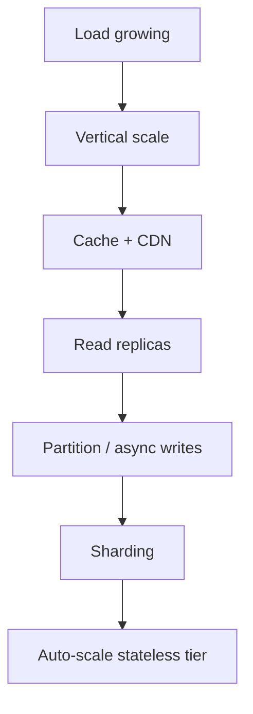

## Overview

**Scaling strategies** are the ordered levers architects apply when load outgrows a single node: cache hot reads, replicate for read port, partition data for write port, and auto-scale stateless tiers.

This page is the System Design **hub** — a decision ladder for interviews. Step-by-step production patterns (hot keys, migration runbooks, rate limiting at scale) live in Microservices **Scalability Patterns**.

---

## Why It Matters

| Without a ladder | Result |
| :--- | :--- |
| Shard on day one | Operational tax before product fit |
| Never shard | Write ceiling crash at growth |
| Cache without invalidation plan | Stale data incidents |
| Replicas without lag awareness | Read-your-writes violations |

Route scaling questions through this page first, then deep-dive the relevant SD fundamental or MS production guide.

---

## Core Concepts

### Escalation ladder (typical order)

| Step | Strategy | Solves | SD deep dive |
| :---: | :--- | :--- | :--- |
| 1 | **Vertical scale** | Quick headroom | [Horizontal vs Vertical](/system-design/horizontal-vs-vertical-scaling/) |
| 2 | **Caching & CDN** | Read-heavy hot data | [Caching & CDNs](/system-design/caching-and-cdns-hierarchical-arrays/) |
| 3 | **Read replicas** | Read RPS off primary | [Replication Lag](/system-design/replication-lag-read-replica-topology/) |
| 4 | **Async ingestion** | Write spikes, fan-out | [Notification System](/system-design/notification-system/) |
| 5 | **Sharding / partitioning** | Write + storage scale | [Database Sharding](/system-design/database-sharding-provisioning-and-chunk-routing/) |
| 6 | **Auto-scale** | Stateless burst | [Load Balancers](/system-design/load-balancers-and-routing-algorithms/) |

### Strategy comparison

| Strategy | Read scale | Write scale | Consistency | Complexity |
| :--- | :---: | :---: | :--- | :--- |
| **CDN / edge cache** | High | N/A (static/immutable) | Eventual | Low |
| **App / Redis cache** | High | Invalidate carefully | Configurable | Medium |
| **Read replicas** | High | Low (single primary) | Eventual on replicas | Medium |
| **Database sharding** | Per-shard | High (partitioned) | Per-shard + routing | High |
| **Consistent hashing** | Distributed cache/KV | Distributed writes | Per-node | Medium |
| **Horizontal app scale** | Via more instances | Via more instances | Stateless assumed | Low–medium |

### Caching layer

| Layer | Scope | Best for |
| :--- | :--- | :--- |
| **CDN** | Global static assets | Images, JS bundles, API cacheable GETs |
| **Reverse proxy cache** | Regional | Origin shield, stampede mitigation |
| **Application cache** | Process / cluster | Session, computed aggregates |
| **Database buffer pool** | Engine internal | Hot pages — not architect-controlled |

Policies and failure modes: [Cache Eviction](/system-design/cache-eviction-and-mutation-policies/) · [Cache Stampede](/system-design/cache-stampede-and-penetration-mitigation/).

### Read replicas

- Offload **SELECT** from primary
- **Async replication** → replication lag — pin writes or tolerate stale reads
- Does **not** multiply write throughput

See [Replication Lag & Read-Replica Topology](/system-design/replication-lag-read-replica-topology/).

### Sharding and partitioning

| Approach | Shard key | Risk |
| :--- | :--- | :--- |
| **Range** | Time, ID ranges | Hot last shard (monotonic keys) |
| **Hash** | `hash(user_id) % N` | Reshuffle on N change — use [Consistent Hashing](/system-design/consistent-hashing/) |
| **Directory / config server** | Lookup table | Config server availability |

See [Database Sharding](/system-design/database-sharding-provisioning-and-chunk-routing/).

### Auto-scale triggers

| Tier | Metric | Action |
| :--- | :--- | :--- |
| API gateway | p99 latency, RPS | HPA add pods |
| Workers | Queue depth | Scale consumers |
| Cache | Memory, evictions | Add nodes to ring |
| DB | IOPS, connections | Replicas or shard (not infinite vertical) |

Tie triggers to [Latency vs Throughput](/system-design/latency-vs-throughput/) SLOs — scale when saturation raises tail latency.

### Read vs write ratio drives strategy

From [Capacity Estimation](/system-design/capacity-estimation/):

| Profile | Primary levers |
| :--- | :--- |
| 100:1 read:write | CDN + cache + replicas |
| 1:1 | Careful cache; shard sooner on writes |
| Write-heavy stream | Partitioned log (Kafka), async consumers |

---

## Architect Perspective

### Interview: “How would you scale this system?”

1. **Clarify read/write ratio and peak RPS** — capacity estimation
2. **Walk the ladder** — don't jump to sharding
3. **Name one bottleneck** — deep-dive that tier
4. **State consistency cost** — replicas vs strong reads
5. **Mention observability** — how you'd know which lever failed

### Case study applications

| System | Scaling highlight |
| :--- | :--- |
| [URL Shortener](/system-design/urlshortner/) | Read-heavy → cache + CDN |
| [Distributed Rate Limiter](/system-design/distributed-rate-limiter/) | Horizontal Redis shards, sub-ms latency |
| [Leaderboard](/system-design/leaderboard/) | Hot key / sorted-set partitioning |
| [Distributed KV Store](/system-design/distributed-kv-store/) | Consistent hashing + replication |

---

## Common Mistakes

| Mistake | Reality |
| :--- | :--- |
| Cache everything | Invalidation and memory cost |
| Replicas for write scale | Need sharding or async |
| Bad shard key | Hot shard defeats horizontal scale |
| Auto-scale DB like app | Data migration ≠ pod restart |
| No cache stampede plan | Thundering herd on expiry |

---

## Interview Questions

1. **List scaling strategies in the order you would apply them.**
2. **When do read replicas fail to help?**
3. **Compare caching vs sharding for a read-heavy feed.**
4. **What is a hot shard and how do you mitigate it?**
5. **How do auto-scaling policies relate to SLOs?**
6. **Design scaling for 1M RPS read, 10K WPS write.**

---

## Related Topics

- [Horizontal vs Vertical Scaling](/system-design/horizontal-vs-vertical-scaling/)
- [Latency vs Throughput](/system-design/latency-vs-throughput/)
- [Capacity Estimation](/system-design/capacity-estimation/)
- [Consistent Hashing](/system-design/consistent-hashing/)
- [Non-Functional Requirements](/system-design/non-functional-requirements/)

---

## Deep Dive References

| Topic | Location |
| :--- | :--- |
| Scalability patterns (PRIMARY) | [Microservices — Scalability Patterns](/microservices/10-production-playbook/scalability-patterns/) |
| Hot-key / rate limiting at scale | MS scalability patterns § rate limiting |
| Database selection | [Technology Playbook — How to Choose a Database](/technology-playbook/how-to-choose-database/) |

**Reliability:** [Availability & Nines](/system-design/availability-and-nines/) · [Failure Patterns Overview](/system-design/failure-patterns-overview/)

**Observability:** [Observability Fundamentals](/system-design/observability-fundamentals/)
