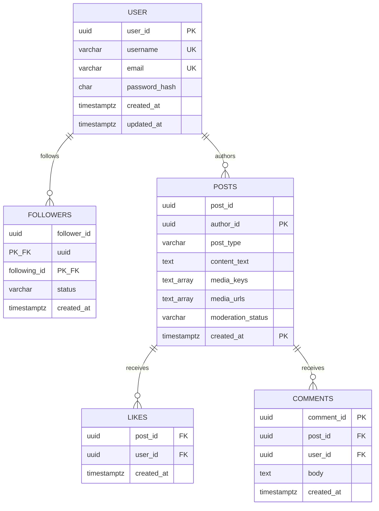
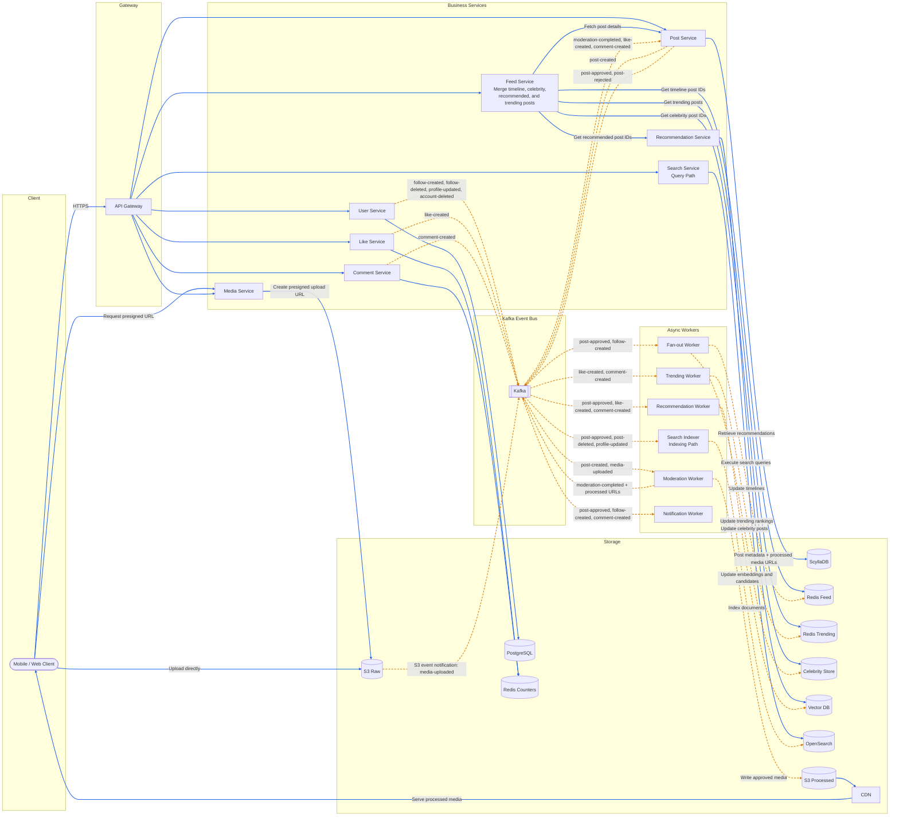
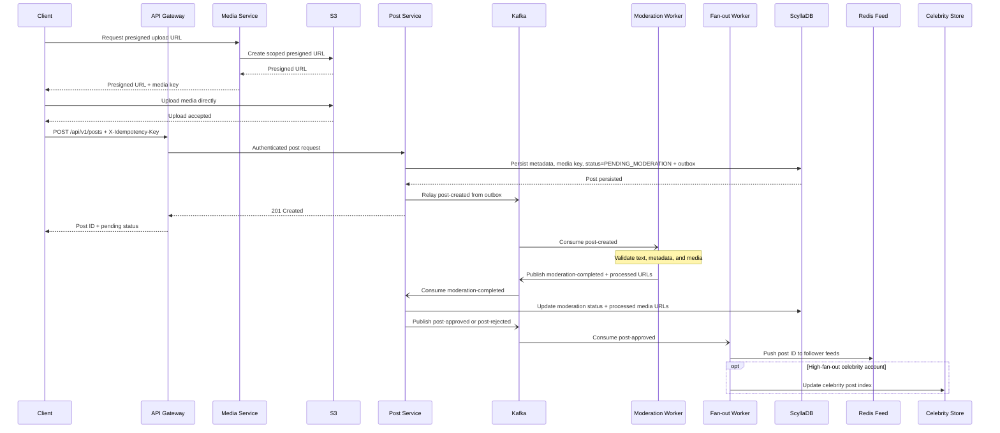
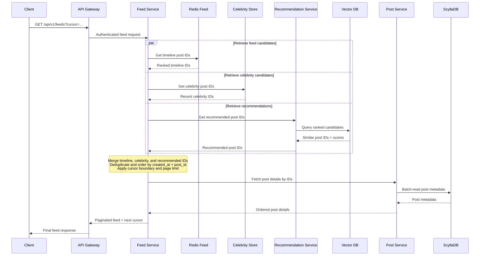
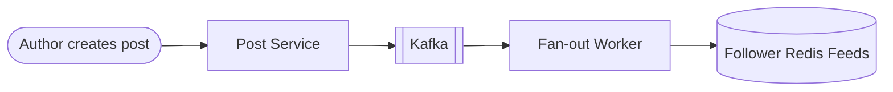
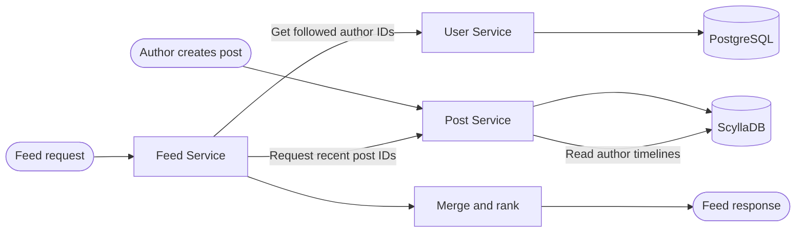
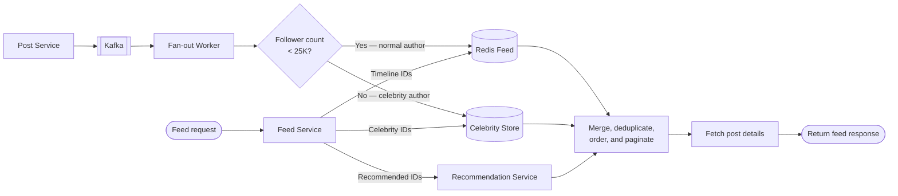
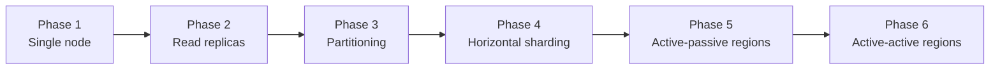
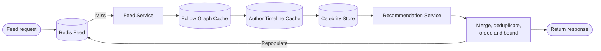
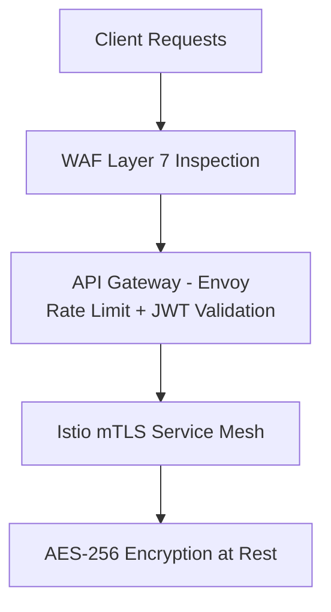

A social graph and feed application connects hundreds of millions of daily active users through profile management, content publishing, follow relationships, engagement (likes and comments), and personalized chronological timelines. At scale it is **read-heavy, fan-out-intensive, and latency-sensitive**: the stated workload produces roughly 10 feed reads per post write, celebrity posts create thundering-herd bottlenecks, and the system must converge globally within seconds while keeping p99 feed loads under 200 ms.

This post walks through the full design — requirements, capacity math, API contracts, data modeling, hybrid fan-out topology, technology trade-offs, caching, infrastructure sizing, security, observability, and failure modes. For 50 senior-level interview follow-ups, see [Social Feed Interview Questions](/system-design/social-feed-interview-questions/).

---

## 1. Requirements and Goals

### Functional Requirements (MVP)

| Requirement | Description |
| :--- | :--- |
| **User onboarding** | Registration, authentication, profile metadata reads, and profile updates. |
| **Content generation** | CRUD for textual and media posts (images/videos). |
| **Social graph management** | Unidirectional follow model with explicit follower/following tracking and relationship states (`PENDING`, `ACTIVE`, `BLOCKED`). |
| **Engagement engine** | High-throughput like and comment processing on posts. |
| **Social feed generation** | Real-time generation, distribution, and paginated delivery of relevant chronological timelines for active users. |

### Clarifying Assumptions

| Question | Assumption |
| :--- | :--- |
| Follow model? | **Unidirectional** — user A follows user B without mutual requirement. |
| Celebrity threshold? | Users with **≥ 25,000 followers** route through pull-based fan-out. |
| Feed ordering? | **Chronological** (newest first) for this phase; ranking signals deferred. |
| Media upload? | Large blobs bypass application servers via **presigned S3 URLs**. |

### Non-Functional Requirements

| NFR | Target |
| :--- | :--- |
| **Scale** | **500M DAU**; feed-read/post-write ratio **10:1** from the stated daily workload |
| **Availability** | **99.999%** uptime — availability prioritized over strict consistency (AP-leaning) |
| **Consistency** | Eventual convergence within **a few seconds** for globally federated feeds |
| **Latency** | p99 feed load **≤ 200 ms**; media metadata upload ack **≤ 500 ms** |
| **Scalability** | Linear performance scaling via decoupled, horizontally stateless microservices |

### Constraints

- **Celebrity fan-out bottleneck**: power-law distributions create thundering-herd issues (e.g., users with 100M+ followers).
- Personalized feeds must not be cached at the CDN layer — only static media assets.

---

## 2. Back-of-the-Envelope Calculations

### Traffic Estimates

| Metric | Calculation | Result |
| :--- | :--- | :--- |
| DAU | Given | **500 × 10⁶ users** |
| Post writes / day | 500M × 2 posts | **1 × 10⁹ / day** |
| Engagement writes / day | 500M × 10 actions | **5 × 10⁹ / day** |
| Feed reads / day | 500M × 20 page-scrolls | **1 × 10¹⁰ / day** |
| Avg post write RPS | 1B ÷ 86,400 s | **~11,574 RPS** |
| Peak post write RPS (3×) | 11,574 × 3 | **~34,722 RPS** |
| Avg feed read RPS | 10B ÷ 86,400 s | **~115,740 RPS** |
| Peak feed read RPS (2×) | 115,740 × 2 | **~231,480 RPS** |
| Avg engagement write RPS | 5B ÷ 86,400 s | **~57,870 RPS** |

### Storage

| Assumption | Calculation | Result |
| :--- | :--- | :--- |
| Post metadata (500 B/record) | 1B × 500 B | **~500 GB / day** |
| Post metadata / year | 500 GB × 365 | **~182.5 TB / year** |
| Media blobs (25% of posts, 2.5 MB avg) | 250M × 2.5 MB | **~625 TB / day** |
| Media storage / year | 625 TB × 365 | **~228 PB / year** |

### Bandwidth

| Metric | Calculation | Result |
| :--- | :--- | :--- |
| Network ingress (media) | 625 TB ÷ 86,400 s | **~7.23 GB/s (~58 Gbps)** |

### Feed Cache Memory (Redis)

| Assumption | Calculation | Result |
| :--- | :--- | :--- |
| Active users cached | 500M DAU | **500M users** |
| Post pointers per user | 100 items × 16 B | **1.6 KB / user** |
| Raw metadata content | 500M × 1.6 KB | **~800 GB** |
| With 3× overhead (index, serialization, replication) | 800 GB × 3 | **~2.4 TB** |

---

## 3. API Design

| # | Method | Path | Purpose |
| :---: | :--- | :--- | :--- |
| 1 | POST | `/api/v1/posts` | Create Post |
| 2 | GET | `/api/v1/feeds?limit=20&cursor=<opaque_token>` | Get Feed Timeline |


Creates a textual status update or registers uploaded media-object references. Idempotency is enforced through the `X-Idempotency-Key` header (client-generated UUID, 24-hour response-replay window).

Request headers:

```
Content-Type: application/json
X-Idempotency-Key: c9d8e7b6-1234-4bc3-a212-e8f7a6b5c4d3
Authorization: Bearer <JWT_TOKEN>
```


```json
{
  "user_id": "usr_99f8d7c6-2341-4da2",
  "post_type": "MEDIA",
  "content_text": "Production deployment verification success.",
  "media_assets": [
    {
      "sequence_id": 1,
      "media_key": "raw/usr_99f8d7c6/2026/06/img_01.mp4",
      "mime_type": "video/mp4"
    }
  ]
}
```



```json
{
  "post_id": "pst_1a2b3c4d-5e6f-7a8b",
  "status": "PENDING_MODERATION",
  "created_at": "2026-06-26T15:57:00Z"
}
```

| Status | Condition |
| :--- | :--- |
| `400 Bad Request` | Payload malformed or constraints breached |
| `401 Unauthorized` | Invalid or expired JWT |
| `409 Conflict` | Idempotency key reused with a different request fingerprint; identical retries return the original response |
| `429 Too Many Requests` | Rate limiter bucket exhausted |




| Parameter | Default | Max | Notes |
| :--- | :--- | :--- | :--- |
| `limit` | 20 | 50 | Page size |
| `cursor` | — | — | Opaque base64 token wrapping `created_at` + `post_id` bounds |


```json
{
  "data": [
    {
      "post_id": "pst_8e9d1c2b-3a4f-5678",
      "author_id": "usr_c4d3b2a1-5678-4ef3",
      "content_text": "Decoupled stream processing systems.",
      "media_urls": ["https://media.platform.cdn/processed/2026/06/01.webp"],
      "metrics": {
        "likes": 14201,
        "comments": 382
      },
      "created_at": "2026-06-26T15:30:00Z"
    }
  ],
  "paging": {
    "next_cursor": "ZXlKaFpXNTBaV04wSWpvaU1qQTJOVzB6SW4wPQ==",
    "has_more": true
  }
}
```


---

## 4. Data Model



### PostgreSQL — Users & Social Graph (Normalized, ACID)

```sql
CREATE TABLE users (
    user_id UUID PRIMARY KEY DEFAULT gen_random_uuid(),
    username VARCHAR(50) UNIQUE NOT NULL,
    email VARCHAR(255) UNIQUE NOT NULL,
    password_hash CHAR(60) NOT NULL,
    created_at TIMESTAMP WITH TIME ZONE DEFAULT CURRENT_TIMESTAMP NOT NULL,
    updated_at TIMESTAMP WITH TIME ZONE DEFAULT CURRENT_TIMESTAMP NOT NULL
);

CREATE TABLE followers (
    follower_id UUID NOT NULL REFERENCES users(user_id),
    following_id UUID NOT NULL REFERENCES users(user_id),
    status VARCHAR(20) NOT NULL,
    created_at TIMESTAMP WITH TIME ZONE DEFAULT CURRENT_TIMESTAMP NOT NULL,
    PRIMARY KEY (follower_id, following_id)
);
CREATE INDEX idx_followers_following ON followers(following_id)
    INCLUDE (follower_id) WHERE status = 'ACTIVE';
```

Relational storage handles **strong consistency** for account profiles, follow mutations, and block states.

### ScyllaDB — Post Timelines & Engagements (Denormalized, Write-Optimized)

```sql
CREATE TABLE posts_by_author (
    post_id UUID,
    author_id UUID,
    post_type VARCHAR(15),
    content_text TEXT,
    media_keys LIST<TEXT>,
    media_urls LIST<TEXT>,
    thumbnail_url TEXT,
    moderation_status VARCHAR(20),
    created_at TIMESTAMP,
    PRIMARY KEY (author_id, created_at, post_id)
) WITH CLUSTERING ORDER BY (created_at DESC, post_id ASC);

CREATE TABLE posts_by_id (
    post_id UUID PRIMARY KEY,
    author_id UUID,
    post_type VARCHAR(15),
    content_text TEXT,
    media_keys LIST<TEXT>,
    media_urls LIST<TEXT>,
    thumbnail_url TEXT,
    moderation_status VARCHAR(20),
    created_at TIMESTAMP
);
```

| Design choice | Rationale |
| :--- | :--- |
| Partition key `author_id` | All posts by a user co-located for fast author timeline scans |
| Clustering `created_at DESC` | Chronological on-disk ordering without secondary indexes |
| LSM append model | Converts random writes to sequential disk appends at billion/day scale |

Post Service writes both query projections in the same post-domain persistence workflow: `posts_by_author` supports author-timeline scans, while `posts_by_id` supports bounded parallel hydration by post ID. Media keys are recorded while moderation is pending; processed CDN URLs are added only after Post Service consumes `moderation-completed`. A same-partition outbox mutation and relay closes the ScyllaDB-to-Kafka dual-write gap.

Engagement counters (likes, comments) are updated through Redis `HINCRBY`; canonical Kafka events let Post Service's engagement projection consumer batch-flush durable deltas to ScyllaDB every 10 seconds.

---

## 5. High-Level Architecture



### Write Path — Post Creation



1. The client requests a short-lived, content-type-restricted presigned URL from Media Service and uploads the media directly to S3. This keeps large payloads off the application-server data path.

2. After upload, the client submits `POST /api/v1/posts` through the API Gateway with the S3 media key and an `X-Idempotency-Key`. Post Service uses the key to prevent duplicate posts during retries.

3. Post Service atomically persists the post metadata and a same-partition outbox record in ScyllaDB with a `PENDING_MODERATION` state. The outbox relay publishes the durable `post-created` event to Kafka without a database/event dual-write gap.

4. Kafka decouples post ingestion from downstream processing, allowing moderation and fan-out consumers to scale, retry, and recover independently.

5. Moderation Worker validates the content asynchronously and publishes `moderation-completed`. Post Service consumes that result, updates its authoritative ScyllaDB record, and emits `post-approved` or `post-rejected`.

6. Fan-out Worker processes approved posts using hybrid fan-out: normal-author post IDs are pushed into follower Redis feeds, while high-fan-out author posts are recorded in Celebrity Store for pull-time merging.

7. The write path is eventually consistent. Post creation may succeed before moderation, follower-feed propagation, and celebrity-index updates become visible.

### Read Path — Feed Timeline



1. The API Gateway authenticates and rate-limits `GET /api/v1/feeds?cursor=...`, then delegates feed orchestration to Feed Service.

2. Redis Feed stores ranked post IDs only—not complete post objects. Keeping timeline entries lightweight reduces Redis memory consumption and makes fan-out updates inexpensive.

3. Feed Service applies the feed aggregation pattern by retrieving timeline IDs from Redis Feed, celebrity IDs from Celebrity Store, and personalized candidates from Recommendation Service. Recommendation Service owns vector retrieval and queries Vector DB internally.

4. Feed Service merges the candidate streams, removes duplicate post IDs, and orders the result using `(created_at, post_id)`. The compound ordering key provides a deterministic tie-breaker when multiple posts share the same timestamp.

5. Cursor-based pagination encodes the last `(created_at, post_id)` boundary. Subsequent requests continue strictly after that boundary, providing stable infinite scrolling without offset drift as new posts arrive.

6. Feed Service calls Post Service for batched hydration instead of reading ScyllaDB directly. This preserves service ownership, centralizes visibility and moderation rules, and prevents feed orchestration from coupling itself to the post-storage schema.

7. On a cache hit, Redis Feed returns precomputed timeline IDs, enabling low-latency feed retrieval. Feed Service enriches these IDs with celebrity and recommended candidates before hydration.

8. On a cache miss, Feed Service rebuilds the candidate set from the follow graph, recent posts from followed authors, and Celebrity Store. It repopulates Redis Feed, hydrates the selected IDs through Post Service, and returns the response.

9. Feed reads are eventually consistent: newly created, moderated, recommended, or fan-out posts may appear after a short propagation delay. The design prioritizes availability and predictable read latency while retaining stable pagination semantics.

### Component Responsibilities

| Component | Responsibility |
| :--- | :--- |
| **API Gateway (Envoy)** | Terminates TLS, validates JWTs, rate-limits requests, and routes public APIs |
| **User Service** | Owns users, profiles, authentication metadata, and follow-graph access through PostgreSQL |
| **Post Service** | Owns post, comment, and durable engagement persistence and hydration through ScyllaDB; applies moderation results |
| **Feed Service** | Aggregates timeline, celebrity, trending, and recommendation IDs, then hydrates them through Post Service |
| **Like Service** | Validates idempotent like commands, updates Redis Counters, and emits `like-created` |
| **Comment Service** | Validates comment commands, updates Redis Counters, and emits `comment-created` for durable persistence |
| **Search Service** | Executes OpenSearch queries only |
| **Search Indexer** | Maintains the OpenSearch projection asynchronously from Kafka events |
| **Recommendation Service** | Retrieves ranked recommendation candidates from Vector DB only |
| **Recommendation Worker** | Generates embeddings and recommendation data asynchronously from Kafka events |
| **Media Service** | Issues presigned uploads and owns the S3 media lifecycle with moderation workers |
| **Moderation Worker** | Evaluates text and media, writes processed media, and emits moderation outcomes |
| **Fan-out Worker** | Classifies author fan-out and writes approved post IDs to Redis Feed or Celebrity Store |
| **Trending Worker** | Computes time-windowed rankings in Redis Trending from engagement events |
| **Notification Worker** | Delivers user notifications asynchronously with retry and DLQ handling |
| **Kafka** | Provides the durable, replayable event backbone for asynchronous workers and projections |
| **Redis Feed / Celebrity Store** | Hold bounded post-ID timelines for push and pull feed assembly |

---

## 6. Hybrid Fan-Out Engine

Fan-out is the dominant scalability challenge because a social feed is read-heavy but each post can create many downstream writes. Precomputing timelines keeps feed reads within a low-latency SLO, yet amplifies one author write into one write per follower. The follower distribution is highly skewed: pushing a celebrity post to millions of feeds can saturate Kafka consumers, Redis memory, and network capacity. The architecture must therefore bound write amplification without moving excessive work onto the latency-sensitive read path.

### Fan-out on Write (Push)



The post ID is distributed to follower timelines as part of asynchronous post processing. Reads are fast because each user's feed is already materialized in Redis. The cost is write amplification: an author with `N` followers produces approximately `N` feed-cache writes, making push prohibitively expensive for celebrity accounts.

### Fan-out on Read (Pull)



Posts are written once to the author's timeline in ScyllaDB. Feed Service discovers followed authors and assembles their recent posts during each read. This minimizes write amplification but increases read latency, storage fan-out, and merge cost—especially for users following many active accounts.

### Hybrid Fan-out



For normal users with fewer than 25K followers, Post Service publishes to Kafka and Fan-out Worker pushes post IDs into follower Redis feeds. For celebrity users with at least 25K followers, the pipeline records the post in Celebrity Store instead of materializing it across millions of timelines. During reads, Feed Service combines Redis Feed, Celebrity Store, and Recommendation Service candidates before fetching post details.

The **25K threshold is illustrative, not a product constant**. Production systems tune it dynamically or by cohort using observed write amplification, feed-cache size, available Redis memory, follower-count distribution, and end-to-end read and publish latency SLOs.

### Fan-out Worker Operations

Fan-out Worker instances operate as a Kafka consumer group, partitioned by author or post key to scale horizontally while preserving the required ordering boundary. Each consumer resolves follower IDs in bounded batches and uses Redis pipelines or bulk writes to amortize network round trips.

Kafka provides at-least-once delivery, so workers must make Redis updates idempotent—for example, by using post IDs as sorted-set members and deterministic timestamps as scores. Transient failures are retried with exponential backoff; poison events move to a dead-letter topic after a bounded retry budget. Offsets are committed only after the corresponding batch has been durably applied.

### Celebrity Feed Merging

For each read, Feed Service retrieves the user's precomputed timeline from Redis Feed, pulls recent posts for followed celebrity authors from Celebrity Store, and requests personalized candidates from Recommendation Service. It merges these sorted streams, removes duplicate post IDs, applies ranking and cursor boundaries, fetches post details through Post Service, and returns the final page.

This keeps celebrity publishing cost bounded while preserving low-latency reads. Candidate limits, parallel fetches, and strict time budgets prevent celebrity or recommendation sources from dominating the feed SLO; degraded reads can omit a slow optional source rather than fail the entire request.

### Eventual Consistency

Fan-out is asynchronous. Followers may observe a newly approved post a few seconds after publication while Kafka consumers process and populate feed caches. That delay is acceptable for social feeds: the system prioritizes availability, bounded latency, and failure isolation over strict cross-user consistency.

### Strategy Comparison

| Strategy | Best For | Advantages | Disadvantages |
| :--- | :--- | :--- | :--- |
| **Push** | Normal authors with bounded follower counts | Precomputed feeds and consistently fast reads | High write amplification and Redis cost; unsuitable for celebrity fan-out |
| **Pull** | Sparse reads or extremely high-fan-out authors | Minimal publish-time writes and bounded write cost | Higher read latency, storage fan-out, and merge complexity |
| **Hybrid** | Production social graphs with skewed follower distributions | Balances publish cost with low-latency reads | Requires author classification, multi-source merging, and eventual-consistency handling |

---

## 7. Database Selection and Scaling

Social feeds combine transactional identity data, write-intensive timelines, ephemeral serving state, search indexes, recommendation vectors, event streams, and large media objects. A polyglot persistence architecture assigns each workload to a technology whose consistency model, access pattern, and scaling behavior fit that workload. Forcing every concern into one database would couple independent scaling domains and produce avoidable latency, durability, or cost trade-offs.

### PostgreSQL — Identity and Social Graph

PostgreSQL is the system of record for users, authentication metadata, follow relationships, and profile information. These domains benefit from ACID transactions, referential integrity, indexed point and adjacency lookups, and relatively small transactional writes.

Feed Service never joins PostgreSQL data with ScyllaDB data. It obtains graph or profile data through the owning service and composes results at the service layer, preserving storage isolation and independent evolution.

### ScyllaDB — Posts and Engagement Persistence

ScyllaDB owns posts, comments, durable engagement state, and timeline metadata. Its LSM-tree storage engine converts random mutations into sequential writes, sustaining high write throughput with predictable horizontal scaling. Partition keys such as `author_id` or `post_id`, combined with time-ordered clustering keys, support time-series-friendly schemas and bounded recent-item queries.

Data is denormalized around known query paths. Cross-partition joins and ad hoc relational access are intentionally excluded from the hot path.

### Redis — Specialized Serving Caches

Redis is split into independently sized logical clusters:

| Logical Cache | Responsibility |
| :--- | :--- |
| **Redis Feed** | Ranked post IDs for precomputed user feeds |
| **Redis Counters** | Low-latency like and comment counters before durable flush |
| **Celebrity Store** | Recent timeline IDs for high-fan-out authors |
| **Redis Trending** | Time-windowed trending rankings |

Redis accelerates serving paths but is not the system of record. Entries can expire or be evicted and must be reconstructable from durable databases and replayable events.

### Kafka — Durable Event Backbone

Kafka is the durable event log connecting synchronous writes to asynchronous moderation, fan-out, indexing, recommendation, notification, and counter pipelines. It provides consumer decoupling, replay, backpressure absorption, and ordered processing within each partition when events use a stable key such as `post_id` or `user_id`.

Canonical topics use lower-case, hyphenated event names: `post-created`, `post-approved`, `post-rejected`, `post-deleted`, `moderation-completed`, `comment-created`, `like-created`, `follow-created`, `follow-deleted`, `profile-updated`, `account-deleted`, and `media-uploaded`. Consumers are idempotent because delivery is at least once.

### OpenSearch — Search Projection

Search Service executes text and filter queries against OpenSearch. Search Indexer consumes domain events from Kafka and updates indexes asynchronously. Post Service never writes directly to OpenSearch; this prevents search availability or indexing latency from coupling to post creation and allows indexes to be rebuilt by replaying the event log.

### Vector DB — Recommendation Retrieval

Recommendation Worker generates embeddings and writes candidate vectors plus retrieval metadata to Vector DB. Recommendation Service performs nearest-neighbor and filtered similarity searches. Feed Service consumes the returned post IDs as one candidate stream and remains unaware of embedding generation or vector-index internals.

### S3 — Media Storage

The media lifecycle is **raw upload → moderation and processing → processed media → CDN**. Clients upload directly to S3 Raw with presigned URLs; workers validate and transform objects into S3 Processed; the CDN serves approved media. Post Service stores immutable media URLs and metadata only—not binary objects.

### Technology Comparison

| Technology | Primary Responsibility | Access Pattern | Why Selected | Typical Scale Characteristics |
| :--- | :--- | :--- | :--- | :--- |
| **PostgreSQL** | Users, authentication metadata, profiles, follow graph | Transactional point writes and indexed relationship lookups | ACID, constraints, mature indexes, referential integrity | Scale up first; replicas for reads; shard graph by user when necessary |
| **ScyllaDB** | Posts, comments, engagement persistence, timeline metadata | Partition-key reads and sequential, time-ordered writes | LSM-tree throughput, predictable latency, linear horizontal scaling | Multi-AZ ring; add nodes to increase storage and throughput |
| **Redis** | Feed IDs, counters, celebrity timelines, trending rankings | Sub-millisecond key, hash, and sorted-set operations | Low latency and efficient ranked collections | Memory-bound; shard by user or post key with replicas per shard |
| **Kafka** | Durable domain-event log | Partitioned append and sequential consumer reads | Replay, decoupling, ordering, and spike absorption | Scale partitions, brokers, retention storage, and consumer groups independently |
| **OpenSearch** | Search projection | Inverted-index queries and asynchronous bulk indexing | Full-text search, filtering, aggregations, relevance scoring | Shard and replicate indexes; isolate query and indexing capacity |
| **Vector DB** | Recommendation embeddings and candidates | Approximate nearest-neighbor search with metadata filters | Purpose-built similarity retrieval at high dimensionality | Partition vector collections; tune recall, latency, and index memory |
| **S3** | Raw and processed media | Presigned object writes and CDN-backed reads | Durable, elastic, low-cost object storage | Virtually unbounded capacity; request rate and egress dominate planning |

### Scaling Phases



| Phase | Trigger | Architectural Change | Trade-offs |
| :--- | :--- | :--- | :--- |
| **1 — Single-node deployment** | Product validation and low traffic | Deploy one instance per primary datastore with backups and basic observability | Lowest operational cost; limited availability, capacity, and fault isolation |
| **2 — Read replicas** | Read load competes with writes or reporting affects p99 latency | Add PostgreSQL replicas and service-level read routing; replicate caches and search shards | More read capacity, but replica lag introduces stale reads and failover complexity |
| **3 — Partitioning** | Tables, indexes, or retention windows exceed manageable single-table size | Partition time-series data by time and tenant or author key; apply retention per partition | Faster maintenance and pruning, but poor partition keys create hotspots |
| **4 — Horizontal sharding** | A single primary, cache cluster, or index can no longer meet storage or throughput SLOs | Shard PostgreSQL graph data, Redis, OpenSearch, and vector collections by stable ownership keys; expand the ScyllaDB ring | Near-linear capacity growth, at the cost of rebalancing and constrained cross-shard operations |
| **5 — Multi-region active-passive** | Disaster-recovery objectives require regional failover | Run a warm secondary region with replicated durable data, mirrored infrastructure, and controlled promotion | Simpler consistency than multi-writer systems, but incurs replication lag and recovery-time objectives |
| **6 — Active-active** | Global latency and regional availability require concurrent serving | Route users to home regions, accept regional writes, replicate events globally, and define per-domain conflict resolution | Lowest regional latency and strongest resilience; highest cost and substantial consistency, reconciliation, and operational complexity |

---

## 8. Caching Strategy

Caching is a serving-layer optimization, not an ownership boundary. Durable state remains in PostgreSQL, ScyllaDB, Kafka, and S3; every cache must be bounded, observable, and reconstructable.

### Redis Feed

- **Purpose:** Serve precomputed user timelines with predictable low latency.
- **Data:** Post IDs in a Redis Sorted Set, scored by `created_at`.
- **Key:** `feed:{user_id}`; for example, `feed:usr_42`.
- **TTL:** 72 hours, refreshed on reads or fan-out activity.
- **Eviction:** Retain only the newest bounded set—typically 500–1,000 IDs—then expire inactive feeds.
- **Consistency:** Eventual; fan-out and deletion events update entries asynchronously.

### Author Timeline Cache

- **Purpose:** Support pull-based assembly and cache-miss reconstruction from recent author posts.
- **Data:** The latest post IDs per author in chronological order.
- **Key:** `author:timeline:{author_id}`; for example, `author:timeline:usr_9`.
- **TTL:** 24 hours, with active authors refreshed on publication.
- **Eviction:** Keep the newest 100–500 IDs per author and evict older entries by rank.
- **Consistency:** Write-through from approved post events; ScyllaDB remains authoritative.

### Redis Counters

- **Purpose:** Absorb high-frequency like and comment mutations without creating hot database rows.
- **Data:** Hash fields such as `likes` and `comments` containing aggregated counts or unflushed deltas.
- **Key:** `post:counters:{post_id}`; for example, `post:counters:p_101`.
- **TTL:** Seven days after the last interaction, renewed for active posts.
- **Eviction:** Flush deltas before expiration; use a dedicated memory policy so dirty counters are not silently evicted.
- **Consistency:** Write-back; counters are periodically persisted to ScyllaDB and may lag by seconds.

### Celebrity Store

- **Purpose:** Bound write amplification by keeping recent posts from high-fan-out authors out of follower-specific feeds.
- **Data:** Time-ordered celebrity post IDs.
- **Key:** `celebrity:timeline:{author_id}`; for example, `celebrity:timeline:usr_1`.
- **TTL:** Seven days, refreshed when the celebrity publishes.
- **Eviction:** Retain a bounded recent window per author and remove IDs on deletion or moderation events.
- **Consistency:** Eventual; Feed Service merges this stream with precomputed feed IDs at read time.

### Redis Trending

- **Purpose:** Serve globally or regionally ranked posts for discovery and feed augmentation.
- **Data:** Sorted Sets of post IDs scored by a decayed engagement function.
- **Key:** `trending:{region}:{window}`; for example, `trending:in:1h`.
- **TTL:** Slightly longer than the ranking window, typically 65 minutes for a one-hour window.
- **Eviction:** Replace expired windows atomically and cap each ranking to the top `N` posts.
- **Consistency:** Eventual; Trending Worker continuously recomputes rankings from Kafka events.

### User Profile Cache

- **Purpose:** Avoid repetitive PostgreSQL reads during feed hydration and authorization checks.
- **Data:** A compact profile projection such as display name, avatar URL, privacy state, and version.
- **Key:** `profile:{user_id}`; for example, `profile:usr_42`.
- **TTL:** 15–60 minutes with jitter.
- **Eviction:** LRU/LFU under memory pressure plus event-driven invalidation on profile changes.
- **Consistency:** Cache-aside and eventually consistent; PostgreSQL is authoritative.

### Follow Graph Cache

- **Purpose:** Accelerate followed-author resolution during pull merging and feed reconstruction.
- **Data:** Followed user IDs, optionally scored by follow timestamp.
- **Key:** `graph:following:{user_id}`; for example, `graph:following:usr_42`.
- **TTL:** 30 minutes with jitter, extended for active users.
- **Eviction:** LRU/LFU for inactive users; invalidate or patch on follow, unfollow, and block events.
- **Consistency:** Cache-aside with event-driven invalidation; PostgreSQL owns the graph.

### Idempotency Cache

- **Purpose:** Prevent duplicate post, comment, and engagement mutations during client retries.
- **Data:** Request fingerprint, processing state, and serialized response reference.
- **Key:** `idem:{actor_id}:{operation}:{idempotency_key}`; for example, `idem:usr_42:create-post:req_7`.
- **TTL:** 24 hours, aligned with the supported retry window.
- **Eviction:** TTL-only in a dedicated `noeviction` cluster or reserved memory pool.
- **Consistency:** Strong for the key lifetime through atomic `SET NX`; durable domain state remains authoritative.

### Cache Access Patterns

- **Cache aside:** User Profile Cache and Follow Graph Cache are read first; misses load from PostgreSQL and populate Redis. Invalidations follow domain events.
- **Write through:** Approved posts update Author Timeline Cache, Redis Feed, and Celebrity Store as part of asynchronous event processing.
- **Write back:** Redis Counters aggregate high-volume mutations and flush durable deltas to ScyllaDB in batches.
- **Read through:** Feed and profile repositories can expose a read-through abstraction that loads the backing store on a miss, keeping cache mechanics out of business logic.

### Cache Invalidation

Invalidation is event-driven and idempotent. A post deletion removes its ID from Redis Feed, Author Timeline Cache, Celebrity Store, and Redis Trending. Profile updates invalidate the profile projection. Follow and unfollow events patch or invalidate the follower's graph and feed; a block event removes both graph edges and purges affected feed entries. Media moderation replaces pending URLs after approval or removes rejected media references. Trending Worker atomically swaps ranking windows so readers never observe partially rebuilt sets.

### Cache Miss and Rebuild Path



Feed Service reconstructs only a bounded window. If Follow Graph Cache or Author Timeline Cache also misses, User Service or Post Service loads its owned database before aggregation. Rebuilds use request coalescing so concurrent requests for the same user share one computation.

### Cache Warming

- **New users:** Seed a small feed from onboarding interests, trending posts, and recommendations; expand it as follow relationships appear.
- **Returning users:** Refresh feeds asynchronously when activity signals predict a session, while allowing stale-but-valid data during refresh.
- **Redis restart:** Replay Kafka events where practical and bulk-rebuild the hottest users first from durable author timelines.
- **Regional failover:** Prewarm profile, graph, celebrity, and top active-user feeds in the standby region before shifting traffic.
- **Precomputation:** Fan-out workers continuously materialize normal-user feeds so foreground reads perform bounded aggregation rather than full graph scans.

### Cache Stampede Protection

- **Distributed locking:** Permit one owner to rebuild a missing key, with a short lease and fencing token.
- **Probabilistic early refresh:** Refresh hot entries before hard expiry based on remaining TTL and observed recomputation cost.
- **Request coalescing:** Collapse concurrent misses for the same key into one in-flight backend request.
- **Jittered TTLs:** Randomize expiration within a bounded range to avoid synchronized mass expiry.
- **Circuit breakers:** Stop cache-miss fallbacks when PostgreSQL or ScyllaDB approaches its protection threshold.
- **Graceful degradation:** Return a stale feed, omit optional recommendations, or serve trending content instead of failing the request.

### Redis Memory Optimization

Store post IDs rather than complete post objects and hydrate through Post Service. Use compact identifiers, hashes for small related fields, and Sorted Sets only where ordering is required. Compress large cached projections when CPU cost is justified, enforce TTL expiration, and cap every feed, author timeline, celebrity timeline, and trending set. Separate volatile caches from idempotency keys and dirty write-back counters so an eviction policy cannot violate correctness.

### Failure Handling

| Failure | Production Response |
| :--- | :--- |
| **Redis unavailable** | Open the cache circuit breaker, serve bounded pull-based or stale responses, shed optional enrichment, and protect durable stores with rate limits. |
| **Feed cache lost** | Rebuild hot users first from graph, author timelines, celebrity posts, and recommendations; use Kafka replay for incremental recovery. |
| **Hot key** | Replicate read-only keys, split global rankings by region or bucket, use local near-caches, and coalesce requests. |
| **Cache stampede** | Apply single-flight locking, early refresh, TTL jitter, and stale-while-revalidate behavior. |
| **Memory pressure** | Enforce per-cache quotas, shrink bounded collections, shorten low-value TTLs, and scale shards before eviction rates breach SLOs. |
| **Unexpected evictions** | Reconstruct disposable entries, alert on elevated miss rates, and prevent eviction of idempotency or unflushed counter state through cluster isolation. |

### Cache Comparison

| Cache | Pattern | TTL | Consistency | Purpose |
| :--- | :--- | :--- | :--- | :--- |
| **Redis Feed** | Write through | 72 hours | Eventual | Precomputed feed post IDs |
| **Author Timeline Cache** | Write through / read through | 24 hours | Eventual | Recent post IDs per author |
| **Redis Counters** | Write back | 7 days after activity | Eventual, durable after flush | Like and comment aggregation |
| **Celebrity Store** | Write through | 7 days | Eventual | Pull-time celebrity timeline IDs |
| **Redis Trending** | Write through | Ranking window plus buffer | Eventual | Regional and global trending rankings |
| **Profile Cache** | Cache aside | 15–60 minutes with jitter | Eventual | Profile projections for hydration |
| **Follow Graph Cache** | Cache aside | 30 minutes with jitter | Eventual | Followed-author lookup |
| **Idempotency Cache** | Atomic write through | 24 hours | Strong within key lifetime | Duplicate mutation suppression |

---

## 9. Capacity Planning

Capacity is anchored to the article's existing workload: **500M DAU**, **~231,480 peak feed-read RPS**, **~34,722 peak post-write RPS**, **~57,870 average engagement-write RPS**, **~182.5 TB/year post metadata**, and **~228 PB/year raw media** before lifecycle reduction.

### Traffic

| Workload | Existing Basis | Planning Rate |
| :--- | :--- | :--- |
| **Feed reads** | 10B reads/day; 2× peak factor | **~115,740 average / ~231,480 peak RPS** |
| **Post writes** | 1B posts/day; 3× peak factor | **~11,574 average / ~34,722 peak RPS** |
| **Likes and comments** | 5B aggregate engagement actions/day | **~57,870 average RPS**; the article does not define the like/comment split or peak multiplier |
| **Search** | No search frequency is defined | Size from measured query RPS, query complexity, and latency SLO; do not infer it from feed traffic |
| **Media uploads** | 25% of 1B daily posts contain media | **~250M uploads/day**, or **~2,894 average RPS**; applying the existing 3× post peak factor gives **~8,681 peak RPS** |

### Service Sizing

The existing deployment envelope is **~5K RPS per Gateway pod at 4 vCPU / 8 GB** and **~2K sustained RPS per core-service pod at 8 vCPU / 16 GB**. These are starting points for load tests, not universal constants; fan-out size, hydration batch width, payload size, and downstream latency determine actual saturation.

| Service | Sizing Basis | Initial Capacity Envelope |
| :--- | :--- | :--- |
| **API Gateway** | At least 231,480 peak feed RPS ÷ 5K RPS/pod | **47 pods minimum** for feed traffic alone; add 20–30% headroom and account for writes before production sign-off |
| **Feed Service** | 231,480 peak RPS ÷ 2K RPS/pod | **116 pods minimum**; batch hydration and parallel candidate retrieval must remain within the feed latency SLO |
| **Post Service** | 34,722 peak writes ÷ 2K RPS/pod, plus feed-hydration calls | **18 write-path pods minimum**; size the read pool separately because hydration traffic depends on page size and batching |
| **Like Service / Comment Service** | 57,870 average aggregate engagement RPS | **29 pods combined at average load** before headroom; split only after measuring the like-to-comment ratio and peak profile |
| **Media Service** | ~8,681 derived peak presign requests per second | **5 pods minimum** at the core-service envelope; binary uploads bypass the service and go directly to S3 |
| **User Service** | No independent user/profile RPS is defined | Use 8 vCPU / 16 GB pods, N+1 minimum per AZ, then scale from profile and graph lookup telemetry |
| **Search Service** | Search RPS is not defined | Size from benchmarked query concurrency and OpenSearch p99; isolate query capacity from indexing capacity |
| **Recommendation Service** | Invoked during eligible feed reads | Size from enabled-traffic percentage, ANN latency, and fallback policy; enforce strict deadlines so it cannot consume the feed SLO |

Run stateless services below **65% sustained CPU**, monitor memory working-set and GC pressure, and preserve N+1 capacity during pod or node loss. Numeric pod counts above exclude the required 20–30% operational buffer.

### Kafka

Start with the existing recommendation of **12 NVMe-backed brokers** and replication factor **3** across availability zones. Partition event streams by the ordering key: `post_id` for post, moderation, search, and recommendation flows; `user_id` or author ID for follow and fan-out flows. Partition count must support the peak **~34,722 post writes/sec**, **~57,870 average engagement writes/sec**, and required consumer parallelism without creating unmanageable metadata overhead.

Use separate consumer groups for **fan-out, search indexing, trending, recommendation, notification, and moderation** so each pipeline scales and replays independently. Retention is driven by replay and recovery objectives; validate disk capacity from serialized event size and retention duration rather than inventing a volume absent from the article. Monitor broker disk, produce latency, under-replicated partitions, and consumer lag. Backpressure is absorbed by Kafka, but sustained lag must trigger consumer scaling or admission control.

### Redis

**Redis Feed** has a calculated **~2.4 TB** footprint including the article's 3× index, serialization, and replication overhead. Retain the existing topology of **24 primary shards plus 24 replicas on 128 GB nodes**, while enforcing bounded feeds and even user-key distribution.

Size **Redis Counters**, **Celebrity Store**, and **Redis Trending** as separate clusters because their retention, persistence, and hot-key behavior differ. Their cardinalities are not quantified in the article, so derive memory from sampled bytes per key multiplied by observed active keys and replication overhead. Use AOF where recovery value justifies it, but treat Redis Feed, Celebrity Store, and Trending as rebuildable. Protect counter durability through Kafka replay and periodic ScyllaDB flushes.

Shard user feeds by `user_id`, celebrity timelines by `author_id`, counters by `post_id`, and trending sets by region and time window. Mitigate hot keys with replicas, regional buckets, local near-caches, request coalescing, and bounded reads.

### ScyllaDB

Deploy a multi-AZ ring with replication factor **3**. The existing workload contributes **~500 GB/day** of logical post metadata and **~182.5 TB/year** before denormalized query projections, replication, comments, engagement persistence, and compaction overhead. Exact node count requires benchmarked usable disk per node and sustained write throughput; capacity nodes so losing one node or AZ does not breach latency or disk-watermark SLOs.

Use time-window compaction for immutable, time-series-oriented timelines and size partitions to bounded author/time buckets to avoid celebrity hot partitions. Schedule incremental repair, monitor tombstones and compaction backlog, and add nodes before storage or throughput exceeds the 70–80% operating envelope.

### PostgreSQL

Use one writable primary and the existing **two read replicas** behind PgBouncer. Route consistency-sensitive authentication and follow mutations to the primary; route eligible profile and graph reads to replicas with explicit replica-lag limits. PgBouncer caps backend connections and absorbs pod-count growth.

Take continuous WAL archives plus scheduled full backups, validate point-in-time recovery, and test replica promotion. Provision enough headroom for failover and maintenance without relying on a replica that is serving production reads at saturation.

### OpenSearch

Run **three dedicated master-eligible nodes** across availability zones and size data nodes from indexed-document volume, query concurrency, and indexing throughput; the article does not provide a searchable-document retention ratio, so a defensible data-node count cannot be calculated yet. Target shard sizes in the operational tens-of-gigabytes range, keep at least one replica, and avoid oversharding.

Search Indexer uses bulk requests, while Search Service uses query nodes or isolated capacity where contention warrants it. Increase the refresh interval during heavy ingestion to reduce segment churn, then tune against search freshness requirements.

### Vector DB

Embedding storage equals eligible post count multiplied by vector dimensions, bytes per dimension, metadata, ANN-index overhead, and replication. Because embedding dimensionality and recommendation eligibility are not specified, establish the node count through representative ANN benchmarks rather than extrapolating a false precision from total posts.

Recommendation Worker writes embeddings asynchronously; Recommendation Service performs ANN reads. Partition by model version and time or tenant boundary, replicate across failure domains, and plan growth from the existing **1B posts/day** upper bound while applying eligibility filters and retention to constrain the indexed corpus.

### S3 and CDN

The existing media estimate is **~625 TB/day** and **~228 PB/year**, with **~7.23 GB/s (~58 Gbps)** average ingress. Clients upload directly to S3, so application pods do not carry this bandwidth. Separate raw and processed buckets, expire rejected or abandoned raw uploads, transition infrequently accessed originals to colder storage classes, and retain only policy-required derivatives.

Use CDN origin shielding and long-lived immutable URLs for processed media. The article does not define a cache-hit ratio, so measure it by region and media class; size origin egress and failover for the observed miss ratio rather than assuming one.

### Autoscaling

Kubernetes Horizontal Pod Autoscaler scales stateless services on **65% average CPU**, memory working set, request concurrency, and p99 latency against the existing **150 ms trigger**. Kafka consumers scale on lag age and partition-aware backlog; media and asynchronous workers scale on queue depth and oldest-message age. Export custom Prometheus metrics for feed aggregation latency, downstream saturation, Redis miss rate, Kafka lag, and in-flight requests. Scale down conservatively to avoid oscillation and preserve warm capacity.

### Capacity Buffers

Maintain **20–30% spare capacity** above forecast peak, plus N+1 redundancy within each failure domain. The buffer must cover traffic bursts, shard or node loss, rolling deployments, compaction and repair, consumer catch-up, and cache reconstruction. Regional disaster recovery requires separately validated failover capacity; local headroom must not be counted twice as regional reserve.

### Capacity Summary

| Component | Primary Metric | Estimated Capacity | Scaling Strategy |
| :--- | :--- | :--- | :--- |
| **Gateway** | Peak ingress RPS | 47 pods for feed-read floor at 5K RPS/pod, before 20–30% buffer and write traffic | Add stateless pods across AZs; scale on RPS, CPU, and latency |
| **Kafka** | Event throughput and consumer lag | 12 NVMe brokers, RF=3 | Add partitions and brokers; scale consumer groups independently |
| **Redis** | Feed-cache memory | ~2.4 TB; 24 primaries + 24 replicas at 128 GB/node | Shard by ownership key; isolate cache classes and replicate |
| **ScyllaDB** | Durable write rate and disk | ~500 GB/day post metadata; RF=3 multi-AZ | Add ring nodes; time-bucket partitions and monitor compaction |
| **PostgreSQL** | Transaction rate and connections | One primary + two read replicas behind PgBouncer | Scale reads with replicas; shard only after primary limits are proven |
| **OpenSearch** | Indexed bytes, query p99, indexing rate | Three master nodes; data-node count requires corpus measurements | Add data nodes and rebalance bounded shards; isolate query/index load |
| **Vector DB** | Vector count, dimensions, ANN p99 | Growth bounded by up to 1B new posts/day; exact footprint requires model inputs | Partition by model/time, replicate, and apply eligibility retention |
| **Media** | Object growth and bandwidth | ~625 TB/day, ~228 PB/year, ~58 Gbps average ingress | S3 lifecycle tiers, direct uploads, CDN shielding, regional distribution |

---

## 10. Key Design Decisions Summary

| Decision | Choice | Rationale |
| :--- | :--- | :--- |
| Feed fan-out | Hybrid push/pull | Push for < 25K followers; pull-merge for celebrities |
| Post store | ScyllaDB (not PostgreSQL) | LSM append model matches billion/day write profile |
| Graph store | PostgreSQL (not graph DB) | Single-hop follower queries need indexes, not traversal |
| Reliable event publication | Transactional post write + outbox relay to Kafka | Removes the database/event dual-write gap and enables async moderation |
| Media ingress | Presigned S3 upload | Keeps large blobs off application servers |
| Feed cache | Redis Sorted Sets | O(log N + M) chronological slices via `ZREVRANGEBYSCORE` |
| Engagement counters | Kafka → Redis → batch flush | Avoids row-lock contention on hot posts |
| Pagination | Opaque cursor (time + ID) | Prevents drift during infinite scroll |
| API gateway | API Gateway (Envoy) | Native HTTP/2, xDS config, distributed tracing, circuit breaking |
| Internal security | Istio mTLS | Zero-trust service-to-service authentication |
| Auth tokens | Short-lived JWT (15 min) + refresh | Limits compromise window; server-side refresh blacklist |
| Observability | OpenTelemetry + Prometheus | Enforces the p99 feed latency target of ≤ 200 ms and subsystem freshness SLOs |
| Content moderation | Async ML pipeline | S3 Raw → policy check and processing → S3 Processed → CDN |
| Multi-region | Home-region writes with domain-specific replication and fencing | AP-leaning timelines; single-writer failover for account and graph data |
| Analytics isolation | Independent Kafka consumers and analytical store | Keeps BI workloads off transactional hot paths |

### Production Enhancements Over a Baseline Design

| Baseline limitation | Production realization |
| :--- | :--- |
| Relational runtime joins for feed generation | Decoupled hybrid fan-out topology |
| Unreliable database/event dual writes | Transactional post write with outbox-relayed Kafka events |
| Single monolithic PostgreSQL | Polyglot persistence (PostgreSQL + ScyllaDB + Redis) |
| Undefined caching layer | Multi-tier Redis with explicit TTL and eviction policies |
| Media through app servers | Presigned direct-to-S3 ingress architecture |
| No infrastructure automation | Terraform-managed multi-region EKS with Istio service mesh |

### High Availability & Disaster Recovery

| Metric | Target |
| :--- | :--- |
| **RPO** (ScyllaDB) | ≤ 4 hours (SSTable snapshots to multi-region object storage every 4h) |
| **RTO** | ≤ 30 minutes (automated Terraform failure recovery) |
| **Deployment** | Stateless services across 3+ AZs; odd-quorum database configurations |

### Security Layers



---

## 11. Failure Modes and Mitigations

Failures are contained at subsystem boundaries. Required paths fail predictably; optional enrichment degrades independently so feed availability is not coupled to search, recommendations, trending, notifications, or media processing.

### API Gateway

| Failure | Impact | Detection | Mitigation | Recovery | Trade-offs |
| :--- | :--- | :--- | :--- | :--- | :--- |
| **Gateway instance failure** | Requests routed to the instance fail or time out | Load-balancer health checks, 5xx rate, connection resets | Multi-AZ replicas, readiness probes, connection draining | Remove the instance and replace it automatically | Retries increase load and require idempotency for mutations |
| **Rate limiter failure** | Requests may be over-admitted or incorrectly rejected | Limiter error rate, Redis latency, rejection anomalies | Fail open for low-risk reads with local limits; fail closed or conservatively throttle sensitive writes | Restore limiter state and reconcile abusive clients | Availability and abuse protection cannot both be maximized during failure |
| **JWT validation failure** | Authentication cannot be established | Signature/JWKS errors, token rejection spike | Cache valid signing keys, support bounded key overlap, fail closed | Refresh JWKS and rotate invalid cache entries | Cached keys improve resilience but delay revocation propagation |
| **Regional gateway outage** | Regional ingress is unavailable | Synthetic probes and regional SLO burn alerts | Global traffic manager and health-based DNS failover | Shift traffic to the recovery region and later drain it back | DNS caching and cold regional capacity extend failover time |

### Kafka

| Failure | Impact | Detection | Mitigation | Recovery | Trade-offs |
| :--- | :--- | :--- | :--- | :--- | :--- |
| **Broker or partition-leader failure** | Temporary produce/consume interruption and reduced redundancy | Offline partitions, under-replicated partitions, produce latency | Replication factor 3, rack awareness, automatic leader election, producer acknowledgements | Elect an in-sync replica and replace or repair the failed broker | Stronger acknowledgements reduce loss but increase write latency |
| **Consumer crash** | Fan-out, indexing, moderation, or notification pauses for assigned partitions | Consumer heartbeat loss and rising lag | Consumer groups, bounded batches, commit offsets only after side effects succeed | Rebalance partitions and replay uncommitted records | Rebalancing causes pauses; replay produces duplicates |
| **Poison message** | A partition repeatedly fails at the same offset | Retry count, unchanged failing offset, deserialization errors | Schema validation, bounded retries, exponential backoff, Dead Letter Queue | Quarantine, repair, and selectively replay the event | DLQ use preserves throughput but requires operational remediation |
| **Backpressure or consumer lag** | Eventual-consistency delay grows; caches and indexes become stale | Lag count and age, oldest-message timestamp, queue-depth SLO | Scale consumers up to partition count, shed noncritical work, throttle producers when safety limits are reached | Drain backlog with surge capacity, then scale down gradually | More partitions and consumers increase coordination and cost |
| **Duplicate event or replay** | Side effects may be applied more than once | Duplicate event IDs, invariant violations, counter drift | At-least-once delivery with idempotent consumers, deduplication keys, atomic writes | Replay from a verified offset and reconcile affected projections | Deduplication state consumes storage and has a finite retention window |

### Redis

| Failure | Impact | Detection | Mitigation | Recovery | Trade-offs |
| :--- | :--- | :--- | :--- | :--- | :--- |
| **Redis Feed unavailable or lost** | Feed latency rises; precomputed timelines disappear | Availability, timeout, hit-ratio, and key-count alerts | Circuit breaker, bounded pull reconstruction, stale local response where safe | Rebuild hot feeds from follow graph, author timelines, Celebrity Store, and recommendations | On-demand rebuilding increases durable-store load and may omit recent items temporarily |
| **Redis Counters unavailable** | Engagement displays become stale and writes cannot aggregate | Counter write errors and flush lag | Buffer events in Kafka and serve the last durable ScyllaDB value | Replay engagement events and reconcile counters | Users observe stale counts during recovery |
| **Celebrity Store unavailable** | Celebrity posts are missing from assembled feeds | Dependency errors and candidate-count anomaly | Omit the celebrity stream within a strict timeout budget | Rebuild recent celebrity timelines from ScyllaDB and Kafka | Partial feeds preserve latency but reduce freshness |
| **Redis Trending unavailable** | Explore and trending modules cannot rank content | Read errors and ranking freshness age | Hide Explore/trending modules or use a last-known snapshot | Recompute windows from Kafka and atomically publish them | Degraded discovery is preferable to failing the core feed |
| **Stampede, mass expiration, or hot key** | Backend overload and latency spikes | Miss-rate surge, commands per key, backend saturation | Request coalescing, leased locks, early refresh, jittered TTLs, replicas, regional buckets | Warm hot keys and gradually reopen fallback traffic | Locking and stale-while-revalidate can increase staleness |
| **Memory pressure or eviction** | Cache churn and possible loss of unflushed state | Memory watermark, eviction rate, fragmentation, rejected writes | Bounded collections, per-cache quotas, cluster isolation, proactive shard expansion | Rehydrate disposable keys; replay counters before accepting new deltas | More memory reduces risk but raises steady-state cost |

### Feed Service

| Failure | Impact | Detection | Mitigation | Recovery | Trade-offs |
| :--- | :--- | :--- | :--- | :--- | :--- |
| **Aggregation failure or timeout** | Feed request is slow or fails | Stage-level latency, error rate, trace spans, empty-result anomaly | Per-dependency timeout budgets, bulkheads, parallel bounded fetches, circuit breakers | Retry only idempotent reads and restore failed dependency capacity | Strict deadlines may return fewer candidates |
| **Recommendation unavailable** | Personalization is reduced | Recommendation timeout/error rate | Fall back to chronological plus celebrity candidates | Re-enable after health and latency stabilize | Relevance decreases while availability remains intact |
| **Celebrity Store unavailable** | High-fan-out-author posts may be absent | Dependency health and candidate-source counters | Return a partial feed without celebrity merging | Backfill the store and allow it through the circuit breaker | Partial responses sacrifice completeness for predictable latency |
| **Post hydration failure** | Candidate IDs cannot become renderable posts | Post Service/ScyllaDB batch-read errors | Drop failed items, fetch a bounded replacement set, preserve cursor semantics | Retry failed batches asynchronously and repair corrupted references | Page size may be smaller than requested |

### ScyllaDB

| Failure | Impact | Detection | Mitigation | Recovery | Trade-offs |
| :--- | :--- | :--- | :--- | :--- | :--- |
| **Node failure** | Reduced capacity and replica availability | Node status, coordinator errors, latency, dropped mutations | Replication factor 3, quorum reads/writes, token-aware clients, hinted handoff | Replace the node, stream ranges, run repair, and clear hints | Quorum consistency increases latency relative to local-one access |
| **Availability-zone failure** | One replica domain is lost | AZ health, unavailable exceptions, replica reachability | Distribute replicas across at least three AZs and retain N+1 capacity | Restore the AZ, rebuild nodes, and run anti-entropy repair | Surviving AZs carry higher latency and load |
| **Repair or compaction backlog** | Read amplification, disk pressure, stale replicas | Pending compactions, tombstones, repair age, disk watermark | Time-window compaction, bounded partitions, repair scheduling, admission control | Add capacity, drain backlog, then perform targeted repair | Aggressive repair competes with foreground traffic |

### PostgreSQL

| Failure | Impact | Detection | Mitigation | Recovery | Trade-offs |
| :--- | :--- | :--- | :--- | :--- | :--- |
| **Primary failure** | Profile, authentication, and follow mutations stop | Primary health, WAL lag, transaction errors | Synchronous or tightly bounded standby, automated fencing and failover | Promote the healthiest replica, redirect clients, rebuild redundancy | Promotion may lose writes up to the configured durability boundary |
| **Read-replica failure or lag** | Graph/profile reads become stale or lose capacity | Replay lag, replica health, stale-read checks | Remove unhealthy replicas and route consistency-sensitive reads to primary | Re-seed the replica from backup or a healthy peer | Primary fallback can overload the writer |
| **Connection-pool exhaustion** | Requests queue or fail before reaching the database | PgBouncer utilization, wait time, connection errors | Per-service pool budgets, short transactions, admission control | Shed load, terminate leaked sessions, and scale poolers carefully | Larger pools can worsen database contention rather than solve it |

### OpenSearch

| Failure | Impact | Detection | Mitigation | Recovery | Trade-offs |
| :--- | :--- | :--- | :--- | :--- | :--- |
| **Cluster unavailable** | Search requests fail; feed creation remains available | Cluster health, query errors, unavailable shards | Circuit breaker and temporary search-degraded response | Restore quorum, recover shards, and replay indexing events | Search is unavailable rather than coupling failure to the feed |
| **Index lag or failed indexing** | New or updated posts are missing from results | Kafka indexing lag, index freshness watermark, DLQ depth | Scale Search Indexer, bulk writes, isolate indexing from queries | Replay from Kafka or rebuild the index from durable post data | Longer refresh intervals improve throughput but reduce freshness |

### Media Pipeline

| Failure | Impact | Detection | Mitigation | Recovery | Trade-offs |
| :--- | :--- | :--- | :--- | :--- | :--- |
| **S3 unavailable** | Presigned uploads or processing reads/writes fail | Object-store errors and synthetic upload probes | Retry idempotent object operations, keep post state pending, use regional storage recovery | Resume processing from `media-uploaded` events after S3 recovers | Multi-region object replication increases cost and may lag |
| **CDN unavailable** | Media fails to render although metadata remains readable | CDN 5xx, origin fallback rate, regional probes | Multi-CDN or controlled S3-origin fallback, placeholder assets | Purge bad routes and repopulate edge caches | Origin fallback can create an egress surge |
| **Presigned URL expired** | Client upload is rejected | Signature-expired response rate | Issue short-lived URLs with safe renewal and resumable client workflow | Request a new URL; garbage-collect abandoned objects | Longer expiry improves UX but enlarges the abuse window |
| **Processing failure or moderation delay** | Media post remains pending | Processing retries, age of pending media, moderation lag | Idempotent workers, bounded retries, DLQ, no CDN promotion before approval | Replay the job or mark the media rejected after policy timeout | Strict gating protects users but delays publication |

### Moderation

| Failure | Impact | Detection | Mitigation | Recovery | Trade-offs |
| :--- | :--- | :--- | :--- | :--- | :--- |
| **Worker outage or model failure** | Posts accumulate in `PENDING` and are not fanned out | Kafka lag age, model error rate, pending-post age | Scale independent consumers, use model circuit breakers, fail closed for public visibility | Replay `post-created`; Moderation Worker emits `moderation-completed`, then Post Service updates status and emits `post-approved` or `post-rejected` | Fail-closed moderation protects safety but reduces publishing availability |
| **Incorrect moderation result** | Harmful content is exposed or valid content is suppressed | Appeals, sampling audits, policy-quality metrics | Versioned models, confidence thresholds, human-review queue | Reverse status, purge or restore feed entries, and emit compensating events | Human review improves accuracy but adds cost and latency |

### Recommendation

| Failure | Impact | Detection | Mitigation | Recovery | Trade-offs |
| :--- | :--- | :--- | :--- | :--- | :--- |
| **Vector DB unavailable or recommendation timeout** | Personalized candidates are absent | ANN error rate, timeout rate, recommendation-stage latency | Strict timeout, circuit breaker, fallback to chronological feed | Restore replicas, warm indexes, and gradually re-enable traffic | Availability is preserved with lower relevance |
| **Embedding generation delay** | New posts are underrepresented in recommendations | Embedding Kafka lag and vector freshness watermark | Scale workers, prioritize fresh approved posts, retain last-known candidates | Replay approved-post events and backfill missing embeddings | Catch-up workloads compete with online ANN traffic |

### Notification

| Failure | Impact | Detection | Mitigation | Recovery | Trade-offs |
| :--- | :--- | :--- | :--- | :--- | :--- |
| **Push-provider outage or throttling** | Notifications are delayed or dropped externally | Provider error rate, throttle response, delivery-receipt gap | Exponential backoff with jitter, provider circuit breaker, bounded retry budget | Retry from Kafka; move exhausted messages to a Dead Letter Queue for replay | Delayed notification is preferable to blocking post or follow workflows |
| **Duplicate delivery** | Users receive repeated notifications | Duplicate delivery IDs and complaint metrics | Stable notification ID, idempotency ledger, provider collapse keys | Suppress subsequent duplicates and reconcile the ledger | Deduplication retention consumes storage |

### Multi-region Disaster Recovery

| Failure | Impact | Detection | Mitigation | Recovery | Trade-offs |
| :--- | :--- | :--- | :--- | :--- | :--- |
| **Regional failure** | Regional APIs and data dependencies become unreachable | Global synthetic probes, regional error budget burn, control-plane health | Health-based DNS or global load-balancer failover, pre-provisioned recovery capacity, cross-region replication | Fence the failed region, shift traffic, validate data health, then perform controlled failback | DNS TTLs, replication lag, and cold caches extend recovery |
| **Cross-region replication lag** | Recovery region is missing recent data | Replication watermark and lag-by-domain | Define RPO per datastore, alert before lag exceeds it, retain replayable Kafka events | Replay logs and reconcile durable stores before restoring full writes | Lower RPO requires synchronous replication and higher latency |
| **Split brain** | Conflicting writes occur in multiple regions | Divergent leadership epochs, duplicate ownership, conflict rate | Single-writer leases for strict domains, fencing tokens, home-region ownership, deterministic conflict rules | Stop one writer, reconcile conflicts, replay compensating events | Strong fencing reduces availability during partitions |

RPO and RTO are explicit business SLOs, not implicit infrastructure defaults. RPO defines acceptable data loss per domain; RTO defines the time to restore service. Authentication and follow mutations typically require tighter recovery objectives than reconstructable feeds, search indexes, recommendations, and trending caches.

### Graceful Degradation

| Dependency Failure | Degraded Behavior |
| :--- | :--- |
| **Recommendation unavailable** | Return a chronological feed with celebrity candidates |
| **Redis Trending unavailable** | Hide the Explore/trending section or serve a last-known snapshot |
| **Celebrity Store unavailable** | Omit celebrity merging and return the remaining feed |
| **OpenSearch unavailable** | Return a temporary search-degraded response; do not affect feed creation or reads |
| **Redis Feed unavailable** | Rebuild a bounded feed on demand and protect backing stores with rate limits |

Every fallback has a latency budget, concurrency limit, and circuit breaker. Graceful degradation must not convert an optional-dependency outage into a cascading failure of PostgreSQL, ScyllaDB, or Post Service.

### Observability and SLO Enforcement

- **Metrics:** RED metrics per API, saturation metrics per datastore, Kafka consumer lag and oldest-event age, Redis hit ratio and eviction rate, feed aggregation p50/p95/p99 latency, candidate-source contribution, and moderation/index freshness.
- **Distributed tracing:** Propagate correlation and event IDs from Gateway through Feed/Post Services and into Kafka headers so synchronous and asynchronous stages can be reconstructed.
- **Structured logging:** Emit stable error codes, tenant/user-safe identifiers, partition/offset, dependency latency, retry count, and degradation decision without logging tokens or sensitive content.
- **Alerting:** Use multi-window SLO burn-rate alerts for availability and latency; page on user-impacting failures and ticket slow capacity trends.
- **SLOs:** Track feed availability and latency separately from freshness, search, recommendation, notification, and moderation SLOs so optional subsystems cannot obscure core-feed health.

### Failure Summary

| Subsystem | Failure | Mitigation | Recovery Strategy |
| :--- | :--- | :--- | :--- |
| **API Gateway** | Instance, auth dependency, limiter, or region outage | Multi-AZ routing, cached keys, risk-based limiter fallback | Replace instance or fail traffic to a healthy region |
| **Kafka** | Broker/leader loss, lag, poison or duplicate events | RF=3, consumer groups, backpressure controls, DLQ, idempotency | Elect replicas, replay safe offsets, repair DLQ records |
| **Redis** | Cache outage, hot keys, expiration storm, eviction | Circuit breakers, coalescing, jitter, sharding, bounded keys | Rebuild from durable stores and Kafka |
| **Feed Service** | Aggregation or dependency timeout | Per-source budgets, bulkheads, partial responses | Retry safe reads and restore dependencies independently |
| **ScyllaDB** | Node/AZ loss or repair backlog | RF=3, quorum operations, hinted handoff, spare capacity | Replace nodes, stream ranges, and repair replicas |
| **PostgreSQL** | Primary/replica failure or pool exhaustion | Standby, PgBouncer limits, fencing | Promote a replica, redirect traffic, restore redundancy |
| **OpenSearch** | Cluster outage or indexing lag | Search circuit breaker and Kafka-backed indexing | Recover/rebuild indexes and replay events |
| **Media Pipeline** | S3/CDN/processing failure | Pending states, retries, DLQ, controlled origin fallback | Resume event processing and repopulate CDN |
| **Moderation** | Worker/model outage or bad classification | Fail-closed visibility, versioning, human review | Replay events and emit compensating status changes |
| **Recommendation** | Vector or embedding pipeline failure | Timeout and chronological fallback | Restore index replicas and backfill embeddings |
| **Notification** | Provider outage or duplicate delivery | Backoff, DLQ, idempotency ledger | Replay queued notifications after provider recovery |
| **Multi-region DR** | Region loss, lag, or split brain | DNS failover, replication monitoring, fencing | Fail over within RTO and reconcile to the defined RPO |

---

## Interview Highlights

Deep-dive questions interviewers ask after the whiteboard:

- How do you handle a celebrity with 100M followers posting a video?
- Why ScyllaDB over PostgreSQL for post timelines?
- How do opaque cursors prevent pagination drift?
- How do you implement like counters without lock contention?
- What happens when the entire pre-computed feed cache is destroyed?

Full answers: [Social Feed Interview Questions](/system-design/social-feed-interview-questions/).

---

## What's Next

Future posts in this series will cover feed ranking algorithms (ML-based relevance), stories/ephemeral content TTL pipelines, and GDPR-compliant cross-region data residency for user profiles.
