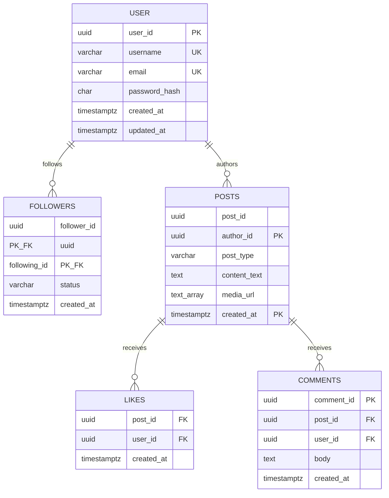
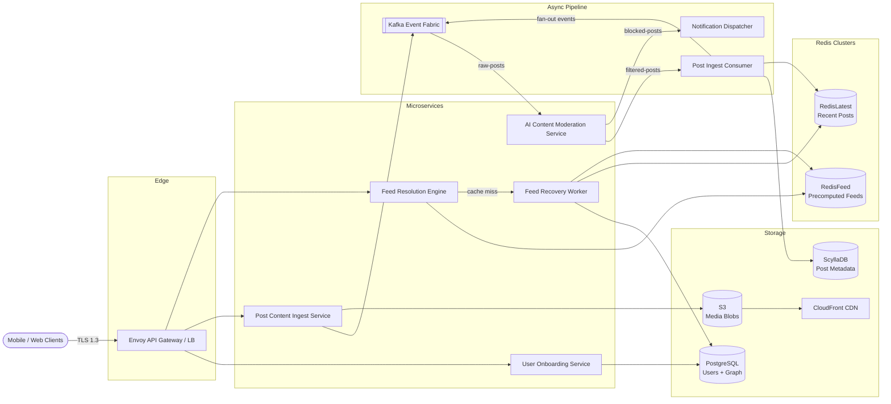
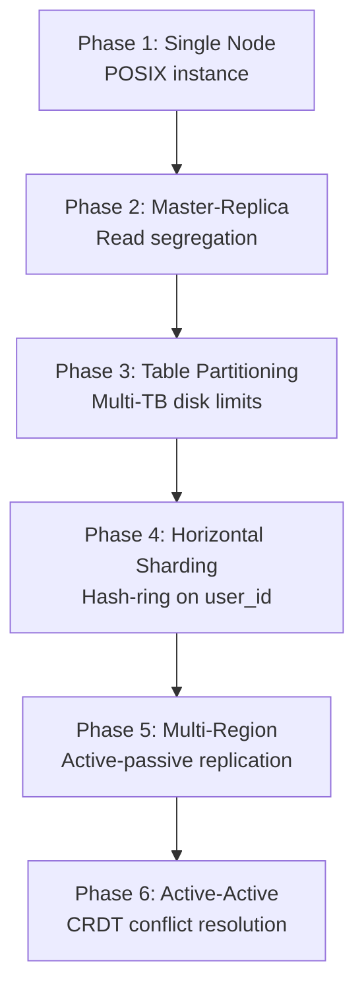
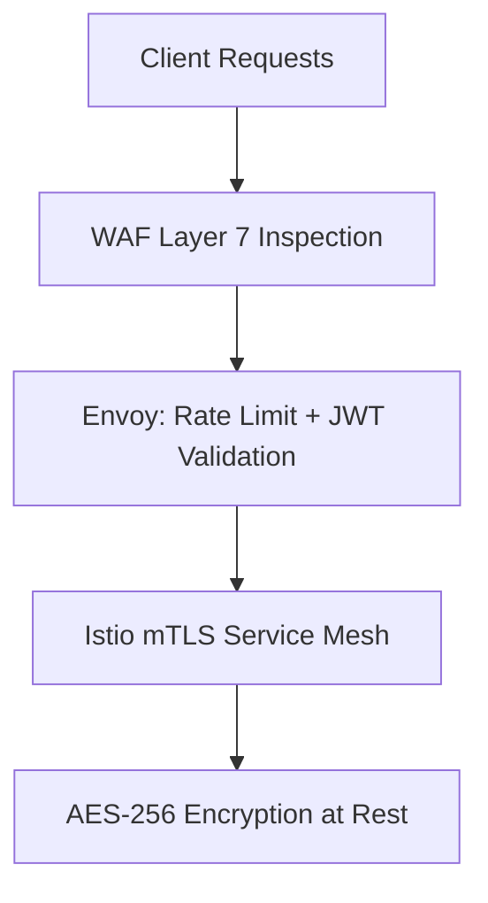

A social graph and feed application connects hundreds of millions of daily active users through profile management, content publishing, follow relationships, engagement (likes and comments), and personalized chronological timelines. At scale it is **read-heavy, fan-out-intensive, and latency-sensitive**: feed reads dominate traffic at a 100:1 ratio over post writes, celebrity posts create thundering-herd bottlenecks, and the system must converge globally within seconds while keeping p99 feed loads under 200 ms.

This post walks through the full design — requirements, capacity math, API contracts, data modeling, hybrid fan-out topology, technology trade-offs, caching, infrastructure sizing, security, observability, and failure modes. For 50 senior-level interview follow-ups, see [Social Feed Interview Questions](/system-design/social-feed-interview-questions/).

---

## 1. Requirements and Goals

### Functional Requirements (MVP)

| Requirement | Description |
| :--- | :--- |
| **User onboarding** | Registration, authentication, profile metadata reads, and profile updates. |
| **Content generation** | CRUD for textual and media posts (images/videos). |
| **Social graph management** | Unidirectional follow model with explicit follower/following tracking and relationship states (`PENDING`, `ACTIVE`, `BLOCKED`). |
| **Engagement engine** | High-throughput like and comment processing on posts. |
| **Social feed generation** | Real-time generation, distribution, and paginated delivery of relevant chronological timelines for active users. |

### Clarifying Assumptions

| Question | Assumption |
| :--- | :--- |
| Follow model? | **Unidirectional** — user A follows user B without mutual requirement. |
| Celebrity threshold? | Users with **≥ 25,000 followers** route through pull-based fan-out. |
| Feed ordering? | **Chronological** (newest first) for this phase; ranking signals deferred. |
| Media upload? | Large blobs bypass application servers via **presigned S3 URLs**. |

### Non-Functional Requirements

| NFR | Target |
| :--- | :--- |
| **Scale** | **500M DAU**; read/write ratio **100:1** (feed consumption vs post generation) |
| **Availability** | **99.999%** uptime — availability prioritized over strict consistency (AP-leaning) |
| **Consistency** | Eventual convergence within **a few seconds** for globally federated feeds |
| **Latency** | p99 feed load **≤ 200 ms**; media metadata upload ack **≤ 500 ms** |
| **Scalability** | Linear performance scaling via decoupled, horizontally stateless microservices |

### Constraints

- **Celebrity fan-out bottleneck**: power-law distributions create thundering-herd issues (e.g., users with 100M+ followers).
- Personalized feeds must not be cached at the CDN layer — only static media assets.

---

## 2. Back-of-the-Envelope Calculations

### Traffic Estimates

| Metric | Calculation | Result |
| :--- | :--- | :--- |
| DAU | Given | **500 × 10⁶ users** |
| Post writes / day | 500M × 2 posts | **1 × 10⁹ / day** |
| Engagement writes / day | 500M × 10 actions | **5 × 10⁹ / day** |
| Feed reads / day | 500M × 20 page-scrolls | **1 × 10¹⁰ / day** |
| Avg post write RPS | 1B ÷ 86,400 s | **~11,574 RPS** |
| Peak post write RPS (3×) | 11,574 × 3 | **~34,722 RPS** |
| Avg feed read RPS | 10B ÷ 86,400 s | **~115,740 RPS** |
| Peak feed read RPS (2×) | 115,740 × 2 | **~231,480 RPS** |
| Avg engagement write RPS | 5B ÷ 86,400 s | **~57,870 RPS** |

### Storage

| Assumption | Calculation | Result |
| :--- | :--- | :--- |
| Post metadata (500 B/record) | 1B × 500 B | **~500 GB / day** |
| Post metadata / year | 500 GB × 365 | **~182.5 TB / year** |
| Media blobs (25% of posts, 2.5 MB avg) | 250M × 2.5 MB | **~625 TB / day** |
| Media storage / year | 625 TB × 365 | **~228 PB / year** |

### Bandwidth

| Metric | Calculation | Result |
| :--- | :--- | :--- |
| Network ingress (media) | 625 TB ÷ 86,400 s | **~7.23 GB/s (~58 Gbps)** |

### Feed Cache Memory (Redis)

| Assumption | Calculation | Result |
| :--- | :--- | :--- |
| Active users cached | 500M DAU | **500M users** |
| Post pointers per user | 100 items × 16 B | **1.6 KB / user** |
| Raw metadata content | 500M × 1.6 KB | **~800 GB** |
| With 3× overhead (index, serialization, replication) | 800 GB × 3 | **~2.4 TB** |

---

## 3. API Design

| # | Method | Path | Purpose |
| :---: | :--- | :--- | :--- |
| 1 | POST | `/api/v1/posts` | Create Post |
| 2 | GET | `/api/v1/feeds?limit=20&cursor=<opaque_token>` | Get Feed Timeline |


Creates a textual status update or registers media asset upload metadata pointers. Idempotency enforced via `X-Idempotency-Key` header (client-generated UUID, 120s TTL Redis lock).

Request headers:

```
Content-Type: application/json
X-Idempotency-Key: c9d8e7b6-1234-4bc3-a212-e8f7a6b5c4d3
Authorization: Bearer <JWT_TOKEN>
```


```json
{
  "user_id": "usr_99f8d7c6-2341-4da2",
  "post_type": "MEDIA",
  "content_text": "Production deployment verification success.",
  "media_assets": [
    {
      "sequence_id": 1,
      "raw_url": "https://media.platform.cdn/raw/2026/06/img_01.mp4",
      "mime_type": "video/mp4"
    }
  ]
}
```



```json
{
  "post_id": "pst_1a2b3c4d-5e6f-7a8b",
  "status": "PENDING_MODERATION",
  "created_at": "2026-06-26T15:57:00Z"
}
```

| Status | Condition |
| :--- | :--- |
| `400 Bad Request` | Payload malformed or constraints breached |
| `401 Unauthorized` | Invalid or expired JWT |
| `422 Unprocessable Entity` | Duplicate `X-Idempotency-Key` collision |
| `429 Too Many Requests` | Rate limiter bucket exhausted |




| Parameter | Default | Max | Notes |
| :--- | :--- | :--- | :--- |
| `limit` | 20 | 50 | Page size |
| `cursor` | — | — | Opaque base64 token wrapping `created_at` + `post_id` bounds |


```json
{
  "data": [
    {
      "post_id": "pst_8e9d1c2b-3a4f-5678",
      "author_id": "usr_c4d3b2a1-5678-4ef3",
      "content_text": "Decoupled stream processing systems.",
      "media_urls": ["https://media.platform.cdn/processed/2026/06/01.webp"],
      "metrics": {
        "likes": 14201,
        "comments": 382
      },
      "created_at": "2026-06-26T15:30:00Z"
    }
  ],
  "paging": {
    "next_cursor": "ZXlKaFpXNTBaV04wSWpvaU1qQTJOVzB6SW4wPQ==",
    "has_more": true
  }
}
```


---

## 4. Data Model



### PostgreSQL — Users & Social Graph (Normalized, ACID)

```sql
CREATE TABLE users (
    user_id UUID PRIMARY KEY DEFAULT gen_random_uuid(),
    username VARCHAR(50) UNIQUE NOT NULL,
    email VARCHAR(255) UNIQUE NOT NULL,
    password_hash CHAR(60) NOT NULL,
    created_at TIMESTAMP WITH TIME ZONE DEFAULT CURRENT_TIMESTAMP NOT NULL,
    updated_at TIMESTAMP WITH TIME ZONE DEFAULT CURRENT_TIMESTAMP NOT NULL
);

CREATE TABLE followers (
    follower_id UUID NOT NULL REFERENCES users(user_id),
    following_id UUID NOT NULL REFERENCES users(user_id),
    status VARCHAR(20) NOT NULL,
    created_at TIMESTAMP WITH TIME ZONE DEFAULT CURRENT_TIMESTAMP NOT NULL,
    PRIMARY KEY (follower_id, following_id)
);
CREATE INDEX idx_followers_following ON followers(following_id)
    INCLUDE (follower_id) WHERE status = 'ACTIVE';
```

Relational storage handles **strong consistency** for account profiles, follow mutations, and block states.

### ScyllaDB — Post Timelines & Engagements (Denormalized, Write-Optimized)

```sql
CREATE TABLE posts (
    post_id UUID,
    author_id UUID,
    post_type VARCHAR(15),
    content_text TEXT,
    media_url LIST<TEXT>,
    thumbnail_url TEXT,
    created_at TIMESTAMP,
    PRIMARY KEY (author_id, created_at, post_id)
) WITH CLUSTERING ORDER BY (created_at DESC, post_id ASC);
```

| Design choice | Rationale |
| :--- | :--- |
| Partition key `author_id` | All posts by a user co-located for fast author timeline scans |
| Clustering `created_at DESC` | Chronological on-disk ordering without secondary indexes |
| LSM append model | Converts random writes to sequential disk appends at billion/day scale |

Engagement counters (likes, comments) are updated asynchronously via Kafka → Redis `HINCRBY` → batch flush to ScyllaDB every 10 seconds.

---

## 5. High-Level Architecture



### Write Path — Post Creation

1. Client uploads media directly to **S3** via presigned URL (bypasses app servers).
2. Client sends `POST /api/v1/posts` with metadata through **Envoy** (JWT validation, rate limiting, idempotency lock).
3. **Content Ingest Service** publishes to Kafka topic `raw-posts`.
4. **AI Moderation Service** filters content; approved posts flow to `filtered-posts`, blocked posts to `blocked-posts` + user notification.
5. **Post Ingest Consumer** persists metadata to **ScyllaDB**, updates **RedisLatest**, and triggers **hybrid fan-out** (push or celebrity pull path).

### Read Path — Feed Timeline

1. Client sends `GET /api/v1/feeds` with opaque cursor.
2. **Feed Resolution Engine** reads pre-computed feed from **RedisFeed** (Redis Sorted Sets, `ZREVRANGEBYSCORE`).
3. On cache miss, **Backfill Engine** queries follower graph from **PostgreSQL**, pulls recent post pointers from **RedisLatest**, merges celebrity pull posts, and rehydrates **RedisFeed**.
4. Response includes post metadata + engagement metrics; media served from **CDN**.

### Component Responsibilities

| Component | Responsibility |
| :--- | :--- |
| **Envoy API Gateway** | TLS termination, JWT verification, sliding-window rate limiting, dynamic downstream routing |
| **Kafka Event Fabric** | Durable write buffering; decouples moderation, fan-out, and analytics consumers |
| **ScyllaDB** | Write-optimized post metadata with predictable p99 append latencies |
| **RedisFeed** | Pre-computed feed arrays for sub-200ms reads |
| **RedisLatest** | Per-author chronological top-100 post pointers for pull-based assembly |

---

## 6. Hybrid Fan-Out Engine

The core challenge is feed generation at scale. A naive push model (write post ID into every follower's feed) collapses when a celebrity with 100M followers publishes.

### Strategy Comparison

| Strategy | How it works | Best for | Risk |
| :--- | :--- | :--- | :--- |
| **Push (fan-out on write)** | Post ID written to each follower's feed cache at publish time | Users with < 25K followers | Write amplification at celebrity scale |
| **Pull (fan-out on read)** | Follower feed assembled at read time from followed authors' recent posts | Celebrity authors | Higher read latency without caching |
| **Hybrid** | Push for normal users; pull-merge for celebrity posts at read time | Production social graphs | More complex merge logic |

**Celebrity threshold: 25,000 followers.**




```java
public interface IFeedFanoutEngine {
    CompletableFuture<Void> fanoutPostEvent(PostEventPayload payload);
}

public class HybridFeedProcessor implements IFeedFanoutEngine {
    private final IFollowerCacheRepository graphRepository;
    private final IKafkaProducerClient eventBusClient;
    private static final int CELEBRITY_THRESHOLD = 25_000;

    @Override
    public CompletableFuture<Void> fanoutPostEvent(PostEventPayload payload) {
        return CompletableFuture.runAsync(() -> {
            long followerCount = graphRepository.getFollowersCount(payload.getAuthorId());

            if (followerCount >= CELEBRITY_THRESHOLD) {
                eventBusClient.emit("celebrity-posts-topic", payload.getPostId(), payload);
            } else {
                List<UUID> followers = graphRepository.getAllFollowerIds(payload.getAuthorId());
                eventBusClient.emitInBatches("standard-fanout-topic", followers, payload);
            }
        });
    }
}
```




```go
// TODO: idiomatic Go equivalent — mirror the Java snippet above
```




### Cursor-Based Pagination (Drift Prevention)

Opaque cursor tokens encode `(created_at, post_id)` bounds — not numeric offsets:

```
WHERE created_at <= :cursor_timestamp
  AND (created_at < :cursor_timestamp OR post_id < :cursor_post_id)
ORDER BY created_at DESC, post_id DESC
LIMIT :page_size
```

New posts arriving after the cursor timestamp are excluded from the current scroll session, ensuring stable page offsets during infinite scroll.

### Engagement Counter Pipeline

Avoid `UPDATE posts SET likes = likes + 1` at scale:

1. Like events stream to Kafka.
2. Redis `HINCRBY` buffers per-post counters.
3. Async worker batch-flushes deltas to ScyllaDB every **10 seconds**.

### Post ID Generation

| Strategy | Pros | Cons |
| :--- | :--- | :--- |
| DB auto-increment | Simple | Central bottleneck; exposes business metrics |
| UUIDv4 (random) | Decentralized | Poor index locality |
| **UUIDv7 / Snowflake** | Time-sortable; no central lock | Requires NTP clock sync |

**Recommended:** UUIDv7 or Snowflake for `post_id` and `user_id` — time-ordered, distributed-safe identifiers.

---

## 7. Database Selection and Scaling

### Technology Comparison

| Store | Use case | Why choose | Why not |
| :--- | :--- | :--- | :--- |
| **ScyllaDB** | Post timelines | Predictable p99 append latencies; LSM sequential writes | No cross-entity joins |
| **PostgreSQL** | Users, follow graph | ACID; partial indexes on `followers(following_id)` | Vertical scaling limits on mutations |
| **Redis Cluster** | Feed caches, counters, graph cache | Sorted Sets for chronological ranking; sub-ms reads | Expensive RAM; needs AOF for durability |
| **Kafka** | Event streaming | High throughput; repeatable offsets; spike absorption | Partition management complexity |
| **S3 + CDN** | Media blobs | Presigned direct upload; edge-cached delivery | Not suitable for metadata queries |

### Scaling Phases



| Phase | Trigger | Action |
| :--- | :--- | :--- |
| **1 — Single node** | Initial launch | Monolithic deployment |
| **2 — Read replicas** | Analytical queries degrade writes | PostgreSQL primary + replicas; ScyllaDB read replicas |
| **3 — Partitioning** | Multi-TB disk limits | Time-based table partitioning on posts |
| **4 — Sharding** | Index memory exceeds RAM | Consistent hash-ring on `user_id` |
| **5 — Multi-region passive** | WAN latency cross-ocean | Active-passive replication with regional failover |
| **6 — Active-active** | Global ingress failure tolerance | CRDT + LWW timestamp resolution for feeds; quorum writes for profiles |

### Social Graph Caching

Active follow relationships cached in **Redis Sorted Sets**:

- Key: `graph:following:{user_id}`
- Members: followed user IDs, scored by follow timestamp
- Lookup complexity: **O(log N + M)** for follow-list compilation during feed construction

---

## 8. Caching Strategy

| Data | Pattern | TTL / Eviction |
| :--- | :--- | :--- |
| **Pre-computed feeds** | Write-through via fan-out workers | **72h TTL**; event-driven invalidation on delete |
| **User recent posts** | Write-through on post ingest | Top 100 pointers per author |
| **User profiles** | Cache-aside | Invalidate on profile update Kafka event |
| **Follow graph edges** | Cache-aside (Sorted Sets) | Invalidate on follow/unfollow/block events |
| **Engagement counters** | Write-back (Redis HINCRBY) | Batch flush to ScyllaDB every 10s |
| **Idempotency keys** | Redis SETNX | **120s TTL** |

### Cache Stampede Protection

- **Distributed locks (Redlock)**: only one worker recomputes a cache miss.
- **Probabilistic early expiration (XFetch)**: refresh entries before hard TTL expiry.
- **Circuit breakers**: on Redis outage, fall back to real-time pull computation without overloading ScyllaDB.

### Feed Cache Sizing

```
500M users × 100 pointers × 16 B = 800 GB raw
× 3 overhead factor = ~2.4 TB total RedisFeed cluster
```

Deploy as **24 master shards + 24 read replicas** on 128 GB RAM nodes.

---

## 9. Capacity Planning

Target: **500M DAU**, **~231K peak feed read RPS**

| Component | Metric | Calculation / Assumption | Recommendation |
| :--- | :--- | :--- | :--- |
| **Envoy API Gateway** | Ingress pods | Peak 231K RPS ÷ ~5K RPS/pod | **45 pods** (4 vCPU, 8 GB RAM) |
| **Core microservices** | Feed + Content pods | ~2K RPS/pod sustained | **120 pods** (8 vCPU, 16 GB RAM) |
| **RedisFeed cluster** | Memory | ~2.4 TB with overhead | **24 masters + 24 replicas** (128 GB/node) |
| **RedisLatest cluster** | Recent post pointers | ~200 GB estimated | **8 shards** |
| **Kafka brokers** | Peak ingest + fan-out | ~35K post RPS + fan-out batches | **12 brokers** (NVMe storage) |
| **ScyllaDB** | Write throughput | ~35K writes/s peak | Multi-AZ ring; RF=3 |
| **PostgreSQL** | Users + graph | Low relative to feed reads | Primary + 2 replicas behind PgBouncer |
| **S3 + CDN** | Media egress | ~58 Gbps ingress; viral CDN shield | Origin shield + edge caching |
| **Network** | Peak feed reads | 231K RPS × ~2 KB metadata | ~462 MB/s |

### Autoscaling

Kubernetes **HPA** triggers when:

- Average CPU exceeds **65%** for 3 minutes, or
- p99 response time exceeds **150 ms**, or
- Kafka consumer lag exceeds configured threshold

Off-peak: scale down pods via custom Prometheus metrics (request throughput, queue depth).

---

## 10. Key Design Decisions Summary

| Decision | Choice | Rationale |
| :--- | :--- | :--- |
| Feed fan-out | Hybrid push/pull | Push for < 25K followers; pull-merge for celebrities |
| Post store | ScyllaDB (not PostgreSQL) | LSM append model matches billion/day write profile |
| Graph store | PostgreSQL (not graph DB) | Single-hop follower queries need indexes, not traversal |
| Write buffering | Kafka before persistence | Absorbs write spikes; enables async moderation |
| Media ingress | Presigned S3 upload | Keeps large blobs off application servers |
| Feed cache | Redis Sorted Sets | O(log N + M) chronological slices via `ZREVRANGEBYSCORE` |
| Engagement counters | Kafka → Redis → batch flush | Avoids row-lock contention on hot posts |
| Pagination | Opaque cursor (time + ID) | Prevents drift during infinite scroll |
| API gateway | Envoy (not Nginx) | Native HTTP/2, xDS config, distributed tracing, circuit breaking |
| Internal security | Istio mTLS | Zero-trust service-to-service authentication |
| Auth tokens | Short-lived JWT (15 min) + refresh | Limits compromise window; server-side refresh blacklist |
| Observability | OpenTelemetry + Prometheus | SLI: 99.5% of feed requests < 200ms over 5-min windows |
| Content moderation | Async ML pipeline | Private S3 staging → policy check → public CDN promotion |
| Multi-region | CRDT + LWW for feeds; quorum for profiles | AP for timelines; stronger consistency for account data |
| Analytics isolation | Snowflake read replica | BI queries off transactional hot path |

### Production Enhancements Over a Baseline Design

| Baseline limitation | Production realization |
| :--- | :--- |
| Relational runtime joins for feed generation | Decoupled hybrid fan-out topology |
| Direct DB writes on post creation | Kafka-buffered async ingestion pipeline |
| Single monolithic PostgreSQL | Polyglot persistence (PostgreSQL + ScyllaDB + Redis) |
| Undefined caching layer | Multi-tier Redis with explicit TTL and eviction policies |
| Media through app servers | Presigned direct-to-S3 ingress architecture |
| No infrastructure automation | Terraform-managed multi-region EKS with Istio service mesh |

### High Availability & Disaster Recovery

| Metric | Target |
| :--- | :--- |
| **RPO** (ScyllaDB) | ≤ 4 hours (SSTable snapshots to multi-region object storage every 4h) |
| **RTO** | ≤ 30 minutes (automated Terraform failure recovery) |
| **Deployment** | Stateless services across 3+ AZs; odd-quorum database configurations |

### Security Layers



---

## 11. Failure Modes and Mitigations

| Failure | Impact | Mitigation |
| :--- | :--- | :--- |
| **RedisFeed outage** | Feed reads slow or fail | Circuit breaker; Backfill Engine computes pull-based timeline from PostgreSQL + RedisLatest |
| **Kafka broker failure** | Ingestion backlog | Local disk fallback buffer; consumer offset not committed until batch ack |
| **Fan-out worker crash mid-batch** | Partial feed propagation | At-least-once delivery; uncommitted offsets reassigned to another consumer |
| **Celebrity post spike** | Fan-out write storm | Pull path for ≥ 25K followers; celebrity registry merged at read time |
| **Cache stampede** | DB overload on mass expiry | Redlock single-flight recompute + XFetch early refresh |
| **Network partition** | Split-brain risk | AP-leaning: local operational writes buffered; re-sync on heal |
| **ScyllaDB node failure** | Reduced write capacity | Masterless ring redistributes; quorum reads/writes continue |
| **PostgreSQL primary down** | Follow mutations blocked | Automatic failover to standby; feed reads unaffected (cached) |
| **Moderation pipeline lag** | Posts stuck in PENDING | Scale moderation consumers; posts visible only after APPROVED status |
| **S3 staging bucket compromise** | Malicious media exposure | Private staging bucket; CDN promotion only after ML policy pass |
| **Rapid like toggling** | Counter inflation | Client debounce + per-user-post rate limit at gateway |
| **Account deletion** | Orphaned data | Async saga: mark DELETED → Kafka purge events for graph, feeds, media |
| **Block mid-scroll** | Blocked content visible | Dynamic bloom filter of blocked IDs applied during timeline generation |
| **Deep pagination abuse** | Expensive historical scans | Hard limit of 500 feed items; redirect older data to cold storage |

### Kafka Consumer Failure Semantics

Offsets commit **only after** fan-out batch writes are acknowledged by RedisFeed/ScyllaDB. A crashed worker's uncommitted batch is reassigned — guaranteeing at-least-once delivery without silent loss.

---

## Interview Highlights

Deep-dive questions interviewers ask after the whiteboard:

- How do you handle a celebrity with 100M followers posting a video?
- Why ScyllaDB over PostgreSQL for post timelines?
- How do opaque cursors prevent pagination drift?
- How do you implement like counters without lock contention?
- What happens when the entire pre-computed feed cache is destroyed?

Full answers: [Social Feed Interview Questions](/system-design/social-feed-interview-questions/).

---

## What's Next

Future posts in this series will cover feed ranking algorithms (ML-based relevance), stories/ephemeral content TTL pipelines, and GDPR-compliant cross-region data residency for user profiles.
