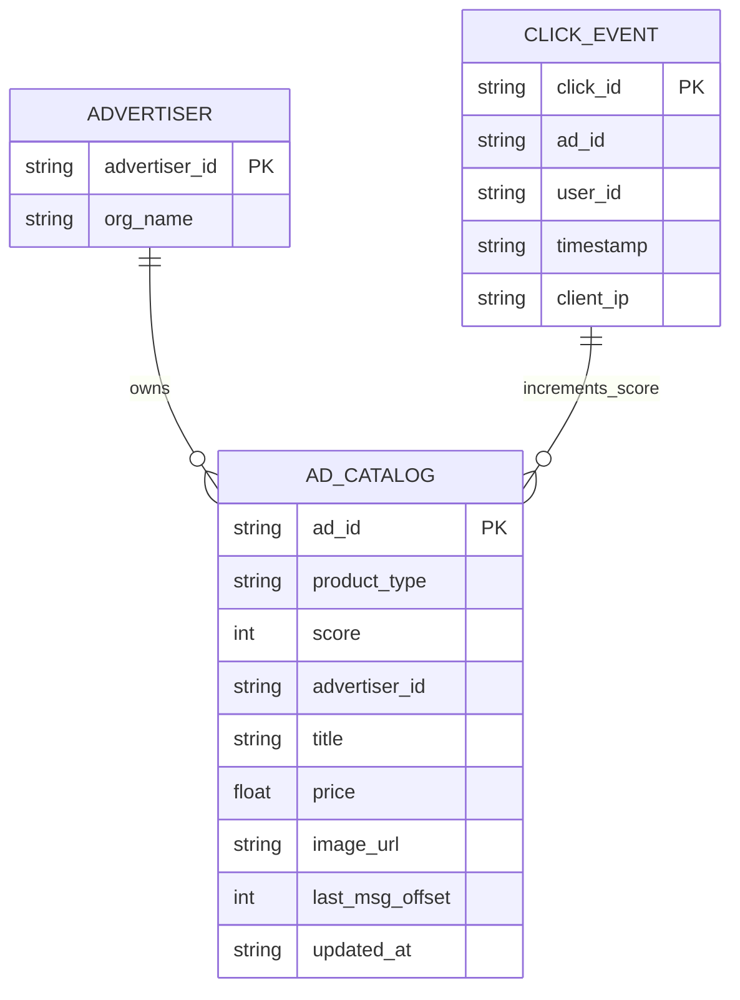
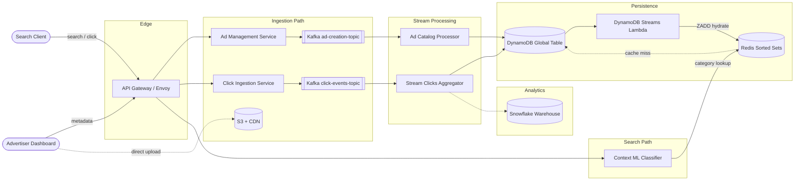
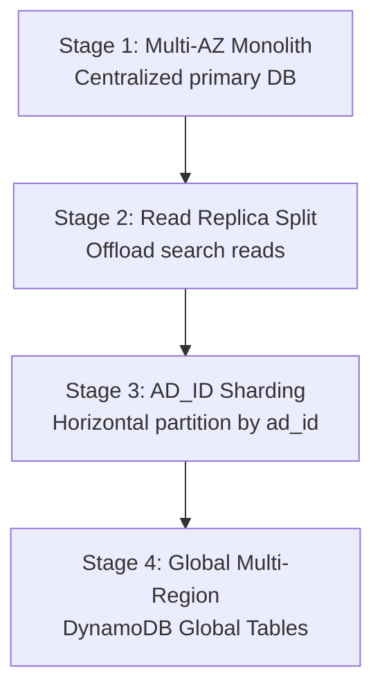
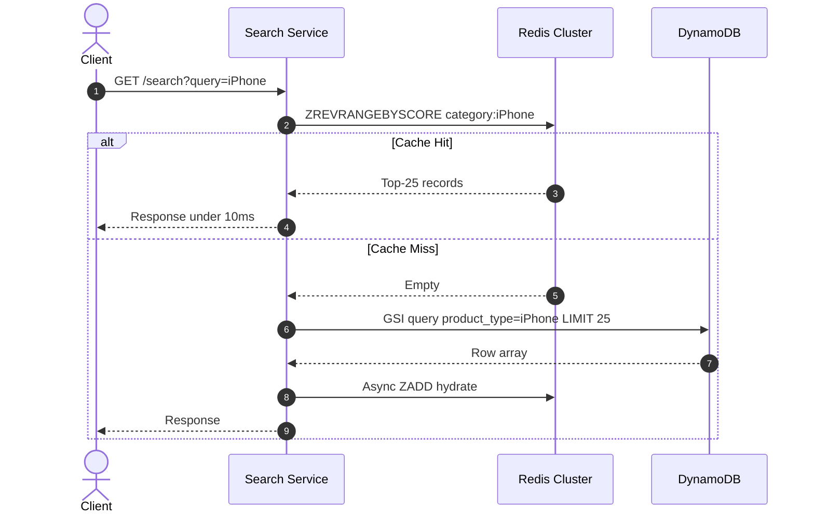

A sponsored ads platform matches user search intent to retailer inventory, ranks candidates by click-feedback scores, and serves results in real time across millions of advertisers and billions of products. At scale it is **read/write balanced on the user path** (search reads and click writes at ~1:1) while internal telemetry aggregation is **write-dominated**. Search must return top ads in **< 200 ms P99**; click scores must propagate to the serving cache within **≤ 3 minutes**.

This post walks through the full design — requirements, capacity math, API contracts, DynamoDB data modeling, Kafka-backed click aggregation, Redis sorted-set serving, technology trade-offs, infrastructure sizing, security, observability, and failure modes. For senior-level interview follow-ups, see [Sponsored Ads Interview Questions](/system-design/sponsored-ads-interview-questions/).

---

## 1. Requirements and Goals

### Functional Requirements (MVP)

| Requirement | Description |
| :--- | :--- |
| **Ad ingestion** | Advertisers upload sponsored ads with text metadata, category targeting, and product image assets. |
| **Multi-vendor display** | A single search intent can surface ads from multiple sellers or multiple variants from one seller. |
| **Search and retrieval** | Users executing search queries see relevant sponsored ads prioritized by an internal ranking score. |
| **Click logging** | Process real-time user click events on displayed ads. |
| **Feedback ranking** | Every valid click increases that ad's score by **+5 points**, elevating display probability for subsequent category-matched searches. |

### Clarifying Assumptions

| Question | Assumption |
| :--- | :--- |
| Budget enforcement or real-time CPC bidding? | **No** — ranking is dictated entirely by the feedback click-score loop. |
| Complex multi-attribute targeting (geofencing, interest tracking)? | **No** — mapping is based on coarse-grained product category keywords/tags only. |
| Synchronous click fraud / duplicate deduplication? | **No** — deduplication and legitimacy validation run asynchronously in the streaming pipeline. |

### Non-Functional Requirements

| NFR | Target |
| :--- | :--- |
| **Scale** | **100M** registered advertisers; **1B** distinct products; **~100K** active product categories |
| **Availability** | Core query and ad display path **≥ 99.99%** (stretch: **99.999%** for search) |
| **Search latency** | P99 **< 200 ms** to render targeted ads |
| **Score propagation** | P99 end-to-end click → cache refresh **≤ 3 minutes** |
| **Ad ingestion** | P99 upload → indexable **≤ 1 minute** |
| **Consistency** | Eventual consistency across global readers; minor ranking variance during live updates is acceptable |
| **Durability** | Zero data loss for click telemetry and ad financial records |
| **Read / Write ratio** | User-facing search vs click **≈ 1 : 1**; internal DB mutations are write-heavy due to telemetry |

---

## 2. Back-of-the-Envelope Calculations

### Operational Assumptions

| Parameter | Value |
| :--- | :--- |
| DAU making searches | **10M** |
| Queries per user per day | **10** |
| Daily active advertisers | **100K** |
| New/updated ads per advertiser per day | **10** |
| Click events per user per day | **10** |
| Peak factor (localized multi-region surges) | **100×** |

### Traffic Estimates

| Metric | Calculation | Result |
| :--- | :--- | :--- |
| Total searches / day | 10M × 10 | **100M / day** |
| Average search RPS | 100M ÷ 86,400 s | **~1,157 RPS** |
| Peak search RPS | 1,157 × 100 | **~115,700 RPS (~115K)** |
| Ad uploads / day | 100K × 10 | **1M / day** |
| Average ad creation RPS | 1M ÷ 86,400 s | **~11.5 RPS** |
| Peak ad creation RPS | 11.5 × 100 | **~1,150 RPS** |
| Click events / day | 10M × 10 | **100M / day** |
| Average click RPS | 100M ÷ 86,400 s | **~1,157 RPS** |
| Peak click RPS | 1,157 × 100 | **~115,700 RPS (~115K)** |

### Storage

| Dataset | Calculation | Result |
| :--- | :--- | :--- |
| Ad catalog growth | 1M ads/day × 500 B | **500 MB / day** |
| Replicated catalog (3×) | 500 MB × 3 | **1.5 GB / day** |
| 10-year catalog (3× replication) | 182.5 GB/year × 10 × 3 | **~5.5 TB** |
| Click telemetry raw | 100M events/day × 200 B | **20 GB / day** |
| Click telemetry yearly | 20 GB × 365 | **~73 TB / year** (cold storage partitioning required) |

### Bandwidth

| Path | Calculation | Result |
| :--- | :--- | :--- |
| Inbound search (peak) | 115,700 RPS × 200 B | **~23 MB/s** |
| Outbound search (top 25 ads) | 115,700 × (25 × 500 B) | **~1.45 GB/s** |
| Click ingestion (peak) | 115,700 RPS × 200 B | **~23 MB/s** |

### Redis Working Set

| Assumption | Calculation | Result |
| :--- | :--- | :--- |
| Active categories | 100,000 | — |
| Top ads per category | 25 | — |
| Payload per cached ad | ~1 KB (metadata + overhead) | — |
| Total cache memory | 100K × 25 × 1 KB | **~2.5 GB** |

A single Redis shard holds the working set; we scale out for HA and throughput, not memory limits.

---

## 3. API Design

### Get Upload Token (Pre-signed URL)

**`POST /api/v1/advertiser/ads/preassigned-url`**

Authentication: Mutual TLS or Bearer token.

Request:

```json
{
  "advertiser_id": "adv_99218",
  "content_type": "image/jpeg",
  "file_size_bytes": 102400
}
```

Response (`200 OK`):

```json
{
  "upload_url": "https://s3.us-east-1.amazonaws.com/google-ads-media/thumbs/xyz123?...",
  "asset_key": "thumbs/xyz123.jpg"
}
```

### Create Ad Metadata

**`POST /api/v1/advertiser/ads`**

Headers: `X-Idempotency-Key: <UUIDv4>`

Request:

```json
{
  "advertiser_id": "adv_99218",
  "product_id": "prod_7712",
  "product_type": "iPhone",
  "title": "Apple iPhone 15 Pro Max - Unlocked",
  "price": 1099.00,
  "image_asset_key": "thumbs/xyz123.jpg"
}
```

Response (`202 Accepted`):

```json
{
  "ad_id": "ad_88192031",
  "status": "PENDING_COMPLIANCE_REVIEW",
  "created_at": "2026-06-27T07:46:00Z"
}
```

### Search Ads

**`GET /api/v1/ads/search?query=gifts+for+10+year+old&device=mobile`**

Response (`200 OK`):

```json
{
  "query": "gifts for 10 year old",
  "inferred_categories": ["comic book", "toy"],
  "ads": [
    {
      "ad_id": "ad_00192a",
      "title": "Ultimate Superhero Comic Omnibus",
      "price": 29.99,
      "image_url": "https://cdn.googleads.com/media/thumbs/comic1.jpg",
      "seller_id": "adv_1211",
      "ranking_score": 1420
    }
  ]
}
```

### Track Click Telemetry

**`POST /api/v1/clicks`**

Headers: `X-Idempotency-Key: <UUIDv4>`

Request:

```json
{
  "click_id": "clk_7721901a88b",
  "ad_id": "ad_00192a",
  "user_id": "usr_8829102",
  "timestamp": "2026-06-27T07:46:01Z",
  "client_ip": "192.0.2.1"
}
```

Response (`202 Accepted`):

```json
{
  "status": "QUEUED"
}
```

### HTTP Error Codes

| Code | Error | Condition |
| :--- | :--- | :--- |
| `400` | `ERR_INVALID_CATEGORY` | Unsupported or banned category |
| `401` | `ERR_AUTH_EXPIRED` | Credential signature window failed |
| `429` | `ERR_RATE_LIMIT_EXCEEDED` | Token-bucket limit breached per IP or API key |
| `503` | `ERR_BROKER_BACKPRESSURE` | Ingestion buffer saturated |

### Idempotency

All write flows accept `X-Idempotency-Key`. The API gateway caches the mutation response in Redis with a **24-hour TTL**. Duplicate keys within the window return the cached response without reprocessing downstream side effects.

---

## 4. Data Model

The system splits persistence into two logical groups: **Ad Catalog Inventory** (operational mutations, key-value indexes) and **Telemetry Audit Ledger** (cold retention, batch analytics).



### `GoogleAdsCatalog` (DynamoDB)

| Attribute | Type | Index | Purpose |
| :--- | :--- | :--- | :--- |
| `ad_id` | String (PK) | Base table | High-cardinality uniform partition distribution |
| `SK` | `METADATA` (sort key) | Base table | Single-item row per ad |
| `product_type` | String | GSI-1 PK | Coarse category for query domain |
| `score` | Number | GSI-1 SK (DESC) | Click-feedback weight for inverted sorted scans |
| `advertiser_id` | String | — | Ownership / billing profile mapping |
| `title` | String | — | Rendered ad text |
| `price` | Number | — | Displayed item cost |
| `image_url` | String | — | CDN asset pointer |
| `last_msg_offset` | Number | — | Highest Kafka offset merged — idempotency guard |
| `updated_at` | ISO 8601 | — | Mutation age for cache sync tracking |

**GSI: `GSI_CategoryRanking`** — Partition: `product_type`, Sort: `score` (descending).

### Normalization vs Denormalization

A normalized relational model (Sellers → Products → AdPlacements) requires expensive runtime joins that breach the **< 200 ms** search SLA at **115K peak RPS**. The denormalized ad row houses vendor metadata and localized metrics redundantly, enabling single-digit millisecond point reads and bounded GSI range scans per category.

---

## 5. High-Level Architecture



### Component Responsibilities

| Component | Responsibility |
| :--- | :--- |
| **API Gateway** | TLS termination, auth, rate limiting (Redis token buckets), backpressure shielding |
| **Ad Management Service** | Publisher config, validation, pre-signed S3 upload tokens |
| **Click Ingestion Service** | Ultralight HTTP handler — validate signature, enqueue to Kafka; no business logic |
| **Kafka** | Decouples write surges; `ad-creation-topic` and `click-events-topic` |
| **Stream Clicks Aggregator** | Micro-batch consumption, per-key aggregation, idempotent score commits |
| **Redis Cluster** | Sorted sets (ZSET) for O(log N + M) top-N reads per category |
| **Context ML Classifier** | Maps search phrases to product category tokens before cache lookup |
| **DynamoDB Streams → Lambda** | CDC-driven cache hydration without TTL-based invalidation |

### Search Path

1. Client sends `GET /api/v1/ads/search`.
2. **Context ML Classifier** resolves query → category keys (e.g. `comic book`, `toy`).
3. For each category, read top-25 from **Redis** via `ZREVRANGEBYSCORE`.
4. Merge, deduplicate, return ranked payload (**< 10 ms** on cache hit).

### Click Path

1. Client sends `POST /api/v1/clicks` → **Click Ingestion Service** → **Kafka**.
2. **Stream Clicks Aggregator** batches events, aggregates score deltas per `ad_id`, commits to **DynamoDB** with offset-based idempotency.
3. **DynamoDB Streams** triggers Lambda to `ZADD` updated scores into Redis.

### Ad Ingestion Path

1. Advertiser obtains pre-signed URL, uploads image directly to **S3**.
2. `POST /api/v1/advertiser/ads` publishes metadata to Kafka.
3. **Ad Catalog Processor** initializes DynamoDB row with `score = 0`, status transitions to indexable.

---

## 6. Core Ranking Algorithm — Click Feedback & Score Aggregation

### Score Increment Model

Each valid click applies a discrete **+5** delta to the ad's `score` attribute. Ranking within a category is purely by descending `score` — no real-time CPC bidding in scope.

### In-Memory Micro-Batching (Hot Partition Protection)

When a viral ad receives millions of clicks, per-event DynamoDB writes create hot partitions and lock contention. The aggregator collects events over a **30-second window** per `ad_id`, collapses them into a single delta (e.g. 10,000 clicks → `+50,000`), and performs one atomic `UpdateItem` with `ADD score :delta`.

### Idempotent Offset Tracking

```go
// Conditional update — only apply if incoming offset > last_msg_offset
UpdateScoreIdempotent(adID, scoreDelta, kafkaOffset)
```

Each DynamoDB row stores `last_msg_offset`. Updates with `offset <= last_msg_offset` are skipped, guaranteeing exactly-once score application across consumer restarts.

### Partition-Key Worker Isolation

Within each aggregator instance, events route through Go channels to workers keyed by `ad_id` hash. Single-key updates never contend across workers, eliminating global mutex bottlenecks.

### Category Retrieval Complexity

| Operation | Store | Complexity |
| :--- | :--- | :--- |
| Top-25 by category | Redis ZSET `ZREVRANGE` | O(log N + 25) |
| Cache miss fallback | DynamoDB GSI `product_type` + `score DESC` | O(log N + 25) |
| Point read by `ad_id` | DynamoDB base table | O(1) |

### Async Fraud Deduplication

The streaming worker maintains a Redis lookback window of `(user_id, ad_id)` pairs. Excessive repetitive interactions within a short window are flagged and dropped before score deltas reach DynamoDB. Edge WAF rules and per-IP rate limits handle obvious bot traffic synchronously.

---

## 7. Database Selection and Scaling

### Technology Comparison

| Component | Choice | Why choose | Why not alternatives |
| :--- | :--- | :--- | :--- |
| **Ad catalog store** | DynamoDB Global Tables | Predictable single-digit ms at 115K write RPS; managed sharding | PostgreSQL: lock queues at peak writes; Cassandra: compaction/tombstone ops burden |
| **Hot serving cache** | Redis ZSET | Native sorted-set top-N; atomic `ZADD` | Memcached: no native sorted structures; app-side sorting adds latency |
| **Event buffer** | Kafka | Append-only replay; offset-controlled reprocessing | RabbitMQ: messages dropped after ack; no durable replay |
| **Object storage** | S3 + CDN | Durable media; pre-signed direct upload isolates binary traffic | Inline DB blob storage: expensive and slow |
| **Analytics warehouse** | Snowflake | Columnar OLAP for click stream batch loads | Querying DynamoDB for analytics: cost-prohibitive at 73 TB/year |
| **Category resolution** | ML Classifier service | Maps ambiguous queries to category keys | Hardcoded keyword map: brittle for spelling errors and long-tail queries |

### Scaling Strategy



| Stage | Trigger | Design | Limitation |
| :--- | :--- | :--- | :--- |
| **1 — Multi-AZ** | Baseline | Microservices across 3 AZs, centralized DB | Compute starvation at peak |
| **2 — Read replicas** | Search > 15K RPS | Reads to replicas; primary for writes | Replication lag shows stale rankings |
| **3 — Sharding** | Writes > 10K RPS | Hash partition on `ad_id` | Cross-shard aggregation inefficient |
| **4 — Global active-active** | Cross-continent latency > 200 ms | DynamoDB Global Tables; regional silos | LWW conflicts on metadata; additive scores tolerate reordering |

### Cross-Region Conflict Resolution

DynamoDB Global Tables use **Last-Write-Wins (LWW)** on absolute field updates. Ad metadata changes are infrequent and single-writer per advertiser. Click scores use **relative `ADD` deltas** rather than absolute replacement, keeping trends accurate even when updates arrive out of sequence across regions.

---

## 8. Caching Strategy

### Cache-Aside with CDC Hydration

The system avoids short TTL expirations on hot category keys. Instead, **DynamoDB Streams → Lambda** continuously updates Redis ZSET scores on every mutation.



### Cache Invalidation

| Pattern | Implementation |
| :--- | :--- |
| Score update | CDC stream → Lambda `ZADD` (no TTL expiry) |
| New ad indexed | CDC insert → Lambda adds member to category ZSET |
| Ad removed | CDC delete → Lambda `ZREM` |
| Memory pressure eviction | Single-flight lock on miss — one thread queries DB, others wait |

### Sizing

| Parameter | Value |
| :--- | :--- |
| Working set | **~2.5 GB** (100K categories × 25 ads × 1 KB) |
| Topology | **6 primary shards + 6 cross-zone replicas** (12 nodes) |
| Instance profile | Memory-optimized (e.g. AWS `r6g.large`, 16 GB RAM) |

Baseline TTL of **24 hours** on hydrated keys acts as a safety net; CDC keeps data fresh without relying on expiry-driven reloads.

---

## 9. Capacity Planning

| Component | Metric | Calculation / Assumption | Recommendation |
| :--- | :--- | :--- | :--- |
| **Search / ML pods** | Peak search RPS | 115K RPS ÷ 1,500 RPS/pod × 1.5 headroom | **~116 pods** (2 vCPU, 4 GB RAM) |
| **Click Ingestion Service** | Peak click RPS | 115K RPS (buffered by Kafka) | Auto-scaled; HPA at CPU ≥ 65% |
| **Redis Cluster** | Working set memory | 100K × 25 × 1 KB | **12 nodes** (6 masters + 6 replicas) |
| **Kafka** | Peak event rate | 115K events/sec combined | **6 brokers**; 64 partitions/topic; NVMe SSD |
| **Stream Aggregators** | Consumer parallelism | 1 consumer per partition | Up to **64 instances** per topic |
| **DynamoDB** | Write throughput | Batched 30s windows reduce effective WCU | On-demand or provisioned with auto-scaling |
| **Network egress** | Search response | 115K × 12.5 KB | **~1.45 GB/s** |

### Autoscaling

| Trigger | Action |
| :--- | :--- |
| CPU ≥ 65% or queue depth > 400 connections | HPA scales search/ingest pods |
| Kafka consumer lag > threshold | Scale aggregator replicas (up to partition count) |
| Downstream DB write stalls | Aggregators double batch window (30s → 60s); slow Kafka consumption |

### Cost Optimization

Deploy stateless stream workers on **Spot Instances** (tolerate transient node loss via Kafka replay). Run user-facing search APIs on **On-Demand** instances. Use cluster autoscalers (e.g. Karpenter) to scale nodes with real-time traffic.

---

## 10. Key Design Decisions Summary

| Decision | Choice | Rationale |
| :--- | :--- | :--- |
| Consistency model | Eventual (AP) | Minor ranking variance acceptable; availability prioritized |
| Catalog store | DynamoDB denormalized | Single-digit ms reads; GSI for category ranking |
| Serving cache | Redis Sorted Sets | O(log N + M) top-N; atomic score updates |
| Click path | Kafka → micro-batch aggregator | Absorbs 115K RPS spikes; durable replay |
| Score updates | Relative `ADD` deltas + offset idempotency | Safe across consumer restarts and cross-region reordering |
| Cache refresh | CDC (DynamoDB Streams) not TTL | Prevents stampede; sub-3-minute propagation |
| Category mapping | ML classifier (not hardcoded map) | Handles ambiguous, misspelled, long-tail queries |
| Fraud handling | Async dedup in stream + edge WAF | Keeps click ingestion ultralight |
| Idempotency | Gateway Redis cache, 24h TTL | Safe client retries on all write endpoints |
| Media pipeline | S3 ingest → Lambda resize/WebP → CDN | Production image optimization (see below) |

### Security Architecture

| Control | Implementation |
| :--- | :--- |
| Transport | TLS 1.3 at edge; mTLS (Istio/SPIFFE) service-to-service |
| Authentication | OAuth2 scoped tokens for advertisers; mutual TLS for internal |
| Authorization | Advertisers modify only resources mapped to their `advertiser_id` |
| Rate limiting | 100 req/s per IP or API key at gateway → `429` |
| Input validation | XSS/SQLi filtering on metadata fields before downstream |
| Encryption at rest | AES-256 across DynamoDB, S3, and Redis persistence |

### Observability (SLI / SLO)

| SLI | SLO |
| :--- | :--- |
| Search availability (non-5xx ratio) | **≥ 99.99%** over rolling 30 days |
| Search P99 latency (`/api/v1/ads/search`) | **≤ 200 ms** |
| Click → cache score propagation | **≤ 3 minutes** for 99% of events |
| Ad upload → indexable | **≤ 1 minute** P99 |

**Instrumentation:** Prometheus metrics (Kafka lag, cache hit ratio), OpenTelemetry distributed tracing (`X-Trace-ID` propagated from gateway), structured JSON logs to OpenSearch.

### Production Enhancements Beyond MVP

| Area | MVP gap | Production approach |
| :--- | :--- | :--- |
| **Image ingestion** | Raw upload → DB path | Ingest bucket → Lambda (virus scan, strip EXIF, WebP variants) → CDN edge |
| **Semantic search** | Hardcoded category strings | Two-stage pipeline: bi-encoder vector retrieval (Milvus/Pinecone) + cross-encoder rerank with CTR signals |
| **Compute topology** | Fixed peak-capacity fleet | Spot workers for queue-backed processors; On-Demand for search API; Karpenter node autoscaling |

---

## 11. Failure Modes and Mitigations

| Failure | Impact | Mitigation |
| :--- | :--- | :--- |
| **Redis shard failure** | Cache miss storm on DynamoDB GSI | Circuit breaker on cache timeout; rate-limit search fallback; promote replica within seconds |
| **Kafka ingestion outage** | Click logging halts; scores stop updating | Ingress buffers to local disk or fallback store; replay to Kafka on recovery |
| **DynamoDB write contention** | Aggregator stalls; Kafka lag grows | Double batch window (30s → 60s); fewer, larger atomic updates per hot key |
| **AZ / region partition** | Regional endpoint unreachable | Anycast DNS withdraws unhealthy routes; traffic reroutes to active region |
| **ML classifier down** | Category resolution fails | Fallback to keyword trie lookup; degrade to popular categories for query |
| **Hot ad partition** | Single `ad_id` saturates aggregator worker | Micro-batch aggregation collapses N clicks into one write |
| **Cache stampede on eviction** | DB overload on popular category miss | Single-flight lock; CDC avoids TTL-driven mass expiry |
| **Cross-region metadata conflict** | Stale title/image after concurrent edit | LWW on metadata acceptable; advertisers typically single-writer |
| **Broker backpressure** | `503 ERR_BROKER_BACKPRESSURE` to clients | Gateway sheds load; consumers slow offset consumption |

---

## What's Next

Future posts in this series will cover adjacent designs — real-time CPC bidding engines, budget pacing with token buckets, bi-encoder + cross-encoder ad retrieval pipelines, and click fraud detection with graph-based bot clustering.
