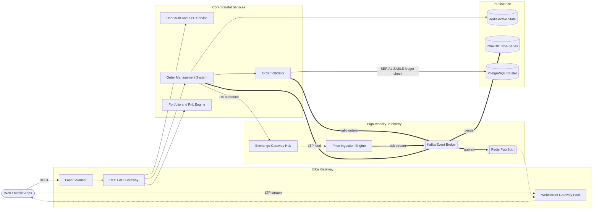
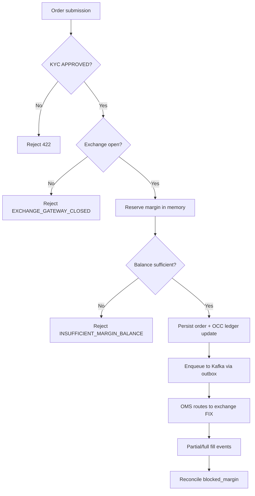
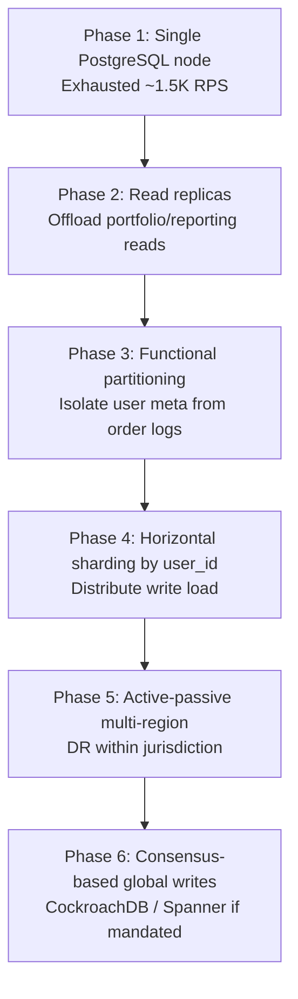
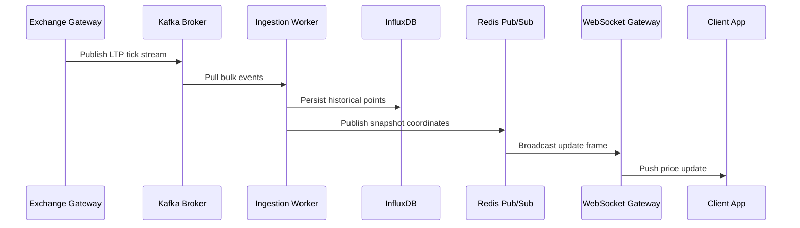

A stock broker trading platform lets retail investors onboard, watch live market prices, place orders, and track portfolio P&L — all while every rupee of margin and every fill must reconcile with the national exchange. At scale it is **asymmetric and latency-critical**: market data and portfolio reads dominate traffic, but order validation, ledger mutations, and exchange routing demand **strict ACID serializability** with **sub-100 ms P99** on the execution path.

This post walks through the full design — requirements, capacity math, API contracts, data modeling, microservice topology, order-validation algorithms, technology trade-offs, caching, infrastructure sizing, and failure modes. For 50 senior-level interview follow-ups, see [Stock Broker Trading Interview Questions](/system-design/stock-broker-trading-interview-questions/).

---

## 1. Requirements and Goals

### Functional Requirements (MVP)

| Requirement | Description |
| :--- | :--- |
| **Onboarding & compliance** | Register, authenticate, and complete asynchronous KYC identity validation. |
| **Real-time market data** | Near real-time LTP (Last Traded Price) and multi-resolution OHLCV charting. |
| **Order lifecycle** | Place, modify, and cancel market or limit buy/sell orders. |
| **Watchlists** | Create and mutate user-defined, multi-asset watchlists. |
| **Portfolio & analytics** | Real-time positions, daily/unrealized P&L, transaction history, and ledger accounts. |

### Clarifying Assumptions

| Question | Assumption |
| :--- | :--- |
| Internal order matching? | **No** — the platform is a certified broker; every trade clears through the national exchange. |
| Exchange link unstable? | Local queuing with a **fast-failing circuit breaker**; reject new orders at the edge rather than silently caching unrouted requests. |
| Partial fills? | Orders may fill in multiple stages over minutes; asynchronous state reconciliation via Kafka. |

### Non-Functional Requirements

| NFR | Target |
| :--- | :--- |
| **Consistency** | Financial operations, order routing, and ledger mutations guarantee **serializable ACID**; availability may degrade during systemic faults to prevent corruption. |
| **Order validation latency** | **P99 < 100 ms** on the execution validation path |
| **Market tick propagation** | **< 50 ms** from exchange ingest to client |
| **Data sovereignty** | All infrastructure co-located within the same legal jurisdiction as the national exchange (e.g., India). |
| **Scale** | **10M DAU**; **10,000** listed securities |
| **Read / Write ratio** | **50 : 1** (aggressive price polling, charting, portfolio monitoring vs. order placement) |
| **Trading window** | High-throughput transactional workloads run **6.25 hours/day** (market hours only) |

---

## 2. Back-of-the-Envelope Calculations

### Traffic Estimates

Starting from **10M DAU**, **5% active traders**, **4 orders/session**, and a **50:1 read/write ratio**:

| Metric | Calculation | Result |
| :--- | :--- | :--- |
| Total daily orders | 10M × 5% × 4 | **2,000,000 / day** |
| Total daily reads | 2M × 50 | **100,000,000 / day** |
| Active trading seconds | 6.25 h × 3,600 | **22,500 s / day** |
| Average write RPS | 2M ÷ 22,500 | **~89 RPS** |
| Peak write RPS (10× burst) | 89 × 10 | **~890 RPS** |
| Average read RPS | 100M ÷ 22,500 | **~4,444 RPS** |
| Peak read RPS (10× burst) | 4,444 × 10 | **~44,440 RPS** |

Peak bursts concentrate around market open (09:15), option expiry windows, and market close (15:30).

### Market Data Ingestion

| Metric | Calculation | Result |
| :--- | :--- | :--- |
| Tickers | Given | **10,000** |
| Tick frequency | 1 tick/asset/sec | **10,000 ticks/sec** |
| Payload per tick | symbol + LTP + volume + timestamp + depth | **~100 bytes** |
| Inbound bandwidth | 10K × 100 B | **~1 MB/s (~8 Mbps)** |
| Daily market storage | 1 MB/s × 22,500 s | **~22.5 GB / day** |
| Annual time-series storage | 22.5 GB × 250 trading days | **~5.6 TB / year** |

### Kafka & Cache Sizing

| Stream | Rate | Notes |
| :--- | :--- | :--- |
| Market telemetry | **10,000 events/sec** | LTP + depth from exchange gateway |
| Order lifecycle events | **~5,000 events/sec** | Peak writes + multi-stage fill updates |
| **Aggregate Kafka throughput** | **~15,000 events/sec** | Sized with replication factor 3 |

| Cache metric | Calculation | Result |
| :--- | :--- | :--- |
| Per-user session footprint | Given | **~2 KB** |
| Total hot-state memory | 10M × 2 KB | **~20 GB** |
| Production target (3× safety margin) | 20 GB × 3 | **~60 GB** Redis cluster |

---

## 3. API Design

| # | Method | Path | Purpose |
| :---: | :--- | :--- | :--- |
| 1 | POST | `/api/v1/orders` | Submit New Order |
| 2 | PUT | `/api/v1/orders/{order_id}` | Modify Active Limit Order |
| 3 | DELETE | `/api/v1/orders/{order_id}` | Cancel Active Order |
| 4 | GET | `/api/v1/market/charts?asset_id=INE002A01018&resolution=5m&start_time=1782362400&end_time=1782384000` | Historical Chart Data |


Requires `X-Idempotency-Key` header (UUIDv4).


```json
{
  "asset_id": "INE002A01018",
  "transaction_type": "BUY",
  "order_type": "LIMIT",
  "order_quantity": 25,
  "target_price": 2450.50,
  "validity_window": "DAY"
}
```



```json
{
  "order_id": "ord_9f8d7e6c5b4a",
  "order_status": "PENDING_VALIDATION",
  "received_timestamp": "2026-06-26T10:21:30.123Z"
}
```



{{< api-endpoint method="PUT" path="/api/v1/orders/{order_id}" desc="Modify Active Limit Order" >}}

```json
{
  "modified_quantity": 20,
  "modified_target_price": 2448.00
}
```



```json
{
  "order_id": "ord_9f8d7e6c5b4a",
  "order_status": "PENDING_MODIFICATION",
  "last_updated_timestamp": "2026-06-26T10:22:05.456Z"
}
```



{{< api-endpoint method="DELETE" path="/api/v1/orders/{order_id}" desc="Cancel Active Order" >}}

```json
{
  "order_id": "ord_9f8d7e6c5b4a",
  "order_status": "PENDING_CANCELLATION",
  "last_updated_timestamp": "2026-06-26T10:22:15.789Z"
}
```





```json
{
  "asset_id": "INE002A01018",
  "resolution": "5m",
  "data_points": [
    {
      "epoch_timestamp": 1782362400,
      "open_price": 2450.00,
      "high_price": 2455.50,
      "low_price": 2449.10,
      "close_price": 2452.30,
      "accumulated_volume": 12500
    }
  ]
}
```



### Error Matrix

| HTTP Status | Error Code | Context |
| :--- | :--- | :--- |
| `400` | `INVALID_ORDER_QUANTITY` | Quantity must be > 0 and conform to asset lot multiplier |
| `422` | `INSUFFICIENT_MARGIN_BALANCE` | Ledger lacks free cash for worst-case settlement |
| `422` | `EXCHANGE_GATEWAY_CLOSED` | Exchange outside active trading session |
| `429` | `RATE_LIMIT_EXCEEDED` | Client burst exceeded API firewall limits |
---

## 4. Data Model

```mermaid
erDiagram
    USERS ||--o{ WATCHLISTS : owns
    USERS ||--o| USER_LEDGERS : maintains
    USERS ||--o{ ORDERS : submits
    ORDERS ||--o{ TRADES : fulfills
    WATCHLISTS ||--o{ WATCHLIST_ITEMS : maps

    USERS {
        varchar user_id PK
        varchar legal_name
        varchar pan_hash UK
        varchar kyc_status
        timestamptz created_at
    }
    USER_LEDGERS {
        varchar ledger_id PK
        varchar user_id FK_UK
        numeric available_balance
        numeric blocked_margin
        bigint version_id
    }
    ORDERS {
        varchar order_id PK
        varchar user_id FK
        varchar asset_id
        varchar transaction_type
        varchar order_type
        int order_quantity
        numeric target_price
        varchar order_status
        timestamptz created_at
    }
    TRADES {
        varchar trade_id PK
        varchar order_id FK
        varchar exchange_execution_id UK
        int execution_quantity
        numeric execution_price
        timestamptz executed_at
    }
```

### `users`

| Column | Type | Notes |
| :--- | :--- | :--- |
| `user_id` | `VARCHAR(32)` | Primary key |
| `legal_name` | `VARCHAR(255)` | Validated legal identity |
| `pan_hash` | `VARCHAR(64)` | **Unique** — hashed national tax ID; enforces single-account constraint |
| `kyc_status` | `VARCHAR(20)` | `PENDING`, `APPROVED`, `REVOKED` |
| `created_at` | `TIMESTAMPTZ` | Account creation time |

### `user_ledgers`

| Column | Type | Notes |
| :--- | :--- | :--- |
| `ledger_id` | `VARCHAR(32)` | Primary key |
| `user_id` | `VARCHAR(32)` | **Unique** FK → `users.user_id` |
| `available_balance` | `NUMERIC(18,4)` | Deployable purchasing capital; `CHECK >= 0` |
| `blocked_margin` | `NUMERIC(18,4)` | Capital locked for open limit orders; `CHECK >= 0` |
| `version_id` | `BIGINT` | Optimistic concurrency control sequencing field |

### `orders`

| Column | Type | Notes |
| :--- | :--- | :--- |
| `order_id` | `VARCHAR(32)` | Primary key (Snowflake ID recommended) |
| `user_id` | `VARCHAR(32)` | FK → `users.user_id`; indexed |
| `asset_id` | `VARCHAR(12)` | ISIN identifier; indexed |
| `transaction_type` | `VARCHAR(4)` | `BUY` or `SELL` |
| `order_type` | `VARCHAR(10)` | `MARKET` or `LIMIT` |
| `order_quantity` | `INT` | Order size in lots |
| `target_price` | `NUMERIC(18,4)` | Required for `LIMIT` orders |
| `order_status` | `VARCHAR(25)` | `SUBMITTED`, `ROUTED_TO_EXCHANGE`, `PARTIALLY_FILLED`, `FILLED`, `REJECTED`, `CANCELLED` |
| `created_at` | `TIMESTAMPTZ` | Submission time |

**Indexing:** composite `(user_id, created_at DESC)` for dashboard retrieval.

### `trades`

| Column | Type | Notes |
| :--- | :--- | :--- |
| `trade_id` | `VARCHAR(32)` | Primary key |
| `order_id` | `VARCHAR(32)` | FK → `orders.order_id` |
| `exchange_execution_id` | `VARCHAR(64)` | **Unique** — exchange trace ID for idempotency |
| `execution_quantity` | `INT` | Fill volume in this execution burst |
| `execution_price` | `NUMERIC(18,4)` | Exact matched price |
| `executed_at` | `TIMESTAMPTZ` | Exchange confirmation timestamp |

### Normalization Strategy

| Partition | Strategy | Rationale |
| :--- | :--- | :--- |
| Users, ledgers, orders, trades | **3NF in PostgreSQL** | Isolates mutating state blocks; prevents update anomalies during fast margin changes |
| Portfolio dashboards, P&L snapshots | **Denormalized read models** | Pre-calculated valuations in Redis/OLAP caches keep transactional DB off the hot read path |

---

## 5. High-Level Architecture



### Component Responsibilities

| Component | Role |
| :--- | :--- |
| **REST API Gateway** | JWT validation (RS256), rate limiting (10 orders/sec/account), idempotency key enforcement |
| **WebSocket Gateway Pool** | Stateful TCP fan-out; pushes live LTP from Redis Pub/Sub to subscribed clients |
| **Order Validator (OVS)** | In-memory KYC, listing, and margin checks before Kafka enqueue |
| **Order Management System (OMS)** | Order state machine; partial-fill reconciliation; FIX framing to exchange |
| **Exchange Gateway Hub** | Bidirectional FIX sessions over leased lines; sequence tracking and reconnect |
| **Price Ingestion Engine** | Consumes exchange ticks → Kafka → InfluxDB + Redis Pub/Sub |
| **Portfolio & P&L Engine** | Combines cached positions with live ticks for unrealized P&L |

### Request Flow Summary

**Order placement (CP path):** Client → API Gateway → OVS (margin reserve in memory + DB) → Kafka → OMS → Exchange Gateway (FIX) → PostgreSQL ledger update on fill confirmation.

**Market data (AP path):** Exchange → Gateway Hub → Kafka → Ingestion Worker → InfluxDB (history) + Redis Pub/Sub (live) → WebSocket Gateway → Client.

**Charting (read path):** Client → API Gateway → Portfolio/Chart Service → InfluxDB (OHLCV aggregations) with Redis cache-aside for recent candles.

---

## 6. Order Validation, Margin Reservation & Lifecycle

Order validation is the highest-contention hot path. The system uses **in-memory margin checks** backed by **SERIALIZABLE database transactions** and **optimistic concurrency control** on ledger rows.

### Order State Machine

```
SUBMITTED → PENDING_VALIDATION → ROUTED_TO_EXCHANGE → PARTIALLY_FILLED → FILLED
                                                    ↘ REJECTED
                                                    ↘ CANCELLED
```

Modification and cancellation insert intermediate states (`PENDING_MODIFICATION`, `PENDING_CANCELLATION`) with **sequence revision IDs** at the API gateway to reject stale out-of-order updates.

### Margin Reservation Pattern



### Optimistic Concurrency on Ledger

```sql
UPDATE user_ledgers
SET available_balance = available_balance - :required_margin,
    blocked_margin = blocked_margin + :required_margin,
    version_id = version_id + 1
WHERE user_id = :user_id AND version_id = :expected_version_id;
```

If `version_id` mismatches, the transaction aborts and retries from the latest snapshot.

### Kafka Partitioning for Ordering

All lifecycle events for a given `order_id` route to the **same Kafka partition**, guaranteeing sequential processing of partial fills.

### Transactional Outbox

Order row and outbound event commit atomically; Debezium streams to Kafka after commit. [Transactional Outbox Overview](/system-design/transactional-outbox-overview/).

### ID Strategy

**Snowflake IDs** (64-bit, time-sortable) for `order_id` — append-sequential index pages avoid the write fragmentation caused by random UUIDv4 primary keys.

---

## 7. Database Selection and Scaling

### Technology Comparison

| Store | Why choose | Why not |
| :--- | :--- | :--- |
| **PostgreSQL** | ACID, multi-row transactions, SERIALIZABLE isolation, relational integrity for ledgers | Vertical scaling ceiling; sharding adds complexity |
| **Cassandra** | Massive write throughput, global distribution | No strict ACID; unsuited for ledger accounting |
| **MongoDB** | Flexible schema | Weak cross-table integrity for financial datasets |
| **InfluxDB** | LSM-optimized time-series writes; efficient OHLCV compression | Not for transactional ledger data |
| **Kafka** | Durable distributed log; replay for DR; audit trail | Not a database — event buffer and integration backbone |
| **Redis** | Sub-ms reads, Pub/Sub, rich data structures, hot-state cache | Memory-bound; not source of truth for balances |

### Decisions

| Workload | Store |
| :--- | :--- |
| Users, ledgers, orders, trades | **PostgreSQL** (SERIALIZABLE for ledger mutations) |
| OHLCV ticks and chart history | **InfluxDB** |
| Hot sessions, LTP snapshots, watchlists | **Redis** (60 GB cluster target) |
| Order/audit event stream | **Kafka** (~15K events/sec) |
| 7-year immutable trade archive | **S3 Object Lock** (WORM) via Kafka sink |

### Scaling Roadmap



| Phase | Trigger | Trade-off |
| :--- | :--- | :--- |
| Read replicas | Read traffic > 5K RPS | Replication lag may show stale margin on dashboards |
| Functional partitioning | Writes > 2.5K RPS | Cross-DB joins require application-level stitching |
| Sharding by `user_id` | Writes > 10K RPS | Re-sharding under load is operationally risky |
| Active-passive DR | Regulatory mandate | Cross-region latency on async replica |
| Active-active consensus | Zero-downtime multi-region | Split-brain mitigation via Raft/Paxos overhead |

Defer Vitess/Citus sharding until metrics prove a well-tuned PostgreSQL primary with provisioned IOPS is insufficient.

---

## 8. Caching Strategy



### Cache Patterns

| Data | Pattern | TTL / Invalidation |
| :--- | :--- | :--- |
| LTP telemetry buffers | **Stream overwrite** | No TTL — constant real-time overwrite from ingestion workers |
| OHLCV chart candles | **Cache-aside** | Short TTL; backfill from InfluxDB on miss |
| User watchlists | **Cache-aside** | 30-minute sliding TTL; invalidate on add/remove via event hooks |
| Active ledger snapshots | **Read-through from Redis** | Synced on login; OCC on write path hits PostgreSQL first |
| Portfolio P&L | **In-memory streaming** | Recomputed on each tick against cached position bases |

### Eviction Policy

Configure Redis with **`volatile-lru`** — protects long-lived system metadata keys from eviction during volatility spikes.

### Stampede Protection

For hot ticker keys during major market events, use **probabilistic early expiration (XFetch)** with single-worker mutual exclusion so only one thread refreshes while others serve slightly stale data.

---

## 9. Capacity Planning

| Component | Instances | Per-Node Spec | Autoscaling |
| :--- | :--- | :--- | :--- |
| **API Gateway** | 12 (min) | 8 vCPU, 16 GB RAM | HPA on CPU > 65%; scale-up immediate, scale-down 10-min stabilization |
| **WebSocket Gateway** | 20 (min) | 4 vCPU, 32 GB RAM | Pre-scaled for ~1M concurrent TCP connections per node |
| **OMS + Order Validator** | 16 (min) | 16 vCPU, 32 GB RAM | HPA 16–80 replicas on CPU |
| **Kafka Brokers** | 5 | 16 vCPU, 64 GB RAM, NVMe SSD | RF=3, `min.insync.replicas=2` |
| **Redis Cluster** | 6 (3 primary + 3 standby) | 4 vCPU, 64 GB RAM | Sized for 60 GB working set entirely in RAM |
| **PostgreSQL** | 3 (1 primary + 2 standby) | 64 vCPU, 256 GB RAM, provisioned IOPS | Patroni-managed failover < 10 s |
| **InfluxDB** | 3 | 16 vCPU, 64 GB RAM | ~22.5 GB/day ingest; 5.6 TB/year retention tiering |

### HPA Configuration (OMS)

```yaml
apiVersion: autoscaling/v2
kind: HorizontalPodAutoscaler
metadata:
  name: order-management-service-hpa
  namespace: core-trading
spec:
  scaleTargetRef:
    apiVersion: apps/v1
    kind: Deployment
    name: order-management-service
  minReplicas: 16
  maxReplicas: 80
  metrics:
  - type: Resource
    resource:
      name: cpu
      target:
        type: Utilization
        averageUtilization: 65
  behavior:
    scaleUp:
      stabilizationWindowSeconds: 0
      policies:
      - type: Percent
        value: 100
        periodSeconds: 15
    scaleDown:
      stabilizationWindowSeconds: 600
      policies:
      - type: Percent
        value: 10
        periodSeconds: 60
```

### HA / DR Targets

| Metric | Target |
| :--- | :--- |
| **RPO** (order logs) | < 10 seconds |
| **RPO** (ledger balances) | **0 seconds** (synchronous multi-AZ replication) |
| **RTO** (automated failover) | < 30 seconds |
| **Backup** | WAL incremental every 15 min to object storage; full snapshot nightly off-market |

---

## 10. Key Design Decisions Summary

| Decision | Choice | Rationale |
| :--- | :--- | :--- |
| Broker model | Exchange intermediary only | Regulatory requirement; no internal matching |
| Client market delivery | WebSocket + Redis Pub/Sub | Lower overhead than HTTP polling or SSE at 10M DAU scale |
| Ledger store | PostgreSQL SERIALIZABLE + OCC | Absolute correctness for margin and balance mutations |
| Market history | InfluxDB (not PostgreSQL) | LSM-optimized for 10K ticks/sec; keeps OLTP free of time-series writes |
| Event integration | Kafka + transactional outbox (Debezium) | Eliminates dual-write; enables replay and audit |
| Exchange protocol | FIX over leased lines | Binary-tag format; native sequence tracking; lower parse latency than JSON/HTTP |
| Order IDs | Snowflake (not UUIDv4) | Time-sortable; sequential index appends |
| Currency math | `NUMERIC` / `BigDecimal` (not float) | Eliminates binary rounding errors in ledgers |
| Connection pooling | PgBouncer between pods and PostgreSQL | Prevents connection exhaustion during HPA scale-out |
| Rate limiting | 10 orders/sec/account at API gateway | Protects exchange license limits and downstream validators |
| Compliance archive | Kafka → S3 Object Lock (7-year WORM) | Immutable regulatory audit trail at low cost |
| KYC failure | Async queue with `KYC_PENDING` state | Users explore platform; workers retry when provider recovers |

---

## 11. Failure Modes and Mitigations

| Failure | Impact | Mitigation |
| :--- | :--- | :--- |
| **Redis memory outage** | Lost hot sessions and LTP buffers | Degrade WebSocket clients to short-polling InfluxDB; rebuild state from Kafka/WAL |
| **Kafka ingest stall** | Order pipeline blocked | Circuit breaker on OVS; reject new orders at edge with immediate 503/422 feedback |
| **PostgreSQL primary crash** | No ledger writes | Patroni promotes synchronous AZ standby; ~10 s connection drop |
| **Exchange gateway partition** | Orders in-flight uncertain | FIX sequence renegotiation on reconnect; idempotent `exchange_execution_id` on fills |
| **InfluxDB cluster down** | Charting degraded; trading continues | Kafka buffers up to 24 h; replay on recovery |
| **KYC provider outage** | New accounts cannot trade | Queue registrations as `KYC_PENDING`; allow watchlist-only access |
| **Slow WebSocket client** | Gateway memory pressure | Reactive Streams backpressure; drop buffer and downgrade to sampled feed |
| **100× traffic spike (crash)** | Core path starvation | Shed non-essential reads (analytics, historical reports) via feature flags |
| **Corrupted Kafka partition** | Event loss risk | RF=3, `min.insync.replicas=2`; automatic leader election to healthy replica |
| **Cancel vs. fill race** | Ambiguous order state | Exchange is source of truth; OMS reconciles via inbound Kafka confirmation stream |

---

## What's Next

Future posts in this series will cover adjacent designs — options chain streaming, algorithmic trading isolation planes, and migration from PostgreSQL sharding to consensus-based distributed SQL when write throughput exceeds single-primary limits.
