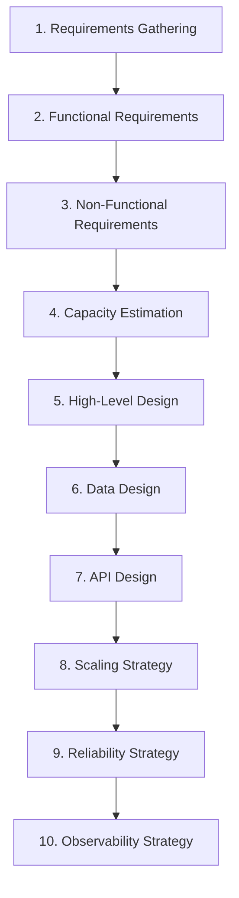

## Overview

The **system design process** is a repeatable workflow for turning ambiguous product goals into a defensible architecture. In senior and architect interviews (typically 45–60 minutes), this process structures your narrative so evaluators see **how you think**, not just the final diagram.

This page is the canonical **interview framework** for the System Design curriculum. It connects to [What Is System Design?](/system-design/what-is-system-design/) and delegates depth on NFRs and estimation to sibling foundation pages.

---

## Why It Matters

| Without a process | With a process |
| :--- | :--- |
| Random digressions into Kafka or sharding | Time-boxed depth on highest-risk areas |
| Missed requirements | Explicit MVP and assumptions |
| Diagram with no numbers | Capacity-grounded sizing |
| No trade-offs | Documented alternatives |

Production architects use the same steps in design reviews, RFCs, and PRRs — interviews test whether you can run the playbook under time pressure.

---

## Core Concepts

### System design interview framework (45-minute timeline)

| Minutes | Step | Deliverable |
| :---: | :--- | :--- |
| 0–5 | **Requirements gathering** | Functional list, assumptions, out-of-scope |
| 5–10 | **NFRs + capacity** | NFR table, rough QPS/storage |
| 10–20 | **High-level design** | Component diagram, data flow |
| 20–30 | **Data + API design** | Schema sketch, key endpoints |
| 30–40 | **Deep dives** | 2 hard problems (scale, consistency, fan-out) |
| 40–45 | **Reliability + observability** | SPOFs, SLOs, metrics, wrap-up |

### 1. Requirements gathering

Ask before drawing:

- Who are the users? B2C, B2B, internal?
- What is MVP vs phase 2?
- Read/write ratio? Global or single region?
- Consistency expectations? Can reads be stale?
- Regulatory constraints (PCI, HIPAA, GDPR)?

Document **assumptions** explicitly when the interviewer does not answer.

### 2. Functional requirements

List capabilities as verbs: *create*, *search*, *notify*, *pay*. Group by actor (user, admin, system). Mark **must-have** vs **nice-to-have** for time management.

### 3. Non-functional requirements

Translate product language into measurable targets. Use [Non-Functional Requirements](/system-design/non-functional-requirements/) for definitions and typical SLO bands.

### 4. Capacity estimation

Apply [Capacity Estimation](/system-design/capacity-estimation/) — DAU/MAU → QPS, storage growth, bandwidth, peak multipliers. Numbers justify caches, shards, and broker partitions.

### 5. High-level design

Draw **5–7 boxes**: clients, ingress, services, databases, cache, queue, external providers. Show sync vs async edges. Avoid premature microservice explosion — start with logical components.

### 6. Data design

Define core entities, primary keys, access patterns (read by ID, range, search). Note hot keys and growth. Link to [Data Management](/system-design/relational-database-fundamentals-and-b-trees/) fundamentals when storage choice matters.

### 7. API design

Specify 3–5 critical endpoints: method, path, request/response shape, idempotency, error codes. REST for public simplicity; gRPC for internal hot paths — see [REST vs gRPC](/system-design/application-layer-protocols-rest-grpc/).

### 8. Scaling strategy

| Tier | Typical lever |
| :--- | :--- |
| Stateless app | Horizontal scale + load balancer |
| Read-heavy | CDN + cache + read replicas |
| Write-heavy | Partitioning, async ingestion, sharding |
| Hot keys | Salting, local aggregation, dedicated shards |

[Horizontal vs Vertical Scaling](/system-design/horizontal-vs-vertical-scaling/) · [Scaling Strategies Overview](/system-design/scaling-strategies-overview/)

### 9. Reliability strategy

- Eliminate SPOFs — [SPOF & Redundancy](/system-design/single-point-of-failure-elimination-redundancy/)
- Multi-AZ / multi-region when NFR demands — [Multi-Region Topologies](/system-design/multi-region-topologies-and-availability-zones/)
- Timeouts, retries, circuit breakers on dependencies — [Resilience Patterns Overview](/system-design/resilience-patterns-overview/)
- Define availability target — [Availability & Nines](/system-design/availability-and-nines/)

### 10. Observability strategy

Define **SLIs** (latency, error rate, saturation), **golden signals** per service, and trace propagation across async boundaries — [Observability Fundamentals](/system-design/observability-fundamentals/). Application example: [Distributed Logging System](/system-design/distributed-logging-system/).

---

## Architect Perspective

### Step-by-step architect workflow (production)

| Step | Production artifact |
| :--- | :--- |
| Requirements | PRD + NFR appendix |
| Capacity | Capacity model spreadsheet / RFC section |
| HLD | Architecture diagram in RFC |
| Data | ER diagram + ownership matrix |
| API | OpenAPI / proto contracts |
| Scaling | Runbook + autoscaling policy |
| Reliability | SLO document + failure modes |
| Observability | Dashboards + alert policies |

Document decisions in ADRs — see Microservices [Architecture Decision Records](/microservices/10-production-playbook/architecture-decision-records/) for the production template.

### Interview vs production

| Aspect | Interview | Production |
| :--- | :--- | :--- |
| Depth | 2 deep dives max | Full RFC + review |
| Tools | Whiteboard / Excalidraw | Terraform, runbooks |
| Validation | Verbal trade-offs | Load test, chaos, PRR |

---

## Common Mistakes

| Mistake | Impact |
| :--- | :--- |
| Skipping capacity | Cannot justify cache or shard count |
| One giant microservice diagram | Hides data flow and bottlenecks |
| Deep dive on easy parts | Fails senior bar |
| No API or data model | Evaluators cannot verify feasibility |
| Ignoring observability | Signals immature production thinking |

---

## Interview Questions

1. **Walk me through how you would design a URL shortener in 45 minutes.**
2. **Where do you spend the first 10 minutes, and why?**
3. **How do you decide which two components to deep-dive?**
4. **What questions do you always ask the interviewer?**
5. **How does your interview process differ from writing an architecture RFC?**

**Practice case studies:** [URL Shortener](/system-design/urlshortner/) · [Notification System](/system-design/notification-system/) · [Distributed Rate Limiter](/system-design/distributed-rate-limiter/)

---

## Related Topics

- [What Is System Design?](/system-design/what-is-system-design/)
- [Non-Functional Requirements](/system-design/non-functional-requirements/)
- [Capacity Estimation](/system-design/capacity-estimation/)
- [Payment Gateway Orchestration](/system-design/payment-gateway-orchestration/) — complex NFR + reliability case study

---

## Deep Dive References

| Topic | Location |
| :--- | :--- |
| ADR format and lifecycle | [Microservices — ADRs](/microservices/10-production-playbook/architecture-decision-records/) |
| Production readiness PRR | [Microservices — Review Checklist](/microservices/10-production-playbook/architecture-review-checklist/) |
| Pattern selection ADRs | [Technology Playbook — Architecture Patterns](/technology-playbook/module-architecture-patterns/) |

**Architecture Styles:** [Architecture Styles Overview](/system-design/architecture-styles-overview/)

**Observability:** [Observability Fundamentals](/system-design/observability-fundamentals/)

**Reliability:** [Availability & Nines](/system-design/availability-and-nines/) · [Resilience Patterns Overview](/system-design/resilience-patterns-overview/) · [Failure Patterns Overview](/system-design/failure-patterns-overview/)

**Scalability:** [Latency vs Throughput](/system-design/latency-vs-throughput/) · [Horizontal vs Vertical Scaling](/system-design/horizontal-vs-vertical-scaling/) · [Scaling Strategies Overview](/system-design/scaling-strategies-overview/)

**Distributed Systems:** [CAP & PACELC](/system-design/cap-and-pacelc/) · [Consistency Models](/system-design/consistency-models/) · [Consistent Hashing](/system-design/consistent-hashing/)
