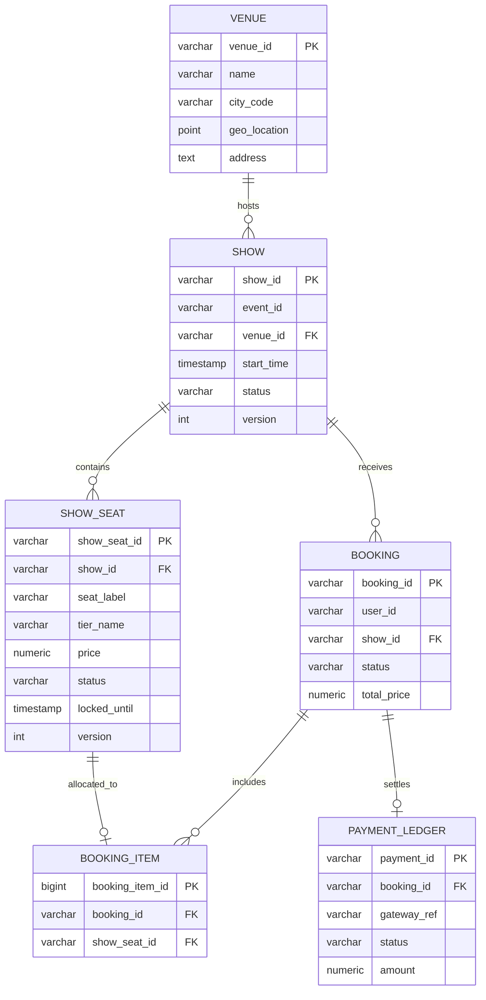
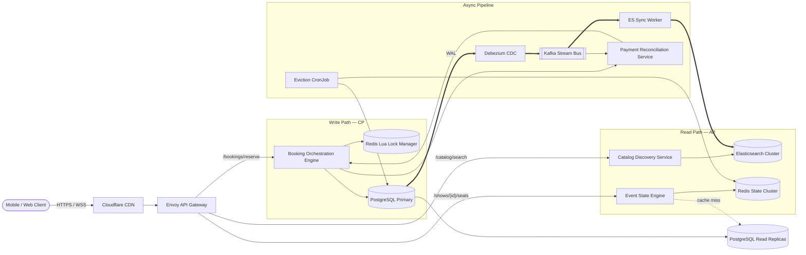
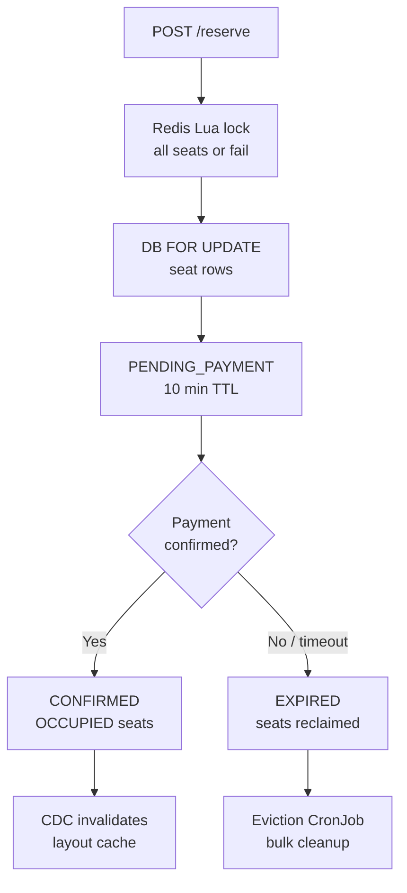
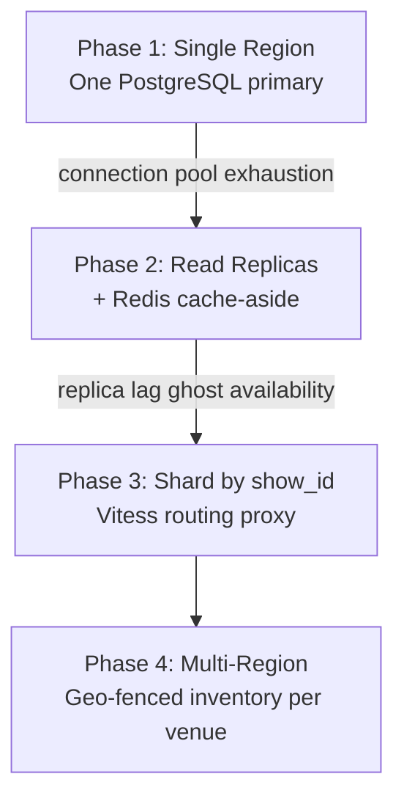
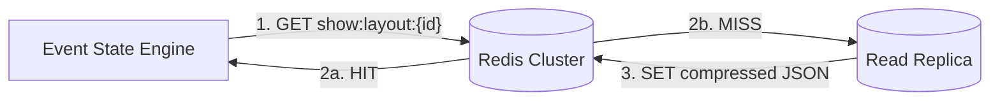

A ticket booking platform lets users search for movies, concerts, and live events, browse interactive seat layouts with real-time availability, hold seats during payment, and receive confirmed tickets. At scale it is **asymmetric by path**: catalog search and seat-map rendering favor **availability over strict consistency** (AP), while the reservation engine demands **linearizable inventory control** (CP) — a double-booked seat is never acceptable.

This post walks through the full design: requirements, capacity math, API contracts, data modeling, CDC-backed architecture, Redis Lua locking, technology trade-offs, caching, infrastructure sizing, and failure modes.

---

## 1. Requirements and Goals

### Functional Requirements (MVP)

| Requirement | Description |
| :--- | :--- |
| **Search & discovery** | Free-text search by keyword, location (city or lat/lng), and date/time windows. |
| **Catalog & metadata** | Rich event details — performers, descriptions, showtimes, venues, real-time inventory, interactive seat layout maps. |
| **Concurrent booking** | Two-phase flow: (1) atomic seat hold with TTL; (2) permanent allocation on payment confirmation. |
| **Booking history** | Ledger of successful, failed, and expired transactions per user. |

### Clarifying Assumptions

| Question | Assumption |
| :--- | :--- |
| Seats per transaction? | **6–10 max** — mitigates scalping, script abuse, and lock exhaustion. |
| Non-standard venues (festivals, open floor)? | Decouple abstract inventory count from physical maps; coordinate-based nested tiers in JSON; row/seat numbers as indexed relational records. |
| Payment processing? | **Fully offloaded** to third-party providers (Stripe, Adyen); confirmation via secure webhooks and async verification. |

### Non-Functional Requirements

| NFR | Target |
| :--- | :--- |
| **Scale** | **100M DAU**; 50,000 active shows globally; ~300 seats/venue |
| **Catalog / seat-map latency** | **P99 < 50 ms** |
| **Reservation mutation latency** | **P99 < 200 ms** |
| **Consistency** | **AP** for catalog/search; **CP** for booking/inventory (no double-booking) |
| **Read / write ratio** | **100 : 1** steady-state; shifts to **1 : 1** during major ticket drops |
| **Isolation** | Hot show sales must not starve other events on the platform |
| **Availability SLO** | **≥ 99.99%** for read-path search over rolling 30 days |

---

## 2. Back-of-the-Envelope Calculations

### Traffic Estimates

Starting from **100M DAU**, **5 searches/user**, **3 seat-layout views/user**, and **10% attempt 1 booking/day**:

| Metric | Calculation | Result |
| :--- | :--- | :--- |
| Searches / day | 100M × 5 | **500,000,000 / day** |
| Seat layout fetches / day | 100M × 3 | **300,000,000 / day** |
| Booking reservations / day | 100M × 10% × 1 | **10,000,000 / day** |
| Average read RPS | (500M + 300M) ÷ 86,400 | **~9,259 RPS** |
| Average write RPS | 10M ÷ 86,400 | **~116 RPS** |

### Flash-Sale Peak (20% of daily bookings in 10 minutes)

| Metric | Calculation | Result |
| :--- | :--- | :--- |
| Peak booking volume | 10M × 0.20 | **2,000,000 bookings** |
| Peak write RPS | 2M ÷ 600 s | **~3,333 RPS** |
| Target with 3× safety factor | 3,333 × 3 | **~10,000 write RPS** |
| Target peak read RPS | 9,259 × ~5.4 | **~50,000 read RPS** |

### Storage

| Dataset | Calculation | Result |
| :--- | :--- | :--- |
| Event catalog metadata | 50K shows × 50 KB | **~2.5 GB** (static) |
| Seat status rows (hot) | 50K × 5 showtimes × 300 seats × 200 B | **~15 GB / day** |
| Booking transaction logs | 10M/day × 1 KB | **~10 GB / day** |
| **Total accumulation** | 15 + 10 GB/day | **~25 GB/day (~9.1 TB/year)** excluding indices and replicas |

### Bandwidth

| Assumption | Calculation | Result |
| :--- | :--- | :--- |
| Avg read payload | 100 KB | — |
| Average egress | 9,259 RPS × 100 KB | **~926 MB/s (~7.4 Gbps)** |
| Peak egress | 50,000 RPS × 100 KB | **~5,000 MB/s (40 Gbps)** |

### Cache Sizing (Pareto: top 20% of events → 80% of traffic)

| Assumption | Calculation | Result |
| :--- | :--- | :--- |
| Hot shows (48 h window) | 50K × 2 days × 20% | **20,000 shows** |
| Cached seat statuses | 20K × 5 showtimes × 300 seats | **30,000,000 entries** |
| Bytes per Redis entry | ~128 B | **~3.84 GB** raw |
| Recommended cluster | + index overhead | **32 GB** (≈80% headroom) |

---

## 3. API Design

### Unified Search & Discovery

**`GET /api/v1/catalog/search`**

| Parameter | Type | Required | Notes |
| :--- | :--- | :--- | :--- |
| `query` | string | No | Free-text keyword |
| `location` | string | No | `lat,lon` or city code |
| `radius_km` | int | No | Geo filter radius |
| `start_date` | ISO 8601 date | No | Window start |
| `end_date` | ISO 8601 date | No | Window end |
| `page` | int | No | Default **1** |
| `size` | int | No | Default **20**; max **50** |

Response (`200 OK`):

```json
{
  "data": {
    "events": [
      {
        "event_id": "evt_987654321_xyz",
        "title": "Coldplay - Music of the Spheres",
        "category": "CONCERT",
        "venue": {
          "venue_id": "ven_112233",
          "name": "Narendra Modi Stadium",
          "coordinates": { "lat": 23.0917, "lon": 72.5975 }
        },
        "showtimes": [
          {
            "show_id": "shw_00112233",
            "timestamp": "2026-07-05T19:30:00Z",
            "currency": "INR",
            "price_tiers": [
              { "tier": "VIP", "price": 12500.00 },
              { "tier": "GA", "price": 3500.00 }
            ]
          }
        ]
      }
    ],
    "pagination": { "current_page": 1, "total_pages": 5, "total_elements": 94 }
  }
}
```

### Real-Time Seat Layout

**`GET /api/v1/shows/{show_id}/seats`**

Response (`200 OK`):

```json
{
  "data": {
    "show_id": "shw_00112233",
    "venue_id": "ven_112233",
    "layout": {
      "rows": [
        {
          "row_label": "A",
          "seats": [
            { "seat_id": "st_A_01", "tier": "VIP", "status": "AVAILABLE", "price": 12500.00 },
            { "seat_id": "st_A_02", "tier": "VIP", "status": "RESERVED", "price": 12500.00 }
          ]
        }
      ]
    }
  }
}
```

### Atomic Seat Reservation

**`POST /api/v1/bookings/reserve`**

Headers:

| Header | Required | Notes |
| :--- | :--- | :--- |
| `X-Idempotency-Key` | Yes | Client-generated; retries with same key return original hold |
| `Authorization` | Yes | Bearer JWT |

Request:

```json
{
  "show_id": "shw_00112233",
  "seat_ids": ["st_A_01", "st_A_03"]
}
```

Response (`201 Created`):

```json
{
  "data": {
    "booking_id": "bkg_5544332211_qwe",
    "status": "PENDING_PAYMENT",
    "reserved_seats": ["st_A_01", "st_A_03"],
    "expires_at": "2026-06-26T10:43:00Z",
    "total_amount": 25000.00,
    "currency": "INR"
  }
}
```

### Booking Confirmation

**`POST /api/v1/bookings/{booking_id}/confirm`**

Request:

```json
{
  "payment_reference_id": "tx_pay_99881122",
  "payment_gateway": "STRIPE",
  "amount_paid": 25000.00
}
```

Response (`200 OK`):

```json
{
  "data": {
    "booking_id": "bkg_5544332211_qwe",
    "status": "CONFIRMED",
    "ticket_verification_hash": "sha256_e3b0c44298fc1c149afbf4c8996fb92427ae41e4649b934ca495991b7852b855"
  }
}
```

### Error Matrix

| HTTP | Code | Condition |
| :--- | :--- | :--- |
| `409` | `ERR_SEAT_ALREADY_LOCKED` | Seat held by another transaction |
| `410` | `ERR_RESERVATION_EXPIRED` | 10-minute payment window lapsed |
| `400` | `ERR_IDEMPOTENCY_MISMATCH` | Body changed under same idempotency key |
| `422` | `ERR_MAX_LIMIT_EXCEEDED` | Per-user seat limit (6–10) exceeded |

### Idempotency Protocol

1. Gateway extracts `X-Idempotency-Key`.
2. Lookup `idempotency:bkg:{key}` in Redis — if hit, return cached response verbatim.
3. On miss, acquire short-lived lock; execute reservation once; cache result for **24 h**.

---

## 4. Data Model



### `venues`

| Column | Type | Notes |
| :--- | :--- | :--- |
| `venue_id` | `VARCHAR(64)` | PK |
| `name` | `VARCHAR(255)` | Display name |
| `city_code` | `VARCHAR(32)` | Indexed for regional catalog |
| `geo_location` | `POINT` | Spatial queries |
| `address` | `TEXT` | Full postal address |

### `show_seats` (transactional core)

| Column | Type | Notes |
| :--- | :--- | :--- |
| `show_seat_id` | `VARCHAR(128)` | PK — `{show_id}:{seat_id}` |
| `show_id` | `VARCHAR(64)` | FK → `shows` |
| `seat_label` | `VARCHAR(16)` | e.g. `A-12` |
| `tier_name` | `VARCHAR(32)` | `VIP`, `BALCONY`, `GA` |
| `price` | `NUMERIC(12,2)` | Snapshot at show creation |
| `status` | `VARCHAR(32)` | `AVAILABLE`, `RESERVED`, `OCCUPIED` |
| `locked_until` | `TIMESTAMPTZ` | Nullable; set during hold |
| `version` | `INT` | Optimistic concurrency guard |

Partial index for hot reads:

```sql
CREATE INDEX idx_show_seats_engine
  ON show_seats(show_id, status)
  WHERE status = 'AVAILABLE';
```

### `booking_items`

| Constraint | Purpose |
| :--- | :--- |
| `UNIQUE (show_seat_id)` | One active booking per seat — structural double-booking prevention |

### Normalization Strategy

| Store | Role |
| :--- | :--- |
| **PostgreSQL** | Normalized 3NF — seats, bookings, payments (ACID source of truth) |
| **Cassandra / ScyllaDB** | Denormalized catalog — event descriptions, media, schedules (AP reads) |
| **Elasticsearch** | Full-text + geo search index (synced via CDC) |

Writes go to PostgreSQL only; **Debezium CDC** syncs to Elasticsearch and cache invalidation workers — no application-level dual-write.

---

## 5. High-Level Architecture



### Read Path — Search & Seat Maps

1. Client queries `/catalog/search` with keyword, location, and date window.
2. **Catalog Discovery Service** runs full-text + geo query against **Elasticsearch**.
3. Client fetches `/shows/{show_id}/seats` from **Event State Engine**.
4. Engine reads compressed layout JSON from **Redis** (`show:layout:{show_id}`); on miss, hydrates from read replica and populates cache.
5. Availability display is eventually consistent — acceptable for browsing; checkout re-validates under lock.

### Write Path — Reservation

1. Gateway validates JWT, rate limits, and idempotency key.
2. **Booking Orchestration Engine** executes atomic **Redis Lua script** across all target seat keys (`lock:show:{id}:seat:{seat_id}`, **600 s TTL**).
3. On lock success, opens DB transaction with `SELECT ... FOR UPDATE` on `show_seats` rows.
4. Transitions seats to `RESERVED`, inserts `bookings` + `booking_items`, commits.
5. On any failure, releases Redis leases in `catch` block.
6. Returns `201` with `expires_at`.

### Payment Confirmation

1. External gateway calls webhook → **Payment Reconciliation Service**.
2. Service publishes confirmation event to **Kafka**; consumer invokes confirm on Booking Engine.
3. Seats transition to `OCCUPIED`; booking → `CONFIRMED`; cache key invalidated via CDC pipeline.
4. On expired hold, **Eviction CronJob** bulk-releases seats and marks booking `EXPIRED`.

---

## 6. Reservation Concurrency & ID Generation

### Redis Lua Multi-Seat Lock

All seats in a request must lock atomically — partial locks would leave orphaned holds.

```java
// Atomic multi-resource isolation — all-or-nothing
private static final String LUA_RESERVE_SCRIPT =
    "for i, key in ipairs(KEYS) do " +
    "    if redis.call('EXISTS', key) == 1 then return 0; end " +
    "end " +
    "for i, key in ipairs(KEYS) do " +
    "    redis.call('SET', key, ARGV[1], 'EX', ARGV[2]); " +
    "end " +
    "return 1;";
```

| Step | Layer | Action |
| :--- | :--- | :--- |
| 1 | Redis | Lua script acquires all seat leases or returns 0 |
| 2 | PostgreSQL | `SELECT ... FOR UPDATE` on targeted `show_seats` |
| 3 | PostgreSQL | Verify `AVAILABLE`; set `RESERVED` + `locked_until` |
| 4 | PostgreSQL | Insert `bookings` + `booking_items` in same transaction |
| Rollback | Redis | Release leases if DB transaction fails |

### Two-Phase State Machine



### Pessimistic vs Optimistic Locking

| Approach | Verdict |
| :--- | :--- |
| **Redis Lua + `FOR UPDATE`** | **Selected** for flash sales — fails fast; avoids optimistic retry storms |
| Optimistic (`version` column only) | High abort rate when thousands compete for same seats |
| `SERIALIZABLE` isolation | Excessive rollbacks; connection pool exhaustion |

Application sorts seat IDs before locking to prevent deadlocks on multi-seat bookings.

### Distributed ID Generation — Snowflake

| Strategy | Verdict |
| :--- | :--- |
| **Snowflake (64-bit)** | **Selected** — time-ordered, collision-free, index-friendly |
| UUIDv4 | Random; causes B-tree page fragmentation |
| DB auto-increment | Single-writer bottleneck |

Snowflake layout: 41-bit timestamp + 10-bit machine ID + 12-bit sequence → sortable `booking_id` without coordination per request.

---

## 7. Database Selection and Scaling

### Technology Comparison

| Database | Why choose | Why not |
| :--- | :--- | :--- |
| **PostgreSQL** | ACID, `FOR UPDATE`, FK integrity, partial indexes | Vertical ceiling; needs sharding at extreme scale |
| **MongoDB** | Flexible seat-map JSON | Multi-document transactions unstable under concurrent seat writes |
| **Cassandra** | Massive catalog read scale | No cross-row ACID — unsuitable as seat inventory source of truth |

### Lock Coordinator Comparison

| Approach | Verdict |
| :--- | :--- |
| **Redis Lua scripts** | **Selected** — 100K+ ops/sec, sub-ms latency |
| ZooKeeper / etcd | Raft/Paxos disk quorum adds write-path latency during drops |

### Scaling Roadmap



| Phase | Trigger | Strategy |
| :--- | :--- | :--- |
| 1 | Startup baseline | Single primary behind K8s + Envoy |
| 2 | Primary CPU > 75% | Read replicas for seat layouts + history; Redis cache-aside |
| 3 | Hot show row contention | Shard by `show_id` — all seats for one show on one shard |
| 4 | Global expansion | Geo-fenced deployments; London show inventory never crosses shards with Mumbai |

**Cross-region contract:** Shows are bound to a physical venue region. No cross-continent distributed transactions for bookings — global catalog syncs asynchronously via Kafka.

---

## 8. Caching Strategy

**Cache-aside** for seat layouts; **invalidation** (not in-place mutation) on confirmed bookings.



| Policy | Detail |
| :--- | :--- |
| **Key pattern** | `show:layout:{show_id}` — single compressed JSON blob per show |
| **TTL** | **30–60 s** with jitter — prevents thundering herd on expiry |
| **Eviction** | All-keys LRU under memory pressure |
| **Mutation** | Invalidate key on `CONFIRMED` / `EXPIRED`; next read repopulates from replica |
| **Checkout pin** | Active reservation path reads **primary** for seat status — not replica |
| **CDC sync** | Debezium streams WAL changes; workers invalidate or warm hot keys |

### Sizing

| Item | Value |
| :--- | :--- |
| Hot seat status entries | ~30M × 128 B ≈ **3.84 GB** |
| Cluster recommendation | **16 shards**, primary-replica, **64 GB** total pool |
| Headroom | ~80% free for connection tables and serialization overhead |

---

## 9. Capacity Planning

Infrastructure sized for **50,000 peak read RPS** and **10,000 peak write RPS**:

| Component | Instances | Per-Instance Spec | Notes |
| :--- | :--- | :--- | :--- |
| **Catalog Service** | 20–80 pods (HPA) | 2 vCPU, 4 GB | Scale on CPU @ 65% |
| **Event State Engine** | 30–100 pods (HPA) | 2 vCPU, 4 GB | Socket-heavy; scale on connection count |
| **Booking Orchestration** | 40–150 pods (HPA) | 2 vCPU, 4 GB | Fixed thread pool per pod; JVM `-XX:MaxRAMPercentage=75` |
| **Redis Cluster** | 16 shards | Primary-replica | **64 GB** memory pool |
| **Kafka Brokers** | 5 nodes | NVMe SSD | 24 partitions on transaction topics |
| **Elasticsearch** | Scale on queue depth | — | Add data nodes when thread pool backlog > 200 for 3 min |
| **PostgreSQL** | 1 primary + replicas | — | Patroni failover; ~9 TB/year growth at scale |
| **Network egress** | — | — | **40 Gbps** peak |

### High Availability & DR

| Metric | Target |
| :--- | :--- |
| **RPO** | < 1 minute — WAL streamed to cold storage |
| **RTO** | < 5 minutes — pre-warmed infra + automated failover |
| **AZ failure** | Multi-AZ sync replica; NLB reroutes in milliseconds |
| **Primary DB crash** | Patroni promotes standby in **< 15 s**; gateway returns retry-backoff |

### Security Controls

| Control | Detail |
| :--- | :--- |
| **Identity** | OAuth2/JWT validated at Envoy before routing |
| **Rate limiting** | 60 req/min per IP; **5 req/min** on `/reserve` per account |
| **Encryption** | TLS 1.3 in transit; AES-256 at rest |
| **Injection** | Parameterized ORM queries only |

### Observability

| Signal | Tooling |
| :--- | :--- |
| Latency / traffic / errors / saturation | Prometheus → Grafana |
| Distributed traces | `X-Correlation-ID` → OpenTelemetry / Jaeger |
| Booking SLO | 99% of seat allocations **< 200 ms** |

---

## 10. Key Design Decisions Summary

| Decision | Choice | Rationale |
| :--- | :--- | :--- |
| CAP segregation | AP catalog, CP booking | Browse during partition; never double-book |
| Inventory source of truth | PostgreSQL `show_seats` | ACID + `FOR UPDATE` + unique seat constraint |
| Short-term hold | Redis Lua all-or-nothing lock | Sub-ms contention layer; 10 min TTL |
| Search index sync | Debezium CDC → Kafka → ES | Eliminates dual-write drift |
| Seat map cache | Invalidate-on-write | Avoids patching JSON in place |
| Sharding key | `show_id` | Co-locates all seats for one showtime |
| ID generation | Snowflake | Time-ordered, index-friendly booking IDs |
| Payment | Offloaded + webhook confirm | PCI scope reduction; async reconciliation |
| Geo model | Region-fenced inventory | No cross-region distributed transactions |
| Concurrency | Pessimistic locks | Flash-sale reliability over optimistic retries |
| Rate limiting | Token bucket at Envoy | Scalper and bot mitigation |

---

## 11. Failure Modes and Mitigations

| Failure | Impact | Mitigation |
| :--- | :--- | :--- |
| Redis node failure | Distributed locks lost; race on DB layer | Promote replica; booking service falls back to `FOR UPDATE` only until cluster heals |
| Redis / DB out of sync | Stale lock or ghost availability | DB is source of truth; `catch` releases Redis; background reconciliation scans anomalies |
| Kafka broker crash | ES index lag; payment callback delay | Buffered in upstream; partition reassignment; booking path unaffected |
| Elasticsearch lag | Stale search results post-booking | User-scoped client marker after successful reserve |
| Primary DB offline | No new reservations | Patroni failover < 15 s; gateway retry-backoff screen |
| Replica lag during browse | User sees available seat that is taken | Checkout re-validates under `FOR UPDATE`; returns `409` if taken |
| Payment arrives after TTL | Risk of selling same seat | Re-verify inventory on confirm; auto-refund if seats gone |
| Eviction CronJob delayed | Seats stuck in `RESERVED` | Short Redis TTL + DB `locked_until` sweep; monitor cron lag |
| Hot show cache expiry | Thundering herd on one layout key | TTL jitter; probabilistic early refresh (XFetch) |
| Idempotency key collision | Duplicate holds on retry | Redis idempotency cache returns original `201` response |
| Cross-AZ network partition | Regional catalog degraded | AP mode: serve cached catalog; CP mode: reject writes until quorum |

---

## Interview Highlights

Condensed answers to common senior/staff-level probes:

| Question | Answer |
| :--- | :--- |
| Why Redis before PostgreSQL? | Memory-layer fails fast under flash-sale contention; DB holds authoritative state. |
| Why not dual-write to PG and cache? | Partial failures cause drift; CDC from committed WAL is safe. |
| Optimistic vs pessimistic for seats? | Pessimistic + Redis for drops; optimistic causes retry storms on last seats. |
| How prevent double-booking? | Lua all-or-nothing lock + `FOR UPDATE` + `UNIQUE(show_seat_id)` on booking_items. |
| Why shard by `show_id`? | All seat mutations for one show co-located — no cross-shard distributed transactions. |
| How handle irregular venues? | JSON coordinate maps for display; relational seat rows for inventory state. |
| Why Snowflake over UUID? | Chronological B-tree inserts; no coordination hot spot like auto-increment. |
| What if Redis lock succeeds but DB fails? | `try/catch` releases Redis leases immediately; DB never commits partial state. |
| How isolate hot shows? | Per-show sharding + dedicated rate limits + separate Kafka partition ordering by `show_id`. |
| Payment webhook replay? | Idempotent confirm handler keyed on `payment_reference_id`. |

---

## What's Next

Future posts in this series will cover adjacent designs — waitlist queueing for sold-out drops, dynamic pricing propagation, and multi-region active-active catalog with geo-fenced inventory failover.
