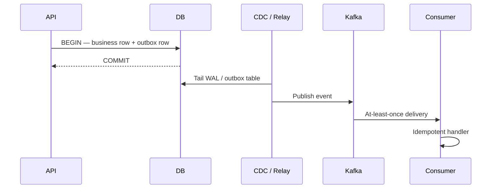

## Overview

The **transactional outbox** pattern writes business data and an **outbox event row** in the **same database transaction**, then publishes to a message broker asynchronously (via log tailing / CDC). This avoids the **dual-write problem** — committing to DB while Kafka publish fails (or vice versa).

This page is the System Design **overview**. CDC connectors, Debezium config, and inbox variants live in Microservices.

---

## Why It Matters

| Dual-write failure | Outcome |
| :--- | :--- |
| DB commit OK, broker fail | Downstream never learns of event |
| Broker OK, DB rollback | Phantom events in consumers |
| Partial retry | Duplicate or lost side effects |

Patterns that need reliable side effects — notifications, email, enrollment, payments — use outbox or saga coordination.

---

## Core Concepts

### Flow

| Step | Guarantee |
| :--- | :--- |
| Same transaction | Business state and outbox row commit atomically |
| CDC relay | At-least-once publish after commit |
| Consumer | Idempotent processing (dedupe key) |

### Outbox vs direct publish

| Approach | Risk |
| :--- | :--- |
| Publish then DB | Phantom event if DB rolls back |
| DB then publish (no outbox) | Lost event if broker down at commit time |
| **Transactional outbox** | No dual-write; lag bounded by CDC |

### CDC and cache invalidation

CDC also drives **cache eviction** and read-model projections — see [CDC-Based Cache Invalidation](/system-design/cdc-based-cache-invalidation/) for the invalidation angle only (not full outbox mechanics).

### Applied in case studies

| Case study | Outbox role |
| :--- | :--- |
| [Notification System](/system-design/notification-system/) | Durable ingest before Kafka fan-out |
| [Email Delivery](/system-design/email-delivery/) | Send pipeline entry guarantee |
| [Hotel Booking](/system-design/hotel-booking/) | Booking confirmed → search index event |
| [E-Commerce](/system-design/ecommerce/) | Payment log + order events |
| [Stock Broker](/system-design/stock-broker-trading/) | Order lifecycle events |
| [Online Learning Platform](/system-design/online-learning-platform/) | Enrollment checkout events |

---

## Architect Perspective

### Interview answer

1. **Problem** — cannot atomically write DB + message broker
2. **Solution** — outbox table in same transaction as business write
3. **Relay** — Debezium / polling publisher reads committed rows
4. **Consumer** — idempotent, at-least-once safe
5. **Trade-off** — seconds of publish lag vs correctness

---

## Common Mistakes

| Mistake | Fix |
| :--- | :--- |
| No idempotency on consumer | Duplicate charges / emails |
| Outbox table unmonitored | Silent lag growth |
| Publishing before commit | Phantom events |
| Confusing with inbox pattern | Inbox = consumer-side dedupe store |

---

## Interview Questions

1. **Why not publish to Kafka directly after a DB write?**
2. **How does the transactional outbox work?**
3. **What is at-least-once delivery and how do consumers cope?**
4. **How does Debezium fit into the outbox pattern?**
5. **Outbox vs saga — when do you choose each?**

---

## Related Topics

- [CQRS Overview](/system-design/cqrs-overview/)
- [CDC-Based Cache Invalidation](/system-design/cdc-based-cache-invalidation/)
- [Notification System](/system-design/notification-system/)
- [Database Transactions & ACID](/system-design/database-transactions-and-acid-isolation/)

---

## Deep Dive References

| Topic | Location |
| :--- | :--- |
| Outbox & CDC (PRIMARY) | [Microservices — Outbox & CDC](/microservices/03-data-management/outbox-and-cdc/) |
| Pattern selection ADR | [Technology Playbook — Outbox Pattern](/technology-playbook/outbox-pattern/) |
