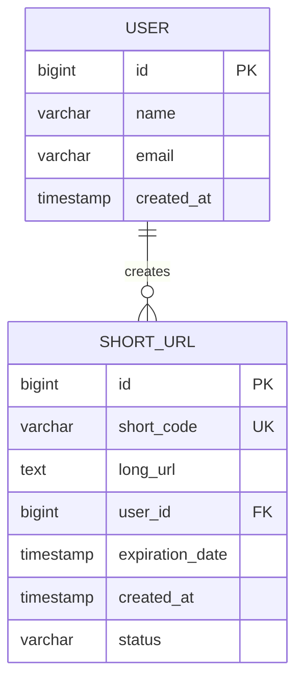
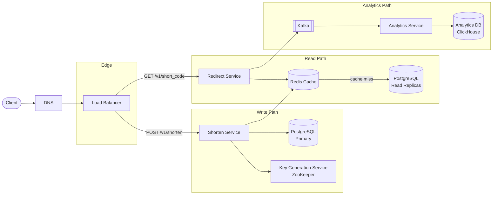
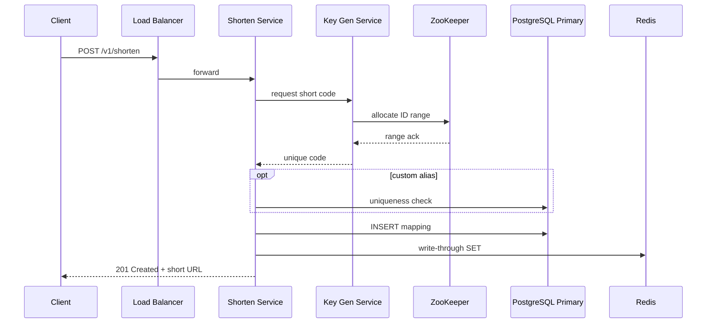
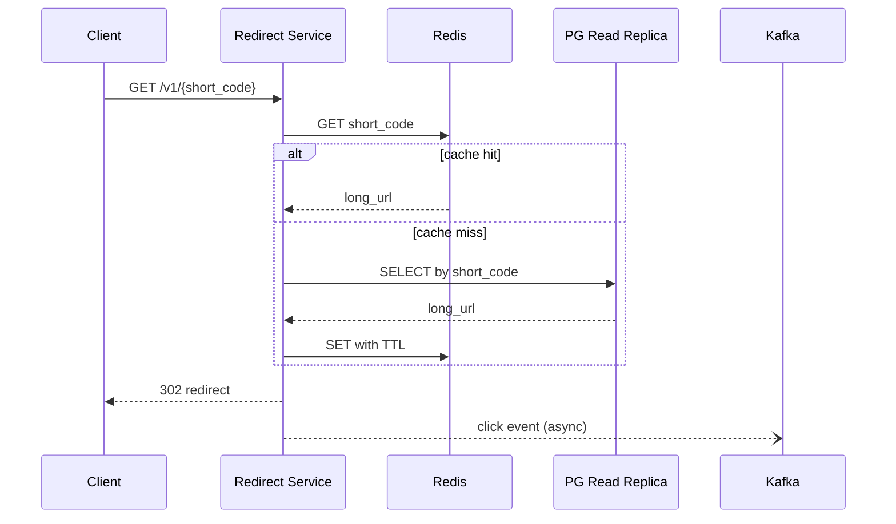
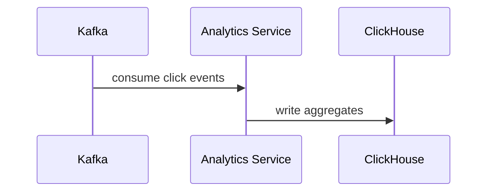
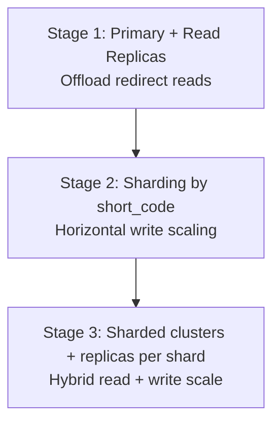

A URL shortener maps long URLs to compact, shareable links and redirects users on every click. At scale it is a **read-heavy, latency-sensitive** system: writes are infrequent relative to redirects, but both paths must stay highly available.

This post captures the full design — from requirements and back-of-the-envelope math through API contracts, data modeling, architecture, technology choices, and capacity planning.

---

## 1. Requirements and Goals

### Functional Requirements (MVP)

| Requirement | Description |
| :--- | :--- |
| **Long URL → Short URL** | Accept a long URL and return a unique short link. |
| **Short URL → Long URL** | Resolve a short code and redirect the user to the original long URL. |
| **Throughput** | Support **1 million URL creations per day**. |

### Premium Features

| Feature | Description |
| :--- | :--- |
| **Custom alias** | Vanity short code chosen by the user (e.g. `tiny.cc/my-brand`). |
| **Custom expiration** | Set an expiry date after which the link stops redirecting. |
| **Analytics** | Track click counts and related metrics per short URL. |

### Non-Functional Requirements

| NFR | Target |
| :--- | :--- |
| **Scale** | 1 billion total generated URLs over 10 years |
| **Availability** | High availability prioritized over strict consistency |
| **Performance** | Low latency for redirection |
| **Read / Write ratio** | **100 : 1** (read-heavy — ~99% reads, ~1% writes) |

---

## 2. Back-of-the-Envelope Calculations

Traffic shape drives cache sizing, replica count, and broker capacity.

### Traffic Estimates

Starting from **1M URL creations/day** and a **100:1 read/write ratio**:

| Metric | Calculation | Result |
| :--- | :--- | :--- |
| Write requests / day | Given | **1 million / day** |
| Read requests / day | 1M × 100 | **100 million / day** |
| Average write RPS | 1M ÷ 86,400 s | **~12 WPS** |
| Average read RPS | 100M ÷ 86,400 s | **~1,200 RPS** |

### Peak Traffic (10× – 20× burst)

| Metric | Multiplier | Peak |
| :--- | :--- | :--- |
| Write RPS | 10× average | **~120 WPS** |
| Read RPS | 10× – 20× average | **~12,000 – 24,000 RPS** |

At peak, read throughput tracks **100× peak write** (preserving the 100:1 ratio): 120 WPS × 100 = **12,000 read RPS**.

### Storage

| Assumption | Calculation | Result |
| :--- | :--- | :--- |
| Total URLs (10-year horizon) | Given | **1 billion** |
| Bytes per record | short code + long URL + metadata + indexes | **~500 bytes** |
| Total storage | 1B × 500 B | **~500 GB** |

### Bandwidth

| Path | Estimate |
| :--- | :--- |
| Read peak | ~18 MB/s |
| Write peak | ~120 KB/s |

> The capacity planning section below sizes infrastructure with additional headroom beyond these MVP averages to absorb traffic growth and burst spikes.

---

## 3. API Design

| # | Method | Path | Purpose |
| :---: | :--- | :--- | :--- |
| 1 | POST | `/v1/shorten` | Create a short URL |
| 2 | GET | `/v1/{short_code}` | Redirect to the original long URL |



```json
{
  "long_url": "https://example.com/some/very/long/path",
  "custom_alias": "my-brand",
  "expiry_date": "2026-12-31"
}
```

| Field | Required | Notes |
| :--- | :--- | :--- |
| `long_url` | Yes | Must be a valid URL |
| `custom_alias` | No | Premium feature; must be globally unique |
| `expiry_date` | No | Premium feature; defaults to no expiration |


```json
{
  "short_url": "https://tiny.cc/my-brand"
}
```


| Code | Condition |
| :--- | :--- |
| `400 Bad Request` | Invalid or missing `long_url` |
| `409 Conflict` | `custom_alias` already taken |
| `422 Unprocessable Entity` | Malformed `expiry_date` |



{{< api-endpoint method="GET" path="/v1/{short_code}" desc="Redirect to the original long URL" >}}

Returns a `Location` header pointing to the mapped long URL.


| Code | Condition |
| :--- | :--- |
| `302 Found` | Short code exists and is not expired — redirect with `Location: <long_url>` |
| `404 Not Found` | Short code does not exist |
| `410 Gone` | Short code expired |


**302 (temporary redirect)** is preferred over 301 — it allows updating the destination URL later and avoids permanent browser caching before analytics are recorded.



---

## 4. Data Model



### `USER`

| Column | Type | Notes |
| :--- | :--- | :--- |
| `id` | `BIGINT` | Primary key |
| `name` | `VARCHAR` | Display name |
| `email` | `VARCHAR` | Unique login identifier |
| `created_at` | `TIMESTAMP` | Account creation time |

### `SHORT_URL`

| Column | Type | Notes |
| :--- | :--- | :--- |
| `id` | `BIGINT` | Primary key (internal) |
| `short_code` | `VARCHAR` | **Unique** — the public identifier |
| `long_url` | `TEXT` | Original destination |
| `user_id` | `BIGINT` | FK → `USER.id` (nullable for anonymous) |
| `expiration_date` | `TIMESTAMP` | Nullable — no expiry if null |
| `created_at` | `TIMESTAMP` | Record creation time |
| `status` | `VARCHAR` | `ACTIVE`, `EXPIRED`, `DISABLED` |

**Indexing:** unique index on `short_code` (every redirect lookup). Secondary index on `user_id` for analytics dashboard queries.

---

## 5. High-Level Architecture



### Write Path — Shorten Service



### Read Path — Redirect Service



### Analytics Path



Decoupling analytics from the redirect hot path keeps redirect latency stable.

---

## 6. Short Code Generation

| Strategy | How it works | Pros | Cons |
| :--- | :--- | :--- | :--- |
| **Hash-based** | Hash `long_url + salt`, base-62 encode, truncate | Deterministic; same URL → same code | Collisions require retry; not suitable for custom aliases |
| **Counter-based (KGS)** | Pre-allocate ID ranges per server via ZooKeeper; encode to base-62 | Collision-free; predictable length | Requires coordination service |

**Recommended:** counter-based generation via KGS for default codes; direct insert with uniqueness check for custom aliases.

A base-62 encoding of a 64-bit counter yields a 7-character code — enough for trillions of unique URLs.

---

## 7. Database Selection and Scaling

### Technology Comparison

| Database | Why choose | Why not |
| :--- | :--- | :--- |
| **PostgreSQL / MySQL** | ACID compliance, mature tooling, simple relational model, strong write consistency | Vertical scaling ceiling; sharding adds operational complexity |
| **MongoDB** | Flexible schema, horizontal scaling via sharding | Weaker relational modeling; joins are inefficient |
| **Cassandra** | Massive write throughput, global distribution, high availability | Eventual consistency; no native joins; higher operational overhead |

### Decision

**Start with PostgreSQL (or MySQL).** At ~12 WPS average the write volume is well within a single primary's capacity. ACID transactions simplify uniqueness guarantees on `short_code`.

Consider **Cassandra** only when the system needs global multi-region distribution with very high write/read availability.

### Scaling Strategy

| Technique | Purpose |
| :--- | :--- |
| **Vertical scaling** | Increase CPU/RAM/disk on the primary as a first step |
| **Read replication** | 1 primary (writes) + N read replicas (redirect lookups) |
| **Sharding** | Partition data across multiple database nodes by `short_code` hash when storage or write throughput exceeds single-node limits |



---

## 8. Caching Strategy

**Redis** is chosen for the redirect hot path:

| Property | Benefit |
| :--- | :--- |
| Sub-millisecond reads | Meets low-latency redirect budget |
| Native TTL | Automatically evicts expired links |
| LRU eviction | Keeps hottest URLs in memory under pressure |
| High throughput | 50K+ ops/sec per node |

### Cache Flow

**On create (write-through):**

1. Shorten Service persists to PostgreSQL primary.
2. Immediately writes `short_code → long_url` to Redis with TTL.

**On redirect (cache-aside):**

1. Check Redis for `short_code`.
2. **Hit** → return long URL.
3. **Miss** → query read replica → populate Redis with TTL = `min(default_ttl, time_until_expiration)`.
4. On update/delete → invalidate or overwrite cache key.

### Sizing

Assume **20 million hot URLs** at ~400 bytes each:

```
20M × 400 B ≈ 8 GB data + replication overhead ≈ 16 GB total
```

Recommended cluster: **3 masters + 3 replicas** for HA and read distribution.

---

## 9. Capacity Planning

Infrastructure sized for growth headroom and peak burst beyond MVP averages:

| Component | Metric | Calculation / Assumption | Recommendation |
| :--- | :--- | :--- | :--- |
| **Shorten Service** | Peak write traffic | ~3,000 WPS | **8 pods** (6 required + buffer) |
| | Capacity per pod | ~500 WPS | 2 vCPU, 4 GB RAM |
| **Redirect Service** | Peak read traffic | ~55,000 RPS | **25 pods** (22 required + buffer) |
| | Capacity per pod | ~2,500 RPS | 2 vCPU, 4 GB RAM |
| **Redis Cluster** | Hot URL memory | 20M × 400 B ≈ 8 GB | **16 GB** total |
| | Topology | HA + read scaling | 3 masters + 3 replicas |
| **PostgreSQL** | Storage growth | ~500 MB/day at MVP; up to ~20 GB/day at scale | **1 primary + 2 read replicas** |
| | 10-year total | 1B URLs × 500 B | ~500 GB |
| **Kafka** | Peak event rate | ~55K events/sec | **3 brokers** (HA) |
| **Network** | Peak throughput | 55K RPS × 1 KB | ~55 MB/s (~440 Mbps) |

---

## 10. Key Design Decisions Summary

| Decision | Choice | Rationale |
| :--- | :--- | :--- |
| Separate read/write services | Shorten + Redirect | Independent scaling; redirect path stays lean |
| Redirect HTTP status | 302 Found | Allows URL updates; avoids permanent browser caching |
| Primary datastore | PostgreSQL | ACID, uniqueness, manageable write volume |
| Read cache | Redis with TTL + LRU | Sub-ms lookups; natural expiration; hot-set retention |
| Cache on write | Write-through from Shorten Service | Eliminates cache miss on first redirect |
| Analytics | Kafka → ClickHouse | Async pipeline; columnar store for click aggregates |
| Short code generation | KGS + ZooKeeper | Collision-free, distributed ID allocation |
| Consistency model | Strong on write, eventual on read | Acceptable for redirects; brief cache lag tolerated |

---

## 11. Failure Modes and Mitigations

| Failure | Impact | Mitigation |
| :--- | :--- | :--- |
| Redis unavailable | Higher DB load, increased latency | Fall through to read replica; circuit breaker; Redis cluster with replicas |
| Read replica lag | Stale redirect after recent create | Write-through cache on create ensures Redis is warm |
| Kafka down | Analytics gap; redirects unaffected | Local buffer with back-pressure; redirect path has no Kafka dependency |
| KGS / ZooKeeper down | Cannot create new short URLs | Pre-allocated ID ranges per node as buffer; redirects still work |
| Primary DB down | No new URLs; reads from replica | Automatic failover to standby primary; redirects continue via cache + replicas |

---

## What's Next

Future posts in this series will cover adjacent designs — rate limiting, multi-region deployment, and migration from PostgreSQL to Cassandra when write throughput demands it.
